# 第1章 MapReduce概述

## 1.1 MapReduce定义

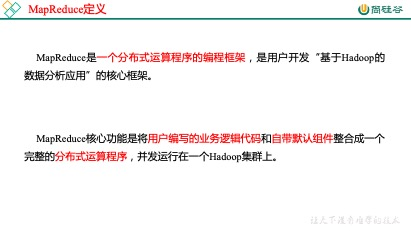

图1-1 MapReduce的定义

## 1.2 MapReduce优缺点

### 1.2.1 优点

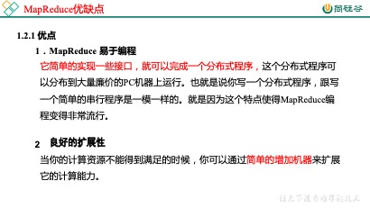

图1-2 MapReduce的优缺点

图1-3 MapReduce的优缺点

 

### 1.2.2 缺点

**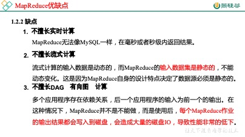**

图1-4 MapReduce的优缺点

 

## 1.3 MapReduce核心思想

MapReduce核心编程思想，如图1-5所示。

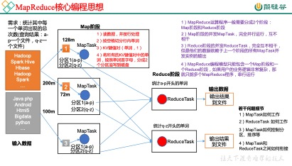

图1-5 MapReduce核心编程思想

1）分布式的运算程序往往需要分成至少2个阶段。

2）第一个阶段的MapTask并发实例，完全并行运行，互不相干。

3）第二个阶段的ReduceTask并发实例互不相干，但是他们的数据依赖于上一个阶段的所有MapTask并发实例的输出。

4）MapReduce编程模型只能包含一个Map阶段和一个Reduce阶段，如果用户的业务逻辑非常复杂，那就只能多个MapReduce程序，串行运行。

总结：分析WordCount数据流走向深入理解MapReduce核心思想。

## 1.4 MapReduce进程

图1-6 MapReduce的重要进程

## 1.5 官方WordCount源码

采用反编译工具反编译源码，发现WordCount案例有Map类、Reduce类和驱动类。且数据的类型是Hadoop自身封装的序列化类型。

## 1.6 常用数据序列化类型

表1-1 常用的数据类型对应的Hadoop数据序列化类型

| **Java****类型** | **Hadoop Writable****类型** |
| ---------------- | --------------------------- |
| Boolean          | BooleanWritable             |
| Byte             | ByteWritable                |
| Int              | IntWritable                 |
| Float            | FloatWritable               |
| Long             | LongWritable                |
| Double           | DoubleWritable              |
| String           | Text                        |
| Map              | MapWritable                 |
| Array            | ArrayWritable               |

## 1.7 MapReduce编程规范

用户编写的程序分成三个部分：Mapper、Reducer和Driver。

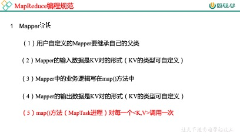

图1-7 MapReduce的编程规范

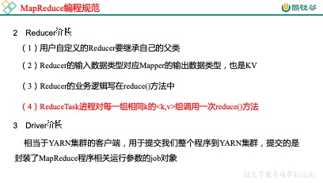

图1-8 MapReduce的编程规范

 

## 1.8 WordCount案例实操

1．需求

在给定的文本文件中统计输出每一个单词出现的总次数

（1）输入数据

（2）期望输出数据

atguigu  2

banzhang 1

cls  2

hadoop  1

jiao 1

ss  2

xue 1

2．需求分析

按照MapReduce编程规范，分别编写Mapper，Reducer，Driver，如图1-9所示。

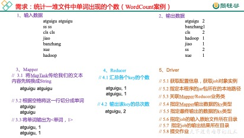

图1-9 WordCount需求分析

3．环境准备

（1）创建maven工程

（2）在pom.xml文件中添加如下依赖

<dependencies>

  <dependency>

​    <groupId>junit</groupId>

​    <artifactId>junit</artifactId>

​    <version>4.12</version>

  </dependency>

  <dependency>

​    <groupId>org.apache.logging.log4j</groupId>

​    <artifactId>log4j-slf4j-impl</artifactId>

​    <version>2.12.0</version>

  </dependency>

  <dependency>

​    <groupId>org.apache.hadoop</groupId>

​    <artifactId>hadoop-client</artifactId>

​    <version>3.1.3</version>

  </dependency>

</dependencies>

（2）在项目的src/main/resources目录下，新建一个文件，命名为“log4j2.xml”，在文件中填入。

<?xml version="1.0" encoding="UTF-8"?><Configuration status="error" strict="true" name="XMLConfig">  <Appenders>    <!-- 类型名为Console，名称为必须属性 -->    <Appender type="Console" name="STDOUT">      <!-- 布局为PatternLayout的方式，      输出样式为[INFO] [2018-01-22 17:34:01][org.test.Console]I'm here -->      <Layout type="PatternLayout"          pattern="[%p] [%d{yyyy-MM-dd HH:mm:ss}][%c{10}]%m%n" />    </Appender>   </Appenders>   <Loggers>    <!-- 可加性为false -->    <Logger name="test" level="info" additivity="false">      <AppenderRef ref="STDOUT" />    </Logger>     <!-- root loggerConfig设置 -->    <Root level="info">      <AppenderRef ref="STDOUT" />    </Root>  </Loggers> </Configuration>

4．编写程序

（1）编写Mapper类

package com.atguigu.mapreduce;import java.io.IOException;import org.apache.hadoop.io.IntWritable;import org.apache.hadoop.io.LongWritable;import org.apache.hadoop.io.Text;import org.apache.hadoop.mapreduce.Mapper; public class WordcountMapper extends Mapper<LongWritable, Text, Text, IntWritable>{  Text k = new Text(); IntWritable v = new IntWritable(1);  @Override protected void map(LongWritable key, Text value, Context context) throws IOException, InterruptedException {     // 1 获取一行   String line = value.toString();     // 2 切割   String[] words = line.split(" ");     // 3 输出   for (String word : words) {        k.set(word);    context.write(k, v);   } }}

（2）编写Reducer类

package com.atguigu.mapreduce.wordcount;import java.io.IOException;import org.apache.hadoop.io.IntWritable;import org.apache.hadoop.io.Text;import org.apache.hadoop.mapreduce.Reducer; public class WordcountReducer extends Reducer<Text, IntWritable, Text, IntWritable>{ int sum;IntWritable v = new IntWritable();  @Override protected void reduce(Text key, Iterable<IntWritable> values,Context context) throws IOException, InterruptedException {     // 1 累加求和   sum = 0;   for (IntWritable count : values) {    sum += count.get();   }     // 2 输出    v.set(sum);   context.write(key,v); }}

（3）编写Driver驱动类

package com.atguigu.mapreduce.wordcount;import java.io.IOException;import org.apache.hadoop.conf.Configuration;import org.apache.hadoop.fs.Path;import org.apache.hadoop.io.IntWritable;import org.apache.hadoop.io.Text;import org.apache.hadoop.mapreduce.Job;import org.apache.hadoop.mapreduce.lib.input.FileInputFormat;import org.apache.hadoop.mapreduce.lib.output.FileOutputFormat; public class WordcountDriver {  public static void main(String[] args) throws IOException, ClassNotFoundException, InterruptedException {   // 1 获取配置信息以及封装任务   Configuration configuration = new Configuration();   Job job = Job.getInstance(configuration);   // 2 设置jar加载路径   job.setJarByClass(WordcountDriver.class);   // 3 设置map和reduce类   job.setMapperClass(WordcountMapper.class);   job.setReducerClass(WordcountReducer.class);   // 4 设置map输出   job.setMapOutputKeyClass(Text.class);   job.setMapOutputValueClass(IntWritable.class);   // 5 设置最终输出kv类型   job.setOutputKeyClass(Text.class);   job.setOutputValueClass(IntWritable.class);     // 6 设置输入和输出路径   FileInputFormat.setInputPaths(job, new Path(args[0]));   FileOutputFormat.setOutputPath(job, new Path(args[1]));   // 7 提交   boolean result = job.waitForCompletion(true);   System.exit(result ? 0 : 1); }}

5．本地测试

（1）需要首先配置好HadoopHome变量以及Windows运行依赖

（2）在Eclipse/Idea上运行程序

6．集群上测试

（0）用maven打jar包，如果有需要一并打进去的依赖，需要添加打包插件

注意：标记红颜色的部分需要替换为自己工程主类

<build>

   <plugins>

​    <plugin>

​      <artifactId>maven-compiler-plugin</artifactId>

​      <version>2.3.2</version>

​      <configuration>

​       <source>1.8</source>

​       <target>1.8</target>

​      </configuration>

​    </plugin>

​    <plugin>

​      <artifactId>maven-assembly-plugin </artifactId>

​      <configuration>

​       <descriptorRefs>

​         <descriptorRef>jar-with-dependencies</descriptorRef>

​       </descriptorRefs>

​       <archive>

​         <manifest>

​          <mainClass>com.atguigu.mr.WordcountDriver</mainClass>

​         </manifest>

​       </archive>

​      </configuration>

​      <executions>

​       <execution>

​         <id>make-assembly</id>

​         <phase>package</phase>

​         <goals>

​          <goal>single</goal>

​         </goals>

​       </execution>

​      </executions>

​    </plugin>

   </plugins>

 </build>

注意：如果工程上显示红叉。在项目上右键->maven->update project即可。

（1）将程序打成jar包，然后拷贝到Hadoop集群中

步骤详情：Maven ->lifecycle-> install。等待编译完成就会在项目的target文件夹中生成jar包。如果看不到。在项目上右键 -> Refresh，即可看到。修改不带依赖的jar包名称为wc.jar，并拷贝该jar包到Hadoop集群。

（2）启动Hadoop集群

（3）执行WordCount程序

[atguigu@hadoop102 software]$ hadoop jar wc.jar

 com.atguigu.wordcount.WordcountDriver /user/atguigu/input /user/atguigu/output

7．在Windows上向集群提交任务

​    （1）添加必要配置信息

public class WordcountDriver {

 

 public static void main(String[] args) throws IOException, ClassNotFoundException, InterruptedException {

 

   // 1 获取配置信息以及封装任务

   Configuration configuration = new Configuration();

   //设置HDFS NameNode的地址

​    configuration.set("fs.defaultFS", "hdfs://hadoop102:8020");

​    // 指定MapReduce运行在Yarn上

​    configuration.set("mapreduce.framework.name","yarn");

​    // 指定mapreduce可以在远程集群运行

   configuration.set("mapreduce.app-submission.cross-platform","true");

  

   //指定Yarn resourcemanager的位置

   configuration.set("yarn.resourcemanager.hostname","hadoop103");

 

   Job job = Job.getInstance(configuration);

 

   // 2 设置jar加载路径

   job.setJarByClass(WordcountDriver.class);

 

   // 3 设置map和reduce类

   job.setMapperClass(WordcountMapper.class);

   job.setReducerClass(WordcountReducer.class);

 

   // 4 设置map输出

   job.setMapOutputKeyClass(Text.class);

   job.setMapOutputValueClass(IntWritable.class);

 

   // 5 设置最终输出kv类型

   job.setOutputKeyClass(Text.class);

   job.setOutputValueClass(IntWritable.class);

  

   // 6 设置输入和输出路径

   FileInputFormat.setInputPaths(job, new Path(args[0]));

   FileOutputFormat.setOutputPath(job, new Path(args[1]));

 

   // 7 提交

   boolean result = job.waitForCompletion(true);

 

   System.exit(result ? 0 : 1);

 }

}

 （2）先进行打包，并将Jar包设置到Driver中，集群中运行需要指定jar包

public class WordcountDriver {

 

 public static void main(String[] args) throws IOException, ClassNotFoundException, InterruptedException {

 

   // 1 获取配置信息以及封装任务

   Configuration configuration = new Configuration();

 

​    configuration.set("fs.defaultFS", "hdfs://hadoop102:8020");

​    configuration.set("mapreduce.framework.name","yarn");

​    configuration.set("mapreduce.app-submission.cross-platform","true");

  configuration.set("yarn.resourcemanager.hostname","hadoop103");

 

   Job job = Job.getInstance(configuration);

 

   // 2 设置jar加载路径

   job.setJar("D:\\input\\MapReduce-1.0-SNAPSHOT.jar");

 

   // 3 设置map和reduce类

   job.setMapperClass(WordcountMapper.class);

   job.setReducerClass(WordcountReducer.class);

 

   // 4 设置map输出

   job.setMapOutputKeyClass(Text.class);

   job.setMapOutputValueClass(IntWritable.class);

 

   // 5 设置最终输出kv类型

   job.setOutputKeyClass(Text.class);

   job.setOutputValueClass(IntWritable.class);

  

   // 6 设置输入和输出路径

   FileInputFormat.setInputPaths(job, new Path(args[0]));

   FileOutputFormat.setOutputPath(job, new Path(args[1]));

 

   // 7 提交

   boolean result = job.waitForCompletion(true);

 

   System.exit(result ? 0 : 1);

 }

}

 

（3）编辑任务配置

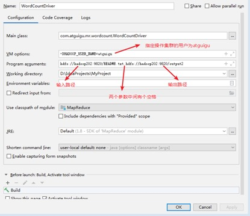

图1-10 提交集群任务配置

（4）提交并在集群查看结果

 

# 第2章 Hadoop序列化

## 2.1 序列化概述

图2-1 序列化概述

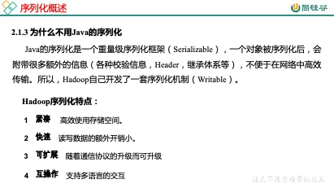 

图2-2 序列化概述

 

## 2.2 自定义bean对象实现序列化接口（Writable）

在企业开发中往往常用的基本序列化类型不能满足所有需求，比如在Hadoop框架内部传递一个bean对象，那么该对象就需要实现序列化接口。

具体实现bean对象序列化步骤如下7步。

（1）必须实现Writable接口

（2）反序列化时，需要反射调用空参构造函数，所以必须有空参构造

public FlowBean() {  super();}

（3）重写序列化方法

@Overridepublic void write(DataOutput out) throws IOException {  out.writeLong(upFlow);  out.writeLong(downFlow);  out.writeLong(sumFlow);}

（4）重写反序列化方法

@Overridepublic void readFields(DataInput in) throws IOException {  upFlow = in.readLong();  downFlow = in.readLong();  sumFlow = in.readLong();}

（5）注意反序列化的顺序和序列化的顺序完全一致

（6）要想把结果显示在文件中，需要重写toString()，可用”\t”分开，方便后续用。

（7）如果需要将自定义的bean放在key中传输，则还需要实现Comparable接口，因为MapReduce框中的Shuffle过程要求对key必须能排序。详见后面排序案例。

@Overridepublic int compareTo(FlowBean o) {  // 倒序排列，从大到小  return this.sumFlow > o.getSumFlow() ? -1 : 1;}

## 2.3 序列化案例实操

\1.  需求

统计每一个手机号耗费的总上行流量、下行流量、总流量

（1）输入数据

（2）输入数据格式：

7    13560436666    120.196.100.99       1116       954            200id    手机号码       网络ip               上行流量 下行流量   网络状态码

（3）期望输出数据格式

13560436666         1116          954                2070手机号码         上行流量    下行流量           总流量

2．需求分析

图2-3 序列化案例需求分析

3．编写MapReduce程序

（1）编写流量统计的Bean对象

package com.atguigu.mapreduce.flowsum;import java.io.DataInput;import java.io.DataOutput;import java.io.IOException;import org.apache.hadoop.io.Writable; // 1 实现writable接口public class FlowBean implements Writable{  private long upFlow; private long downFlow; private long sumFlow;  //2 反序列化时，需要反射调用空参构造函数，所以必须有 public FlowBean() {   super(); }  public FlowBean(long upFlow, long downFlow) {   super();   this.upFlow = upFlow;   this.downFlow = downFlow;   this.sumFlow = upFlow + downFlow; }  //3 写序列化方法 @Override public void write(DataOutput out) throws IOException {   out.writeLong(upFlow);   out.writeLong(downFlow);   out.writeLong(sumFlow); }  //4 反序列化方法 //5 反序列化方法读顺序必须和写序列化方法的写顺序必须一致 @Override public void readFields(DataInput in) throws IOException {   this.upFlow = in.readLong();   this.downFlow = in.readLong();   this.sumFlow = in.readLong(); }  // 6 编写toString方法，方便后续打印到文本 @Override public String toString() {   return upFlow + "\t" + downFlow + "\t" + sumFlow; }  public long getUpFlow() {   return upFlow; }  public void setUpFlow(long upFlow) {   this.upFlow = upFlow; }  public long getDownFlow() {   return downFlow; }  public void setDownFlow(long downFlow) {   this.downFlow = downFlow; }  public long getSumFlow() {   return sumFlow; }  public void setSumFlow(long sumFlow) {   this.sumFlow = sumFlow; }}

（2）编写Mapper类

package com.atguigu.mapreduce.flowsum;import java.io.IOException;import org.apache.hadoop.io.LongWritable;import org.apache.hadoop.io.Text;import org.apache.hadoop.mapreduce.Mapper; public class FlowCountMapper extends Mapper<LongWritable, Text, Text, FlowBean>{  FlowBean v = new FlowBean(); Text k = new Text();  @Override protected void map(LongWritable key, Text value, Context context) throws IOException, InterruptedException {     // 1 获取一行   String line = value.toString();     // 2 切割字段   String[] fields = line.split("\t");     // 3 封装对象   // 取出手机号码   String phoneNum = fields[1];   // 取出上行流量和下行流量   long upFlow = Long.parseLong(fields[fields.length - 3]);   long downFlow = Long.parseLong(fields[fields.length - 2]);   k.set(phoneNum);   v.set(downFlow, upFlow);     // 4 写出   context.write(k, v); }}

（3）编写Reducer类

package com.atguigu.mapreduce.flowsum;import java.io.IOException;import org.apache.hadoop.io.Text;import org.apache.hadoop.mapreduce.Reducer; public class FlowCountReducer extends Reducer<Text, FlowBean, Text, FlowBean> {  @Override protected void reduce(Text key, Iterable<FlowBean> values, Context context)throws IOException, InterruptedException {   long sum_upFlow = 0;   long sum_downFlow = 0;   // 1 遍历所用bean，将其中的上行流量，下行流量分别累加   for (FlowBean flowBean : values) {    sum_upFlow += flowBean.getUpFlow();    sum_downFlow += flowBean.getDownFlow();   }   // 2 封装对象   FlowBean resultBean = new FlowBean(sum_upFlow, sum_downFlow);     // 3 写出   context.write(key, resultBean); }}

（4）编写Driver驱动类

package com.atguigu.mapreduce.flowsum;import java.io.IOException;import org.apache.hadoop.conf.Configuration;import org.apache.hadoop.fs.Path;import org.apache.hadoop.io.Text;import org.apache.hadoop.mapreduce.Job;import org.apache.hadoop.mapreduce.lib.input.FileInputFormat;import org.apache.hadoop.mapreduce.lib.output.FileOutputFormat; public class FlowsumDriver {  public static void main(String[] args) throws IllegalArgumentException, IOException, ClassNotFoundException, InterruptedException {  // 输入输出路径需要根据自己电脑上实际的输入输出路径设置args = new String[] { "e:/input/inputflow", "e:/output1" };   // 1 获取配置信息，或者job对象实例   Configuration configuration = new Configuration();   Job job = Job.getInstance(configuration);   // 6 指定本程序的jar包所在的本地路径   job.setJarByClass(FlowsumDriver.class);   // 2 指定本业务job要使用的mapper/Reducer业务类   job.setMapperClass(FlowCountMapper.class);   job.setReducerClass(FlowCountReducer.class);   // 3 指定mapper输出数据的kv类型   job.setMapOutputKeyClass(Text.class);   job.setMapOutputValueClass(FlowBean.class);   // 4 指定最终输出的数据的kv类型   job.setOutputKeyClass(Text.class);   job.setOutputValueClass(FlowBean.class);     // 5 指定job的输入原始文件所在目录   FileInputFormat.setInputPaths(job, new Path(args[0]));   FileOutputFormat.setOutputPath(job, new Path(args[1]));   // 7 将job中配置的相关参数，以及job所用的java类所在的jar包， 提交给yarn去运行   boolean result = job.waitForCompletion(true);   System.exit(result ? 0 : 1); }}

# 第3章 MapReduce框架原理

## 3.1 InputFormat数据输入

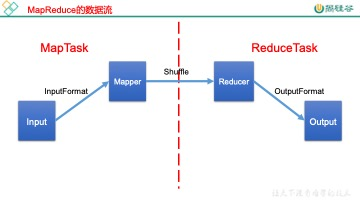

图3-1 MapReduce数据流

### 3.1.1 切片与MapTask并行度决定机制

1．问题引出

MapTask的并行度决定Map阶段的任务处理并发度，进而影响到整个Job的处理速度。

思考：1G的数据，启动8个MapTask，可以提高集群的并发处理能力。那么1K的数据，也启动8个MapTask，会提高集群性能吗？MapTask并行任务是否越多越好呢？哪些因素影响了MapTask并行度？

2．MapTask并行度决定机制

**数据块：**Block是HDFS物理上把数据分成一块一块。

**数据切片：**数据切片只是在逻辑上对输入进行分片，并不会在磁盘上将其切分成片进行存储。

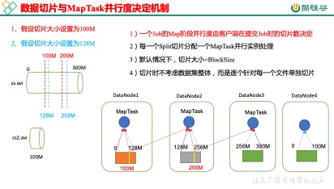

图3-2 MapTask并行度决定机制

### 3.1.2 Job提交流程源码和切片源码详解

1．Job提交流程源码详解，如图3-3所示

waitForCompletion()

 

submit();

 

// 1建立连接

  connect(); 

   // 1）创建提交Job的代理

   new Cluster(getConfiguration());

​     // （1）判断是本地yarn还是远程

​     initialize(jobTrackAddr, conf);

 

// 2 提交job

submitter.submitJobInternal(Job.this, cluster)

  // 1）创建给集群提交数据的Stag路径

  Path jobStagingArea = JobSubmissionFiles.getStagingDir(cluster, conf);

 

  // 2）获取jobid ，并创建Job路径

  JobID jobId = submitClient.getNewJobID();

 

  // 3）拷贝jar包到集群

copyAndConfigureFiles(job, submitJobDir); 

  rUploader.uploadFiles(job, jobSubmitDir);

 

// 4）计算切片，生成切片规划文件

writeSplits(job, submitJobDir);

​    maps = writeNewSplits(job, jobSubmitDir);

   input.getSplits(job);

 

// 5）向Stag路径写XML配置文件

writeConf(conf, submitJobFile);

  conf.writeXml(out);

 

// 6）提交Job,返回提交状态

status = submitClient.submitJob(jobId, submitJobDir.toString(), job.getCredentials());

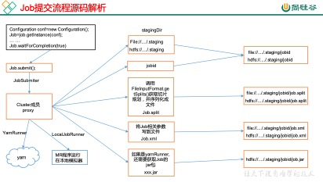

图3-3 Job提交流程源码分析

2．FileInputFormat切片源码解析(input.getSplits(job))

图3-4 FileInputFormat切片机制

### 3.1.3 FileInputFormat切片机制

图3-5 FileInputFormat切片机制

 

图3-6 FileInputFormat切片机制

 

### 3.1.4 FileInputFormat实现类

图3-7 FileInputFormat实现类

 

图3-8 TextInputFormat

图3-9 KeyValueTextInputFormat

图3-10 NLineInputFormat

### 3.1.5 CombineTextInputFormat切片机制

框架默认的TextInputFormat切片机制是对任务按文件规划切片，不管文件多小，都会是一个单独的切片，都会交给一个MapTask，这样如果有大量小文件，就会产生大量的MapTask，处理效率极其低下。

1、应用场景：

CombineTextInputFormat用于小文件过多的场景，它可以将多个小文件从逻辑上规划到一个切片中，这样，多个小文件就可以交给一个MapTask处理。

2、虚拟存储切片最大值设置

CombineTextInputFormat.setMaxInputSplitSize(job, 4194304);// 4m

注意：虚拟存储切片最大值设置最好根据实际的小文件大小情况来设置具体的值。

3、切片机制

生成切片过程包括：虚拟存储过程和切片过程二部分。

图3-11 CombineTextInputFormat切片机制

（1）虚拟存储过程：

将输入目录下所有文件大小，依次和设置的setMaxInputSplitSize值比较，如果不大于设置的最大值，逻辑上划分一个块。如果输入文件大于设置的最大值且大于两倍，那么以最大值切割一块；当剩余数据大小超过设置的最大值且不大于最大值2倍，此时将文件均分成2个虚拟存储块（防止出现太小切片）。

例如setMaxInputSplitSize值为4M，输入文件大小为8.02M，则先逻辑上分成一个4M。剩余的大小为4.02M，如果按照4M逻辑划分，就会出现0.02M的小的虚拟存储文件，所以将剩余的4.02M文件切分成（2.01M和2.01M）两个文件。

（2）切片过程：

（a）判断虚拟存储的文件大小是否大于setMaxInputSplitSize值，大于等于则单独形成一个切片。

（b）如果不大于则跟下一个虚拟存储文件进行合并，共同形成一个切片。

（c）测试举例：有4个小文件大小分别为1.7M、5.1M、3.4M以及6.8M这四个小文件，则虚拟存储之后形成6个文件块，大小分别为：

1.7M，（2.55M、2.55M），3.4M以及（3.4M、3.4M）

最终会形成3个切片，大小分别为：

（1.7+2.55）M，（2.55+3.4）M，（3.4+3.4）M

### 3.1.6 CombineTextInputFormat案例实操

1．需求

将输入的大量小文件合并成一个切片统一处理。

（1）输入数据

准备4个小文件

（2）期望

期望一个切片处理4个文件

2．实现过程

**（1****）不做任何处理，运行1.6****节的WordCount****案例程序，观察切片个数为4****。**

**（2****）在WordcountDriver****中增加如下代码，运行程序，并观察运行的切片个数为3****。**

（a）驱动类中添加代码如下：

// 如果不设置InputFormat，它默认用的是TextInputFormat.class

job.setInputFormatClass(CombineTextInputFormat.class);

 

//虚拟存储切片最大值设置4m

CombineTextInputFormat.setMaxInputSplitSize(job, 4194304);

​       （b）运行如果为3个切片。

**（3****）在WordcountDriver****中增加如下代码，运行程序，并观察运行的切片个数为1****。**

​           （a）驱动中添加代码如下：

// 如果不设置InputFormat，它默认用的是TextInputFormat.class

job.setInputFormatClass(CombineTextInputFormat.class);

 

//虚拟存储切片最大值设置20m

CombineTextInputFormat.setMaxInputSplitSize(job, 20971520);

（b）运行如果为1个切片。

### 3.1.7 KeyValueTextInputFormat使用案例

1．需求

统计输入文件中每一行的第一个单词相同的行数。

（1）输入数据

banzhang ni hao

xihuan hadoop banzhang

banzhang ni hao

xihuan hadoop banzhang

（2）期望结果数据

banzhang 2

xihuan  2

2．需求分析

图3-12 KeyValueTextInputFormat案例需求分析

3．代码实现

（1）编写Mapper类

package com.atguigu.mapreduce.KeyValueTextInputFormat;import java.io.IOException;import org.apache.hadoop.io.LongWritable;import org.apache.hadoop.io.Text;import org.apache.hadoop.mapreduce.Mapper; public class KVTextMapper extends Mapper<Text, Text, Text, LongWritable>{ // 1 设置value  LongWritable v = new LongWritable(1);   @Override protected void map(Text key, Text value, Context context)    throws IOException, InterruptedException { // banzhang ni hao        // 2 写出    context.write(key, v);  }}

（2）编写Reducer类

package com.atguigu.mapreduce.KeyValueTextInputFormat;import java.io.IOException;import org.apache.hadoop.io.LongWritable;import org.apache.hadoop.io.Text;import org.apache.hadoop.mapreduce.Reducer; public class KVTextReducer extends Reducer<Text, LongWritable, Text, LongWritable>{   LongWritable v = new LongWritable();   @Override protected void reduce(Text key, Iterable<LongWritable> values, Context context) throws IOException, InterruptedException {      long sum = 0L;     // 1 汇总统计    for (LongWritable value : values) {       sum += value.get();     }        v.set(sum);         // 2 输出    context.write(key, v);  }}

（3）编写Driver类

package com.atguigu.mapreduce.keyvaleTextInputFormat;import java.io.IOException;import org.apache.hadoop.conf.Configuration;import org.apache.hadoop.fs.Path;import org.apache.hadoop.io.LongWritable;import org.apache.hadoop.io.Text;import org.apache.hadoop.mapreduce.Job;import org.apache.hadoop.mapreduce.lib.input.FileInputFormat;import org.apache.hadoop.mapreduce.lib.input.KeyValueLineRecordReader;import org.apache.hadoop.mapreduce.lib.input.KeyValueTextInputFormat;import org.apache.hadoop.mapreduce.lib.output.FileOutputFormat; public class KVTextDriver {  public static void main(String[] args) throws IOException, ClassNotFoundException, InterruptedException {     Configuration conf = new Configuration();   // 设置切割符 conf.set(KeyValueLineRecordReader.KEY_VALUE_SEPERATOR, " ");   // 1 获取job对象   Job job = Job.getInstance(conf);     // 2 设置jar包位置，关联mapper和reducer   job.setJarByClass(KVTextDriver.class);   job.setMapperClass(KVTextMapper.class);job.setReducerClass(KVTextReducer.class);        // 3 设置map输出kv类型   job.setMapOutputKeyClass(Text.class);   job.setMapOutputValueClass(LongWritable.class);   // 4 设置最终输出kv类型   job.setOutputKeyClass(Text.class);job.setOutputValueClass(LongWritable.class);     // 5 设置输入输出数据路径   FileInputFormat.setInputPaths(job, new Path(args[0]));     // 设置输入格式 job.setInputFormatClass(KeyValueTextInputFormat.class);     // 6 设置输出数据路径   FileOutputFormat.setOutputPath(job, new Path(args[1]));     // 7 提交job   job.waitForCompletion(true); }}

### 3.1.8 NLineInputFormat使用案例

1．需求

对每个单词进行个数统计，要求根据每个输入文件的行数来规定输出多少个切片。此案例要求每三行放入一个切片中。

（1）输入数据

banzhang ni hao

xihuan hadoop banzhang

banzhang ni hao

xihuan hadoop banzhang

banzhang ni hao

xihuan hadoop banzhang

banzhang ni hao

xihuan hadoop banzhang

banzhang ni hao

xihuan hadoop banzhang banzhang ni hao

xihuan hadoop banzhang

（2）期望输出数据

Number of splits:4

2．需求分析

图3-13 NLineInputFormat案例需求分析

3．代码实现

（1）编写Mapper类

package com.atguigu.mapreduce.nline;import java.io.IOException;import org.apache.hadoop.io.LongWritable;import org.apache.hadoop.io.Text;import org.apache.hadoop.mapreduce.Mapper; public class NLineMapper extends Mapper<LongWritable, Text, Text, LongWritable>{  private Text k = new Text(); private LongWritable v = new LongWritable(1);  @Override protected void map(LongWritable key, Text value, Context context) throws IOException, InterruptedException {      // 1 获取一行    String line = value.toString();        // 2 切割    String[] splited = line.split(" ");        // 3 循环写出    for (int i = 0; i < splited.length; i++) {          k.set(splited[i]);          context.write(k, v);    } }}

（2）编写Reducer类

package com.atguigu.mapreduce.nline;import java.io.IOException;import org.apache.hadoop.io.LongWritable;import org.apache.hadoop.io.Text;import org.apache.hadoop.mapreduce.Reducer; public class NLineReducer extends Reducer<Text, LongWritable, Text, LongWritable>{  LongWritable v = new LongWritable();  @Override protected void reduce(Text key, Iterable<LongWritable> values, Context context) throws IOException, InterruptedException {      long sum = 0l;     // 1 汇总    for (LongWritable value : values) {      sum += value.get();    }        v.set(sum);        // 2 输出    context.write(key, v); }}

（3）编写Driver类

package com.atguigu.mapreduce.nline;import java.io.IOException;import java.net.URISyntaxException;import org.apache.hadoop.conf.Configuration;import org.apache.hadoop.fs.Path;import org.apache.hadoop.io.LongWritable;import org.apache.hadoop.io.Text;import org.apache.hadoop.mapreduce.Job;import org.apache.hadoop.mapreduce.lib.input.FileInputFormat;import org.apache.hadoop.mapreduce.lib.input.NLineInputFormat;import org.apache.hadoop.mapreduce.lib.output.FileOutputFormat; public class NLineDriver {  public static void main(String[] args) throws IOException, URISyntaxException, ClassNotFoundException, InterruptedException {  // 输入输出路径需要根据自己电脑上实际的输入输出路径设置args = new String[] { "e:/input/inputword", "e:/output1" };    // 1 获取job对象    Configuration configuration = new Configuration();    Job job = Job.getInstance(configuration);        // 7设置每个切片InputSplit中划分三条记录    NLineInputFormat.setNumLinesPerSplit(job, 3);         // 8使用NLineInputFormat处理记录数     job.setInputFormatClass(NLineInputFormat.class);          // 2设置jar包位置，关联mapper和reducer    job.setJarByClass(NLineDriver.class);     job.setMapperClass(NLineMapper.class);     job.setReducerClass(NLineReducer.class);        // 3设置map输出kv类型    job.setMapOutputKeyClass(Text.class);     job.setMapOutputValueClass(LongWritable.class);        // 4设置最终输出kv类型    job.setOutputKeyClass(Text.class);     job.setOutputValueClass(LongWritable.class);         // 5设置输入输出数据路径    FileInputFormat.setInputPaths(job, new Path(args[0]));     FileOutputFormat.setOutputPath(job, new Path(args[1]));         // 6提交job    job.waitForCompletion(true);  }}

4．测试

（1）输入数据

banzhang ni hao

xihuan hadoop banzhang

banzhang ni hao

xihuan hadoop banzhang

banzhang ni hao

xihuan hadoop banzhang

banzhang ni hao

xihuan hadoop banzhang

banzhang ni hao

xihuan hadoop banzhang banzhang ni hao

xihuan hadoop banzhang

（2）输出结果的切片数，如图3-14所示：

图3-14 输出结果的切片数

### 3.1.9 自定义InputFormat

图 3-15 自定义InputFormat

### 3.1.10 自定义InputFormat案例实操

无论HDFS还是MapReduce，在处理小文件时效率都非常低，但又难免面临处理大量小文件的场景，此时，就需要有相应解决方案。可以自定义InputFormat实现小文件的合并。

1．需求

将多个小文件合并成一个SequenceFile文件（SequenceFile文件是Hadoop用来存储二进制形式的key-value对的文件格式），SequenceFile里面存储着多个文件，存储的形式为文件路径+名称为key，文件内容为value。

（1）输入数据

      

（2）期望输出文件格式

2．需求分析

图3-16 自定义InputFormat案例需求分析

3．程序实现

（1）自定义InputFromat

package com.atguigu.mapreduce.inputformat;import java.io.IOException;import org.apache.hadoop.fs.Path;import org.apache.hadoop.io.BytesWritable;import org.apache.hadoop.io.NullWritable;import org.apache.hadoop.mapreduce.InputSplit;import org.apache.hadoop.mapreduce.JobContext;import org.apache.hadoop.mapreduce.RecordReader;import org.apache.hadoop.mapreduce.TaskAttemptContext;import org.apache.hadoop.mapreduce.lib.input.FileInputFormat; // 定义类继承FileInputFormatpublic class WholeFileInputformat extends FileInputFormat<Text, BytesWritable>{  @Override protected boolean isSplitable(JobContext context, Path filename) {   return false; }  @Override public RecordReader<Text, BytesWritable> createRecordReader(InputSplit split, TaskAttemptContext context) throws IOException, InterruptedException {     WholeRecordReader recordReader = new WholeRecordReader();   recordReader.initialize(split, context);     return recordReader; }}

（2）自定义RecordReader类

package com.atguigu.mapreduce.inputformat;import java.io.IOException;import org.apache.hadoop.conf.Configuration;import org.apache.hadoop.fs.FSDataInputStream;import org.apache.hadoop.fs.FileSystem;import org.apache.hadoop.fs.Path;import org.apache.hadoop.io.BytesWritable;import org.apache.hadoop.io.IOUtils;import org.apache.hadoop.io.NullWritable;import org.apache.hadoop.mapreduce.InputSplit;import org.apache.hadoop.mapreduce.RecordReader;import org.apache.hadoop.mapreduce.TaskAttemptContext;import org.apache.hadoop.mapreduce.lib.input.FileSplit; public class WholeRecordReader extends RecordReader<Text, BytesWritable>{  private Configuration configuration; private FileSplit split;  private boolean isProgress= true; private BytesWritable value = new BytesWritable(); private Text k = new Text();  @Override public void initialize(InputSplit split, TaskAttemptContext context) throws IOException, InterruptedException {     this.split = (FileSplit)split;   configuration = context.getConfiguration(); }  @Override public boolean nextKeyValue() throws IOException, InterruptedException {     if (isProgress) {     // 1 定义缓存区    byte[] contents = new byte[(int)split.getLength()];        FileSystem fs = null;    FSDataInputStream fis = null;        try {      // 2 获取文件系统      Path path = split.getPath();      fs = path.getFileSystem(configuration);           // 3 读取数据      fis = fs.open(path);           // 4 读取文件内容      IOUtils.readFully(fis, contents, 0, contents.length);           // 5 输出文件内容      value.set(contents, 0, contents.length); // 6 获取文件路径及名称String name = split.getPath().toString(); // 7 设置输出的key值k.set(name);     } catch (Exception e) {         }finally {      IOUtils.closeStream(fis);    }        isProgress = false;        return true;   }     return false; }  @Override public Text getCurrentKey() throws IOException, InterruptedException {   return k; }  @Override public BytesWritable getCurrentValue() throws IOException, InterruptedException {   return value; }  @Override public float getProgress() throws IOException, InterruptedException {   return 0; }  @Override public void close() throws IOException { }}

（3）编写SequenceFileMapper类处理流程

package com.atguigu.mapreduce.inputformat;import java.io.IOException;import org.apache.hadoop.io.BytesWritable;import org.apache.hadoop.io.NullWritable;import org.apache.hadoop.io.Text;import org.apache.hadoop.mapreduce.Mapper;import org.apache.hadoop.mapreduce.lib.input.FileSplit; public class SequenceFileMapper extends Mapper<Text, BytesWritable, Text, BytesWritable>{  @Override protected void map(Text key, BytesWritable value,   Context context)  throws IOException, InterruptedException {   context.write(key, value); }}

（4）编写SequenceFileReducer类处理流程

package com.atguigu.mapreduce.inputformat;import java.io.IOException;import org.apache.hadoop.io.BytesWritable;import org.apache.hadoop.io.Text;import org.apache.hadoop.mapreduce.Reducer; public class SequenceFileReducer extends Reducer<Text, BytesWritable, Text, BytesWritable> {  @Override protected void reduce(Text key, Iterable<BytesWritable> values, Context context)   throws IOException, InterruptedException {   context.write(key, values.iterator().next()); }}

（5）编写SequenceFileDriver类处理流程

package com.atguigu.mapreduce.inputformat;import java.io.IOException;import org.apache.hadoop.conf.Configuration;import org.apache.hadoop.fs.Path;import org.apache.hadoop.io.BytesWritable;import org.apache.hadoop.io.Text;import org.apache.hadoop.mapreduce.Job;import org.apache.hadoop.mapreduce.lib.input.FileInputFormat;import org.apache.hadoop.mapreduce.lib.output.FileOutputFormat;import org.apache.hadoop.mapreduce.lib.output.SequenceFileOutputFormat; public class SequenceFileDriver {  public static void main(String[] args) throws IOException, ClassNotFoundException, InterruptedException {      // 输入输出路径需要根据自己电脑上实际的输入输出路径设置   args = new String[] { "e:/input/inputinputformat", "e:/output1" };    // 1 获取job对象   Configuration conf = new Configuration();   Job job = Job.getInstance(conf);    // 2 设置jar包存储位置、关联自定义的mapper和reducer   job.setJarByClass(SequenceFileDriver.class);   job.setMapperClass(SequenceFileMapper.class);   job.setReducerClass(SequenceFileReducer.class);    // 7设置输入的inputFormat   job.setInputFormatClass(WholeFileInputformat.class);    // 8设置输出的outputFormat job.setOutputFormatClass(SequenceFileOutputFormat.class);   // 3 设置map输出端的kv类型   job.setMapOutputKeyClass(Text.class);   job.setMapOutputValueClass(BytesWritable.class);      // 4 设置最终输出端的kv类型   job.setOutputKeyClass(Text.class);   job.setOutputValueClass(BytesWritable.class);    // 5 设置输入输出路径   FileInputFormat.setInputPaths(job, new Path(args[0]));   FileOutputFormat.setOutputPath(job, new Path(args[1]));    // 6 提交job   boolean result = job.waitForCompletion(true);   System.exit(result ? 0 : 1); }}

## 3.2 MapReduce工作流程

1．流程示意图，如图3-17，3-18所示

图3-17 MapReduce详细工作流程（一）

图3-18 MapReduce详细工作流程（二）

2．流程详解

上面的流程是整个MapReduce最全工作流程，但是Shuffle过程只是从第7步开始到第16步结束，具体Shuffle过程详解，如下：

1）MapTask收集我们的map()方法输出的kv对，放到内存缓冲区中

2）从内存缓冲区不断溢出本地磁盘文件，可能会溢出多个文件

3）多个溢出文件会被合并成大的溢出文件

4）在溢出过程及合并的过程中，都要调用Partitioner进行分区和针对key进行排序

5）ReduceTask根据自己的分区号，去各个MapTask机器上取相应的结果分区数据

6）ReduceTask会取到同一个分区的来自不同MapTask的结果文件，ReduceTask会将这些文件再进行合并（归并排序）

7）合并成大文件后，Shuffle的过程也就结束了，后面进入ReduceTask的逻辑运算过程（从文件中取出一个一个的键值对Group，调用用户自定义的reduce()方法）

3．注意

Shuffle中的缓冲区大小会影响到MapReduce程序的执行效率，原则上说，缓冲区越大，磁盘io的次数越少，执行速度就越快。

缓冲区的大小可以通过参数调整，参数：io.sort.mb默认100M。

4．源码解析流程

context.write(k, NullWritable.get());

output.write(key, value);

collector.collect(key, value,partitioner.getPartition(key, value, partitions));

​    HashPartitioner();

collect()

​    close()

​    collect.flush()

sortAndSpill()

  sort()  QuickSort

mergeParts();

  

collector.close();

## 3.3 Shuffle机制

### 3.3.1 Shuffle机制

Map方法之后，Reduce方法之前的数据处理过程称之为Shuffle。如图3-19所示。

图3-19 Shuffle机制

### 3.3.2 Partition分区

图3-20 默认的Partitioner

图3-21 自定义Partitioner

### 3.3.3 Partition分区案例实操

1．需求

将统计结果按照手机归属地不同省份输出到不同文件中（分区）

（1）输入数据

​    

（2）期望输出数据

​    手机号136、137、138、139开头都分别放到一个独立的4个文件中，其他开头的放到一个文件中。

2．需求分析

图3-22 自定义Partitioner案例需求分析

3．在案例2.4的基础上，增加一个分区类

package com.atguigu.mapreduce.flowsum;

import org.apache.hadoop.io.Text;

import org.apache.hadoop.mapreduce.Partitioner;

 

public class ProvincePartitioner extends Partitioner<Text, FlowBean> {

 

  @Override

  public int getPartition(Text key, FlowBean value, int numPartitions) {

 

   // 1 获取电话号码的前三位

   String preNum = key.toString().substring(0, 3);

   

   int partition = 4;

   

   // 2 判断是哪个省

   if ("136".equals(preNum)) {

​     partition = 0;

   }else if ("137".equals(preNum)) {

​     partition = 1;

   }else if ("138".equals(preNum)) {

​     partition = 2;

   }else if ("139".equals(preNum)) {

​     partition = 3;

   }

 

   return partition;

  }

}

4．在驱动函数中增加自定义数据分区设置和ReduceTask设置

package com.atguigu.mapreduce.flowsum;

import java.io.IOException;

import org.apache.hadoop.conf.Configuration;

import org.apache.hadoop.fs.Path;

import org.apache.hadoop.io.Text;

import org.apache.hadoop.mapreduce.Job;

import org.apache.hadoop.mapreduce.lib.input.FileInputFormat;

import org.apache.hadoop.mapreduce.lib.output.FileOutputFormat;

 

public class FlowsumDriver {

 

  public static void main(String[] args) throws IllegalArgumentException, IOException, ClassNotFoundException, InterruptedException {

 

   // 输入输出路径需要根据自己电脑上实际的输入输出路径设置

   args = new String[]{"e:/output1","e:/output2"};

 

   // 1 获取配置信息，或者job对象实例

   Configuration configuration = new Configuration();

   Job job = Job.getInstance(configuration);

 

   // 2 指定本程序的jar包所在的本地路径

   job.setJarByClass(FlowsumDriver.class);

 

   // 3 指定本业务job要使用的mapper/Reducer业务类

   job.setMapperClass(FlowCountMapper.class);

   job.setReducerClass(FlowCountReducer.class);

 

   // 4 指定mapper输出数据的kv类型

   job.setMapOutputKeyClass(Text.class);

   job.setMapOutputValueClass(FlowBean.class);

 

   // 5 指定最终输出的数据的kv类型

   job.setOutputKeyClass(Text.class);

   job.setOutputValueClass(FlowBean.class);

 

   // 8 指定自定义数据分区

   job.setPartitionerClass(ProvincePartitioner.class);

 

   // 9 同时指定相应数量的reduce task

   job.setNumReduceTasks(5);

   

   // 6 指定job的输入原始文件所在目录

   FileInputFormat.setInputPaths(job, new Path(args[0]));

   FileOutputFormat.setOutputPath(job, new Path(args[1]));

 

   // 7 将job中配置的相关参数，以及job所用的java类所在的jar包， 提交给yarn去运行

   boolean result = job.waitForCompletion(true);

   System.exit(result ? 0 : 1);

  }

}

图3-23 Partitioner使用总结

 

### 3.3.4 WritableComparable排序

图3-24 排序概述

图3-25 排序概述

 

1．排序的分类

图3-26 排序分类

 

2．自定义排序WritableComparable

（1）原理分析

bean对象做为key传输，需要实现WritableComparable接口重写compareTo方法，就可以实现排序。

@Override

public int compareTo(FlowBean o) {

 

  int result;

   

  // 按照总流量大小，倒序排列

  if (sumFlow > bean.getSumFlow()) {

   result = -1;

  }else if (sumFlow < bean.getSumFlow()) {

   result = 1;

  }else {

   result = 0;

  }

 

  return result;

}

### 3.3.5 WritableComparable排序案例实操（全排序）

1．需求

根据案例2.3产生的结果再次对总流量进行排序。

（1）输入数据

原始数据             第一次处理后的数据

         

（2）期望输出数据

13509468723 7335    110349  117684

13736230513 2481    24681   27162

13956435636 132     1512    1644

13846544121 264     0      264

。。。 。。。

2．需求分析

​    

图 3-27 WritableComparable排序案例分析

3．代码实现

（1）FlowBean

package com.atguigu.mapreduce.sort;

import java.io.DataInput;

import java.io.DataOutput;

import java.io.IOException;

import org.apache.hadoop.io.WritableComparable;

 

public class FlowBean implements WritableComparable<FlowBean> {

 

private long upFlow;

private long downFlow;

private long sumFlow;

 

// 反序列化时，需要反射调用空参构造函数，所以必须有

public FlowBean() {

  super();

}

 

public FlowBean(long upFlow, long downFlow) {

  super();

  this.upFlow = upFlow;

  this.downFlow = downFlow;

  this.sumFlow = upFlow + downFlow;

}

 

public void set(long upFlow, long downFlow) {

  this.upFlow = upFlow;

  this.downFlow = downFlow;

  this.sumFlow = upFlow + downFlow;

}

 

public long getSumFlow() {

  return sumFlow;

}

 

public void setSumFlow(long sumFlow) {

  this.sumFlow = sumFlow;

}          

 

public long getUpFlow() {

  return upFlow;

}

 

public void setUpFlow(long upFlow) {

  this.upFlow = upFlow;

}

 

public long getDownFlow() {

  return downFlow;

}

 

public void setDownFlow(long downFlow) {

  this.downFlow = downFlow;

}

 

/**

 \* 序列化方法

 \* @param out

 \* @throws IOException

 */

@Override

public void write(DataOutput out) throws IOException {

  out.writeLong(upFlow);

  out.writeLong(downFlow);

  out.writeLong(sumFlow);

}

 

/**

 \* 反序列化方法 注意反序列化的顺序和序列化的顺序完全一致

 \* @param in

 \* @throws IOException

 */

@Override

public void readFields(DataInput in) throws IOException {

  upFlow = in.readLong();

  downFlow = in.readLong();

  sumFlow = in.readLong();

}

 

@Override

public String toString() {

  return upFlow + "\t" + downFlow + "\t" + sumFlow;

}

 

@Override

public int compareTo(FlowBean bean) {

  

  int result;

  

  // 按照总流量大小，倒序排列

  if (sumFlow > bean.getSumFlow()) {

​    result = -1;

  }else if (sumFlow < bean.getSumFlow()) {

​    result = 1;

  }else {

​    result = 0;

  }

 

  return result;

}

}

​    （2）编写Mapper类

package com.atguigu.mapreduce.sort;

import java.io.IOException;

import org.apache.hadoop.io.LongWritable;

import org.apache.hadoop.io.Text;

import org.apache.hadoop.mapreduce.Mapper;

 

public class FlowCountSortMapper extends Mapper<LongWritable, Text, FlowBean, Text>{

 

FlowBean bean = new FlowBean();

Text v = new Text();

 

@Override

protected void map(LongWritable key, Text value, Context context) throws IOException, InterruptedException {

 

  // 1 获取一行

  String line = value.toString();

  

  // 2 截取

  String[] fields = line.split("\t");

  

  // 3 封装对象

  String phoneNbr = fields[0];

  long upFlow = Long.parseLong(fields[1]);

  long downFlow = Long.parseLong(fields[2]);

  

  bean.set(upFlow, downFlow);

  v.set(phoneNbr);

  

  // 4 输出

  context.write(bean, v);

}

}

​    （3）编写Reducer类

package com.atguigu.mapreduce.sort;

import java.io.IOException;

import org.apache.hadoop.io.Text;

import org.apache.hadoop.mapreduce.Reducer;

 

public class FlowCountSortReducer extends Reducer<FlowBean, Text, Text, FlowBean>{

 

@Override

protected void reduce(FlowBean key, Iterable<Text> values, Context context) throws IOException, InterruptedException {

  

  // 循环输出，避免总流量相同情况

  for (Text text : values) {

​    context.write(text, key);

  }

}

}

​    （4）编写Driver类

package com.atguigu.mapreduce.sort;

import java.io.IOException;

import org.apache.hadoop.conf.Configuration;

import org.apache.hadoop.fs.Path;

import org.apache.hadoop.io.Text;

import org.apache.hadoop.mapreduce.Job;

import org.apache.hadoop.mapreduce.lib.input.FileInputFormat;

import org.apache.hadoop.mapreduce.lib.output.FileOutputFormat;

 

public class FlowCountSortDriver {

 

public static void main(String[] args) throws ClassNotFoundException, IOException, InterruptedException {

 

  // 输入输出路径需要根据自己电脑上实际的输入输出路径设置

  args = new String[]{"e:/output1","e:/output2"};

 

  // 1 获取配置信息，或者job对象实例

  Configuration configuration = new Configuration();

  Job job = Job.getInstance(configuration);

 

  // 2 指定本程序的jar包所在的本地路径

  job.setJarByClass(FlowCountSortDriver.class);

 

  // 3 指定本业务job要使用的mapper/Reducer业务类

  job.setMapperClass(FlowCountSortMapper.class);

  job.setReducerClass(FlowCountSortReducer.class);

 

  // 4 指定mapper输出数据的kv类型

  job.setMapOutputKeyClass(FlowBean.class);

  job.setMapOutputValueClass(Text.class);

 

  // 5 指定最终输出的数据的kv类型

  job.setOutputKeyClass(Text.class);

  job.setOutputValueClass(FlowBean.class);

 

  // 6 指定job的输入原始文件所在目录

  FileInputFormat.setInputPaths(job, new Path(args[0]));

  FileOutputFormat.setOutputPath(job, new Path(args[1]));

  

  // 7 将job中配置的相关参数，以及job所用的java类所在的jar包， 提交给yarn去运行

  boolean result = job.waitForCompletion(true);

  System.exit(result ? 0 : 1);

}

}

### 3.3.6 WritableComparable排序案例实操（区内排序）

1．需求

要求每个省份手机号输出的文件中按照总流量内部排序。

2．需求分析

​    基于前一个需求，增加自定义分区类，分区按照省份手机号设置。

图 3-28 WritableComparable排序案例分析(区内排序)

 

3．案例实操

（1）增加自定义分区类

package com.atguigu.mapreduce.sort;

import org.apache.hadoop.io.Text;

import org.apache.hadoop.mapreduce.Partitioner;

 

public class ProvincePartitioner extends Partitioner<FlowBean, Text> {

 

@Override

public int getPartition(FlowBean key, Text value, int numPartitions) {

  

  // 1 获取手机号码前三位

  String preNum = value.toString().substring(0, 3);

  

  int partition = 4;

  

  // 2 根据手机号归属地设置分区

  if ("136".equals(preNum)) {

​    partition = 0;

  }else if ("137".equals(preNum)) {

​    partition = 1;

  }else if ("138".equals(preNum)) {

​    partition = 2;

  }else if ("139".equals(preNum)) {

​    partition = 3;

  }

 

  return partition;

}

}

（2）在驱动类中添加分区类

// 加载自定义分区类

job.setPartitionerClass(ProvincePartitioner.class);

 

// 设置Reducetask个数

job.setNumReduceTasks(5);

### 3.3.7 Combiner合并

图3-29 Combiner

（6）自定义Combiner实现步骤

（a）自定义一个Combiner继承Reducer，重写Reduce方法

public class WordcountCombiner extends Reducer<Text, IntWritable, Text,IntWritable>{  @Override  protected void reduce(Text key, Iterable<IntWritable> values,Context context) throws IOException, InterruptedException {     // 1 汇总操作   int count = 0;   for(IntWritable v :values){     count += v.get();   }     // 2 写出   context.write(key, new IntWritable(count));  }}

（b）在Job驱动类中设置： 

job.setCombinerClass(WordcountCombiner.class);

### 3.3.8 Combiner合并案例实操

1．需求

统计过程中对每一个MapTask的输出进行局部汇总，以减小网络传输量即采用Combiner功能。

（1）数据输入

（2）期望输出数据

期望：Combine输入数据多，输出时经过合并，输出数据降低。

2．需求分析

图3-30 Combiner的合并案例

3．案例实操-方案一

1）增加一个WordcountCombiner类继承Reducer

package com.atguigu.mr.combiner;

import java.io.IOException;

import org.apache.hadoop.io.IntWritable;

import org.apache.hadoop.io.Text;

import org.apache.hadoop.mapreduce.Reducer;

 

public class WordcountCombiner extends Reducer<Text, IntWritable, Text, IntWritable>{

 

IntWritable v = new IntWritable();

 

  @Override

  protected void reduce(Text key, Iterable<IntWritable> values, Context context) throws IOException, InterruptedException {

 

​    // 1 汇总

   int sum = 0;

 

   for(IntWritable value :values){

​     sum += value.get();

   }

 

   v.set(sum);

 

   // 2 写出

   context.write(key, v);

  }

}

2）在WordcountDriver驱动类中指定Combiner

// 指定需要使用combiner，以及用哪个类作为combiner的逻辑

job.setCombinerClass(WordcountCombiner.class);

4．案例实操-方案二

1）将WordcountReducer作为Combiner在WordcountDriver驱动类中指定

// 指定需要使用Combiner，以及用哪个类作为Combiner的逻辑

job.setCombinerClass(WordcountReducer.class);

运行程序，如图3-31，3-32所示

图3-31未使用前

图3-32使用后

### 3.3.9 GroupingComparator分组（辅助排序）

对Reduce阶段的数据根据某一个或几个字段进行分组。

分组排序步骤：

（1）自定义类继承WritableComparator

（2）重写compare()方法

@Override

public int compare(WritableComparable a, WritableComparable b) {

   // 比较的业务逻辑

   return result;

}

（3）创建一个构造将比较对象的类传给父类

protected OrderGroupingComparator() {

   super(OrderBean.class, true);

}

### 3.3.10 GroupingComparator分组案例实操

1．需求

有如下订单数据

表3-1 订单数据

| 订单id  | 商品id | 成交金额 |
| ------- | ------ | -------- |
| 0000001 | Pdt_01 | 222.8    |
| Pdt_02  | 33.8   |          |
| 0000002 | Pdt_03 | 522.8    |
| Pdt_04  | 122.4  |          |
| Pdt_05  | 722.4  |          |
| 0000003 | Pdt_06 | 232.8    |
| Pdt_02  | 33.8   |          |

现在需要求出每一个订单中最贵的商品。

（1）输入数据

（2）期望输出数据

1    222.8

2    722.4

3    232.8

2．需求分析

（1）利用“订单id和成交金额”作为key，可以将Map阶段读取到的所有订单数据按照id升序排序，如果id相同再按照金额降序排序，发送到Reduce。

（2）在Reduce端利用groupingComparator将订单id相同的kv聚合成组，然后取第一个即是该订单中最贵商品，如图3-33所示。

图3-33 过程分析

3．代码实现

（1）定义订单信息OrderBean类

package com.atguigu.mapreduce.order;import java.io.DataInput;import java.io.DataOutput;import java.io.IOException;import org.apache.hadoop.io.WritableComparable; public class OrderBean implements WritableComparable<OrderBean> {  private int order_id; // 订单id号 private double price; // 价格  public OrderBean() {   super(); }  public OrderBean(int order_id, double price) {   super();   this.order_id = order_id;   this.price = price; }  @Override public void write(DataOutput out) throws IOException {   out.writeInt(order_id);   out.writeDouble(price); }  @Override public void readFields(DataInput in) throws IOException {   order_id = in.readInt();   price = in.readDouble(); }  @Override public String toString() {   return order_id + "\t" + price; }  public int getOrder_id() {   return order_id; }  public void setOrder_id(int order_id) {   this.order_id = order_id; }  public double getPrice() {   return price; }  public void setPrice(double price) {   this.price = price; }  // 二次排序 @Override public int compareTo(OrderBean o) {   int result;   if (order_id > o.getOrder_id()) {    result = 1;   } else if (order_id < o.getOrder_id()) {    result = -1;   } else {    // 价格倒序排序    result = price > o.getPrice() ? -1 : 1;   }   return result; }}

（2）编写OrderSortMapper类

package com.atguigu.mapreduce.order;import java.io.IOException;import org.apache.hadoop.io.LongWritable;import org.apache.hadoop.io.NullWritable;import org.apache.hadoop.io.Text;import org.apache.hadoop.mapreduce.Mapper; public class OrderMapper extends Mapper<LongWritable, Text, OrderBean, NullWritable> {  OrderBean k = new OrderBean();  @Override protected void map(LongWritable key, Text value, Context context) throws IOException, InterruptedException {     // 1 获取一行   String line = value.toString();     // 2 截取   String[] fields = line.split("\t");     // 3 封装对象   k.setOrder_id(Integer.parseInt(fields[0]));   k.setPrice(Double.parseDouble(fields[2]));     // 4 写出   context.write(k, NullWritable.get()); }}

（3）编写OrderSortGroupingComparator类

package com.atguigu.mapreduce.order;import org.apache.hadoop.io.WritableComparable;import org.apache.hadoop.io.WritableComparator; public class OrderGroupingComparator extends WritableComparator {  protected OrderGroupingComparator() {   super(OrderBean.class, true); }  @Override public int compare(WritableComparable a, WritableComparable b) {   OrderBean aBean = (OrderBean) a;   OrderBean bBean = (OrderBean) b;   int result;   if (aBean.getOrder_id() > bBean.getOrder_id()) {    result = 1; } else if (aBean.getOrder_id() < bBean.getOrder_id()) {    result = -1;   } else {    result = 0;   }   return result; }}

（4）编写OrderSortReducer类

package com.atguigu.mapreduce.order;import java.io.IOException;import org.apache.hadoop.io.NullWritable;import org.apache.hadoop.mapreduce.Reducer; public class OrderReducer extends Reducer<OrderBean, NullWritable, OrderBean, NullWritable> {  @Override protected void reduce(OrderBean key, Iterable<NullWritable> values, Context context)   throws IOException, InterruptedException {     context.write(key, NullWritable.get()); }}

（5）编写OrderSortDriver类

package com.atguigu.mapreduce.order;import java.io.IOException;import org.apache.hadoop.conf.Configuration;import org.apache.hadoop.fs.Path;import org.apache.hadoop.io.NullWritable;import org.apache.hadoop.mapreduce.Job;import org.apache.hadoop.mapreduce.lib.input.FileInputFormat;import org.apache.hadoop.mapreduce.lib.output.FileOutputFormat; public class OrderDriver {  public static void main(String[] args) throws Exception, IOException { // 输入输出路径需要根据自己电脑上实际的输入输出路径设置   args = new String[]{"e:/input/inputorder" , "e:/output1"};   // 1 获取配置信息   Configuration conf = new Configuration();   Job job = Job.getInstance(conf);   // 2 设置jar包加载路径   job.setJarByClass(OrderDriver.class);   // 3 加载map/reduce类   job.setMapperClass(OrderMapper.class);   job.setReducerClass(OrderReducer.class);   // 4 设置map输出数据key和value类型   job.setMapOutputKeyClass(OrderBean.class);   job.setMapOutputValueClass(NullWritable.class);   // 5 设置最终输出数据的key和value类型   job.setOutputKeyClass(OrderBean.class);   job.setOutputValueClass(NullWritable.class);   // 6 设置输入数据和输出数据路径   FileInputFormat.setInputPaths(job, new Path(args[0]));   FileOutputFormat.setOutputPath(job, new Path(args[1]));   // 8 设置reduce端的分组 job.setGroupingComparatorClass(OrderGroupingComparator.class);   // 7 提交   boolean result = job.waitForCompletion(true);   System.exit(result ? 0 : 1); }}

## 3.4 MapTask工作机制

MapTask工作机制如图3-34所示。

图3-34 MapTask工作机制

​    （1）Read阶段：MapTask通过用户编写的RecordReader，从输入InputSplit中解析出一个个key/value。

​    （2）Map阶段：该节点主要是将解析出的key/value交给用户编写map()函数处理，并产生一系列新的key/value。

​    （3）Collect收集阶段：在用户编写map()函数中，当数据处理完成后，一般会调用OutputCollector.collect()输出结果。在该函数内部，它会将生成的key/value分区（调用Partitioner），并写入一个环形内存缓冲区中。

​    （4）Spill阶段：即“溢写”，当环形缓冲区满后，MapReduce会将数据写到本地磁盘上，生成一个临时文件。需要注意的是，将数据写入本地磁盘之前，先要对数据进行一次本地排序，并在必要时对数据进行合并、压缩等操作。

​    溢写阶段详情：

​    步骤1：利用快速排序算法对缓存区内的数据进行排序，排序方式是，先按照分区编号Partition进行排序，然后按照key进行排序。这样，经过排序后，数据以分区为单位聚集在一起，且同一分区内所有数据按照key有序。

​    步骤2：按照分区编号由小到大依次将每个分区中的数据写入任务工作目录下的临时文件output/spillN.out（N表示当前溢写次数）中。如果用户设置了Combiner，则写入文件之前，对每个分区中的数据进行一次聚集操作。

​    步骤3：将分区数据的元信息写到内存索引数据结构SpillRecord中，其中每个分区的元信息包括在临时文件中的偏移量、压缩前数据大小和压缩后数据大小。如果当前内存索引大小超过1MB，则将内存索引写到文件output/spillN.out.index中。

​    （5）Combine阶段：当所有数据处理完成后，MapTask对所有临时文件进行一次合并，以确保最终只会生成一个数据文件。

​    当所有数据处理完后，MapTask会将所有临时文件合并成一个大文件，并保存到文件output/file.out中，同时生成相应的索引文件output/file.out.index。

​    在进行文件合并过程中，MapTask以分区为单位进行合并。对于某个分区，它将采用多轮递归合并的方式。每轮合并io.sort.factor（默认10）个文件，并将产生的文件重新加入待合并列表中，对文件排序后，重复以上过程，直到最终得到一个大文件。

​    让每个MapTask最终只生成一个数据文件，可避免同时打开大量文件和同时读取大量小文件产生的随机读取带来的开销。

## 3.5 ReduceTask工作机制

1．ReduceTask工作机制

ReduceTask工作机制，如图3-35所示。

图 3-35 ReduceTask工作机制

​    （1）Copy阶段：ReduceTask从各个MapTask上远程拷贝一片数据，并针对某一片数据，如果其大小超过一定阈值，则写到磁盘上，否则直接放到内存中。

​    （2）Merge阶段：在远程拷贝数据的同时，ReduceTask启动了两个后台线程对内存和磁盘上的文件进行合并，以防止内存使用过多或磁盘上文件过多。

​    （3）Sort阶段：按照MapReduce语义，用户编写reduce()函数输入数据是按key进行聚集的一组数据。为了将key相同的数据聚在一起，Hadoop采用了基于排序的策略。由于各个MapTask已经实现对自己的处理结果进行了局部排序，因此，ReduceTask只需对所有数据进行一次归并排序即可。

​    （4）Reduce阶段：reduce()函数将计算结果写到HDFS上。

2．设置ReduceTask并行度（个数）

ReduceTask的并行度同样影响整个Job的执行并发度和执行效率，但与MapTask的并发数由切片数决定不同，ReduceTask数量的决定是可以直接手动设置：

// 默认值是1，手动设置为4

job.setNumReduceTasks(4);

3．实验：测试ReduceTask多少合适

（1）实验环境：1个Master节点，16个Slave节点：CPU:8GHZ，内存: 2G

（2）实验结论：

表3-2 改变ReduceTask （数据量为1GB）

| MapTask =16 |      |      |      |      |      |      |      |      |      |      |
| ----------- | ---- | ---- | ---- | ---- | ---- | ---- | ---- | ---- | ---- | ---- |
| ReduceTask  | 1    | 5    | 10   | 15   | 16   | 20   | 25   | 30   | 45   | 60   |
| 总时间      | 892  | 146  | 110  | 92   | 88   | 100  | 128  | 101  | 145  | 104  |

4．注意事项

图3-36 ReduceTask 注意事项

## 3.6 OutputFormat数据输出

### 3.6.1 OutputFormat接口实现类

图3-37 自定义OutputFormat

### 3.6.2 自定义OutputFormat

图3-38 自定义OutputFormat

 

### 3.6.3 自定义OutputFormat案例实操

1．需求

​    过滤输入的log日志，包含atguigu的网站输出到e:/atguigu.log，不包含atguigu的网站输出到e:/other.log。

（1）输入数据

（2）期望输出数据

 

2．需求分析

图3-39 自定义OutputFormat案例需求分析

 

3．案例实操

（1）编写FilterMapper类

package com.atguigu.mapreduce.outputformat;import java.io.IOException;import org.apache.hadoop.io.LongWritable;import org.apache.hadoop.io.NullWritable;import org.apache.hadoop.io.Text;import org.apache.hadoop.mapreduce.Mapper; public class FilterMapper extends Mapper<LongWritable, Text, Text, NullWritable>{  @Override protected void map(LongWritable key, Text value, Context context) throws IOException, InterruptedException {   // 写出   context.write(value, NullWritable.get()); }}

（2）编写FilterReducer类

package com.atguigu.mapreduce.outputformat;import java.io.IOException;import org.apache.hadoop.io.NullWritable;import org.apache.hadoop.io.Text;import org.apache.hadoop.mapreduce.Reducer; public class FilterReducer extends Reducer<Text, NullWritable, Text, NullWritable> { Text k = new Text();  @Override protected void reduce(Text key, Iterable<NullWritable> values, Context context)   throws IOException, InterruptedException {    // 1 获取一行   String line = key.toString();    // 2 拼接   line = line + "\r\n";    // 3 设置key    k.set(line);    // 4 输出   context.write(k, NullWritable.get()); }}

（3）自定义一个OutputFormat类

package com.atguigu.mapreduce.outputformat;import java.io.IOException;import org.apache.hadoop.io.NullWritable;import org.apache.hadoop.io.Text;import org.apache.hadoop.mapreduce.RecordWriter;import org.apache.hadoop.mapreduce.TaskAttemptContext;import org.apache.hadoop.mapreduce.lib.output.FileOutputFormat; public class FilterOutputFormat extends FileOutputFormat<Text, NullWritable>{  @Override public RecordWriter<Text, NullWritable> getRecordWriter(TaskAttemptContext job)   throws IOException, InterruptedException {   // 创建一个RecordWriter   return new FilterRecordWriter(job); }}

（4）编写RecordWriter类

package com.atguigu.mapreduce.outputformat;import java.io.IOException;import org.apache.hadoop.fs.FSDataOutputStream;import org.apache.hadoop.fs.FileSystem;import org.apache.hadoop.fs.Path;import org.apache.hadoop.io.NullWritable;import org.apache.hadoop.io.Text;import org.apache.hadoop.mapreduce.RecordWriter;import org.apache.hadoop.mapreduce.TaskAttemptContext; public class FilterRecordWriter extends RecordWriter<Text, NullWritable> {  FSDataOutputStream atguiguOut = null; FSDataOutputStream otherOut = null;  public FilterRecordWriter(TaskAttemptContext job) {   // 1 获取文件系统   FileSystem fs;   try {    fs = FileSystem.get(job.getConfiguration());     // 2 创建输出文件路径    Path atguiguPath = new Path("e:/atguigu.log");    Path otherPath = new Path("e:/other.log");     // 3 创建输出流    atguiguOut = fs.create(atguiguPath);    otherOut = fs.create(otherPath);   } catch (IOException e) {    e.printStackTrace();   } }  @Override public void write(Text key, NullWritable value) throws IOException, InterruptedException {   // 判断是否包含“atguigu”输出到不同文件   if (key.toString().contains("atguigu")) {    atguiguOut.write(key.toString().getBytes());   } else {    otherOut.write(key.toString().getBytes());   } }  @Override public void close(TaskAttemptContext context) throws IOException, InterruptedException {   // 关闭资源IOUtils.closeStream(atguiguOut);   IOUtils.closeStream(otherOut);  }}

（5）编写FilterDriver类

package com.atguigu.mapreduce.outputformat;import org.apache.hadoop.conf.Configuration;import org.apache.hadoop.fs.Path;import org.apache.hadoop.io.NullWritable;import org.apache.hadoop.io.Text;import org.apache.hadoop.mapreduce.Job;import org.apache.hadoop.mapreduce.lib.input.FileInputFormat;import org.apache.hadoop.mapreduce.lib.output.FileOutputFormat; public class FilterDriver {  public static void main(String[] args) throws Exception { // 输入输出路径需要根据自己电脑上实际的输入输出路径设置args = new String[] { "e:/input/inputoutputformat", "e:/output2" };   Configuration conf = new Configuration();   Job job = Job.getInstance(conf);   job.setJarByClass(FilterDriver.class);   job.setMapperClass(FilterMapper.class);   job.setReducerClass(FilterReducer.class);   job.setMapOutputKeyClass(Text.class);   job.setMapOutputValueClass(NullWritable.class);     job.setOutputKeyClass(Text.class);   job.setOutputValueClass(NullWritable.class);   // 要将自定义的输出格式组件设置到job中   job.setOutputFormatClass(FilterOutputFormat.class);   FileInputFormat.setInputPaths(job, new Path(args[0]));   // 虽然我们自定义了outputformat，但是因为我们的outputformat继承自fileoutputformat   // 而fileoutputformat要输出一个_SUCCESS文件，所以，在这还得指定一个输出目录   FileOutputFormat.setOutputPath(job, new Path(args[1]));   boolean result = job.waitForCompletion(true);   System.exit(result ? 0 : 1); }}

## 3.7 Join多种应用

### 3.7.1 Reduce Join

图 3-40 ReduceJoin工作原理

### 3.7.2 Reduce Join案例实操

1．需求

表3-3 订单数据表t_order

| id   | pid  | amount |
| ---- | ---- | ------ |
| 1001 | 01   | 1      |
| 1002 | 02   | 2      |
| 1003 | 03   | 3      |
| 1004 | 01   | 4      |
| 1005 | 02   | 5      |
| 1006 | 03   | 6      |

表3-4 商品信息表t_product

| pid  | pname |
| ---- | ----- |
| 01   | 小米  |
| 02   | 华为  |
| 03   | 格力  |

​    将商品信息表中数据根据商品pid合并到订单数据表中。

表3-5 最终数据形式

| id   | pname | amount |
| ---- | ----- | ------ |
| 1001 | 小米  | 1      |
| 1004 | 小米  | 4      |
| 1002 | 华为  | 2      |
| 1005 | 华为  | 5      |
| 1003 | 格力  | 3      |
| 1006 | 格力  | 6      |

2．需求分析

通过将关联条件作为Map输出的key，将两表满足Join条件的数据并携带数据所来源的文件信息，发往同一个ReduceTask，在Reduce中进行数据的串联，如图3-41所示。

图3-41 Reduce端表合并

3．代码实现

1）创建商品和订合并后的Bean类

package com.atguigu.reducejoin; import org.apache.hadoop.io.WritableComparable; import java.io.DataInput;import java.io.DataOutput;import java.io.IOException; public class OrderBean implements WritableComparable<OrderBean> {  private String id;  private String pid;  private int amount;  private String pname;   @Override  public String toString() {    return id + "\t" + pname + "\t" + amount;  }   public String getId() {    return id;  }   public void setId(String id) {    this.id = id;  }   public String getPid() {    return pid;  }   public void setPid(String pid) {    this.pid = pid;  }   public int getAmount() {    return amount;  }   public void setAmount(int amount) {    this.amount = amount;  }   public String getPname() {    return pname;  }   public void setPname(String pname) {    this.pname = pname;  }   //按照Pid分组，组内按照pname排序，有pname的在前  @Override  public int compareTo(OrderBean o) {    int compare = this.pid.compareTo(o.pid);    if (compare == 0) {      return o.getPname().compareTo(this.getPname());    } else {      return compare;    }  }   @Override  public void write(DataOutput out) throws IOException {    out.writeUTF(id);    out.writeUTF(pid);    out.writeInt(amount);    out.writeUTF(pname);  }   @Override  public void readFields(DataInput in) throws IOException {    id = in.readUTF();    pid = in.readUTF();    amount = in.readInt();    pname = in.readUTF();  }}

2）编写TableMapper类

package com.atguigu.reducejoin; import org.apache.hadoop.io.LongWritable;import org.apache.hadoop.io.NullWritable;import org.apache.hadoop.io.Text;import org.apache.hadoop.mapreduce.Mapper;import org.apache.hadoop.mapreduce.lib.input.FileSplit; import java.io.IOException; public class OrderMapper extends Mapper<LongWritable, Text, OrderBean, NullWritable> {   private String filename;   private OrderBean order = new OrderBean();   @Override  protected void setup(Context context) throws IOException, InterruptedException {        //获取切片文件名    FileSplit fs = (FileSplit) context.getInputSplit();    filename = fs.getPath().getName();  }   @Override  protected void map(LongWritable key, Text value, Context context) throws IOException, InterruptedException {    String[] fields = value.toString().split("\t");        //对不同数据来源分开处理    if ("order.txt".equals(filename)) {      order.setId(fields[0]);      order.setPid(fields[1]);      order.setAmount(Integer.parseInt(fields[2]));      order.setPname("");    } else {      order.setPid(fields[0]);      order.setPname(fields[1]);      order.setAmount(0);      order.setId("");    }     context.write(order, NullWritable.get());  }}

3）编写TableReducer类

package com.atguigu.reducejoin; import org.apache.hadoop.io.NullWritable;import org.apache.hadoop.mapreduce.Reducer; import java.io.IOException;import java.util.Iterator; public class OrderReducer extends Reducer<OrderBean, NullWritable, OrderBean, NullWritable> {   @Override  protected void reduce(OrderBean key, Iterable<NullWritable> values, Context context) throws IOException, InterruptedException {        //第一条数据来自pd，之后全部来自order    Iterator<NullWritable> iterator = values.iterator();        //通过第一条数据获取pname    iterator.next();    String pname = key.getPname();        //遍历剩下的数据，替换并写出    while (iterator.hasNext()) {      iterator.next();      key.setPname(pname);      context.write(key,NullWritable.get());    }  } }

4）编写TableDriver类

package com.atguigu.reducejoin; import org.apache.hadoop.conf.Configuration;import org.apache.hadoop.fs.Path;import org.apache.hadoop.io.NullWritable;import org.apache.hadoop.mapreduce.Job;import org.apache.hadoop.mapreduce.lib.input.FileInputFormat;import org.apache.hadoop.mapreduce.lib.output.FileOutputFormat; import java.io.IOException; public class OrderDriver {  public static void main(String[] args) throws IOException, ClassNotFoundException, InterruptedException {    Job job = Job.getInstance(new Configuration());    job.setJarByClass(OrderDriver.class);     job.setMapperClass(OrderMapper.class);    job.setReducerClass(OrderReducer.class);    job.setGroupingComparatorClass(OrderComparator.class);     job.setMapOutputKeyClass(OrderBean.class);    job.setMapOutputValueClass(NullWritable.class);     job.setOutputKeyClass(OrderBean.class);    job.setOutputValueClass(NullWritable.class);     FileInputFormat.setInputPaths(job, new Path("d:\\input"));    FileOutputFormat.setOutputPath(job, new Path("d:\\output"));     boolean b = job.waitForCompletion(true);     System.exit(b ? 0 : 1);   }}

4．测试

运行程序查看结果

1001 小米  1 1001 小米  1 1002 华为  2 1002 华为  2 1003 格力  3 1003 格力  3  

5．总结

图 3-42 ReduceJoin缺点

### 3.7.3 Map Join

1．使用场景

Map Join适用于一张表十分小、一张表很大的场景。

2．优点

思考：在Reduce端处理过多的表，非常容易产生数据倾斜。怎么办？

在Map端缓存多张表，提前处理业务逻辑，这样增加Map端业务，减少Reduce端数据的压力，尽可能的减少数据倾斜。

3．具体办法：采用DistributedCache

​    （1）在Mapper的setup阶段，将文件读取到缓存集合中。

​    （2）在驱动函数中加载缓存。

// 缓存普通文件到Task运行节点。

job.addCacheFile(new URI("file://e:/cache/pd.txt"));

### 3.7.4 Map Join案例实操

1．需求

表3-6 订单数据表t_order

| id   | pid  | amount |
| ---- | ---- | ------ |
| 1001 | 01   | 1      |
| 1002 | 02   | 2      |
| 1003 | 03   | 3      |
| 1004 | 01   | 4      |
| 1005 | 02   | 5      |
| 1006 | 03   | 6      |

表3-7 商品信息表t_product

| pid  | pname |
| ---- | ----- |
| 01   | 小米  |
| 02   | 华为  |
| 03   | 格力  |

​    将商品信息表中数据根据商品pid合并到订单数据表中。

表3-8 最终数据形式

| id   | pname | amount |
| ---- | ----- | ------ |
| 1001 | 小米  | 1      |
| 1004 | 小米  | 4      |
| 1002 | 华为  | 2      |
| 1005 | 华为  | 5      |
| 1003 | 格力  | 3      |
| 1006 | 格力  | 6      |

2．需求分析

MapJoin适用于关联表中有小表的情形。

图3-43 Map端表合并

3．实现代码

（1）先在驱动模块中添加缓存文件

package test;import java.net.URI;import org.apache.hadoop.conf.Configuration;import org.apache.hadoop.fs.Path;import org.apache.hadoop.io.NullWritable;import org.apache.hadoop.io.Text;import org.apache.hadoop.mapreduce.Job;import org.apache.hadoop.mapreduce.lib.input.FileInputFormat;import org.apache.hadoop.mapreduce.lib.output.FileOutputFormat; public class DistributedCacheDriver {  public static void main(String[] args) throws Exception {   // 0 根据自己电脑路径重新配置args = new String[]{"e:/input/inputtable2", "e:/output1"}; // 1 获取job信息   Configuration configuration = new Configuration();   Job job = Job.getInstance(configuration);    // 2 设置加载jar包路径   job.setJarByClass(DistributedCacheDriver.class);    // 3 关联map   job.setMapperClass(DistributedCacheMapper.class);   // 4 设置最终输出数据类型   job.setOutputKeyClass(Text.class);   job.setOutputValueClass(NullWritable.class);    // 5 设置输入输出路径   FileInputFormat.setInputPaths(job, new Path(args[0]));   FileOutputFormat.setOutputPath(job, new Path(args[1]));    // 6 加载缓存数据   job.addCacheFile(new URI("file:///e:/input/inputcache/pd.txt"));      // 7 Map端Join的逻辑不需要Reduce阶段，设置reduceTask数量为0   job.setNumReduceTasks(0);    // 8 提交   boolean result = job.waitForCompletion(true);   System.exit(result ? 0 : 1);  }}

（2）读取缓存的文件数据

package com.atguigu.mapjoin; import org.apache.commons.lang.StringUtils;import org.apache.hadoop.fs.FSDataInputStream;import org.apache.hadoop.fs.FileSystem;import org.apache.hadoop.fs.Path;import org.apache.hadoop.io.IOUtils;import org.apache.hadoop.io.LongWritable;import org.apache.hadoop.io.NullWritable;import org.apache.hadoop.io.Text;import org.apache.hadoop.mapreduce.Mapper; import java.io.BufferedReader;import java.io.IOException;import java.io.InputStreamReader;import java.net.URI;import java.util.HashMap;import java.util.Map; public class MjMapper extends Mapper<LongWritable, Text, Text, NullWritable> {   //pd表在内存中的缓存  private Map<String, String> pMap = new HashMap<>();   private Text line = new Text();   //任务开始前将pd数据缓存进PMap  @Override  protected void setup(Context context) throws IOException, InterruptedException {        //从缓存文件中找到pd.txt    URI[] cacheFiles = context.getCacheFiles();    Path path = new Path(cacheFiles[0]);     //获取文件系统并开流    FileSystem fileSystem = FileSystem.get(context.getConfiguration());    FSDataInputStream fsDataInputStream = fileSystem.open(path);     //通过包装流转换为reader    BufferedReader bufferedReader = new BufferedReader(        new InputStreamReader(fsDataInputStream, "utf-8"));     //逐行读取，按行处理    String line;    while (StringUtils.isNotEmpty(line = bufferedReader.readLine())) {      String[] fields = line.split("\t");      pMap.put(fields[0], fields[1]);    }     //关流    IOUtils.closeStream(bufferedReader);   }   @Override  protected void map(LongWritable key, Text value, Context context) throws IOException, InterruptedException {    String[] fields = value.toString().split("\t");     String pname = pMap.get(fields[1]);     line.set(fields[0] + "\t" + pname + "\t" + fields[2]);     context.write(line, NullWritable.get());   }}

## 3.8 计数器应用

图3-44 计数器应用

## 3.9 数据清洗（ETL）

在运行核心业务MapReduce程序之前，往往要先对数据进行清洗，清理掉不符合用户要求的数据。清理的过程往往只需要运行Mapper程序，不需要运行Reduce程序。

### 3.9.1 数据清洗案例实操-简单解析版

1．需求

去除日志中字段个数小于等于11的日志。

（1）输入数据

（2）期望输出数据

每行字段长度都大于11。

2．需求分析

​    需要在Map阶段对输入的数据根据规则进行过滤清洗。

3．实现代码

（1）编写LogMapper类

| package com.atguigu.mapreduce.weblog;import java.io.IOException;import org.apache.hadoop.io.LongWritable;import org.apache.hadoop.io.NullWritable;import org.apache.hadoop.io.Text;import org.apache.hadoop.mapreduce.Mapper; public class LogMapper extends Mapper<LongWritable, Text, Text, NullWritable>{  Text k = new Text();  @Override protected void map(LongWritable key, Text value, Context context) throws IOException, InterruptedException {     // 1 获取1行数据   String line = value.toString();     // 2 解析日志   boolean result = parseLog(line,context);     // 3 日志不合法退出   if (!result) {    return;   }     // 4 设置key   k.set(line);     // 5 写出数据   context.write(k, NullWritable.get()); }  // 2 解析日志 private boolean parseLog(String line, Context context) {   // 1 截取   String[] fields = line.split(" ");     // 2 日志长度大于11的为合法   if (fields.length > 11) {     // 系统计数器    context.getCounter("map", "true").increment(1);    return true;   }else {    context.getCounter("map", "false").increment(1);    return false;   } }} |
| ------------------------------------------------------------ |
|                                                              |

（2）编写LogDriver类

package com.atguigu.mapreduce.weblog;import org.apache.hadoop.conf.Configuration;import org.apache.hadoop.fs.Path;import org.apache.hadoop.io.NullWritable;import org.apache.hadoop.io.Text;import org.apache.hadoop.mapreduce.Job;import org.apache.hadoop.mapreduce.lib.input.FileInputFormat;import org.apache.hadoop.mapreduce.lib.output.FileOutputFormat; public class LogDriver {  public static void main(String[] args) throws Exception { // 输入输出路径需要根据自己电脑上实际的输入输出路径设置    args = new String[] { "e:/input/inputlog", "e:/output1" };   // 1 获取job信息   Configuration conf = new Configuration();   Job job = Job.getInstance(conf);   // 2 加载jar包   job.setJarByClass(LogDriver.class);   // 3 关联map   job.setMapperClass(LogMapper.class);   // 4 设置最终输出类型   job.setOutputKeyClass(Text.class);   job.setOutputValueClass(NullWritable.class);   // 设置reducetask个数为0   job.setNumReduceTasks(0);   // 5 设置输入和输出路径   FileInputFormat.setInputPaths(job, new Path(args[0]));   FileOutputFormat.setOutputPath(job, new Path(args[1]));   // 6 提交   job.waitForCompletion(true); }}

### 3.9.2 数据清洗案例实操-复杂解析版

1．需求

对Web访问日志中的各字段识别切分，去除日志中不合法的记录。根据清洗规则，输出过滤后的数据。

（1）输入数据

（2）期望输出数据

都是合法的数据

2．实现代码

（1）定义一个bean，用来记录日志数据中的各数据字段

package com.atguigu.mapreduce.log; public class LogBean { private String remote_addr;// 记录客户端的ip地址 private String remote_user;// 记录客户端用户名称,忽略属性"-" private String time_local;// 记录访问时间与时区 private String request;// 记录请求的url与http协议 private String status;// 记录请求状态；成功是200 private String body_bytes_sent;// 记录发送给客户端文件主体内容大小 private String http_referer;// 用来记录从那个页面链接访问过来的 private String http_user_agent;// 记录客户浏览器的相关信息  private boolean valid = true;// 判断数据是否合法  public String getRemote_addr() {   return remote_addr; }  public void setRemote_addr(String remote_addr) {   this.remote_addr = remote_addr; }  public String getRemote_user() {   return remote_user; }  public void setRemote_user(String remote_user) {   this.remote_user = remote_user; }  public String getTime_local() {   return time_local; }  public void setTime_local(String time_local) {   this.time_local = time_local; }  public String getRequest() {   return request; }  public void setRequest(String request) {   this.request = request; }  public String getStatus() {   return status; }  public void setStatus(String status) {   this.status = status; }  public String getBody_bytes_sent() {   return body_bytes_sent; }  public void setBody_bytes_sent(String body_bytes_sent) {   this.body_bytes_sent = body_bytes_sent; }  public String getHttp_referer() {   return http_referer; }  public void setHttp_referer(String http_referer) {   this.http_referer = http_referer; }  public String getHttp_user_agent() {   return http_user_agent; }  public void setHttp_user_agent(String http_user_agent) {   this.http_user_agent = http_user_agent; }  public boolean isValid() {   return valid; }  public void setValid(boolean valid) {   this.valid = valid; }  @Override public String toString() {   StringBuilder sb = new StringBuilder();   sb.append(this.valid);   sb.append("\001").append(this.remote_addr);   sb.append("\001").append(this.remote_user);   sb.append("\001").append(this.time_local);   sb.append("\001").append(this.request);   sb.append("\001").append(this.status);   sb.append("\001").append(this.body_bytes_sent);   sb.append("\001").append(this.http_referer);   sb.append("\001").append(this.http_user_agent);     return sb.toString(); }}

（2）编写LogMapper类

package com.atguigu.mapreduce.log;import java.io.IOException;import org.apache.hadoop.io.LongWritable;import org.apache.hadoop.io.NullWritable;import org.apache.hadoop.io.Text;import org.apache.hadoop.mapreduce.Mapper; public class LogMapper extends Mapper<LongWritable, Text, Text, NullWritable>{ Text k = new Text();  @Override protected void map(LongWritable key, Text value, Context context) throws IOException, InterruptedException {   // 1 获取1行   String line = value.toString();     // 2 解析日志是否合法   LogBean bean = parseLog(line);     if (!bean.isValid()) {    return;   }     k.set(bean.toString());     // 3 输出   context.write(k, NullWritable.get()); }  // 解析日志 private LogBean parseLog(String line) {   LogBean logBean = new LogBean();     // 1 截取   String[] fields = line.split(" ");     if (fields.length > 11) {     // 2封装数据    logBean.setRemote_addr(fields[0]);    logBean.setRemote_user(fields[1]);    logBean.setTime_local(fields[3].substring(1));    logBean.setRequest(fields[6]);    logBean.setStatus(fields[8]);    logBean.setBody_bytes_sent(fields[9]);    logBean.setHttp_referer(fields[10]);        if (fields.length > 12) {      logBean.setHttp_user_agent(fields[11] + " "+ fields[12]);    }else {      logBean.setHttp_user_agent(fields[11]);    }        // 大于400，HTTP错误    if (Integer.parseInt(logBean.getStatus()) >= 400) {      logBean.setValid(false);    }   }else {    logBean.setValid(false);   }     return logBean; }}

（3）编写LogDriver类

package com.atguigu.mapreduce.log;import org.apache.hadoop.conf.Configuration;import org.apache.hadoop.fs.Path;import org.apache.hadoop.io.NullWritable;import org.apache.hadoop.io.Text;import org.apache.hadoop.mapreduce.Job;import org.apache.hadoop.mapreduce.lib.input.FileInputFormat;import org.apache.hadoop.mapreduce.lib.output.FileOutputFormat; public class LogDriver { public static void main(String[] args) throws Exception {  // 1 获取job信息   Configuration conf = new Configuration();   Job job = Job.getInstance(conf);   // 2 加载jar包   job.setJarByClass(LogDriver.class);   // 3 关联map   job.setMapperClass(LogMapper.class);   // 4 设置最终输出类型   job.setOutputKeyClass(Text.class);   job.setOutputValueClass(NullWritable.class);   // 5 设置输入和输出路径   FileInputFormat.setInputPaths(job, new Path(args[0]));   FileOutputFormat.setOutputPath(job, new Path(args[1]));   // 6 提交   job.waitForCompletion(true); }}

## 3.10 MapReduce开发总结

在编写MapReduce程序时，需要考虑如下几个方面：

图 3-45 MapReduce开发总结

图 3-46 MapReduce开发总结

 

图 3-47 MapReduce开发总结

 

图 3-48 MapReduce开发总结

 

图 3-49 MapReduce开发总结

 

# 第4章 Hadoop数据压缩

## 4.1 概述

图4-1 压缩概述

 

图4-2 压缩概述

 

## 4.2 MR支持的压缩编码

表4-1

| 压缩格式 | hadoop自带？ | 算法    | 文件扩展名 | 是否可切分 | 换成压缩格式后，原来的程序是否需要修改 |
| -------- | ------------ | ------- | ---------- | ---------- | -------------------------------------- |
| DEFLATE  | 是，直接使用 | DEFLATE | .deflate   | 否         | 和文本处理一样，不需要修改             |
| Gzip     | 是，直接使用 | DEFLATE | .gz        | 否         | 和文本处理一样，不需要修改             |
| bzip2    | 是，直接使用 | bzip2   | .bz2       | 是         | 和文本处理一样，不需要修改             |
| LZO      | 否，需要安装 | LZO     | .lzo       | 是         | 需要建索引，还需要指定输入格式         |
| Snappy   | 否，需要安装 | Snappy  | .snappy    | 否         | 和文本处理一样，不需要修改             |

为了支持多种压缩/解压缩算法，Hadoop引入了编码/解码器，如下表所示。

表4-2

| 压缩格式 | 对应的编码/解码器                          |
| -------- | ------------------------------------------ |
| DEFLATE  | org.apache.hadoop.io.compress.DefaultCodec |
| gzip     | org.apache.hadoop.io.compress.GzipCodec    |
| bzip2    | org.apache.hadoop.io.compress.BZip2Codec   |
| LZO      | com.hadoop.compression.lzo.LzopCodec       |
| Snappy   | org.apache.hadoop.io.compress.SnappyCodec  |

压缩性能的比较

表4-3

| 压缩算法 | 原始文件大小 | 压缩文件大小 | 压缩速度 | 解压速度 |
| -------- | ------------ | ------------ | -------- | -------- |
| gzip     | 8.3GB        | 1.8GB        | 17.5MB/s | 58MB/s   |
| bzip2    | 8.3GB        | 1.1GB        | 2.4MB/s  | 9.5MB/s  |
| LZO      | 8.3GB        | 2.9GB        | 49.3MB/s | 74.6MB/s |

http://google.github.io/snappy/

On a single core of a Core i7 processor in 64-bit mode, Snappy compresses at about 250 MB/sec or more and decompresses at about 500 MB/sec or more.

## 4.3 压缩方式选择

### 4.3.1 Gzip压缩

图4-3 Gzip压缩概述

 

### 4.3.2 Bzip2压缩

图4-4 Bzip2压缩概述

 

### 4.3.3 Lzo压缩

图4-5 LZO压缩概述

 

### 4.3.4 Snappy压缩

图4-6 Snappy压缩概述

 

## 4.4 压缩位置选择

压缩可以在MapReduce作用的任意阶段启用，如图4-7所示。

图4-7 MapReduce数据压缩

## 4.5 压缩参数配置

要在Hadoop中启用压缩，可以配置如下参数：

表4-4 配置参数

| 参数                                                         | 默认值                                                       | 阶段        | 建议                                          |
| ------------------------------------------------------------ | ------------------------------------------------------------ | ----------- | --------------------------------------------- |
| io.compression.codecs （在core-site.xml中配置）              | org.apache.hadoop.io.compress.DefaultCodec, org.apache.hadoop.io.compress.GzipCodec, org.apache.hadoop.io.compress.BZip2Codec | 输入压缩    | Hadoop使用文件扩展名判断是否支持某种编解码器  |
| mapreduce.map.output.compress（在mapred-site.xml中配置）     | false                                                        | mapper输出  | 这个参数设为true启用压缩                      |
| mapreduce.map.output.compress.codec（在mapred-site.xml中配置） | org.apache.hadoop.io.compress.DefaultCodec                   | mapper输出  | 企业多使用LZO或Snappy编解码器在此阶段压缩数据 |
| mapreduce.output.fileoutputformat.compress（在mapred-site.xml中配置） | false                                                        | reducer输出 | 这个参数设为true启用压缩                      |
| mapreduce.output.fileoutputformat.compress.codec（在mapred-site.xml中配置） | org.apache.hadoop.io.compress. DefaultCodec                  | reducer输出 | 使用标准工具或者编解码器，如gzip和bzip2       |
| mapreduce.output.fileoutputformat.compress.type（在mapred-site.xml中配置） | RECORD                                                       | reducer输出 | SequenceFile输出使用的压缩类型：NONE和BLOCK   |

## 4.6 压缩实操案例

### 4.6.1 数据流的压缩和解压缩

图4-8 数据流的压缩和解压缩

测试一下如下压缩方式：

表4-5

| DEFLATE | org.apache.hadoop.io.compress.DefaultCodec |
| ------- | ------------------------------------------ |
| gzip    | org.apache.hadoop.io.compress.GzipCodec    |
| bzip2   | org.apache.hadoop.io.compress.BZip2Codec   |

package com.atguigu.mapreduce.compress;

import java.io.File;

import java.io.FileInputStream;

import java.io.FileNotFoundException;

import java.io.FileOutputStream;

import java.io.IOException;

import org.apache.hadoop.conf.Configuration;

import org.apache.hadoop.fs.Path;

import org.apache.hadoop.io.IOUtils;

import org.apache.hadoop.io.compress.CompressionCodec;

import org.apache.hadoop.io.compress.CompressionCodecFactory;

import org.apache.hadoop.io.compress.CompressionInputStream;

import org.apache.hadoop.io.compress.CompressionOutputStream;

import org.apache.hadoop.util.ReflectionUtils;

 

public class TestCompress {

 

  public static void main(String[] args) throws Exception {

   compress("e:/hello.txt","org.apache.hadoop.io.compress.BZip2Codec");

//  decompress("e:/hello.txt.bz2","e:/hello.txt");

  }

 

  // 1、压缩

  private static void compress(String filename, String method) throws Exception {

   

   // （1）获取输入流

   FileInputStream fis = new FileInputStream(new File(filename));

   

   Class codecClass = Class.forName(method);

   

   CompressionCodec codec = (CompressionCodec) ReflectionUtils.newInstance(codecClass, new Configuration());

   

   // （2）获取输出流

   FileOutputStream fos = new FileOutputStream(new File(filename + codec.getDefaultExtension()));

   CompressionOutputStream cos = codec.createOutputStream(fos);

   

   // （3）流的对拷

   IOUtils.copyBytes(fis, cos, 1024*1024*5, false);

   

// （4）关闭资源

   cos.close();

   fos.close();

fis.close();

  }

 

  // 2、解压缩

  private static void decompress(String filename,String dest) throws FileNotFoundException, IOException {

   

   // （0）校验是否能解压缩

   CompressionCodecFactory factory = new CompressionCodecFactory(new Configuration());

 

   CompressionCodec codec = factory.getCodec(new Path(filename));

   

   if (codec == null) {

​     System.out.println("cannot find codec for file " + filename);

​     return;

   }

   

   // （1）获取输入流

   CompressionInputStream cis = codec.createInputStream(new FileInputStream(new File(filename)));

   

   // （2）获取输出流

   FileOutputStream fos = new FileOutputStream(new File(dest));

   

   // （3）流的对拷

   IOUtils.copyBytes(cis, fos, 1024*1024*5, false);

   

   // （4）关闭资源

   cis.close();

   fos.close();

  }

}

### 4.6.2 Map输出端采用压缩

即使你的MapReduce的输入输出文件都是未压缩的文件，你仍然可以对Map任务的中间结果输出做压缩，因为它要写在硬盘并且通过网络传输到Reduce节点，对其压缩可以提高很多性能，这些工作只要设置两个属性即可，我们来看下代码怎么设置。

1．给大家提供的Hadoop源码支持的压缩格式有：BZip2Codec 、DefaultCodec

package com.atguigu.mapreduce.compress;import java.io.IOException;import org.apache.hadoop.conf.Configuration;import org.apache.hadoop.fs.Path;import org.apache.hadoop.io.IntWritable;import org.apache.hadoop.io.Text;import org.apache.hadoop.io.compress.BZip2Codec; import org.apache.hadoop.io.compress.CompressionCodec;import org.apache.hadoop.io.compress.GzipCodec;import org.apache.hadoop.mapreduce.Job;import org.apache.hadoop.mapreduce.lib.input.FileInputFormat;import org.apache.hadoop.mapreduce.lib.output.FileOutputFormat; public class WordCountDriver {  public static void main(String[] args) throws IOException, ClassNotFoundException, InterruptedException {    Configuration configuration = new Configuration();    // 开启map端输出压缩  configuration.setBoolean("mapreduce.map.output.compress", true);   // 设置map端输出压缩方式  configuration.setClass("mapreduce.map.output.compress.codec", BZip2Codec.class, CompressionCodec.class);    Job job = Job.getInstance(configuration);    job.setJarByClass(WordCountDriver.class);    job.setMapperClass(WordCountMapper.class);   job.setReducerClass(WordCountReducer.class);    job.setMapOutputKeyClass(Text.class);   job.setMapOutputValueClass(IntWritable.class);    job.setOutputKeyClass(Text.class);   job.setOutputValueClass(IntWritable.class);    FileInputFormat.setInputPaths(job, new Path(args[0]));   FileOutputFormat.setOutputPath(job, new Path(args[1]));    boolean result = job.waitForCompletion(true);    System.exit(result ? 1 : 0);  }}

2．Mapper保持不变

package com.atguigu.mapreduce.compress;import java.io.IOException;import org.apache.hadoop.io.IntWritable;import org.apache.hadoop.io.LongWritable;import org.apache.hadoop.io.Text;import org.apache.hadoop.mapreduce.Mapper; public class WordCountMapper extends Mapper<LongWritable, Text, Text, IntWritable>{ Text k = new Text();  IntWritable v = new IntWritable(1);  @Override  protected void map(LongWritable key, Text value, Context context)throws IOException, InterruptedException {    // 1 获取一行   String line = value.toString();    // 2 切割   String[] words = line.split(" ");    // 3 循环写出   for(String word:words){k.set(word);     context.write(k, v);   }  }}

3．Reducer保持不变

package com.atguigu.mapreduce.compress;import java.io.IOException;import org.apache.hadoop.io.IntWritable;import org.apache.hadoop.io.Text;import org.apache.hadoop.mapreduce.Reducer; public class WordCountReducer extends Reducer<Text, IntWritable, Text, IntWritable>{  IntWritable v = new IntWritable();  @Override  protected void reduce(Text key, Iterable<IntWritable> values,     Context context) throws IOException, InterruptedException {      int sum = 0;    // 1 汇总   for(IntWritable value:values){     sum += value.get();   }       v.set(sum);     // 2 输出   context.write(key, v);  }}

### 4.6.3 Reduce输出端采用压缩

基于WordCount案例处理。

1．修改驱动

package com.atguigu.mapreduce.compress;import java.io.IOException;import org.apache.hadoop.conf.Configuration;import org.apache.hadoop.fs.Path;import org.apache.hadoop.io.IntWritable;import org.apache.hadoop.io.Text;import org.apache.hadoop.io.compress.BZip2Codec;import org.apache.hadoop.io.compress.DefaultCodec;import org.apache.hadoop.io.compress.GzipCodec;import org.apache.hadoop.io.compress.Lz4Codec;import org.apache.hadoop.io.compress.SnappyCodec;import org.apache.hadoop.mapreduce.Job;import org.apache.hadoop.mapreduce.lib.input.FileInputFormat;import org.apache.hadoop.mapreduce.lib.output.FileOutputFormat; public class WordCountDriver {  public static void main(String[] args) throws IOException, ClassNotFoundException, InterruptedException {      Configuration configuration = new Configuration();      Job job = Job.getInstance(configuration);      job.setJarByClass(WordCountDriver.class);      job.setMapperClass(WordCountMapper.class);   job.setReducerClass(WordCountReducer.class);      job.setMapOutputKeyClass(Text.class);   job.setMapOutputValueClass(IntWritable.class);      job.setOutputKeyClass(Text.class);   job.setOutputValueClass(IntWritable.class);      FileInputFormat.setInputPaths(job, new Path(args[0]));   FileOutputFormat.setOutputPath(job, new Path(args[1]));      // 设置reduce端输出压缩开启   FileOutputFormat.setCompressOutput(job, true);      // 设置压缩的方式    FileOutputFormat.setOutputCompressorClass(job, BZip2Codec.class);//   FileOutputFormat.setOutputCompressorClass(job, GzipCodec.class);//   FileOutputFormat.setOutputCompressorClass(job, DefaultCodec.class);       boolean result = job.waitForCompletion(true);      System.exit(result?1:0);  }}

2．Mapper和Reducer保持不变

# 第5章 Yarn资源调度器

Yarn是一个资源调度平台，负责为运算程序提供服务器运算资源，相当于一个分布式的操作系统平台，而MapReduce等运算程序则相当于运行于操作系统之上的应用程序。

## 5.1 Yarn基本架构

​    YARN主要由ResourceManager、NodeManager、ApplicationMaster和Container等组件构成，如图5-1所示。

图5-1 Yarn基本架构

## 5.2 Yarn工作机制

1．Yarn运行机制，如图5-2所示。

图5-2  Yarn工作机制

2．工作机制详解

​    （1）MR程序提交到客户端所在的节点。

​    （2）YarnRunner向ResourceManager申请一个Application。

​    （3）RM将该应用程序的资源路径返回给YarnRunner。

​    （4）该程序将运行所需资源提交到HDFS上。

​    （5）程序资源提交完毕后，申请运行mrAppMaster。

​    （6）RM将用户的请求初始化成一个Task。

​    （7）其中一个NodeManager领取到Task任务。

​    （8）该NodeManager创建容器Container，并产生MRAppmaster。

​    （9）Container从HDFS上拷贝资源到本地。

​    （10）MRAppmaster向RM 申请运行MapTask资源。

​    （11）RM将运行MapTask任务分配给另外两个NodeManager，另两个NodeManager分别领取任务并创建容器。

​    （12）MR向两个接收到任务的NodeManager发送程序启动脚本，这两个NodeManager分别启动MapTask，MapTask对数据分区排序。

（13）MrAppMaster等待所有MapTask运行完毕后，向RM申请容器，运行ReduceTask。

​    （14）ReduceTask向MapTask获取相应分区的数据。

​    （15）程序运行完毕后，MR会向RM申请注销自己。

## 5.3 作业提交全过程

1．作业提交过程之YARN，如图5-3所示。

图5-3 作业提交过程之Yarn

作业提交全过程详解

（1）作业提交

第1步：Client调用job.waitForCompletion方法，向整个集群提交MapReduce作业。

第2步：Client向RM申请一个作业id。

第3步：RM给Client返回该job资源的提交路径和作业id。

第4步：Client提交jar包、切片信息和配置文件到指定的资源提交路径。

第5步：Client提交完资源后，向RM申请运行MrAppMaster。

（2）作业初始化

第6步：当RM收到Client的请求后，将该job添加到容量调度器中。

第7步：某一个空闲的NM领取到该Job。

第8步：该NM创建Container，并产生MRAppmaster。

第9步：下载Client提交的资源到本地。

（3）任务分配

第10步：MrAppMaster向RM申请运行多个MapTask任务资源。

第11步：RM将运行MapTask任务分配给另外两个NodeManager，另两个NodeManager分别领取任务并创建容器。

（4）任务运行

第12步：MR向两个接收到任务的NodeManager发送程序启动脚本，这两个NodeManager分别启动MapTask，MapTask对数据分区排序。

第13步：MrAppMaster等待所有MapTask运行完毕后，向RM申请容器，运行ReduceTask。

第14步：ReduceTask向MapTask获取相应分区的数据。

第15步：程序运行完毕后，MR会向RM申请注销自己。

（5）进度和状态更新

YARN中的任务将其进度和状态(包括counter)返回给应用管理器, 客户端每秒(通过mapreduce.client.progressmonitor.pollinterval设置)向应用管理器请求进度更新, 展示给用户。

（6）作业完成

除了向应用管理器请求作业进度外, 客户端每5秒都会通过调用waitForCompletion()来检查作业是否完成。时间间隔可以通过mapreduce.client.completion.pollinterval来设置。作业完成之后, 应用管理器和Container会清理工作状态。作业的信息会被作业历史服务器存储以备之后用户核查。

2．作业提交过程之MapReduce，如图5-4所示

图5-4 作业提交过程之MapReduce

## 5.4 资源调度器

目前，Hadoop作业调度器主要有三种：FIFO、Capacity Scheduler和Fair Scheduler。Hadoop3.1.3默认的资源调度器是Capacity Scheduler。

具体设置详见：yarn-default.xml文件

<property>

  <description>The class to use as the resource scheduler.</description>

  <name>yarn.resourcemanager.scheduler.class</name>

<value>org.apache.hadoop.yarn.server.resourcemanager.scheduler.capacity.CapacityScheduler</value>

</property>

1．先进先出调度器（FIFO），如图5-5所示

  图5-5 FIFO调度器

2．容量调度器（Capacity Scheduler），如图5-6所示

  图5-6 容量调度器

3．公平调度器（Fair Scheduler），如图5-7所示

图5-7 公平调度器

​    

图5-8 公平调度器

 

## 5.5 容量调度器多队列提交案例

### 5.5.1 需求

​    Yarn默认的容量调度器是一条单队列的调度器，在实际使用中会出现单个任务阻塞整个队列的情况。同时，随着业务的增长，公司需要分业务限制集群使用率。这就需要我们按照业务种类配置多条任务队列。

### 5.5.2 配置多队列的容量调度器

默认Yarn的配置下，容量调度器只有一条Default队列。在capacity-scheduler.xml中可以配置多条队列，并降低default队列资源占比：

 <property>  <name>yarn.scheduler.capacity.root.queues</name>  <value>default,hive</value>  <description>   The queues at the this level (root is the root queue).  </description> </property><property>  <name>yarn.scheduler.capacity.root.default.capacity</name>  <value>40</value> </property> 

同时为新加队列添加必要属性：

<!--队列目标资源百分比，所有队列相加必须等于100--><property>  <name>yarn.scheduler.capacity.root.hive.capacity</name>  <value>60</value> </property><!--队列最大资源百分比--> <property>  <name>yarn.scheduler.capacity.root.hive.maximum-capacity</name>  <value>100</value> </property><!—单用户可用队列资源占比--> <property>  <name>yarn.scheduler.capacity.root.hive.user-limit-factor</name>  <value>1</value> </property><!--队列状态（RUNNING或STOPPING）--> <property>  <name>yarn.scheduler.capacity.root.hive.state</name>  <value>RUNNING</value> </property><!—队列允许哪些用户提交--> <property>  <name>yarn.scheduler.capacity.root.hive.acl_submit_applications</name>  <value>*</value> </property><!—队列允许哪些用户管理--><property>  <name>yarn.scheduler.capacity.root.hive.acl_administer_queue</name>  <value>*</value> </property>

​    在配置完成后，重启Yarn，就可以看到两条队列：

图5-9 多队列

### 5.5.3 向Hive队列提交任务

​    默认的任务提交都是提交到default队列的。如果希望向其他队列提交任务，需要在Driver中声明：

public class WcDrvier {  public static void main(String[] args) throws IOException, ClassNotFoundException, InterruptedException {    Configuration configuration = new Configuration();     configuration.set("mapred.job.queue.name", "hive");     //1. 获取一个Job实例    Job job = Job.getInstance(configuration);     //2. 设置类路径    job.setJarByClass(WcDrvier.class);     //3. 设置Mapper和Reducer    job.setMapperClass(WcMapper.class);    job.setReducerClass(WcReducer.class);     //4. 设置Mapper和Reducer的输出类型    job.setMapOutputKeyClass(Text.class);    job.setMapOutputValueClass(IntWritable.class);     job.setOutputKeyClass(Text.class);    job.setOutputValueClass(IntWritable.class);     job.setCombinerClass(WcReducer.class);     //5. 设置输入输出文件    FileInputFormat.setInputPaths(job, new Path(args[0]));    FileOutputFormat.setOutputPath(job, new Path(args[1]));     //6. 提交Job     boolean b = job.waitForCompletion(true);    System.exit(b ? 0 : 1);  }}

这样，这个任务在集群提交时，就会提交到hive队列：

 

图5-10公平调度器

## 5.6 任务的推测执行

1．作业完成时间取决于最慢的任务完成时间

一个作业由若干个Map任务和Reduce任务构成。因硬件老化、软件Bug等，某些任务可能运行非常慢。

思考：系统中有99%的Map任务都完成了，只有少数几个Map老是进度很慢，完不成，怎么办？

2．推测执行机制

发现拖后腿的任务，比如某个任务运行速度远慢于任务平均速度。为拖后腿任务启动一个备份任务，同时运行。谁先运行完，则采用谁的结果。

3．执行推测任务的前提条件

（1）每个Task只能有一个备份任务

（2）当前Job已完成的Task必须不小于0.05（5%）

（3）开启推测执行参数设置。mapred-site.xml文件中默认是打开的。

<property>

 <name>mapreduce.map.speculative</name>

 <value>true</value>

 <description>If true, then multiple instances of some map tasks may be executed in parallel.</description>

</property>

 

<property>

 <name>mapreduce.reduce.speculative</name>

 <value>true</value>

 <description>If true, then multiple instances of some reduce tasks may be executed in parallel.</description>

</property>

4．不能启用推测执行机制情况

  （1）任务间存在严重的负载倾斜；

  （2）特殊任务，比如任务向数据库中写数据。

5．算法原理，如图5-11所示

图5-11 推测执行算法原理

# 第6章 Hadoop企业优化

## 6.1 MapReduce 跑的慢的原因

图6-1 MapReduce跑的慢的原因

## 6.2 MapReduce优化方法

MapReduce优化方法主要从六个方面考虑：数据输入、Map阶段、Reduce阶段、IO传输、数据倾斜问题和常用的调优参数。

### 6.2.1 数据输入

图6-2 MapReduce优化-数据输入角度

### 6.2.2 Map阶段

****

图6-3 MapReduce优化- Map阶段

 

### 6.2.3 Reduce阶段

****

图6-4 MapReduce优化 – Reduce阶段

 

图6-5 MapReduce优化 – Reduce阶段

 

### 6.2.4 I/O传输

****

图6-6 MapReduce优化 – IO传输角度

 

### 6.2.5 数据倾斜问题

图6-7 MapReduce优化 – 数据倾斜角度

 

图6-8 MapReduce优化 – 数据倾斜角度

 

### 6.2.6 常用的调优参数

1．资源相关参数

（1）以下参数是在用户自己的MR应用程序中配置就可以生效（mapred-default.xml）

表6-1

| 配置参数                                      | 参数说明                                                     |
| --------------------------------------------- | ------------------------------------------------------------ |
| mapreduce.map.memory.mb                       | 一个MapTask可使用的资源上限（单位:MB），默认为1024。如果MapTask实际使用的资源量超过该值，则会被强制杀死。 |
| mapreduce.reduce.memory.mb                    | 一个ReduceTask可使用的资源上限（单位:MB），默认为1024。如果ReduceTask实际使用的资源量超过该值，则会被强制杀死。 |
| mapreduce.map.cpu.vcores                      | 每个MapTask可使用的最多cpu core数目，默认值: 1               |
| mapreduce.reduce.cpu.vcores                   | 每个ReduceTask可使用的最多cpu core数目，默认值: 1            |
| mapreduce.reduce.shuffle.parallelcopies       | 每个Reduce去Map中取数据的并行数。默认值是5                   |
| mapreduce.reduce.shuffle.merge.percent        | Buffer中的数据达到多少比例开始写入磁盘。默认值0.66           |
| mapreduce.reduce.shuffle.input.buffer.percent | Buffer大小占Reduce可用内存的比例。默认值0.7                  |
| mapreduce.reduce.input.buffer.percent         | 指定多少比例的内存用来存放Buffer中的数据，默认值是0.0        |

（2）应该在YARN启动之前就配置在服务器的配置文件中才能生效（yarn-default.xml）

表6-2

| 配置参数                                 | 参数说明                                        |
| ---------------------------------------- | ----------------------------------------------- |
| yarn.scheduler.minimum-allocation-mb     | 给应用程序Container分配的最小内存，默认值：1024 |
| yarn.scheduler.maximum-allocation-mb     | 给应用程序Container分配的最大内存，默认值：8192 |
| yarn.scheduler.minimum-allocation-vcores | 每个Container申请的最小CPU核数，默认值：1       |
| yarn.scheduler.maximum-allocation-vcores | 每个Container申请的最大CPU核数，默认值：32      |
| yarn.nodemanager.resource.memory-mb      | 给Containers分配的最大物理内存，默认值：8192    |

（3）Shuffle性能优化的关键参数，应在YARN启动之前就配置好（mapred-default.xml）

表6-3

| 配置参数                         | 参数说明                          |
| -------------------------------- | --------------------------------- |
| mapreduce.task.io.sort.mb        | Shuffle的环形缓冲区大小，默认100m |
| mapreduce.map.sort.spill.percent | 环形缓冲区溢出的阈值，默认80%     |

2．容错相关参数(MapReduce性能优化)

表6-4

| 配置参数                     | 参数说明                                                     |
| ---------------------------- | ------------------------------------------------------------ |
| mapreduce.map.maxattempts    | 每个Map Task最大重试次数，一旦重试参数超过该值，则认为Map Task运行失败，默认值：4。 |
| mapreduce.reduce.maxattempts | 每个Reduce Task最大重试次数，一旦重试参数超过该值，则认为Map Task运行失败，默认值：4。 |
| mapreduce.task.timeout       | Task超时时间，经常需要设置的一个参数，该参数表达的意思为：如果一个Task在一定时间内没有任何进入，即不会读取新的数据，也没有输出数据，则认为该Task处于Block状态，可能是卡住了，也许永远会卡住，为了防止因为用户程序永远Block住不退出，则强制设置了一个该超时时间（单位毫秒），默认是600000。如果你的程序对每条输入数据的处理时间过长（比如会访问数据库，通过网络拉取数据等），建议将该参数调大，该参数过小常出现的错误提示是“AttemptID:attempt_14267829456721_123456_m_000224_0 Timed out after 300 secsContainer killed by the ApplicationMaster.”。 |

## 6.3 HDFS小文件优化方法

### 6.3.1 HDFS小文件弊端

HDFS上每个文件都要在NameNode上建立一个索引，这个索引的大小约为150byte，这样当小文件比较多的时候，就会产生很多的索引文件，一方面会大量占用NameNode的内存空间，另一方面就是索引文件过大使得索引速度变慢。

### 6.3.2 HDFS小文件解决方案

小文件的优化无非以下几种方式：

（1）在数据采集的时候，就将小文件或小批数据合成大文件再上传HDFS。

（2）在业务处理之前，在HDFS上使用MapReduce程序对小文件进行合并。

（3）在MapReduce处理时，可采用CombineTextInputFormat提高效率。

图6-9 小文件解决方案

图6-10 小文件解决方案

 

 7.1 倒排索引案例（多job串联）

1．需求

有大量的文本（文档、网页），需要建立搜索索引，如图4-31所示。

（1）数据输入

  

（2）期望输出数据

atguigu  c.txt-->2 b.txt-->2 a.txt-->3 

pingping c.txt-->1 b.txt-->3 a.txt-->1 

ss  c.txt-->1 b.txt-->1 a.txt-->2 

2．需求分析

图7-1 倒排索引案例需求分析

 

3．第一次处理

（1）第一次处理，编写OneIndexMapper类

package com.atguigu.mapreduce.index;import java.io.IOException;import org.apache.hadoop.io.IntWritable;import org.apache.hadoop.io.LongWritable;import org.apache.hadoop.io.Text;import org.apache.hadoop.mapreduce.Mapper;import org.apache.hadoop.mapreduce.lib.input.FileSplit; public class OneIndexMapper extends Mapper<LongWritable, Text, Text, IntWritable>{  String name; Text k = new Text(); IntWritable v = new IntWritable();  @Override protected void setup(Context context)throws IOException, InterruptedException {   // 获取文件名称   FileSplit split = (FileSplit) context.getInputSplit();     name = split.getPath().getName(); }  @Override protected void map(LongWritable key, Text value, Context context) throws IOException, InterruptedException {   // 1 获取1行   String line = value.toString();     // 2 切割   String[] fields = line.split(" ");     for (String word : fields) {     // 3 拼接    k.set(word+"--"+name);    v.set(1);        // 4 写出    context.write(k, v);   } }}

（2）第一次处理，编写OneIndexReducer类

package com.atguigu.mapreduce.index;import java.io.IOException;import org.apache.hadoop.io.IntWritable;import org.apache.hadoop.io.Text;import org.apache.hadoop.mapreduce.Reducer; public class OneIndexReducer extends Reducer<Text, IntWritable, Text, IntWritable>{ IntWritable v = new IntWritable();  @Override protected void reduce(Text key, Iterable<IntWritable> values,Context context) throws IOException, InterruptedException {     int sum = 0;   // 1 累加求和   for(IntWritable value: values){    sum +=value.get();   }      v.set(sum);   // 2 写出   context.write(key, v); }}

（3）第一次处理，编写OneIndexDriver类

package com.atguigu.mapreduce.index;import org.apache.hadoop.conf.Configuration;import org.apache.hadoop.fs.Path;import org.apache.hadoop.io.IntWritable;import org.apache.hadoop.io.Text;import org.apache.hadoop.mapreduce.Job;import org.apache.hadoop.mapreduce.lib.input.FileInputFormat;import org.apache.hadoop.mapreduce.lib.output.FileOutputFormat; public class OneIndexDriver {  public static void main(String[] args) throws Exception {    // 输入输出路径需要根据自己电脑上实际的输入输出路径设置   args = new String[] { "e:/input/inputoneindex", "e:/output5" };   Configuration conf = new Configuration();   Job job = Job.getInstance(conf);   job.setJarByClass(OneIndexDriver.class);   job.setMapperClass(OneIndexMapper.class);   job.setReducerClass(OneIndexReducer.class);   job.setMapOutputKeyClass(Text.class);   job.setMapOutputValueClass(IntWritable.class);     job.setOutputKeyClass(Text.class);   job.setOutputValueClass(IntWritable.class);   FileInputFormat.setInputPaths(job, new Path(args[0]));   FileOutputFormat.setOutputPath(job, new Path(args[1]));   job.waitForCompletion(true); }}

（4）查看第一次输出结果

atguigu--a.txt 3atguigu--b.txt 2atguigu--c.txt 2pingping--a.txt 1pingping--b.txt 3pingping--c.txt 1ss--a.txt 2ss--b.txt 1ss--c.txt 1

4．第二次处理

（1）第二次处理，编写TwoIndexMapper类

package com.atguigu.mapreduce.index;import java.io.IOException;import org.apache.hadoop.io.LongWritable;import org.apache.hadoop.io.Text;import org.apache.hadoop.mapreduce.Mapper; public class TwoIndexMapper extends Mapper<LongWritable, Text, Text, Text>{  Text k = new Text(); Text v = new Text();  @Override protected void map(LongWritable key, Text value, Context context) throws IOException, InterruptedException {     // 1 获取1行数据   String line = value.toString();     // 2用“--”切割   String[] fields = line.split("--");     k.set(fields[0]);   v.set(fields[1]);     // 3 输出数据   context.write(k, v); }}

（2）第二次处理，编写TwoIndexReducer类

package com.atguigu.mapreduce.index;import java.io.IOException;import org.apache.hadoop.io.Text;import org.apache.hadoop.mapreduce.Reducer;public class TwoIndexReducer extends Reducer<Text, Text, Text, Text> { Text v = new Text();  @Override protected void reduce(Text key, Iterable<Text> values, Context context) throws IOException, InterruptedException {   // atguigu a.txt 3   // atguigu b.txt 2   // atguigu c.txt 2   // atguigu c.txt-->2 b.txt-->2 a.txt-->3   StringBuilder sb = new StringBuilder();     // 1 拼接   for (Text value : values) {    sb.append(value.toString().replace("\t", "-->") + "\t");   } v.set(sb.toString());   // 2 写出   context.write(key, v); }}

（3）第二次处理，编写TwoIndexDriver类

package com.atguigu.mapreduce.index;import org.apache.hadoop.conf.Configuration;import org.apache.hadoop.fs.Path;import org.apache.hadoop.io.Text;import org.apache.hadoop.mapreduce.Job;import org.apache.hadoop.mapreduce.lib.input.FileInputFormat;import org.apache.hadoop.mapreduce.lib.output.FileOutputFormat; public class TwoIndexDriver {  public static void main(String[] args) throws Exception {    // 输入输出路径需要根据自己电脑上实际的输入输出路径设置args = new String[] { "e:/input/inputtwoindex", "e:/output6" };   Configuration config = new Configuration();   Job job = Job.getInstance(config); job.setJarByClass(TwoIndexDriver.class);   job.setMapperClass(TwoIndexMapper.class);   job.setReducerClass(TwoIndexReducer.class);   job.setMapOutputKeyClass(Text.class);   job.setMapOutputValueClass(Text.class);     job.setOutputKeyClass(Text.class);   job.setOutputValueClass(Text.class);   FileInputFormat.setInputPaths(job, new Path(args[0]));   FileOutputFormat.setOutputPath(job, new Path(args[1]));   boolean result = job.waitForCompletion(true);System.exit(result?0:1); }}

（4）第二次查看最终结果

atguigu c.txt-->2 b.txt-->2 a.txt-->3

pingping  c.txt-->1 b.txt-->3 a.txt-->1

ss c.txt-->1 b.txt-->1 a.txt-->2

## 7.2 TopN案例

1．需求

对需求2.3输出结果进行加工，输出流量使用量在前10的用户信息

（1）输入数据          （2）输出数据

         

2．需求分析

图7-2 TopN案例需求分析

 

3．实现代码

（1）编写FlowBean类

package com.atguigu.mr.top; import java.io.DataInput;import java.io.DataOutput;import java.io.IOException; import org.apache.hadoop.io.WritableComparable; public class FlowBean implements WritableComparable<FlowBean>{  private long upFlow; private long downFlow; private long sumFlow;  public FlowBean() {   super(); }  public FlowBean(long upFlow, long downFlow) {   super();   this.upFlow = upFlow;   this.downFlow = downFlow; }  @Override public void write(DataOutput out) throws IOException {   out.writeLong(upFlow);   out.writeLong(downFlow);   out.writeLong(sumFlow); }  @Override public void readFields(DataInput in) throws IOException {   upFlow = in.readLong();   downFlow = in.readLong();   sumFlow = in.readLong(); }  public long getUpFlow() {   return upFlow; }  public void setUpFlow(long upFlow) {   this.upFlow = upFlow; }  public long getDownFlow() {   return downFlow; }  public void setDownFlow(long downFlow) {   this.downFlow = downFlow; }  public long getSumFlow() {   return sumFlow; }  public void setSumFlow(long sumFlow) {   this.sumFlow = sumFlow; }  @Override public String toString() {   return upFlow + "\t" + downFlow + "\t" + sumFlow; }  public void set(long downFlow2, long upFlow2) {   downFlow = downFlow2;   upFlow = upFlow2;   sumFlow = downFlow2 + upFlow2; }  @Override public int compareTo(FlowBean bean) {     int result;     if (this.sumFlow > bean.getSumFlow()) {    result = -1;   }else if (this.sumFlow < bean.getSumFlow()) {    result = 1;   }else {    result = 0;   }     return result; }}

（2）编写TopNMapper类

package com.atguigu.mr.top; import java.io.IOException;import java.util.Iterator;import java.util.TreeMap;import org.apache.hadoop.io.LongWritable;import org.apache.hadoop.io.Text;import org.apache.hadoop.mapreduce.Mapper; public class TopNMapper extends Mapper<LongWritable, Text, FlowBean, Text>{// 定义一个TreeMap作为存储数据的容器（天然按key排序）private TreeMap<FlowBean, Text> flowMap = new TreeMap<FlowBean, Text>();private FlowBean kBean;@Overrideprotected void map(LongWritable key, Text value, Context context) throws IOException, InterruptedException {    kBean = new FlowBean();  Text v = new Text();    // 1 获取一行  String line = value.toString();    // 2 切割  String[] fields = line.split("\t");    // 3 封装数据  String phoneNum = fields[0];  long upFlow = Long.parseLong(fields[1]);  long downFlow = Long.parseLong(fields[2]);  long sumFlow = Long.parseLong(fields[3]);    kBean.setDownFlow(downFlow);  kBean.setUpFlow(upFlow);  kBean.setSumFlow(sumFlow);    v.set(phoneNum);    // 4 向TreeMap中添加数据  flowMap.put(kBean, v);    // 5 限制TreeMap的数据量，超过10条就删除掉流量最小的一条数据  if (flowMap.size() > 10) {//   flowMap.remove(flowMap.firstKey());    flowMap.remove(flowMap.lastKey());  }}@Overrideprotected void cleanup(Context context) throws IOException, InterruptedException {    // 6 遍历treeMap集合，输出数据  Iterator<FlowBean> bean = flowMap.keySet().iterator();   while (bean.hasNext()) {    FlowBean k = bean.next();    context.write(k, flowMap.get(k));  }}}

（3）编写TopNReducer类

package com.atguigu.mr.top; import java.io.IOException;import java.util.Iterator;import java.util.TreeMap; import org.apache.hadoop.io.Text;import org.apache.hadoop.mapreduce.Reducer; public class TopNReducer extends Reducer<FlowBean, Text, Text, FlowBean> { // 定义一个TreeMap作为存储数据的容器（天然按key排序）TreeMap<FlowBean, Text> flowMap = new TreeMap<FlowBean, Text>(); @Overrideprotected void reduce(FlowBean key, Iterable<Text> values, Context context)throws IOException, InterruptedException {   for (Text value : values) {     FlowBean bean = new FlowBean();     bean.set(key.getDownFlow(), key.getUpFlow());     // 1 向treeMap集合中添加数据    flowMap.put(bean, new Text(value));    // 2 限制TreeMap数据量，超过10条就删除掉流量最小的一条数据    if (flowMap.size() > 10) {     // flowMap.remove(flowMap.firstKey());flowMap.remove(flowMap.lastKey());    }  }} @Overrideprotected void cleanup(Reducer<FlowBean, Text, Text, FlowBean>.Context context) throws IOException, InterruptedException {   // 3 遍历集合，输出数据  Iterator<FlowBean> it = flowMap.keySet().iterator();   while (it.hasNext()) {    FlowBean v = it.next();    context.write(new Text(flowMap.get(v)), v);  }}}（4）编写TopNDriver类package com.atguigu.mr.top; import org.apache.hadoop.conf.Configuration;import org.apache.hadoop.fs.Path;import org.apache.hadoop.io.Text;import org.apache.hadoop.mapreduce.Job;import org.apache.hadoop.mapreduce.lib.input.FileInputFormat;import org.apache.hadoop.mapreduce.lib.output.FileOutputFormat; public class TopNDriver { public static void main(String[] args) throws Exception {    args = new String[]{"e:/output1","e:/output3"};    // 1 获取配置信息，或者job对象实例  Configuration configuration = new Configuration();  Job job = Job.getInstance(configuration);   // 6 指定本程序的jar包所在的本地路径  job.setJarByClass(TopNDriver.class);   // 2 指定本业务job要使用的mapper/Reducer业务类  job.setMapperClass(TopNMapper.class);  job.setReducerClass(TopNReducer.class);   // 3 指定mapper输出数据的kv类型  job.setMapOutputKeyClass(FlowBean.class);  job.setMapOutputValueClass(Text.class);   // 4 指定最终输出的数据的kv类型  job.setOutputKeyClass(Text.class);  job.setOutputValueClass(FlowBean.class);   // 5 指定job的输入原始文件所在目录  FileInputFormat.setInputPaths(job, new Path(args[0]));  FileOutputFormat.setOutputPath(job, new Path(args[1]));   // 7 将job中配置的相关参数，以及job所用的java类所在的jar包， 提交给yarn去运行  boolean result = job.waitForCompletion(true);  System.exit(result ? 0 : 1);}}

## 7.3 找博客共同好友案例

1．需求

以下是博客的好友列表数据，冒号前是一个用户，冒号后是该用户的所有好友（数据中的好友关系是单向的）

求出哪些人两两之间有共同好友，及他俩的共同好友都有谁？

（1）数据输入

2．需求分析

先求出A、B、C、….等是谁的好友

第一次输出结果

A I,K,C,B,G,F,H,O,D,B A,F,J,E,C A,E,B,H,F,G,K,D G,C,K,A,L,F,E,H,E G,M,L,H,A,F,B,D,F L,M,D,C,G,A,G M,H O,I O,C,J O,K B,L D,E,M E,F,O A,H,I,J,F,

第二次输出结果

A-B  E CA-C  D FA-D  E FA-E  D B CA-F  O B C D EA-G  F E C DA-H  E C D OA-I  OA-J  O BA-K  D CA-L  F E DA-M  E FB-C  AB-D  A EB-E  CB-F  E A CB-G  C E AB-H  A E CB-I  AB-K  C AB-L  EB-M  EB-O  AC-D  A FC-E  DC-F  D AC-G  D F AC-H  D AC-I  AC-K  A DC-L  D FC-M  FC-O  I AD-E  LD-F  A ED-G  E A FD-H  A ED-I  AD-K  AD-L  E FD-M  F ED-O  AE-F  D M C BE-G  C DE-H  C DE-J  BE-K  C DE-L  DF-G  D C A EF-H  A D O E CF-I  O AF-J  B OF-K  D C AF-L  E DF-M  EF-O  AG-H  D C E AG-I  AG-K  D A CG-L  D F EG-M  E FG-O  AH-I  O AH-J  OH-K  A C DH-L  D EH-M  EH-O  AI-J  OI-K  AI-O  AK-L  DK-O  AL-M  E F

3．代码实现

（1）第一次Mapper类

package com.atguigu.mapreduce.friends;import java.io.IOException;import org.apache.hadoop.io.LongWritable;import org.apache.hadoop.io.Text;import org.apache.hadoop.mapreduce.Mapper; public class OneShareFriendsMapper extends Mapper<LongWritable, Text, Text, Text>{@Overrideprotected void map(LongWritable key, Text value, Mapper<LongWritable, Text, Text, Text>.Context context)    throws IOException, InterruptedException {   // 1 获取一行 A:B,C,D,F,E,O  String line = value.toString();    // 2 切割  String[] fields = line.split(":");    // 3 获取person和好友  String person = fields[0];  String[] friends = fields[1].split(",");    // 4写出去  for(String friend: friends){    // 输出 <好友，人>    context.write(new Text(friend), new Text(person));  }}}

（2）第一次Reducer类

package com.atguigu.mapreduce.friends;import java.io.IOException;import org.apache.hadoop.io.Text;import org.apache.hadoop.mapreduce.Reducer; public class OneShareFriendsReducer extends Reducer<Text, Text, Text, Text>{@Overrideprotected void reduce(Text key, Iterable<Text> values, Context context)throws IOException, InterruptedException {    StringBuffer sb = new StringBuffer();   //1 拼接  for(Text person: values){    sb.append(person).append(",");  }    //2 写出  context.write(key, new Text(sb.toString()));}}

（3）第一次Driver类

package com.atguigu.mapreduce.friends;import org.apache.hadoop.conf.Configuration;import org.apache.hadoop.fs.Path;import org.apache.hadoop.io.Text;import org.apache.hadoop.mapreduce.Job;import org.apache.hadoop.mapreduce.lib.input.FileInputFormat;import org.apache.hadoop.mapreduce.lib.output.FileOutputFormat; public class OneShareFriendsDriver { public static void main(String[] args) throws Exception {  // 1 获取job对象  Configuration configuration = new Configuration();  Job job = Job.getInstance(configuration);    // 2 指定jar包运行的路径  job.setJarByClass(OneShareFriendsDriver.class);   // 3 指定map/reduce使用的类  job.setMapperClass(OneShareFriendsMapper.class);  job.setReducerClass(OneShareFriendsReducer.class);    // 4 指定map输出的数据类型  job.setMapOutputKeyClass(Text.class);  job.setMapOutputValueClass(Text.class);    // 5 指定最终输出的数据类型  job.setOutputKeyClass(Text.class);  job.setOutputValueClass(Text.class);    // 6 指定job的输入原始所在目录  FileInputFormat.setInputPaths(job, new Path(args[0]));  FileOutputFormat.setOutputPath(job, new Path(args[1]));    // 7 提交  boolean result = job.waitForCompletion(true);    System.exit(result?0:1);}}

（4）第二次Mapper类

package com.atguigu.mapreduce.friends;import java.io.IOException;import java.util.Arrays;import org.apache.hadoop.io.LongWritable;import org.apache.hadoop.io.Text;import org.apache.hadoop.mapreduce.Mapper; public class TwoShareFriendsMapper extends Mapper<LongWritable, Text, Text, Text>{@Overrideprotected void map(LongWritable key, Text value, Context context)    throws IOException, InterruptedException {   // A I,K,C,B,G,F,H,O,D,  // 友 人，人，人  String line = value.toString();  String[] friend_persons = line.split("\t");   String friend = friend_persons[0];  String[] persons = friend_persons[1].split(",");   Arrays.sort(persons);   for (int i = 0; i < persons.length - 1; i++) {       for (int j = i + 1; j < persons.length; j++) {     // 发出 <人-人，好友> ，这样，相同的“人-人”对的所有好友就会到同1个reduce中去     context.write(new Text(persons[i] + "-" + persons[j]), new Text(friend));    }  }}}

（5）第二次Reducer类

package com.atguigu.mapreduce.friends;import java.io.IOException;import org.apache.hadoop.io.Text;import org.apache.hadoop.mapreduce.Reducer; public class TwoShareFriendsReducer extends Reducer<Text, Text, Text, Text>{@Overrideprotected void reduce(Text key, Iterable<Text> values, Context context) throws IOException, InterruptedException {    StringBuffer sb = new StringBuffer();   for (Text friend : values) {    sb.append(friend).append(" ");  }    context.write(key, new Text(sb.toString()));}}

（6）第二次Driver类

package com.atguigu.mapreduce.friends;import org.apache.hadoop.conf.Configuration;import org.apache.hadoop.fs.Path;import org.apache.hadoop.io.Text;import org.apache.hadoop.mapreduce.Job;import org.apache.hadoop.mapreduce.lib.input.FileInputFormat;import org.apache.hadoop.mapreduce.lib.output.FileOutputFormat; public class TwoShareFriendsDriver { public static void main(String[] args) throws Exception {  // 1 获取job对象  Configuration configuration = new Configuration();  Job job = Job.getInstance(configuration);    // 2 指定jar包运行的路径  job.setJarByClass(TwoShareFriendsDriver.class);   // 3 指定map/reduce使用的类  job.setMapperClass(TwoShareFriendsMapper.class);  job.setReducerClass(TwoShareFriendsReducer.class);    // 4 指定map输出的数据类型  job.setMapOutputKeyClass(Text.class);  job.setMapOutputValueClass(Text.class);    // 5 指定最终输出的数据类型  job.setOutputKeyClass(Text.class);  job.setOutputValueClass(Text.class);    // 6 指定job的输入原始所在目录  FileInputFormat.setInputPaths(job, new Path(args[0]));  FileOutputFormat.setOutputPath(job, new Path(args[1]));    // 7 提交  boolean result = job.waitForCompletion(true);  System.exit(result?0:1);}}

# 第8章 常见错误及解决方案

1）导包容易出错。尤其Text和CombineTextInputFormat。

2）Mapper中第一个输入的参数必须是LongWritable或者NullWritable，不可以是IntWritable. 报的错误是类型转换异常。

3）java.lang.Exception: java.io.IOException: Illegal partition for 13926435656 (4)，说明Partition和ReduceTask个数没对上，调整ReduceTask个数。

4）如果分区数不是1，但是reducetask为1，是否执行分区过程。答案是：不执行分区过程。因为在MapTask的源码中，执行分区的前提是先判断ReduceNum个数是否大于1。不大于1肯定不执行。

5）在Windows环境编译的jar包导入到Linux环境中运行，

hadoop jar wc.jar com.atguigu.mapreduce.wordcount.WordCountDriver /user/atguigu/ /user/atguigu/output

报如下错误：

Exception in thread "main" java.lang.UnsupportedClassVersionError: com/atguigu/mapreduce/wordcount/WordCountDriver : Unsupported major.minor version 52.0

原因是Windows环境用的jdk1.7，Linux环境用的jdk1.8。

解决方案：统一jdk版本。

6）缓存pd.txt小文件案例中，报找不到pd.txt文件

原因：大部分为路径书写错误。还有就是要检查pd.txt.txt的问题。还有个别电脑写相对路径找不到pd.txt，可以修改为绝对路径。

7）报类型转换异常。

通常都是在驱动函数中设置Map输出和最终输出时编写错误。

Map输出的key如果没有排序，也会报类型转换异常。

8）集群中运行wc.jar时出现了无法获得输入文件。

原因：WordCount案例的输入文件不能放用HDFS集群的根目录。

9）出现了如下相关异常

Exception in thread "main" java.lang.UnsatisfiedLinkError: org.apache.hadoop.io.nativeio.NativeIO$Windows.access0(Ljava/lang/String;I)Z

​    at org.apache.hadoop.io.nativeio.NativeIO$Windows.access0(Native Method)

​    at org.apache.hadoop.io.nativeio.NativeIO$Windows.access(NativeIO.java:609)

​    at org.apache.hadoop.fs.FileUtil.canRead(FileUtil.java:977)

java.io.IOException: Could not locate executable null\bin\winutils.exe in the Hadoop binaries.

​    at org.apache.hadoop.util.Shell.getQualifiedBinPath(Shell.java:356)

​    at org.apache.hadoop.util.Shell.getWinUtilsPath(Shell.java:371)

​    at org.apache.hadoop.util.Shell.<clinit>(Shell.java:364)

解决方案：拷贝hadoop.dll文件到Windows目录C:\Windows\System32。个别同学电脑还需要修改Hadoop源码。

方案二：创建如下包名，并将NativeIO.java拷贝到该包名下

 

10）自定义Outputformat时，注意在RecordWirter中的close方法必须关闭流资源。否则输出的文件内容中数据为空。

@Override

public void close(TaskAttemptContext context) throws IOException, InterruptedException {

   if (atguigufos != null) {

​     atguigufos.close();

   }

   if (otherfos != null) {

​     otherfos.close();

   }

}