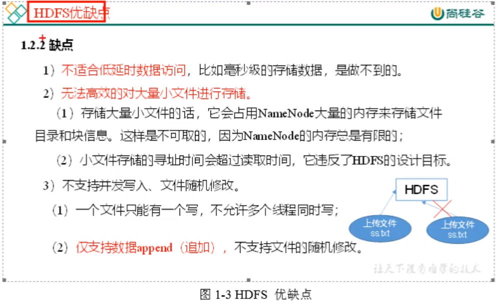
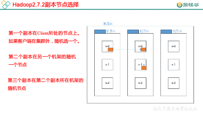

尚硅谷大数据技术之Hadoop（HDFS）

 

# 第1章 HDFS概述

## 1.1 HDFS产出背景及定义

N多台系统所组成的一个超级大的文件系统

只能往后面追加内容 ,不能改原有的内容,真的要改就要重新上传覆盖

## 1.2 HDFS优缺点

图1-2 HDFS优缺点

图1-3 HDFS 优缺点

## 1.3 HDFS组成架构

图1-4 HDFS组成架构

大小文件NN所占空间差不多,寻址时间远远大于读取时间,整个hadoop都害怕小文件

图1-5 HDFS 组成架构x

## 1.4 HDFS文件块大小（面试重点）

hdfs存储不是以文件为单位,而是以文件块为单位(只拆不合)

读写数据都要经过NN,因为索引都在它上面(文件切分成了很多块,其位置由NN维护)

切块后你实际占多大,就占多大空间,未达到128M的不需要切块实际占用多少就占用多少

图1-6 HDFS文件块大小

参考硬件性能(磁盘传输速率)可改为256,512(即希望1s能读完一个块)

文件块的大小可以根据配置文件进行配置

### 实操

两个块切开

size记录大小,avaiability

两个块可能不在同一个副本里面

# 第2章 HDFS的Shell操作（开发重点）

1．基本语法

bin/hadoop fs 具体命令  OR bin/hdfs dfs 具体命令

两个是完全相同的。

2．命令大全

[atguigu@hadoop102 hadoop-3.1.3]$ bin/hadoop fs

[-appendToFile <localsrc> ... <dst>]

​    [-cat [-ignoreCrc] <src> ...]

​    [-checksum <src> ...]

​    [-chgrp [-R] GROUP PATH...]

​    [-chmod [-R] <MODE[,MODE]... | OCTALMODE> PATH...]

​    [-chown [-R] [OWNER][:[GROUP]] PATH...]

​    [-copyFromLocal [-f] [-p] <localsrc> ... <dst>]

​    [-copyToLocal [-p] [-ignoreCrc] [-crc] <src> ... <localdst>]

​     [-count [-q] <path> ...]

​    [-cp [-f] [-p] <src> ... <dst>]

​    [-createSnapshot <snapshotDir> [<snapshotName>]]

​    [-deleteSnapshot <snapshotDir> <snapshotName>]

​    [-df [-h] [<path> ...]]

​    [-du [-s] [-h] <path> ...]

​     [-expunge]

​    [-get [-p] [-ignoreCrc] [-crc] <src> ... <localdst>]

​    [-getfacl [-R] <path>]

​    [-getmerge [-nl] <src> <localdst>]

​    [-help [cmd ...]]

​    [-ls [-d] [-h] [-R] [<path> ...]]

​    [-mkdir [-p] <path> ...]

​    [-moveFromLocal <localsrc> ... <dst>]

​    [-moveToLocal <src> <localdst>]

​    [-mv <src> ... <dst>]

​    [-put [-f] [-p] <localsrc> ... <dst>]

​    [-renameSnapshot <snapshotDir> <oldName> <newName>]

​    [-rm [-f] [-r|-R] [-skipTrash] <src> ...]

​    [-rmdir [--ignore-fail-on-non-empty] <dir> ...]

​    [-setfacl [-R] [{-b|-k} {-m|-x <acl_spec>} <path>]|[--set <acl_spec> <path>]]

​    [-setrep [-R] [-w] <rep> <path> ...]

​    [-stat [format] <path> ...]

​    [-tail [-f] <file>]

​    [-test -[defsz] <path>]

​    [-text [-ignoreCrc] <src> ...]

​    [-touchz <path> ...]

​    [-usage [cmd ...]]

3．常用命令实操

（0）启动Hadoop集群（方便后续的测试）

[atguigu@hadoop102 hadoop-3.1.3]$ sbin/start-dfs.sh

[atguigu@hadoop103 hadoop-3.1.3]$ sbin/start-yarn.sh

（1）-help：输出这个命令参数

[atguigu@hadoop102 hadoop-3.1.3]$ hadoop fs -help rm

（2）-ls: 显示目录信息

[atguigu@hadoop102 hadoop-3.1.3]$ hadoop fs -ls /

（3）-mkdir：在HDFS上创建目录

[atguigu@hadoop102 hadoop-3.1.3]$ hadoop fs -mkdir -p /sanguo/shuguo

同时创建多层目录:

（4）-moveFromLocal：从本地剪切粘贴到HDFS(本地没有了)

[atguigu@hadoop102 hadoop-3.1.3]$ touch kongming.txt

[atguigu@hadoop102 hadoop-3.1.3]$ hadoop fs -moveFromLocal ./kongming.txt /sanguo/shuguo

（5）-appendToFile：追加一个文件到已经存在的文件末尾

[atguigu@hadoop102 hadoop-3.1.3]$ touch liubei.txt

[atguigu@hadoop102 hadoop-3.1.3]$ vi liubei.txt

输入

san gu mao lu

[atguigu@hadoop102 hadoop-3.1.3]$ hadoop fs -appendToFile liubei.txt /sanguo/shuguo/kongming.txt

（6）-cat：显示文件内容

[atguigu@hadoop102 hadoop-3.1.3]$ hadoop fs -cat /sanguo/shuguo/kongming.txt

（7）-chgrp 、-chmod、-chown：Linux文件系统中的用法一样，修改文件所属权限(和linux用法一样)

[atguigu@hadoop102 hadoop-3.1.3]$ hadoop fs -chmod 666 /sanguo/shuguo/kongming.txt

[atguigu@hadoop102 hadoop-3.1.3]$ hadoop fs -chown atguigu:atguigu  /sanguo/shuguo/kongming.txt

（8）-copyFromLocal：从本地文件系统中拷贝文件到HDFS路径去

[atguigu@hadoop102 hadoop-3.1.3]$ hadoop fs -copyFromLocal README.txt /

（9）-copyToLocal：从HDFS拷贝到本地

[atguigu@hadoop102 hadoop-3.1.3]$ hadoop fs -copyToLocal /sanguo/shuguo/kongming.txt ./

（10）-cp ：从HDFS的一个路径拷贝到HDFS的另一个路径

[atguigu@hadoop102 hadoop-3.1.3]$ hadoop fs -cp /sanguo/shuguo/kongming.txt /zhuge.txt

（11）-mv：在HDFS目录中移动文件

[atguigu@hadoop102 hadoop-3.1.3]$ hadoop fs -mv /zhuge.txt /sanguo/shuguo/

（12）-get：等同于copyToLocal，就是从HDFS下载文件到本地

[atguigu@hadoop102 hadoop-3.1.3]$ hadoop fs -get /sanguo/shuguo/kongming.txt ./

（13）-getmerge：合并下载多个文件，比如HDFS的目录 /user/atguigu/test下有多个文件:log.1, log.2,log.3,...

[atguigu@hadoop102 hadoop-3.1.3]$ hadoop fs -getmerge /user/atguigu/test/* ./zaiyiqi.txt

（14）-put：等同于copyFromLocal

[atguigu@hadoop102 hadoop-3.1.3]$ hadoop fs -put ./zaiyiqi.txt /user/atguigu/test/

（15）-tail：显示一个文件的末尾(默认20行,可以使用-f跟随查看)

[atguigu@hadoop102 hadoop-3.1.3]$ hadoop fs -tail /sanguo/shuguo/kongming.txt

（16）-rm：删除文件或文件夹(删文件加-r)

[atguigu@hadoop102 hadoop-3.1.3]$ hadoop fs -rm /user/atguigu/test/jinlian2.txt

（17）-rmdir：删除空目录

[atguigu@hadoop102 hadoop-3.1.3]$ hadoop fs -mkdir /test

[atguigu@hadoop102 hadoop-3.1.3]$ hadoop fs -rmdir /test

（18）-du统计文件夹的大小信息(加h比较好阅读,加s可以汇总,第二项是包括副本的大小)

[atguigu@hadoop102 hadoop-3.1.3]$ hadoop fs -du -s -h /user/atguigu/test

2.7 K /user/atguigu/test

 

[atguigu@hadoop102 hadoop-3.1.3]$ hadoop fs -du -h /user/atguigu/test

1.3 K /user/atguigu/test/README.txt

15   /user/atguigu/test/jinlian.txt

1.4 K /user/atguigu/test/zaiyiqi.txt

（19）-setrep：设置HDFS中文件的副本数量(文件夹没有副本这一说)

[atguigu@hadoop102 hadoop-3.1.3]$ hadoop fs -setrep 5 /README.txt

​     

变小会有一个延迟,等一段时间,如果要立刻就得重新启动集群

图2-1 HDFS副本数量

这里设置的副本数只是记录在NameNode的元数据中，是否真的会有这么多副本，还得看DataNode的数量。因为目前只有3台设备，最多也就3个副本，只有节点数的增加到至少5台时，副本数才能达到5。

（20）解决web页面中操作没有权限问题，如图2-2

图2-2 web页面操作报错

​    hadoop默认情况下开启了权限检查，且默认使用dir.who作为http访问的静态用户,因此可通过关闭权限检查或者配置http访问的静态用户为atguigu，二选一即可.

​    在core-site.xml中修改http访问的静态用户为atguigu

<property>

​    <name>hadoop.http.staticuser.user</name>

​    <value>atguigu</value>

 </property>

​    在hdfs-site.xml中关闭权限检查

<property>

​    <name>dfs.permissions.enabled</name>

​    <value>false</value>

</property>

# 第3章 HDFS客户端操作（开发重点）

## 3.1 HDFS客户端环境准备

1．找到资料目录下的Windows依赖目录，打开：

图3-1 windows依赖

​       选择Hadoop-3.1.0，拷贝到其他地方(比如E:\hadoop\)。

​     

图3-2 windows依赖存放

2．配置HADOOP_HOME环境变量，如图3-3所示。

图3-3 配置HADOOP_HOME环境变量

\3. 配置Path环境变量，如图3-4所示。然后重启电脑

图3-4 配置Path环境变量

4．创建一个Maven工程

5．导入相应的依赖坐标+日志添加

<dependencies>

  <dependency>

​    <groupId>junit</groupId>

​    <artifactId>junit</artifactId>

​    <version>4.12</version>

  </dependency>

  <dependency>

​    <groupId>org.apache.logging.log4j</groupId>

​    <artifactId>log4j-slf4j-impl</artifactId>

​    <version>2.12.0</version>

  </dependency>

  <dependency>

​    <groupId>org.apache.hadoop</groupId>

​    <artifactId>hadoop-client</artifactId>

​    <version>3.1.3</version>

  </dependency>

</dependencies>

在项目的src/main /resources目录下，新建一个文件，命名为“log4j2.xml”，在文件中填入

<?xml version="1.0" encoding="UTF-8"?>

<Configuration status="error" strict="true" name="XMLConfig">

  <Appenders>

​    <!-- 类型名为Console，名称为必须属性 -->

​    <Appender type="Console" name="STDOUT">

​      <!-- 布局为PatternLayout的方式，

​      输出样式为[INFO] [2018-01-22 17:34:01][org.test.Console]I'm here -->

​      <Layout type="PatternLayout"

​          pattern="[%p] [%d{yyyy-MM-dd HH:mm:ss}][%c{10}]%m%n" />

​    </Appender>

 

  </Appenders>

 

  <Loggers>

​    <!-- 可加性为false -->

​    <Logger name="test" level="info" additivity="false">

​      <AppenderRef ref="STDOUT" />

​    </Logger>

 

​    <!-- root loggerConfig设置 -->

​    <Root level="info">

​      <AppenderRef ref="STDOUT" />

​    </Root>

  </Loggers>

 

</Configuration>

6．创建包名：com.atguigu.hdfs

7．创建HdfsClient类

public class HdfsClient{ 

  @Test

  public void testHdfsClient() throws IOException, InterruptedException {

​    //1. 创建HDFS客户端对象,传入uri， configuration , user

​    FileSystem fileSystem =

​        FileSystem.get(URI.create("hdfs://hadoop102:9820"), new Configuration(), "atguigu");

​    //2. 操作集群

​    // 例如：在集群的/目录下创建 testHDFS目录

​    fileSystem.mkdirs(new Path("/testHDFS"));

​    //3. 关闭资源

​    fileSystem.close();

  }

}

8．执行程序

## 3.2 HDFS的API操作

### 3.2.1 HDFS文件上传（测试参数优先级）

1．编写源代码

@Testpublic void testCopyFromLocalFile() throws IOException, InterruptedException, URISyntaxException {    // 1 获取文件系统   Configuration configuration = new Configuration();    // 设置副本数为2个   configuration.set("dfs.replication", "2");   FileSystem fs = FileSystem.get(new URI("hdfs://hadoop102:9820"), configuration, "atguigu");    // 2 上传文件   fs.copyFromLocalFile(new Path("e:/banzhang.txt"), new Path("/banzhang.txt"));    // 3 关闭资源   fs.close(); }

2．在项目的resources中新建hdfs-site.xml文件，并将如下内容拷贝进去，再次测试

<?xml version="1.0" encoding="UTF-8"?><?xml-stylesheet type="text/xsl" href="configuration.xsl"?> <configuration>  <property>   <name>dfs.replication</name>    <value>1</value>  </property></configuration>

3．参数优先级

参数优先级排序：（1）客户端代码中设置的值 >（2）ClassPath下的用户自定义配置文件 >（3）然后是服务器的自定义配置(xxx-site.xml) >（4）服务器的默认配置(xxx-default.xml)

### 3.2.2 HDFS文件下载

@Test

public void testCopyToLocalFile() throws IOException, InterruptedException, URISyntaxException{

 

   // 1 获取文件系统

   Configuration configuration = new Configuration();

   FileSystem fs = FileSystem.get(new URI("hdfs://hadoop102:9820"), configuration, "atguigu");

   

   // 2 执行下载操作

   // boolean delSrc 指是否将原文件删除

   // Path src 指要下载的文件路径

   // Path dst 指将文件下载到的路径

   // boolean useRawLocalFileSystem 是否开启文件校验

   fs.copyToLocalFile(false, new Path("/banzhang.txt"), new Path("e:/banhua.txt"), true);

   

   // 3 关闭资源

   fs.close();

}

### 3.2.3 HDFS文件夹删除

@Test

public void testDelete() throws IOException, InterruptedException, URISyntaxException{

 

  // 1 获取文件系统

  Configuration configuration = new Configuration();

  FileSystem fs = FileSystem.get(new URI("hdfs://hadoop102:9820"), configuration, "atguigu");

   

  // 2 执行删除

  fs.delete(new Path("/0213/"), true);

   

  // 3 关闭资源

  fs.close();

}

### 3.2.4 HDFS文件名更改/移动

@Test

public void testRename() throws IOException, InterruptedException, URISyntaxException{

 

  // 1 获取文件系统

  Configuration configuration = new Configuration();

  FileSystem fs = FileSystem.get(new URI("hdfs://hadoop102:9820"), configuration, "atguigu");

   

  // 2 修改文件名称

  fs.rename(new Path("/banzhang.txt"), new Path("/banhua.txt"));

   

  // 3 关闭资源

  fs.close();

}

### 3.2.5 HDFS文件详情查看

查看文件名称、权限、长度、块信息

@Test

public void testListFiles() throws IOException, InterruptedException, URISyntaxException{

 

  // 1获取文件系统

  Configuration configuration = new Configuration();

  FileSystem fs = FileSystem.get(new URI("hdfs://hadoop102:9820"), configuration, "atguigu");

   

  // 2 获取文件详情

  RemoteIterator<LocatedFileStatus> listFiles = fs.listFiles(new Path("/"), true);

   

  while(listFiles.hasNext()){

   LocatedFileStatus status = listFiles.next();

​    

   // 输出详情

   // 文件名称

   System.out.println(status.getPath().getName());

   // 长度

   System.out.println(status.getLen());

   // 权限

   System.out.println(status.getPermission());

   // 分组

   System.out.println(status.getGroup());

​    

   // 获取存储的块信息

   BlockLocation[] blockLocations = status.getBlockLocations();

​    

​    for (BlockLocation blockLocation : blockLocations) {

​      

​     // 获取块存储的主机节点

​     String[] hosts = blockLocation.getHosts();

​      

​     for (String host : hosts) {

​      System.out.println(host);

​     }

   }

​    

   System.out.println("-----------漂亮的分割线----------");

  }

 

// 3 关闭资源

fs.close();

}

### 3.2.6 HDFS文件和文件夹判断

@Test

public void testListStatus() throws IOException, InterruptedException, URISyntaxException{

   

  // 1 获取文件配置信息

  Configuration configuration = new Configuration();

  FileSystem fs = FileSystem.get(new URI("hdfs://hadoop102:9820"), configuration, "atguigu");

   

  // 2 判断是文件还是文件夹

  FileStatus[] listStatus = fs.listStatus(new Path("/"));

   

  for (FileStatus fileStatus : listStatus) {

   

   // 如果是文件

   if (fileStatus.isFile()) {

​      System.out.println("f:"+fileStatus.getPath().getName());

​     }else {

​      System.out.println("d:"+fileStatus.getPath().getName());

​     }

   }

   

  // 3 关闭资源

  fs.close();

}

# 第4章 HDFS的数据流（面试重点）

## 4.1 HDFS写数据流程

### 4.1.1 剖析文件写入

HDFS写数据流程，如图4-1所示。

图4-1 配置用户名称

1）客户端通过Distributed FileSystem模块向NameNode请求上传文件，NameNode检查目标文件是否已存在，父目录是否存在。

2）NameNode返回是否可以上传。

3）客户端请求第一个 Block上传到哪几个DataNode服务器上。

4）NameNode返回3个DataNode节点，分别为dn1、dn2、dn3。

5）客户端通过FSDataOutputStream模块请求dn1上传数据，dn1收到请求会继续调用dn2，然后dn2调用dn3，将这个通信管道建立完成。

6）dn1、dn2、dn3逐级应答客户端。

7）客户端开始往dn1上传第一个Block（先从磁盘读取数据放到一个本地内存缓存），以Packet为单位，dn1收到一个Packet就会传给dn2，dn2传给dn3；dn1每传一个packet会放入一个应答队列等待应答。

8）当一个Block传输完成之后，客户端再次请求NameNode上传第二个Block的服务器。（重复执行3-7步）。

### 4.1.2 网络拓扑-节点距离计算

​    在HDFS写数据的过程中，NameNode会选择距离待上传数据最近距离的DataNode接收数据。那么这个最近距离怎么计算呢？

​    节点距离：两个节点到达最近的共同祖先的距离总和。

图4-2 网络拓扑概念

例如，假设有数据中心d1机架r1中的节点n1。该节点可以表示为/d1/r1/n1。利用这种标记，这里给出四种距离描述，如图4-2所示。

大家算一算每两个节点之间的距离，如图4-3所示。

图4-3 网络拓扑

### 4.1.3 机架感知（副本存储节点选择）

1.机架感知说明

[http://hadoop.apache.org/docs/r3.1.3/hadoop-project-dist/hadoop-hdfs/HdfsDesign.html#Data_Replication](http://hadoop.apache.org/docs/r2.7.2/hadoop-project-dist/hadoop-hdfs/HdfsDesign.html#Data_Replication)

For the common case, when the replication factor is three, HDFS’s placement policy is to put one replica on the local machine if the writer is on a datanode, otherwise on a random datanode, another replica on a node in a different (remote) rack, and the last on a different node in the same remote rack.

\2. Hadoop3.1.3副本节点选择

图4-4 副本节点选择

## 4.2 HDFS读数据流程

HDFS的读数据流程，如图4-5所示。

图4-5 HDFS读数据流程

1）客户端通过Distributed FileSystem向NameNode请求下载文件，NameNode通过查询元数据，找到文件块所在的DataNode地址。

2）挑选一台DataNode（就近原则，然后随机）服务器，请求读取数据。

3）DataNode开始传输数据给客户端（从磁盘里面读取数据输入流，以Packet为单位来做校验）。

4）客户端以Packet为单位接收，先在本地缓存，然后写入目标文件。

# 第5章 NameNode和SecondaryNameNode（面试开发重点）

## 5.1 NN和2NN工作机制

思考：NameNode中的元数据是存储在哪里的？

首先，我们做个假设，如果存储在NameNode节点的磁盘中，因为经常需要进行随机访问，还有响应客户请求，必然是效率过低。因此，元数据需要存放在内存中。但如果只存在内存中，一旦断电，元数据丢失，整个集群就无法工作了。因此产生在磁盘中备份元数据的FsImage。

这样又会带来新的问题，当在内存中的元数据更新时，如果同时更新FsImage，就会导致效率过低，但如果不更新，就会发生一致性问题，一旦NameNode节点断电，就会产生数据丢失。因此，引入Edits文件(只进行追加操作，效率很高)。每当元数据有更新或者添加元数据时，修改内存中的元数据并追加到Edits中。这样，一旦NameNode节点断电，可以通过FsImage和Edits的合并，合成元数据。

但是，如果长时间添加数据到Edits中，会导致该文件数据过大，效率降低，而且一旦断电，恢复元数据需要的时间过长。因此，需要定期进行FsImage和Edits的合并，如果这个操作由NameNode节点完成，又会效率过低。因此，引入一个新的节点SecondaryNamenode，专门用于FsImage和Edits的合并。

NN和2NN工作机制，如图5-1所示。

图5-1 NN和2NN工作机制

\1. 第一阶段：NameNode启动

（1）第一次启动NameNode格式化后，创建Fsimage和Edits文件。如果不是第一次启动，直接加载编辑日志和镜像文件到内存。

（2）客户端对元数据进行增删改的请求。

（3）NameNode记录操作日志，更新滚动日志。

（4）NameNode在内存中对元数据进行增删改。

\2. 第二阶段：Secondary NameNode工作

​    （1）Secondary NameNode询问NameNode是否需要CheckPoint。直接带回NameNode是否检查结果。

​    （2）Secondary NameNode请求执行CheckPoint。

​    （3）NameNode滚动正在写的Edits日志。

​    （4）将滚动前的编辑日志和镜像文件拷贝到Secondary NameNode。

​    （5）Secondary NameNode加载编辑日志和镜像文件到内存，并合并。

​    （6）生成新的镜像文件fsimage.chkpoint。

​    （7）拷贝fsimage.chkpoint到NameNode。

​    （8）NameNode将fsimage.chkpoint重新命名成fsimage。

**NN****和2NN****工作机制详解：**Fsimage：NameNode内存中元数据序列化后形成的文件。Edits：记录客户端更新元数据信息的每一步操作（可通过Edits运算出元数据）。NameNode启动时，先滚动Edits并生成一个空的edits.inprogress，然后加载Edits和Fsimage到内存中，此时NameNode内存就持有最新的元数据信息。Client开始对NameNode发送元数据的增删改的请求，这些请求的操作首先会被记录到edits.inprogress中（查询元数据的操作不会被记录在Edits中，因为查询操作不会更改元数据信息），如果此时NameNode挂掉，重启后会从Edits中读取元数据的信息。然后，NameNode会在内存中执行元数据的增删改的操作。由于Edits中记录的操作会越来越多，Edits文件会越来越大，导致NameNode在启动加载Edits时会很慢，所以需要对Edits和Fsimage进行合并（所谓合并，就是将Edits和Fsimage加载到内存中，照着Edits中的操作一步步执行，最终形成新的Fsimage）。SecondaryNameNode的作用就是帮助NameNode进行Edits和Fsimage的合并工作。SecondaryNameNode首先会询问NameNode是否需要CheckPoint（触发CheckPoint需要满足两个条件中的任意一个，定时时间到和Edits中数据写满了）。直接带回NameNode是否检查结果。SecondaryNameNode执行CheckPoint操作，首先会让NameNode滚动Edits并生成一个空的edits.inprogress，滚动Edits的目的是给Edits打个标记，以后所有新的操作都写入edits.inprogress，其他未合并的Edits和Fsimage会拷贝到SecondaryNameNode的本地，然后将拷贝的Edits和Fsimage加载到内存中进行合并，生成fsimage.chkpoint，然后将fsimage.chkpoint拷贝给NameNode，重命名为Fsimage后替换掉原来的Fsimage。NameNode在启动时就只需要加载之前未合并的Edits和Fsimage即可，因为合并过的Edits中的元数据信息已经被记录在Fsimage中。

## 5.2 Fsimage和Edits解析

\1. 概念

图5-2 Fsimage 和 Edits

\2. oiv查看Fsimage文件

（1）查看oiv和oev命令

[atguigu@hadoop102 current]$ hdfs

**oiv**      apply the offline fsimage viewer to an fsimage

**oev**      apply the offline edits viewer to an edits file

（2）基本语法

hdfs oiv -p 文件类型 -i镜像文件 -o 转换后文件输出路径

（3）案例实操

[atguigu@hadoop102 current]$ pwd

/opt/module/hadoop-3.1.3/data/tmp/dfs/name/current

 

[atguigu@hadoop102 current]$ hdfs oiv -p XML -i fsimage_0000000000000000025 -o /opt/module/hadoop-3.1.3/fsimage.xml

 

[atguigu@hadoop102 current]$ cat /opt/module/hadoop-3.1.3/fsimage.xml

将显示的xml文件内容拷贝到Eclipse中创建的xml文件中，并格式化。部分显示结果如下。

<inode>

<id>16386</id>

<type>DIRECTORY</type>

<name>user</name>

<mtime>1512722284477</mtime>

<permission>atguigu:supergroup:rwxr-xr-x</permission>

<nsquota>-1</nsquota>

<dsquota>-1</dsquota>

</inode>

<inode>

<id>16387</id>

<type>DIRECTORY</type>

<name>atguigu</name>

<mtime>1512790549080</mtime>

<permission>atguigu:supergroup:rwxr-xr-x</permission>

<nsquota>-1</nsquota>

<dsquota>-1</dsquota>

</inode>

<inode>

<id>16389</id>

<type>FILE</type>

<name>wc.input</name>

<replication>3</replication>

<mtime>1512722322219</mtime>

<atime>1512722321610</atime>

<perferredBlockSize>134217728</perferredBlockSize>

<permission>atguigu:supergroup:rw-r--r--</permission>

<blocks>

  <block>

​    <id>1073741825</id>

​    <genstamp>1001</genstamp>

​    <numBytes>59</numBytes>

  </block>

</blocks>

</inode >

思考：可以看出，Fsimage中没有记录块所对应DataNode，为什么？

在集群启动后，要求DataNode上报数据块信息，并间隔一段时间后再次上报。

\3. oev查看Edits文件

（1）基本语法

hdfs oev -p 文件类型 -i编辑日志 -o 转换后文件输出路径

（2）案例实操

[atguigu@hadoop102 current]$ hdfs oev -p XML -i edits_0000000000000000012-0000000000000000013 -o /opt/module/hadoop-3.1.3/edits.xml

 

[atguigu@hadoop102 current]$ cat /opt/module/hadoop-3.1.3/edits.xml

将显示的xml文件内容拷贝到Eclipse中创建的xml文件中，并格式化。显示结果如下。

<?xml version="1.0" encoding="UTF-8"?>

<EDITS>

<EDITS_VERSION>-63</EDITS_VERSION>

<RECORD>

  <OPCODE>OP_START_LOG_SEGMENT</OPCODE>

  <DATA>

​    <TXID>129</TXID>

  </DATA>

</RECORD>

<RECORD>

  <OPCODE>OP_ADD</OPCODE>

  <DATA>

​    <TXID>130</TXID>

​    <LENGTH>0</LENGTH>

​    <INODEID>16407</INODEID>

​    <PATH>/hello7.txt</PATH>

​    <REPLICATION>2</REPLICATION>

​    <MTIME>1512943607866</MTIME>

​    <ATIME>1512943607866</ATIME>

​    <BLOCKSIZE>134217728</BLOCKSIZE>

​    <CLIENT_NAME>DFSClient_NONMAPREDUCE_-1544295051_1</CLIENT_NAME>

​    <CLIENT_MACHINE>192.168.1.5</CLIENT_MACHINE>

​    <OVERWRITE>true</OVERWRITE>

​    <PERMISSION_STATUS>

​     <USERNAME>atguigu</USERNAME>

​     <GROUPNAME>supergroup</GROUPNAME>

​     <MODE>420</MODE>

​    </PERMISSION_STATUS>

​    <RPC_CLIENTID>908eafd4-9aec-4288-96f1-e8011d181561</RPC_CLIENTID>

​    <RPC_CALLID>0</RPC_CALLID>

  </DATA>

</RECORD>

<RECORD>

  <OPCODE>OP_ALLOCATE_BLOCK_ID</OPCODE>

  <DATA>

​    <TXID>131</TXID>

​    <BLOCK_ID>1073741839</BLOCK_ID>

  </DATA>

</RECORD>

<RECORD>

  <OPCODE>OP_SET_GENSTAMP_V2</OPCODE>

  <DATA>

​    <TXID>132</TXID>

​    <GENSTAMPV2>1016</GENSTAMPV2>

  </DATA>

</RECORD>

<RECORD>

  <OPCODE>OP_ADD_BLOCK</OPCODE>

  <DATA>

​    <TXID>133</TXID>

​    <PATH>/hello7.txt</PATH>

​    <BLOCK>

​     <BLOCK_ID>1073741839</BLOCK_ID>

​     <NUM_BYTES>0</NUM_BYTES>

​     <GENSTAMP>1016</GENSTAMP>

​    </BLOCK>

​    <RPC_CLIENTID></RPC_CLIENTID>

​    <RPC_CALLID>-2</RPC_CALLID>

  </DATA>

</RECORD>

<RECORD>

  <OPCODE>OP_CLOSE</OPCODE>

  <DATA>

​    <TXID>134</TXID>

​    <LENGTH>0</LENGTH>

​    <INODEID>0</INODEID>

​    <PATH>/hello7.txt</PATH>

​    <REPLICATION>2</REPLICATION>

​    <MTIME>1512943608761</MTIME>

​    <ATIME>1512943607866</ATIME>

​    <BLOCKSIZE>134217728</BLOCKSIZE>

​    <CLIENT_NAME></CLIENT_NAME>

​    <CLIENT_MACHINE></CLIENT_MACHINE>

​    <OVERWRITE>false</OVERWRITE>

​    <BLOCK>

​     <BLOCK_ID>1073741839</BLOCK_ID>

​     <NUM_BYTES>25</NUM_BYTES>

​     <GENSTAMP>1016</GENSTAMP>

​    </BLOCK>

​    <PERMISSION_STATUS>

​     <USERNAME>atguigu</USERNAME>

​     <GROUPNAME>supergroup</GROUPNAME>

​     <MODE>420</MODE>

​    </PERMISSION_STATUS>

  </DATA>

</RECORD>

</EDITS >

思考：NameNode如何确定下次开机启动的时候合并哪些Edits？

## 5.3 CheckPoint时间设置

（1）通常情况下，SecondaryNameNode每隔一小时执行一次。

​    [hdfs-default.xml]

<property>

 <name>dfs.namenode.checkpoint.period</name>

 <value>3600</value>

</property>

（2）一分钟检查一次操作次数，3当操作次数达到1百万时，SecondaryNameNode执行一次。

<property>

 <name>dfs.namenode.checkpoint.txns</name>

 <value>1000000</value>

<description>操作动作次数</description>

</property>

 

<property>

 <name>dfs.namenode.checkpoint.check.period</name>

 <value>60</value>

<description> 1分钟检查一次操作次数</description>

</property >

## 5.4 NameNode故障处理（扩展）

NameNode故障后，可以采用如下两种方法恢复数据。

**方法一：将SecondaryNameNode****中数据拷贝到NameNode****存储数据的目录；**

\1. kill -9 NameNode进程

\2. 删除NameNode存储的数据（/opt/module/hadoop-3.1.3/data/tmp/dfs/name）

[atguigu@hadoop102 hadoop-3.1.3]$ rm -rf /opt/module/hadoop-3.1.3/data/tmp/dfs/name/*

\3. 拷贝SecondaryNameNode中数据到原NameNode存储数据目录

[atguigu@hadoop102 dfs]$ scp -r atguigu@hadoop104:/opt/module/hadoop-3.1.3/data/tmp/dfs/namesecondary/* ./name/

\4. 重新启动NameNode

[atguigu@hadoop102 hadoop-3.1.3]$ hdfs --daemon start namenode

**方法二：使用-importCheckpoint****选项启动NameNode****守护进程，从而将SecondaryNameNode****中数据拷贝到NameNode****目录中。**

\1.   修改hdfs-site.xml中的

<property>

 <name>dfs.namenode.checkpoint.period</name>

 <value>120</value>

</property>

 

<property>

 <name>dfs.namenode.name.dir</name>

 <value>/opt/module/hadoop-3.1.3/data/tmp/dfs/name</value>

</property>

\2. kill -9 NameNode进程

\3.  删除NameNode存储的数据（/opt/module/hadoop-3.1.3/data/tmp/dfs/name）

[atguigu@hadoop102 hadoop-3.1.3]$ rm -rf /opt/module/hadoop-3.1.3/data/tmp/dfs/name/*

\4.  如果SecondaryNameNode不和NameNode在一个主机节点上，需要将SecondaryNameNode存储数据的目录拷贝到NameNode存储数据的平级目录，并删除in_use.lock文件

[atguigu@hadoop102 dfs]$ scp -r atguigu@hadoop104:/opt/module/hadoop-3.1.3/data/tmp/dfs/namesecondary ./

 

[atguigu@hadoop102 namesecondary]$ rm -rf in_use.lock

 

[atguigu@hadoop102 dfs]$ pwd

/opt/module/hadoop-3.1.3/data/tmp/dfs

 

[atguigu@hadoop102 dfs]$ ls

data name namesecondary

\5.  导入检查点数据（等待一会ctrl+c结束掉）

[atguigu@hadoop102 hadoop-3.1.3]$ bin/hdfs namenode -importCheckpoint

\6.  启动NameNode

[atguigu@hadoop102 hadoop-3.1.3]$ hdfs --daemon start namenode

## 5.5 集群安全模式

\1.  概述

图5-3 集群安全模式

\2.   基本语法

集群处于安全模式，不能执行重要操作（写操作）。集群启动完成后，自动退出安全模式。

（1）bin/hdfs dfsadmin -safemode get    （功能描述：查看安全模式状态）

（2）bin/hdfs dfsadmin -safemode enter  （功能描述：进入安全模式状态）

（3）bin/hdfs dfsadmin -safemode leave   （功能描述：离开安全模式状态）

（4）bin/hdfs dfsadmin -safemode wait    （功能描述：等待安全模式状态）

\3.  案例

​    模拟等待安全模式

（1）查看当前模式

[atguigu@hadoop102 hadoop-3.1.3]$ hdfs dfsadmin -safemode get

Safe mode is OFF

（2）先进入安全模式

[atguigu@hadoop102 hadoop-3.1.3]$ bin/hdfs dfsadmin -safemode enter

​    （3）创建并执行下面的脚本

在/opt/module/hadoop-3.1.3路径上，编辑一个脚本safemode.sh

[atguigu@hadoop102 hadoop-3.1.3]$ touch safemode.sh

[atguigu@hadoop102 hadoop-3.1.3]$ vim safemode.sh

 

\#!/bin/bash

hdfs dfsadmin -safemode wait

hdfs dfs -put /opt/module/hadoop-3.1.3/README.txt /

 

[atguigu@hadoop102 hadoop-3.1.3]$ chmod 777 safemode.sh

 

[atguigu@hadoop102 hadoop-3.1.3]$ ./safemode.sh

​    （4）再打开一个窗口，执行

[atguigu@hadoop102 hadoop-3.1.3]$ bin/hdfs dfsadmin -safemode leave

（5）观察

（a）再观察上一个窗口

Safe mode is OFF

（b）HDFS集群上已经有上传的数据了。

## 5.6 NameNode多目录配置

\1.  NameNode的本地目录可以配置成多个，且每个目录存放内容相同，增加了可靠性

\2.  具体配置如下

​    （1）在hdfs-site.xml文件中修改如下内容

<property>

  <name>dfs.namenode.name.dir</name>

<value>file:///${hadoop.tmp.dir}/name1,file:///${hadoop.tmp.dir}/name2</value>

</property>

（2）停止集群，删除data和logs中所有数据。

[atguigu@hadoop102 hadoop-3.1.3]$ rm -rf data/ logs/

[atguigu@hadoop103 hadoop-3.1.3]$ rm -rf data/ logs/

[atguigu@hadoop104 hadoop-3.1.3]$ rm -rf data/ logs/

（3）格式化集群并启动。

[atguigu@hadoop102 hadoop-3.1.3]$ bin/hdfs namenode –format

[atguigu@hadoop102 hadoop-3.1.3]$ sbin/start-dfs.sh

（4）查看结果

[atguigu@hadoop102 dfs]$ ll

总用量 12

drwx------. 3 atguigu atguigu 4096 12月 11 08:03 data

drwxrwxr-x. 3 atguigu atguigu 4096 12月 11 08:03 name1

drwxrwxr-x. 3 atguigu atguigu 4096 12月 11 08:03 name2

 

# 第6章 DataNode（面试开发重点）

## 6.1 DataNode工作机制

DataNode工作机制，如图6-1所示。

图6-1 DataNode工作机制

1）一个数据块在DataNode上以文件形式存储在磁盘上，包括两个文件，一个是数据本身，一个是元数据包括数据块的长度，块数据的校验和，以及时间戳。

2）DataNode启动后向NameNode注册，通过后，周期性（1小时）的向NameNode上报所有的块信息。

3）心跳是每3秒一次，心跳返回结果带有NameNode给该DataNode的命令如复制块数据到另一台机器，或删除某个数据块。如果超过10分钟没有收到某个DataNode的心跳，则认为该节点不可用。

4）集群运行中可以安全加入和退出一些机器。

## 6.2 数据完整性

思考：如果电脑磁盘里面存储的数据是控制高铁信号灯的红灯信号（1）和绿灯信号（0），但是存储该数据的磁盘坏了，一直显示是绿灯，是否很危险？同理DataNode节点上的数据损坏了，却没有发现，是否也很危险，那么如何解决呢？

如下是DataNode节点保证数据完整性的方法。

1）当DataNode读取Block的时候，它会计算CheckSum。

2）如果计算后的CheckSum，与Block创建时值不一样，说明Block已经损坏。

3）Client读取其他DataNode上的Block。

4）常见的校验算法 crc（32）  md5（128）  sha1（160）

5）DataNode在其文件创建后周期验证CheckSum，如图6-2所示。

图6-2 校验和

## 6.3 掉线时限参数设置

图 6-3 掉线时限

​    需要注意的是hdfs-site.xml 配置文件中的heartbeat.recheck.interval的单位为毫秒，dfs.heartbeat.interval的单位为秒。

<property>

  <name>dfs.namenode.heartbeat.recheck-interval</name>

  <value>300000</value>

</property>

<property>

  <name>dfs.heartbeat.interval</name>

  <value>3</value>

</property>

## 6.4 服役新数据节点

\0. 需求

随着公司业务的增长，数据量越来越大，原有的数据节点的容量已经不能满足存储数据的需求，需要在原有集群基础上动态添加新的数据节点。

\1.  环境准备

​    （1）在hadoop104主机上再克隆一台hadoop105主机

​    （2）修改IP地址和主机名称

​    （3）**删除原来****HDFS****文件系统留存的文件（/opt/module/hadoop-3.1.3/data****和log****）**

​    （4）source一下配置文件

[atguigu@hadoop105 hadoop-3.1.3]$ source /etc/profile

\2.  服役新节点具体步骤

（1）直接启动DataNode，即可关联到集群

[atguigu@hadoop105 hadoop-3.1.3]$ hdfs --daemon start datanode

[atguigu@hadoop105 hadoop-3.1.3]$yarn -–daemon start nodemanager

图6-4 DataNode节点

（2）如果数据不均衡，可以用命令实现集群的再平衡

[atguigu@hadoop102 hadoop-3.1.3]$ sbin/start-balancer.sh

## 6.5 退役旧数据节点

### 6.5.1 添加白名单 和 黑名单

​    添加到白名单的主机节点，都允许访问NameNode，不在白名单的主机节点，都会被直接退出。

​    添加到黑名单的主机节点，不允许访问NameNode，会在数据迁移后退出。

​    实际情况下，白名单用于确定允许访问NameNode的DataNode节点，内容配置一般与workers文件内容一致。 黑名单用于在集群运行过程中退役DataNode节点。

配置白名单和黑名单的具体步骤如下：

（1）在NameNode的/opt/module/hadoop-3.1.3/etc/hadoop目录下分别创建whitelist 和blacklist文件

[atguigu@hadoop102 hadoop]$ pwd

/opt/module/hadoop-3.1.3/etc/hadoop

[atguigu@hadoop102 hadoop]$ touch whitelist

[atguigu@hadoop102 hadoop]$ touch blacklist

在whitelist中添加如下主机名称,假如集群正常工作的节点为102 103 104 105

hadoop102

hadoop103

hadoop104

hadoop105

​       黑名单暂时为空。

​    （2）在NameNode的hdfs-site.xml配置文件中增加dfs.hosts 和 dfs.hosts.exclude配置

<property>

<name>dfs.hosts</name>

<value>/opt/module/hadoop-3.1.3/etc/hadoop/whitelist</value>

</property>

 

<property>

<name>dfs.hosts.exclude</name>

<value>/opt/module/hadoop-3.1.3/etc/hadoop/blacklist</value>

</property>

 

（3）配置文件分发

[atguigu@hadoop102 hadoop]$ xsync hdfs-site.xml

​    （4）重新启动集群

[atguigu@hadoop102 hadoop-3.1.3]$ stop-dfs.sh

[atguigu@hadoop102 hadoop-3.1.3]$ start-dfs.sh

注意: 因为workers中没有配置105,需要单独在105启动DN

​    （5）在web端查看目前正常工作的DN节点

   

图6-5 DataNode节点

### 6.5.2 黑名单退役

（1）准备使用黑名单退役105

   编辑blacklist文件，添加105  

[atguigu@hadoop102 hadoop] vim blacklist

hadoop105

​    （2）刷新NameNode

[atguigu@hadoop102 hadoop] hdfs dfsadmin -refreshNodes

​    （3）在web端查看DN状态，105 正在退役中…进行数据的迁移

   

图6-6 DataNode退役中

​    （4）如果105也启动的NodeManager，也可以刷新yarn状态。【可选查看】

[atguigu@hadoop102 hadoop-3.1.3]$ yarn rmadmin -refreshNodes

### 6.5.3 白名单退役[不推荐]

白名单退役会直接将节点抛弃，没有迁移数据的过程，会造成数据丢失。

 

（1）   删除blacklist的中的内容，恢复 102 103 104 105 正常工作，如图

​    

图6-7 退役前DataNode节点

​    （2）修改whitelist，将105删除,保留102 103 104

[atguigu@hadoop102 hadoop]$ vim whitelist

hadoop102

hadoop103

hadoop104

​    （3）刷新NameNode

[atguigu@hadoop102 hadoop-3.1.3]$ hdfs dfsadmin -refreshNodes

​    （4）web端查看，发现105节点直接从集群列表中丢弃

​    

图6-8 退役后DataNode节点

## 6.6 Datanode多目录配置

\1.  DataNode也可以配置成多个目录，每个目录存储的数据不一样。即：数据不是副本

2．具体配置如下

  （1）在hdfs-site.xml中修改如下内容:

<property>

​    <name>dfs.datanode.data.dir</name>

<value>file:///${hadoop.tmp.dir}/data1,file:///${hadoop.tmp.dir}/data2</value>

</property>

  （2）停止集群，删除data和logs中所有数据。

[atguigu@hadoop102 hadoop-3.1.3]$ rm -rf data/ logs/

[atguigu@hadoop103 hadoop-3.1.3]$ rm -rf data/ logs/

[atguigu@hadoop104 hadoop-3.1.3]$ rm -rf data/ logs/

  （3）格式化集群并启动。

[atguigu@hadoop102 hadoop-3.1.3]$ bin/hdfs namenode –format

[atguigu@hadoop102 hadoop-3.1.3]$ sbin/start-dfs.sh

  （4）查看结果

[atguigu@hadoop102 dfs]$ ll

总用量 12

drwx------. 3 atguigu atguigu 4096 4月  4 14:22 data1

drwx------. 3 atguigu atguigu 4096 4月  4 14:22 data2

drwxrwxr-x. 3 atguigu atguigu 4096 12月 11 08:03 name1

drwxrwxr-x. 3 atguigu atguigu 4096 12月 11 08:03 name2

 

# 第7章 小文件存档

图7-1 小文件存档

3．案例实操

（1）需要启动YARN进程

[atguigu@hadoop102 hadoop-3.1.3]$ start-yarn.sh

（2）归档文件

​    把/user/atguigu/input目录里面的所有文件归档成一个叫input.har的归档文件，并把归档后文件存储到/user/atguigu/output路径下。

[atguigu@hadoop102 hadoop-3.1.3]$ bin/hadoop archive -archiveName input.har –p /user/atguigu/input  /user/atguigu/output

（3）查看归档

[atguigu@hadoop102 hadoop-3.1.3]$ hadoop fs -lsr /user/atguigu/output/input.har

[atguigu@hadoop102 hadoop-3.1.3]$ hadoop fs -lsr har:///user/atguigu/output/input.har

（4）解归档文件

[atguigu@hadoop102 hadoop-3.1.3]$ hadoop fs -cp har:/// user/atguigu/output/input.har/*  /user/atguigu

 