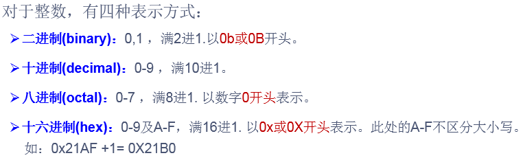

# day03授课笔记

讲师：宋红康

***

## 一、进制

### 基本情况

-  所有数字在计算机底层都以**二进制**形式存在



- 进制间的对应关系：


### 二进制与十进制间的转换

- 二进制转为十进制


**练习：**


- 十进制转为二进制


### 四种进制间的转换


- 二进制转换为八进制


- 二进制转换为十六进制


- 八进制转换为二进制


- 十六进制转换为二进制


## 二、运算符

### 1. 算术运算符

```
+  -  +  - *  /  %  (前)++   (后)++   (前)--   (后)--  + 
```

```java
class AriTest {
	public static void main(String[] args) {
		
		int i1 = 10;
		int i2 = -20;


		int num1 = 12;
		int num2 = 5;
		int num3 = num1 / num2;//2
		System.out.println(num3);//2

		double num4 = num1 / num2;//2.0
		System.out.println(num4);

		//
		double num5 = (double)(num1 / num2);
		System.out.println(num5);//2.0

		double num6 = num1 / (num2 + 0.0);
		System.out.println(num6);//2.4

		double num7 = (double)num1 / num2;
		System.out.println(num7);//2.4

		double num8 = num1 / num2 + 0.0;//2.0

		
		System.out.println(num1 / num2 * num2);//10

		// %:取余数
		// 取模以后结果的符号，取决于被模数的符号。
		//开发中，经常使用此符号表示，是否可以除尽某个数。比如： num % 2 == 0
		int m1 = 13;
		int n1 = 5;
		System.out.println(m1 % n1);//3

		int m2 = -13;
		int n2 = 5;
		System.out.println(m2 % n2);//-3

		int m3 = 13;
		int n3 = -5;
		System.out.println(m3 % n3);//3

		int m4 = -13;
		int n4 = -5;
		System.out.println(m4 % n4);//-3

		//(前)++：先自增1，再运算
		//(后)++：先运算，后自增1
		int a1 = 10;
		int b1 = ++a1;
		System.out.println("a1 = " + a1);//11
		System.out.println("b1 = " + b1);//11

		int a2 = 10;
		int b2 = a2++;
		System.out.println("a2 = " + a2);//11
		System.out.println("b2 = " + b2);//10

		//练习1
		int j1 = 10;
		//j1++;
		++j1;
		System.out.println(j1);//11

		//练习2:
		short s1 = 10;
		//s1 = s1 + 1;//编译不通过
		//System.out.println(s1);

		s1 = (short)(s1 + 1);
		System.out.println(s1);//11

		short s2 = 10;
		s2++;//不会改变变量本身的类型!!!
		System.out.println(s2);

		//(前)--: 先自减1，再运算
		//(后)--：先运算，后自减1

		//+:连接，仅针对于字符串与其他类型变量间的运算。


		//思考？
		s1 = s1++ + ++s1;
		

	}
}
```

#### 练习：

随意给出一个整数，打印显示它的个位数，十位数，百位数的值。
格式如下：
数字xxx的情况如下：
个位数：
十位数：
百位数：

例如：
数字153的情况如下：
个位数：3
十位数：5
百位数：1

```java
class AriExer {
	public static void main(String[] args) {
		int num = 271;
		
		int bai = num / 100;
		int shi = num / 10 % 10;
		int ge = num % 10;

		/*
		int bai = num/100;
		int shi = num%100/10;
		int ge = num%10;
		*/

		System.out.println("个位数为：" + ge);
		System.out.println("十位数为：" + shi);
		System.out.println("百位数为：" + bai);
	}
}
```

### 2. 赋值运算符

```
=  +=  -=   *=  /=  %=
```

```java
class SetValueTest {
	public static void main(String[] args) {
		//写法一
		int i1 = 10;
		int i2 = 10;
		
		//写法二
		int i3,i4;
		i3 = i4 = 10;//连续赋值

		//写法三
		int i5 = 10,i6 = 20;


		int num1 = 20;
		num1 += 2;//相当于num1 = num1 + 2;

		System.out.println("num1 = " + num1);//22

		num1 %= 3;//num1 = num1 % 3;
		System.out.println("num1 = " + num1);//1


		short s1 = 10;
		s1 += 2;//相当于s1 =  s1 + 2,同时运算结果不改变变量类型
		System.out.println(s1);

		//总结：如果开发中，针对于数值型变量，想做+2的运算，建议： += 2。
		//想做+1的运算：++

		//*************************
		//练习1：
		int i = 1;
		i *= 0.1; //
		System.out.println(i);//0
		i++;
		System.out.println(i);//1

		//练习2：
		int m = 2;
		int n1 = 3;
		n1 *= m++; 	//n1 = n1 * m++;
		System.out.println("m=" + m);//3
		System.out.println("n1=" + n1);//6

		//练习3：
		int n = 10;
		n += (n++) + (++n);// n = n + (n++) + (++n)
		System.out.println(n);//32

	
	}
}
```

#### 面试题


### 3. 比较运算符

```
1. ==  !=   >   <  >=   <=  instanceof

2. 运算符的运算结果是boolean类型

3. 注意区分 ==  和 =
```

```java
class CompareTest {
	public static void main(String[] args) {
		
		boolean b1 = true;
		boolean b2 = false;

		System.out.println(b2 == b1);//false

		System.out.println(b2 = b1);//true

		int i = 10;
		int j = 20;
		System.out.println(i == j);//false
		System.out.println(i = j);//20


	}
}
```

### 4. 逻辑运算符

```
1.  &  &&  |   ||   !  ^
2. 符号操作的都是boolean类型的变量，而且结果也是boolean类型
3. 注意区分： & 和 && ， | 和  ||
```


```java
class LogicTest {
	public static void main(String[] args) {
		//当符号左边为true时，& 和  && 右边的运算都需要执行
		//当符号左边为false时， & 继续运算符号右边的数据，而&&不再执行符号右边的运算。
		//结论：开发中，没有特殊情况下，建议使用&&
		boolean b1 = true;
		b1 = false;
		int num1 = 10;
		if(b1 & (num1++ > 0)){
			System.out.println("选择了if结构");
		}else{
			System.out.println("选择了else结构");
		}

		System.out.println("num1 = " + num1);


		boolean b2 = true;
		b2 = false;
		int num2 = 10;
		if(b2 && (num2++ > 0)){
			System.out.println("选择了if结构");
		}else{
			System.out.println("选择了else结构");
		}

		System.out.println("num2 = " + num2);

		//************************************
		//当符号左边为false时，| 和  || 右边的运算都需要执行
		//当符号左边为true时， | 继续运算符号右边的数据，而||不再执行符号右边的运算。
		//结论：开发中，没有特殊情况下，建议使用||
		boolean b3 = false;
		b3 = true;
		int num3 = 10;

		if(b3 | (num3++ > 0)){
			System.out.println("选择了if结构");
		}else{
			System.out.println("选择了else结构");
		}

		System.out.println("num3 = " + num3);//11

		//
		boolean b4 = false;
		b4 = true;
		int num4 = 10;

		if(b4 || (num4++ > 0)){
			System.out.println("选择了if结构");
		}else{
			System.out.println("选择了else结构");
		}

		System.out.println("num4 = " + num4);
	}
}
```

### 5. 位运算符

```
1. <<   >>    >>>   &  |  ^  ~
2. 位运算符在开发中，我们较少使用。只适用于数值型变量
3. 说明：
   << : 在一定范围内，每向左移动一位，相当于原有的数据 * 2。  ----->过犹不及

   >> : 在一定范围内，每向左移动一位，相当于原有的数据 / 2。
		 如果是正数右移，高位补0
		 如果是负数右移，高位补1
   >>> : 无符号右移。不管是正数，还是负数右移，高位都补0。
```

```java
class BitTest {
	public static void main(String[] args) {
		System.out.println("7 << 2 :" + (7 << 2));
		System.out.println("7 << 28 :" + (7 << 28));
		System.out.println("7 << 29 :" + (7 << 29));

		System.out.println("-7 << 2 :" + (-7 << 2));

		System.out.println("15 >> 2 :" + (15 >> 2));//高位补0
		System.out.println("-15 >> 2 :" + (-15 >> 2));//高位补1

		System.out.println("-15 >>> 2 :" + (-15 >>> 2));

		System.out.println("~6 :" + (~6));
		System.out.println("~-7 :" + (~-7));

		//练习：
		//交换两个变量的值
		int m = 12;
		int n = 5;
		System.out.println("m = " + m + ", n = " + n);

		//方式一：设置中间变量：适用性更强
		//int temp = m;
		//m = n;
		//n = temp;
		

		//方式二：加法操作：① 可读性差 ② 可能会溢出 ③ 只适用于数值类型
		//m = m + n;//17 = 12 + 5
		//n = m - n;//12 = 17 - 5
		//m = m - n;
		//方式三：减法操作
		//m = m - n;//7 = 12 - 5
		//n = m + n;//12 = 7 + 5
		//m = n - m;//5 = 12 - 7
		

		//方式四：位运算: ① 可读性差 ③ 只适用于数值类型
		m = m ^ n;
		n = m ^ n;
		m = m ^ n;
		System.out.println("m = " + m + ", n = " + n);

		
	
	}
}
```

此外：


#### 经典的笔试题：

最高效的方式计算 2 * 8 ?   2<<3   8<<1

#### 练习题：

如何实现二进制的60手动转换为十六进制？

### 6. 三元运算符

```
1. 格式：  (条件表达式)? 表达式1 : 表达式2;

2. 说明： 根据条件表达式的真假，来进行取值。如果表达式为true,则取值表达式1；否则，取值表达式2

3. 注意点：表达式1与表达式2的数据类型要一致！

4. 三元运算符都可以改写为if-else结构。反之，if-else结构并不都能改写为三元运算符的方式！
   当二者都可以使用时，建议使用三元运算符，因为执行效率稍高！
```

```java
class ThreeVariableTest {
	public static void main(String[] args) {
		
		int m = 12;
		int n = 5;
		
		//取m和n中的较大值
		int max = (m > n)? m : n;
		System.out.println(max);

		//String info = (m > n)? m : "n大";//String info = 12;编译错误！

		double temp = (m > n)? 10 : 10.0;

		//使用if-else
		int max1;
		if(m > n){
			max1 = m;
		}else{
			max1 = n;
		}
		System.out.println(max1);


		//求三个数的最大值
		int m1 = 10;
		int m2 = 21;
		int m3 = 5;
		
		int tempMax = (m1 > m2)? m1 : m2;
		int maxx = (tempMax > m3)? tempMax : m3;
		//不建议如下写法！
		int maxx = (((m1 > m2)? m1 : m2) > m3)? ((m1 > m2)? m1 : m2) : m3;
		System.out.println("最大值为：" + maxx);

		
	}
}
```

### 7. 运算符的优先级


- 开发中，我们不会在一个运算式上声明过多的运算符。
- 如果需要使用较多的运算符，通过使用()体现优先级

## 三、流程控制的理解

- 其流程控制方式采用结构化程序设计中规定的三种基本流程结构，即：
  - 顺序结构
  - 分支结构
    - if -else if - else
    - switch - case
  - 循环结构
    - for
    - while
    - do - while

## 四、if-else结构

#### 1. 结构

```
1. 
if(条件表达式){
	执行代码块；
}

2. 二选一
if(条件表达式){
	执行代码块1;
}else{
	执行代码块2;
}

3. 多选一
if(条件表达式1){
	执行代码块1;
}else if (条件表达式2){
	执行代码块2;
}
 ……
else{
	执行代码块n;
}
```

```
说明：
1. 条件表达式的运算结果一定是boolean类型。
2. 一旦执行某个条件表达式返回true，则进入其执行语句执行。执行结束，则退出当前if-else结构。
   如果所有的条件表达式都返回false,则执行else中的条件表达式。
```

```java
class IfTest {
	public static void main(String[] args) {
		
		//情况一：
		int heartBeats = 50;//60 - 100
		if(heartBeats < 60 || heartBeats > 100){
			System.out.println("你需要做进一步的检查");
		}

		System.out.println("检查结束！");

		//情况二：
		boolean hasGirlFriend = true;
		if(hasGirlFriend){
			System.out.println("恭喜你，很幸福");
		}else{
			System.out.println("你还是单身汪~~");
		}

		//情况三：
		int age = 23;
		if(age < 0){
			System.out.println("输入的数据非法");
		}else if(age < 18){
			System.out.println("青少年时期");
		}else if(age < 35){
			System.out.println("青壮年时期");
		}else if(age < 55){
			System.out.println("中年时期");
		}else if(age < 100){
			System.out.println("老年时期");
		}else{
			System.out.println("恭喜你，离成仙不远了~");
		}

	}
}
```

#### 2. Scanner类的使用

```
1. 如何从控制台获取不同类型的数据？
使用java提供的Scanner类

2. 如何使用Scanner类？
① 导入Scanner类：import java.util.Scanner;
② 实例化Scanner类：Scanner scan = new Scanner(System.in);
③ 获取具体类型变量，使用具体的方法即可。
```

```java
class ScannerTest {
	public static void main(String[] args) {
		
		Scanner scan = new Scanner(System.in);

		System.out.println("请输入你的姓名：");
		String name = scan.next();

		System.out.println("请输入你的年龄：");
		int age = scan.nextInt();
		

		System.out.println("请输入你的体重：");
		double weight = scan.nextDouble();

		System.out.println("请输入你是否单身(true/false)：");
		boolean isSingle = scan.nextBoolean();
		
		System.out.println(name + ":" + age + ":" + weight + ":" + isSingle);

		//如何获取char类型变量？ 在Scanner类中没有nextChar() ！！
		System.out.println("请输入你的性别：(男/女)");
		String gender = scan.next();
		char charGender = gender.charAt(0);
		System.out.println("性别为：" + charGender);
	}
}
```

#### 3. if-else的补充学习

```
一、表达式之间关系的情况
1. 如果两个条件表达式之间没有交集：哪个条件表达式声明在上，哪个条件表达式声明在下面都可以
2. 如果两个条件表达式之间有交集：具体问题具体分析，看谁适合写在上面。
3. 如果两个条件表达式之间是包含关系：将范围小的声明在范围大的上面。
二、其他
如果执行语句只有一行，则可以省略其所在的一对{}。但是建议大家不要省略
```

例题：

岳小鹏参加Java考试，他和父亲岳不群达成承诺：
如果：
成绩为100分时，奖励一辆BMW；
成绩为(80，99]时，奖励一台iphone xs max；
当成绩为[60,80]时，奖励一个 iPad；
其它时，什么奖励也没有。
请从键盘输入岳小鹏的期末成绩，并加以判断

```java
import java.util.Scanner;

class IfTest1 {
	public static void main(String[] args) {
		System.out.println("请输入岳小鹏的期末java成绩：");
		
		Scanner s = new Scanner(System.in);
		
		int score = s.nextInt();
		if(score == 100){
			System.out.println("奖励一辆BMW");
			System.out.println("奖励一辆BMW");
			System.out.println("奖励一辆BMW");
		}else if(score > 80 && score <= 99){
			System.out.println("奖励一台iphone xs max");
		}else if(score >= 60 && score <= 80)
			System.out.println("奖励一个 iPad");
		else
			System.out.println("什么奖励也没有");
			

	}
}
```

