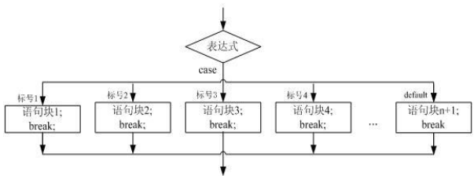
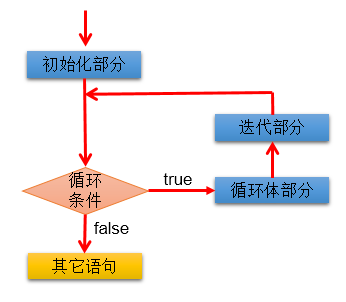
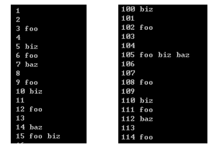

# day04授课目录

讲师：宋红康

***

## 一、每天学习流程

- 白天：尽量别犯困、少走神。
  - 遇到不清楚的问题，先截图！
  - 注意老师讲课提到的关键的词：这是重点，这个了解下就可以了，这是面试的常考点
  - 为了让自己不困：老师一边写代码，自己也同时敲代码

- 晚上

  - 6:00 - 6:30 建议整理当天的学习内容
    - 使用ediary软件，有复习笔记

  - 6:30以后，先将白天老师讲的重点代码敲熟。
    - 针对于重点的代码，一定要保证自己能独立的写出来! (1遍，2遍，3遍，。。。。)
    - 如果学有余力，开始做作业题。
  - 注意：每天要不要看视频？
    - 如果大家白天听课能听懂70%以上内容：基本不用再听视频，或者只针对不清楚的一小部分听一下。
    - 如果大家白天听课只能听懂50%左右，可能要花晚自习一半左右的时间，看看视频。
    - 听课内容不足30%能听懂，需要找老师！

## 二、if-else结构

### 例题

编写程序：由键盘输入三个整数分别存入变量num1、num2、num3，对它们进行排序(使用
if-else if-else),并且从小到大输出。

```java
import java.util.Scanner;

class NumberSortTest {
	public static void main(String[] args) {
		//2.
		Scanner scan = new Scanner(System.in);
		
		//3.
		System.out.println("请输入第一个整数：");
		int num1 = scan.nextInt();


		System.out.println("请输入第二个整数：");
		int num2 = scan.nextInt();

		System.out.println("请输入第三个整数：");
		int num3 = scan.nextInt();

		//System.out.println(num1 + ":" + num2 + ":" + num3);

		if(num1 >= num2){
			
			if(num3 <= num2){
				System.out.println(num3 + ":" + num2 + ":" + num1);
			}else if(num3 >= num1){
				System.out.println(num2 + ":" + num1 + ":" + num3);
			}else{
				System.out.println(num2 + ":" + num3 + ":" + num1);
			}
		
		}else{
			if(num3 >= num2)
				System.out.println(num1 + ":" + num2 + ":" + num3);
			else if(num3 <= num1){
				System.out.println(num3 + ":" + num1 + ":" + num2);
			}else
				System.out.println(num1 + ":" + num3 + ":" + num2);
		}
	}
}
```


> 说明：
>
> 1. if-else结构是可以嵌套使用的！（从开发经验来说，if-else的嵌套不会超过3层）
> 2. 如果if-else的结构的执行语句只有一行，则可以省略这一对{}。但是大家开发时，不建议省略！

### 练习

1)编写程序，声明2个int型变量并赋值。判断两数之和，如果大于等于50，打印“hello world!”

2)编写程序，声明2个double型变量并赋值。判断第一个数大于10.0，且第2个数小于20.0，打印两数之和。否则，打印两数的乘积。

```java
class HomeWork {
	public static void main(String[] args) {
		//第1题：
		int i = 15;
		int j = 8;
		int k = 18;
		// 法一
		int maxTemp = (i > j) ? i : j;
		int max1 = (maxTemp > k) ? maxTemp : k;
		
		// 法二
		int max3;
		if (i > j) {
			if (i > k) {
				max3 = i;
			} else {
				max3 = k;
			}
		} else if (j > k) {
			max3 = j;

		} else {
			max3 = k;
		}
		System.out.println(max3);

		//法三
		if (i1 > i2){
			if (i1 >i3){
				max = i1;
			}else{
				max = i3;
			}
		}
		else{
			if (i2>i3){
				max = i2;
			}
			else max = i3;
		}
		
		//第2题：  屡试不爽
		//方式一
		double d1 = 12.1, d2 = 15.5;
        if (d1 > 10.0 && d2 < 20.0) {
            System.out.println(d1+d2);
        }else
            System.out.println(d1*d2);
		}

		//方式二：
		double result = (d1 > 10.0 && d2 < 20.0)? (d1 + d2) : (d1 * d2);
		System.out.println(result);
	}
}
```

### 练习

我家的狗5岁了，5岁的狗相当于人类多大呢？其实，狗的前两年每一年相当于人类的10.5岁，之后每增加一年就增加四岁。那么5岁的狗相当于人类多少年龄呢？应该是：10.5 + 10.5 + 4 + 4 + 4 = 33岁。

编写一个程序，获取用户输入的狗的年龄，通过程序显示其相当于人类的年龄。如果用户输入负数，请显示一个提示信息。

### 小知识点

如何获取随机数

```java
class RandomNumberTest {
	public static void main(String[] args) {
		//1.random()返回[0.0,1.0)范围的一个double型的随机数
		double v1 = Math.random();
		System.out.println(v1);

		//2.如何获取一个两位数，即[10,99]     [0.0,1.0) --> [0.0,90) --> [0,89]  --> [10,99]
		int v2 = (int)(Math.random() * 90 ) + 10;
		System.out.println(v2);

		//3.推广：如何获取指定范围的一个随机整数： 即[a ,b]
		// (int)(Math.random() * (b - a + 1)) + a

	}
}

```

### 练习

大家都知道，男大当婚，女大当嫁。那么女方家长要嫁女儿，当然要提出一定的条件：
高：180cm以上；富：财富1千万以上；帅：是。

如果这三个条件同时满足，则：“我一定要嫁给他!!!”
如果三个条件有为真的情况，则：“嫁吧，比上不足，比下有余。”
如果三个条件都不满足，则：“不嫁！”

```java
import java.util.Scanner;
class  MarryTest{
	public static void main(String[] args) {
		Scanner scan = new Scanner(System.in);
		
		/*
		方式一：
		System.out.println("身高:   (cm)");
		int height = scan.nextInt();

		System.out.println("财富:   (千万)");
		double rich = scan.nextDouble();

		System.out.println("帅否:   (true/false)");
		boolean isHandsome = scan.nextBoolean();

		if (height >= 180 && rich  >= 1 && isHandsome){
			System.out.println("我一定要嫁给他!!!");
		}else if (height >= 180 || rich  >= 1 || isHandsome){
			System.out.println("嫁吧，比上不足，比下有余。");
		}else{
			System.out.println("不嫁！");
		}

		*/
		//方式二：
		System.out.println("身高:   (cm)");
		int height = scan.nextInt();

		System.out.println("财富:   (千万)");
		double rich = scan.nextDouble();

		System.out.println("帅否:  (是/否)");
		String isHandsome = scan.next();

		if (height >= 180 && rich  >= 1 && "是".equals(isHandsome)){
			System.out.println("我一定要嫁给他!!!");
		}else if (height >= 180 || rich  >= 1 || "是".equals(isHandsome)){
			System.out.println("嫁吧，比上不足，比下有余。");
		}else{
			System.out.println("不嫁！");
		}

	}
}
```


## 三、switch-case结构

### 1. 图示



### 2. 结构

```
switch(表达式){
case 值1:
	//执行语句;
	//break;

case 值2:
	//执行语句;
	//break;

...

default:
	//执行语句;
	//break;

}
```

```java
class SwitchCaseTest {
	public static void main(String[] args) {
		
		char c = 'f';

		switch(c){
		
		case 'a':
			System.out.println("a");
			break;
		case 'b':
			System.out.println("b");
			break;
		case 'c':
			System.out.println("c");
			break;
		case 'd':
			System.out.println("d");
			break;
		default:
			System.out.println("other");
		}

		//**********************
		String season = "summer";
		switch (season) {
		case "spring":
			System.out.println("春暖花开");
			break;
		case "summer":
			System.out.println("夏日炎炎");
			break;
		case "autumn":
			System.out.println("秋高气爽");
			break;
		case "winter":
			System.out.println("冬雪皑皑");
			break;
		default:
			System.out.println("季节输入有误");
			break;
		}

		//********编译不通过**************
		/*
		boolean isHandsome = true;
		switch(isHandsome){
		case true:
			System.out.println("我很帅");
			break;
		case false:
			System.out.println("我很丑，但是很温柔");
			break;
		default:
			System.out.println("情人眼里出西施");
			break;
		}
		*/

		//编译不通过
		/*
		int score = 89;
		switch(score){
		case 100:
			System.out.println("送BMW");
			break;
		case score >= 80 && score <= 99:
			System.out.println("送iphone");
			break;
		default:
			System.out.println("什么也不送");
			break;
		}
		*/
	}
}
```

说明：

```
1. 在switch-case的case结构中，可以使用关键字break。一旦执行break，则跳出当前的switch-case结构
2. 根据switch中表达式的值，依次匹配case中的值。一旦满足某个case的值，则进入其执行语句执行。执行完以后，有可能继续执行其后的其他case结构与default结构。直到遇到break关键字或程序最后终止。

3. switch后的表达式，其结果为一个变量。此变量只能是如下类型：
   byte\short\char\int\枚举类(jdk5.0)\字符串(jdk7.0)

4.  case后的值，即为switch中表达式可能取的值。分多个case依次判断匹配。通常情况下，case的情况都不会很多。

5. default类似于if-else中else结构。
   default的位置是灵活的。
   default是可选的。类似的，if-else中的else结构也是可选的。
```

### 练习

练习1：使用switch 把小写类型的char型转为大写。只转换a, b, c,d, e. 其它的输出“other”。

练习2：根据用于指定月份，打印该月份所属的季节。  

3,4,5 春季 6,7,8 夏季  9,10,11 秋季 12, 1, 2 冬季

### 例题

例题1：对学生成绩大于60分的，输出“合格”。低于60分的，输出“不合格”。

```java
class  SwitchCaseTest1{
	public static void main(String[] args) {
		
		int score = 89;
		/*
		可以如下使用if-else实现：
		if(score >= 60){
			System.out.println("合格");
		}else{
			System.out.println("不合格");
		}
		*/
		
		/*
		不推荐
		switch(score){
		case 0:
			//...
			break;
		case 1:
			//...
			break;
		//....
		case 100:

		
		}
		*/
		

		
		switch(score / 10){ 
			case 0:
			case 1:
			case 2:
			case 3:
			case 4:
			case 5:
				System.out.println("不合格");
				break;
			case 6:
			case 7:
			case 8:
			case 9:
			case 10:
				System.out.println("合格");
				break;
		
		}


		//更优
		switch(score / 60){
		case 1:
			System.out.println("合格");
			break;
		case 0:
			System.out.println("不合格");
			break;
		}


	}
}
```

说明：

  1.多个case的执行语句如果相同，可以合并。

2. 关于if-else 与switch-case之间相互转换的问题
   ① switch-case结构都可以转换为if-else结构来实现
      反之，不成立。
   ② 在既能使用if-else，又可以使用switch-case结构，且变量的取值不多的情况下，建议使用switch-case,因为
      效率相较于if-else，稍高！

例题2：

编写程序：从键盘上输入2020年的“month”和“day”，要求通过程序输出输入的日期为2020年的第几天。

```java
import java.util.Scanner;
class SwitchCaseTest2 {
	public static void main(String[] args) {
		
		Scanner scan = new Scanner(System.in);

		System.out.println("请输入month:");
		int month = scan.nextInt();


		System.out.println("请输入day:");
		int day = scan.nextInt();
		
		
		int sumDays = 0;//记录总天数
		
		/*
		方式一：较为复杂
		switch(month){
		
		case 1:
			sumDays = day;
			break;
		case 2:
			sumDays = 31 + day;
			break;
		case 3:
			sumDays = 31 + 29 + day;
			break;
		//....
		
		case 12:
			sumDays = 31 + 29 + 31 + 30 + ... + 30 + day;
			break;
		}
		*/

		switch(month){
		case 12:
			sumDays += 30;
		case 11:
			sumDays += 31;
		case 10:
			sumDays += 30;
		case 9:
			sumDays += 31;
		case 8:
			sumDays += 31;
		case 7:
			sumDays += 30;
		case 6:
			sumDays += 31;
		case 5:
			sumDays += 30;
		case 4:
			sumDays += 31;
		case 3:
			sumDays += 29;
		case 2:
			sumDays += 31;
		case 1:
			sumDays += day;

		}

		System.out.println(month + "月" + day + "日是2020年的第" + sumDays + "天");

	}
}
```

> 说明：
>    在switch-case中不一定要使用break。


### 练习

练习1：从键盘分别输入年、月、日，判断这一天是当年的第几天

   注：判断一年是否是闰年的标准：

​       1）可以被4整除，但不可被100整除

  或

​       2）可以被400整除

```java
提示：
if(（year % 4 == 0 && year % 100 != 0) || year % 400 == 0)
    sumDays += 29;
else
    sumDays += 28;

```

练习2：

编写一个程序，为一个给定的年份找出其对应的中国生肖。中国的生肖基于12年一个周期，每年用一个动物代表：rat、ox、tiger、rabbit、dragon、snake、horse、sheep、monkey、rooster、dog、pig。

## 四、循环结构概述

### 循环结构的4要素：

- 初始化条件
- 循环条件    -->一定是boolean类型
- 循环体
- 迭代条件



### 三种循环结构

- for循环
- while循环
- do-while循环

## 五、for循环

### 1. 基本结构

```
for(①;②;④){
	③
}

执行过程：① - ② - ③ - ④ - ② - ③ - ④ - ② - ... - ②

说明：当循环条件返回为false时，循环结束
```

```java
class ForTest {
	public static void main(String[] args) {
		/*
		System.out.println("Hello World!");
		System.out.println("Hello World!");
		System.out.println("Hello World!");
		System.out.println("Hello World!");
		System.out.println("Hello World!");
		*/
		
		for(int i = 1;i <= 5;i++){
			System.out.println("Hello World!");
		}
		
		//练习
		int i = 1;
		for(System.out.print('a');i <= 3;System.out.print('c'),i++){
			System.out.print('b');
			
		}
		//abcbcbc
		System.out.println();//换行
		//例题
		//遍历100以内的偶数，计算所有偶数的和,统计偶数的个数
		int sum = 0;//记录总和
		int count = 0;//记录偶数的个数

		for(int j = 1;j <= 100;j++){
			if(j % 2 == 0){
				System.out.println(j);
				sum += j;
				count++;
				
			}
		}

		System.out.println("偶数的总和为：" + sum);
		System.out.println("偶数的个数为：" + count);

	}
}
```

### 2.练习

练习1：编写程序从1循环到150，并在每行打印一个值，另外在每个3的倍数行上打印出“foo”,在每个5的倍数行上打印“biz”,在每个7的倍数行上打印输出“baz”。



```java
for(int i = 1;i <= 150;i++){
    
    System.out.print(i + "\t");
    if(i % 3 == 0){
        System.out.print("foo\t");
    }
    
    if(i % 5 == 0){
        System.out.print("biz\t");
    }
    if(i % 7 == 0){
        System.out.print("baz\t");
    }
    System.out.println();
    
}
```


```
练习2：打印1~100之间所有奇数的和

练习3：打印1~100之间所有是7的倍数的整数的个数及总和（体会设置计数器的思想）

练习4：输出所有的水仙花数，所谓水仙花数是指一个3位数，其各个位上数字立方和等于其本身。

 例如： 153 = 1*1*1 + 3*3*3 + 5*5*5
```

```java
for(int i = 100;i <= 999;i++){
    int bai = i / 100;
    int shi = i % 100 / 10;
    int ge = i % 10;
    if(i == bai* bai * bai + shi*shi*shi + ge*ge*ge){
        System.out.println(i);
    }
}
```


### 3.例题

题目：输入两个正整数m和n，求其最大公约数和最小公倍数。

比如：12和20的最大公约数是4，最小公倍数是60。

```java
class ForTest1 {
	public static void main(String[] args) {
		
		int num1 = 12;
		int num2 = 20;
		
		//获取两个数中的较小值
		int minNum = (num1 > num2)? num2 : num1;
		//求最大公约数
		for(int i = minNum;i >= 1;i--){
			if(num1 % i == 0 && num2 % i == 0){
				System.out.println(i);
				break;//一旦执行，就终止当前循环结构
			}
		}
		
		//获取两个数中的较大值
		int maxNum = (num1 > num2)? num1 : num2;

		//求最小公倍数
		for(int i = maxNum;i <= num1 * num2;i++){
			if(i % num1 == 0 && i % num2 == 0){
				System.out.println(i);
				break;
			}
		}
		
		
	}
}
```

```
break关键字的使用
1. 除了在switch-case中使用break之外，还可以在循环中使用break。
2. 一旦执行break,则跳出当前循环结构。
```

## 六、while循环

### 1. 结构

```
①
while(②){
	③
	④
}

执行过程：① - ② - ③ - ④ - ② - ③ - ④ - ② - ... - ②
```

### 2. 说明

```
1. for循环 和 while循环是可以相互转换的。
2. 区别：while循环来讲，出了循环结构之后，初始化条件仍然可用。
         for循环来讲，初始化条件仅在for循环内部有效。

3. 写程序时，要避免出现死循环！！
4. 总结：结束循环的方式：
	第一种：循环条件返回false。
	第二种：在循环体中执行break。
```

```java
class WhileTest {
	public static void main(String[] args) {
		
		//遍历100以内的偶数,计算所有偶数的和，并计算偶数的个数
		int i = 1;//初始化值
		int sum = 0;//记录偶数的和
		int count = 0;//记录偶数的个数
		while(i <= 100){
			if(i % 2 == 0){
				System.out.println(i);
				sum += i;//累积
				count++;
			}
			i++;
		}
		System.out.println("总和为：" + sum);
		System.out.println("个数为：" + count);

		System.out.println(i);//101
	}
}
```

## 七、do-while循环

### 1. 结构

```
①
do{
	③
	④
}while(②);

执行过程：① - ③ - ④ - ② - ③ - ④ - ... - ②
```

### 2. 说明

```
1. do-while一定会执行一次循环体。
2. 从使用频率上讲,do-while用的较少。
```

```java
class DoWhileTest {
	public static void main(String[] args){
		
		//遍历100以内的偶数,计算所有偶数的和，并计算偶数的个数
		
		int i = 1;
		int sum = 0;//记录总和
		int count = 0;//记录个数
		do{
			if(i % 2 == 0){
				System.out.println(i);
				sum += i;
				count++;
			}
			i++;

		}while(i <= 100);

		System.out.println("总和为：" + sum);
		System.out.println("个数为：" + count);


		//*********do-while至少会执行一次循环体**********
		int init1 = 100;
		while(init1 < 10){
			System.out.println("hello1");
			init1++;
		}

		//
		int init2 = 100;
		do{
			System.out.println("hello2");
			init2++;
		}while(init2 < 10);


	}
}
```

### 3. 例题

体会 for(;;) 或 while(true)结构的使用

```
import java.util.Scanner;
class  ForWhileTest{
	public static void main(String[] args) {
		
		Scanner scan = new Scanner(System.in);
		
		int positiveNumberCount = 0;//记录正数的个数
		int negativeNumberCount = 0;//记录负数的个数
	
		while(true){//for(;;){
			System.out.println("请输入一个整数：");
			int number = scan.nextInt();
			
			if(number == 0){
				break;
			}else if(number > 0){
				positiveNumberCount++;
			}else{
				negativeNumberCount++;
			}

		}
		System.out.println("输入的正数的个数为：" + positiveNumberCount);
		System.out.println("输入的负数的个数为：" + negativeNumberCount);
	}
}
```

## 八、嵌套循环

### 1.说明

```
嵌套循环的使用

1. 概念：当一个循环结构充当了另外一个循环结构循环体时，即构成了嵌套循环。

2. 理解：以两层for循环为例说明：当内存循环执行完，仅仅相当于外层循环的一次循环执行结束。

3. 技巧：外层循环控制行数，内存循环控制列数

4. 理解：如果外层循环执行m次，内层循环执行n次，则内层循环的循环体可以执行：m * n次
```

```java
class ForForTest {
	public static void main(String[] args) {
		
		
		//*****
		//for(int i = 1;i <= 5;i++){
		//	System.out.print("*");
		//}	

		/*
		
		*****
		*****
		*****
		*****

		*/
		

		for(int j = 1;j <= 4;j++){
			
			for(int i = 1;i <= 5;i++){
				System.out.print("*");
			}

			System.out.println();
		
		}

		/*
		思考题：

		*
		**
		***
		****

		*/


	}
}
```

