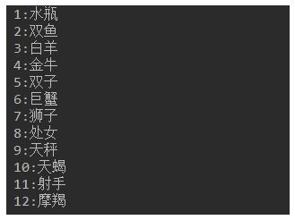
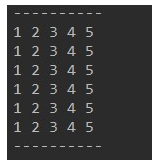
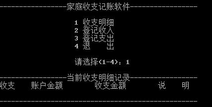
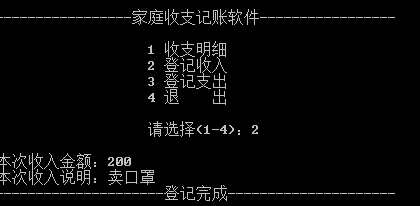
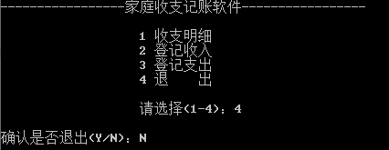

# day05授课笔记

讲师：宋红康

***

## 一、学习的流程、套路、方式

- 白天听课：想尽一切办法让自己精神！投入听课当中！

  - 站着听、截图、同步敲、风油精、咖啡、红牛（不能老喝）

- 晚上时间：主体的时间，应该是练习、敲

  - 6:00 - 6:30 ：总结当天的知识
  - 6:30 - 10:00 主体用来敲练习、白天的例题，保证自己是**熟练的**！
  - 还学有余力的，大家做作业！甚至说，额外的再做一些练习！

  

- 什么是重点的知识？
  - 老师说过，是重点的知识，那就是重点！
  - 此时的内容、知识，在未来看，经常被使用到，经常被用到！

## 二、昨天的作业

### 1. 简答题

```
1. switch后面使用的表达式可以是哪些数据类型的。
	byte、short、char、int、枚举类（jdk5.0）、String(jdk7.0)
2. 谈谈你对三元运算符、if-else和switch-case结构使用场景的理解
	① 三元运算符、switch-case都可以转换为if-else。反之，不成立
	② 凡是可以使用三元运算符、switch-case的场景，建议使用三元运算符、switch-case，而不使用if-else.因为效率稍高。
	③ 三元运算符，需要有运算的结果。
      switch-case:满足switch表达式的类型，同时取值不多。

3. 循环结构是如何最后退出循环的，有哪些不同的情况请说明。
第一种：循环条件返回false。
第二种：在循环体中执行break。

```

### 2. 编程题

练习1：

```
使用switch语句改写下列if语句：
 	 int a = 3;
 	 int x = 100;
 	 if(a==1)
		x+=5;
 	 else if(a==2)
		x+=10;
 	 else if(a==3)
		x+=16;
 	 else		
		x+=34;

```

答案：

```java
class IfToSwitch {
	public static void main(String[] args) {
		int a = 3;
        int x = 100;
        switch (a){
		case 1:
           x += 5;
           break;
            
        case 2:
           x += 10;
           break;
            
        case 3 :
           x += 16;
           break;
            
        default:
            x+=34;
            //break;
        }
        System.out.println(x);
	}
}
```

练习2：

语法点：运算符，for，switch

打印星座信息，效果如图所示：



```java
class HomeWork02 {
	public static void main(String[] args) {
		int month = 1;
		for (month = 1; month < 13; month++ ){ //遍历
			System.out.print(month + ":");
			switch (month){
			case 1:
				System.out.println("水瓶");
				break;
			case 2 :
				System.out.println("双鱼");
				break;
			case 3:
				System.out.println("白羊");
				break;
			case 4:
				System.out.println("金牛");
				break;
			case 5:
				System.out.println("双子");
				break;
			case 6:
				System.out.println("巨蟹");
				break;
			case 7:
				System.out.println("狮子");
				break;
			case 8:
				System.out.println("处女");
				break;
			case 9:
				System.out.println("天秤");
				break;
			case 10:
				System.out.println("天蝎");
				break;
			case 11:
				System.out.println("射手");
				break;
			case 12:
				System.out.println("摩羯");
				break;
			}
		}
	}
}
```

练习3：

按步骤编写代码，效果如图所示：



```java
class HomeWork03 {
	public static void main(String[] args) {
		/*
		方式一：
		for(int i=1;i<9;i++) {
			switch(i) {
			case(1):
				System.out.println("----------");
				break;
			case(2): 
			case(3): 
			case(4): 
			case(5):
			case(6):
			case(7):
				System.out.println("1 2 3 4 5");
				break;
			case(8):
				System.out.println("----------");
			}
		}
		*/
		System.out.println("----------");
		 for(int i=1;i<=6;i++){
			 for(int j=1;j<=5;j++){
				System.out.print(j + " ");
			}
			System.out.println();
		}
		System.out.println("----------");
	}
}
```


思考题：

已知2020年1月1日是星期三，从键盘输入2020年的任意一天，请判断它是星期几？

```java
import java.util.Scanner;
class HomeWork04 {
	public static void main(String[] args) {
		/*
		写法一：
		Scanner scan = new Scanner(System.in);

		System.out.println("请输入2020年的月份：");
		int month = scan.nextInt();

		System.out.println("请输入这个月的第几天：");
		int day = scan.nextInt();

		int sum = 0;//记录某月某日是当前的第几天

		switch(month) {
		case 12:sum += 30;
		case 11:sum += 31;
		case 10:sum += 30;
		case 9:sum += 31;
		case 8:sum += 31;
		case 7:sum += 30;
		case 6:sum += 31;
		case 5:sum += 30;
		case 4:sum += 31;
		case 3:sum += 29;
		case 2:sum += 31;
		case 1:sum += day;
		}
		int week = (sum + 2) % 7;
		if(week != 0){
			System.out.println("这一天是周" + week);
		}else{
			System.out.println("这一天是周日");
		}
		*/

		Scanner scan = new Scanner(System.in);
		System.out.println("请输入月 ");
		int month = scan. nextInt();
		System.out.println("请输入日 ");
		int day = scan. nextInt();

		int sumDay = 0;//记录某月某日是当前的第几天

		switch(month){
		case 12:
			sumDay += 30;
		case 11:
			sumDay += 31;
		case 10:
			sumDay += 30;
		case 9:
			sumDay += 31;
		case 8:
			sumDay += 31;
		case 7:
			sumDay += 30;
		case 6:
			sumDay += 31;
		case 5:
			sumDay += 30;
		case 4:
			sumDay += 31;
		case 3:
			sumDay += 29;
		case 2:
			sumDay += 31;
		case 1:
			sumDay += day;
		}
		int num = sumDay % 7;
		switch (num) {
		case 0:
			System.out.println("星期二");
			break;
		case 1:
			System.out.println("星期三");
			break;
		case 2:
			System.out.println("星期四");
			break;
		case 3:
			System.out.println("星期五");
			break;
		case 4:
			System.out.println("星期六");
			break;
		case 5:
			System.out.println("星期天");
			break;
		case 6:
			System.out.println("星期一");
			break;
		}
		System.out.println();
	}
}
```

## 三、复习

- if-else结构
  - 也可以嵌套使用。通常不会超过三层。
  - 最通用的分支结构。
- switch-case结构
  - 使用有局限性：① switch后的表达式类型的限制：byte\short\char\int\枚举类\String ②取值不宜过多
  - 在可以使用的情境中，相较于if-else效率稍高。
  - 内部可以使用break
- for循环
  - 开发中，对于遍历某个范围内的自然数、数组的索引等，经常使用for
  - for中定义的变量，仅适用for循环内部。
  - 在for中可以使用break。
- while循环
  - for和while循环可以相互转换的！
  - 使用场景：在调用方法作为循环条件时，来使用
  - 在while中可以使用break
- do-while循环
  - 开发中使用较少
- 嵌套循环
  - 有难度的！
  - 开发中，一般嵌套不会超过三层

## 四、嵌套循环

### 1. 理解

```
1. 概念：当一个循环结构充当了另外一个循环结构循环体时，即构成了嵌套循环。

2. 理解：以两层for循环为例说明：当内存循环执行完，仅仅相当于外层循环的一次循环执行结束。

3. 技巧：外层循环控制行数，内存循环控制列数

4. 理解：如果外层循环执行m次，内层循环执行n次，则内层循环的循环体可以执行：m * n次
```


### 2.例题

```java
		/*
		
		*****
		*****
		*****
		*****

		*/
		

		for(int j = 1;j <= 4;j++){//外层循环
			
			for(int i = 1;i <= 5;i++){//内层循环
				System.out.print("*");
			}

			System.out.println();
		
		}
		System.out.println("================");
```

```java
		/*
					i（行数）	j（列数）
		*			1			1	
		**			2			2
		***			3			3
		****		4			4
		*****		5			5
		******		6			6

		*/
		
		for(int i = 1;i <= 6;i++){
			
			for(int j = 1;j <= i;j++){
				System.out.print("*");
			}

			System.out.println();
		
		}
```

```java
		/*
					i（行数）	j（列数）   公式：i + j = 6   --> j = 6 - i
		*****		1			5	
		****		2			4
		***			3			3
		**			4			2
		*			5			1

		*/

		for(int i = 1;i <= 5;i++){
			
			for(int j = 1;j <= 6 - i ;j++){
				System.out.print("*");
			}
			System.out.println();
		}
```

思考：

```java
		/*

		*				
		**			
		***			
		****		
		*****		
		******
		*****
		****
		***
		**
		*

		*/
```

```java
/*					i(行号)		j(-的个数)		k(*的个数)		i + j = 5  k = i
    *				1			4				1
   * *				2			3				2
  * * *				3			2				3
 * * * *			4			1				4
* * * * *			5			0				5

				思考如何实现：下半部分
-* * * * 
--* * * 
---* * 
----* 


*/
		//上半部分
		for(int i = 1;i <= 5;i++){
			// -
			for(int j = 1;j <=5 - i;j++){
				System.out.print(" ");
			}

			// *
			for(int k = 1;k <= i;k++){
				System.out.print("* ");
			}


			System.out.println();
		}

		//思考:下半部分
		for (int i = 0; i < 4; i++) {
			for (int j = 0; j < i + 1; j++) {
				System.out.print(" ");
			}
			for (int k = 0; k < 4 - i; k++) {
				System.out.print("* ");
			}
			System.out.println();
		}

		//思考，合并一起。
		/*for(int i = 1;i <= 9;i+){
			if(i <= 5){
				//上半部分

			}else{
				//下半部分

			}

			
		
		}
		*/
```

### 3.例题

例题1：

```
使用for循环实现九九乘法表

1 * 1 = 1
2 * 1 = 2  2 * 2 = 4
...
9 * 1 = 9   ...  9 * 9 = 81
```

```java
class NineNineTable {
	public static void main(String[] args) {
				
		for(int i = 1;i <= 9;i++){
			for(int j = 1;j <= i;j++){
				
				System.out.print(i + "*" + j + "=" + (i * j) + "  ");
			
			}
			
			System.out.println();
		}
		
	}
}

```

例题2：

```
输出100000以内的所有的质数。

1. 质数（素数）：只能被1和它本身整除的自然数
		换句话说，除了1和它本身之外，没有任何的约数

2. 通过这个题目，体会不同的实现方式的，执行效率的问题。

```

```
学习java = 语法规则 + 逻辑、算法

程序 = 算法 + 数据结构
```

- 方法一：

```java
class PrimeNumberTest {
	public static void main(String[] args) {
		
		long start = System.currentTimeMillis();//获取当前时间的毫秒数
		int count = 0;//记录质数的个数

		for(int i = 2;i <= 100000;i++){

			boolean isFlag = true;//标识是否没有被除尽过。
			
			for(int j = 2;j < i;j++){//遍历从2开始，到i - 1 范围的自然数
				
				if(i % j == 0){//判断自然数i是否被j整除
					isFlag = false;
				}
			 
			}

			if(isFlag){
				//System.out.println(i);//质数
				count++;
			}

			//重置isFlag
			//isFlag = true;
			
		}

		long end = System.currentTimeMillis();//获取当前时间的毫秒数
		System.out.println("质数的个数为：" + count);//9592
		System.out.println("花费的时间为：" + (end - start));//21270 - 22506

	}
}
```

- 针对于方法一的优化

```java
/*

更优的100以内质数的输出

*/
class PrimeNumberTest1 {
	public static void main(String[] args) {
		
		long start = System.currentTimeMillis();//获取当前时间的毫秒数
		int count = 0;//记录质数的个数


		for(int i = 2;i <= 100000;i++){

			boolean isFlag = true;//标识是否没有被除尽过。
			
			//优化2：j的范围不用到 i - 1，而是到Math.sqrt()即可。 优化2在优化1添加的前提下，仅对质数有效
			for(int j = 2;j <= Math.sqrt(i);j++){
				
				if(i % j == 0){//判断自然数i是否被j整除
					isFlag = false;
					break;//终止包裹此break关键字的最近的一层循环！ 优化1：仅对非质数的自然会有效。
				}
			}

			if(isFlag){
				//System.out.println(i);//质数
				count++;
			}
			
		}

		long end = System.currentTimeMillis();//获取当前时间的毫秒数
		System.out.println("质数的个数为：" + count);//9592
		System.out.println("花费的时间为：" + (end - start));//21270 - 22506  ---优化后：736 --> 17

	}
}
```

- 方法二：

```java
public static void main(String[] args){
		
		//从1到100
		for(int i = 1;i <= 100;i++){
			int num = 0;
			//i依次对1到i取模，为零时输出
			for(int j = i;j > 0;j--){
				  if(i % j == 0){
					num++;
				  }
			}
			if(num == 2){
				System.out.println(i);
			}
		}
}
```

- 方法三：

```java
/*

质数的输出
方式二：使用continue + 标签的方式。
*/
class PrimeNumberTest2 {
	public static void main(String[] args) {
		
		l:for(int i = 2;i <= 100;i++){

			for(int j = 2;j <= Math.sqrt(i);j++){
				
				if(i % j == 0){
					continue l;
				}
			}
	
			System.out.println(i);//质数
	
		}

	}
}
```

## 五、break和continue

```
break 和continue的使用

			使用范围			在循环中使用的作用					相同点

break:		①switch-case中		
			②循环结构中		结束(或跳出)当前循环结构			在关键字后不能声明执行语句


continue:	①循环结构中		结束(或跳出)当次循环				在关键字后不能声明执行语句


说明：
1. 从经验上来说，开发中break使用的频率要远高于continue。
2. 关于带标签的break或continue的使用（了解）

```

```java
class BreakContinueTest {
	public static void main(String[] args) {
			
		for(int i = 1;i <= 10;i++){
			
			if(i % 4 == 0){
				break;
				//continue;
				//System.out.print("今晚迪丽热巴要约我！！");
			}

			System.out.print(i);
		
		}
		System.out.println("************");//换行
		//************************************
		label:for(int i = 1;i <= 4;i++){
			
			for(int j = 1;j <= 10;j++){
				
				if(j % 4 == 0){
					//break; //默认结束的是包裹其最近的一层循环！
					//continue;//默认结束的是包裹其最近的一层循环的当次！

					//break label;//结束指定标签代表的循环结构
					continue label;//结束指定标签代表的循环结构的当次循环
				}

				System.out.print(j);
			
			}
			System.out.println();//换行
		}

	}
}
```

## 六、项目一：家庭收支记账软件

### 1. 项目演示








### 2. Utility工具类的说明

Utility工具类提供了一系列的方法，方便我们从控制台获取相关数据：

- 用户的选择（1-4）：readMenuSelection()
- 获取收入或支出的金额：readNumber()
- 获取收入或支出的说明：readString()
- 获取Y或N的选项：readConfirmSelection()

### 3. FamilyAccount类的编写

#### 环节一：出现界面

```java
boolean isLoop = true;
		
		while(isLoop){

			System.out.println("-----------家庭收支记账软件---------------\n");
			System.out.println("             1 收支明细");
			System.out.println("             2 登记收入");
			System.out.println("             3 登记支出");
			System.out.println("             4 退    出\n");
			System.out.print("            请选择(1-4):");

			//获取用户的选择

			//当用户选择4且是Y时，内部执行：isLoop = false;

		}
```

#### 环节二：获取用户的选择行为

```java
boolean isLoop = true;
		
		while(isLoop){

			System.out.println("-----------家庭收支记账软件---------------\n");
			System.out.println("             1 收支明细");
			System.out.println("             2 登记收入");
			System.out.println("             3 登记支出");
			System.out.println("             4 退    出\n");
			System.out.print("            请选择(1-4):");

			//获取用户的选择
			char menu = Utility.readMenuSelection();
			//根据用户的选择，执行相应的操作：if-else、switch-case
			switch(menu){
			case '1':
				System.out.println("1. 收支明细");
				break;
			case '2':
				System.out.println("2. 登记收入");
				break;
			case '3':
				System.out.println("3. 登记支出");
				break;
			case '4':
				System.out.println("4. 退出");
				//当用户选择4且是Y时，内部执行：isLoop = false;
				break;
			
			}

	}
```

#### 环节三：退出功能

```java
case '4':
		//System.out.println("4. 退出");
		System.out.print("确认是否退出(Y/N):");
		char isExit = Utility.readConfirmSelection();
		if(isExit == 'Y'){
			//当用户选择4且是Y时，内部执行：isLoop = false;
			isLoop = false;
		}
		break;
```

#### 环节四：显示收支数据

```java
String details = "";//记录收入、支出的情况
int balance = 10000;//初始金额

while(isLoop){
	//....
	case '1':
		//System.out.println("1. 收支明细");
		System.out.println("-----------当前收支明细记录---------------");
		System.out.println("收支\t账户金额\t收支金额\t说明");
				
		System.out.println(details);

		System.out.println("------------------------------------------");
		break;
}
```

#### 环节五：登记收入

```java
case '2':
	//System.out.println("2. 登记收入");
	System.out.print("本次收入金额:");
	int money = Utility.readNumber();
	System.out.print("本次收入说明:");
	String addMoney = Utility.readString();
	System.out.println("-----------------登记完成----------------------");
			
	balance += money;

	details += "收入\t" + balance + "\t\t" + money + "\t\t" + addMoney + "\n";

	break;
```


#### 环节六：登记支出

```java
case '3':
	//System.out.println("3. 登记支出");
	System.out.print("本次支出金额:");
	int money1 = Utility.readNumber();
	System.out.print("本次支出说明:");
	String minusMoney = Utility.readString();
				

	if(balance >= money1){
		balance -= money1;
		details += "支出\t" + balance + "\t\t" + money1 + "\t\t" + minusMoney + "\n";

		System.out.println("-----------------登记完成----------------------");
	}else{
		System.out.println("支出金额超出账户余额，支出失败！");
	}	
	break;
```

## 七、Eclipse的安装与使用

### 1. 安装

解压即可使用

### 2.使用说明

见《Eclipse的使用配置v1.1.doc》