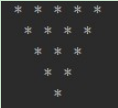

# day06授课笔记

## 一、目前大家的状态

1. 题目很难，但是知识点还好，需要多敲代码，一直敲。先要不断的模仿

2. 对于今天的题目不知所措，接下来要针对算法及语法规则好好练习

3. 分析题打代码还蛮爽的，就是累

4. 今天学习了新的知识，却发现前面学习的又忘了些

5. 学的知识多了容易混淆，做题时不看例题的话还是有点难下手，需要多练习。

6. 感觉自己看的时候会，但是敲的时候就很多bug了，而且思路刚开始还比较清晰，越到后面
     越乱，这是敲的少了？不过简单的倒是都会，就是难的就不会自己敲了。

7. 感觉时间不太够用，有点忙不过来了，有点乱了

## 二、作业

1. 一个数如果恰好等于它的因子之和，这个数就称为"完数"。例如6=1＋2＋3。编程 找出1000以内的所有完数。（因子：除去这个数本身的其它约数）

```java
public class PrintNumber {
	public static void main(String[] args) {
		//方式一：
		for (int i = 1; i <= 1000; i++) {
			int num = 0;
			for (int j = 1; j < i; j++) {
				if (i % j == 0) {
					num += j;
				}
			}
			if (i == num) {
				System.out.println(i);
			}
		}
		//方式二：
//		for (int i=2;i<=10000 ;i++ ) {
//			int sum=1;
//			for (int j=2;j<=i/3 ;j++ ) {
//				if (i%j==0){
//					int k=i/j;
//					if (k<j){
//						break;
//					}else if (k==j){
//						sum=sum+k;
//						break;
//					}
//					sum=sum+j+k;
//				}
//			}
//			if (sum==i){
//				System.out.println(i);
//			}
//		}
	}
}
```

2. 打印倒三角形，效果如图所示：



```java
public class TriAngleTest {
	public static void main(String[] args) {
		
		/*
		 * m		x		m + x = 6  ---> x = 6 - m
		 * 1		5
		 * 2		4
		 * 3		3
		 * 4		2
		 * 5		1
		 * 
		 * 
		 */
		
//		for (int m = 1; m <= 5; m++) {
//			// 打印空格
//			for (int n = 0; n <= m; n++) {
//				System.out.print("-");
//			}
//			// 打印*
//			for (int x = 1; x <= 6 - m; x++) {
//				System.out.print("* ");
//			}
//			System.out.println();
//		}
		//或
		for (int i = 0; i < 5; i++) {
			for (int j = 0; j < i + 1; j++) {
				System.out.print(" ");
			}
			for (int k = 0; k < 5 - i; k++) {
				System.out.print("* ");
			}
			System.out.println();
		}
	}
}
```

3. 假设从2000年1月1日开始三天打鱼，两天晒网，从键盘输入今天的日期年、月、日，显示今天是打鱼还是晒网？

```java
public class FishTest {
	public static void main(String[] args) {
		/*
		 * 方式一：推荐！
		 * // 假设从2000年1月1日开始三天打鱼，两天晒网，从键盘输入今天的日期年、月、日，显示今天是打鱼还是晒网？
		// 思路：
		// 1.用户输入的日期减去初始日期，得到总天数
		// 2.总天数%5, 1、2、3打鱼 4、0晒网

		Scanner scan = new Scanner(System.in);
		System.out.println("请输入year:");
		int year = scan.nextInt();

		System.out.println("请输入month:");
		int month = scan.nextInt();
		if (month < 1 || month > 12) {
			System.out.println("月份错误，请输入month:");
			month = scan.nextInt();
		}

		System.out.println("请输入day:");
		int day = scan.nextInt();
		if (day < 1 || day > 31) {
			System.out.println("月份错误，请输入day:");
			day = scan.nextInt();
		}

		int sumDays = 0; // 记录总天数
		int initialYear = 2000; // 初始年份

		for (int i = initialYear; i <= year; i++) {
			int tmpMonths = 12;
			int tmpDays = 31;

			if (i == year) {
				tmpMonths = month;
				tmpDays = day;
			}

			switch (tmpMonths) {
			case 12:
				sumDays += 30;
			case 11:
				sumDays += 31;
			case 10:
				sumDays += 30;
			case 9:
				sumDays += 31;
			case 8:
				sumDays += 31;
			case 7:
				sumDays += 30;
			case 6:
				sumDays += 31;
			case 5:
				sumDays += 30;
			case 4:
				sumDays += 31;
			case 3:
				if (i % 4 == 0 && i % 100 != 0 || i % 400 == 0) {
					sumDays += 29;
				} else {
					sumDays += 28;
				}
			case 2:
				sumDays += 31;
			case 1:
				sumDays += tmpDays;
			}
		}
		int remainder = sumDays % 5;
		switch (remainder) {
		case 1:
		case 2:
		case 3:
			System.out.println("第" + sumDays + "天" + " 今天打鱼！");
			break;
		case 4:
		case 0:
			System.out.println("第" + sumDays + "天" + " 今天晒网！");
			break;
//		default:
//			break;
		}*/
		
		//方式二：
		Scanner input = new Scanner(System.in);		
		System.out.print("请输入年（2000年起）：");
		int year = input.nextInt();		
		System.out.print("请输入月：");
		int month = input.nextInt();		
		System.out.print("请输入日：");
		int day = input.nextInt();		
			
			
		/*
		先算出，这一天距离2000年1月1日是第几天,
		用总天数%5，看余数，余数是1,2,3是打鱼，4和0是晒网
		*/	
		int sumDays = day;//第month月的day天	
		//累加[1,month-1]的满月天数
		for(int i = 1; i < month; i++){//这个i代表月份
			if(i==4 || i==6 || i==9 || i==11){
				sumDays += 30;
			}else if(i == 2){
				if(year%4 == 0 && year % 100 != 0 || year % 400 == 0){
					sumDays+=29;
				}else{
					sumDays+=28;
				}
			}else{
				sumDays+=31;
			}
		}	
		
		//从[2000,year-1]的满年天数
		for(int i = 2000 ; i < year; i++){//这个i代表年份
			if(i % 4 == 0 && i % 100 != 0 || i % 400 == 0){
				sumDays+=366;
			}else{
				sumDays+=365;
			}
		}	
		
		
		
		//判断用总天数%5，看余数，余数是1,2,3是打鱼，4和0是晒网
		if(sumDays % 5 == 1 || sumDays % 5 == 2 || sumDays % 5 == 3){
			System.out.println("打鱼");
		}else{
			System.out.println("晒网");
		}

	}
}
```

## 三、复习

- 理解关键字、保留字
- 掌握标识符的命名规则、命名规范、**“见名知意”**
- 掌握变量相关的知识
  - 变量的声明、定义：数据类型  变量名 = 变量值
    - 变量一定需要先声明后使用
    - 变量在使用前，一定要初始化。  int num;  num++ ；//编译不通过
  - 变量的分类
    - 按数据类型分：基本数据类型  （8种） 、 引用数据类型（类、数组、接口）
    - 在类中声明的位置来分：成员变量  、 局部变量
  - 变量间的运算规则
    - 自动类型提升
    - 强制类型转换：()
    - String 与 基本数据类型变量间的连接运算： +
- 运算符
  - 算术运算符： +  -   +  -  * /  %  ++ ++  -- --  +
  - 赋值运算符：  =   += -=  *=  /=  %=
  - 比较运算符： ==  !=   >   <   >=  <=  instanceof
  - 逻辑运算符： &  && | || ^  !
  - 位运算符：  <<   >>   >>>  &  |  ^  ~
  - 三元运算符：()?  表达式1:表达式2
- 流程控制
  - 分支结构：if-else  \ switch-case
  - 循环结构：for \  while \ do-while
  - 额外关注：嵌套循环！
- 两个关键字：break 、 continue

```
/*
break 和continue的使用

			使用范围			在循环中使用的作用					相同点

break:		①switch-case中		
			②循环结构中		结束(或跳出)当前循环结构			在关键字后不能声明执行语句


continue:	①循环结构中		结束(或跳出)当次循环				在关键字后不能声明执行语句


说明：
1. 从经验上来说，开发中break使用的频率要远高于continue。
2. 关于带标签的break或continue的使用（了解）
*/
```

- 关于项目
  - 使用已经讲过的知识点，不涉及新的知识点
  - 较之前的练习，业务逻辑更复杂，代码量更大！

## 四、一维数组的使用

### 1. 数组的概述

```java
   1. 是数据结构中的一个概念，在数据结构中，叫做：顺序表。在Java中体现为：数组
 * 2.数组，即为多个相同数据类型的数据按照一定顺序的组合。并使用一个变量进行统一的命名。
 * 
 * 3.几个相关的概念
 * > 数组名
 * > 数组的元素
 * > 数组的索引（数组的下标、角标）
 * > 数组的长度
 * 
 * 4.回忆：变量按照数据类型的分类：基本数据类型  （8种） 、 引用数据类型（类、数组、接口）
 *  > 数组，属于引用数据类型的变量；数组的元素，可以是基本数据类型，也可以是引用数据类型
 *  > 数组，不管是静态初始化，还是动态初始化，一旦初始化完成，其长度就是确定的！
 *  > 数组中的元素，都是依次紧密排列的。
 *  > 数组，一旦初始化，其长度就不可变。
 * 
 * 5.数组的分类：
 * 	>按照数组的元素的类型分：基本数据类型元素的数组 、 引用数据类型元素的数组
 *  >按照数组的维数来分：一维数组、二维数组、。。。。
```

### 2.数组的初始化

```java
		//1.1 数组的静态初始化:数组赋值操作与数组元素的赋值操作同时进行
		int[] scores = new int[]{45,56,87,77};//声明+初始化
		
		//1.2数组的动态初始化:数组赋值操作与数组元素的赋值操作分开进行
		String[] names = new String[5];
		
		//此外，正确的情况：
		String foods[] = new String[10];
		int[] sorts = {45,56,87,77}; //类型推断
		
		//错误的：
		//float[] f1 = new float[4]{1.2f,3.3f,3.4f,5.4f};
		//float[5] f2 = new float[5];
		//float[] f3 = new float[];
```

### 3. 数组元素的调用

```java
		//如何调用指定的数组元素:通过索引（或角标）的方式。
		//数组的索引从0开始，到数组的长度 - 1结束
		System.out.println(scores[0]);
		System.out.println(scores[3]);
		
		names[0] = "郭富城";
		names[1] = "黎明";
		//names[2] = 123;//编译不通过
		System.out.println(names[0]);
		
```


### 4. 数组的长度

```java
		//数组的长度:数组中元素的个数
		//使用length属性来获取数组的长度
		System.out.println(scores.length);
		System.out.println(names.length);
```


### 5. 遍历数组元素

```java
for(int i = 0;i < scores.length;i++){
	System.out.println(scores[i]);
			
}
//说明：
//如果遍历的元素的角标超出了数组的长度范围，则会报异常：ArrayIndexOutOfBoundsException
```


### 6. 数组元素的默认值

```java
>数组元素的默认初始化值(在数组动态初始化之后，没有显式给数组元素赋值情况下的默认值）
 * 		>整型的数组：byte\short\int\long 型数组的元素的默认值为： 0
 * 		>浮点型的数组：float\double 型数组的元素的默认值为：0.0
 * 		>布尔型的数组：boolean 型数组的元素的默认值为：false
 * 		>字符型的数组：char 型数组的元素的默认值为：0或\u0000
 * 
 * 		>引用数据类型的数组：数组的元素的默认值为：null
```


### 7. 一维数组的内存解析

#### Java内存的简图


#### Java内存结构的完整图


#### 练习


### 8.课后练习

练习1：

```java
/*
 * 
 * 升景坊单间短期出租4个月，550元/月（水电煤公摊，网费35元/月），空调、卫生间、厨房齐全。屋内均是IT行业人士，喜欢安静。
 * 
 * 所以要求来租者最好是同行或者刚毕业的年轻人，爱干净、安静。
 * 
 */
public class ArrayTest {
	public static void main(String[] args) {
		int[] arr = new int[] { 8, 2, 1, 0, 3 };
		int[] index = new int[] { 2, 0, 3, 2, 4, 0, 1, 3, 2, 3, 3 };
		
		String tel = "";
		
		for (int i = 0; i < index.length; i++) {
			int value = index[i];
			tel += arr[value];
		}
		System.out.println("联系方式：" + tel);//18...
		
	}
}
```

练习2：

```java
/*
 * 从键盘读入学生成绩，找出最高分，并输出学生成绩等级。
	成绩>=最高分-10    等级为’A’   
	成绩>=最高分-20    等级为’B’
	成绩>=最高分-30    等级为’C’   
	其余                        等级为’D’
	
	提示：先读入学生人数，根据人数创建int数组，存放学生成绩。

 * 
 */
public class ArrayTest1 {
	public static void main(String[] args) {
		//1.实例化Scanner
		Scanner scan = new Scanner(System.in);
		//2.根据提示，从键盘输入学生人数
		System.out.println("请输入学生人数：");
		int count = scan.nextInt();
		
		//3.根据学生人数，创建相应的数组。使用动态初始化
		int[] scores = new int[count];
		
		//4.通过for循环遍历的方式，给数组元素赋值
		System.out.println("请输入" + count + "个学生成绩");
		int maxScore = 0;
		for(int i = 0;i < scores.length;i++){
			scores[i] = scan.nextInt();
			//5.获取数组元素的最大值：maxScore
			//方式一
			if(maxScore < scores[i]){
				maxScore = scores[i];
			}
			//方式二：
			//maxScore = (maxScore < scores[i])? scores[i]:maxScore;
		
			
		}
		//6.遍历数组元素，获取学生的成绩及等级，并输出
		char grade;
		for(int i = 0;i < scores.length;i++){
			if(scores[i] >= maxScore - 10){
				grade = 'A';
			}else if(scores[i] >= maxScore - 20){
				grade = 'B';
			}else if(scores[i] >= maxScore - 30){
				grade = 'C';
			}else{
				grade = 'D';
			}
			System.out.println("student " + i + " score is " + scores[i] 
					+ " grade is " + grade);
		}
		
		//scan.close();
	}
	
}
```

## 五、二维数组

### 1. 二维数组的理解

```
数组，属于引用数据类型的变量；数组的元素，可以是基本数据类型，也可以是引用数据类型
 * 		---> 数组的元素，还可以是数组！
 * 			---->一维数组的元素，如果又是一维数组，则构成二维数组
 *      --->其实本没有二维数组，只不过是一维数组的元素，又是一个一维数组而已。
```

### 2. 初始化

```java
		//二维数组的初始化
		//静态初始化：数组变量的赋值与数组元素的赋值操作同时进行。
		int[][] arr1 = new int[][]{{1,2,3},{4,5},{7,8,9,10}};
		
		
		//动态初始化：数组变量的赋值与数组元素的赋值操作分开进行。
		//方式1：
		String[][] arr2 = new String[5][10];
		//方式2：
		String[][] arr3 = new String[5][];
		
		//正确的：
		String arr4[][] = new String[5][6];
		String[] arr5[] = new String[5][];
		
		//错误的：
//		String[] arr6[] = new String[][6];
//		int[][] arr7 = new int[6][4]{{1,2,3},{4,5},{7,8,9,10}};
//		String[5] arr6[3] = new String[][6];
```


### 3. 调用数组元素

```java
		System.out.println(arr1[0][0]);
		System.out.println(arr1[2][2]);
		//System.out.println(arr1[0]);
```


### 4. 数组的长度

```java
System.out.println(arr2.length);//5
System.out.println(arr1.length);//3
System.out.println(arr2[0].length);//10
System.out.println(arr1[1].length);//2
```


### 5. 数组的遍历

```java
for(int i = 0;i < arr1.length;i++){
	for(int j = 0;j < arr1[i].length;j++){
		System.out.print(arr1[i][j] + "\t");
				
	}
	System.out.println();
			
}
```


### 6. 数组元素的默认值

```java
二维数组元素的默认初始化值(以动态初始化为例说明)
 * 		约定：对于二维数组来说，分为外层元素(比如：arr[0])和内层元素(比如：arr[0][1])
 * 
 * 		情况1：比如：int[][] arr = new int[4][3];
 * 
 * 			> 外层元素默认存储的是：数组的类型和地址值
 * 			> 内层元素，跟一维数组的元素的默认值是一致的。
 * 				>整型的数组：byte\short\int\long 型数组的元素的默认值为： 0
 * 				>浮点型的数组：float\double 型数组的元素的默认值为：0.0
 * 				>布尔型的数组：boolean 型数组的元素的默认值为：false
 * 				>字符型的数组：char 型数组的元素的默认值为：0或\u0000
 * 
 * 				>引用数据类型的数组：数组的元素的默认值为：null
 * 			
 * 
 * 		情况2：比如：int[][] arr = new int[4][];
 * 			>外层元素的默认值为：null
 * 			>内层元素：本身不存在。如果输出的话，报错，异常为：java.lang.NullPointerException
 * 
```


### 7. 内存解析


