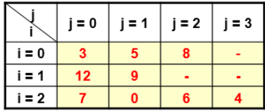
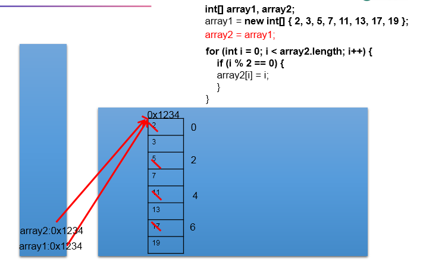
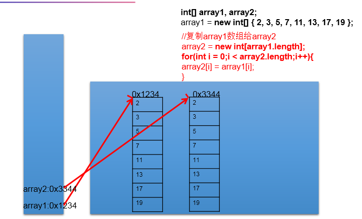
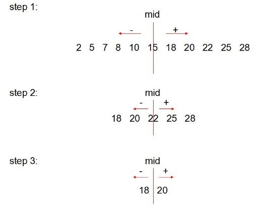
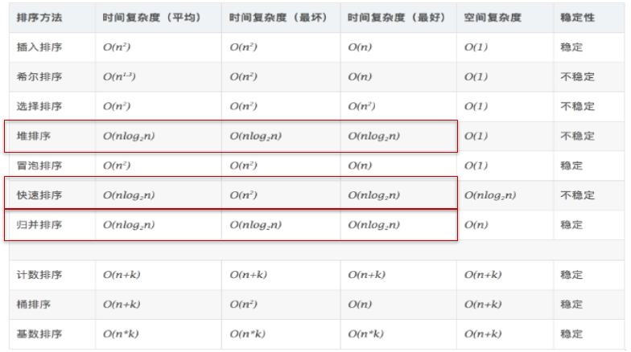
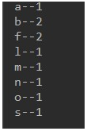

day07授课笔记

讲师：宋红康

***

## 一、复习

- 熟悉一维数组、二维数组使用场景

  - 相同数据类型的多个变量、按照一定顺序组织起来，形成一个数组，使用一个变量名进行统一管理。

- 数组名（或数组的变量名）、索引（角标、下角标、index）、数组的元素

- 数组是引用类型变量、数组的元素可以是基本数据类型，也可以是引用数据类型

- 数组的长度：① 一旦初始化，其长度是确定的！ ② 其长度不可更改

  ```java
  int[] arr = new int[10];
  sysout(arr.length);//10
  
  arr = new int[15];
  
  ```

- 数组元素的默认值

  ```java
  int[] arr = new int[10];
  sysout(arr);//[I@堆空间中数组结构的首地址值
  sysout(arr[0]);//0
  
  int[][] arr1 = new int[10][5];
  sysout(arr1);//[[I@堆空间中数组结构的首地址值
  sysout(arr1[0]);//[I@堆空间中数组结构的首地址值
  sysout(arr1[0][1]);//0
  sysout(arr1[0][5]);//ArrayIndexOutOfBoundsException
  
  int[][] arr2 = new int[10][];
  sysout(arr2);//[[I@堆空间中数组结构的首地址值
  sysout(arr2[0]);//null
  sysout(arr2[0][1]);//NullPointerException
  sysout(arr2[0][5]);//NullPointerException
  ```

- 一维数组、二维数组涉及到的关键内容

  - 数组的初始化：静态初始化、动态初始化
  - 如何访问指定索引位置上的数组元素：通过角标的方式。  
    - Java中的索引通常都是从0开始的！比如：数组、集合、字符串等
      - 在跟数据库交互时，涉及到的相关api中的索引从1开始的。
  - 数组的属性：length
  - 数组的遍历
  - 数组元素的默认初始化值
  - 数组的内存解析（难点）


## 二、作业

```
练习1：如何遍历如下的二维数组

int[][] arr = new int[][]{{1,2,3},{4,5},{6,7,8}};
```

```java
for(int i = 0;i < arr.length;i++){
    for(int j = 0;j < arr[i].length;j++){
        System.out.println(arr[i][j]);
    }
    
}
```


练习2：写出一维数组初始化的两种方式

```
int[] arr = new int[4];//动态初始化

int[] arr1 = new int[]{1,2,3}；//静态初始化

int[] arr2 = {1,2,3};//静态初始化，类型推断
```


练习3：获取如下arr数组中所有元素的和。



```java
int[][] arr = new int[][]{{3,5,8},{12,9},{7,0,6,4}};
int sum = 0;
for(int i = 0;i <arr.length;i++){
    for(int j = 0; j < arr[i].length;j++){
        sum += arr[i][j];
    }
    
}
System.out.println(sum);

//***************************
int[] arr = new int[3][];
arr[0] = new int[]{3,5,8};
//。。。
```


## 三、常见算法

### 1. 针对于数值型的数组，求最大值、最小值、总和、平均数等

```
定义一个int型的一维数组，包含10个元素，分别赋一些随机整数，然后求出所有元素的最大值，最小值，和值，平均值，并输出出来。
要求：所有随机数都是两位数。
 
提示：如何获取指定范围的随机数
 (int)(Math.random() * 90 + 10)

```

```java
public class ArrayTest {
	public static void main(String[] args) {
		int[] arr = new int[10];
		
		//给数组的元素赋值
		for(int i = 0;i < arr.length;i++){
			arr[i] = (int)(Math.random() * (99 - 10 + 1)) + 10;
		}
		
		//遍历数组
		for(int i = 0;i < arr.length;i++){
			System.out.print(arr[i] + " ");
		}
		System.out.println();
		
		//求最大值
		int maxValue = arr[0];
		for(int i = 1;i < arr.length;i++){
			if(maxValue < arr[i]){
				maxValue = arr[i];
			}
		}
		System.out.println("最大值为：" + maxValue);
		
		//求最小值
		int minValue = arr[0];
		for(int i = 1;i < arr.length;i++){
			if(minValue > arr[i]){
				minValue = arr[i];
			}
		}
		System.out.println("最小值为：" + minValue);
		
		//求总和
		int sum = 0;
		for(int i = 0;i < arr.length;i++){
			sum += arr[i];
		}
		System.out.println("总和为：" + sum);
		
		//求平均数
		int avg = sum / arr.length;
		System.out.println("平均数为：" + avg);
		
	}
}
```

### 2. 数组元素的赋值

题目1：

```
使用二维数组打印一个 10 行杨辉三角。

【提示】
 1. 第一行有 1 个元素, 第 n 行有 n 个元素
 2. 每一行的第一个元素和最后一个元素都是 1
 3. 从第三行开始, 对于非第一个元素和最后一个元素的元素。即：
yanghui[i][j] = yanghui[i-1][j-1] + yanghui[i-1][j];

```


```java
public class YangHuiTest {
	public static void main(String[] args) {

		// 1.初始化二维数组
		int[][] yangHui = new int[10][];

		for (int i = 0; i < yangHui.length; i++) {
			yangHui[i] = new int[i + 1];

			// 2.给数组的元素赋值
			// 2.1 给每行的首元素和尾元素赋值
			yangHui[i][0] = yangHui[i][i] = 1;
			// 2.2 给每行非首元素和非尾元素赋值
			//if(i > 1){
				for (int j = 1; j < yangHui[i].length - 1; j++) {
					
					yangHui[i][j] = yangHui[i - 1][j] + yangHui[i - 1][j - 1];
				}
				
			//}

		}

		// 3.遍历输出二维数组的元素
		for (int i = 0; i < yangHui.length; i++) {
			for (int j = 0; j < yangHui[i].length; j++) {
				System.out.print(yangHui[i][j] + "\t");
			}

			System.out.println();
		}

	}
}
```

题目2：

创建一个长度为6的int型数组，要求数组元素的值都在1-30之间，且是随机赋值。同时，要求元素的值各不相同。  提示：Math.random()。


题目3：回形数

```
从键盘输入一个整数（1~20） 
则以该数字为矩阵的大小，把1,2,3…n*n 的数字按照顺时针螺旋的形式填入其中。例如： 输入数字2，则程序输出： 
1 2 
4 3 
输入数字3，则程序输出： 
1 2 3 
8 9 4 
7 6 5 
输入数字4， 则程序输出： 
1   2   3   4 
12  13  14  5 
11  16  15  6 
10   9  8   7
输入数字7， 则程序输出：
01 02 03 04 05 06 07 
24 25 26 27 28 29 08 
23 40 41 42 43 30 09 
22 39 48 49 44 31 10 
21 38 47 46 45 32 11 
20 37 36 35 34 33 12 
19 18 17 16 15 14 13 
```

```java
//方式一：
public class RectangleTest {
	public static void main(String[] args) {
		Scanner scanner = new Scanner(System.in);
		System.out.println("输入一个数字");
		int len = scanner.nextInt();
		int[][] arr = new int[len][len];
		
		int s = len * len;
		/*
		 * k = 1:向右
		 * k = 2:向下
		 * k = 3:向左
		 * k = 4:向上
		 */
		int k = 1;
		int i = 0,j = 0;
		for(int m = 1;m <= s;m++){
			if(k == 1){
				if(j < len && arr[i][j] == 0){
					arr[i][j++] = m;
				}else{
					k = 2;
					i++;  
					j--;
					m--;
				}
			}else if(k == 2){
				if(i < len && arr[i][j] == 0){
					arr[i++][j] = m;
				}else{
					k = 3;
					i--;
					j--;
					m--;
				}
			}else if(k == 3){
				if(j >= 0 && arr[i][j] == 0){
					arr[i][j--] = m;
				}else{
					k = 4;
					i--;
					j++;
					m--;
				}
			}else if(k == 4){
				if(i >= 0 && arr[i][j] == 0){
					arr[i--][j] = m;
				}else{
					k = 1;
					i++;
					j++;
					m--;
				}
			}
		}
		
		//遍历
		for(int m = 0;m < arr.length;m++){
			for(int n = 0;n < arr[m].length;n++){
				System.out.print(arr[m][n] + "\t");
			}
			System.out.println();
		}
	}
}
```

```java
//方式二：
public class RectangleTest1 {

	public static void main(String[] args) {
		int n = 7;
		int[][] arr = new int[n][n];
		
		int count = 0; //要显示的数据
		int maxX = n-1; //x轴的最大下标
		int maxY = n-1; //Y轴的最大下标
		int minX = 0; //x轴的最小下标
		int minY = 0; //Y轴的最小下标
		while(minX<=maxX) {
			for(int x=minX;x<=maxX;x++) {
				arr[minY][x] = ++count;
			}
			minY++;
			for(int y=minY;y<=maxY;y++) {
				arr[y][maxX] = ++count;
			}
			maxX--;
			for(int x=maxX;x>=minX;x--) {
				arr[maxY][x] = ++count;
			}
			maxY--;
			for(int y=maxY;y>=minY;y--) {
				arr[y][minX] = ++count;
			}
			minX++;
		}
		
		
		for(int i=0;i<arr.length;i++) {
			for(int j=0;j<arr.length;j++) {
				String space = (arr[i][j]+"").length()==1 ? "0":"";
				System.out.print(space+arr[i][j]+" ");
			}
			System.out.println();
		}
	}
}
```

### 3. 数组的复制、反转、查找

#### 数组的赋值：arr2 = arr1;

```java
public class ArrayTest {
	public static void main(String[] args) {
		int[] array1,array2;
		
		array1 = new int[]{2,3,5,7,11,13,17,19};
		
		//遍历array1
		System.out.println("遍历array1：");
		for(int i = 0 ;i < array1.length;i++){
			System.out.print(array1[i] + "  ");
		}
		
		System.out.println();
		
		
		System.out.println(array1);
//		System.out.println(array2);
		//赋值array2变量等于array1
		array2 = array1;
		
		System.out.println(array1);
		System.out.println(array2);
		
		//修改array2中的偶索引元素，使其等于索引值.(如array[0]=0,array[2]=2)
		for(int i = 0 ;i < array2.length;i++){
			if(i % 2 == 0){
				array2[i] = i;
			}
		}
		
		//打印出array1。   
		System.out.println("遍历array1：");
		for(int i = 0 ;i < array1.length;i++){
			System.out.print(array1[i] + "  ");
		}
		
		System.out.println();
		
	}
}
```

对应的内存结构：



#### 数组的复制:arr2 = new int[arr1.length]

```java
public class ArrayTest1 {
	public static void main(String[] args) {
		int[] array1,array2;
		
		array1 = new int[]{2,3,5,7,11,13,17,19};
		
		//遍历array1
		System.out.println("遍历array1：");
		for(int i = 0 ;i < array1.length;i++){
			System.out.print(array1[i] + "  ");
		}
		
		System.out.println();
		
		
		System.out.println(array1);
//		System.out.println(array2);
		//复制array1数组：array2
		array2 = new int[array1.length];
		for(int i = 0;i < array1.length;i++){
			array2[i] = array1[i];
		}
		
		System.out.println(array1);
		System.out.println(array2);
		
		//修改array2中的偶索引元素，使其等于索引值.(如array[0]=0,array[2]=2)
		for(int i = 0 ;i < array2.length;i++){
			if(i % 2 == 0){
				array2[i] = i;
			}
		}
		
		//打印出array1。   
		System.out.println("遍历array1：");
		for(int i = 0 ;i < array1.length;i++){
			System.out.print(array1[i] + "  ");
		}
		
		System.out.println();
		
	}
}
```

对应的内存结构：



#### 数组的反转：

```java
		int[] arr = new int[]{34,4,4,66,23,65,34,65,465};
		
		System.out.println("反转之前：");
		for(int i = 0;i < arr.length;i++){
			System.out.print(arr[i] + "  ");
		}
		
		System.out.println();
		//反转操作：方式一
//		for(int i = 0,j = arr.length - 1;i < j;i++,j--){
//			int temp = arr[i];
//			arr[i] = arr[j];
//			arr[j] = temp;
//		}
		//反转操作：方式二
		for(int i = 0;i < arr.length / 2;i++){
			int temp = arr[i];
			arr[i] = arr[arr.length - 1 - i];
			arr[arr.length - 1 - i] = temp;
		}
		
		System.out.println("反转之后：");
		for(int i = 0;i < arr.length;i++){
			System.out.print(arr[i] + "  ");
		}
		
		System.out.println();
```

#### 数组元素的查找（或搜索）

```java
//线性查找		
		int[] arr = new int[]{34,4,4,66,23,65,34,65,465};
		int target = 23;
//		target = 233;
		boolean isFlag = false;//判断是否找到了指定元素

		for(int i = 0;i < arr.length;i++){
			if(target == arr[i]){
				System.out.println("找到了" + target + "数组，位置为：" + i);
				isFlag = true;
				break;
			}
		}
		
		if(!isFlag){//if(isFlag == false){
			System.out.println("没找到指定的元素");
		}
```

```java
//二分法查找：查询效率高于线性查找
		//使用前提：数组是有序的
		int[] arr1 = new int[]{1,2,4,6,7,12,32,44,67,88,109,213,556};
		int target1 = 109;
//		target1 = 1009;
		int head = 0;//默认的首索引
		int end = arr1.length - 1;//默认的尾索引
		boolean isFlag1 = false;//判断是否找到了指定元素
		while(head <= end){
			int middle = (head + end) / 2;
			if(arr1[middle] == target1){
				System.out.println("找到了" + target1 + "元素，位置为：" + middle);
				isFlag1 = true;
				break;
			}else if(arr1[middle] > target1){
				end = middle - 1;
			}else{
				head = middle + 1;
			}
			
		}
		if(!isFlag1){
			System.out.println("没找到指定的元素");
		}
```



### 4. 数组的排序

1. 定义

```
排序：假设含有n个记录的序列为{R1，R2，...,Rn},其相应的关键字序列为{K1，K2，...,Kn}。将这些记录重新排序为{Ri1,Ri2,...,Rin},使得相应的关键字值满足条Ki1<=Ki2<=...<=Kin,这样的一种操作称为排序。
通常来说，排序的目的是快速查找。

```

2. 衡量排序算法的优劣

```
衡量排序算法的优劣：
1.时间复杂度：分析关键字的比较次数和记录的移动次数
2.空间复杂度：分析排序算法中需要多少辅助内存
3.稳定性：若两个记录A和B的关键字值相等，但排序后A、B的先后次序保持不变，则称这种排序算法是稳定的。

```

3. 排序算法追求的：高效率与低存储量需求。



1. 十大排序算法

```
选择排序
	直接选择排序、堆排序
交换排序
	冒泡排序、快速排序
插入排序
	直接插入排序、折半插入排序、Shell排序
归并排序
桶式排序
基数排序

```

说明：关于面试中大家需要关注的排序算法：

​	第一级别：冒泡排序（最简单、要求手写）

​                           快速排序（开发中普遍使用的、手写最好、说出算法实现的原理）

​        第二级别：堆排序、归并排序  （时间复杂度较好）

- 冒泡排序

  ```java
  int[] arr = new int[]{34,4,4,66,23,65,34,65,465};
  		
  		//冒泡排序:从小到大
  		for(int i = 0;i < arr.length - 1;i++){
  			
  			for(int j = 0;j < arr.length - 1 - i;j++){
  				
  				if(arr[j] > arr[j + 1]){
  					int temp = arr[j];
  					arr[j] = arr[j + 1];
  					arr[j + 1] = temp;
  				}
  			}
  		}
  		System.out.println("排序后：");
  		for(int i = 0;i <arr.length;i++){
  			System.out.print(arr[i] + "  ");
  		}
  ```

- 快速排序

  ```java
  public class QuickSortTest {
  	private static void swap(int[] data, int i, int j) {
  		int temp = data[i];
  		data[i] = data[j];
  		data[j] = temp;
  	}
  
  	private static void subSort(int[] data, int start, int end) {
  		if (start < end) {
  			int base = data[start];
  			int low = start;
  			int high = end + 1;
  			while (true) {
  				while (low < end && data[++low] - base <= 0);
  				while (high > start && data[--high] - base >= 0);
  				if (low < high) {
  					swap(data, low, high);
  				} else {
  					break;
  				}
  			}
  			swap(data, start, high);
  
  			subSort(data, start, high - 1);// 递归调用
  			subSort(data, high + 1, end);
  		}
  	}
  
  	public static void quickSort(int[] data) {
  		subSort(data, 0, data.length - 1);
  	}
  
  	public static void main(String[] args) {
  		int[] data = { 9, -16, 30, 23, -30, -49, 25, 21, 30 };
  		System.out.println("排序之前：\n" + java.util.Arrays.toString(data));
  		quickSort(data);
  		System.out.println("排序之后：\n" + java.util.Arrays.toString(data));
  	}
  }
  ```

  

## 四、数组工具类：Arrays的使用

- Arrays是操作数组的工具类，提供了很多static的方法。

```java
public static void main(String[] args) {
		//1. boolean equals(int[] a,int[] b)：比较两个数组的元素是否依次相等
		int[] arr1 = new int[]{1,2,3,4,5};
		int[] arr2 = new int[]{1,2,4,3,5};
		boolean isEquals = Arrays.equals(arr1, arr2);
		System.out.println(isEquals);//false
		
		//2. String toString(int[] a):输出数组元素信息。
		System.out.println(Arrays.toString(arr1));
		
		//3.void fill(int[] a,int val):将指定值填充到数组之中。
		Arrays.fill(arr1, 10);
		System.out.println(Arrays.toString(arr1));
		
		//4. void sort(int[] a):使用快速排序算法实现的排序
		Arrays.sort(arr2);
		System.out.println(Arrays.toString(arr2));
		
		//5. int binarySearch(int[] a,int key):二分查找
		//使用前提：有序！
		//如果在指定的数组中，找到了key元素，则返回其在数组中的位置。否则，返回负数
		int index = Arrays.binarySearch(arr2, 30);
		if(index >= 0){
			System.out.println(index);
		}else{
			System.out.println("不好意思，没有找到指定的元素");
		}
		
	}
```


## 五、总结数组操作中的异常

### 1. ArrayIndexOutOfBoundsException:数据角标越界异常

```java
// 1. 数组角标越界的异常：ArrayIndexOutOfBoundsException
int[] arr = new int[10];// 角标的有效范围：[0,9]
// System.out.println(arr[11]);
//System.out.println(arr[-1]);
```


### 2. NullPointerException:空指针异常

```java
	// 空指针异常：NullPointerException
		//举例一：
//		int[] arr1 = new int[10];
//		arr1 = null;
//		System.out.println(arr1[9]);
		
		//举例二：
//		int[][] arr2 = new int[5][];
//		//arr2[3] = new int[10];
//		System.out.println(arr2[3][3]);
		
		//举例三：
		String[] arr3 = new String[10];
		System.out.println(arr3[2].toString());
```


## 六、补充

### 1. 关于Java中变量间的赋值

```
1. Java是强类型的语言。

2. 赋值的情况1：相同类型的变量间，可以赋值
int num1 = 10;
int num2 = num1;

String s1 = "hello";
String s2 = s1;

int[] arr = new int[10];
int[][] arr1 = new int[10][3];
arr = arr1;//编译失败

3. 赋值情况2：基本数据类型之间，存在自动类型提升规则(容量小的变量--->容量大的变量)
byte b = 10;
int i = b;

char c = 'a';
int j = c;
double d = c;


4. 赋值情况3：引用数据类型之间，存在多态性：子类对象赋给父类的引用变量  (未讲)
Student s = new Student();
Person p = null;
p = s;

5. 赋值情况4：（是上述情况2，情况3的逆运算） 使用强制类型转换符 (未讲)

int i = 10;
byte b = i;//编译不通过
byte b = (byte)i;//编译通过

Person p = new Student();
Student s = (Student)p;

```

### 2. 练习

练习1：

```
统计字符
  - 字符数组：{'a','l','f','m','f','o','b','b','s','n'}
  - 统计每个字符出现的次数并打印到控制台。
- 代码实现，部分效果如图所示：
```



练习2：

```
统计高于平均分的分数有多少个。

定义数组[95, 92, 75, 56, 98, 71, 80, 58, 91, 91]。

代码实现，效果如图所示：
```


## 七、面向对象与面向过程

### 1. 三条主线

1.类及类的成员：属性、方法、构造器；  内部类、代码块（或初始化块）

2.面向对象的三大特征：封装、继承、多态、（抽象性）

3.其它关键字的使用：static\ final\abstract\interface\import\package\this\super...

### 2. 面向对象与面向过程  --了解

```
> 面向过程，强调的是功能行为，以函数为最小单位，考虑怎么做。
 * 
 * > 面向对象，将功能封装进对象，强调具备了功能的对象，以类/对象为最小单位，考虑谁来做。
 * 
 * 举例：人把大象装冰箱
 * 
 * 面向过程：
 * 1. 人拿起大象
 * 2. 打开冰箱门
 * 3. 把大象装进冰箱
 * 4. 关上冰箱门
 * 
 * 面向对象：
 * 
 * 人{
 * 	  拿起(大象){
 * 	
 * 	 }
 * 	打开(冰箱){
 * 		冰箱.开开();
 * 	}
 * 	操作(大象){
 * 		大象.进入(冰箱);
 *  }
 *  关闭(冰箱){
 *  	冰箱.合上();
 *  }
 * }
 * 
 * 大象{
 * 		进入(冰箱){
 *      }
 * }
 * 
 * 冰箱{
 * 		开开(){}
 * 
 * 		合上(){}
 * }
```

### 3. 面向对象的两个核心概念：类、对象

- 类：类是对一类事物的描述，是抽象的、概念上的定义

 * 对象：对象是实际存在的该类事物的每个个体，因而也称为实例(instance)。

### 4. 使用面向对象语言完成编程的过程

```
使用面向对象语言完成编程的过程：人把大象装冰箱
 *  1. 确定编程过程中涉及到的类是否已经存在？
 *  2. 如果不存在，需要我们自己来设计相关的类。设计类的内部结构
 *  3. 根据现有的类或设计好的类，去创建类的对象
 *  4. 使用对象来完成具体的过程。设计到对象调用类中的功能。
```

## 八、类与对象

```
1. 设计类，其实就是设计类的内部结构
 * 
 * BBA：宝马、奔驰、奥迪：德国！
 * 
 * 2. 类的内部主要结构有：属性、行为
 * 
 * 属性：直接声明在类中的变量
 * 行为：声明在类中的方法
 * 
 * 属性 = 成员变量 = field = 字段、域
 * 方法 = 成员方法 = 成员函数 = method
 * 
 * 3. 类的实例化 = 创建类的对象。格式：
 * 举例：  Person p1 = new Person();
 * 		Scanner scan = new Scanner(System.in);
 * 
 * 4. 总结：面向对象完成具体功能的操作的流程：
 *    1) 创建类、设计类的内部结构：属性、方法
 *    2) 创建类的对象
 *    3) 通过"对象.属性" 或 "对象.方法"的方式完成功能的执行
```

测试：

```java
class Person{
	//属性
	String name;
	int age;
	boolean isMale;
	
	
	//方法
	public void eat(){
		System.out.println("吃饭");
	}
	
	public void showNation(String nation){
		System.out.println("我来自：" + nation);
	}
	
	public void swim(){
		System.out.println("人：游泳");
	}
	
}
```

```java
public class PersonTest {
	public static void main(String[] args) {
		//类的实例化
		Scanner scan = new Scanner(System.in);
//		scan.nextInt();
		int[] arr = new int[10];
		//数据类型  变量名 = 变量值
		Person p1 = new Person();
		//调用方法
		p1.eat();
		p1.showNation("CHN");
		p1.swim();
		//调用属性：属性在没有赋值前，有默认初始化值
		p1.name = "Tom";
		System.out.println(p1.name);
		
		System.out.println(p1.age);
		System.out.println(p1.isMale);
	}
}

```

