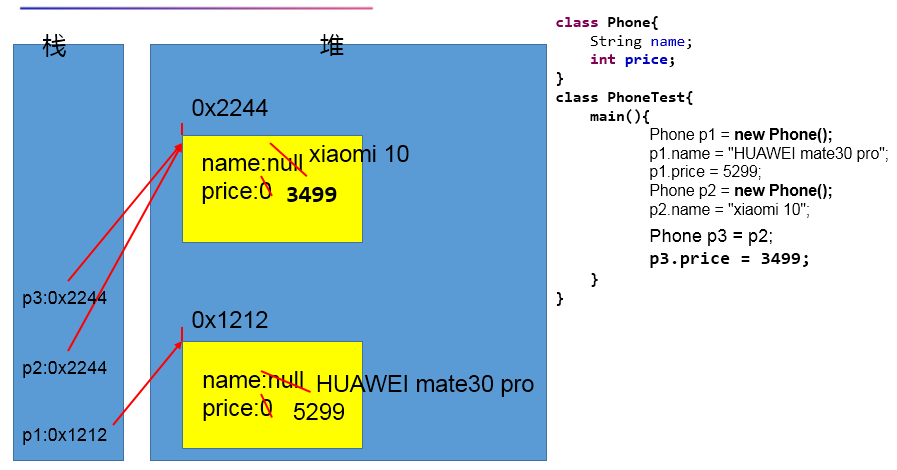
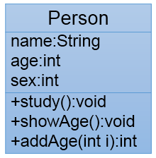

# day08授课笔记

讲师：宋红康

***

## 一、作业

题目1：

```
- 统计字符
  	- 	字符数组：{'a','l','f','m','f','o','b','b','s','n'}
  	- 	统计每个字符出现的次数并打印到控制台。
	
	
	拓展题目：{23,45,76,-9,7,-8,36,-56,44,3,50,-6}.要求：时间复杂度是O(n)
	
	leetcode  力扣     牛客网    左程云《程序员代码面试指南》
```

```java
public class ArrayTest {
	public static void main(String[] args) {
		
		char[] arr = {'a','l','f','m','f','o','b','b','s','n'};
		//方法一：
		/*Arrays.sort(arr); //快排的时间复杂度：O(nlogn)
		
		int count = 1;//默认的每个字符出现的次数
		for(int i = 0;i < arr.length;i++){ //时间复杂度O(n)
			
			if(i == arr.length - 1){
				System.out.println(arr[i] + "----->" + count);
				break;
			}
			
			if(arr[i] == arr[i + 1]){
				count++;
			}else{
				System.out.println(arr[i] +"----->" + count);
				count = 1;
			}
			
		}*/
		
		//方法二：
		int[] count = new int[26];//记录各个小写的字符出现的次数
		
		for(int i = 0 ;i < arr.length;i++){ //'a' : 97
			count[arr[i] - 97]++;
		}
		
		for(int i = 0;i < count.length;i++){
			if(count[i] != 0){
				System.out.println((char)(i + 97) + "------>" + count[i]);
			}
		}
		
	}
}
```

题目2：

面向对象思想编程内容的三条主线分别是什么？

```
   1.类及类的成员：属性、方法、构造器；  内部类、代码块（或初始化块）
 * 
 * 2.面向对象的三大特征：封装、继承、多态、（抽象性）
 * 
 * 3.其它关键字的使用：static\ final\abstract\interface\import\package\this\super...

```

面试题： 谈谈你对面向对象思想的理解？（包含类、对象的理解）

题目3：

谈谈你对面向对象中类和对象的理解，并指出二者的关系？

```
 * 类：类是对一类事物的描述，是抽象的、概念上的定义
 * 对象：对象是实际存在的该类事物的每个个体，因而也称为实例(instance)。
```

题目4：

关于数组的排序问题：（有十种排序算法）

需要大家能手写的排序：① 冒泡排序  ② 快速排序  （至少需要回答出算法实现的逻辑，复杂度）

需要大家关注的排序：① 堆排序  ② 归并排序  （一般情况下的时间复杂度也是O(nlogn)

其他的排序算法：不需要关注了。

题目5：

 数组中常见的异常有哪些？请举例说明

ArrayIndexOutOfBoundsException 、 **NullPointerException**

## 二、复习

### 1. 数组相关的算法操作

- 数值型数组的特征值的计算：最大值、最小值、总和、平均数、方差、...
- 数组的复制、反转、搜索（或查找）：线性查找、二分法查找（前提：数组有序）
- 数组的排序
- 常常在笔试中出现一些算法问题。非常集中的点在：① 数组  ② 字符串 （略）
  - 数组的创建与元素赋值
  - 给定了数组，求相关的特征数据

### 2. 算法的特征与设计要求

- 特征：
  - 输入性
  - 输出性
  - 有穷性、有限性：必须在有限的时间内执行完成
  - 确定性、明确性：每一步操作必须有确定的含义
  - 可行性、有效性：每一步操作是清楚且可行的
- 设计要求：
  - 正确性
  - 可读性
  - 健壮性
  - 高效率与低存储量需求

### 3.面向对象

- 面向对象的三条主线
- 面向对象的两个基本要素：类、对象
  - 类与对象的关系
- 类的内部成员：① 属性 ② 方法
- **面向对象落地的实现步骤：**
   *    1) 创建类、设计类的内部结构：属性、方法
   *    2) 创建类的对象
   *    3) 通过"对象.属性" 或 "对象.方法"的方式完成功能的执行

## 三、类与对象

### 1. 创建类

```java
class Phone{
	String name;
	int price;
	
	public void call(){
		System.out.println("手机用来打电话");
	}
	
	public void sendMessage(String message){
		System.out.println("发送信息：" + message);
	}
	
	
}
```

### 2. 创建类的第1个对象

```java
public class PhoneTest {
	public static void main(String[] args) {
		//
//		Scanner scan = new Scanner(System.in);
//		int[] arr = new int[3];
		
		Phone p1 = new Phone();//类的实例化、创建类的对象
		System.out.println("name : " + p1.name + ",price : " + p1.price);
		//"对象.属性" 或 "对象.方法"的方式完成功能的执行
		p1.name = "HUAWEI mate30 pro";
		p1.price = 5299;
		
		System.out.println("name : " + p1.name + ",price : " + p1.price);
		
		p1.call();
		p1.sendMessage("有内鬼，停止交易");
		
		//The method playGame() is undefined for the type Phone
		//p1对象所在的类中没有声明过playGame()方法
//		p1.playGame();
	}
}
```

### 3. 创建第2个对象

```java
Phone p2 = new Phone();
p2.name = "xiaomi 10";
p2.price = 3999;
System.out.println("name : " + p2.name + ",price : " + p2.price);
		
System.out.println("name : " + p1.name + ",price : " + p1.price);
```

> 1. 创建好的对象只能调用其所在类中声明过的功能：属性、方法的调用。
>
> 2. 如果创建一个类的多个对象，则每个对象都拥有一套类中的属性的“副本”。如果修改其中一个对象的属性值，不会影响到其他对象此属性的值。

### 4. 引用变量赋值

```java
//p2和p3变量存储的值相同，此时的值即为堆空间中的对象的首地址。
//意味着p2和p3引用变量共同指向了堆空间中的同一个对象。
Phone p3 = p2;
System.out.println("name : " + p3.name + ",price : " + p3.price);
p3.price = 3499;
System.out.println("name : " + p2.name + ",price : " + p2.price);
```

> 如果编写“Phone p3 = p2”，此时并没有新创建一个对象p3。
>
> p2和p3变量存储的值相同，此时的值即为堆空间中的对象的首地址。意味着p2和p3引用变量共同指向了堆空间中的同一个对象。

### 5. 对象的内存解析



### 6. 匿名对象

```
 * 匿名对象：创建的对象是匿名的。
 * 
 * 
 * 说明：
 * 1. 只要在代码中看到了"new"关键字，那就表明要新创建一个对象、数组。
 * 2. 匿名对象，因为没有变量名，所以只能调用一次。
```

```java
public class PhoneTest1 {
	public static void main(String[] args) {
		
		new Phone().call();//创建了对象1
		
		new Phone().sendMessage("好久不见，甚是想念");//创建了对象2
		
		//还可以调用对象1吗？No
		
		PhoneTest1 test = new PhoneTest1();
		//Phone p1 = new Phone();
		//test.show(p1);
		//如果后续代码中不再使用p1，则可以简化如下：
		//简化如下：开发中匿名对象的使用场景
		test.show(new Phone());
	}
	
	public void show(Phone phone){
		phone.call();
		phone.sendMessage("你好！");
		phone.name = "OPPO v1";
		System.out.println(phone.name);
	}
}

```

## 四、类的属性

### 1. 基本说明

```
 * 1.回忆：变量的分类： 角度一：数据类型来分： 基本数据类型（8种）  vs 引用数据类型（类、数组、接口）
 * 				   角度二：在类中声明位置的不同来分： 成员变量  vs 局部变量
 * 
 * 2. 成员变量 = 属性  = field = 字段、域
```

### 2. 对比成员变量 与 局部变量

```
		3.1 相同点：
 * 			① 变量声明的格式相同： 数据类型  变量名 = 初始化值
 * 			② 变量必须先声明、后初始化、再使用。
 * 			③ 变量都有其对应的作用域。只在其作用域内是有效的
 * 
 * 		3.2不同点：
 * 		① 类中声明位置是不同的。
 * 			>成员变量：直接声明在类中的变量
 * 			>局部变量：声明在方法内部、方法的形参、构造器内部、代码块的内部
 * 		② 关于权限修饰符的使用
 * 			>成员变量：在声明的类型前，可以使用权限修饰符。
 * 				权限修饰符有：public \ private \ protected \ 缺省
 * 				当前大家声明属性时，先使用缺省的情况即可。
 * 			>局部变量：不可以在其类型前使用权限修饰符。
 * 		③ 关于初始化值的问题
 * 			>成员变量：如果没有显式赋值，则成员变量根据其类型有默认初始化值。
 * 				>整型的成员变量：byte\short\int\long 型数组的元素的默认值为： 0
 * 				>浮点型的成员变量：float\double 型数组的元素的默认值为：0.0
 * 				>布尔型的成员变量：boolean 型数组的元素的默认值为：false
 * 				>字符型的成员变量：char 型数组的元素的默认值为：0或\u0000
 * 				>引用数据类型的成员变量：数组的元素的默认值为：null
 * 
 * 			>局部变量：在使用之前，一定要显式的初始化，没有默认初始化值。
 * 				注意：形参在声明时不赋值。在调用此方法时，显式的赋值。
 * 		④ 在内存中保存的位置也不同
 * 			>成员变量：在堆空间中分配内存
 * 
 * 			>局部变量：在栈空间中分配内存
```

#### 成员变量

```java
class Person{
	//声明的变量，即为成员变量
	public String name;//默认初始化
	int age = 1;//显式初始化
	boolean isMale;//默认初始化
}
```

#### 局部变量

```java
	public void eat(String food){//形参：属于局部变量的一种
		System.out.println("喜欢吃" + food);
	}
	
	public void sleep(){
		int hour = 8;//声明了局部变量
		System.out.println("保证睡眠" + hour +"个小时");
	}
```

#### 说明

```
	public void info(){
		
		age = 2;//在方法内可以使用成员变量
		
//		hour = 10;//不能调用其他方法内部的局部变量
		
	}
```

> 在方法内可以使用类的成员变量。
>
> 但是在方法内不能使用其它方法内定义的局部变量

## 五、类的方法

### 1. 基本说明

```
 * 1. 使用举例：
 * Math:random()、sqrt()
 * Scanner:next()、nextXxx()
 * Arrays:binarySearch()、equals()、sort()、toString()
 * 
 * 2.声明举例
 *  public void sleep();
 *  public void eat(String food);
 *  public String getName();
 *  private String showNation(String nation);
```

### 2. 方法的声明格式

```
 * 方法声明的格式：
 * 	 权限修饰符  返回值类型  方法名(形参列表){
 * 		//方法体
 *  }
 * 
 *  说明：关于方法中声明static\final\abstract\native...等暂时先不考虑
```

### 3. 具体的内容

```
3. 具体的方法声明的细节
 *   3.1 权限修饰符
 *     > 在每个方法声明的开始，可以使用权限修饰符进行修饰，表明此方法被调用时的范围的大小。
 *     > 权限修饰符有：public \ private \ protected \ 缺省
 *     > 暂时大家在讲封装性之前，声明方法的权限修饰符暂且都使用public
 * 	 3.2 返回值类型 :方法在调用完以后，是否需要给方法的调用者返回相应的数据。
 *     > 分类： 没有返回值的类型  vs 有返回值的类型
 *     		> 没有返回值的类型,使用void表示。 举例：Arrays类中的sort(int[] arr)
 *     		> 有返回值的类型,需要指明返回值的类型。举例：Math:random()、sqrt(double i)
 * 	   > 对于有返回值类型的方法来说，在方法体内部一定要返回相应类型的数据。使用return来实现。
 * 
 * 	   > 问题：我们在声明方法时，如何判断是否需要有返回值类型？
 * 			① 看题目的要求
 * 			② 具体问题具体分析
 * 	 3.3 方法名：是标识符。遵循标识符命名的规则和规范。见名知意。		
 *   
 *   3.4 形参列表：属于局部变量
 *   	>分类：有形参列表  vs 没有形参列表的方法
 *   	
 *      >问题：我们在声明方法时，是否需要声明形参列表？
 *      	① 看题目的要求
 * 			② 具体问题具体分析
 *   3.5 方法体： 当调用一个方法时，其实就是执行其方法体。
```

```java
public class UserTest {
	public static void main(String[] args) {
		
		UserTest test = new UserTest();
		test.show();
		
		User user = new User();
		String s = user.showInfo();
		System.out.println(s);
		
	}
	
	
}

class User{
	
	String name;
	int age;
	
	//This method must return a result of type boolean
	public boolean isMale(){
		
//		return 0;
		return true;
	}
	
	public void eat(){
		
	}
	
	
	public String showInfo(){
		
		if(age >= 18){
			return "成年人";
		}else{
			return "未成年人";
		}
		//编译不通过
		//System.out.println("hello");
	}
	
	public double sqrt(double d){
		return Math.sqrt(d);
	}
	
//	public double sqrt(){
//		double d = 123.4;
//		return Math.sqrt(d);
//	}
	
}
```

### 4. return关键字的使用

```
关键字：return
 *  	作用： ① 结束一个方法
 *  		  ② 结束一个方法的同时，可以返回数据给方法的调用者 
 *  
 *  	说明：在return关键字的直接后面不能声明执行语句
```

```java
	public void show(){
		String str = "hello";
		if("hello".equals(str)){
			System.out.println("hi~~~");
			return;
		}
		
		System.out.println("你好");
		
		
	}
```

```java
public String showInfo(){
		
		if(age >= 18){
			return "成年人";
		}else{
			return "未成年人";
		}
		//编译不通过
		//System.out.println("hello");
	}
	
	public double sqrt(double d){
		return Math.sqrt(d);
	}
	
//	public double sqrt(){
//		double d = 123.4;
//		return Math.sqrt(d);
//	}
```

### 5. 补充说明

```
1. 在方法内可以使用类的成员变量。但是在方法内不能使用其它方法内定义的局部变量

2. 在方法内，可以调用其他方法。但是在方法内，不允许定义方法。
```

```java
	public void eat(){
		System.out.println("吃饭");
		//在方法内可以调用其他方法
		showInfo();
		
		//方法内不可以定义方法
//		public void info(){
//			
//		}
	}
	
	
	public String showInfo(){
		
		
	}
```

## 六、相关练习

练习1：

创建一个Person类，其定义如下：

```
要求：(1)创建Person类的对象，设置该对象的name、age和sex属性，调用study方法，输出字符串“studying”，调用showAge()方法显示age值，调用addAge()方法给对象的age属性值增加2岁。
(2)创建第二个对象，执行上述操作，体会同一个类的不同对象之间的关系。

```



```java
public class Person {
	
	String name;
	int age;
	int sex;//性别   0:男性  1:女性 
	
	public void study(){
		System.out.println("studying");
	}
	
	public void showAge(){
		System.out.println("age : " + age);
	}
	
	public int addAge(int i){//i:给age属性增加i岁
		age += i;
		return age;
	}
	
	
}
```

```java
public class PersonTest {
	public static void main(String[] args) {
		
		Person p1 = new Person();
		//对象调用属性
		p1.name = "王浩波";
		p1.age = 32;
		p1.sex = 0;
		
		//对象调用方法
		p1.study();
		p1.showAge();
		p1.addAge(2);
		
		System.out.println(p1.age);//34
		
		//**********************************
		
		//如果创建一个类的多个对象，则每个对象都拥有一套类中的属性的“副本”。
		//如果修改其中一个对象的属性值，不会影响到其他对象此属性的值。
		Person p2 = new Person();
		p2.showAge();
		p2.addAge(10);
		p2.showAge();
		
	}
}
```

练习2：

利用面向对象的编程方法，设计类Circle计算圆的面积。

```java
public class Circle {

	//属性:半径
	double radius;
	
	
	//计算圆的面积：pi * r * r
	//正确的方式一
//	public double findArea(){
//		
//		return 3.14 * radius * radius;
//	} 
	//正确的方式二
	public void findArea(){
		double area = 3.14 * radius * radius;
		System.out.println(area);
//		return;
	}
	
	//错误的写法
//	public double findArea(double r){
//		return 3.14 * r * r;
//	}
	
}
```

```java
public class CircleTest {
	
	public static void main(String[] args) {
		
		Circle c1 = new Circle();
		
		c1.radius = 2.3;
		
		//对应正确的写法一：
//		double area = c1.findArea();
//		System.out.println("c1的面积为：" + area);
		
		
		//对应正确的写法二：
		c1.findArea();
		
		//对应错误的写法
//		double area = c1.findArea(2.3);
//		System.out.println(area);
	}
}
```

练习3：

```
3.1 编写程序，声明一个method方法，在方法中打印一个10*8 的*型矩形，在main方法中调用该方法。

3.2 修改上一个程序，在method方法中，除打印一个10*8的*型矩形外，再计算该矩形的面积，并将其作为方法返回值。在main方法中调用该方法，接收返回的面积值并打印。

3.3 修改上一个程序，在method方法提供m和n两个参数，方法中打印一个m*n的*型矩形，并计算该矩形的面积， 将其作为方法返回值。在main方法中调用该方法，接收返回的面积值并打印。

```

练习4：

```
对象数组题目：
定义类Student，包含三个属性：学号number(int)，年级state(int)，成绩score(int)。 创建20个学生对象，学号为1到20，年级和成绩都由随机数确定。
问题一：打印出3年级(state值为3）的学生信息。
问题二：使用冒泡排序按学生成绩排序，并遍历所有学生信息

提示：
1) 生成随机数：Math.random()，返回值类型double;  
2) 四舍五入取整：Math.round(double d)，返回值类型long。

```

```java
/*
 * 定义类Student，包含三个属性：学号number(int)，年级state(int)，成绩score(int)。
 */
public class Student {
	
	int number;//学号
	int state;//年级
	int score;//成绩
	
	
	public void info(){
		System.out.println("number : " + number 
				+ ",state : " + state + ",score : " + score);
	}
	
}
```

```java
public class StudentTest {

	public static void main(String[] args) {
		// //....
		// 对象数组
		// String[] arr = new String[10];
		// 数组的创建
		Student[] students = new Student[20];
		// 通过循环结构给数组的属性赋值
		for (int i = 0; i < students.length; i++) {
			// 数组元素的赋值
			students[i] = new Student();
			// 数组元素是一个对象，给对象的各个属性赋值
			students[i].number = (i + 1);
			students[i].state = (int) (Math.random() * 6 + 1);// [1,6]
			students[i].score = (int) (Math.random() * 101);// [0,100]
		}

		// 问题一：打印出3年级(state值为3）的学生信息。
		for (int i = 0; i < students.length; i++) {

			if (students[i].state == 3) {
//				System.out.println(
//						"number:" + students[i].number + ",state:" + students[i].state + ",score:" + students[i].score);
				students[i].info();
				
			}

		}
		System.out.println("******************************");
		// 问题二：使用冒泡排序按学生成绩排序，并遍历所有学生信息
		// 排序前
		for (int i = 0; i < students.length; i++) {
//			System.out.println(
//					"number:" + students[i].number + ",state:" + 
//							students[i].state + ",score:" + students[i].score);
			
			students[i].info();
		}

		System.out.println();
		// 排序：
		for (int i = 0; i < students.length - 1; i++) {
			for (int j = 0; j < students.length - 1 - i; j++) {
				if (students[j].score > students[j + 1].score) {
					Student temp = students[j];
					students[j] = students[j + 1];
					students[j + 1] = temp;
				}
			}
		}

		// 排序后：
		for (int i = 0; i < students.length; i++) {
//			System.out.println(
//					"number:" + students[i].number + ",state:" + 
//							students[i].state + ",score:" + students[i].score);
			
			students[i].info();
		}

	}

}
```

练习5：

```
声明一个日期类型MyDate：有属性：年year,月month，日day。创建2个日期对象，分别赋值为：你的出生日期，你对象的出生日期，并显示信息。

```

## 七、方法的重载（overload)

```
 * 1. 定义：在同一个类中，允许存在一个以上的同名方法，只要它们的参数个数或者参数类型不同即可。
 *    此时，多个同名的方法之间就称为方法的重载。
 * 
 * 2. 总结为：两同一不同。（同一个类，相同的方法名，参数列表不同）
 * 		> 参数列表不同，指参数个数或者参数类型不同
 * 
 * 
 * 3. 如何判断两个方法是相同的呢？换个问法，如何编译器确定调用的是某个指定方法呢？
 * 
 * 		① 参照方法名
 * 		② 参数列表
 * 	
 * 4. 方法的重载与权限修饰符、返回值类型、形参的名字都没有关系！！
```

```java
   //如下的三个方法构成重载
	public void getSum(int i,int j){
		System.out.println(i + j);
	}
	
	public void getSum(int i,byte b){
		System.out.println(i + b);
	}
	
	public void getSum(int i,int j ,int k){
		
	}
	//如下的两个方法不与上述三个方法构成重载
//	public void getSum(int i,int k){
//		
//	}
	
//	public int getSum(int i ,int k){
//		
//	}
```

面试题：

```
//面试题
public class InterviewTest {
	public static void main(String[] args) {
		
		int[] arr = new int[]{1,2,3};
		System.out.println(arr);//地址值
		
		char[] arr1 = new char[]{'a','b','c'};
		System.out.println(arr1);//abc
		
		boolean[] arr2 = new boolean[]{false,true,true};
		System.out.println(arr2);//地址值
		
	}
}
```

