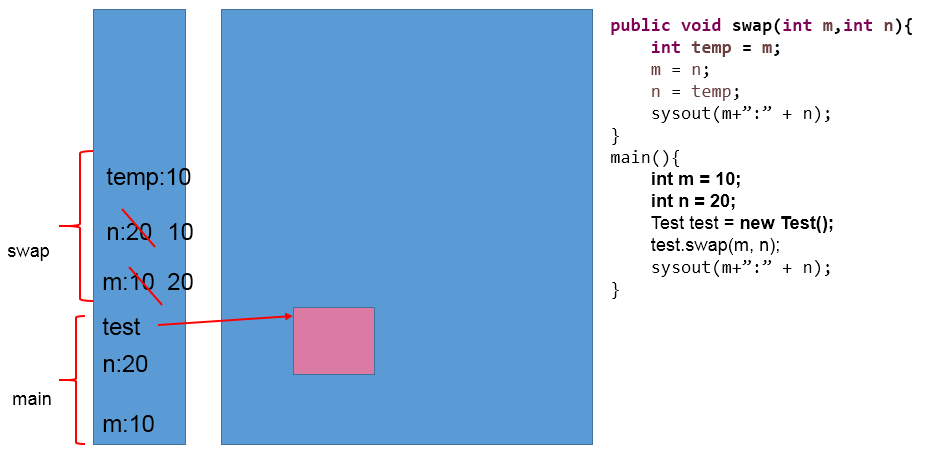

# day09授课笔记

## 一、作业

练习1：

```java
/*编写程序，定义三个重载方法并调用。方法名为mOL。
三个方法分别接收一个int参数、两个int参数、一个字符串参数。
分别执行平方运算并输出结果，相乘并输出结果，输出字符串信息。
*/
public class OverloadTest1 {

	public static void main(String[] args) {
		OverloadTest1 o1 = new OverloadTest1();
		System.out.println(o1.mOL(4));
		System.out.println(o1.mOL(4, 7));
		o1.mOL("hello");
	}

	public int mOL(int i) {
		return i * i;
	}

	public int mOL(int i, int j) {
		return i * j;
	}

	public void mOL(String i) {
		System.out.println(i);
	}
}
```

练习2：

```java
/*
 * 定义三个重载方法max()，
 * 第一个方法求两个int值中的最大值，
 * 第二个方法求两个double值中的最大值，
 * 第三个方法求三个double值中的最大值，并分别调用三个方法。
*/
public class OverloadTest2 {

	public static void main(String[] args) {
		OverloadTest2 o1 = new OverloadTest2();
		System.out.println(o1.max(3, 4));
		System.out.println(o1.max(3.8, 4.6));
		System.out.println(o1.max(8.9, -7.0, 15.5));
	}

	public int max(int i, int j) {
		// if (i > j) {
		// return i;
		// } else {
		// return j;
		// }

		return (i > j) ? i : j;
	}

	public double max(double i, double j) {
		// if (i > j) {
		// return i;
		// } else {
		// return j;
		// }
		return (i > j) ? i : j;

	}

	public double max(double i, double j, double k) {
		double max1 = (i > j) ? i : j;
		double max2 = (max1 > k) ? max1 : k;
		return max2;
	}
}
```

作业3：

```java
画内存结构图，并指出如下语句的执行结果：
Student[] stus = new Student[5];
stus[0] = new Student(); 
sysout(stus[0].state);//0
sysout(stus[1]);//null
sysout(stus[1].number);//NullPointerException
stus[1] = new Student();
sysout(stus[1].number);//0

```

> 说明：通过"对象.属性"或"对象.方法"的方式，实现相应功能的调用。但是只要调用属性或方法的对象值为null，则一定报NullPointerExcepiton。


> 知识点：对于引用类型的变量来说，要么存储的是null值，要么存储的是其对象、数组实体在堆空间的地址值。

作业4：

```
声明一个日期类型MyDate：有属性：年year,月month，日day。创建2个日期对象，分别赋值为：你的出生日期，你对象的出生日期，并显示信息。
```

```java
public class MyDateTest {
	
	public static void main(String[] args) {
		MyDate myDate = new MyDate();
		myDate.year = 1992;
		myDate.month = 5;
		myDate.day = 9;
		System.out.println("我的生日：" + myDate.toString());
		MyDate girlFriendDate = new MyDate();
		myDate.year = 1997;
		myDate.month = 10;
		myDate.day = 2;
		System.out.println("女朋友的生日：" + myDate.toString());

	}
	
}
class MyDate {
	int year;
	int month;
	int day;
	
	public String toString() {
		return "year: " + year + " month: " + month + " day:" + day;
	}
}
```


## 二、复习

- 类与对象的关系，以及如何实例化：类型  对象名 = new 类型();
  - 通过"对象.属性"或"对象.方法"的方式，实现相应功能的调用
- 类中：属性的设计
  - 变量分类：成员变量(或属性)  vs 局部变量(形参、方法内定义的变量、构造器内定义的变量等)
  - 成员变量(或属性)  vs 局部变量的相同点和区别（声明的位置、权限修饰符、初始化值、内存的分配位置）
- 类中：方法的设计
  - 一个类的功能是否强大，主要取决于方法的定义的多少！
  - 掌握方法的声明的各个部分：权限修饰符、返回值类型、方法名、形参列表、方法体。

- return 关键字
- 方法的重载  --->如何明确调用指定的方法：① 方法名 ② 方法的形参列表


## 三、方法的使用

将上课练习4：Student对象数组问题中涉及到的相关操作，封装进方法，测试执行。

```java
/*
 * 定义类Student，包含三个属性：学号number(int)，年级state(int)，成绩score(int)。
 */
public class Student {
	
	int number;//学号
	int state;//年级
	int score;//成绩
	
	
	public void info(){
		System.out.println("number : " + number 
				+ ",state : " + state + ",score : " + score);
	}
	
}
```

```java
/**
 * 
 * @Description 操作数组Student的工具类
 * @author shkstart  Email:shkstart@126.com
 * @version 1.0
 * @date 2020年2月25日上午9:33:49
 *
 */
public class StudentUtil {
	/**
	 * 遍历students数组，找到指定年级state的学生信息
	 * 
	 * @param students
	 *            待遍历的数组
	 * @param state
	 *            要找的年级
	 * @author shkstart
	 * @email shkstart@126.com
	 */
	public void printStudentInfo(Student[] students, int state) {
		for (int i = 0; i < students.length; i++) {

			if (students[i].state == state) {
				students[i].info();
                //return;

			}
			
		}
	}

	/**
	 * 遍历指定的数组
	 * 
	 * @param students
	 */
	public void print(Student[] students) {
		for (int i = 0; i < students.length; i++) {

			students[i].info();
		}
	}
	
	/**
	 * 使用冒泡排序，遍历数组
	 * @param students
	 */
	public void sort(Student[] students) {
		for (int i = 0; i < students.length - 1; i++) {
			for (int j = 0; j < students.length - 1 - i; j++) {
				if (students[j].score > students[j + 1].score) {
					Student temp = students[j];
					students[j] = students[j + 1];
					students[j + 1] = temp;
				}
			}
		}
	}
}
```

```java
/*
 * 对象数组题目：
	 创建20个学生对象，学号为1到20，年级和成绩都由随机数确定。
	问题一：打印出3年级(state值为3）的学生信息。
	问题二：使用冒泡排序按学生成绩排序，并遍历所有学生信息
	
	提示：
	1) 生成随机数：Math.random()，返回值类型double;  
	2) 四舍五入取整：Math.round(double d)，返回值类型long。

 */
public class StudentTest {

	public static void main(String[] args) {
		// 数组的创建
		Student[] students = new Student[20];
		// 通过循环结构给数组的属性赋值
		for (int i = 0; i < students.length; i++) {
			// 数组元素的赋值
			students[i] = new Student();
			// 数组元素是一个对象，给对象的各个属性赋值
			students[i].number = (i + 1);
			students[i].state = (int) (Math.random() * 6 + 1);// [1,6]
			students[i].score = (int) (Math.random() * 101);// [0,100]
		}

		// 问题一：打印出3年级(state值为3）的学生信息。
		StudentUtil test = new StudentUtil();
		test.printStudentInfo(students, 3);

		System.out.println("******************************");
		// 问题二：使用冒泡排序按学生成绩排序，并遍历所有学生信息
		// 排序前
		test.print(students);

		System.out.println();
		// 排序：
		test.sort(students);

		// 排序后：
		test.print(students);

	}

	

}
```


思考题：自定义数组的工具类：ArrayUtil

```java
/**
 * 
 * @Description 自定义的操作数组的工具类
 * @author shkstart Email:shkstart@126.com
 * @version
 * @date 2020年2月25日上午9:35:15
 *
 */
public class ArrayUtil {

	/**
	 * 
	 * @Description 求int型数组的最大值
	 * @author shkstart
	 * @date 2020年2月25日上午9:36:44
	 * @param arr
	 * @return
	 */
	public int max(int[] arr) {
		int maxValue = arr[0];
		for(int i = 1;i < arr.length;i++){
			if(maxValue < arr[i]){
				maxValue = arr[i];
			}
		}
		return maxValue;
	}

	/**
	 * 
	 * @Description 求int型数组的最小值
	 * @author shkstart
	 * @date 2020年2月25日上午9:37:01
	 * @param arr
	 * @return
	 */
	public int min(int[] arr){
		int minValue = arr[0];
		for(int i = 1;i < arr.length;i++){
			if(minValue > arr[i]){
				minValue = arr[i];
			}
		}
		return minValue;
	}

	/**
	 * 
	 * @Description 求int型数组的总和
	 * @author shkstart
	 * @date 2020年2月25日上午9:37:33
	 * @param arr
	 * @return
	 */
	public int sum(int[] arr) {
		int sum = 0;
		for(int i = 0;i < arr.length;i++){
			sum += arr[i];
		}
		return sum;
	}

	/**
	 * 
	 * @Description 求int型数组的元素的平均值
	 * @author shkstart
	 * @date 2020年2月25日上午9:37:47
	 * @param arr
	 * @return
	 */
	public int avg(int[] arr) {
		int sumValue = sum(arr);
		return sumValue / arr.length;
	}

	// 创建一系列重载的上述方法
	// public double max(double[] arr){}
	// public float max(float[] arr){}
	// public byte max(byte[] arr){}

	/**
	 * 
	 * @Description 遍历数组
	 * @author shkstart
	 * @date 2020年2月25日上午9:41:23
	 * @param arr
	 */
	public void print(int[] arr) {
		for(int i = 0;i < arr.length;i++){
			System.out.print(arr[i] + "  ");
		}
		System.out.println();
	}

	/**
	 * 
	 * @Description 复制数组arr
	 * @author shkstart
	 * @date 2020年2月25日上午9:41:39
	 * @param arr
	 * @return
	 */
	public int[] copy(int[] arr) {
		int[] arr1 = new int[arr.length];
		for(int i = 0;i < arr.length;i++){
			arr1[i] = arr[i];
		}
		return arr1;
	}

	/**
	 * 
	 * @Description 反转数组
	 * @author shkstart
	 * @date 2020年2月25日上午9:41:50
	 * @param arr
	 */
	public void reverse(int[] arr) {
		for(int i = 0,j = arr.length - 1;i < j;i++,j--){
			int temp = arr[i];
			arr[i] = arr[j];
			arr[j] = temp;
		}
	}

	/**
	 * 
	 * @Description 数组的排序
	 * @author shkstart
	 * @date 2020年2月25日上午9:43:28
	 * @param arr
	 * @param desc 指明排序的方式。 ascend:升序    descend:降序
	 */
	public void sort(int[] arr,String desc) {
		
		if("ascend".equals(desc)){//if(desc.equals("ascend")){
			for (int i = 0; i < arr.length - 1; i++) {
				for (int j = 0; j < arr.length - 1 - i; j++) {
					if (arr[j] > arr[j + 1]) {
//						int temp = arr[j];
//						arr[j] = arr[j + 1];
//						arr[j + 1] = temp;
						
						swap(arr,j,j+1);
						//错误的：
//						swap(arr[j],arr[j + 1]);
					}
				}
			}
		}else if ("descend".equals(desc)){
			for (int i = 0; i < arr.length - 1; i++) {
				for (int j = 0; j < arr.length - 1 - i; j++) {
					if (arr[j] < arr[j + 1]) {
//						int temp = arr[j];
//						arr[j] = arr[j + 1];
//						arr[j + 1] = temp;
						
						swap(arr,j,j+1);
						//错误的：
//						swap(arr[j],arr[j + 1]);
					}
				}
			}
		}else{
			System.out.println("您输入的排序方式有误！");
		}
	}
	
	public void swap(int[] arr,int i,int j){
		int temp = arr[i];
		arr[i] = arr[j];
		arr[j] = temp;
	}
	
	public void swap(int i,int j){
		int temp = i;
		i = j;
		j = temp;
	}
	

	/**
	 * 
	 * @Description 查找指定的value值在arr数组中出现的位置
	 * @author shkstart
	 * @date 2020年2月25日上午9:40:20
	 * @param arr
	 * @param value
	 * @return 返回value值出现的位置 或 -1：未找到
	 */
	public int getValue(int[] arr, int value) {
		//方法：线性查找
		for(int i = 0;i < arr.length;i++){
			if(value == arr[i]){
				return i;
			}
		}
		
		return - 1;
	}

}
```

## 四、可变形参的方法

```
/*
 * 测试jdk新特性：可变个数形参的方法
 * 
 * 1. jdk5.0新增的特性
 * 2. 可变形参的格式：数据类型 ... 形参名。比如：String ... str
 * 3. 可变形参的方法，在调用时，可以接收的参数的个数为：0个，1个，2个，。。。
 * 4. 可变形参的方法，与同名不同参数的方法（除第5点除外）之间，也构成方法的重载。
 * 5. 可变形参的方法，与同名方法且参数同样类型的数组结构不构成重载。换句话说，两个方法不同在类中同时声明。
 * 6. 在一个方法中，如果有多个形参，则可变形参必须声明为最后一个参数
 * 7. 在一个方法中，最多只能声明一个可变形参
 * 
 * 
 * 方法论：大处着眼、小处着手
 * 
 */
```

```java
public class ArgsTest {
	public static void main(String[] args) {
		ArgsTest test = new ArgsTest();
		test.show("hello","hi~~","萨瓦迪卡");
		
		test.show("hello");
		
		test.show(new String[]{"hello","hi~~","萨瓦迪卡"});
	}
	
	
	public void show(int i){
		System.out.println("int....");
	}
	
	public void show(String s){
		System.out.println("String....");
	}
	
	public void show(int i,String s){
		System.out.println("int,String....");
	}
	
	public void show(String ... strs){
		System.out.println("String可变形参");
		for(int i = 0;i < strs.length;i++){
			System.out.println(strs[i]);
		}
	}
	
	//Duplicate method show(String[]) in type ArgsTest
//	public void show(String[] arr){
//		System.out.println("String数组形参");
//	}
	
	//The variable argument type String of the method 
	//show must be the last parameter
	//编译不通过
//	public void show(String ...strs,int i){
//		
//	}
	public void show(int i,String ...strs){
		
	}
}
```

## 五、参数的值传递机制

### 1. 变量间的传递机制

```java
/*
 * 
 * java中变量的值传递机制
 * 
 * 如果赋值操作针对的是基本数据类型的变量，则将基本数据类型变量传递的是：保存的数据值
 * 如果赋值操作针对的是引用数据类型的变量，则将引用数据类型变量传递的是：保存的地址值
 * 
 */
public class ValueTransferTest {
	public static void main(String[] args) {
		
		int m = 10;
		int n = m;
		
		System.out.println("n = " + n);//10
		
		n = 20;
		System.out.println("n = " + n);//20
		System.out.println("m = " + m);//10
		
		System.out.println("*********************");
		
		Order order1 = new Order();
		order1.orderId = 1001;
		
		Order order2 = order1;
		System.out.println(order2.orderId);
		
		System.out.println(order1);
		System.out.println(order2);
		
		order2.orderId = 1002;
		
		System.out.println(order2.orderId);
		System.out.println(order1.orderId);//1002
		
		
		System.out.println("*********************");
		
		int[] arr = new int[]{1,2,3};
		int[] arr1 = arr;
		arr1[0] = 100;
		System.out.println(arr[0]);//100
		
		System.out.println("*********************");
		
//		String s = order1;
		
	}
}


class Order{
	
	int orderId;
	
	
}
```

### 2. 方法形参的值传递机制

```
/*
 * 方法的参数的传递机制：值传递
 * 
 * 1. 形参：方法在声明时，在一对()内声明的参数，称为形参
 *    实参：方法在调用时，实际传递的参数值，即为实参
 * 
 * 2. 当形参是基本数据类型变量是，传递的是：保存的数据值。
 *    当形参是引用数据类型变量是，传递的是：保存的地址值。
 * 
 */
```

#### 基本数据类型的情况

```java
public class ValueTransferTest1 {
	
	public static void main(String[] args) {
		
		
		int m = 10;
		int n = 20;
		
		System.out.println("m = " + m + ", n = " + n);
		//交换m和n的值
//		int temp = m;
//		m = n;
//		n = temp;
		
		ValueTransferTest1 test = new ValueTransferTest1();
		test.swap(m, n);
		
		
		System.out.println("m = " + m + ", n = " + n);
	}
	
	public void swap(int m,int n){
		int temp = m;
		m = n;
		n = temp;
	}
	
}
```



#### 引用数据类型的情况

```
public class ValueTransferTest2 {
	public static void main(String[] args) {
		
		Data d1 = new Data();
		d1.m = 10;
		d1.n = 20;
		
		System.out.println("m = " + d1.m + ", n = " + d1.n);
		
		//实现 换序
		
		ValueTransferTest2 test = new ValueTransferTest2();
		test.swap(d1);
		
		System.out.println("m = " + d1.m + ", n = " + d1.n);
		
	}
	
	public void swap(Data data){
		int temp = data.m;
		data.m = data.n;
		data.n = temp;
	}
}


class Data{
	int m;
	int n;
}
```


#### 练习：画值传递的内存结构图

```java
public class TransferTest3 {
    public static void main(String args[]) {
        TransferTest3 test = new TransferTest3();
        test.first();
    }
    public void first() {
        int i = 5;
        Value v = new Value();
        v.i = 25;
        second(v, i);
        System.out.println(v.i);
    }
    public void second(Value v, int i) {
        i = 0;
        v.i = 20;
        Value val = new Value();
        v = val;
        System.out.println(v.i + " " + i);
    }
}
class Value {
    int i = 15;
}

```


#### 练习：将对象作为参数传递给方法

```
（1）定义一个Circle类，包含一个double型的radius属性代表圆的半径，一个findArea()方法返回圆的面积。
（2）定义一个类PassObject，在类中定义一个方法printAreas()，该方法的定义如下：public void printAreas(Circle c, int time)
在printAreas方法中打印输出1到time之间的每个整数半径值，以及对应的面积。例如，times为5，则输出半径1，2，3，4，5，以及对应的圆面积。
（3）在main方法中调用printAreas()方法，调用完毕后输出当前半径值。程序运行结果如图所示。

```


## 六、递归方法

```
 * 递归方法：一个方法体内调用它自身。
 * 
 * 方法递归包含了一种隐式的循环，它会重复执行某段代码，但这种重复执行无须循环控制。
 * 
 * 
 * 循环结构，要避免出现死循环。对于递归方法而言，避免方法持续不断的执行而不能终止！
 * 
 * 递归一定要向已知方向递归，否则这种递归就变成了无穷递归，类似于死循环
```

```java
public class RecursionTest {
	
	public static void main(String[] args) {
		
//		System.out.println("hello!");
		
		//main(args);
		
		
		RecursionTest test = new RecursionTest();
//		int sum = test.getSum(100);
		int sum = test.sum(100);
		System.out.println(sum);
		
		int value = test.f(10);
		System.out.println(value);
		
		int value1 = test.func(10);
		System.out.println(value1);
	}
	
	//for循环：求100以内自然数的和
	public int getSum(int num){
		int sum = 0;
		for(int i = 1;i <= num;i++){
			sum += i;
		}
		return sum;
	}
	
	//递归方法：求100以内自然数的和
	public int sum(int num){
		if(num == 1){
			return 1;
		}else{
			return num + sum(num - 1);
		}
	}
	//递归方法：计算n!
	public int multiply(int num){
		if(num == 1){
			return 1;
		}else{
			return num * sum(num - 1);
		}
	}
	
	//已知有一个数列：f(0) = 1,f(1) = 4,
	//f(n+2)=2*f(n+1) + f(n),其中n是大于0的整数，求f(10)的值。
	
	public int f(int num){
		if(num == 0){
			return 1;
		}else if(num == 1){
			return 4;
		}else{
			return 2 * f(num - 1) + f(num - 2);
		}
	}
	
	//已知一个数列：f(20) = 1,f(21) = 4,f(n+2) = 2*f(n+1)+f(n),
	//其中n是大于0的整数，求f(10)的值。
	public int func(int num){
		if(num == 20){
			return 1;
		}else if(num == 21){
			return 4;
		}else{
			return func(num + 2) - 2 * func(num + 1);
		}
	}

	
	
	//递归方法：讲IO流时，遍历指定文件目录下的所有文件，并计算所有文件大小的总和
//	public void getFileName(File dir){
//		
//	}
	
	//斐波那契数列
	//1 1 2 3 5 8 13 21 34 55 ....
	//f(1) = 1,f(2) = 1,f(n + 2) = f(n + 1) + f(n)
	
	//汉诺塔
	
	
	
}
```

## 七、面向对象的特征一：封装性

### 1. 背景

```
* 在创建对象以后，可以通过"对象.属性"的方式，对对象的属性进行赋值和获取值的操作。此时赋值的话，会受到属性类型和其
 * 存储范围的限制。但是，在实际问题中，除了上述的限制之外，还有实际问题的限制条件。此实际问题的限制条件就不可能在
 * 属性声明的地方加以添加。那怎么做呢？
 * ① 只能是声明相应的setXxx()方法，在此方法内进行赋值的限制，将此方法设置为public的。
 * ② 同时，避免在类的外部直接再去通过"对象.属性"的方式，调用属性。则将此属性设置为private的。
 * ③ 同时，为了方便的访问此属性的值，我们再提供getXxx()方法，方便在类的外部获取此属性的值。权限仍为public的。
 * 
```

### 2. 封装性的体现

```java
class Animal{
	
	private String name;
	private int legs;
	
	
	//通过方法给legs赋值前，加上限制条件
	public void setLegs(int l){
		if(l >= 0 && l % 2 == 0 && l <= 40){
			legs = l;
		}else{
			System.out.println("传入的数据非法");
		}
	}
	//获取属性的值
	public int getLegs(){
		return legs;
	}
	
	//设置操作
	public void setName(String n){
		name = n;
	}
	//获取操作
	public String getName(){
		return name;
	}
	
}
```

### 3. 封装性涉及到的权限修饰符

```
 * 1、封装性的体现依赖于java规定的权限修饰符。如下：
 *   private  < 缺省  < protected < public 
 * 
 * 2、如上的4种权限可以用来修饰：类中的属性、方法、构造器、内部类。
 *    如果用来修饰类的话，只能使用缺省、public
 * 
 *   以上这些结构通过使用不同的权限修饰符去修饰，体现被修饰的结构的可见性的大小！
```


便于理解：


