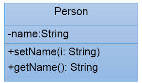

# day10授课笔记

讲师：宋红康

***

## 一、复习

- **面向对象创建类并执行操作的流程：**
  - **创建类（设计类的属性、方法）**
  - 创建对象
  - “对象.属性” 或“对象.方法”

- 方法，是类中结构的重点！！
  - 方法声明的各个结构：权限修饰符、**返回值类型**、方法名、**形参列表**、方法体
    - 其他的修饰符：static、final、native、abstract等
  - 方法的重载（overload）
  - jdk5.0新特性：可变形参的方法
  - 重点、难点：方法的参数传递机制：值传递
  - 难点：递归方法

- return的使用

- 面向对象的特征一：封装性

  - 体现一：私有化（private）类的属性，并提供公共（public）的get()和set()方法

    - Person p1 = new Person();  p1.name = "Tom";  sysout(p1.name);

    ```java
    class Account{
        private double balance;//余额
        
        public double getBalance(){
            return balance;
        }
        
        //存钱
        public void desposit(double amt){
            if(amt > 0){
                 balance += amt;
            }
        }
        //取钱
        public void withdraw(double amt){
            if(balance >= amt){
                balance -= amt;
            }else{
                System.out.println("余额不足，取款失败");
            }
        }
        
    }
    ```

  - 体现二：私有化类的方法

    举例1：

    ```java
    public class Utility {
        private static Scanner scanner = new Scanner(System.in);
        /**
    	用于界面菜单的选择。该方法读取键盘，如果用户键入’1’-’4’中的任意字符，则方法返回。返回值为用户键入字符。
    	*/
    	public static char readMenuSelection() {
            char c;
            for (; ; ) {
                String str = readKeyBoard(1);
                c = str.charAt(0);
                if (c != '1' && c != '2' && c != '3' && c != '4') {
                    System.out.print("选择错误，请重新输入：");
                } else break;
            }
            return c;
        }
    	/**
    	用于收入和支出金额的输入。该方法从键盘读取一个不超过4位长度的整数，并将其作为方法的返回值。
    	*/
        public static int readNumber() {
            int n;
            for (; ; ) {
                String str = readKeyBoard(4);
                try {
                    n = Integer.parseInt(str);
                    break;
                } catch (NumberFormatException e) {
                    System.out.print("数字输入错误，请重新输入：");
                }
            }
            return n;
        }
    	/**
    	用于收入和支出说明的输入。该方法从键盘读取一个不超过8位长度的字符串，并将其作为方法的返回值。
    	*/
        public static String readString() {
            String str = readKeyBoard(8);
            return str;
        }
    	
    	/**
    	用于确认选择的输入。该方法从键盘读取‘Y’或’N’，并将其作为方法的返回值。
    	*/
        public static char readConfirmSelection() {
            char c;
            for (; ; ) {
                String str = readKeyBoard(1).toUpperCase();
                c = str.charAt(0);
                if (c == 'Y' || c == 'N') {
                    break;
                } else {
                    System.out.print("选择错误，请重新输入：");
                }
            }
            return c;
        }
    	
    	//从键盘读取数据
        private static String readKeyBoard(int limit) {
            
        }
    }
    ```

    举例2：

    ```java
    class ArrayUtil{
        public void sort(int[] arr,String desc) {
    		
    		if("ascend".equals(desc)){//if(desc.equals("ascend")){
    			for (int i = 0; i < arr.length - 1; i++) {
    				for (int j = 0; j < arr.length - 1 - i; j++) {
    					if (arr[j] > arr[j + 1]) {
    						swap(arr,j,j+1);
    					}
    				}
    			}
    		}else if ("descend".equals(desc)){
    			for (int i = 0; i < arr.length - 1; i++) {
    				for (int j = 0; j < arr.length - 1 - i; j++) {
    					if (arr[j] < arr[j + 1]) {
    						swap(arr,j,j+1);
    					}
    				}
    			}
    		}else{
    			System.out.println("您输入的排序方式有误！");
    		}
    	}
    	
    	private void swap(int[] arr,int i,int j){
    		int temp = arr[i];
    		arr[i] = arr[j];
    		arr[j] = temp;
    	}
    }
    ```

  - 封装性通过4种权限修饰符体现的！

    - private < 缺省 < protected < public

## 二、作业题

练习1：

```
创建程序,在其中定义两个类：Person和PersonTest类。定义如下：
用setAge()设置人的合法年龄(0~130)，用getAge()返回人的年龄。在PersonTest类中实例化Person类的对象b，调用setAge()和getAge()方法，体会Java的封装性。

说明： -：表示private
       +：表示public

```


```java
import java.util.Scanner;
class Person{
	private int age;
	
	public void setAge(int i) {
		if(i > 0 && i < 130) {
			age = i;
		}
		else {
			System.out.println("请输入（0-130）之内的年龄");
			Scanner s = new Scanner(System.in);
			int j;
			
			while((j = s.nextInt()) <= 0 || j >= 130) {
				System.out.println("请输入（0-130）之内的年龄");
			}
			age = j;
				
			
		}
			
	}
	public int getAge() {
		return age;
	}
}


public class PersonTest {
	public static void main(String args[]) {
		Person p = new Person();
		p.setAge(23);
		System.out.println("age is "+p.getAge());
	}
}
```

练习2：

```
package com.atguigu.test05;

public class Test01 {
	public static void main(String[] args) {
		Other o = new Other();
		new Test01().addOne(o);
		System.out.println(o.i);//1
	}
	
	public void addOne(Other o){
		o.i++;
	}
}
class Other{
	public int i;
}

```


## 三、经典例题

```
编写Test03类，在main方法中，
	（1）创建一个Rectangle[]数组，长度为5
	（2）并创建5个Rectangle的矩形对象，放到数组中，矩形的长和宽随机生成[1,10.0)范围内的值
	（3）遍历显示
	（4）按照面积从小到大排序
	（5）再次遍历显示

```

- 矩形类

  ```java
  public class Rectangle {//矩形
  
  	private double length;//长度
  	private double width;//宽度
  	
  	
  	//通过公共的get()和set()来获取、设置属性的值
  	public void setLength(double l){
  		length = l;
  	}
  	public double getLength(){
  		return length;
  	}
  	
  	public void setWidth(double w){
  		width = w;
  	}
  	public double getWidth(){
  		return width;
  	}
  	
  	/**
  	 * 
  	 * @Description 返回矩形的面积
  	 * @author shkstart
  	 * @date 2020年2月26日上午11:03:34
  	 * @return
  	 */
  	public double findArea(){
  		return length * width;
  	}
  	
  	/**
  	 * 
  	 * @Description 输出矩形的长度和宽度
  	 * @author shkstart
  	 * @date 2020年2月26日上午11:03:26
  	 */
  	public void printRectangle(){
  		System.out.println("长度为：" + length + ",宽度为：" + getWidth());
  	}
  	
  	//返回矩形的周长：略
  }
  ```

- 矩形的工具类

  ```java
  /**
   * 
   * @Description 封装关于矩形Rectangle的常用操作
   * @author shkstart Email:shkstart@126.com
   * @version
   * @date 2020年2月26日上午10:47:10
   *
   */
  public class RectangleUtil {
  
  	// 遍历矩形数组元素
  	public void print(Rectangle[] arr) {
  		// 遍历数组元素
  		for (int i = 0; i < arr.length; i++) {
  //			System.out.println("矩形" + (i + 1) + "的长度为：" + arr[i].getLength() + ",宽度为：" + arr[i].getWidth());
  			arr[i].printRectangle();
  			System.out.println(arr[i].findArea());
  		}
  	}
  
  	/**
  	 * 
  	 * @Description 排序矩形数组元素,指明排序的方式
  	 * @author shkstart
  	 * @date 2020年2月26日上午10:52:55
  	 * @param arr
  	 * @param sortMethod
  	 */
  	public void sort(Rectangle[] arr, String sortMethod) {
  		if ("ascend".equals(sortMethod)) { //sortMethod.equals("ascend")
  			for (int i = 0; i < arr.length - 1; i++) {
  				for (int j = 0; j < arr.length - 1 - i; j++) {
  					double area1 = arr[j].findArea();
  					double area2 = arr[j + 1].findArea();
  					if (area1 > area2) {
  //						Rectangle temp = arr[j];
  //						arr[j] = arr[j + 1];
  //						arr[j + 1] = temp;
  						
  						swap(arr,j,j+1);
  					}
  				}
  			}
  
  		} else if ("descend".equals(sortMethod)) {
  			for (int i = 0; i < arr.length - 1; i++) {
  				for (int j = 0; j < arr.length - 1 - i; j++) {
  					double area1 = arr[j].findArea();
  					double area2 = arr[j + 1].findArea();
  					if (area1 < area2) {
  //						Rectangle temp = arr[j];
  //						arr[j] = arr[j + 1];
  //						arr[j + 1] = temp;
  						
  						swap(arr,j,j+1);
  						
  					}
  				}
  			}
  
  		} else {
  			System.out.println("排序方式有误，重新输入");
  		}
  	}
  	
  	/**
  	 * 
  	 * @Description 交换Rectangle数组中i和j索引位置上的元素
  	 * @author shkstart
  	 * @date 2020年2月26日上午10:59:21
  	 * @param arr
  	 * @param i
  	 * @param j
  	 */
  	private void swap(Rectangle[] arr,int i,int j){
  		Rectangle temp = arr[i];
  		arr[i] = arr[j];
  		arr[j] = temp;
  	}
  	
  
  	/**
  	 * 
  	 * @Description 排序矩形数组元素,默认从低到高排序
  	 * @author shkstart
  	 * @date 2020年2月26日上午10:53:22
  	 * @param arr
  	 */
  	public void sort(Rectangle[] arr) {
  		//方式一：
  //		for (int i = 0; i < arr.length - 1; i++) {
  //			for (int j = 0; j < arr.length - 1 - i; j++) {
  //				double area1 = arr[j].findArea();
  //				double area2 = arr[j + 1].findArea();
  //				if (area1 > area2) {
  //					Rectangle temp = arr[j];
  //					arr[j] = arr[j + 1];
  //					arr[j + 1] = temp;
  //				}
  //			}
  //		}
  		
  		//方式二：
  		sort(arr,"ascend");
  
  	}
  
  }
  ```

- 矩形的测试类：

  ```java
  /*
   * 编写RectangleTest类，在main方法中，
  	（1）创建一个Rectangle[]数组，长度为5
  	（2）并创建5个Rectangle的矩形对象，放到数组中，矩形的长和宽随机生成[1,10.0)范围内的值
  	（3）遍历显示
  	（4）按照面积从小到大排序
  	（5）再次遍历显示
   */
  public class RectangleTest {
  	public static void main(String[] args) {
  		// 联想：String[] arr = new String[5];
  		// Student[] arr = new Student[5];
  		// 创建一个Rectangle[]数组，长度为5
  		Rectangle[] arr = new Rectangle[5];
  
  		// 创建5个Rectangle的矩形对象，放到数组中
  		for (int i = 0; i < arr.length; i++) {
  			arr[i] = new Rectangle();
  
  			// 矩形的长和宽随机生成[1,10.0)范围内的值
  			double randomValue1 = Math.random() * 9 + 1;// [0,1.0) -->[0,9.0)
  			double randomValue2 = Math.random() * 9 + 1;
  
  			double max = (randomValue1 >= randomValue2) ? randomValue1 : randomValue2;
  			double min = (randomValue1 < randomValue2) ? randomValue1 : randomValue2;
  			arr[i].setLength(max);
  			arr[i].setWidth(min);
  
  		}
  
  		// 遍历数组元素
  		RectangleUtil util = new RectangleUtil();
  		util.print(arr);
  
  		// 排序数组元素
  //		util.sort(arr,"descend");
  		util.sort(arr);
  
  		System.out.println();
  
  		// 遍历数组元素
  		util.print(arr);
  		
  	}
  }
  ```

- 内存解析


## 四、体会权限修饰符


在com.atguigu.java1包下：

```java
//体会不同的权限修饰符的作用

//在同一个包下，不允许创建同名的类。
//在不同的包下，可以声明同名的类。
public class Order {

	private int orderPrivate;
	int orderDefault;
	public int orderPublic;
	
	private void methodPrivate(){
		orderPrivate = 1;
		orderDefault = 2;
		orderPublic = 3;
	}
	
	void methodDefault(){
		orderPrivate = 1;
		orderDefault = 2;
		orderPublic = 3;
		
		methodPrivate();
	}
	
	public void methodPublic(){
		orderPrivate = 1;
		orderDefault = 2;
		orderPublic = 3;
		
		methodPrivate();
	}
}
```

在com.atguigu.java1包下：

```java
public class OrderTest {
	public static void main(String[] args) {
		
		Order order = new Order();
		
		//The method methodPrivate() from the type Order is not visible
//		order.methodPrivate();
		order.methodDefault();
		order.methodPublic();
		
		order.orderDefault = 1;
		order.orderPublic = 2;
//		order.orderPrivate = 3;//The field Order.orderPrivate is not visible
		
	}
}
```

在com.atguigu.java2包下：

```java
public class OrderTest {
	public static void main(String[] args) {
		
		Order order = new Order();
		
		//The method methodPrivate() from the type Order is not visible
//		order.methodPrivate();
//		order.methodDefault();
		order.methodPublic();
		
		//The field Order.orderPrivate is not visible
//		order.orderDefault = 1;
//		order.orderPrivate = 3;
		
		order.orderPublic = 2;
	}
}
```

## 五、类的成员三：构造器

```
类的成员之三：构造器的使用
 * 
 * 1. 构造器，或构造方法、constructor
 * 		
 * 		construct:v建设、建造
 * 		construction：n.    CCB   ABC  ICBC
 * 		constructor：n. 建设者、建造者
 * 
 * 2. 构造器的作用：① 用来创建对象  ② 初始化对象的属性信息
 * 
 * 3. 构造器使用说明：
 *   ① 当我们没有显式的声明类中的构造器时，系统会默认提供一个无参的构造器
 *   ② 构造器声明的格式：权限修饰符  类名(形参列表){}
 *   ③ 当我们显式的定义类的构造器以后，系统就不再提供默认的无参的构造器了
 *   ④ 在类中，至少会存在一个构造器
 *   ⑤ 一个类的多个构造器之间也构成了重载。
```

```java
public class PersonTest {
	public static void main(String[] args) {
		//数据类型  变量名 = new + 构造器
		Person p1 = new Person();
		
		p1.name = "Tom";
		p1.age = 10;
		
		p1.eat();
		p1.showInfo();
		
		//
		Person p2 = new Person("黄刚",23);
		p2.showInfo();
		
	}
}
class Person{
	//属性
	String name;
	int age;
	//构造器
	public Person(){
		System.out.println("山川异域，风月同天");
	}
	
	public Person(String n){
		name = n;
	}
	
	public Person(int a){
		age = a;
	}
	
	public Person(String n,int a){
		name = n;
		age = a;
	}
	
	//方法
	public void eat(){
		System.out.println("吃饭");
	}
	
	public void showInfo(){
		System.out.println("name : " + name + ",age : " + age);
	}
	
}
```

### 练习

练习1：提供Rectangle类的多个重载的构造器

```java
public class Rectangle {//矩形

	private double length;//长度
	private double width;//宽度
	
	//提供类的多个构造器
	public Rectangle(double l,double w){
		length = l;
		width = w;
	}
	
	public Rectangle(){
		
	}
	//通过公共的get()和set()来获取、设置属性的值
	public void setLength(double l){
		length = l;
	}
	public double getLength(){
		return length;
	}
	
	public void setWidth(double w){
		width = w;
	}
	public double getWidth(){
		return width;
	}
	
	/**
	 * 
	 * @Description 返回矩形的面积
	 * @author shkstart
	 * @date 2020年2月26日上午11:03:34
	 * @return
	 */
	public double findArea(){
		return length * width;
	}
	
	/**
	 * 
	 * @Description 输出矩形的长度和宽度
	 * @author shkstart
	 * @date 2020年2月26日上午11:03:26
	 */
	public void printRectangle(){
		System.out.println("长度为：" + length + ",宽度为：" + getWidth());
	}
	
	//返回矩形的周长：略
}
```

练习2：

```
1. 在前面定义的Person类中添加构造器，利用构造器设置所有人的age属性初始值都为18。

2. 修改上题中类和构造器，增加name属性,使得每次创建Person对象的同时初始化对象的age属性值和name属性值。
```




```
3.编写两个类，TriAngle和TriAngleTest，其中TriAngle类中声明私有的底边长base和高height，同时声明公共方法访问私有变量。此外，提供类必要的构造器。另一个类中使用这些公共方法，计算三角形的面积。

```


练习3：

```
(1)定义Student类,有4个属性：
    String name; 
    int age; 
    String school;  
    String major;
(2)定义Student类的3个构造器:
第一个构造器Student(String n, int a)设置类的name和age属性；
第二个构造器Student(String n, int a, String s)设置类的name, age 和school属性；
第三个构造器Student(String n, int a, String s, String m)设置类的name, age ,school和major属性；
(3)在main方法中分别调用不同的构造器创建的对象，并输出其属性值。

```

## 六、总结

### 1. 属性赋值

```
 * 1. 在类的属性中，可以有哪些位置给属性赋值？
 * 
 * ① 默认初始化
 * ② 显式初始化
 * ③ 构造器中初始化
 * ④ 通过"对象.属性"或"对象.方法"的方式，给属性赋值
 * 
 * 2.这些位置执行的先后顺序是怎样？
 *  ① - ② - ③ - ④
 * 
 * 3.说明：上述中的①、②、③在对象创建过程中，只执行一次。
 *    ④ 是在对象创建后执行的，可以根据需求多次执行。
```

```java
public class UserTest {
	public static void main(String[] args) {
		User user = new User();
		
		System.out.println(user.name);
		System.out.println(user.age);
		
		User u1 = new User(2);
		System.out.println(u1.age);//2
		
		u1.age = 4;
		u1.age = 8;
		System.out.println(u1.age);//4
	}
}

class User{
	
	String name;
	int age = 1;
	
	public User(){
//		name = "Tom";
	}
	
	public User(int a){
		age = a;
	}
	public User(String n){
		name = n;
	}
	
}
```

### 2. JavaBean

```
所谓javaBean，是指符合如下标准的Java类：
	> 类是公共的
	> 有一个无参的公共的构造器
	> 有属性，且有对应的get、set方法

```

```java
public class Account{//保证此类可以在整个项目中被访问
    private double balance;//余额
    public Account(){
        
    }
    public void setBalance(double b){
        balance = b;
    }
    public double getBalance(){
        return balance;
    }
    
    //定义其他的方法
}
```

```
用户可以使用JavaBean将功能、处理、值、数据库访问和其他任何可以用Java代码创造的对象进行打包，并且其他的开发者可以通过内部的JSP页面、Servlet、其他JavaBean、applet程序或者应用来使用这些对象。用户可以认为JavaBean提供了一种随时随地的复制和粘贴的功能，而不用关心任何改变。
```

### 3. UML类图


- 码农
- 程序员
- 软件开发工程师  -   项目经理

## 七：this关键字

### this调用属性、方法

```
一、背景：
 * 当属性和局部变量名字相同时，如何在方法内或构造器内区分属性和局部变量呢？
 * 
 * 二、this:理解为当前对象或当前正在创建的对象
 * 
 * 三、使用this可以在方法内、构造器内修饰、调用：属性、方法：
 * 
 * 1. 在方法内部，为了区分属性和局部变量，我们使用this来修饰此同名的变量，表示此变量是属性，而非局部变量。
 *    this，表示的就是调用当前方法的对象。
 *    比如：p1.setName("Tom"),此时setName()中的this就表示p1.
 * 
 * 2. 在构造器内部，为了区分属性和局部变量，我们使用this来修饰此同名的变量，表示此变量是属性，而非局部变量。
 *    this，表示的就是调用当前方法的正在创建的对象。
```


### this调用构造器

```
四、使用this修饰： 构造器
 * 	1. 在类的构造器中，可以使用"this(形参列表)"的方式，调用本类中重载的其它构造器
 *  2. 如果一个类中有n个构造器，则最多有 n - 1个构造器中使用了"this(形参列表)"
 *  3. 要求："this(形参列表)"的声明必须写在构造器的首行。
 *  4. 一个构造器中，最多只能声明一个"this(形参列表)"
```

### 代码演示：

```java
public class PersonTest {
	public static void main(String[] args) {
		Person p1 = new Person("Tom",12);
		
		p1.setName("Jerry");
		p1.setAge(32);
		
		p1.show();
		
		Person p2 = new Person();
		p2.setAge(12);
		
		p2.eat();
	}
}

class Person{
	
	private String name;
	private int age;
	
	public Person(){
		//创建Person对象，共性的代码（100行）
//		this("Tom");
		
		System.out.println("========Person()=========");
	}
	
	public Person(String n){
		this();//调用当前类中指定的构造器
		name = n;
	}
	
	public Person(String name,int age){

		this();//调用当前类中指定的构造器
		
		//当属性和局部变量名字相同时，如何在构造器内区分属性和局部变量呢？
		this.name = name;
		this.age = age;
	}
	
	public void show(){
		System.out.println("name :" + name + ", age :" + age);
	}
	
	public void setName(String name){
		//当属性和局部变量名字相同时，如何在方法内区分属性和局部变量呢？
		this.name = name;
	}
	
	public void setAge(int age){
		this.age = age;
	}
	
	public void eat(){
		System.out.println("吃饭");
		//this.可以省略
		this.sleep();
	}
	
	public void sleep(){
		System.out.println("睡觉");
	}
	
}
```

## 八、package

```
 *   1. 为了方便对工程中的多个类进行管理，声明了包的概念。将相类似功能的类就声明在相同的包内。
 *   2. 在java工程中，每个java类所在的文件的首行，都需要指明当前类所属的包。
 *   3. 包名，标识符的一种，满足标识符命名的规则、规范、"见名知意"。 xxxyyyzzz
 *   4. 举例：com.atguigu.java此包名中，每"."一次，代表一层文件目录
```


## 九、import

```
 *   1. 在java程序中使用import关键字显式的导入指定包下的结构：类、接口。
 *   2. import 导入操作声明在包声明和类声明之间。
 *   3. 如果有多个import导入，则并列声明即可。
 *   4. 我们可以使用aaa.*的方式，表示导入aaa包下的所有结构：类、接口。
 *   5. 如果使用的类或接口来自于java.lang包下，则可以省略导入.
 *   6. 如果使用的类或接口来自于当前代码所在的包，则可以省略导入.
 *   7. 如果在一个程序中调用了不同包下的同名的类，则至少有一个类要使用全类名的方式调用。
```

```java
public class PackageImportTest {
	public static void main(String[] args) {
		Scanner scan = new Scanner(System.in);
		
		ArrayList list = new ArrayList();
		
		HashMap map = new HashMap();
		
		String s = "helloworld";
		System.out.println(s);
		
		Person p = new Person();
		
		UserTest test = new UserTest();
		
		com.atguigu.java2.Person p1 = new com.atguigu.java2.Person();
		
		
	}

}
```

