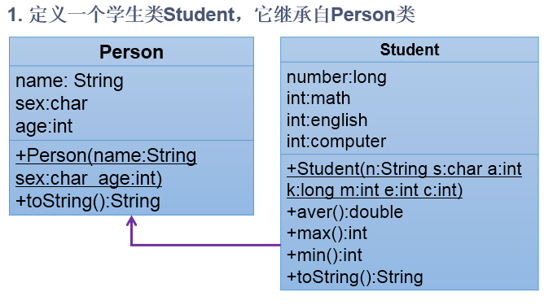

# day11授课笔记

讲师：宋红康

***

## 作业：

练习1：

```
编写两个类，TriAngle和TriAngleTest，其中TriAngle类中声明私有的底边长base和高height，同时声明公共方法访问私有变量。此外，提供类必要的构造器。另一个类中使用这些公共方法，计算三角形的面积。
```

```java
/*
 * 其中TriAngle类中声明私有的底边长base和高height，同时声明公共方法访问私有变量。此外，提供类必要的构造器。
 */
public class TriAngle {
	
	private double base;//底边长
	private double height;//高
	
	public double getBase() {
		return base;
	}
	public void setBase(double base) {
		this.base = base;
	}
	public double getHeight() {
		return height;
	}
	public void setHeight(double height) {
		this.height = height;
	}
	public TriAngle() {
		
	}
	public TriAngle(double base, double height) {
		this.base = base;
		this.height = height;
	}
	public TriAngle(double base) {
		this.base = base;
	}
	
	//返回三角形的面积
	public double findArea(){
//		return base * height / 2;
		return getBase() * getHeight() / 2;
	}
	
}
```

```java
/*
 * 编写两个类，TriAngle和TriAngleTest，
 * 
 * 另一个类中使用这些公共方法，计算三角形的面积。
 */
public class TriAngleTest {  //angle：角     angel:天使
	public static void main(String[] args) {
		
		TriAngle t1 = new TriAngle();
		
		t1.setBase(2.3);
		t1.setHeight(3.4);
		
		double area1 = t1.findArea();
		System.out.println("三角形1的面积为：" + area1);
		
		TriAngle t2 = new TriAngle(4.5, 3.2);
		System.out.println("三角形2的面积为：" + t2.findArea());
	}
}
```

练习2：

题目见《第4章：面向对象（上）》课后实验1：


```java
/**
 * @description:
 * @author: WuzongXian
 * @version: V1.0
 * @create:2020-02-26-18:46
 */
public class Account {
    private int id;//账号
    private double balance;//余额
    private double annualInterestRate;//年利率

    public Account(int id, double balance, double annualInterestRate){
        this.id = id;
        this.balance = balance;
        this.annualInterestRate = annualInterestRate;
    }

    public int getId() {
        return id;
    }

    public void setId(int id) {
        this.id = id;
    }

    public double getBalance() {
        return balance;
    }

    public void setBalance(double balance) {
        this.balance = balance;
    }

    public double getAnnualInterestRate() {
        return annualInterestRate;
    }

    public void setAnnualInterestRate(double annualInterestRate) {
        this.annualInterestRate = annualInterestRate;
    }
    /**
     * 
     * @Description 取钱操作
     * @author shkstart
     * @date 2020年2月28日上午9:39:11
     * @param amount  待取的钱数
     */
    public void withdraw(double amount){
        if (balance >= amount){
            balance -= amount;
            System.out.println("成功取出：" + amount);
        }else{
            System.out.println("余额不足，取款失败！");
        }

    }
    
    /**
     * 
     * @Description 存钱操作
     * @author shkstart
     * @date 2020年2月28日上午9:40:05
     * @param amount 待存的钱数
     */
    public void deposit(double amount){
    	if(amount > 0){
    		balance += amount;
    		System.out.println("成功存入：" + amount);
    		
    	}else{
    		System.out.println("存入的钱数非法：不能为负数或零");
    	}
    }

}
```

```java
/**
 * @description:
 * @author: WuzongXian
 * @version: V1.0
 * @create:2020-02-26-18:52
 */
public class Customer {
    private String firstName;
    private String lastName;
    private Account account;//账户

    public Customer(String f,String l){
        firstName = f;
        lastName = l;
    }


    public String getFirstName() {
		return firstName;
	}


	public String getLastName() {
        return lastName;
    }

    public Account getAccount() {
        return account;
    }

    public void setAccount(Account acct) {
        this.account = acct;
    }
}
```

```java
/**
 * @description:
 * @author: WuzongXian
 * @version: V1.0
 * @create:2020-02-26-18:58
 */
public class AccountTest {
    public static void main(String[] args) {
        Customer cust = new Customer("Jane","Smith");
        Account acct = new Account(1000, 2000, 0.0123);
        cust.setAccount(acct);

        cust.getAccount().deposit(100);
        cust.getAccount().withdraw(960);
        cust.getAccount().withdraw(2000);

        System.out.println("Cucstomer["+cust.getFirstName()+" "+cust.getLastName() + "has a account: id is "
                + cust.getAccount().getId() + ", annualInterestRate is " + cust.getAccount().getAnnualInterestRate() * 100 + "%, balance is " + cust.getAccount().getBalance());
    }
}
```

练习3：

题目见《第4章：面向对象（上）》课后实验2：


```java
/**
 * 
 * @Description 账户类
 * @author shkstart  Email:shkstart@126.com
 * @version 
 * @date 2020年2月28日上午9:49:46
 *
 */
public class Account {
	
	private double balance;//余额

	public double getBalance() {
		return balance;
	}

	public Account(double init_balance) {
		this.balance = init_balance;
	}
	/**
	 * 
	 * @Description 存钱操作
	 * @author shkstart
	 * @date 2020年2月28日上午9:51:38
	 * @param amt
	 */
	public void deposit(double amt){
		if(amt > 0){
			balance += amt;
			System.out.println("成功存入：" + amt);
		}
	}
	
	public void withdaw(double amt){
		if(balance >= amt){
			balance -= amt;
			System.out.println("成功取出：" + amt);
		}else{
			System.out.println("余额不足，取款失败");
		}
	}
	
}
```

```java
/**
 * 
 * @Description 客户类
 * @author shkstart  Email:shkstart@126.com
 * @version 
 * @date 2020年2月28日上午9:55:22
 *
 */
public class Customer {
	
	private String firstName;
	
	private String lastName;
	
	
	private Account account;//账户


	public Customer(String f, String l) {
		this.firstName = f;
		this.lastName = l;
	}


	public Account getAccount() {
		return account;
	}


	public void setAccount(Account account) {
		this.account = account;
	}


	public String getFirstName() {
		return firstName;
	}


	public String getLastName() {
		return lastName;
	}
	
	
}
```

```java
/**
 * 
 * @Description 银行类
 * @author shkstart  Email:shkstart@126.com
 * @version 
 * @date 2020年2月28日上午9:55:12
 *
 */
public class Bank {
	
	private Customer[] customers ;//保存客户对象的数组
	
	private int numberOfCustomer;//记录银行客户的数量

	public Bank() {
		//初始化数组
		customers = new Customer[10];
	}
	/**
	 * 
	 * @Description 将指定的客户添加到银行customers数组中
	 * @author shkstart
	 * @date 2020年2月28日上午10:00:40
	 * @param f
	 * @param l
	 */
	public void addCustomer(String f,String l){
		//1.创建指定姓名的客户
		Customer cust = new Customer(f, l);
		if(numberOfCustomer < customers.length){
			customers[numberOfCustomer++] = cust;
		}
	}
	/**
	 * 
	 * @Description 返回客户的个数
	 * @author shkstart
	 * @date 2020年2月28日上午10:08:28
	 * @return
	 */
	public int getNumOfCustomers(){
		return numberOfCustomer;
	}
	/**
	 * 
	 * @Description 返回指定索引位置上的客户
	 * @author shkstart
	 * @date 2020年2月28日上午10:08:46
	 * @param index
	 * @return
	 */
	public Customer getCustomer(int index){
		if(index < 0 || index >= numberOfCustomer){
			System.out.println("输入的位置非法");
			return null;
//			throw new RuntimeException("输入的位置非法");
		}else{
			return customers[index];
		}
	}
	
	
}
```

```java
//创建BankTest类，进行测试。
public class BankTest {
	public static void main(String[] args) {
		
		Bank bank = new Bank();
		
		bank.addCustomer("世文", "李");
		bank.addCustomer("存希", "董易");
		bank.addCustomer("吹雪", "西门");
		
		//给银行中索引为0的客户的账户进行初始化
		bank.getCustomer(0).setAccount(new Account(10000));
		//给银行中索引为0的客户的账户存钱2000
		bank.getCustomer(0).getAccount().deposit(2000);
		//给银行中索引为0的客户的账户取钱5000
		bank.getCustomer(0).getAccount().withdaw(5000);
		
		
		System.out.println("银行中客户的个数为：" + bank.getNumOfCustomers());
		
		for(int i = 0;i < bank.getNumOfCustomers();i++){
			Customer cust = bank.getCustomer(i);
			System.out.println("firstName:" + cust.getFirstName() + ",lastName:" + cust.getLastName());
		}
		double balance = bank.getCustomer(0).getAccount().getBalance();
		System.out.println("账户余额为：" + balance);
	}
}
```


## 二、复习

- 体会4种不同权限修饰符
- 构造器的使用：类的第3个结构
- 小结：属性赋值的位置以及顺序
- 关键字：this
- 关键字：package 、import

## 三、Eclipse的快捷键的使用

```
Eclipse中的快捷键：
 * 1.补全代码的声明：alt + /
 * 2.快速修复: ctrl + 1  
 * 3.批量导包：ctrl + shift + o
 * 4.使用单行注释：ctrl + /
 * 5.使用多行注释： ctrl + shift + /   
 * 6.取消多行注释：ctrl + shift + \
 * 7.复制指定行的代码：ctrl + alt + down 或 ctrl + alt + up
 * 8.删除指定行的代码：ctrl + d
 * 9.上下移动代码：alt + up  或 alt + down
 * 10.切换到下一行代码空位：shift + enter
 * 11.切换到上一行代码空位：ctrl + shift + enter
 * 12.如何查看源码：ctrl + 选中指定的结构   或  ctrl + shift + t
 * 13.退回到前一个编辑的页面：alt + left 
 * 14.进入到下一个编辑的页面(针对于上面那条来说的)：alt + right
 * 15.光标选中指定的类，查看继承树结构：ctrl + t
 * 16.复制代码： ctrl + c
 * 17.撤销： ctrl + z
 * 18.反撤销： ctrl + y
 * 19.剪切：ctrl + x 
 * 20.粘贴：ctrl + v
 * 21.保存： ctrl + s
 * 22.全选：ctrl + a
 * 23.格式化代码： ctrl + shift + f
 * 24.选中数行，整体往后移动：tab
 * 25.选中数行，整体往前移动：shift + tab
 * 26.在当前类中，显示类结构，并支持搜索指定的方法、属性等：ctrl + o
 * 27.批量修改指定的变量名、方法名、类名等：alt + shift + r
 * 28.选中的结构的大小写的切换：变成大写： ctrl + shift + x
 * 29.选中的结构的大小写的切换：变成小写：ctrl + shift + y
 * 30.调出生成getter/setter/构造器等结构： alt + shift + s
 * 31.显示当前选择资源(工程 or 文件)的属性：alt + enter
 * 32.快速查找：参照选中的Word快速定位到下一个 ：ctrl + k
 * 
 * 33.关闭当前窗口：ctrl + w
 * 34.关闭所有的窗口：ctrl + shift + w
 * 35.查看指定的结构使用过的地方：ctrl + alt + g
 * 36.查找与替换：ctrl + f
 * 37.最大化当前的View：ctrl + m
 * 38.直接定位到当前行的首位：home
 * 39.直接定位到当前行的末位：end
```

## 四、面向对象的特征二：继承性

### 1. 说明

```
 * 一、继承性的好处？
 * 继承的出现减少了代码冗余，提高了代码的复用性。
 * 继承的出现，更有利于功能的扩展。
 * 继承的出现让类与类之间产生了关系，提供了多态的前提。
 * 
 * 二、继承的格式：  class A extends B
 *    其中：类A: 子类、SubClass
 *        类B: 父类、SuperClass、超类、基类
 * 
 * 三、说明
 *   1. 子类在继承父类以后，就获取了父类中声明的属性、方法。
 *   	>对于父类中声明为private的结构，在子类继承父类以后，是可以获取到了的，只是由于封装性的影响，我们在子类中不可以直接调用。
 *   2. 此外，子类还可以在父类的基础上，定义自己额外的属性或方法。
 *   	此时的子类、父类的关系不同于子集与集合的关系。extends：扩展、延展
 *   
 * 四、注意点：
 * 	 1. 开发中，不能为了继承而继承。需要满足实际中的包含关系
 *   2. java中规定，类与类之间只能是单继承的。反之，一个父类可以声明多个子类
 *   3. 子类父类是相对的概念
 *   4. 明确：直接父类与间接父类的概念
 *   5. 继承以后，子类除了能获取直接父类中的结构之外，还可以获取所有的间接父类中的结构。
```

### 2. 理解


### 3. 代码

```java
public class Creature {//生物
	
	public void breath(){
		System.out.println("呼吸");
	}

}
```

```java
public class Person extends Creature{

	String name;
	private int age;
	
	public Person(){
		
	}

	public Person(String name, int age) {
		this.name = name;
		this.age = age;
	}
	
	public void eat(){
		System.out.println("吃饭");
	}
	
	public void walk(){
		System.out.println("走路");
	}
	
	public void show(){
		System.out.println("name : " + name +", age : " + age);
		info();
	}

	public int getAge() {
		return age;
	}

	public void setAge(int age) {
		this.age = age;
	}
	
	private void info(){
		System.out.println("我是一个快乐的人");
	}
	
}
```

```java
public class Student extends Person{
    //不需要再声明
//	String name;
//	int age;
	String major;//专业
	
	public Student(){
		
	}

	public Student(String name, int age) {
		this.name = name;
//		this.age = age;
		setAge(age);
	}

	public Student(String name, int age, String major) {
		this.name = name;
//		this.age = age;
		setAge(age);
		this.major = major;
	}
	//不需要再声明
//	public void eat(){
//		System.out.println("吃饭");
//	}
//	
//	public void walk(){
//		System.out.println("走路");
//	}
	
	public void study(){
		System.out.println("好好学习！天天向上");//good good study,day day up!
	}
	
}
```

测试类：

```java
public class ExtendsTest {
	public static void main(String[] args) {
		
		Student s = new Student();
        //直接调用父类Person中的属性
		s.name = "陈丹华";
//		s.age = 21;
		//替换为：
		s.setAge(21);
		s.major = "计算机科学与技术";
		
		s.study();
		//如下的方法，调动的就是父类中声明的方法
		s.eat();
		s.walk();
        s.show();
		s.breath();
		
	}
}
```

### 4. 练习

练习1：



练习2：

```
(1)定义一个ManKind类，包括
成员变量int sex和int salary；
方法void manOrWoman()：根据sex的值显示“man”(sex==1)或者“woman”(sex==0)；
方法void employeed()：根据salary的值显示“no job”(salary==0)或者“ job”(salary!=0)。
(2)定义类Kids继承ManKind，并包括
成员变量int yearsOld；
方法printAge()打印yearsOld的值。
(3)定义类KidsTest，在类的main方法中实例化Kids的对象someKid，用该对象访问其父类的成员变量及方法。

```

答案：

```java
public class ManKind {
	private int sex;
	private int salary;
	
	public void manOrWoman(){
		if(sex == 1){
			System.out.println("man");
		}else if(sex == 0){
			System.out.println("woman");
		}
	}
	
	public void employeed(){
		if(salary == 0){
			System.out.println("no job");
		}else{
			System.out.println("job");
		}
	}
	
	public int getSex() {
		return sex;
	}
	public void setSex(int sex) {
		this.sex = sex;
	}
	public int getSalary() {
		return salary;
	}
	public void setSalary(int salary) {
		this.salary = salary;
	}
	
	
}
```

```java
public class Kids extends ManKind{
	
	private int yearsOld;
	
	public void printAge(){
		System.out.println("I am " + yearsOld + " years old.");
	}

	public int getYearsOld() {
		return yearsOld;
	}

	public void setYearsOld(int yearsOld) {
		this.yearsOld = yearsOld;
	}
	
	

}
```

```java
public class KidsTest {

	public static void main(String[] args) {
		
		Kids someKid = new Kids();
		
		someKid.setSalary(0);
		someKid.setSex(1);
		someKid.setYearsOld(12);
		
		
		someKid.manOrWoman();
		someKid.employeed();
		someKid.printAge();
	}
}
```

练习3：

```
根据下图实现类。在CylinderTest类中创建Cylinder类的对象，设置圆柱的底面半径和高，并输出圆柱的体积。

```


答案：

```java
public class Circle {//圆
	private double radius;
	
	public Circle(){
		this.radius = 1;
	}
	
	public void setRadius(double radius){
		this.radius = radius;
	}
	public double getRadius(){
		return radius;
	}
	
	//返回圆的面积
	public double findArea(){
		double area = 3.14 * radius*radius;
		return area;
	}
}
```

```java
public class Cylinder extends Circle {

	private double length;// 高

	public Cylinder() {
		length = 1;
	}

	public void setLength(double length) {
		this.length = length;
	}

	public double getLength() {
		return length;
	}

	// 返回圆柱的体积
	public double findVolume() {
		// return findArea()*length;
		return 3.14 * getRadius() *  getRadius() * length;
	}

}
```

```java
public class CircleTest {
	public static void main(String[] args) {
		
	
	Cylinder c = new Cylinder();
	c.setRadius(2);
	c.setLength(2);
	System.out.println("底面圆的面积为："+c.findArea());
	System.out.println("体积为："+c.findVolume());
	
	}
}

```


## 五、方法的重写(override、overwrite)

```java
1.回忆：方法的重载(overload)  “两同一不同” ； 方法和构造器都可以重载。
 * 
 * 2. 方法的重写：子类在继承父类以后，可以对父类中同名同参数的方法进行覆盖、复写。此过程就称为方法的重写。
 * 
 *  比如：
 *  class Account{//账户
 *  	double balance;
 *  	public void withdraw(double amt){}  //被重写的方法
 *  }
 *  
 *  class CheckingAccount extends Account{//信用卡账户
 *  	double money = 20000;//可透支额度
 *  
 *  	public void withdraw(double amt){  //重写父类的方法
 *  		//先从balance中扣减；balance如果不足，再从money中扣减
 *  	}
 *  }
 * 
 * 
 * 3. 方法的重写的规则
 * 	    复习： 方法的声明
 * 		权限修饰符   返回值类型  方法名(形参列表){//方法体}
 * 
 * 	  ① 子类重写父类的方法与父类被重写的方法的"方法名"和"形参列表"必须相同
 *    ② 子类重写父类的方法 的权限修饰符 不小于 父类中被重写的方法的权限修饰符
 *    	 特别的：子类不能重写父类中声明为private的方法。
 *    ③ > 如果父类中的方法返回值类型为：void,则子类重写的方法的返回值类型也必须为void
 *      > 如果父类中的方法返回值类型为：基本数据类型，则子类重写的方法的返回值类型也必须为相同的基本数据类型
 *      > 如果父类中的方法返回值类型为：引用数据类型，则子类重写的方法的返回值类型与父类被重写的方法的返回值类型相同，或是其子类
 *    ④ 关于抛出异常的要求，放到异常处理章节再讲。  
 *    
 *    ***************************************************
 *    额外的：子父类中同名同参数的方法必须同时为static的，或者同时为非static的（考虑重写）。
 * 	
 * 	    补充：构造器不可以重写
 * 
 
```

```
* 面试题：区分方法的重载与方法的重写？
```

### 练习

修改1：

```
修改继承的练习中定义的类Kids，在Kids中重新定义employeed()方法，覆盖父类ManKind中定义的employeed()方法，输出“Kids should study and no job.”
```

```java
public class Kids extends ManKind{
	
	private int yearsOld;
	
	public void printAge(){
		System.out.println("I am " + yearsOld + " years old.");
	}

	public int getYearsOld() {
		return yearsOld;
	}

	public void setYearsOld(int yearsOld) {
		this.yearsOld = yearsOld;
	}
	
	//方法的重写
	@Override
	public void employeed() {
		System.out.println("Kids should study and no job.");
	}

}
```

修改2：

```
修改继承的练习中Cylinder类重写父类Circle中的findArea()，用于计算圆柱体类的表面积。
```

```java
//修改继承的练习中Cylinder类重写父类Circle中的findArea()，用于计算圆柱体类的表面积。
public class Cylinder extends Circle {

	private double length;// 高

	public Cylinder() {
		length = 1;
	}

	public void setLength(double length) {
		this.length = length;
	}

	public double getLength() {
		return length;
	}

	// 返回圆柱的体积
	public double findVolume() {
		//错误的
//		 return findArea()*length;
		//正确的
		return 3.14 * getRadius() *  getRadius() * length;
	}
	//重写父类中的findArea(),返回圆柱的表面积
	public double findArea(){
		return 3.14 * getRadius() *  getRadius() * 2 + 3.14 * 2 * getRadius() * length;
	}
}
```

## 六、体会4种权限修饰符

略


## 七、super关键字

### 1. super调用属性、方法

```
 * super关键字的使用。  --->this:当前对象、当前正在创建的对象；this(形参列表)
 * 
 * 1. 可以理解为：父类的
 * 2. 可以用来调用：父类的属性、方法、构造器
 * 
 * 3. super调用父类的属性、方法
 *   ① 在子类的方法或构造器中，可以通过super.属性或super.方法的方式，显式的调用父类中声明的属性或方法。
 *   但是一般情况下，我们都选择省略此super关键字。
 *   ② 但是，当子类与父类中出现同名的属性时，必须使用super.属性的方式，表明调用的是父类中同名的属性 （这种情况尽量不要发生）
 *   ③ 当子类中需要调用父类中被重写的方式时，一定要使用super.方法的方式，表明调用的是父类中被重写的方法。
```

```java
public class Person {

	String name;
	int id = 1001;//身份证号
	
	
	public Person(){
	}

	public Person(String name, int age) {
		this.name = name;
		this.age = age;
	}
	
	public void eat(){
		System.out.println("吃饭");
	}
	
	public void walk(){
		System.out.println("走路");
	}
	
}
```

```
public class Student extends Person {
	String major;// 专业
	int id = 1002;//学号

	public Student() {

	}

	public Student(String name, int age) {
		
		this.name = name;
		setAge(age);
	}

	public Student(String name, int age, String major) {
		
		this.name = name;
		setAge(age);
		this.major = major;
	}

	@Override
	public void walk() {
		System.out.println("学生背着书包走路");
	}

	public void study() {
		System.out.println("好好学习！天天向上");// good good study,day day up!
		
//		this.walk();
		super.walk();
		show();
	}

	public void StudentInfo(){
		System.out.println("name = " + this.name);
		System.out.println("id = " + super.id);//1001
		System.out.println("major = " + this.major);
		System.out.println("id = " + this.id);//1002
	}
}
```


### 2. super调用父类构造器

```
4. super调用父类的构造器
 *   ① 我们可以在子类的构造器中使用"super(形参列表)"的方式，显式的调用父类中的指定的构造器。
 *   ② 当我们没有在子类构造器的首行声明"super(形参列表)"或"this(形参列表)"的方式时，默认使用了"super()"的结构。
 *   ③ 如果在子类构造器中使用父类构造器的话，必须将"super(形参列表)"声明在构造器的首行。
 *   ④ 在子类构造器的首行，只能声明super(形参列表)或this(形参列表)，不能同时存在。
 *   ⑤ 一个类中有n个构造器，则至多有n-1个构造器中使用this(形参列表),至少有一个使用了super(形参列表)
 *   
 * 5. 如果一个类没有显示的声明其父类的话，则默认的父类为：java.lang.Object类。  
```

```java
public class Student extends Person {
	String major;// 专业
	int id = 1002;//学号

	public Student() {

	}

	public Student(String name, int age) {
		//super();
		this.name = name;
		setAge(age);
	}

	public Student(String name, int age, String major) {
		super(name,age);
		this.major = major;
	}
}
```

### 课后练习

```
1.修改练习1.2中定义的类Kids中employeed()方法，在该方法中调用父类ManKind的employeed()方法，然后再输出“but Kids should study and no job.”
2.修改练习1.3中定义的Cylinder类，在Cylinder类中覆盖findArea()方法，计算圆柱的表面积。考虑：findVolume方法怎样做相应的修改？
	在CylinderTest类中创建Cylinder类的对象，设置圆柱的底面半径和高，并输出圆柱的表面积和体积。

附加题：在CylinderTest类中创建一个Circle类的对象，设置圆的半径，计算输出圆的面积。体会父类和子类成员的分别调用。

```

