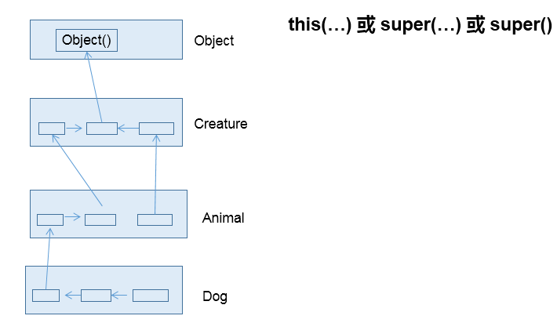
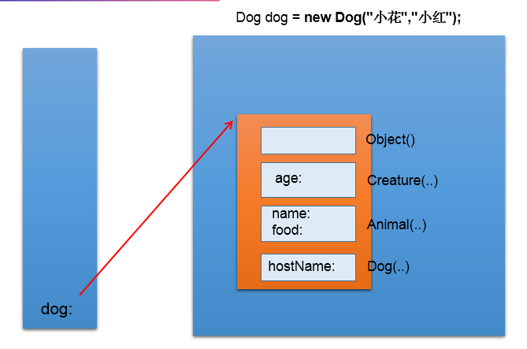
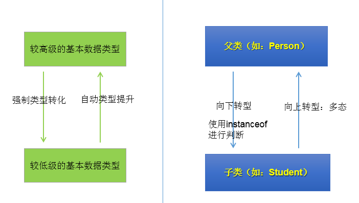
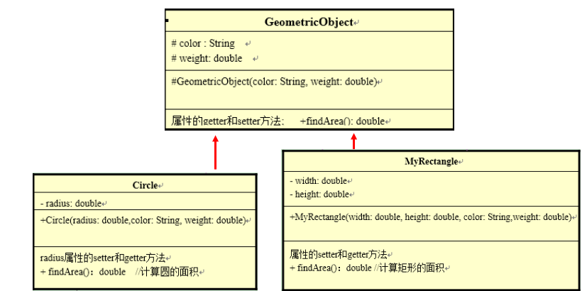
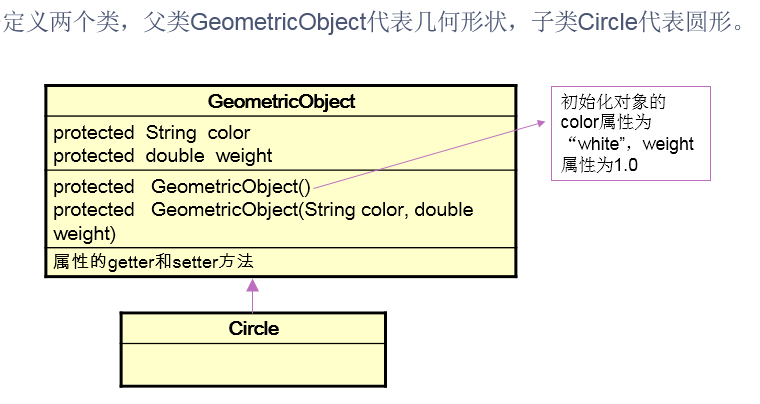
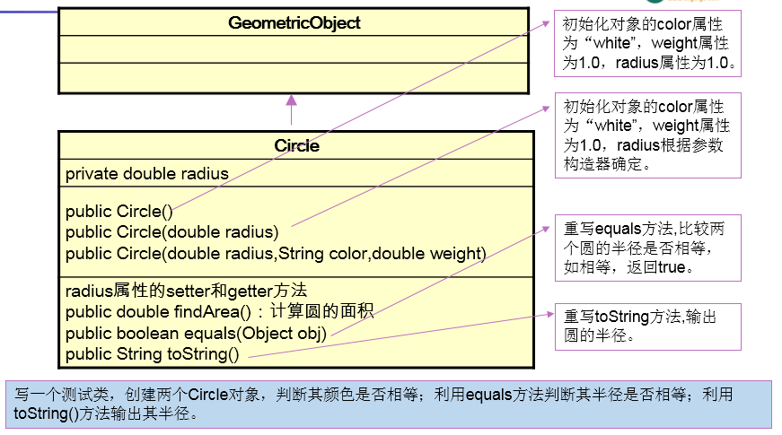

# day12授课笔记

## 一、作业

练习：课件本章中：


```java
/**
 * 
 * @Description 账户类
 * @author shkstart  Email:shkstart@126.com
 * @version 
 * @date 2020年2月29日上午9:36:43
 *
 */
public class Account {
	
	private int id;//账号
	private double balance;//余额
	private double annualInterestRate;//年利率
	
//	public Account(){
//		
//	}
	
	public Account(int id, double balance, double annualInterestRate) {
//		super();
		this.id = id;
		this.balance = balance;
		this.annualInterestRate = annualInterestRate;
	}

	public int getId() {
		return id;
	}

	public void setId(int id) {
		this.id = id;
	}

	public double getBalance() {
		return balance;
	}

//	public void setBalance(double balance) {
//		this.balance = balance;
//	}

	public double getAnnualInterestRate() {
		return annualInterestRate;
	}

	public void setAnnualInterestRate(double annualInterestRate) {
		this.annualInterestRate = annualInterestRate;
	}
	
	/**
	 * 
	 * @Description 获取月利率
	 * @author shkstart
	 * @date 2020年2月29日上午9:35:27
	 * @return
	 */
	public double getMonthlyInterest(){
		return annualInterestRate / 12;
	}
	/**
	 * 
	 * @Description 取款方法
	 * @author lh
	 * @date 2020年2月28日下午8:10:24
	 * @param amount 金额
	 */
	public void withdraw(double amount){
		if (balance >= amount) {
			balance -= amount;
		}else{
			System.out.println("余额不足！");
		}
	}
	/**
	 * 
	 * @Description 存款
	 * @author lh
	 * @date 2020年2月28日下午8:10:48
	 * @param amount
	 */
	public void deposit (double amount){
		if(amount > 0){
			balance += amount;
		}
	}
	
}
```

```java
/*
 * 写一个用户程序测试Account类。在用户程序中，创建一个账号为1122、余额为20000、年利率4.5%的
 * Account对象。使用withdraw方法提款30000元，并打印余额。
        再使用withdraw方法提款2500元，使用deposit方法存款3000元，然后打印余额和月利率。

 */
public class AccountTest {
	
	public static void main(String[] args) {
		
		Account acnt = new Account(1122, 20000, 0.045);
		
		acnt.withdraw(30000);
		System.out.println("您的账户余额为： " + acnt.getBalance());
		
		acnt.withdraw(2500);
		acnt.deposit(3000);
		System.out.println("您的账户余额为： " + acnt.getBalance());
		System.out.println("月利率为： " + acnt.getMonthlyInterest());
		
	}

}
```

```java
public class CheckAccount extends Account{

	private double overdraft;

	public CheckAccount(int id, double balance, double annualInterestRate, double overdraft) {
		super(id, balance, annualInterestRate);
		this.overdraft = overdraft;
	}

	public double getOverdraft() {
		return overdraft;
	}

	public void setOverdraft(double overdraft) {
		this.overdraft = overdraft;
	}
	
	@Override
	public void withdraw(double amount) {
		if (amount <= getBalance()) {
//			setBalance(getBalance() - amount);
			super.withdraw(amount);
		}else{
			if ((amount - getBalance()) <= overdraft) {
				overdraft -= (amount - getBalance());
				super.withdraw(getBalance());
//				setBalance(0);
			}else{
				System.out.println("超过可透支限额!");
			}
		}
	}
}
```

```java
/*
 * 写一个用户程序测试CheckAccount类。在用户程序中，创建一个账号为1122、余额为20000、年利率4.5%，可透支限额为5000元的CheckAccount对象。
使用withdraw方法提款5000元，并打印账户余额和可透支额。
再使用withdraw方法提款18000元，并打印账户余额和可透支额。
再使用withdraw方法提款3000元，并打印账户余额和可透支额。

 */
public class CheckAccountTest {
	
	public static void main(String[] args) {
		
		CheckAccount cekacnt = new CheckAccount(1122, 20000, 0.045, 5000);
		
		cekacnt.withdraw(5000);
		System.out.println("您的账户余额为： " + cekacnt.getBalance());
		System.out.println("您的可透支额： " + cekacnt.getOverdraft());
		System.out.println();
		cekacnt.withdraw(18000);
		System.out.println("您的账户余额为： " + cekacnt.getBalance());
		System.out.println("您的可透支额： " + cekacnt.getOverdraft());
		System.out.println();
		cekacnt.withdraw(3000);
		System.out.println("您的账户余额为： " + cekacnt.getBalance());
		System.out.println("您的可透支额： " + cekacnt.getOverdraft());
		
	}

}
```

## 二、复习

- 面向对象的特征二：继承性
  - 好处
  - 格式：extends
  - 继承的体现
  - 类的继承性的特点：单继承性
- 方法的重写（override\overwrite）
- super关键字的使用

## 三、子类对象实例化的全过程

```
1. 从结果的角度来看：体现为类的继承性。
 *    在创建了子类对象以后，可以获取直接父类以及所有的间接父类中声明的结构：属性、方法。
 *    在权限允许的情况，可以直接进行调用或修改。
 * 
 * 
 * 
 * 在创建子类对象的过程中，一定会调用父类中的构造器吗？yes!
 * 2. 从过程的角度来看：
 *  在通过子类的构造器创建对象时，子类的构造器一定会直接或间接调用到直接父类的构造器，直接父类的构造器也一定会直接或间接的调用其父类的构造器（即：子类的间接的父类），。。。,直到调用了java.lang.Object类的构造器为止。也就是说，在创建子类对象的过程中，一定会加载器所有父类的构造器，进而理解为加载了所有父类的结构。
 * 
 * 
 * 3. 注意：创建子类的对象，一定注意：内存中自始至终就只有一个对象，那就是变量声明的类型的子类对象。
```





## 四、面向对象的特征三：多态性

### 1. 多态性的理解

```
1. 多态性，理解为一个事物的多种形态。
 * 
 * 2. 此时的java中的多态性，可以理解为子类对象的多态性。
 *    
 * 		子类对象的多态性:父类的引用指向子类的对象
```

```java
//子类对象的多态性:父类的引用指向子类的对象
Person p2 = new Man();
```

### 2. 多态性的应用

```
3. 多态性的应用：虚方法(virtual method)调用
	 编译时，引用变量只能调用声明的类型中的结构，在真正调用时，实际执行的是子类重写父类的方法
 *   总结为：编译看左边，运行看右边。
 *  
4. 多态性使用的前提：① 类的继承关系  ② 方法的重写
 *  
 * 注意：多态性，只适用于方法，不适用于属性！
```

```java
		Person p2 = new Man();
		
		//多态性的应用：虚方法(virtual method)调用
		//编译时，引用变量只能调用声明的类型中的结构，在真正调用时，实际执行的是子类重写父类的方法
		p2.eat();
		p2.walk();
//		p2.earnMoney();
		
		System.out.println(p2.id);//1001
```

其中：

```java
public class Person {
	
	String name;
	int age;
	
	int id = 1001;
	
	public void eat(){
		System.out.println("吃饭");
	}
	
	public void walk(){
		System.out.println("走路");
	}
}

```

```java
public class Man extends Person {
	
	boolean isSmoking;
	
	int id = 1002;
	
	public void earnMoney(){
		System.out.println("男人赚钱养家");
	}
	
	public void eat(){
		System.out.println("男人多吃肉！长肌肉");
	}
	
	public void walk(){
		System.out.println("男人笔直的走路");
	}
	
}
```

```java
public class Woman extends Person {
	
	boolean isBeauty;
	
	public void goShopping(){
		System.out.println("女人喜欢购物");
	}
	
	public void eat(){
		System.out.println("女人少吃饭，减肥");
	}
	
	public void walk(){
		System.out.println("女人窈窕的走路");
	}
}
```

### 3. 多态的应用

举例一：

```
public class AnimalTest {

	public static void main(String[] args) {
		AnimalTest test = new AnimalTest();
//		test.func(new Animal());
//		test.func(new Dog());
		test.func(new Cat());
	}
	
	public void func(Animal animal){//多态性：Animal animal = new Dog();
		animal.eat();
		animal.shout();
		
		if(animal instanceof Dog){
			Dog dog = (Dog)animal;
			dog.protectHome();
		}else if(animal instanceof Cat){
			Cat cat = (Cat)animal;
			cat.catchMouse();
		}
	}
//	public void func(Dog dog){
//		dog.eat();
//		dog.shout();
//	}
//	public void func(Cat cat){
//		cat.eat();
//		cat.shout();
//	}
	
	//...
}


class Animal{
	
	public void eat(){
		System.out.println("动物进食");
	}
	public void shout(){
		System.out.println("动物叫");
	}
	
}

class Dog extends Animal{
	public void eat(){
		System.out.println("狗吃骨头");
	}
	public void shout(){
		System.out.println("汪~汪~汪~");
	}
	
	public void protectHome(){
		System.out.println("狗开门");
	}
}

class Cat extends Animal{
	public void eat(){
		System.out.println("猫吃鱼");
	}
	public void shout(){
		System.out.println("喵~喵~喵~");
	}
	public void catchMouse(){
		System.out.println("猫抓耗子");
	}
}


```

举例二：

```
//应用场景二：
class Order{
	
	public boolean equals(Object obj){
		
		return false;
	}
	
	
}

```

举例三：

```

//应用场景三：
class DataBaseTest{ // oracle\mysql\sqlserver\
	
	public void insertData(Connection conn){//conn = new MysqlConnection()
		
		//通用操作1
		
		//通用操作2
		
		//通用操作3
		
	}

}
```

举例四：

```java
public class Account {
	
	private int id;//账号
	private double balance;//余额
	private double annualInterestRate;//年利率
	
	public void withdraw(double amount){
		System.out.println("Account .. withdraw");
		if (balance >= amount) {
			balance -= amount;
		}else{
			System.out.println("余额不足！");
		}
	}

	
}
```

```java
public class CheckAccount extends Account{ //信用卡

	private double overdraft;//可透支额度
	
	@Override
	public void withdraw(double amount) {
		System.out.println("CheckAccount .. withdraw");
		if (amount <= getBalance()) {
//			setBalance(getBalance() - amount);
			super.withdraw(amount);
		}else{
			if ((amount - getBalance()) <= overdraft) {
				overdraft -= (amount - getBalance());
				super.withdraw(getBalance());
//				setBalance(0);
			}else{
				System.out.println("超过可透支限额!");
			}
		}
	}
}
```

```java
public class Customer {
	
	private String firstName;
	private String lastName;
	private Account acct;
	
	public String getFirstName() {
		return firstName;
	}
	public void setFirstName(String firstName) {
		this.firstName = firstName;
	}
	public String getLastName() {
		return lastName;
	}
	public void setLastName(String lastName) {
		this.lastName = lastName;
	}
	public Account getAcct() {
		return acct;
	}
	
	public void setAcct(Account acct) {//Account acct = new CheckAccount();
		this.acct = acct;
	}
	
	public Customer() {
		super();
	}
	public Customer(String firstName, String lastName) {
		super();
		this.firstName = firstName;
		this.lastName = lastName;
	}
	
	public void info(){
		System.out.println("firstName : " + firstName +", lastName : " + lastName 
				+ ", accout : " + acct);
	}
	
}
```

测试：

```java
public class CustomerTest {
	public static void main(String[] args) {
		
		
		Customer cust = new Customer("志鹏", "连");		
		CheckAccount acct1 = new CheckAccount(1002, 30000, 0.035, 10000);
		//体现了多态性
		cust.setAcct(acct1);
		
		cust.info();
		//虚拟方法调用
		cust.getAcct().withdraw(3000);
	}
}
```

### 4. 向下转型



代码体现：

```java
//向下转型：将父类的引用转换为子类的引用类型。使用强转符：()
		Man m2 = (Man)p2;
		m2.earnMoney();
		//强转时，可能会出现ClassCastException的异常。
//		Woman w1 = (Woman)p2;
//		w1.goShopping();
		
		//避免在向下转型时，出现ClassCastException的异常，所以在强转前，必须要使用instanceof进行判断。
		//a instanceof A:判断对象a是否是类A类型的。
		//如果是，返回true;如果不是，就返回false.
		
		if(p2 instanceof Man){
			Man m3 = (Man)p2;
			m2.earnMoney();
		}
		
		if(p2 instanceof Woman){
			Woman w1 = (Woman)p2;
			w1.goShopping();
		}else{
			System.out.println("我根本不是女人");
		}
		//如果a instanceof A返回是true,则 a instanceof B也一定是true.其中，类B是类A的父类。
		if(p2 instanceof Person){
			System.out.println("Person....");
		}
		
		if(p2 instanceof Object){
			System.out.println("Object....");
		}
```

### 5. 多态与向下转型的常见问题

```java
//问题一：编译时通过，运行时不通过
		Person p1 = new Woman();
//		Man man1 = (Man)p1;
		
		Person p2 = new Person();
//		Man man2 = (Man)p2;
		
		//问题二：编译时通过，运行时也通过
		Woman woman1 = (Woman)p1;
		
		Object obj = new Man();
		Man m = (Man)obj;//
		Person p = (Person)obj;
		
		//问题三：编译不通过
//		Man m1 = new Man();
//		Woman w = (Woman)m1;	
		
		
		String str = "hello";
//		Date date = (Date)str;
		
//		Object obj1 = str;
//		Date date1 = (Date)obj1;
```

### 6.练习

练习1：

```
class Person {
	protected String name="person";
	protected int age=50;
	public String getInfo() {
	          return "Name: "+ name + "\n" +"age: "+ age;
	}
}
class Student extends Person {
	protected String school="pku";
	public String getInfo() {
  	          return  "Name: "+ name + "\nage: "+ age 
	          + "\nschool: "+ school;
	}	
}
class Graduate extends Student{
	public String major="IT";
	public String getInfo()
	{
		return  "Name: "+ name + "\nage: "+ age 
	          + "\nschool: "+ school+"\nmajor:"+major;
	}
}

```

```
建立InstanceTest 类，在类中定义方法method(Person e);
在method中:
(1)根据e的类型调用相应类的getInfo()方法。
(2)根据e的类型执行：
如果e为Person类的对象，输出：
“a person”;
如果e为Student类的对象，输出：
“a student”
“a person ” 
如果e为Graduate类的对象，输出： 
“a graduated student”
“a student”
“a person” 

```

答案：

```java
public class InstanceTest {
	public static void main(String[] args) {
		InstanceTest test = new InstanceTest();
		Student s = new Student();
		test.method(s);
	}
	
	public void method(Person e){
		System.out.println(e.getInfo());
		
		if(e instanceof Graduate){
			System.out.println("a graduated student");
		}

		if(e instanceof Student){
			System.out.println("a student");
		}

		if(e instanceof Person){
			System.out.println("a person");
		}
	}
}

```

练习2：

```
定义三个类，父类GeometricObject代表几何形状，子类Circle代表圆形，MyRectangle代表矩形。定义一个测试类GeometricTest，编写equalsArea方法测试两个对象的面积是否相等（注意方法的参数类型，利用动态绑定技术），编写displayGeometricObject方法显示对象的面积（注意方法的参数类型，利用动态绑定技术）。

```



答案：

```
public class GeometricObject {
    protected String color;
    protected double weight;

//    protected GeometricObject(){
//    	
//    }

    protected GeometricObject (String color,double weight){
        this.color = color;
        this.weight = weight;
    }

    public void setWeight(double weight) {
        this.weight = weight;
    }

    public double getWeight() {
        return weight;
    }

    public void setColor(String color) {
        this.color = color;
    }

    public String getColor() {
        return color;
    }

    public double findArea(){
        return -1.0;
    }
}
```

```
public class Circle extends GeometricObject {

    private double radius;

    public Circle(double radius, String color, double weight) {
        super(color, weight);
        this.radius = radius;
    }

    public void setRadius(double radius) {
        this.radius = radius;
    }

    public double getRadius() {
        return radius;
    }

    @Override
    public double findArea() {
        return 3.14 * radius * radius;
    }
}
```

```
public class MyRectangle extends GeometricObject {
    private double width;
    private double height;

    public MyRectangle(double width, double height, String color, double weight) {
        super(color, weight);
        this.width = width;
        this.height = height;
    }

    public void setHeight(double height) {
        this.height = height;
    }

    public double getHeight() {
        return height;
    }

    public void setWidth(double width) {
        this.width = width;
    }

    public double getWidth() {
        return width;
    }

    @Override
    public double findArea() {//返回矩形的面积
        return width * height;
    }
}
```

```
public class GeometricTest {
    public static void main(String[] args) {
    	GeometricTest test = new GeometricTest();
    	MyRectangle r1 = new MyRectangle(2.3, 3.4, "white", 1.0);
    	MyRectangle r2 = new MyRectangle(3.4, 2.3, "white", 1.0);
    	
    	test.displayGeometricObject(r1);
    	test.displayGeometricObject(r2);
    	
    	test.equalsArea(r1, r2);
    	
    	
    }
    
    /**
     * 
     * @Description 比较两个几何图形的面积是否相等
     * @author shkstart
     * @date 2020年2月29日下午3:44:43
     * @param g1
     * @param g2
     */
    public void equalsArea(GeometricObject g1,GeometricObject g2){
//        if (g1.findArea() == g2.findArea()){
//            System.out.println("两个几何图形的面积相等");
//        }else {
//            System.out.println("两个几何图形的面积不相等");
//        }
    	
    	String str = (g1.findArea() == g2.findArea())? "两个几何图形的面积相等":"两个几何图形的面积不相等";
    	System.out.println(str);
    }

    /**
     * 
     * @Description 返回几何图形的面积
     * @author shkstart
     * @date 2020年2月29日下午3:45:29
     * @param g
     */
    public void displayGeometricObject(GeometricObject g){
        System.out.println(g.findArea());
    }
}
```

### 7. 广义上的多态性

- 对象的多态性：父类的引用指向子类的对象
- 方法的重写

## 五、Object类的使用

### 1. Object类的理解

```
 * 1. Object类是所有其他类的根父类、根基类
 * 2. 任何一个类（除了Object类）如果没有显式的声明其父类的话，则默认继承于Object类
 * 3. 熟悉Object类中的常用方法
 * 		equals() 和 toString()
 * 		了解：clone() \ finalize()
 * 		wait() \ notify() \ hashCode() \ getClass() 后续讲解 
 * 
 * 4. 笔试题： 区分：finalize \ final \ finally	
```

### 2. equals()的使用

```
1. 回顾  == 的使用
 * 
 *   ① 使用在基本数据类型变量中，比较左右两端的数据值是否相等。
 *   ② 使用在引用数据类型变量中，比较两个引用变量的保存的地址值是否相同的。（或：比较两个引用是否指向同一个对象）
 * 
 * 
 * 2. equals()的使用
 * 	 ① 使用范围:只能适用于引用数据类型的变量。
 *   ② Object类中equals()定义如下：
*       public boolean equals(Object obj) {
	        return (this == obj);
	    }
 *   ③ 像 String\Date\File\包装类重写了Object类中的equals(),用于比较两个对象的实体内容是否相等。
 *   ④ 我们在开发中，需要使用equals()方法时，通常都是需要比较两个对象的实体内容是否相等。则，我们需要重写
 *   Object类中的equals()
 *   
 * 
 * 
 * 面试题：区分 == 和 equals()
```

```java
public class User {
	private String name;
	private int age;
	public User() {
		super();
	}
	public User(String name, int age) {
		super();
		this.name = name;
		this.age = age;
	}
	public String getName() {
		return name;
	}
	public void setName(String name) {
		this.name = name;
	}
	public int getAge() {
		return age;
	}
	public void setAge(int age) {
		this.age = age;
	}
	
	//自动调用
	@Override
	public boolean equals(Object obj) {
		System.out.println("User ... equals()");
		if (this == obj)
			return true;
		if (obj == null)
			return false;
		if (getClass() != obj.getClass())
			return false;
		User other = (User) obj;
		if (age != other.age)
			return false;
		if (name == null) {
			if (other.name != null)
				return false;
		} else if (!name.equals(other.name))
			return false;
		return true;
	}
	
	
	//手动：比较两个User的属性name和age是否都相等
//	public boolean equals(Object obj) {
//		System.out.println("User ... equals()");
//		if(this == obj){
//			return true;
//		}else if(obj instanceof User){
//			User u = (User)obj;
////			if(this.age == u.age && this.name.equals(u.name)){
////				return true;
////			}else{
////				return false;
////			}
//			//替换为：
//			return this.age == u.age && this.name.equals(u.name);
//		}
//			
//		return false;
//	}
	
	
}
```

```java
public class EqualsTest {
	public static void main(String[] args) {
		
		int i = 10;
		int j = 10;
		System.out.println(i == j);//true
		
		char c = 'A';
		int k = 65;
		System.out.println(c == k);//true
		
		float f = 54.0f;
		int m = 54;
		System.out.println(f == m);//true
		
		//*************************************
		User u1 = new User("Tom",12);
		User u2 = new User("Tom",12);
		System.out.println(u1 == u2);//false

		User u3 = u1;
		System.out.println(u1 == u3);//true
		
		//*************************************
		System.out.println(u1.equals(u2));//false --> true
		
		String str1 = new String("hello");
		String str2 = new String("hello");
		System.out.println(str1.equals(str2));//true
		
	}
}
```


### 3.toString()的使用

```
 * 1. Object类中toString()的定义如下：
 * 	public String toString() {
        return getClass().getName() + "@" + Integer.toHexString(hashCode());
    }
    2. 当我们打印对象的引用时，默认调动了其toString()
 *  3. String\包装类\File\Date类重写了toString()，用于输出其实体内容的信息
 *  4. 我们也可以考虑在自定义类中重写toString()，用于输出其实体内容的信息
```

```java
public class User {
	private String name;
	private int age;
	public User() {
		super();
	}
	public User(String name, int age) {
		super();
		this.name = name;
		this.age = age;
	}
	public String getName() {
		return name;
	}
	public void setName(String name) {
		this.name = name;
	}
	public int getAge() {
		return age;
	}
	public void setAge(int age) {
		this.age = age;
	}
	
	
	//手动编写
//	public String toString() {
//		return "User[name = " + name + ", age = " + age + "]";
//	}
	//自动生成
	@Override
	public String toString() {
		return "User [name=" + name + ", age=" + age + "]";
	}
	
}
```

```java
public class ToStringTest {
	public static void main(String[] args) {
		
		User u1 = new User("Tom",12);
		System.out.println(u1.toString());//com.atguigu.java2.User@15db9742-->User[name = Tom, age = 12]
		System.out.println(u1);//com.atguigu.java2.User@15db9742 -->User[name = Tom, age = 12]
		
		
		String str = new String("hello");
		System.out.println(str);//hello
		System.out.println(str.toString());//hello
	}
}
```

### 4. 作业

练习1：





答案：

```java
public class GeometricObject {
    
	protected String color ;
	protected double weight;
	
	protected GeometricObject(String color,double weight){
    	this.color = color;
    	this.weight = weight;
    }
	protected GeometricObject(){
		color = "white";
		weight = 1.0;
	}
	public String getColor() {
		return color;
	}
	public void setColor(String color) {
		this.color = color;
	}
	public double getWeight() {
		return weight;
	}
	public void setWeight(double weight) {
		this.weight = weight;
	}
	
}
```

```java
public class Circle extends GeometricObject{
	protected double radius;
	public Circle(){
//		color = "white";
//		weight = 1.0;
		radius = 1.0;
	}
	public Circle(double radius){
		super();
		this.radius = radius;
	}
	public Circle(double radius,String color,double weight){
		super(color, weight);
		this.radius = radius;
	}
	public double getRadius() {
		return radius;
	}
	public void setRadius(double radius) {
		this.radius = radius;
	}
	public double findArea(){
		return 3.14*radius*radius;
	}
	
	
	@Override
	public boolean equals(Object obj) {
		if (this == obj)
			return true;
		if (obj == null)
			return false;
		if (getClass() != obj.getClass())
			return false;
		Circle other = (Circle) obj;
		if (Double.doubleToLongBits(radius) != Double.doubleToLongBits(other.radius))
			return false;
		return true;
	}
	@Override
	public String toString() {
		return "Circle [radius=" + radius + "]";
	}
	
}
```

```java
public class CircleTest {
	public static void main(String[] args) {
		Circle c1 = new Circle(6.0);
		Circle c2 = new Circle(5.0);
		System.out.println(c1.equals(c2));
		System.out.println(c1.toString());
		System.out.println(c2.toString());
		String s = (c1.getColor() == c2.getColor()) ? "颜色相等" : "颜色不相等";
		System.out.println(s);
	}
}
```

练习2：

```
编写Order类，有int型的orderId，String型的orderName，相应的getter()和setter()方法，两个参数的构造器，重写父类的equals()方法：public boolean equals(Object obj)，并判断测试类中创建的两个对象是否相等。


```

答案：

```
public class Order {

	private int orderId;//编号
	private String orderName;//姓名
	
	public Order() {
		super();
	}
	
	public Order(int orderId, String orderName) {
		super();
		this.orderId = orderId;
		this.orderName = orderName;
	}

	public int getOrderId() {
		return orderId;
	}

	public void setOrderId(int orderId) {
		this.orderId = orderId;
	}

	public String getOrderName() {
		return orderName;
	}

	public void setOrderName(String orderName) {
		this.orderName = orderName;
	}


//	@Override
//	public boolean equals(Object obj) {
//		if (this == obj)
//			return true;
//		if (obj == null)
//			return false;
//		if (getClass() != obj.getClass())
//			return false;
//		Order other = (Order) obj;
//		if (orderId != other.orderId)
//			return false;
//		if (orderName == null) {
//			if (other.orderName != null)
//				return false;
//		} else if (!orderName.equals(other.orderName))
//			return false;
//		return true;
//	}
	
	public boolean equals(Object obj) {
		if(this == obj){
			return true;
		}
		
		if(obj instanceof Order){
			Order o = (Order)obj;
			
			return this.orderId == o.orderId && this.orderName.equals(o.orderName);
		}
		
		return false;
		
		
	}
}
```

```
public class OrderTest {

	public static void main(String[] args) {
		
		Order o1 = new Order(1111,new String("James"));//对象一
		Order o2 = new Order(1112,new String("James"));//对象二
		
		Order o3 = o1;
		
		System.out.println(o1.equals(o2));
		System.out.println(o1.equals(o3));
		
		
	}
}

```

练习3：

```
2.请根据以下代码自行定义能满足需要的MyDate类,在MyDate类中覆盖equals方法，使其判断当两个MyDate类型对象的年月日都相同时，结果为true，否则为false。    public boolean equals(Object o)

```

```java
public class EqualsTest {
    public static void main(String[] args) {
        MyDate m1 = new MyDate(14, 3, 1976);
        MyDate m2 = new MyDate(14, 3, 1976);
        if (m1 == m2) {
            System.out.println("m1==m2");
        } else {
            System.out.println("m1!=m2"); // m1 != m2
        }

        if (m1.equals(m2)) {
            System.out.println("m1 is equal to m2");// m1 is equal to m2
        } else {
            System.out.println("m1 is not equal to m2");
        }
    }
}

```

答案：

```
public class MyDate {
	private int day;// 日
	private int mon;// 月
	private int year;// 年

	/**
	 * @param day
	 * @param mon
	 * @param year
	 * @name: MyDate
	 * @description: 有参构造
	 * @return:
	 * @date: 2020/3/1 0:51
	 * @auther: bigdata2018
	 */
	public MyDate(int day, int mon, int year) {
		this.day = day;
		this.mon = mon;
		this.year = year;
	}

	public int getDay() {
		return day;
	}

	public void setDay(int day) {
		this.day = day;
	}

	public int getMon() {
		return mon;
	}

	public void setMon(int mon) {
		this.mon = mon;
	}

	public int getYear() {
		return year;
	}

	public void setYear(int year) {
		this.year = year;
	}

	/**
	 * @param o
	 * @name: equals
	 * @description: 重写equals
	 * @return: boolean
	 * @date: 2020/3/1 0:51
	 * @auther: bigdata2018
	 */
	@Override
	public boolean equals(Object o) {
		if (this == o)
			return true;
		if (o == null || getClass() != o.getClass())
			return false;
		MyDate myDate = (MyDate) o;
		return day == myDate.day && mon == myDate.mon && year == myDate.year;
	}
}
```

