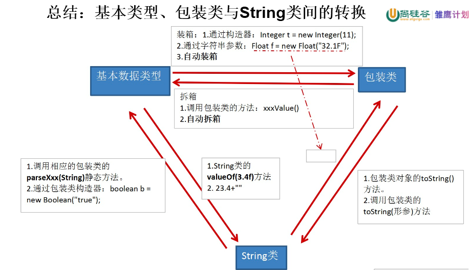

# day13授课笔记

讲师：宋红康

***

## 一、作业

见前一天最后的作业

## 二、复习

- 子类对象实例化的全过程 ---了解
  - 创建子类对象的过程中，虽然加载过父类的构造器，但是自始至终，就只有一个对象，即为new的子类对象
- 面向对象的特征三：多态性  ---重点、难点
  - 子类对象的多态性
  - 多态性的应用：虚方法调用。编译看左边，运行看右边
  - 多态性不适用于属性。编译、运行都看左边
  - 如何实现向下转型：使用强转符
    - 避免在强转时出现ClassCastException，在强转前，使用instanceof进行判断
  - 如果没有多态性，抽象类和接口的定义就没有意义！
- Object 类
  - 根父类
  - 重点方法：equals() 、 toString()
  - wait()、notify()、notifyAll()、hashCode()、getClass()后面讲
  - 了解：clone()、finalize()

## 三、JUnit单元测试

```java
/*
 * 
 * 一、Junit单元测试
 * 1. 选中工程-右键-build path - add libraries - Junit - Junit 4
 * 2. 新建一个测试类，此类称为：单元测试类
 * 		要求：1. 此单元测试类必须声明为public的。2. 必须提供public权限的空参构造器
 * 3. 类中导包：import org.junit.Test;
 * 4. 新建一个方法，在方法前声明@Test
 * 		要求：此方法是public的，void的，且没有形参
 *    此方法即为单元测试方法
 * 5. 在单元测试方法中可以定义变量，可以调用类中的方法等操作，进行测试即可
 * 
 * 二、说明
 * 1. 如果单元测试方法正常执行结束，则显示：绿条
 * 2. 如果单元测试方法执行过程中出现异常，则显示：红条
 * 
 */
public class JunitTest {
//	public static void main(String[] args) {//程序的入口
//		
//	}
	
	@Test
	public void test1(){
		System.out.println("hello");
		int num = 10;
		num += 2;
		System.out.println(num);
	}
	
	@Test
	public void test2(){
		System.out.println("今天天气不错！但是不能出去溜达。。。");
		String info = info();
		System.out.println(info);
		
		int[] arr = new int[10];
		System.out.println(arr[10]);
	}
	
	public String info(){
		return "北京-上海-深圳";
	}
}
```

## 四、包装类的使用

### 1. 为什么要有包装类

- 针对八种基本数据类型定义相应的引用类型—包装类（封装类）

- 有了类的特点，就可以调用类中的方法，Java才是真正的面向对象

### 2. 基本数据类型与对应的包装类


### 3. 基本数据类型、包装类与String之间的转换




#### 3.1  基本数据类型变量 与 包装类之间的转换

方式一：

```java
	//装箱：基本数据类型的变量 --> 包装类：调用包装类的构造器
	@Test
	public void test1(){
		int i1 = 10;
		
//		System.out.println(i1.toString());//编译错误
		
		Integer i2 = new Integer(i1);
		System.out.println(i2.toString());//10
		
		
		float f1 = 12.3F;
		Float f2 = new Float(f1);
		System.out.println(f2);
		
//		Float f3 = new Float("abc");//报NumberFormatException
		Float f4 = new Float("12.3");
		System.out.println(f4);
		
		Boolean b1 = new Boolean(true);
		b1 = new Boolean("TRue");
		System.out.println(b1);
		
		Boolean b2 = new Boolean("true123");
		System.out.println(b2);//不报异常，false.
		
	}
	
	//拆箱：包装类--->基本数据类型:调用包装类Xxx的xxxValue()方法
	@Test
	public void test2(){
		Integer i1 = new Integer(11);
		//
		int i2 = i1.intValue();
		int i3 = i2 + 10;
		
		Boolean b1 = new Boolean(true);
		boolean b2 = b1.booleanValue();
		
	}
```

- 方式二：jdk5.0引入了自动的装箱和拆箱

```java
//jdk5.0引入了自动的装箱和拆箱
	@Test
	public void test3(){
		int i1 = 10;
		Integer i2 = i1; //自动装箱
		System.out.println(i2.toString());
		
		int i3 = i2;//自动拆箱
		
		double d1 = 12.3;
		Double d2 = d1;//自动装箱
		double d3 = d2;//自动拆箱
		//应用:
		boolean b = d2.equals(d1);//自动装箱
		
		double d4 = i2 - d2;//自动拆箱
	}
```


#### 3.2 基本数据类型、包装类  与 字符串之间的转换

```java
//基本数据类型、包装类 --->字符串:① 连接运算  ② 调用String类的valueOf(xxx )
	@Test
	public void test4(){
		int i1 = 10;
		Integer i2 = new Integer(20);
		
		//方式一：+运算
		String str1 = i1 + "";
		
		//方式二：
		String str2 = String.valueOf(i1);
		System.out.println(str2);//"10"
		
		String str3 = String.valueOf(i2);
		System.out.println(str3);//"20"
	}
	
	//字符串 ---> 基本数据类型、包装类：调用包装类Xxx的parseXxx()
	@Test
	public void test5(){
		String s1 = "123";
//		int i1 = (int)s1;//编译报错
		
		int i2 = Integer.parseInt(s1);
		System.out.println(i2);//123
		
		
		String s2 = "false";
		Boolean b1 = Boolean.parseBoolean(s2);//自动装箱
		System.out.println(b1);
	}
```

### 练习：

```
信息给予题：

利用Vector代替数组处理：从键盘读入学生成绩（以负数代表输入结束），找出最高分，并输出学生成绩等级。
提示：数组一旦创建，长度就固定不变，所以在创建数组前就需要知道它的长度。而向量类java.util.Vector可以根据需要动态伸缩。
创建Vector对象：Vector v=new Vector();
给向量添加元素：v.addElement(Object obj);   //obj必须是对象
取出向量中的元素：Object  obj=v.elementAt(0);
注意第一个元素的下标是0，返回值是Object类型的。
计算向量的长度：v.size();
若与最高分相差10分内：A等；20分内：B等；
      30分内：C等；其它：D等
       
```

```java
public class ScoreTest {
	public static void main(String[] args) {
		//1.实例化Vector
		Vector v = new Vector();
		
		//2.实例化Scanner
		Scanner scanner = new Scanner(System.in);
		//3.通过for循环向vector中添加学生成绩
		int maxScore = 0;
		for(;;){
			//方式1：jdk5.0之前
//			int number = scanner.nextInt();
//			Integer score = new Integer(number);
//			v.addElement(score);
			//方式2：jdk5.0之后可以自动装箱
			int number = scanner.nextInt();
			//如果输入的负数，则跳出循环结构
			if(number < 0){
				break;
			}
			v.addElement(number);
			//4.获取最高分
			if(maxScore < number){
				maxScore = number;
			}
		}
		
		//5.遍历每个学生成绩，并获取各自的等级
		for(int i = 0;i < v.size();i++){
			Object element = v.elementAt(i);
			if(element instanceof Integer){
				//方式1：jdk5.0之前
//				Integer score = (Integer) element;
//				int myScore = score.intValue();
				//方式2：jdk5.0之后可以自动装箱
				int myScore = (Integer) element;
				char grade;
				if(myScore >= maxScore - 10){
					grade = 'A';
				}else if(myScore >= maxScore - 20){
					grade = 'B';
				}else if(myScore >= maxScore - 30){
					grade = 'C';
				}else{
					grade = 'D';
				}
				
				System.out.println("student " + i + " score is " 
						+ myScore + ", grade is " + grade);
			}
			
		}
	}
}
```

## 五、static关键字的使用

### 1. static的理解

 * 1. static:静态的。
 * 2. static 用来修饰的结构：属性、方法；代码块、内部类


### 2. static修饰属性

```
3.1 变量的分类： 成员变量（或属性）：静态变量（或类变量）、非静态变量（或实例变量）
 *   			    局部变量：方法内、方法的形参、构造器内部、构造器形参、代码块内部
3.2 静态变量：如果属性使用static修饰以后，就是静态变量。
 *        特点：创建一个类的多个对象，每个对象拥有一套实例变量。（如果修改一个对象的实例变量，不影响其他对象的实例变量）。但是，此类的多个对象，会共享此类的静态变量（或类变量）。（如果通过一个对象修改其静态变量的话，会影响其他所有对象对此静态变量的调用）
 *   3.3 说明： 
      ① 静态变量，在内存中就只有一份。存储在内存的静态域中。
 *    ② 静态变量，随着类的加载而加载。而且，只会加载一次。  比如：Math里的PI,System里的out
 *            （相比来讲，实例变量，随着对象的创建而加载）
 *    ③ 从生命周期角度，理解静态变量  
 * 						静态变量		实例变量
 * 				类		yes			no
 * 				对象		yes			yes
```


### 3.static修饰方法

```java
static 修饰方法：静态方法（或类方法）
 * 	 ① 随着类的加载而加载
 *   ② 可以直接通过"类.静态方法"的方式进行调用
 * 	 ③ 从生命周期角度，理解静态方法
 * 						静态方法		实例方法
 * 				类		yes			no
 * 				对象		yes			yes
 * 	 ④ 静态方法中，可以调用当前类中的静态结构，但是不能调用当前类的非静态的结构：属性、方法
 *     非静态方法中，既可以调用当前类中的类中的静态结构，也可以调用当前类的非静态的结构：属性、方法
 * 		比如：Arrays工具类、Math工具类中的方法基本都是静态的方法：Arrays.sort()，Math.random();
 * 	 ⑤ 静态方法内，不能使用this、super
```


测试代码：

```java
class Chinese{//中国人
	
	String name;
	int age;
	static String nation;
	
	@Override
	public String toString() {
		return "Chinese [name=" + name + ", age=" + age + ", nation=" + nation + "]";
	}
	
	public static void show(){
		System.out.println("我是一个中国人");
		System.out.println("nation : " + nation);
		//不可以在静态方法中，调用类中的非静态结构
//		System.out.println("name : " + name + ", age : " + age);
//		eat();
	}
	
	public void eat(){
		System.out.println("中国人喜欢吃中国菜");
		
	}
	
	public void info(){
		System.out.println("name : " + name + ", age : " + age);
		eat();
		//可以在非静态方法中，调用类中的静态结构
		System.out.println("nation : " + nation);
		show();
	}
	
}
```

```java
public class StaticTest {
	public static void main(String[] args) {
		Chinese.nation = "中国";
		System.out.println(Chinese.nation);
//		Chinese.name = "Tom";//编译不通过
		
		Chinese c1 = new Chinese();
		c1.name = "成龙";
		c1.age = 60;
		c1.nation = "CHN";
		
		Chinese c2 = new Chinese();
		c2.name = "周杰伦";
		c2.age = 34;
//		c2.nation = "China";
		
		System.out.println(c1);
		System.out.println(c2);
		
		System.out.println(Chinese.nation);
		
		Chinese.show();
		c1.show();
		
		//*******************************
//		StaticTest test = new StaticTest();
//		test.display();
		
		StaticTest.display();
	}
	
	public static void display(){
		System.out.println("测试");
	}
}
```

### 4. 何时属性、方法适合设置为static的

```
      开发中，什么时候需要将属性声明为静态的？
 * 		> 属性是否可以多个对象所共享，不会随着对象的不同而不同。
 * 		> 类的中常量通常会设置为静态的。
 * 
 *    什么时候需要将方法声明为静态的？
 *    	> 修改、调用静态属性的方法，通常都是静态方法。
 *      > 工具类中的方法，通常都是静态方法。
```

### 5. 应用举例：

```java
//static的应用
public class CircleTest {
	public static void main(String[] args) {
		Circle c1 = new Circle();
		
		
		Circle c2 = new Circle(3.2);
		
		System.out.println(c1);
		System.out.println(c2);
		
		System.out.println("共创建了" + Circle.count + "个对象");
		
	}
}

class Circle{
	
	private double radius;//半径
	private int id;//编号,自动生成
	
	
	public static int count;//记录创建的Circle对象的个数
	private static int init = 1001;//用来生成自增长的数据

	public double getRadius() {
		return radius;
	}

	public void setRadius(double radius) {
		this.radius = radius;
	}
//
	public Circle(double radius) {
		this();
		this.radius = radius;
//		id = init++;
//		count++;
	}

	public Circle() {
		super();
		id = init++;
		count++;
	}

	@Override
	public String toString() {
		return "Circle [radius=" + radius + ", id=" + id + "]";
	}
	
	
	
	
	
}
```

### 6. 练习

```
编写一个类实现银行账户的概念，包含的属性有“帐号”、“密码”、“存款余额”、“利率”、“最小余额”，定义封装这些属性的方法。账号要自动生成。
编写主类，使用银行账户类，输入、输出3个储户的上述信息。
考虑：哪些属性可以设计成static属性。

```

## 六、单例模式

 * 一、设计模式：是在大量的实践中总结和理论化之后优选的代码结构、编程风格、以及解决问题的思考方式。
 * 经典的设计模式一共有23种。
 * 二、单例模式：采取一定的方法保证在整个的软件系统中，对某个类只能存在一个对象实例
 * 三、如何实现单例模式


- 饿汉式

```java
public class SingletonTest {
	public static void main(String[] args) {
		
//		Bank bank1 = new Bank();
//		Bank bank2 = new Bank();
		
		Bank bank1 = Bank.getInstance();
		Bank bank2 = Bank.getInstance();
		System.out.println(bank1 == bank2);
	}
}

class Bank{
	
	//1.私有化类的构造器
	private Bank(){
		
	}
	//2.内部创建当前类的实例
	private static Bank bank = new Bank();
	
	//3.提供公共的，静态的方法，返回当前类的唯一对象
	public static Bank getInstance(){
		return bank;
	}
	
	
}
```


- 懒汉式

```java
//单例模式的懒汉式
public class SingletonTest1 {
	public static void main(String[] args) {
		School s1 = School.getInstance();
		School s2 = School.getInstance();
		
		System.out.println(s1 == s2);
	}
}

class School {

	// 1.私有化类的构造器
	private School() {

	}

	//2. 声明当前类对象的属性
	private static School school = null;
	
	//3. 在静态方法中为当前对象赋值
	public static School getInstance(){
		
		if(school == null){
			school = new School();
		}
		
		return school;
	}
}
```

- 对比两种模式

```
1. 从节省内存空间角度：懒汉式好
2. 线程安全性的角度：饿汉式好。  在多线程中讲解如何解决线程安全问题。
```

