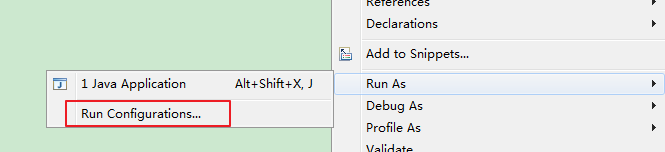
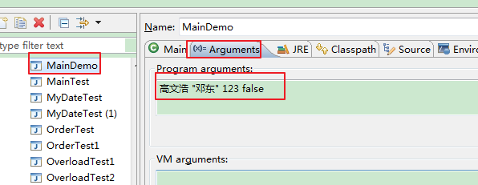
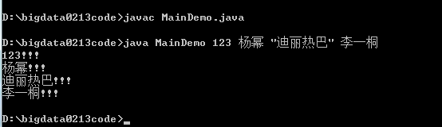
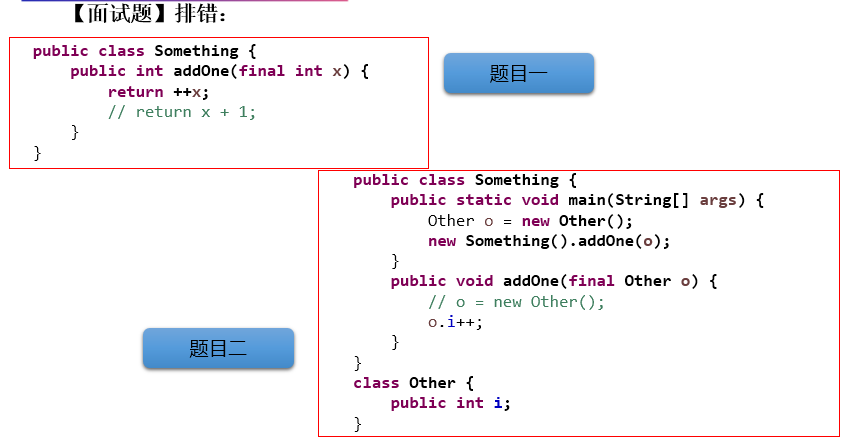
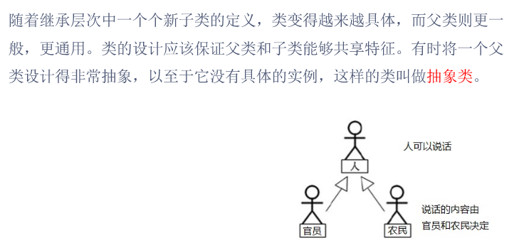

# day14授课笔记

## 一、作业

编写一个类实现银行账户的概念，包含的属性有“帐号”、“密码”、“存款余额”、“利率”、“最小余额”，定义封装这些属性的方法。账号要自动生成。

编写主类，使用银行账户类，输入、输出3个储户的上述信息。

考虑：哪些属性可以设计成static属性。

```java
public class Account{
	
	private int id;//账号
	private String passWord = "123456";//初始密码
	private double balance;//余额
	
	private static int init = 1001;//账号号码自动生成
	private static double annualInterestRate = 0.015;//利率
	private static double minBalance = 100;//最小余额
	
	public Account() {
		id = init++;
	}

	public Account(String passWord,double balance) {
		this();
		this.passWord = passWord;
		this.balance = balance;
	}

	public String getPassWord() {
		return passWord;
	}

	public void setPassWord(String passWord) {
		this.passWord = passWord;
	}

	public static double getAnnualInterestRate() {
		return annualInterestRate;
	}

	public static void setAnnualInterestRate(double annualInterestRate) {
		Account.annualInterestRate = annualInterestRate;
	}

	public static double getMinBalance() {
		return minBalance;
	}

	public static void setMinBalance(double minBalance) {
		Account.minBalance = minBalance;
	}

	public int getId() {
		return id;
	}

	public double getBalance() {
		return balance;
	}

	@Override
	public String toString() {
		return "BankAccount [id=" + id + ", passWord=" + passWord + ", balance=" + balance + "]";
	}	
	
}
```

```java
//使用银行账户类，输入、输出3个储户的上述信息。
public class AccountTest {

	public static void main(String[] args) {
		
		Account account1 = new Account("666666", 1000);
		Account account2 = new Account("system", 3000);
		Account account3 = new Account("qwerdf", 500);
		
		Account.setAnnualInterestRate(0.0123);
		Account.setMinBalance(250);
		
		System.out.println("利率：" + Account.getAnnualInterestRate());
		System.out.println("最小余额：" + Account.getMinBalance());
		
		System.out.println(account1);
		System.out.println(account2);
		System.out.println(account3);
	}
}
```


思考题

```
public class StaticDemo {

	public static void main(String[] args) {
		System.out.println(new SDText().x+","+new SDText().y+","+new SDText().x);
	}
}
class SDText{
	static SDText sd=new SDText();
	static int x=3;
	static int y;
	public SDText(){
		x++;
		y++;
	}
}

```

答案：

4,3,6

## 二、复习

- 单元测试方法的使用
- 包装类的使用
  - 基本数据类型 与 包装类的转换：自动装箱、自动拆箱
  - 基本数据类型、包装类  与 String之间的转换：① String中的重载方法：valueOf()  **②调用包装类Xxx的parseXxx();**
    - 调用包装类Xxx的parseXxx();可能会出现：NumberFormatException。

- static关键字
  - static修饰的结构：属性、方法； 代码块、内部类。
  - 随着类的加载而加载。
  - “类.属性”  或 "类.方法"的方式进行调用
  - 属性、方法在类中只有一份
  - **哪些属性或方法适合声明为静态的！！**

- 设计模式与单例模式
  - 饿汉式
  - 懒汉式（暂时存在线程安全问题，后面在多线程中解决）

## 三、熟悉main()方法

1. main()是程序的入口

2. main()看作是一个普通的静态方法

```java
public class MainTest {

	public static void main(String[] args) {//程序的入口
		Main.main(new String[10]);
	}
}

class Main {
	public static void main(String[] args) {//看作是普通的静态方法
		for(int i = 0;i < args.length;i++){
			args[i] = "args_" + i;
			System.out.println(args[i]);
		}
	}
}
```


3. 可以通过控制台给main()的形参进行赋值操作

- Eclipse中：

  

  

- 命令行

  

  

## 四、类的成员之四：代码块

```
类的成员之四：代码块（或初始化块）
 * 
 * 1. 代码块如果有修饰的话，只能使用static
 * 2. 代码块的分类：静态代码块  vs 非静态代码块
 * 
 * 3. 静态代码块的使用
 * 	  > 内部可以声明执行语句
 *    > 随着类的加载而执行
 *    > 由于类的加载只执行一次，所以静态代码块也只执行一次
 *    > 作用：用来初始化类的基本信息：静态属性
 *    > 可以在内部调用类的静态结构：属性、方法。不能调用非静态的属性或方法
 *    > 如果在一个类中声明了多个静态代码块，则按照声明的先后顺序执行。
 *    > 静态代码块的执行要先于非静态代码块的执行
 * 
 * 
 * 4. 非静态代码块的使用
 * 	  > 内部可以声明执行语句
 * 	  > 随着对象的创建而执行
 *    > 每创建一个对象，就执行一次
 *    > 用来初始化对象的基本信息：非静态属性
 *    > 可以在内部调用类的静态结构和非静态的结构：属性、方法
 *    > 如果在一个类中声明了多个非静态代码块，则按照声明的先后顺序执行。
 * 
```

```java
class Person{
	
	String name;
	int age;
	static String nation = "CHN";
	
	public Person(){
		
	}
	
	public Person(String name,int age){
		this.name = name;
		this.age = age;
	}
	
	//静态代码块
	static{
		//执行语句
		int i = 10;
		System.out.println(i + "：静态");
		//不能调用非静态的结构
//		name = "Tom";
//		eat();
		//调用静态结构
		System.out.println(nation);
		showNation();
	}
	
	static{
		System.out.println("我是静态代码块3");
	}
	static{
		System.out.println("我是静态代码块2");
	}
	
	
	//非静态代码块
	{
		System.out.println("我是非静态代码块3");
	}
	{
		//执行语句
		int i = 10;
		System.out.println(i + "：非静态");
		//可以调用静态结构和非静态结构
		name = "Tom";
		eat();
		showNation();
	}
	
	{
		System.out.println("我是非静态代码块2");
	}
	
	
	
	public void eat(){
		System.out.println("人吃饭");
	}
	//随着类的加载而加载
	public static void showNation(){
		System.out.println("我是一个中国人");
	}
	
	
}
```

## 五、总结：属性赋值的先后顺序

### 1. 属性赋值的位置

```
 * 可以给类的非静态的属性赋值的位置有：
 * 
 * ① 默认初始化
 * ② 显式初始化
 * ③ 代码块中初始化
 * ④ 构造器中初始化
 * ⑤ 创建了对象以后，通过“对象.属性”或"对象.方法"的方式，给属性赋值
```

### 2. 赋值的先后顺序

```
执行的先后顺序：
 * ① - ②/③ - ④ - ⑤ 
 * 
 * 说明：② 和 ③执行的先后顺序，取决于二者声明的先后顺序。
```

## 六、final关键字的使用

```
1. final:最终的
 * 
2. final可以用来修饰：类、方法、变量（包含属性、局部变量）
```

### 1. final修饰类

final修饰类：此类不可以被继承。

 *       比如：String\StringBuffer\StringBuilder

### 2. final修饰方法

final修饰方法：此方法不可以被重写

 * 		 比如：Object中的getClass()

### 3. final修饰变量

```
final修饰变量:表明此变量，一旦赋值以后，此值就不能被修改。即为一个常量。
 * 		① final修饰属性：
 * 			在哪些位置可以给常量赋值？① 显式初始化 ②代码块中初始化 ③ 构造器中初始化 
 *      开发中的应用场景：我们常在项目的代码中会使用一些数值，一般我们会将这些数值定义为常量，在代码中
 *       使用这些常量。
 *      ② final修饰局部变量中的形参： 1. 调用此方法时，给形参常量赋值  
 *      					2.一旦赋值，在方法内可以使用此形参常量，但是不能给形参常量再赋值。
 
 static final 修饰成员变量的话：全局变量。比如：Math里的PI
```


代码测试：

```java
public class FinalTest {
	
	
	final int NUM = 1;//常量
	
	final int UP = 0;
	final int DOWN;
	final int LEFT;
	final int RIGHT;
	
	{
		DOWN = 1;
	}
	
	public FinalTest(){
		LEFT = 2;
		RIGHT = 3;
	}
	
	public FinalTest(int i,int j){
		LEFT = i;
		RIGHT = j;
	}
	
	public void test(){
//		num = 2;
	}
	
	
	public void test1(){
		final int COUNT = 1;
//		COUNT = 2;
	}
	
	public void test2(final int num){
		System.out.println(num);
//		num++;
	}
	
}

final class A{
	
}
//The type B cannot subclass the final class A
//class B extends A{
//	
//}

//class SubString extends String{
//	
//}

class C{
	public final void test(){
		
	}
}

class D extends C{
	// Cannot override the final method from C
//	public void test(){
//		
//	}
}
```

### 4. 面试题



- 题目一：编译不通过。
- 题目二：编译通过，运行也通过

## 七、抽象类与抽象方法

### 1. 引入



### 2. 抽象类 与 抽象方法

```
   1. abstract:抽象的
 * 
 * 2. abstract可以用来修饰：类、方法
 * 
 * 3. abstract 修饰类：抽象类
 * 		> 不能实例化
 * 		> 抽象类中仍然存在构造器。  --->只要是类，内部一定有构造器
 * 			>此时抽象类中的构造器，便于子类实例化时使用。
 * 
 * 4. abstract 修饰方法：抽象方法 ：即使用abstract修饰，且没有方法体。
 * 		> 抽象类中可以没有抽象方法的
 * 		> 抽象方法所在的类必须是抽象类
 * 		> 抽象类的子类必须重写其父类中的所有的抽象方法，方可实例化。
 * 		> 抽象类的子类如果没有重写其父类中的所有的抽象方法，则此子类仍然为一个抽象类。
 * 
```

### 3. 代码体现一

```java
abstract class Creature{//生物类
	public abstract void breath();//呼吸
}

abstract class Person extends Creature{ //抽象类
	
	String name;
	int age;
	
	public Person() {
		super();
	}
	public Person(String name, int age) {
		super();
		this.name = name;
		this.age = age;
	}
	
	//抽象方法
	public abstract void eat();
	
	public abstract void walk();
	
}

class Student extends Person{
	
	public Student() {
		super();
	}

	public Student(String name, int age) {
		super(name, age);
	}

	public void eat(){
		System.out.println("学生：多吃有营养的食物");
	}
	
	public void walk(){
		System.out.println("学生：背着书包上学");
	}

	@Override
	public void breath() {
		System.out.println("学生：呼吸新鲜没有雾霾的空气");
	}
}

abstract class Worker extends Person{
	public void eat(){
		System.out.println("工人：多吃肉，有劲");
	}
	
//	public void walk(){
//		System.out.println("工人：扛着工具走路");
//	}
}
```

### 4. 代码体现二

```java
 * abstract class Account{//账户:抽象类
 * 		int balance;//余额
 * 
 * 		public abstract void withdraw(double amt);
 * }
 * 
 * class SavingAccount extends Account{ //储蓄账户
 * 
 * }
 * 
 * class CheckAccount extends Account{//信用卡账户
 * 
 * }
 * 
 * 。。。。
 * class Customer{
 * 	
 * 		Account acct;
 * 
 * 		public void setAccount(Account acct){
 * 			this.acct = acct;
 * 		}
 * }
```

### 5. 代码体现三

```java
public abstract class GeometricObject {
    protected String color;
    protected double weight;

//    protected GeometricObject(){
//    	
//    }

    protected GeometricObject (String color,double weight){
        this.color = color;
        this.weight = weight;
    }

    public void setWeight(double weight) {
        this.weight = weight;
    }

    public double getWeight() {
        return weight;
    }

    public void setColor(String color) {
        this.color = color;
    }

    public String getColor() {
        return color;
    }

    //求面积的方法
    public abstract double findArea();
}
```

### 6.  abstract使用的注意事项

```
 *  不能用abstract修饰变量、代码块、构造器；
 *  
 *  不能用abstract修饰私有方法、静态方法、final的方法、final的类。
```

### 7. 抽象性的应用：模板方法的设计模式

```
当功能内部一部分实现是确定的，一部分实现是不确定的。这时可以把不确定的部分暴露出去，让子类去实现。

换句话说，在软件开发中实现一个算法时，整体步骤很固定、通用，这些步骤已经在父类中写好了。但是某些部分易变，易变部分可以抽象出来，供不同子类实现。这就是一种模板模式。

```

举例一：

```java
public class TemplateTest {
	public static void main(String[] args) {
		Template t = new SubTemplate();
		t.spendTime();
	}
}

abstract class Template{
	
	//不确定的部分：使用抽象方法
	public abstract void code();
	
	//计算code()中的代码执行花费的时间
	public void spendTime(){
		
		long start = System.currentTimeMillis();
		
		code();
		
		long end = System.currentTimeMillis();
		
		System.out.println("花费的时间为：" + (end - start));
	}
}

class SubTemplate extends Template{

	@Override
	public void code() {
		
		for(int i = 2;i <= 100000;i++){
			boolean isFlag = true;
			for(int j = 2;j <= Math.sqrt(i);j++){
				if(i % j == 0){
					isFlag = false;
					break;
				}
			}
			
			if(isFlag){
				System.out.println(i);
			}
		}
		
	}
	
}
```

举例二：

```java
//抽象类的应用：模板方法的设计模式
public class TemplateMethodTest {

	public static void main(String[] args) {
		BankTemplateMethod btm = new DrawMoney();
		btm.process();

		BankTemplateMethod btm2 = new ManageMoney();
		btm2.process();
	}
}
abstract class BankTemplateMethod {
	// 具体方法
	public void takeNumber() {
		System.out.println("取号排队");
	}

	public abstract void transact(); // 办理具体的业务 //钩子方法

	public void evaluate() {
		System.out.println("反馈评分");
	}

	// 模板方法，把基本操作组合到一起，子类一般不能重写
	public final void process() {
		this.takeNumber();

		this.transact();// 像个钩子，具体执行时，挂哪个子类，就执行哪个子类的实现代码

		this.evaluate();
	}
}

class DrawMoney extends BankTemplateMethod {
	public void transact() {
		System.out.println("我要取款！！！");
	}
}

class ManageMoney extends BankTemplateMethod {
	public void transact() {
		System.out.println("我要理财！我这里有2000万美元!!");
	}
}
```

### 8. 练习

练习1：

```
编写一个Employee类，声明为抽象类，
包含如下三个属性：name，id，salary。
提供必要的构造器和抽象方法：work()。
对于Manager类来说，他既是员工，还具有奖金(bonus)的属性。
请使用继承的思想，设计CommonEmployee类和Manager类，要求类中提供必要的方法进行属性访问。

```

答案：

```java
public abstract class Employee {
	private String name;
	private int id;
	private double salary;

	public Employee(String name, int id, double salary) {
		super();
		this.name = name;
		this.id = id;
		this.salary = salary;
	}

	public Employee() {
		super();
	}

	public String getName() {
		return name;
	}

	public void setName(String name) {
		this.name = name;
	}

	public int getId() {
		return id;
	}

	public void setId(int id) {
		this.id = id;
	}

	public double getSalary() {
		return salary;
	}

	public void setSalary(double salary) {
		this.salary = salary;
	}

	@Override
	public String toString() {
		return "Employee [name=" + name + ", id=" + id + ", salary=" + salary + "]";
	}

	public abstract void work();
}
```

```java
class Manager extends Employee {
	private int bonus;

	public Manager() {

	}

	public Manager(String name, int id, double salary) {
		super(name, id, salary);
	}

	public Manager(String name, int id, double salary, int bonus) {
		super(name, id, salary);
		this.bonus = bonus;
	}

	public int getBonus() {
		return bonus;
	}

	public void setBonus(int bonus) {
		this.bonus = bonus;
	}

	@Override
	public String toString() {
		return "Manager [bonus=" + bonus + "]";
	}

	public void work() {
		System.out.println("经理管理普通员工的工作");
	}
}
```

```java
class CommonEmployee extends Employee {
	public CommonEmployee() {
	}

	public CommonEmployee(String name, int id, double salary) {
		super(name, id, salary);
	}

	public void work() {
		System.out.println("员工工作");
	}

	@Override
	public String toString() {
		return "CommonEmployee [name=" + getName() + ", id=" + getId() 
		+ ", salary=" + getSalary() + "]";
	}

	
}
```

```
public class WorkTest {	
	public static void main(String[] args) {
		Manager m1=new Manager("王皓",001,10000.0,5000);
		System.out.println(m1);
		m1.work();
		
		CommonEmployee c1=new CommonEmployee("王皓",001,5000);
		c1.work();
		System.out.println(c1);
		
		
		operate(m1);
	}
	
	public static void operate(Employee e){
		e.work();
	}
}
```

练习2：

```
编写工资系统，实现不同类型员工(多态)的按月发放工资。如果当月出现某个Employee对象的生日，则将该雇员的工资增加100元。
实验说明：
（1）定义一个Employee类，该类包含：
private成员变量name,number,birthday，其中birthday 为MyDate类的对象；
abstract方法earnings()；
toString()方法输出对象的name,number和birthday。
（2）MyDate类包含:
private成员变量year,month,day ；
toDateString()方法返回日期对应的字符串：xxxx年xx月xx日
（3）定义SalariedEmployee类继承Employee类，实现按月计算工资的员工处理。该类包括：private成员变量monthlySalary；
实现父类的抽象方法earnings(),该方法返回monthlySalary值；toString()方法输出员工类型信息及员工的name，number,birthday。

（4）参照SalariedEmployee类定义HourlyEmployee类，实现按小时计算工资的员工处理。该类包括：
private成员变量wage和hour；
实现父类的抽象方法earnings(),该方法返回wage*hour值；
toString()方法输出员工类型信息及员工的name，number,birthday。
（5）定义PayrollSystem类，创建Employee变量数组并初始化，该数组存放各类雇员对象的引用。利用循环结构遍历数组元素，输出各个对象的类型,name,number,birthday,以及该对象生日。当键盘输入本月月份值时，如果本月是某个Employee对象的生日，还要输出增加工资信息。


提示：
//定义People类型的数组People c1[]=new People[10];
//数组元素赋值
c1[0]=new People("John","0001",20);
c1[1]=new People("Bob","0002",19);
//若People有两个子类Student和Officer，则数组元素赋值时，可以使父类类型的数组元素指向子类。
c1[0]=new Student("John","0001",20,85.0);
c1[1]=new Officer("Bob","0002",19,90.5);

```

