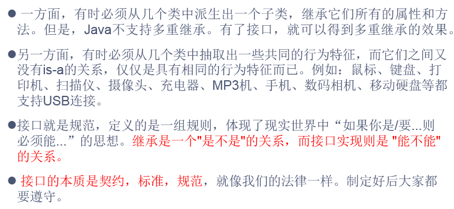
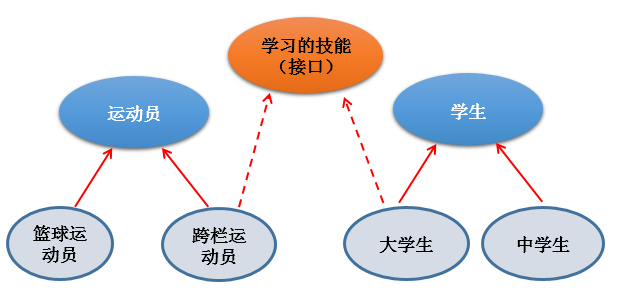
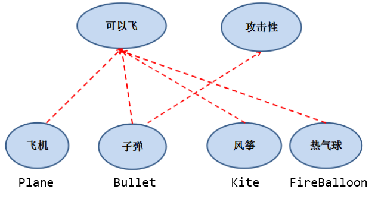
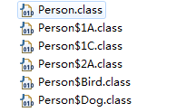

# day15授课笔记

讲师：宋红康

***

## 一、作业

练习1：

```
    1、声明抽象父类Person，包含抽象方法public abstract void eat();
	2、声明子类中国人Chinese，重写抽象方法，打印用筷子吃饭
	3、声明子类美国人American，重写抽象方法，打印用刀叉吃饭
	4、声明子类印度人Indian，重写抽象方法，打印用手抓饭
	5、声明测试类Test11，创建Person数组，存储各国人对象，并遍历数组，调用eat()方法

```

```java
public abstract class Person {
	public abstract void eat();
}
```

```java
public class Chinese extends Person {

	public void eat() {
		System.out.println("中国人用筷子吃饭");
	}

}
```

```java
public class American extends Person {

	public void eat() {
		System.out.println("美国人用刀叉吃饭");
	}

}
```

```java
public class Indian extends Person {

	@Override
	public void eat() {
		System.out.println("印度人用手抓饭");
	}
	
}
```

```java
public class Test11 {
	public static void main(String[] args) {
		Person[] pers  = new Person[3] ; //String[] arr = new String[10];
		pers[0] = new Chinese();//多态
		pers[1] = new American();
		pers[2] = new Indian();
		for (int i = 0; i < pers.length; i++) {
			pers[i].eat();
		}
	}
}
```

练习2：

```
编写工资系统，实现不同类型员工(多态)的按月发放工资。如果当月出现某个Employee对象的生日，则将该雇员的工资增加100元。
实验说明：
（1）定义一个Employee类，该类包含：
private成员变量name,number,birthday，其中birthday 为MyDate类的对象；
abstract方法earnings()；
toString()方法输出对象的name,number和birthday。
（2）MyDate类包含:
private成员变量year,month,day ；
toDateString()方法返回日期对应的字符串：xxxx年xx月xx日
（3）定义SalariedEmployee类继承Employee类，实现按月计算工资的员工处理。该类包括：private成员变量monthlySalary；
实现父类的抽象方法earnings(),该方法返回monthlySalary值；toString()方法输出员工类型信息及员工的name，number,birthday。

（4）参照SalariedEmployee类定义HourlyEmployee类，实现按小时计算工资的员工处理。该类包括：
private成员变量wage和hour；
实现父类的抽象方法earnings(),该方法返回wage*hour值；
toString()方法输出员工类型信息及员工的name，number,birthday。
（5）定义PayrollSystem类，创建Employee变量数组并初始化，该数组存放各类雇员对象的引用。利用循环结构遍历数组元素，输出各个对象的类型,name,number,birthday,以及该对象生日。当键盘输入本月月份值时，如果本月是某个Employee对象的生日，还要输出增加工资信息。


提示：
//定义People类型的数组People c1[]=new People[10];
//数组元素赋值
c1[0]=new People("John","0001",20);
c1[1]=new People("Bob","0002",19);
//若People有两个子类Student和Officer，则数组元素赋值时，可以使父类类型的数组元素指向子类。
c1[0]=new Student("John","0001",20,85.0);
c1[1]=new Officer("Bob","0002",19,90.5);
```

答案：

```java
public  abstract class Employee {
	
	private String name;//员工姓名
	private int number;//员工工号
	private MyDate birthday;//员工出生日期
	
	private static int num;//记录输入的员工人数
	
	public Employee(String name, int number, MyDate birthday) {
		super();
		this.name = name;
		this.number = number;
		this.birthday = birthday;
		num++;
	}

	public Employee() {
		super();
	}

	public abstract double earnings();//计算员工收入

	public String getName() {
		return name;
	}

	public void setName(String name) {
		this.name = name;
	}

	public int getNumber() {
		return number;
	}

	public void setNumber(int number) {
		this.number = number;
	}

	public MyDate getBirthday() {
		return birthday;
	}

	public void setBirthday(MyDate birthday) {
		this.birthday = birthday;
	}

	@Override
	public String toString() {
		return "name=" + name + ", number=" + number + ", birthday=" + birthday.toDateString();
	}
}
```

```java
/*
 * （2）MyDate类包含:
private成员变量year,month,day ；
toDateString()方法返回日期对应的字符串：xxxx年xx月xx日
 */
public class MyDate {
	
	private int year;
	private int month;
	private int day;
	
	public MyDate(int year, int month, int day) {
		this.year = year;
		this.month = month;
		this.day = day;
	}

	public int getYear() {
		return year;
	}

	public void setYear(int year) {
		this.year = year;
	}

	public int getMonth() {
		return month;
	}

	public void setMonth(int month) {
		this.month = month;
	}

	public int getDay() {
		return day;
	}

	public void setDay(int day) {
		this.day = day;
	}
	
	public String toDateString(){//返回年月日信息
		return year + "年" + month + "月" + day + "日";
	}
}
```

```java
/*
 * （3）定义SalariedEmployee类继承Employee类，实现按月计算工资的员工处理。该类包括：private成员变量monthlySalary；
实现父类的抽象方法earnings(),该方法返回monthlySalary值；toString()方法输出员工类型信息及员工的name，number,birthday。
 */
public class SalariedEmployee extends Employee { //按月计算工资的员工
	
	private double monthlySalary;//月薪
	
	public SalariedEmployee(String name, int number, MyDate birthday, double monthlySalary) {
		super(name, number, birthday);
		this.monthlySalary = monthlySalary;
	}

	public double earnings(){//获得员工收入
		return monthlySalary;
	}
	
	@Override
	public String toString() {
		return "SalariedEmployee [" + super.toString() + "]";
	}
}
```

```java
/*
 * 参照SalariedEmployee类定义HourlyEmployee类，实现按小时计算工资的员工处理。该类包括：
private成员变量wage和hour；
实现父类的抽象方法earnings(),该方法返回wage*hour值；
toString()方法输出员工类型信息及员工的name，number,birthday。
 */
public class HourlyEmployee extends Employee {
	
	private double wage;//每个小时的工资
	private int hour;//工作时长(以月为单位)
	
	public HourlyEmployee(String name, int number, MyDate birthday,double wage, int hour) {
		super(name, number, birthday);
		this.wage = wage;
		this.hour = hour;
	}

	public double getWage() {
		return wage;
	}
	
	public void setWage(double wage) {
		this.wage = wage;
	}
	
	public int getHour() {
		return hour;
	}
	
	public void setHour(int hour) {
		this.hour = hour;
	}
	
	public double earnings(){//计算员工总收入(小时*时薪)
		return wage * hour;
	}

	@Override
	public String toString() {
		return "HourlyEmployee [" + super.toString() + "]";
	}
}
```

```java
/*
 * （5）定义PayrollSystem类，创建Employee变量数组并初始化，该数组存放各类雇员对象的引用。
 * 利用循环结构遍历数组元素，输出各个对象的类型,name,number,以及该对象生日。
 * 当键盘输入本月月份值时，如果本月是某个Employee对象的生日，还要输出增加工资信息。
 */
public class PayrollSystem {
	public static void main(String[] args) {
		//创建Employee类型的数组
		Employee[] emps = new Employee[5];
		//输入员工信息
		emps[0] = new HourlyEmployee("丁一", 1000,new MyDate(1987,10,10),70,300);
		emps[1] = new SalariedEmployee("李二", 1284,new MyDate(1990,3,3),14000);
		emps[2] = new SalariedEmployee("张三", 2897,new MyDate(1995,07,25),7100);
		emps[3] = new HourlyEmployee("赵四", 3389,new MyDate(1993,12,10),25,300);
		emps[4] = new SalariedEmployee("王五", 4029,new MyDate(1995,5,22),8900);
		
		//输入月份
		Scanner scan = new Scanner(System.in);
		System.out.println("请输入当月月份: ");
		int currentMonth = scan.nextInt();
		
		//遍历数组元素,输出员工信息
		for(int i = 0; i < emps.length; i++){
			
			System.out.println(emps[i]);
			
			if(currentMonth == emps[i].getBirthday().getMonth()){
				System.out.println("Happy Birthday!!! 工资加100");
			}
			
		}
	}
}
```

## 二、复习

- 代码块，也称为初始化块
  - 静态代码块  vs  非静态代码块

- 属性赋值的先后顺序（重点）

- final关键字：修饰类、方法；

  ​                       变量（尤其是属性）：在代码中出现特殊作用的数值时，通常都会设置为常量：static final

- 抽象类 与 抽象方法
  - 抽象类：一定需要被继承的，本身抽象类不能实例化
  - 抽象方法：没有方法体；一定需要在子类中被重写、被实现

## 三、接口（interface）

### 1. 理解







### 2. 基本内容

```
   1. 接口，使用interface关键字来定义
 * 2. 接口，是与类并列的结构
 * 
 * 3. jdk7及之前：接口中只能定义全局常量（public static final）和抽象方法（public abstract）。
 * 				常量的public static final可以省略
 * 				抽象方法的public abstract也可以省略
 * 
 *   jdk8中： 接口中还可以定义静态(static)方法和默认(default)方法.
 *   jdk9中：接口中还可以定义私有(private)方法
 *   
 *   明确：接口中没有构造器！接口不可以实例化
 * 
 * 4. 类与接口之间是实现关系：implements
 * 		类实现接口以后，如果实现了接口中的所有的抽象方法，则此类不是抽象类，可以实例化
 * 		如果实现类没有实现接口中的所有的抽象方法的话，则此类就是一个抽象类，不能实例化。	
 * 5. 类可以实现多个接口。比如：class Bullet extends Object implements Flyable,Attackable
 * 	
 * 6. 接口与接口之间是继承关系。而且是可以多继承的！
```

### 3. 代码体现

```java
public class InterfaceTest {
	public static void main(String[] args) {
		System.out.println(Flyable.MAX_SPEED);
//		Flyable.MAX_SPEED = 4500;
		
		Plane p = new Plane();
		p.fly();
		
		Flyable f = p;//体现了接口的多态性
		
		method(p);
	}
	
	public static void method(Flyable f){
		f.fly();
	}
}


interface Flyable{ //可以飞的接口
	//常量
	public static final int MIN_SPEED = 1;
	int MAX_SPEED = 7900;//第一宇宙速度
	
	//抽象方法
	public abstract void fly();
	
	void stop();
}


interface Attackable{ 
	void attack();
}

class Plane implements Flyable{//Plane has a Flyable

	@Override
	public void fly() {
		System.out.println("飞行员启动飞机飞行");
	}

	@Override
	public void stop() {
		System.out.println("飞行员控制飞机停止飞行");
	} 
	
}

abstract class Kite implements Flyable{ //Kite has a Flyable
	
}


class Bullet implements Flyable,Attackable,C{

	@Override
	public void attack() {
		// TODO Auto-generated method stub
		
	}

	@Override
	public void fly() {
		// TODO Auto-generated method stub
		
	}

	@Override
	public void stop() {
		// TODO Auto-generated method stub
		
	}

	@Override
	public void test1() {
		// TODO Auto-generated method stub
		
	}

	@Override
	public void test2() {
		// TODO Auto-generated method stub
		
	}
	
}

//*************************************
interface A{
	void test1();
}

interface B{
	void test2();
}

interface C extends A,B{//接口的多继承
	
}
```

### 4. 接口体现多态性

```java
class Computer{
	
	public void transferData(USB usb){ //USB usb = new Flash();
		
		usb.start();
		
		System.out.println("usb设备开始进行数据的传输....");
		
		usb.stop();
		
	}
}

interface USB{
	//常量：尺寸（略）
	
	//抽象方法
	public abstract void start();
	void stop();
	
}

class Flash implements USB{

	@Override
	public void start() {
		System.out.println("U盘开始工作");
	}

	@Override
	public void stop() {
		System.out.println("U盘结束工作");
	}
	
}

class Printer implements USB{

	@Override
	public void start() {
		System.out.println("打印机开始工作");
	}

	@Override
	public void stop() {
		System.out.println("打印机结束工作");
	}
	
}
```

```java

public class USBTest {
	public static void main(String[] args) {
		
		Computer c1 = new Computer();
		//1. 创建接口实现类的非匿名对象
		Flash flash = new Flash();
		c1.transferData(flash);
	}
}
```

### 5. 接口的匿名实现类、匿名对象

```java
public class USBTest {
	public static void main(String[] args) {
		
		Computer c1 = new Computer();
		//1. 创建接口实现类的非匿名对象
		Flash flash = new Flash();
		c1.transferData(flash);
		
		//2. 创建接口实现类的匿名对象
		c1.transferData(new Printer());
		
		//3. 创建接口匿名实现类的非匿名对象
		USB usb1 = new USB(){

			@Override
			public void start() {
				System.out.println("mp3开始工作");
			}

			@Override
			public void stop() {
				System.out.println("mp3结束工作");
			}
			
		};
		
		c1.transferData(usb1);
		//4. 创建接口匿名实现类的匿名对象
		c1.transferData(new USB(){

			@Override
			public void start() {
				System.out.println("手机开始工作");
			}

			@Override
			public void stop() {
				System.out.println("手机结束工作");
			}
			
		});
		
	}
}
```


类似的：抽象类也有同样的使用

```java
public class AbstractTest {
	public static void main(String[] args) {
		Student s1 = new Student();
		
		//创建了抽象类的匿名子类的对象
		Person p1 = new Person(){

			@Override
			public void eat() {
				System.out.println("工人多吃肉！");
			}
			
		};
		
//		Person p2 = new Person(){};
	}
}

abstract class Person{
	
	public abstract void eat();
	
	public void sleep(){
		System.out.println("人睡觉");
	}
}

class Student extends Person{

	@Override
	public void eat() {
		
	}
	
}
```

### 6. 练习

面试题1：是否能正常执行

```
interface A {
    int x = 0;
}
class B {
    int x = 1;
}
class C extends B implements A {
    public void pX() {
        System.out.println(x);
    }
    public static void main(String[] args) {
        new C().pX();
    }
}

```

答案：

```java
//编译错误。
//System.out.println(x);
//修改：
System.out.println(super.x);
System.out.println(A.x);
```

面试题2：是否能正常执行

```java
interface Playable {
    void play();
}

interface Bounceable {
    void play();
}

interface Rollable extends Playable, Bounceable {
    Ball ball = new Ball("PingPang");

}
class Ball implements Rollable {
    private String name;

    public String getName() {
        return name;
    }

    public Ball(String name) {
        this.name = name;
    }

    public void play() {
        ball = new Ball("Football");
        System.out.println(ball.getName());
    }
}

```

答案：

```
Ball类中的play()中的ball不能再被赋值。因为是常量
```

代码题：

```java
定义一个接口用来实现两个对象的比较。
interface CompareObject{
	public int compareTo(Object o);   //若返回值是 0 , 代表相等; 若为正数，代表当前对象大；负数代表当前对象小
 }
定义一个Circle类，声明redius属性，提供getter和setter方法
定义一个ComparableCircle类，继承Circle类并且实现CompareObject接口。在ComparableCircle类中给出接口中方法compareTo的实现体，用来比较两个圆的半径大小。
定义一个测试类InterfaceTest，创建两个ComparableCircle对象，调用compareTo方法比较两个类的半径大小。
思考：参照上述做法定义矩形类Rectangle和ComparableRectangle类，在ComparableRectangle类中给出compareTo方法的实现，比较两个矩形的面积大小。

```

答案：

```

public interface CompareObject {
	// 若返回值是 0,代表相等; 若为正数，代表当前对象大；负数代表当前对象小
	public int compareTo(Object o); 
}
```

```
/*
 * 定义一个Circle类，声明redius属性，提供getter和setter方法
 */
public class Circle {
	
	private double radius;//半径

	public double getRadius() {
		return radius;
	}

	public void setRadius(double radius) {
		this.radius = radius;
	}

	public Circle() {
		super();
	}

	public Circle(double radius) {
		super();
		this.radius = radius;
	}

	@Override
	public String toString() {
		return "Circle [radius=" + radius + "]";
	}
	
}
```

```
/*
 * 定义一个ComparableCircle类，继承Circle类并且实现CompareObject接口。
 * 在ComparableCircle类中给出接口中方法compareTo的实现体，用来比较两个圆的半径大小。
 */
public class ComparableCircle extends Circle implements CompareObject {

	
	public ComparableCircle() {
		super();
	}

	public ComparableCircle(double radius) {
		super(radius);
	}

	@Override
	public int compareTo(Object o) {
		if(o == this){
			return 0;
		}
		
		if(o instanceof ComparableCircle){
			ComparableCircle c = (ComparableCircle)o;
			//不够准确的情况：
//			return (int) (this.getRadius() - c.getRadius());
			
			//写法一：
//			if(this.getRadius() > c.getRadius()){
//				return 1;
//			}else if(this.getRadius() < c.getRadius()){
//				return -1;
//			}else{
//				return 0;
//			}
			//写法二：
			return Double.compare(this.getRadius(), c.getRadius());
			
		}else{
			//形参o不是一个ComparableCircle类型的对象
			return -2;
//			throw new RuntimeException("输入的类型不匹配");
		}
	}

}
```

```
/*
 * 定义一个测试类InterfaceTest，
 * 创建两个ComparableCircle对象，调用compareTo方法比较两个类的半径大小。
 */
public class InterfaceTest {
	public static void main(String[] args) {
		ComparableCircle c1 = new ComparableCircle(2.3);
		ComparableCircle c2 = new ComparableCircle(2.4);
		
		int compareValue = c1.compareTo(c2);
		System.out.println(compareValue);
		
		//语法错误的
//		c1.getRadius() += 2; //c1.getRadius() = c1.getRadius() + 2;
//		c1.compareTo(c2) += 3;
		
	
	}
}
```


### 7. 接口的应用之一

- 代理模式
- 工厂方法模式

### 8. java8中的新特性

```java
//从java8开始，可以在接口中定义静态方法和默认方法。
public interface CompareA {
	
	public static void method1(){
		System.out.println("CompareA:北京");
	}
	
	public default void method2(){
		System.out.println("CompareA:上海");
	}
	//如下的方法也是public，只是省略了
	default void method3(){
		System.out.println("CompareA:深圳 ");
	}
	
	default void method4(){
		System.out.println("CompareA:广州 ");
	}
}
```

```java
public interface CompareB {
	default void method3(){
		System.out.println("CompareB:深圳 ");
	}
}

```

```java
public class SuperClass {
	
	public void method4(){
		System.out.println("SuperClass:广州");
	}
}
```

```java
public class SubClass extends SuperClass implements CompareA,CompareB{
	
	//重写了接口中的method2()方法
	public void method2(){
		System.out.println("SubClass:上海");
	}
	
	public void method3(){
		System.out.println("SubClass:深圳 ");
	}
	
	public void method4(){
		System.out.println("SubClass:广州");
	}
	
	public void method(){
		method4();//调用本类重写的方法
		super.method4();//调用父类中被重写的方法
		CompareA.super.method3();//调用接口CompareA中的method3()
		CompareB.super.method3();//调用接口CompareB中的method3()
	}
}

```

```java
public class InterfaceTest {
	public static void main(String[] args) {
		//知识点1：通过接口调用其内部的静态方法。但是实现类不可以调用其静态方法
		CompareA.method1();
//		SubClass.method1();
		
		//知识点2：通过实现类的对象调用接口中的默认方法
		SubClass sub = new SubClass();
		sub.method3();
		//知识点3：如果实现类重写了接口中的默认方法，则实现类对象调用的就是重写以后的方法
		sub.method2();
		
		//知识点4：如果实现类实现了两个以上的接口。而至少有两个接口中定义了同名同参数的默认方法，则实现类
		//必须重写此方法。否则，报异常--->接口冲突
		
		//知识点5：如果子类（或实现类）继承的父类和实现的接口中定义了同名同参数的方法，则不会报冲突问题
		//在子类（或实现类）没重写此方法的情况下，默认调用的是父类中的方法。--->类优先原则
		sub.method4();
		
		System.out.println();
		
		//知识点6：如何在实现类中调用接口的被重写的默认方法
		sub.method();
	}
	
	
}
```


## 四、类的成员之五：内部类（InnerClass)

### 1. 基本内容

```
1. 理解：我们可以在一个类A的内部定义另一个类B，则此时类B就称为类A的内部类，类A就称为类B的外部类
 * 
 * 2. 内部类的分类：成员内部类 (静态的、非静态的)   vs  局部内部类(方法内、代码块内、构造器内)
 * 
 * 3. 成员内部类的理解：
 * 		3.1 成员内部类作为一个类：
 * 			> 内部可以定义属性、方法、构造器、代码块、内部类
 * 			> 可以被abstract修饰，表示不能实例化
 * 			> 可以被final修饰，表示不能被继承
 * 
 * 		3.2 成员内部类作为外部类的成员：
 * 			> 可以被4种权限修饰符修饰
 * 			> 可以被static修饰
 * 			> 可以调用外部类的结构（主要是属性、方法）
  4. 关于内部类需要掌握的三个方面：
 * 	 > 如何创建静态的和非静态的成员内部类的对象
 * 	 > 如何在内部类中调用外部类的成员
 * 	 > 局部内部类在开发中的体现
```

### 2. 成员内部类的使用

```
 * 	 > 如何创建静态的和非静态的成员内部类的对象
 * 	 > 如何在内部类中调用外部类的成员
```

```java
class Person{
	
	String name = "连志鹏";
	int age;
	
	//成员内部类
	static class Dog{
		
		public void shout(){
			System.out.println("汪~汪~");
		}
	}
	
	class Bird{
		String name = "麻雀";
		public void show(String name){
			System.out.println(name);//黄鹂
			System.out.println(this.name);//麻雀
			System.out.println(Person.this.name);//连志鹏
		}
		
		public void sing(){
			System.out.println("鸟儿在歌唱");
			eat();
			System.out.println(age);//Person.this.age
		}
	}
	
	public void show(){
		System.out.println("name : " +name + ", age : " + age);
	}
	
	public void eat(){
		System.out.println("人吃饭");
	}
	
}
```

```java
public class OuterClass {
	public static void main(String[] args) {
		//创建静态的成员内部类的对象
		Person.Dog dog = new Person.Dog();
		dog.shout();
		//创建非静态的成员内部类的对象
		Person p1 = new Person();
		p1.age = 12;
		Person.Bird bird = p1.new Bird();
		bird.sing();
		
		bird.show("黄鹂");
	}
}
```

### 3. 局部内部类的使用

```java
//局部内部类在开发中的体现
public class OuterClass1 {
	
	public void method(){
		//局部内部类
		//此种情况在开发中很少见
		class A{
			
		}
	}
	
	
	//返回接口实现类的对象
	public Comparable getComparable(){
		
		//方式一：声明一个接口的实现类
//		class MyComparable implements Comparable{
//
//			@Override
//			public int compareTo(Object o) {
//				return 0;
//			}
//			
//		}
//		return new MyComparable();
		
		//方式二：创建接口的匿名实现类的匿名对象
		return new Comparable(){

			@Override
			public int compareTo(Object o) {
				return 0;
			}
			
		};
		
		/*
		 * 
		 * button.setOnClick(new ClickListener(){
		 * 		public void onClick(){
		 * 			//当点击按钮时，希望触发的操作
		 * 		}
		 * });
		 * 
		 * 
		 * 
		 */
	}
	
}
```

### 4. 关于内部类编译后生成的字节码文件



对应的类为：

```
class Person{
	
	String name = "连志鹏";
	int age;
	
	//成员内部类
	static class Dog{
		
		public void shout(){
			System.out.println("汪~汪~");
		}
	}
	
	class Bird{
		String name = "麻雀";
		public void show(String name){
			System.out.println(name);//黄鹂
			System.out.println(this.name);//麻雀
			System.out.println(Person.this.name);//连志鹏
		}
		
		public void sing(){
			System.out.println("鸟儿在歌唱");
			eat();
			System.out.println(age);//Person.this.age
		}
	}
	
	public void show(){
		System.out.println("name : " +name + ", age : " + age);
	}
	
	public void eat(){
		System.out.println("人吃饭");
	}
	
	
	//********************************
	public void method(){
		
		//局部内部类
		class A{}
		
	}
	
	{
		//局部内部类
		class A{}
	}
	
	public Person(){
		//局部内部类
		class C{}
	}
	
	
	
}
```

## 五、面向对象的小结

1.  类与对象的理解和关系
2. 面向对象编程的思路：
   - 创建类
   - 创建对象
   - 通过"对象.属性"或"对象.方法"的方式进行功能的调用

   声明：针对于工具类等结构，通常内部都是定义静态的属性或方法，直接通过类进行调用。

3. 主线一：类的内部结构

   1. 属性
      1. 属性  vs 局部变量
   2. 方法（最重要）
      1. 方法的声明
      2. 方法的重载
      3. 方法的值传递机制
      4. 递归方法
      5. 方法的重写
   3. 构造器
      1. 创建对象、初始化对象的属性
      2. 构造器可以重载
      3. 构造器内部可以使用this(形参列表) 或 super（形参列表）
   4. 代码块
      1. 作用：初始化类或对象的基本信息
      2. 分类
   5. 内部类
      1. 了解
      2. 成员内部类的使用

4. 主线二 ：面向对象的三大特征

   1. 封装性
      1. 狭义：private属性  public的getter()\setter()
      2. 广义：体现为4种权限修饰符
   2. 继承性
      1. 类的继承性：单继承
      2. 接口的继承性：多继承
   3. 多态性（难点）
      1. 子类对象的多态性

5. 主线三：关键字的使用

   1. this

   2. import

   3. package

   4. super

   5. static

   6. final

   7. abstract

   8. interface

      

