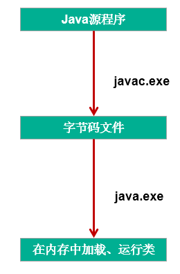

# day16授课笔记

讲师：宋红康

***

## 一、复习

- 接口（interface），与类（class）并列的结构

  - 让类去实现(implements)接口，同时需要重写（或实现）接口中的抽象方法

  - 类可以实现多个接口

  - 接口，体现的是一种规范。比如：Serializable：可序列化；Comparable：可比较大小的

    ```
    class String implements java.io.Serializable, Comparable
    ```

  - **接口，内部只能定义全局常量和抽象方法 ---jdk7及之前**

    - jdk8中，可以定义静态方法、默认方法
    - jdk9中，可以定义私有方法

  - 接口与实现类之间存在多态性

    - 比如：public void compare(Comparable c){}

- 内部类
  - 实际开发中，使用较少
  - 理解：内部类的分类：成员内部类、局部内部类
  - 如何实例化成员内部类
  - 在成员内部类中如何调用外部类的结构：**外部类.this.**外部类的结构
  - 局部内部类的使用：常常在方法内部提供接口的匿名实现类的对象。

- **题目：你是如何理解面向对象三大特征的？  ---> 你是如何理解面向对象编程思想的？**
  - 封装性：封装结构到类中；4种权限修饰符修饰类及类的内部结构，体现可见性的大小；举例
  - 继承性：继承性的好处；类的单继承性
  - 多态性：子类对象的多态性+虚方法调用；举例；如果没有多态性，抽象类和接口的声明就没有意义！
- **题目：“万事万物皆对象”，你是怎么理解的？**
  - 用java语言编写项目、描述客观世界，都需要由类派生的对象去刻画
  - 层次一：字符串：String，数值类型：包装类，日期：Date，。。。。
  - 层次二：文件：File；IP地址：InetAddress ； 具体网址：URL
  - 层次三：Java语言与其他语言的交互：XML 、数据库、。。

## 二、异常的概述与体系结构

```
在使用计算机语言进行项目开发的过程中，即使程序员把代码写得尽善尽美，在系统的运行过程中仍然会遇到一些问题，因为很多问题不是靠代码能够避免的，比如：客户输入数据的格式，读取文件是否存在，网络是否始终保持通畅等等。

```

```
java.lang.Throwable
 * 		|---- java.lang.Error:Java虚拟机无法解决的严重问题。
 * 				如：JVM系统内部错误、资源耗尽等严重情况。比如：StackOverflowError和OOM。一般不编写针对性的代码进行处理。

 * 		|---- java.lang.Exception:可以编写针对性的代码进行处理的
 * 			|----编译时异常:在执行javac.exe命令时出现的异常
 * 				|----IOException
 * 				|----FileNotFoundException
 * 				|----ClassNotFoundException
 * 			|----运行时异常(RuntimeException):在执行java.exe命令时出现的异常
 * 				|----NullPointerException
 * 				|----ArithmeticException
 * 				|----InputMismatchException
 * 				|----ArrayIndexOutOfBoundsException
 * 				|----ClassCastException
 * 				|----NumberFormatException
 * 

```

面试题：

```
面试题：你说说你在开发中常见的异常都有哪些？
```

再理解：




## 三、常见Error、Exception的举例

- 常见的Error

  ```java
  public class ErrorTest {
  	public static void main(String[] args) {
  		//java.lang.StackOverflowError
  //		main(args);
  		//java.lang.OutOfMemoryError
  		byte[] arr = new byte[1024 * 1024 * 1024];
  	}
  }
  ```

- 常见的运行时异常

```java

	
//	|----NullPointerException

	@Test
	public void test1(){
		String str1 = "atguigu.com";
		str1 = null;
		System.out.println(str1.charAt(0));
	}
//	|----ArithmeticException
	@Test
	public void test2(){
		int i = 10;
		int j = 0;
		System.out.println(i / j);
	}
//	|----InputMismatchException
	@Test
	public void test3(){
		Scanner scann = new Scanner(System.in);
		System.out.println("请输入一个整数：");
		int num = scann.nextInt();
		System.out.println(num);
	}
//	|----ArrayIndexOutOfBoundsException
	@Test
	public void test4(){
		int[] arr = new int[10];
		System.out.println(arr[-9]);
	}
//	|----StringIndexOutOfBoundsException
	@Test
	public void test5(){
		String info = "hello";
		System.out.println(info.charAt(-1));
	}
// 	|----ClassCastException
	@Test
	public void test6(){
		Object obj = new String("hello");
		Date date = (Date)obj;
	}
// 	|----NumberFormatException
	@Test
	public void test7(){
		String str = "123";
		str = "abc";
		int num = Integer.parseInt(str);
		System.out.println(num);
	}
	
```

- 常见的编译时异常

```java
//	|----IOException
//	|----FileNotFoundException
	@Test
	public void test8(){
//		File file = new File("hello.txt");
//		FileInputStream fis = new FileInputStream(file);//FileNotFoundException
//		int b = fis.read();//IOException
//		while(b != -1){
//			System.out.print((char)b);
//			b = fis.read();//IOException
//		}
//		
//		fis.close();//IOException
	}
	
//	|----ClassNotFoundException
	@Test
	public void test9(){
		//Class c = Class.forName("java.lang.String");//ClassNotFoundException
	}
```

## 四、异常Exception的处理

### 1.概述

```
 一、Java中异常处理有两种方式：
 * 	1.try-catch-finally
 * 	2.throws的方式
 * 
 * 二、 Java提供的是异常处理的抓抛模型。
 * 
 *  过程一："抛"
 *  	> 在程序执行过程中，一旦出现异常，就会在出现异常代码的位置生成一个相应异常类的对象，并将此对象
 *      向上抛出。
 *      
 *      > 异常对象一旦向上抛出，代码就不再继续向下执行。
 *  
 *  过程二："抓"
 * 		> 可以理解为异常对象的处理过程。
 * 		> 狭义上，理解为捕获异常，即为try-catch-finally的处理方法。
 * 		> 广义上，理解为异常处理的两种方式：try-catch-finally ； throws
 * 
```


### 2.处理方式一：try-catch-finally

```
异常处理方式一：try-catch-finally的使用
 * 
 * try{
 * 		//可能出现异常的代码
 * 
 * }catch(异常的类型1 变量名1){
 * 		//异常的处理方式1
 * }catch(异常的类型2 变量名2){
 * 		//异常的处理方式2
 * }...
 * 
 * finally{
 * 		//一定会被执行的代码
 * }
 * 
 * 说明：
 * 1. finally结构是可选的。
 * 2. 将可能出现异常的代码，使用try进行包裹，执行过程中，一旦生成异常对象，就将此对象抛出。在其后的catch中进行类型的匹配
 * 3. 一旦异常对象与相应的某个catch中的异常类型匹配，则进入catch结构执行异常处理的操作。一旦执行完异常处理的操作后，直接跳出
 * 当前的try-catch结构。并执行其后的代码
 * 4. 常见的异常处理的方式：
 * 		① 自定义输出的信息  ② 打印异常对象的message信息：getMessage()  ③ printStackTrace()
 * 
 * 5. 多个catch中的异常类型没有子父类关系，则谁先声明，谁后声明无所谓
 *    如果多个catch中的异常类型有子父类关系，则必须将子类异常声明在父类异常之前。否则报错。
 * 
 * 6. 在try中声明的变量，在出了try结构以后，不可被调用
 * 7. try-catch-finally结构是可以嵌套使用的
```

代码举例：

```java
@Test
	public void test2(){
		try{
			String str1 = "atguigu.com";
			str1 = null;
			System.out.println(str1.charAt(0));
		}catch(NullPointerException e){
			//异常的处理方式1
			System.out.println("不好意思，亲~出现了小问题，正在加紧解决...");
			
		}catch(ClassCastException e){
			//异常的处理方式2
			System.out.println("出现了类型转换的异常");
		}catch(RuntimeException e){
			//异常的处理方式3
			System.out.println("出现了运行时异常");
		}
		//此处的代码，在异常被处理了以后，是可以正常执行的
		System.out.println("hello");
	}
	
	@Test
	public void test3(){
		String str1 = null;
		try{
			str1 = "atguigu.com";
			str1 = null;
			System.out.println(str1.charAt(0));
		}catch(ClassCastException e){
			e.printStackTrace();
		}catch(NullPointerException e){
			System.out.println(e.getMessage());
//			e.printStackTrace();
		}catch(RuntimeException e){
			e.printStackTrace();
		}
		
		System.out.println(str1);
	}
	
	@Test
	public void test4(){
		try{
			int i = 10;
			int j = 0;
			System.out.println(i / j);
			
		}catch(ArithmeticException e){
			System.out.println(e.getMessage());//   / by zero
		}
	}
	
	@Test
	public void test5(){
		try{
			int[] arr = new int[10];
			System.out.println(arr[10]);
			
		}catch(ArrayIndexOutOfBoundsException e){
//			System.out.println(e.getMessage());// 10
			e.printStackTrace();
		}
	}
	
	@Test
	public void test6(){
		try{
			File file = new File("hello.txt");
			FileInputStream fis = new FileInputStream(file);//FileNotFoundException
			int b = fis.read();//IOException
			while(b != -1){
				System.out.print((char)b);
				b = fis.read();//IOException
			}
			//手动关闭资源
			fis.close();//IOException
			
		}catch(FileNotFoundException e){
			e.printStackTrace();
//			System.out.println("出现了文件找不到的异常");
		}catch(IOException e){
			e.printStackTrace();
		}
	}
```

体会：（重要）

```
 * 体会：
 * 1. 编译时异常一定要进行处理的， 否则编译不通过。如果在运行时没有出现异常，那就正常执行。如果出现异常，就按照异常处理的方案进行异常的处理。 ----> 使用异常处理的方式，相当于将一个编译时异常转换为了一个运行时可能出现的异常。
 * 2. 开发中，对于运行时异常，一般咱们都不会编写针对性的代码进行处理。
```

#### finally的使用

```
 * 1. finally是可选的
 * 
 * 2. 将一定会被执行的代码声明在finally中。换句话说，finally中的代码一定会被执行。
 *    不管try中是否有仍未被处理的异常，是否try中有return,catch中是否有return，finally中的
 *    代码都一定会被执行！
 * 
 * 3. 开发中，哪些代码需要声明在finally中呢？需要说动关闭的资源，比如：流资源、socket资源、数据库连接资源等，必须声明在finally中。
 * 
 * 面试题：区分 finalize、final、finally
 * 
 *  区分： == 和 equals()
```

```java
@Test
	public void test1(){
		try{
			int[] arr = new int[10];
			System.out.println(arr[-9]);
		}catch(ClassCastException e){
			e.printStackTrace();
		}finally{
			System.out.println("我一定会被执行");
		}
		
		System.out.println("我会被执行吗？");
	}
	
	public int method(){
		try{
			int[] arr = new int[10];
			System.out.println(arr[-9]);
			return 1;
		}catch(Exception e){
			e.printStackTrace();
			
			return 2;
		}finally{
			System.out.println("我一定会被执行！！");
			return 3;
		}
	}
	
	@Test
	public void testMethod(){
		int i = method();
		System.out.println(i);
	}
	
	@Test
	public void test2(){
		FileInputStream fis = null;
		try{
			File file = new File("hello1.txt");
			fis = new FileInputStream(file);//FileNotFoundException
			int b = fis.read();//IOException
			while(b != -1){
				System.out.print((char)b);
				b = fis.read();//IOException
			}
			
		}catch(IOException e){
			e.printStackTrace();
		}finally{
			try {
				if(fis != null)
					fis.close();//IOException
			} catch (IOException e) {
				e.printStackTrace();
			}
			
		}
	}
```


### 3.处理方式二：throws

说明：

```
 * 异常处理的方式二：使用"throws + 异常类型"，声明在方法的声明处
 * 
 * 1. 方法内根据可能产生的异常对象的类型，在方法的声明处使用throws的方法，抛出此异常的类型即可
 * 2. 使用了throws的方式处理异常，并没有根本上解决异常，只是将异常抛给方法的调用者。
 *    比如：method1()将异常抛给了method2()
```

代码示例：

```java
public class ThrowsTest {
	
	public static void main(String[] args) {
		ThrowsTest test = new ThrowsTest();
		test.method3();
	}
	
	public void method3(){
		try {
			method2();
		} catch (IOException e) {
			e.printStackTrace();
		}
		System.out.println("可以执行的代码");
	}
	
	public void method2()throws IOException{
		method1();
	}
	
	public void method1() throws FileNotFoundException,IOException{
		File file = new File("hello.txt");
		FileInputStream fis = new FileInputStream(file);//FileNotFoundException
		int b = fis.read();//IOException
		while(b != -1){
			System.out.print((char)b);
			b = fis.read();//IOException
		}
		
		fis.close();//IOException
	}
	
}
```

方法重写中关于throws异常类型的规定：

```java
/*
 * 方法的重写的要求：
 * 
 * 子类重写的方法throws的异常类型A 与父类被重写的方法的异常类型B的关系为：
 *  类型A可以与类型B相同，或者类型A是类型B的子类。
 * 
 * 
 * 
 */
public class OverrideTest {
	public static void main(String[] args) {
		SuperClass sub = new SubClass();
		
		try {
			sub.method(10);
		} catch (IOException e) {
			e.printStackTrace();
		}
		
	}
}

class SuperClass{
	
	public void method(int i)throws IOException{
		
	}
}

class SubClass extends SuperClass{
	
	public void method(int i)throws FileNotFoundException{
		
	}
}
```


### 4. 两种方式的对比

```
   1. 区分try-catch-finally 与  throws
 *  	try-catch-finally：从根本上将异常的对象进行了处理。throws并没有从根本上处理异常对象。
 
 * 2. 开发中， 如何选择异常处理的方式？
 *   > 如果父类被重写的方法没有声明异常类型，（即在方法声明处没有throws结构），则子类重写的方法内部如果有
 *     异常需要处理的话，一定要使用try-catch-finally
 *   > 如果程序中有一定要被执行的代码，则考虑使用try-catch-finally。比如：资源的关闭操作
 *   > 如果在方法1中依次调用方法2，方法3,...此时的方法2，3..方法中如果异常的话，建议使用throws的方法
 *     进行处理。在方法1中整体建议使用try-catch-finally的方式进行处理
```

## 五、手动创建异常对象并抛出：throw

```java
/*
 * 手动创建一个异常类的对象的测试：使用throw关键字
 * 
 * 在方法内部，可以使用“throw + 异常类的对象”的方式，生成一个异常对象的同时，并将此对象抛出。
 */

public class ThrowTest {
	public static void main(String[] args){
		Student s = new Student();
		try {
			s.regist(1001);
			s.regist(-1);
			System.out.println(s);
		} catch (Exception e) {
//			e.printStackTrace();
			System.out.println(e.getMessage());
		}
	}
}

class Student{
	private int id;
	
	public void regist(int id) throws Exception{
		if(id > 0){
			this.id = id;
		}else{
			//手动抛出一个异常类的对象
//			throw new RuntimeException("输入的id非法");
			throw new Exception("输入的id非法");
		}
	}

	@Override
	public String toString() {
		return "Student [id=" + id + "]";
	}
	
	
}
```

再举例：

```java
/*
 * 定义一个ComparableCircle类，继承Circle类并且实现CompareObject接口。
 * 在ComparableCircle类中给出接口中方法compareTo的实现体，用来比较两个圆的半径大小。
 */
public class ComparableCircle extends Circle implements CompareObject {

	
	public ComparableCircle() {
		super();
	}

	public ComparableCircle(double radius) {
		super(radius);
	}

	@Override
	public int compareTo(Object o) {
		if(o == this){
			return 0;
		}
		
		if(o instanceof ComparableCircle){
			ComparableCircle c = (ComparableCircle)o;

			return Double.compare(this.getRadius(), c.getRadius());
			
		}else{
			//形参o不是一个ComparableCircle类型的对象
			throw new RuntimeException("输入的类型不匹配");
		}
	}

}
```

## 六、自定义异常类

开发中，除了可以throw一个现成的异常类的对象之外，还可以throw一个自定义异常类的对象。

```java
/*
 * 
 * 用户自定义异常类
 * 
 * 要求：
 * 1. 继承于现有的异常体系结构
 * 2. 需要提供一个序列版本号：serialVersionUID
 * 3. 提供重载的构造器
 */
public class MyException extends Exception{
	
	static final long serialVersionUID = -70348976939L;
	
	public MyException(){
		
	}
	
	public MyException(String message){
		super(message);
	}
}
```

使用：

```java
public void regist(int id) throws MyException {
		if(id > 0){
			this.id = id;
		}else{
			//手动抛出一个异常类的对象
//			throw new RuntimeException("输入的id非法");
//			throw new Exception("输入的id非法");
			
//			throw new String("输入的id非法");//编译失败
			//抛出一个自定义的异常类的对象
			throw new MyException("输入的id非法");
		}
	}
```

## 七、小结


面试题： throw 和 throws的区别？

- 过程一：生成异常类的对象：① 自动生成  ② 手动生成：throw   -->排污

  过程二：异常处理：① try-catch-finally  ② throws  -->治污

- 二者声明的位置

练习题：

```java
public class ReturnExceptionDemo {
    static void methodA() {
        try {
            System.out.println("进入方法A");
            throw new RuntimeException("制造异常");
        }finally {
            System.out.println("用A方法的finally");
        }
    }

    static void methodB() {
        try {
            System.out.println("进入方法B");
            return;
        } finally {
            System.out.println("调用B方法的finally");
        }
    }
	public static void main(String[] args) {
    	try {
    	    methodA();
    	} catch (Exception e) {
   	   System.out.println(e.getMessage());
   	 }
    methodB();
  }
}

```

练习题：

```
编写应用程序EcmDef.java，接收命令行的两个参数，要求不能输入负数，计算两数相除。
	对数据类型不一致(NumberFormatException)、缺少命令行参数(ArrayIndexOutOfBoundsException、
  	除0(ArithmeticException)及输入负数(EcDef 自定义的异常)进行异常处理。
提示： 
	(1)在主类(EcmDef)中定义异常方法(ecm)完成两数相除功能。
	(2)在main()方法中使用异常处理语句进行异常处理。
	(3)在程序中，自定义对应输入负数的异常类(EcDef)。
	(4)运行时接受参数 java EcmDef 20 10   //args[0]=“20” args[1]=“10”
	(5)Interger类的static方法parseInt(String s)将s转换成对应的int值。
        如：int a=Interger.parseInt(“314”);	//a=314;

```

