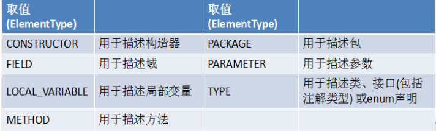
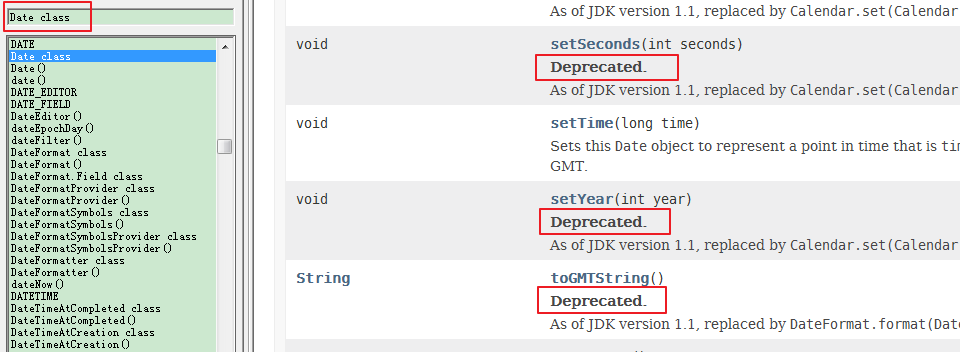
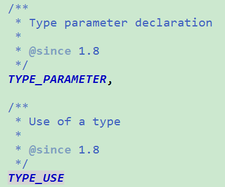

# day17授课笔记

讲师：宋红康

***

## 一、作业

代码阅读题：

```java
public class ReturnExceptionDemo {
	static void methodA() {
		try {
			System.out.println("进入方法A");
			throw new RuntimeException("制造异常");
		} finally {
			System.out.println("用A方法的finally");
		}
	}

	static void methodB() {
		try {
			System.out.println("进入方法B");
			return;
		} finally {
			System.out.println("调用B方法的finally");
		}
	}

	public static void main(String[] args) {
		try {
			methodA();
		} catch (Exception e) {
			System.out.println(e.getMessage());
		}
		
		methodB();
	}
}
```

答案：

```
进入方法A
用A方法的finally
制造异常
进入方法B
调用B方法的finally
```

编程题：

```
	编写应用程序EcmDef.java，接收命令行的两个参数，要求不能输入负数，计算两数相除。
	对数据类型不一致(NumberFormatException)、缺少命令行参数(ArrayIndexOutOfBoundsException、
  	除0(ArithmeticException)及输入负数(EcDef 自定义的异常)进行异常处理。
	提示： 
	(1)在主类(EcmDef)中定义异常方法(ecm)完成两数相除功能。
	(2)在main()方法中使用异常处理语句进行异常处理。
	(3)在程序中，自定义对应输入负数的异常类(EcDef)。
	(4)运行时接受参数 java EcmDef 20 10   //args[0]=“20” args[1]=“10”
	(5)Interger类的static方法parseInt(String s)将s转换成对应的int值。
        如：int a=Interger.parseInt(“314”);	//a=314;

```

答案：

```java
/**
 * @ClassName: EcDef
 * @Description: 自定义输入负数的异常类
 * @author Ralph
 * @date 2020年3月6日 下午10:33:28
 *
 */
class EcDef extends Exception {
	static final long serialVersionUID = -3387519931240229948L;

	
	public EcDef() {
		super();
	}

	public EcDef(String message) {
		super(message);
	}
}
```

```java
public class EcmDef {

	/**
	 * 
	 * @Description 使用异常语句处理异常
	 * @author shkstart
	 * @date 2020年3月7日上午9:01:21
	 * @param args
	 */
	public static void main(String[] args) {
		try {
			
			int i = Integer.parseInt(args[0]);
			int j = Integer.parseInt(args[1]);
			int result = ecm(i,j);
			
			System.out.println("运算结果为：" + result);
		} catch (NumberFormatException e) {
			System.out.println("数据类型不一致");
		} catch (EcDef e) {
			System.out.println(e.getMessage());
		} catch (ArithmeticException e) {
			System.out.println("除0");
		} catch (ArrayIndexOutOfBoundsException e) {
			System.out.println("缺少命令行参数");
		}
	}

	/**
	 * 
	 * @Description 定义异常方法完成两数相处功能
	 * @author shkstart
	 * @date 2020年3月7日上午9:01:35
	 * @param args
	 * @param args2
	 * @throws EcDef 
	 */
	public static int ecm(int i, int j) throws EcDef {
		
		if(i < 0 || j < 0){
			throw new EcDef("输入的数为负数了");
		}
		
		return i / j;
		
	}
}
```

## 二、复习

- 异常的体系结构
  - java.lang.Throwable
    - java.lang.Error：错误，不编写针对性的代码进行处理。StackOverflowError，OutOfMemoryError
    - java.lang.Exception：异常。需要考虑进行处理的。
- 常见的异常类：编译时异常（checked） vs 运行时异常（RuntimeException）
- **异常处理的方式一：try-catch-finally**
- **异常处理的方式二：throws + 异常类型1，异常类型2**
- 除了代码中自动生成异常对象之外，我们还可以手动创建一个异常对象，并手动throw出去。
- 用户自定义异常类

## 三、枚举类

### 1. 理解

```
 * 1. 枚举类的理解：类的对象只有有限个，确定的。则此类可以看做是枚举类。
 * 
 * 2. 举例：
 * 星期：Monday(星期一)、......、Sunday(星期天)
 * 性别：Man(男)、Woman(女)
 * 季节：Spring(春节)......Winter(冬天)
 * 支付方式：Cash（现金）、WeChatPay（微信）、Alipay(支付宝)、BankCard(银行卡)、CreditCard(信用卡)
 * 就职状态：Busy、Free、Vocation、Dimission
 * 订单状态：Nonpayment（未付款）、Paid（已付款）、Delivered（已发货）、Return（退货）、Checked（已确认）Fulfilled（已配货）
 * 线程状态：创建、就绪、运行、阻塞、死亡
 * 
 * 3. 当需要定义一组常量时，强烈建议使用枚举类
 * 4. 如果枚举类的对象只有一个，则枚举类可以看做单例模式的实现方式。
```

### 2. 如何自定义枚举类

```java
public class SeasonTest {
	public static void main(String[] args) {
		Season summer = Season.SUMMER;
		System.out.println(summer);
		System.out.println(summer.getSEASON_NAME());
		
	}
}

//自定义枚举类
class Season{
	
	//1. 声明每个对象拥有的属性:private final修饰
	private final String SEASON_NAME;
	private final String SEASON_DESC;
	
	//2. 私有化类的构造器
	private Season(String seasonName,String seasonDesc){
		this.SEASON_NAME = seasonName;
		this.SEASON_DESC = seasonDesc;
	}
	
	//3. 创建枚举类中的对象：public static final 
	public static final Season SPRING = new Season("春天","春暖花开");
	public static final Season SUMMER = new Season("夏天","夏日炎炎");
	public static final Season AUTUMN = new Season("秋天","秋高气爽");
	public static final Season WINTER = new Season("冬天","白雪皑皑");
	
	//4. 提供toString()
	@Override
	public String toString() {
		return "Season [SEASON_NAME=" + SEASON_NAME + ", SEASON_DESC=" + SEASON_DESC + "]";
	}

	public String getSEASON_NAME() {
		return SEASON_NAME;
	}

	public String getSEASON_DESC() {
		return SEASON_DESC;
	}
	
	
}
```

### 3. 使用enum关键字定义枚举类

```java
//使用enum关键字定义枚举类
enum Season1 implements Info{
	//1. 创建枚举类中的对象,声明在enum枚举类的首位
	SPRING("春天","春暖花开"),
	SUMMER("夏天","夏日炎炎"),
	AUTUMN("秋天","秋高气爽"),
	WINTER("冬天","白雪皑皑");
	
	//2. 声明每个对象拥有的属性:private final修饰
	private final String SEASON_NAME;
	private final String SEASON_DESC;
	
	//3. 私有化类的构造器
	private Season1(String seasonName,String seasonDesc){
		this.SEASON_NAME = seasonName;
		this.SEASON_DESC = seasonDesc;
	}
	

	public String getSEASON_NAME() {
		return SEASON_NAME;
	}

	public String getSEASON_DESC() {
		return SEASON_DESC;
	}


	@Override
	public void show() {
		System.out.println("这是一个美好的季节！");
	}
	
	
}
```

### 4. java.lang.Enum类中的常用方法

```
 * 		toString():返回当前枚举类对象的对象名
 * 		values():返回当前枚举类中所有对象构成的数组
 * 		valueOf(String name):返回指定name名称的枚举类的对象
```

```java
public class SeasonTest1 {
	public static void main(String[] args) {
		Season1 summer = Season1.SUMMER;
		//toString():返回当前枚举类对象的对象名
		System.out.println(summer.toString());
		
		System.out.println(Season1.class.getSuperclass());//class java.lang.Enum
		
		
		//values():返回当前枚举类中所有对象构成的数组
		Season1[] seasons = Season1.values();
		for(int i = 0;i < seasons.length;i++){
			System.out.println(seasons[i]);
			seasons[i].show();
		}
		
		//valueOf(String name):返回指定name名称的枚举类的对象
		String name = "AUTUMN";
		Season1 s1 = Season1.valueOf(name);
		System.out.println(s1);//AUTUMN
		
		name = "AUTUMN1";
		//如果枚举类中不存在指定名称的枚举类对象，则报java.lang.IllegalArgumentException。
//		Season1 s2 = Season1.valueOf(name);
//		System.out.println(s2);
		
	}
}
```

### 5. 枚举类实现接口中的方法

```java
interface Info{
	void show();
}

//使用enum关键字定义枚举类
enum Season1 implements Info{
	//1. 创建枚举类中的对象,声明在enum枚举类的首位
	SPRING("春天","春暖花开"){
		public void show(){
			System.out.println("春天在哪里？");
		}
	},
	SUMMER("夏天","夏日炎炎"){
		public void show(){
			System.out.println("宁静的夏天");
		}
	},
	AUTUMN("秋天","秋高气爽"){
		public void show(){
			System.out.println("秋天是用来分手的季节");
		}
	},
	WINTER("冬天","白雪皑皑"){
		public void show(){
			System.out.println("2002年的第一场雪");
		}
	};
	
	//2. 声明每个对象拥有的属性:private final修饰
	private final String SEASON_NAME;
	private final String SEASON_DESC;
	
	//3. 私有化类的构造器
	private Season1(String seasonName,String seasonDesc){
		this.SEASON_NAME = seasonName;
		this.SEASON_DESC = seasonDesc;
	}
	

	public String getSEASON_NAME() {
		return SEASON_NAME;
	}

	public String getSEASON_DESC() {
		return SEASON_DESC;
	}

	
}
```


## 四、注解(Annotation)

### 1. 注解的理解

```
 * 1. Annotation,是jdk5.0新增的特性
 * 2. 理解：
 * Annotation 其实就是代码里的特殊标记, 这些标记可以在编译, 类加载, 运行时被读取, 
 * 并执行相应的处理。通过使用 Annotation, 程序员可以在不改变原有逻辑的情况下, 在源文件
 * 中嵌入一些补充信息。
```

### 2. 注解的应用举例

```
   示例一：生成文档相关的注解
 * 	@author 标明开发该类模块的作者，多个作者之间使用,分割
 *  @version 标明该类模块的版本
 *  @see 参考转向，也就是相关主题
 *  @since 从哪个版本开始增加的
 * 
 * 示例二：在编译时进行格式检查(JDK内置的三个基本注解)
 * @Override: 限定重写父类方法, 该注解只能用于方法
 * @Deprecated: 用于表示所修饰的元素(类, 方法等)已过时。通常是因为所修饰的结构危险或存在更好的选择
 * @SuppressWarnings: 抑制编译器警告
 * 
 * 示例三：跟踪代码依赖性，实现替代配置文件功能
```

### 3. java基础阶段常见的三个注解

```
 * 	@Override: 限定重写父类方法, 该注解只能用于方法
 *  @Deprecated: 用于表示所修饰的元素(类, 方法等)已过时。通常是因为所修饰的结构危险或存在更好的选择
 *  			 标识为过时的结构，虽然还可以在程序中使用，但是不建议使用。
 *  @SuppressWarnings: 抑制编译器警告
```

```java
public class AnnotationTest {
	
	public static void main(String[] args) {
		Person p = new Student();
		p.walk();
		
		@SuppressWarnings("deprecation")
		Date date = new Date(2020 - 1900,3 - 1,4);
		System.out.println(date);//Wed Mar 04 00:00:00 GMT+08:00 2020
		
		p.eat();
		
		@SuppressWarnings("unused")
		int num = 10;
//		System.out.println(num);
		
		@SuppressWarnings({ "rawtypes", "unused" })
		List list = new ArrayList();
	}
}


class Person{
	@Deprecated
	public void eat(){
		System.out.println("人吃饭");
	}
	public void walk(){
		System.out.println("人走路");
	}
	
}

class Student extends Person{
	
	@Override
	public void walk() {
		super.walk();
	}
}
```

### 4. 如何自定义注解

```
如何自定义注解（了解）
 * 		参照@SuppressWarnings定义
 * 	   ① 使用@interface来声明
 *     ② 内部可以声明属性，属性类型限于：八种基本数据类型、String类型、Class类型、enum类型、Annotation类型、以上所有类型的数组
 *     ③ 如果注解内部不定义任何属性，则称为标识注解
 *     ④ 属性可以声明默认值，使用default定义
 * 
 *   说明：要想自定义的注解在使用在相关结构的位置上起作用，必须结合后面的反射。通过反射获取相应的注解及注解上的属性的值，进行必要的操作。
 * 
```

```java
public @interface MyAnnotation {
	String value() default "atguigu";
}
```

使用自定义的注解：

```java
@MyAnnotation
class Person{
	
	@Deprecated
	public void eat(){
		System.out.println("人吃饭");
	}
	
	@MyAnnotation(value="hello")
	public void walk(){
		System.out.println("人走路");
	}
	
}
```


### 5. 元注解

用于修饰现有注解的注解，就称为元注解

- Retention：用于指定该 Annotation 的生命周期	
   - SOURCE:编译不保留  ； CLASS(默认行为):编译保留，运行不保留；RUNTIME:编译保留，运行也保留

 - Target：用于指定被修饰的 Annotation 能用于修饰哪些程序元素。 

   

 - Documented：用于指定被该元 Annotation 修饰的 Annotation 类将被 javadoc 工具提取成文档

 - Inherited：被它修饰的 Annotation 将具有继承性。

   > 说明：一般注解都会提供两个元注解： 	@Retention，@Target。	

举例：

```java
import static java.lang.annotation.ElementType.CONSTRUCTOR;
import static java.lang.annotation.ElementType.FIELD;
import static java.lang.annotation.ElementType.LOCAL_VARIABLE;
import static java.lang.annotation.ElementType.METHOD;
import static java.lang.annotation.ElementType.PARAMETER;
import static java.lang.annotation.ElementType.TYPE;

import java.lang.annotation.Inherited;
import java.lang.annotation.Retention;
import java.lang.annotation.RetentionPolicy;
import java.lang.annotation.Target;

@Target({TYPE, FIELD, METHOD, PARAMETER, CONSTRUCTOR, LOCAL_VARIABLE})
@Retention(RetentionPolicy.RUNTIME)
@Inherited
public @interface MyAnnotation {
	String value() default "atguigu";
}
```

```java
@Target({TYPE, FIELD, METHOD, PARAMETER, CONSTRUCTOR, LOCAL_VARIABLE})
@Retention(RetentionPolicy.SOURCE)
public @interface SuppressWarnings {
    String[] value();
}
```

```java
@Documented
@Retention(RetentionPolicy.RUNTIME)
@Target(value={CONSTRUCTOR, FIELD, LOCAL_VARIABLE, METHOD, PACKAGE, PARAMETER, TYPE})
public @interface Deprecated {
}
```



### 6. 如何通过反射获取注解的信息（放到反射章节再讲）

​	前提：要求当前注解的生命周期为：RUNTIME


### 7. jdk8注解新特性（了解）

- 重复注解

  ```java
  import static java.lang.annotation.ElementType.CONSTRUCTOR;
  import static java.lang.annotation.ElementType.FIELD;
  import static java.lang.annotation.ElementType.LOCAL_VARIABLE;
  import static java.lang.annotation.ElementType.METHOD;
  import static java.lang.annotation.ElementType.PARAMETER;
  import static java.lang.annotation.ElementType.TYPE;
  
  import java.lang.annotation.Retention;
  import java.lang.annotation.RetentionPolicy;
  import java.lang.annotation.Target;
  
  @Target({TYPE, FIELD, METHOD, PARAMETER, CONSTRUCTOR, LOCAL_VARIABLE})
  @Retention(RetentionPolicy.RUNTIME)
  public @interface MyAnnotations {
  	MyAnnotation[] value();
  }
  ```

  ```java
  @Repeatable(MyAnnotations.class)
  @Target({TYPE, FIELD, METHOD, PARAMETER, CONSTRUCTOR, LOCAL_VARIABLE})
  @Retention(RetentionPolicy.RUNTIME)
  public @interface MyAnnotation {
  	String value() default "atguigu";
  }
  
  ```

  ```java
  //旧的写法
  //@MyAnnotations({@MyAnnotation,@MyAnnotation(value="abc")})
  //新的写法
  @MyAnnotation(value="abc")
  @MyAnnotation
  class Person{
  }
  ```

- 类型注解

  在Target的属性可以赋值为：

  

修改MyAnntation可以修饰的结构：

```java
@Repeatable(MyAnnotations.class)
@Target({TYPE, FIELD, METHOD, PARAMETER, CONSTRUCTOR, LOCAL_VARIABLE,TYPE_PARAMETER,TYPE_USE})
@Retention(RetentionPolicy.RUNTIME)
public @interface MyAnnotation {
	String value() default "atguigu";
}
```

测试：

```java
public class AnnotationTest {
	
	public <@MyAnnotation T> void method(T t){
		
		int a  = (@MyAnnotation int)2L;
	}
}
```

