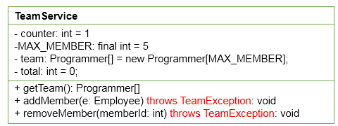

# day18授课笔记

## 一、复习

- 枚举类
  - 以后大家在项目中，需要定义一组常量时，建议使用枚举类！
  - 两种定义方式：① 自定义方式  **② 使用enum关键字定义（jdk5.0)**
  - 使用enum关键字定义的枚举类默认继承于java.lang.Enum类
    - 常用方法：toString()、values()、valueOf(String name)
  - 枚举类各个对象实现接口中的方法

- 注解(annotation)
  - JavaSE部分常用的三个注解：@Override   @Deprecated @SuppressWarnings
  - 体会：框架 = 注解 + 反射 + 设计模式
  - 元注解：用来修饰现有的注解结构的注解
    - Retention、Target等

## 二、项目：开发团队人员调度软件

### 1. 项目的架构


### 2. com.atguigu.domain包的结构

#### 2.1 Equipment接口及其实现类


```
/**
 * 
 * @Description 设备接口
 * @author shkstart  Email:shkstart@126.com
 * @version 
 * @date 2020年3月7日下午4:36:52
 *
 */
public interface Equipment {
	String getDescription();
}
```

```
/**
 * 
 * @Description 个人电脑
 * @author shkstart  Email:shkstart@126.com
 * @version 
 * @date 2020年3月7日下午4:42:10
 *
 */
public class PC implements Equipment {
	
	private String model;//机器的型号
	private String display;//显示器的名称
	
	@Override
	public String getDescription() {
		return model + "(" + display + ")";
	}

	public PC() {
		super();
	}

	public PC(String model, String display) {
		super();
		this.model = model;
		this.display = display;
	}

	public String getModel() {
		return model;
	}

	public void setModel(String model) {
		this.model = model;
	}

	public String getDisplay() {
		return display;
	}

	public void setDisplay(String display) {
		this.display = display;
	}
	
	

}
```

```
/**
 * 
 * @Description 打印机
 * @author shkstart  Email:shkstart@126.com
 * @version 
 * @date 2020年3月7日下午4:42:10
 *
 */
public class Printer implements Equipment {
	private String name;//产品的名称
	private String type;//机器的类型

	@Override
	public String getDescription() {
		return name + "(" + type + ")";
	}

	public Printer() {
		super();
	}

	public Printer(String name, String type) {
		super();
		this.name = name;
		this.type = type;
	}

	public String getName() {
		return name;
	}

	public void setName(String name) {
		this.name = name;
	}

	public String getType() {
		return type;
	}

	public void setType(String type) {
		this.type = type;
	}

}
```

```
/**
 * 
 * @Description 笔记本
 * @author shkstart  Email:shkstart@126.com
 * @version 
 * @date 2020年3月7日下午4:42:10
 *
 */
public class NoteBook implements Equipment {
	private String model;//机器的型号
	private double price;//机器的价格
	
	@Override
	public String getDescription() {
		return model + "(" + price + ")";
	}

	public NoteBook() {
		super();
	}

	public NoteBook(String model, double price) {
		super();
		this.model = model;
		this.price = price;
	}

	public String getModel() {
		return model;
	}

	public void setModel(String model) {
		this.model = model;
	}

	public double getPrice() {
		return price;
	}

	public void setPrice(double price) {
		this.price = price;
	}

}
```

#### 2.2 Employee及其子类


```
/**
 * 
 * @Description 员工类
 * @author shkstart  Email:shkstart@126.com
 * @version 
 * @date 2020年3月7日下午4:44:14
 *
 */
public class Employee {
	private int id;//ID
	private String name;//姓名
	private int age;//年龄
	private double salary;//工资
	public Employee() {
		super();
	}
	public Employee(int id, String name, int age, double salary) {
		super();
		this.id = id;
		this.name = name;
		this.age = age;
		this.salary = salary;
	}
	public int getId() {
		return id;
	}
	public void setId(int id) {
		this.id = id;
	}
	public String getName() {
		return name;
	}
	public void setName(String name) {
		this.name = name;
	}
	public int getAge() {
		return age;
	}
	public void setAge(int age) {
		this.age = age;
	}
	public double getSalary() {
		return salary;
	}
	public void setSalary(double salary) {
		this.salary = salary;
	}
	@Override
	public String toString() {
		return getDetails();
	}
	
	public String getDetails(){
		return id + "\t" + name + "\t" + age + "\t" + salary;
	}
	
}
```

```
package com.atguigu.team.domain;

import com.atguigu.team.service.Status;

/**
 * 
 * @Description 程序员类
 * @author shkstart Email:shkstart@126.com
 * @version
 * @date 2020年3月7日下午4:46:34
 *
 */
public class Programmer extends Employee {
	private int memberId;// 团队编号
	private Status status = Status.FREE;
	private Equipment equipment;// 员工领用的设备

	public Programmer() {
		super();
	}

	public Programmer(int id, String name, int age, double salary, Equipment equipment) {
		super(id, name, age, salary);
		this.equipment = equipment;
	}

	public Status getStatus() {
		return status;
	}

	public void setStatus(Status status) {
		this.status = status;
	}

	public Equipment getEquipment() {
		return equipment;
	}

	public void setEquipment(Equipment equipment) {
		this.equipment = equipment;
	}

	public int getMemberId() {
		return memberId;
	}
	

	public void setMemberId(int memberId) {
		this.memberId = memberId;
	}

	@Override
	public String toString() {
		return getDetails() + "\t程序员\t" + status + "\t\t\t" + equipment.getDescription();
	}
	
	public String getTeamDetails(){
		return  getBaseTeamDetails() + "程序员";
	}
	
	public String getBaseTeamDetails(){
		return memberId + "/" + getId() + "\t" + getName() + "\t" 
				+ getAge() + "\t" + getSalary() + "\t";
	}
}

```

```
package com.atguigu.team.domain;


/**
 * 
 * @Description 设计师类
 * @author shkstart  Email:shkstart@126.com
 * @version 
 * @date 2020年3月7日下午4:52:18
 *
 */
public class Designer extends Programmer {
	private double bonus;//奖金

	public Designer() {
		super();
	}

	public Designer(int id, String name, int age, double salary, Equipment equipment,double bonus) {
		super(id, name, age, salary, equipment);
		this.bonus = bonus;
	}

	public double getBonus() {
		return bonus;
	}

	public void setBonus(double bonus) {
		this.bonus = bonus;
	}
	
	@Override
	public String toString() {
		return getDetails() + "\t设计师\t" + getStatus() + "\t" + bonus + "\t\t" + getEquipment().getDescription();
	}
	
	public String getTeamDetails(){
		return getBaseTeamDetails() + "设计师\t" + getBonus();
	}
}

```

```
package com.atguigu.team.domain;

/**
 * 
 * @Description 架构师
 * @author shkstart Email:shkstart@126.com
 * @version
 * @date 2020年3月7日下午4:53:49
 *
 *       产品设计-开发流程： 产品经理 -> UI设计师 ---> 开发部 ---> 测试部 ---> 运营部
 */
public class Architect extends Designer {
	private int stock;// 股票

	public Architect() {
		super();
	}

	public Architect(int id, String name, int age, double salary, Equipment equipment, double bonus, int stock) {
		super(id, name, age, salary, equipment, bonus);
		this.stock = stock;
	}

	public int getStock() {
		return stock;
	}

	public void setStock(int stock) {
		this.stock = stock;
	}
	@Override
	public String toString() {
		return getDetails() + "\t架构师\t" + getStatus() + "\t" + getBonus() + "\t" + stock + "\t" + getEquipment().getDescription();
	}
	
	public String getTeamDetails(){
		return getBaseTeamDetails()+ "架构师\t" + getBonus() + "\t" + getStock();
	}
}

```

其中，员工状态是一个枚举类：

```
/*
 * Status是项目service包下自定义的枚举类，表示成员的状态。
		FREE-空闲
		BUSY-已加入开发团队
		VOCATION-正在休假

 */
/**
 * 
 * @Description 公司员工的状态
 * @author shkstart  Email:shkstart@126.com
 * @version 
 * @date 2020年3月7日下午4:48:43
 *
 */
public enum Status {
	FREE,BUSY,VOCATION;
}
```


### 3. com.atguigu.service.NameListService


前提：Data.java

```
public class Data {
    public static final int EMPLOYEE = 10;
    public static final int PROGRAMMER = 11;
    public static final int DESIGNER = 12;
    public static final int ARCHITECT = 13;

    public static final int PC = 21;
    public static final int NOTEBOOK = 22;
    public static final int PRINTER = 23;

    //Employee  :  10, id, name, age, salary
    //Programmer:  11, id, name, age, salary
    //Designer  :  12, id, name, age, salary, bonus
    //Architect :  13, id, name, age, salary, bonus, stock
    public static final String[][] EMPLOYEES = {
        {"10", "1", "马云", "22", "3000"},
        {"13", "2", "马化腾", "32", "18000", "15000", "2000"},
        {"11", "3", "李彦宏", "23", "7000"},
        {"11", "4", "刘强东", "24", "7300"},
        {"12", "5", "雷军", "28", "10000", "5000"},
        {"11", "6", "任志强", "22", "6800"},
        {"12", "7", "柳传志", "29", "10800","5200"},
        {"13", "8", "杨元庆", "30", "19800", "15000", "2500"},
        {"12", "9", "史玉柱", "26", "9800", "5500"},
        {"11", "10", "丁磊", "21", "6600"},
        {"11", "11", "张朝阳", "25", "7100"},
        {"12", "12", "杨致远", "27", "9600", "4800"}
    };
    
    //如下的EQUIPMENTS数组与上面的EMPLOYEES数组元素一一对应
    //PC      :21, model, display
    //NoteBook:22, model, price
    //Printer :23, name, type 
    public static final String[][] EQUIPMENTS = {
        {},
        {"22", "联想T4", "6000"},
        {"21", "戴尔", "NEC17寸"},
        {"21", "戴尔", "三星 17寸"},
        {"23", "佳能 2900", "激光"},
        {"21", "华硕", "三星 17寸"},
        {"21", "华硕", "三星 17寸"},
        {"23", "爱普生20K", "针式"},
        {"22", "惠普m6", "5800"},
        {"21", "戴尔", "NEC 17寸"},
        {"21", "华硕","三星 17寸"},
        {"22", "惠普m6", "5800"}
    };
}
```

**实现NameListService类：（重点）**

```
/**
 * 
 * @Description 负责将Data中的数据封装到Employee[]数组中，同时提供相关操作Employee[]的方法。
 * @author shkstart  Email:shkstart@126.com
 * @version 1.0
 * @date 2020年3月9日上午9:23:03
 *
 */
public class NameListService {

	private Employee[] employees;//保存公司所有员工对象

	
	public NameListService(){
//		根据项目提供的Data类构建相应大小的employees数组
		employees = new Employee[EMPLOYEES.length];
//		再根据Data类中的数据构建不同的对象，包括Employee、Programmer、Designer和Architect对象，以及相关联的Equipment子类的对象
//		将对象存于数组中
		for(int i = 0;i < employees.length;i++){
			//获取员工的类型
			int type = Integer.parseInt(EMPLOYEES[i][0]);
			//获取每个员工都具备的4个基本信息
			int id = Integer.parseInt(EMPLOYEES[i][1]);
			String name = EMPLOYEES[i][2];
			int age = Integer.parseInt(EMPLOYEES[i][3]);
			double salary = Double.parseDouble(EMPLOYEES[i][4]);
			
			Equipment equipment;
			double bonus;
			int stock;
			
			switch(type){
			case EMPLOYEE:
				employees[i] = new Employee(id, name, age, salary);
				break;
			case PROGRAMMER:
				equipment = createEquipment(i);
				employees[i] = new Programmer(id, name, age, salary, equipment);
				break;
			case DESIGNER:
				equipment = createEquipment(i);
				bonus = Double.parseDouble(EMPLOYEES[i][5]);
				employees[i] = new Designer(id, name, age, salary, equipment, bonus);
				break;
			case ARCHITECT:
				equipment = createEquipment(i);
				bonus = Double.parseDouble(EMPLOYEES[i][5]);
				stock = Integer.parseInt(EMPLOYEES[i][6]);
				employees[i] = new Architect(id, name, age, salary, equipment, bonus, stock);
				break;
			}
		}
	}
	
	/**
	 * 
	 * @Description 返回指定索引位置上的设备
	 * @author shkstart
	 * @date 2020年3月9日上午9:49:11
	 * @param index
	 * @return
	 */
	private Equipment createEquipment(int index) {
		int type = Integer.parseInt(EQUIPMENTS[index][0]);
		String modelOrName = EQUIPMENTS[index][1];
		
		switch(type){
		case PC:
			String display = EQUIPMENTS[index][2];
			return new PC(modelOrName, display);
		case NOTEBOOK:
			double price = Double.parseDouble(EQUIPMENTS[index][2]);
			return new NoteBook(modelOrName, price);
		case PRINTER:
			String equipType = EQUIPMENTS[index][2];
			return new Printer(modelOrName, equipType);
		}
		return null;
	}

	/**
	 * 
	 * @Description 获取当前所有员工。
	 * @author shkstart
	 * @date 2020年3月9日上午9:25:25
	 * @return 所有员工构成的数组
	 */
	public Employee[] getAllEmployees(){
		
		return employees;
	}
	/**
	 * 
	 * @Description 返回指定id的Employee
	 * @author shkstart
	 * @date 2020年3月9日上午9:25:49
	 * @param id
	 * @return
	 * @throws TeamException 
	 */
	public Employee getEmployee(int id) throws TeamException{
		for(int i = 0;i < employees.length;i++){
			if(id == employees[i].getId()){
				return employees[i];
			}

		}
//		return null;
		throw new TeamException("找不到指定的员工");
	}
}
```

其中，异常类TeamException定义如下：

```
package com.atguigu.team.service;

public class TeamException extends Exception {

	static final long serialVersionUID = -3387524229948L;

	public TeamException() {
	}

	public TeamException(String message) {
		super(message);
	}

}

```

### 4. com.atguigu.team.TeamService



具体实现：（重点）

```
/**
 * 
 * @Description 关于开发团队成员的管理：查询、添加、删除
 * @author shkstart  Email:shkstart@126.com
 * @version 
 * @date 2020年3月9日上午10:38:41
 *
 */
public class TeamService {
	
	private static int counter = 1;//用于开发团队成员新增成员自动生成唯一的ID
	private final int MAX_MEMBER = 5;//开发团队人数的上限
	private Programmer[] team = new Programmer[MAX_MEMBER];//保存开发团队成员的数组
	private int total;//记录团队成员的实际人数
	
	/**
	 * 
	 * @Description 返回当前开发团队成员构成的数组
	 * @author shkstart
	 * @date 2020年3月9日上午10:45:05
	 * @return
	 */
	public Programmer[] getTeam(){
//		if(total == 0){
//			return null;
//		}
		
		Programmer[] team = new Programmer[total];
		for(int i = 0;i < total;i++){
			team[i] = this.team[i];
		}
		return team;
	}
	
	/**
	 * 
	 * @Description 将指定的员工e添加到当前开发团队中
	 * @author shkstart
	 * @date 2020年3月9日上午10:45:37
	 * @param e
	 * @throws TeamException 
	 */
	public void addMember(Employee e) throws TeamException{
//		成员已满，无法添加
		if(total >= MAX_MEMBER){
			throw new TeamException("成员已满，无法添加");
		}
//		该成员不是开发人员，无法添加
		if(!(e instanceof Programmer)){
			throw new TeamException("该成员不是开发人员，无法添加");
		}
//		该员工已在本开发团队中
		if(isExist(e)){
			throw new TeamException("该员工已在本开发团队中");
		}
//		该员工已是某团队成员 
//		该员正在休假，无法添加
		Programmer p = (Programmer) e;
		switch(p.getStatus()){
		case BUSY:
			throw new TeamException("该员工已是某团队成员 ");
		case VOCATION:
			throw new TeamException("该员正在休假，无法添加 ");
		}
		//先获取当前team团队中架构师、设计师、程序员的人员比例
		int numOfArch = 0,numOfDesn = 0,numOfProg = 0;
		for(int i = 0;i < total;i++){
			Programmer pro = team[i];
			if(pro instanceof Architect){
				numOfArch++;
			}else if(pro instanceof Designer){
				numOfDesn++;
			}else{
				numOfProg++;
			}
		}
		
//		团队中至多只能有一名架构师
//		团队中至多只能有两名设计师
//		团队中至多只能有三名程序员
		if(p instanceof Architect){
			if(numOfArch >= 1){
				throw new TeamException("团队中至多只能有一名架构师");
			}
		}else if(p instanceof Designer){
			if(numOfDesn >= 2){
				throw new TeamException("团队中至多只能有两名设计师");
			}
		}else{
			if(numOfProg >= 3){
				throw new TeamException("团队中至多只能有三名程序员");
			}
		}
		//错误的
//		if(p instanceof Architect && numOfArch >= 1){
//			throw new TeamException("团队中至多只能有一名架构师");
//		}else if(p instanceof Designer && numOfDesn >= 2){
//			throw new TeamException("团队中至多只能有两名设计师");
//		}else if(p instanceof Programmer && numOfProg >= 3){
//			throw new TeamException("团队中至多只能有三名程序员");
//		}
		
		
		//如果代码能够到此为止，证明p可以添加到当前team中
		team[total++] = p;
		p.setStatus(Status.BUSY);
		p.setMemberId(counter++);
		
	}
	
	/**
	 * 
	 * @Description 判断员工e是否已经存在于当前开发团队中
	 * @author shkstart
	 * @date 2020年3月9日上午10:54:43
	 * @param e
	 * @return
	 */
	private boolean isExist(Employee e){
		
		for(int i = 0;i < total;i++){
			if(team[i].getId() == e.getId()){
				return true;
			}
		}
		
		return false;
	}
	
	/**
	 * 
	 * @Description 根据给定的memberId，删除开发团队中指定的员工
	 * @author shkstart
	 * @date 2020年3月9日上午10:46:07
	 * @param memberId
	 * @throws TeamException 
	 */
	public void removeMember(int memberId) throws TeamException{
		int i = 0;
		for(;i < total;i++){
			
			if(memberId == team[i].getMemberId()){//针对找到此员工的情况，修改其相关属性
				team[i].setStatus(Status.FREE);
//				team[i].setMemberId(0);//可以操作，也可以不操作
				break;
			}
			
		}
		//未找到的情况：
		if(i == total){
			throw new TeamException("找不到指定memberId的员工，删除失败");
		}
		
		//如果找到了此员工的情况：
		for(int j = i;j < total - 1;j++){
			team[j] = team[j + 1];
		}
		//方式一：
//		team[total - 1] = null;//最后一个员工的位置置空
//		total--;
		//方式二：
		team[--total] = null;//最后一个员工的位置置空
	}
}
```

### 5. com.atguigu.view.TeamView

#### 5.1 架构：

```
public class TeamView {
	
	private NameListService listSvc = new NameListService();
	private TeamService teamSvc = new TeamService();
	
	/**
	 * 
	 * @Description 进入主界面的方法
	 * @author shkstart
	 * @date 2020年3月9日上午11:50:04
	 */
	public void enterMainMenu(){
		boolean isLoop = true;
		char menu = 0;
		while(isLoop){
			if(menu != '1'){
                listAllEmployees();
			}
			System.out.print("1-团队列表  2-添加团队成员  3-删除团队成员 4-退出   请选择(1-4)：");
			menu = TSUtility.readMenuSelection();
			switch(menu){
			case '1':
				getTeam();
				break;
			case '2':
				addMember();
				break;
			case '3':
				deleteMember();
				break;
			case '4':
				//当满足某个条件时，修改isLoop的值，退出循环
				System.out.print("确认是否退出(Y/N)：");
				char isExit = TSUtility.readConfirmSelection();
				if(isExit == 'Y'){
					isLoop = false;
				}
				
			}
			
			
		}
		
	}
	
	/**
	 * 
	 * @Description 显示所有的员工列表
	 * @author shkstart
	 * @date 2020年3月9日上午11:50:34
	 */
	private void listAllEmployees(){
		System.out.println("显示公司员工的基本信息");
	}
	/**
	 * 
	 * @Description 获取并显示开发团队的信息
	 * @author shkstart
	 * @date 2020年3月9日上午11:50:59
	 */
	private void getTeam(){
		System.out.println("获取并显示开发团队的信息");
	}
	/**
	 * 
	 * @Description 添加员工到开发团队的操作
	 * @author shkstart
	 * @date 2020年3月9日上午11:51:30
	 */
	private void addMember(){
		System.out.println("添加员工到开发团队的操作");
	}
	/**
	 * 
	 * @Description 删除开发团队中员工的操作
	 * @author shkstart
	 * @date 2020年3月9日上午11:51:56
	 */
	private void deleteMember(){
		System.out.println("删除开发团队中员工的操作");
	}
	public static void main(String[] args) {
		TeamView view = new TeamView();
		view.enterMainMenu();
	}
}
```

#### 5.2 显示所有公司员工

```
/**
	 * 
	 * @Description 显示所有的员工列表
	 * @author shkstart
	 * @date 2020年3月9日上午11:50:34
	 */
	private void listAllEmployees(){
		System.out.println("-------------------------------开发团队调度软件--------------------------------\n");
		
		//ID	姓名	年龄	工资	职位	状态	奖金	股票	领用设备
		System.out.println("ID\t姓名\t年龄\t工资\t职位\t状态\t奖金\t股票\t领用设备");
		Employee[] emps = listSvc.getAllEmployees();
		for(int i = 0;i < emps.length;i++){
			System.out.println(emps[i]);
		}
		System.out.println("-------------------------------------------------------------------------------");
	}
```


#### 5.3 显示开发团队成员

```
/**
	 * 
	 * @Description 获取并显示开发团队的信息
	 * @author shkstart
	 * @date 2020年3月9日上午11:50:59
	 */
	private void getTeam(){
//		System.out.println("获取并显示开发团队的信息");
		System.out.println("--------------------团队成员列表---------------------\n");
		Programmer[] team = teamSvc.getTeam();
		//情况一：开发团队目前没有成员！
		if(team == null || team.length == 0){
			System.out.println("开发团队目前没有成员！");
		}else{//情况二：TID/ID	姓名	年龄	工资	职位	奖金	股票
			System.out.println("TID/ID\t姓名\t年龄\t工资\t职位\t奖金\t股票");
			for(int i = 0;i < team.length;i++){
				System.out.println(team[i].getTeamDetails());
			}
		}
		
		System.out.println("-----------------------------------------------------");
	}
```


#### 5.4 添加团队成员

```
/**
	 * 
	 * @Description 添加员工到开发团队的操作
	 * @author shkstart
	 * @date 2020年3月9日上午11:51:30
	 */
	private void addMember(){
//		System.out.println("添加员工到开发团队的操作");
		System.out.println("---------------------添加成员---------------------");
		System.out.print("请输入要添加的员工ID：");
		int id = TSUtility.readInt();
		try {
			Employee emp = listSvc.getEmployee(id);
			teamSvc.addMember(emp);
			System.out.println("添加成功");
		} catch (TeamException e) {
			System.out.println("添加失败，原因：" + e.getMessage());
		}
		//按回车键继续...
		TSUtility.readReturn();
	}
```


#### 5.5 删除团队成员

```
/**
	 * 
	 * @Description 删除开发团队中员工的操作
	 * @author shkstart
	 * @date 2020年3月9日上午11:51:56
	 */
	private void deleteMember(){
//		System.out.println("删除开发团队中员工的操作");
		System.out.println("---------------------删除成员---------------------");
		System.out.print("请输入要删除员工的TID：");
		int memberId = TSUtility.readInt();
		System.out.print("确认是否删除(Y/N)：");
		char isDelete = TSUtility.readConfirmSelection();
		if(isDelete == 'Y'){
			try {
				teamSvc.removeMember(memberId);
				System.out.println("删除成功");
			} catch (TeamException e) {
				System.out.println("删除失败，原因：" + e.getMessage());
			}
			//按回车键继续...
			TSUtility.readReturn();
		}
	}
```


## 三、程序、进程、线程

- 程序：(program)是为完成特定任务、用某种语言编写的一组指令的集合。
  - 一段静态代码的集合。
  - 如下的每一个红框都可以理解为一个程序


- 进程：(process)是程序的一次执行过程，或是正在运行的一个程序。

  - 是一个动态的过程。
  - 如下的每一个都是一个进程

  

- 线程：(thread)，进程可进一步细化为线程，是一个程序内部的一条执行路径。

  

  - 如下的每一个红框都是一个线程：

  

- 进程和线程的说明：

  - **进程作为资源分配的单位**，系统在运行时会为每个进程分配不同的内存区域

  - **线程作为调度和执行的单位**，每个线程拥有独立的运行栈和程序计数器(pc)，线程切换的开销小

  - 一个进程中，可以有多个线程。每个线程都独立拥有一套：虚拟机栈、本地方法栈、程序计数器。

    一个进程的多个线程共享：堆、方法区。

    - 好处：便于一个进程中的多个线程共享数据、方便线程间通信
    - 缺点：但多个线程操作共享的系统资源可能就会带来安全的隐患。

- **面试题：谈谈你对进程、线程的理解。**

- 并行与并发
  - 并行(parallel)，相对于串行来讲。多个CPU同时执行多个任务。比如：多个人同时做不同的事。
  - 并发(concurrent)：一个CPU(采用时间片)同时执行多个任务。比如：秒杀
  - 并行与并发的区别：
    - 并行是指两个或者多个事件在同一时刻发生，而并发是指两个或多个事件在同一时间间隔发生。
    - 并行是在不同实体上的多个事件，并发是在同一实体上的多个事件。
    - 并发是在一台处理器上“同时”处理多个任务，并行是在多台处理器上同时处理多个任务。如Hadoop 分布式集群。

