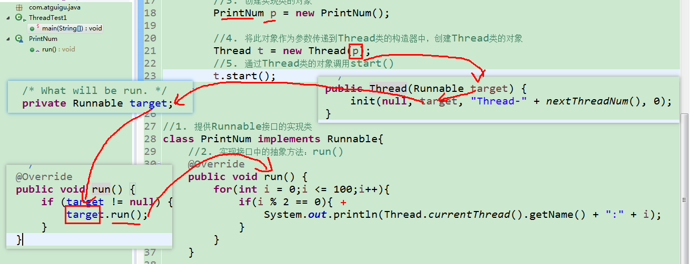
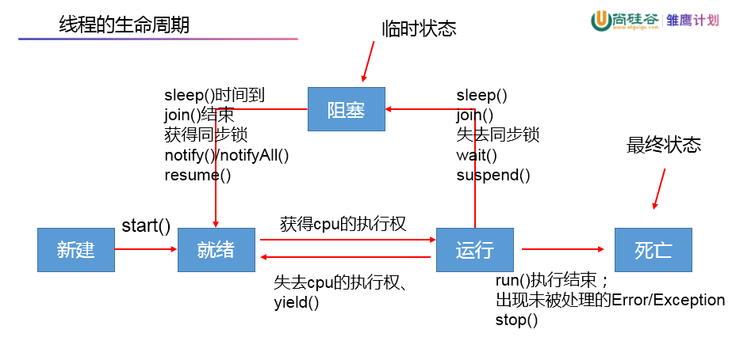
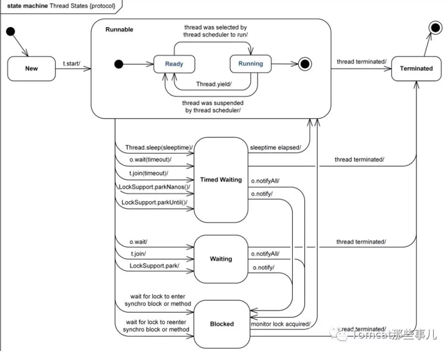
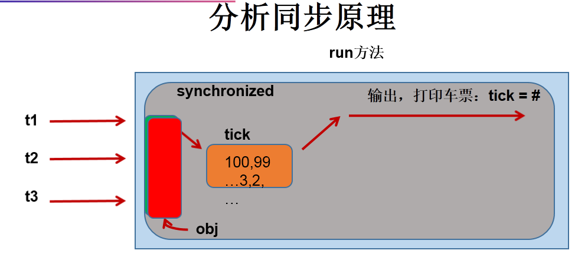

# day19授课笔记

讲师：宋红康

***

## 一、复习

- 区分进程、线程，并举例说明

- 区分并行与并发

## 二、线程的创建方式（两种传统方式）

### 方式一：继承Thread

- 说明：

```
 * 线程的创建方式一：继承Thread的方式
 * 
 * 一、步骤：
 * 1. 创建Thread类的子类
 * 2. 重写Thread类的run():将当前线程要执行的操作声明在run()内！
 * 3. 实例化Thread类的子类
 * 4. 通过Thread类的子类对象调用其start():① 启动线程 ②调用当前线程的run()
 * 
 * 
 * 二、创建一个分线程，用于遍历100以内的偶数
```

- 代码：

```java
public class ThreadTest {
	public static void main(String[] args) {
		//3. 实例化Thread类的子类
		EvenNumber e1 = new EvenNumber();
		//4. 通过Thread类的子类对象调用其start()
		e1.start();
		
		//主线程中执行的操作
		for(int i = 0;i <= 100;i++){ 
			if(i % 2 == 0){
				System.out.println(i + "**************");
			}
		}
	}
}

//1. 创建Thread类的子类
class EvenNumber extends Thread{
	//2. 重写Thread类的run()
	public void run() {
		for(int i = 0;i <= 100;i++){ 
			if(i % 2 == 0){
				System.out.println(i);
			}
		}
	}
}
```

> 说明：分线程对象的创建和启动工作，是由主线程完成的。

- 注意点：

```java
public static void main(String[] args) {
		//3. 实例化Thread类的子类
		EvenNumber e1 = new EvenNumber();
		//4. 通过Thread类的子类对象调用其start()
		e1.start();
//问题一：能否通过直接用e1.run()的方式启动线程，并执行相关的逻辑？No！
//		e1.run();
		
//问题二：再启动一个分线程，用于遍历100以内的偶数。能否让已经start()的线程再次执行start()? No!
		//每个线程只能被start()一次，一旦被多次调用start(),会报：IllegalThreadStateException
//		e1.start();
		
        //需要再new一个线程对象，并启动线程
		EvenNumber e2 = new EvenNumber();
		e2.start();
		
		
	}
```

- 练习：

```java
/*
 * 练习：创建两个分线程，其中一个线程遍历100以内的偶数，另一个线程遍历100以内的奇数。
 * 
 * 
 */
public class NumerThreadTest {
	public static void main(String[] args) {
//		EvenThread t1 = new EvenThread();
//		OddThread t2 = new OddThread();
//		
//		t1.start();
//		t2.start();
		
		//另一种方式：提供 匿名子类的匿名对象
		new Thread(){
			@Override
			public void run() {
				for(int i = 0;i <= 100;i++){
					if(i % 2 == 0){
						System.out.println(Thread.currentThread().getName() + ":" + i);
					}
				}
			}
		}.start();
		
		new Thread(){
			@Override
			public void run() {
				for(int i = 0;i <= 100;i++){
					if(i % 2 != 0){
						System.out.println(Thread.currentThread().getName() + ":" + i);
					}
				}
			}
		}.start();
		
	}
}


class EvenThread extends Thread{//遍历偶数的线程类
	@Override
	public void run() {
		for(int i = 0;i <= 100;i++){
			if(i % 2 == 0){
				System.out.println(Thread.currentThread().getName() + ":" + i);
			}
		}
	}
}
class OddThread extends Thread{//遍历奇数的线程类
	@Override
	public void run() {
		for(int i = 0;i <= 100;i++){
			if(i % 2 != 0){
				System.out.println(Thread.currentThread().getName() + ":" + i);
			}
		}
	}
}
```

- 例题

```java
package com.atguigu.java;

/*
 * 例题：开启三个窗口售票，总票数为100张。
 * 
 * 代码中存在线程的安全问题的，放到线程同步中进行处理。
 */
public class WindowTest1 {
	public static void main(String[] args) {
		Window w1 = new Window();
		Window w2 = new Window();
		Window w3 = new Window();
		
		w1.setName("窗口1");
		w2.setName("窗口2");
		w3.setName("窗口3");
		
		w1.start();
		w2.start();
		w3.start();
	}
}
class Window extends Thread{
	private static int ticket = 100;
	
	@Override
	public void run() {
		
		while(true){
			
			if(ticket > 0){
				System.out.println(Thread.currentThread().getName() 
						+ "售票，票号为:" + ticket);
				ticket--;
			}else{
				break;
			}
		}
		
	}
	
	
}

```

### 方式二：实现Runnable

```
/*
 * 线程的创建方式二：实现Runnable接口的方式
 * 
 * 一、步骤
 * 1. 提供Runnable接口的实现类
 * 2. 实现接口中的抽象方法：run():将当前线程要执行的操作声明在run()内！
 * 3. 创建实现类的对象
 * 4. 将此对象作为参数传递到Thread类的构造器中，创建Thread类的对象
 * 5. 通过Thread类的对象调用start()：① 启动线程 ②调用当前线程的run()
 * 
 * 二、例题：创建分线程遍历100以内的偶数
 */
```

```
public class ThreadTest1 {
	public static void main(String[] args) {
		//3. 创建实现类的对象
		PrintNum p = new PrintNum();
		
		//4. 将此对象作为参数传递到Thread类的构造器中，创建Thread类的对象
		Thread t = new Thread(p);
		//5. 通过Thread类的对象调用start()
		t.start();
	}
}

//1. 提供Runnable接口的实现类
class PrintNum implements Runnable{
	//2. 实现接口中的抽象方法：run()
	@Override
	public void run() {
		for(int i = 0;i <= 100;i++){ 
			if(i % 2 == 0){
				System.out.println(Thread.currentThread().getName() + ":" + i);
			}
		}
	}
	
}
```

> 问题：为什么通过start()调用的是Thread类中的run()，此run()怎么就表现为对Runnable实现类中run()的调用了呢？

解答：



- 例题

```java
/*
 * 例题：开启三个窗口售票，总票数为100张。使用Runnable接口实现类的方式实现
 * 
 * 代码中存在线程的安全问题的，放到线程同步中进行处理。
 */
public class WindowTest2 {
	public static void main(String[] args) {
		
		Window1 w = new Window1();
		
		Thread t1 = new Thread(w);
		Thread t2 = new Thread(w);
		Thread t3 = new Thread(w);
		
		t1.setName("窗口1");
		t2.setName("窗口2");
		t3.setName("窗口3");
		
		t1.start();
		t2.start();
		t3.start();
	}
}

class Window1 implements Runnable {
	private int ticket = 100;

	@Override
	public void run() {
		while (true) {

			if (ticket > 0) {
				System.out.println(Thread.currentThread().getName() + "售票，票号为:" + ticket);
				ticket--;
			} else {
				break;
			}
		}
	}
}
```

练习：创建两个分线程，其中一个线程遍历100以内的偶数，另一个线程遍历100以内的奇数。

```java
public class NumerThreadTest {
	public static void main(String[] args) {	
		//提供 匿名实现类的匿名对象
		new Thread(new Runnable(){

			@Override
			public void run() {
				for(int i = 0;i <= 100;i++){
					if(i % 2 == 0){
						System.out.println(Thread.currentThread().getName() + ":" + i);
					}
				}
			}
			
		},"线程A").start();
		
		new Thread(new Runnable(){

			@Override
			public void run() {
				for(int i = 0;i <= 100;i++){
					if(i % 2 != 0){
						System.out.println(Thread.currentThread().getName() + ":" + i);
					}
				}
			}
			
		},"线程B").start();
	}
}
```


### 两种方式的对比

```
 *  相同点：都需要进行方法的重写（run()）；启动线程都需要调用Thread类的start()
 *  对比：① 类可以实现多个接口；但是只能继承一个父类 ② 实现的方式更方便的来处理有共享数据的情况
 *  结论：实现Runnable的方式要好于继承Thread的方式
 *  联系：public class Thread implements Runnable
```


## 三、线程的常用方法

```
测试线程中的常用方法：
 * 1. start():启动线程；调用线程中的run()
 * 2. run():将线程要执行的操作声明在此方法中
 * 3. currentThread():获取执行当前代码的线程
 * 4. getName():获取当前线程的名字
 * 5. setName():设置当前线程的名字
 * 6. sleep(long milisecond):一旦执行此方法，当前线程就阻塞指明的毫秒数
 * 7. yield():每当执行此方法时，线程主动释放cpu的执行权
 * 8. join():在线程a中调用线程b的join()，此时线程a进入阻塞状态，直到线程b执行结束以后，才结束线程a的阻塞状态，线程a继续执行。
 * 9. isAlive():判断当前线程是否还存活
```

```
 线程的优先级：
 *  ① 优先级的等级
 *  MIN_PRIORITY:1
 *  NORM_PRIORITY:5
 *  MAX_PRIORITY:10
 * 
 *  ②如何设置和获取优先级
 *  getPriority():获取
 *  setPriortiy(int priority):设置
 * 
 *  ③调度策略：高优先级的线程要抢占低优先级线程的策略。
 *         高优先级的线程只是从概率上来讲，要更大概率的比低优先级线程先执行。并不是100%的一定优先于低优先级线程执行。
```

```java
public class ThreadMethodTest {
	public static void main(String[] args) {
		PrintNumber t1 = new PrintNumber();
//		t1.setName("分线程1");
		//设置优先级
		t1.setPriority(Thread.MAX_PRIORITY);
		t1.start();
		
		//给主线程重新命名
//		Thread.currentThread().setName("主线程");
		
		//设置主线程的优先级
		Thread.currentThread().setPriority(Thread.MIN_PRIORITY);
		
		// 主线程中执行的操作
		for (int i = 0; i <= 100; i++) {
			if (i % 2 == 0) {
				System.out.println(Thread.currentThread().getName() + ":" + Thread.currentThread().getPriority() + ":" + i + "**************");
			}
//			if(i == 20){
//				try {
//					t1.join();
//				} catch (InterruptedException e) {
//					e.printStackTrace();
//				}
//			}
		}
		
		System.out.println(t1.isAlive());//false
		
//		PrintNumber t2 = new PrintNumber("分线程2");
//		t2.start();
	}
}

class PrintNumber extends Thread {
	
	public PrintNumber(){}
	
	public PrintNumber(String name){
		super(name);
	}
	
	public void run(){
		for (int i = 0; i <= 100; i++) {
			if (i % 2 == 0) {
//				try {
//					Thread.sleep(1000);
//				} catch (InterruptedException e) {
//					e.printStackTrace();
//				}
				System.out.println(Thread.currentThread().getName() + ":" + Thread.currentThread().getPriority()  + ":" + i);
			}
//			
//			if(i % 20 == 0){
//				yield();
//			}
//			
		}
	}
}
```


## 四、线程的生命周期

在Thread类内部定义了线程生命周期的内部类：State

```java
public enum State {
        /**
         * Thread state for a thread which has not yet started.
         */
        NEW,

        /**
         * Thread state for a runnable thread.  A thread in the runnable
         * state is executing in the Java virtual machine but it may
         * be waiting for other resources from the operating system
         * such as processor.
         */
        RUNNABLE,

        /**
         * Thread state for a thread blocked waiting for a monitor lock.
         * A thread in the blocked state is waiting for a monitor lock
         * to enter a synchronized block/method or
         * reenter a synchronized block/method after calling
         * {@link Object#wait() Object.wait}.
         */
        BLOCKED,

        /**
         * Thread state for a waiting thread.
         * A thread is in the waiting state due to calling one of the
         * following methods:
         * <ul>
         *   <li>{@link Object#wait() Object.wait} with no timeout</li>
         *   <li>{@link #join() Thread.join} with no timeout</li>
         *   <li>{@link LockSupport#park() LockSupport.park}</li>
         * </ul>
         *
         * <p>A thread in the waiting state is waiting for another thread to
         * perform a particular action.
         *
         * For example, a thread that has called <tt>Object.wait()</tt>
         * on an object is waiting for another thread to call
         * <tt>Object.notify()</tt> or <tt>Object.notifyAll()</tt> on
         * that object. A thread that has called <tt>Thread.join()</tt>
         * is waiting for a specified thread to terminate.
         */
        WAITING,

        /**
         * Thread state for a waiting thread with a specified waiting time.
         * A thread is in the timed waiting state due to calling one of
         * the following methods with a specified positive waiting time:
         * <ul>
         *   <li>{@link #sleep Thread.sleep}</li>
         *   <li>{@link Object#wait(long) Object.wait} with timeout</li>
         *   <li>{@link #join(long) Thread.join} with timeout</li>
         *   <li>{@link LockSupport#parkNanos LockSupport.parkNanos}</li>
         *   <li>{@link LockSupport#parkUntil LockSupport.parkUntil}</li>
         * </ul>
         */
        TIMED_WAITING,

        /**
         * Thread state for a terminated thread.
         * The thread has completed execution.
         */
        TERMINATED;
    }
```

简图：



与API匹配的图：




## 五、线程的同步机制

### 1. 同步机制，用于解决线程安全问题

```
 * 例题：开启三个窗口售票，总票数为100张。使用Runnable接口实现类的方式实现
 * 
 * 1. 出现的问题：出现了重票和错票  ---> 即为线程安全问题
 * 2. 出现的原因：由于一个线程在操作ticket尚未操作完的情况下，其他线程参与进来继续操作ticket，导致出现了重票和错票。
 * 3. 如何解决？ 必须保证一个线程操作ticket，在完成操作完的时候，其他线程才能参与进行继续操作ticket.
 * 
 * 4. Java是如何实现的？使用同步机制，解决线程的安全问题
```

### 2. 方式一：同步代码块

```
 *   方式一：同步代码块：
 *   synchronized(同步监视器){
 *   	//需要被同步的代码
 *   }
 *   
 *   说明：① 需要被同步的代码，即为操作共享数据的代码
 *   		要求：包裹共享数据的代码，不能包多了，也不能包少了。
 *   	 ② 何为共享数据？多个线程共同操作的数据。比如：ticket
 *       ③ 同步监视器，俗称锁。任何一个类的对象，都可以充当同步监视器。
 *       	要求：多个线程，必须共用同一个同步监视器。
         ④ 同步监视器，可以考虑使用this。
```



#### 2.1 解决实现Runnable的线程安全问题

```java
public class WindowTest1 {
	public static void main(String[] args) {
		
		Window3 w = new Window3();
		Thread t1 = new Thread(w);
		Thread t2 = new Thread(w);
		Thread t3 = new Thread(w);
		t1.setName("窗口1");
		t2.setName("窗口2");
		t3.setName("窗口3");
		t1.start();
		t2.start();
		t3.start();
	}
}
class Window1 implements Runnable {
	private int ticket = 100;
	//Dog dog = new Dog();
	//Object obj = new Object();

	@Override
	public void run() {
		//Object obj = new Object();
		while (true) {
			//synchronized(dog){
			synchronized(this){//此时的this,即为：w.是唯一的！
				
				if (ticket > 0) {
					
					try {
						Thread.sleep(50);
					} catch (InterruptedException e) {
						e.printStackTrace();
					}
					
					System.out.println(Thread.currentThread().getName() 
							+ "售票，票号为:" + ticket);
					ticket--;
				} else {
					break;
				}
			}
		}
	}
}

class Dog{
	
}
```


#### 2.2 解决继承Thread的线程安全问题

```java
/*
 * 使用同步代码块解决继承Thread类的线程安全问题
 * 
 */
public class WindowTest2 {
	public static void main(String[] args) {
		Window2 w1 = new Window2();
		Window2 w2 = new Window2();
		Window2 w3 = new Window2();
		
		w1.setName("窗口1");
		w2.setName("窗口2");
		w3.setName("窗口3");
		
		w1.start();
		w2.start();
		w3.start();
	}
}
class Window2 extends Thread{
	private static int ticket = 100;
	static Object obj = new Object();
	
	@Override
	public void run() {
		while(true){
			//正确的：
//			synchronized (obj) {
			synchronized (Window2.class) {//Class clazz = Window2.class
			//错误的：
			//synchronized (this) {//此时的this,表示w1,w2,w3，不唯一！
				if (ticket > 0) {

					try {
						Thread.sleep(30);
					} catch (InterruptedException e) {
						e.printStackTrace();
					}

					System.out.println(Thread.currentThread().getName() + "售票，票号为:" + ticket);
					ticket--;
				} else {
					break;
				}
			}
		}
		
	}
	
	
}
```


### 3. 方式二：同步方法

```
 *   方式二：同步方法：
 * 		如果操作共享数据的代码，完整的声明在方法中，则可以考虑将此方法直接声明为同步方法。
 * 	
 *     说明：① 同步方法，也有同步监视器，只不过是默认的同步监视器，不能显式定义
 *         ② 对于非静态的同步方法，同步监视器是this
 *           对于静态的同步方法，同步监视器是当前类本身
```


#### 3.1 解决实现Runnable的线程安全问题

```java
/*
 * 使用同步方法解决实现Runnable的线程安全问题
 * 
 * 
 */
public class WindowTest3 {
	public static void main(String[] args) {

		Window3 w = new Window3();

		Thread t1 = new Thread(w);
		Thread t2 = new Thread(w);
		Thread t3 = new Thread(w);

		t1.setName("窗口1");
		t2.setName("窗口2");
		t3.setName("窗口3");

		t1.start();
		t2.start();
		t3.start();
	}
}

class Window3 implements Runnable {
	private int ticket = 100;

	@Override
	public void run() {
		for(int i = 1;i <= 100;i++){
			show();
		}
	}

	public synchronized void show() {//此时的同步监视器，是：this
		if (ticket > 0) {

			try {
				Thread.sleep(30);
			} catch (InterruptedException e) {
				e.printStackTrace();
			}

			System.out.println(Thread.currentThread().getName() + "售票，票号为:" + ticket);
			ticket--;
		}
	}
}
```


#### 3.2 解决继承Thread的线程安全问题

```java
/*
 * 使用同步方法解决继承Thread类的线程安全问题
 * 
 */
public class WindowTest4 {
	public static void main(String[] args) {
		Window4 w1 = new Window4();
		Window4 w2 = new Window4();
		Window4 w3 = new Window4();

		w1.setName("窗口1");
		w2.setName("窗口2");
		w3.setName("窗口3");

		w1.start();
		w2.start();
		w3.start();
	}
}

class Window4 extends Thread {
	private static int ticket = 100;

	@Override
	public void run() {

		for (int i = 1; i <= 100; i++) {
			show();
		}

	}

	public static synchronized void show() {//同步监视器为当前类本身：Window4.class
		if (ticket > 0) {

			try {
				Thread.sleep(30);
			} catch (InterruptedException e) {
				e.printStackTrace();
			}

			System.out.println(Thread.currentThread().getName() + "售票，票号为:" + ticket);
			ticket--;
		}
	}

}
```


## 六、线程的通信


## 七、jdk5.0新增了两种创建多线程的方式