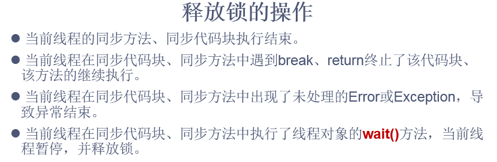
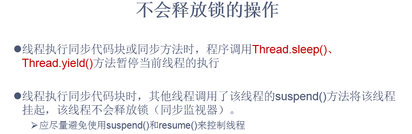
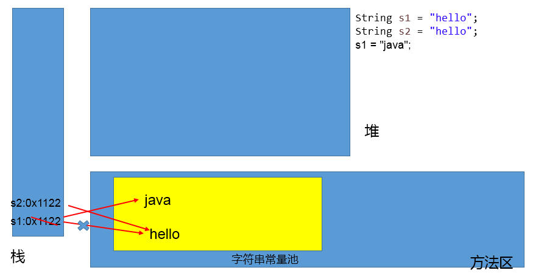
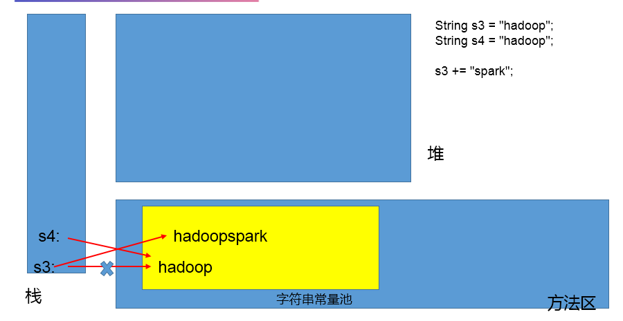

# day20授课笔记

## 一、作业

```
/*
 * 银行有一个账户。
	有两个储户分别向同一个账户存3000元，每次存1000，存3次。每次存完打印账户余额。
	问题：该程序是否有安全问题，如果有，如何解决？
	【提示】
	1，明确哪些代码是多线程运行代码，须写入run()方法
	2，明确什么是共享数据。
	3，明确多线程运行代码中哪些语句是操作共享数据的。

 * 
 * 线程  操作  资源类
 * 
 */
```

```java
public class ThreadDemo {
	public static void main(String[] args) {
		Account acct = new Account();
		Customer c1 = new Customer("甲",acct);
		Customer c2 = new Customer("乙",acct);
		
		c1.start();
		c2.start();
	}
}

class Customer extends Thread{
	
	private Account acct;
	
	public Customer(String name,Account acct){
		super(name);
		this.acct = acct;
	}
	
	@Override
	public void run() {
		
		for(int i = 0;i < 3;i++){
			try {
				Thread.sleep(1000);
			} catch (InterruptedException e) {
				e.printStackTrace();
			}
			acct.deposit(1000);
		}
		
	}
}

class Account{//资源类
	private double balance;//余额
	
	//存钱
	public synchronized void deposit(double amt){
		
		if(amt > 0){
			balance += 1000;
			
			System.out.println(Thread.currentThread().getName() + "存钱" 
			+ amt + "元，账户余额为：" + balance);
		}
		
	}
}
```

## 二、复习

- 进程、线程的概念
  - 进程：资源分配的基本单位
  - 线程：调度和执行的基本单位

- 并行、并发的概念
  - 并行：Parellel ，与串行相对应。
  - 并发：Concurrent

- **传统的，创建多线程的方式**
  - 继承Thread类
  - **实现Runnable接口**

- 线程的常用方法、优先级的设置
- 线程的生命周期：Thread.State的内部枚举类
- **如何解决线程的安全问题？**
  - 同步机制（synchronized）
    - 同步代码块 与同步方法
    - 同步监视器：任何一个类的对象都可以充当。但是要求多个线程必须共享同步监视器
    - 共享数据：多个线程共同操作的变量
    - 操作共享数据的代码：不要包多了，也不要包少了
  - Lock锁
  - 线程同步以后的好处？解决了线程的安全问题，体现了数据的一致性。
  - 线程同步以后的弊端？并发性降低，执行效率低

## 三、基于同步机制的延展问题

### 3.1 死锁

```java
/*
 * 线程的同步机制带来的问题：死锁
 * 
 * 1. 不同的线程分别占用对方需要的同步资源不放弃，都在等待对方放弃自己需要的同步资源，就形成了线程的死锁
 * 
 * 2. 出现死锁后，不会出现异常，不会出现提示，只是所有的线程都处于阻塞状态，无法继续
 * 
 * 3. 我们在编程程序时，要避免出现死锁！！
 * 
 */
public class DeadLockTest {
	public static void main(String[] args) {

		StringBuilder s1 = new StringBuilder();
		StringBuilder s2 = new StringBuilder();

		new Thread() {
			public void run() {
				synchronized (s1) {
					s1.append("a");
					s2.append("1");
					
					try {
						Thread.sleep(10);
					} catch (InterruptedException e) {
						e.printStackTrace();
					}

					synchronized (s2) {
						s1.append("b");
						s2.append("2");

						System.out.println(s1);
						System.out.println(s2);

					}
				}
			}
		}.start();

		new Thread() {
			public void run() {
				synchronized (s2) {
					s1.append("c");
					s2.append("3");

					try {
						Thread.sleep(10);
					} catch (InterruptedException e) {
						e.printStackTrace();
					}
					
					synchronized (s1) {
						s1.append("d");
						s2.append("4");

						System.out.println(s1);
						System.out.println(s2);

					}

				}
			}
		}.start();

	}
}
```


### 3.2 解决单例模式中的懒汉式的线程安全问题

```
/*
 * 解决单例模式中的懒汉式的线程安全问题
 */
public class SingletonTest {
	public static void main(String[] args) {
//		Bank.bank = null;
	}
}

class Bank {

	private Bank() {

	}

	private static Bank bank = null;

	//方式一：线程安全的，但是效率不高
//	public synchronized static Bank getInstance() {
//		
//		if (bank == null) {
//			
//			bank = new Bank();
//		}
//		return bank;
//	}
	
//	public static Bank getInstance() {
//		//方式二：线程安全的，比方式一稍好
//		synchronized (Bank.class) {
//			if (bank == null) {
//
//				bank = new Bank();
//			}
//		}
//		return bank;
//	}
	//方式三：比方式二效率高
	public static Bank getInstance() {
		if (bank == null) {
			
			synchronized (Bank.class) {
				if (bank == null) {
					
					bank = new Bank();
				}
			}
		}
		return bank;
	}

}
```


## 四、jdk5.0使用Lock锁的方式解决线程安全问题

### 1. 描述

```
/*
 * 除了使用synchronized同步机制处理线程安全问题之外，还可以使用jdk5.0提供的Lock锁的方式
 * 
 * 一、步骤：
 * 1. 创建Lock实现类的对象：ReentrantLock （可重入锁） --->保证多个线程使用同一个Lock对象
 * 2. 调用Lock的方法：lock()。调用此方法的线程就可以操作共享数据。其他线程等待
 * 3. 在操作共享数据时，可以调用Lock的方法：unlock()。此方法一定要执行！
 * 
 * 二、面试题：synchronized 和 Lock方式的异同？
 *   相同点：解决线程的安全问题的两种不同方式。 synchronized在jdk1.0就有。 Lock在jdk5.0新增
 *   不同点：① Lock通过显式的调用unlock()结束对共享数据的操作，更灵活！② 在线程通信中，Lock搭配Condition使用更灵活。
 *   使用建议：参考Lock的api:
 *   Lock implementations provide more extensive locking 
 *   operations than can be obtained using synchronized methods 
 *    and statements
 */
```

### 2. 代码实现

```java
public class WindowTest {
	public static void main(String[] args) {

		Window1 w = new Window1();

		Thread t1 = new Thread(w);
		Thread t2 = new Thread(w);
		Thread t3 = new Thread(w);

		t1.setName("窗口1");
		t2.setName("窗口2");
		t3.setName("窗口3");

		t1.start();
		t2.start();
		t3.start();
	}
}

class Window1 implements Runnable {
	private int ticket = 100;
	//1.
	private final ReentrantLock lock = new ReentrantLock();
	@Override
	public void run() {
		while (true) {
			
			try {
				//2.
				lock.lock();
				if (ticket > 0) {

					try {
						Thread.sleep(30);
					} catch (InterruptedException e) {
						e.printStackTrace();
					}

					System.out.println(Thread.currentThread().getName() + "售票，票号为:" + ticket);
					ticket--;
				} else {
					break;
				} 
			} finally {
				//3.
				lock.unlock();
			}
		}
	}
}
```

- 面试题：解决Java中线程的安全问题有几种方式？ 三种：同步代码块、同步方法、Lock锁

- 面试题：synchronized 和 Lock方式的异同？

## 五、线程的通信

### 5.1 说明

```
 * 1. 线程通信涉及到三个方法：
 * wait():当执行到此方法时，当前的线程就进入阻塞状态，同时释放对同步监视器的调用。需要被唤醒，才可以继续执行。
 * notify():当执行到此方法时，就会唤醒被wait的一个线程。如果有多个被wait的线程，则唤醒优先级高的那个
 * notifyAll():当执行到此方法时，就会唤醒所有被wait的线程。
 * 
 * 2. 说明：
 *  ① wait()、notify()、notifyAll()三个方法必须使用在同步代码块或同步方法中。不能在Lock中使用
 *  ② wait()、notify()、notifyAll()三个方法的调用者是同步监视器。否则，报java.lang.IllegalMonitorStateException
 *  ③ wait()、notify()、notifyAll()三个方法定义在java.lang.Object类中
 *  
```

### 5.2 例题

例题：使用两个线程打印 1-100。线程1, 线程2 交替打印

```java
public class CommunicationTest {
	public static void main(String[] args) {
		PrintNum p = new PrintNum();
		Thread t1 = new Thread(p, "线程1");
		Thread t2 = new Thread(p, "线程2");

		t1.start();
		t2.start();

	}
}

class PrintNum implements Runnable {

	private int number = 1;
	private Object obj = new Object();

	@Override
	public void run() {

		while (true) {
//			synchronized (this) {
			synchronized (obj) {//
				
				obj.notifyAll();//唤醒被wait的线程
				if (number <= 100) {
						
					try {
						Thread.sleep(20);//在同步结构中，执行此方法不会释放同步监视器
					} catch (InterruptedException e) {
						e.printStackTrace();
					}

					System.out.println(Thread.currentThread().getName() + ":" + number);
					number++;
					
					//让当前线程进入等待状态
					try {
						obj.wait();//在同步结构中，执行此方法会释放同步监视器
					} catch (InterruptedException e) {
						e.printStackTrace();
					}
					
				} else {
					break;
				}
			}
		}

	}

}
```

### 5.3 面试题

```
面试题：sleep()和wait()的异同？
 *  相同点：一旦执行，都会使得当前线程结束执行状态，进入等待状态。
 *  不同点： ① 定义方法所属的类：sleep():Thread中定义。  wait():Object中定义
 *        ② 使用范围的不同：sleep()可以在任何需要使用的位置被调用； wait():必须使用在同步代码块或同步方法中
 *        ③ 都在同步结构中使用的时候，是否释放同步监视器的操作不同：sleep():不会释放同步监视器 ;wait():会释放同步监视器
 *        ④ 结束等待的方式不同：sleep()：指定时间一到就结束阻塞。 wait():需要被唤醒，进而结束阻塞。
```

### 5.4 补充





### 5.5 例题：生产者、消费者问题

```java
/*
 * 例题：生产者、消费者问题：
 * 生产者(Productor)将产品交给店员(Clerk)，而消费者(Customer)从店员处取走产品，
 * 店员一次只能持有固定数量的产品(比如:20），如果生产者试图生产更多的产品，店员会叫生产者停一下，
 * 如果店中有空位放产品了再通知生产者继续生产；如果店中没有产品了，店员会告诉消费者等一下，如果店中
 * 有产品了再通知消费者来取走产品。
 * 
 * 分析： 线程  操作 资源类
 * 1. 是否是一个多线程问题？是！生产者 、消费者
 * 2. 是否有线程安全问题呢？有！
 * 2. 是否有共享数据？有！产品数量
 * 2. 是否需要使用同步机制？是！
 * 3. 是否涉及到线程通信？是！
 * 
 * 
 */
public class ConsumerProducerTest {
	public static void main(String[] args) {
		Clerk clerk = new Clerk();
		Producer p1 = new Producer(clerk);
		
		Consumer c1 = new Consumer(clerk);
		Consumer c2 = new Consumer(clerk);
		
		p1.setName("生产者1");
		c1.setName("消费者1");
		c2.setName("消费者2");
		
		p1.start();
		c1.start();
		c2.start();
	}
}

//生产者
class Producer extends Thread{
	private Clerk clerk;
	
	public Producer(Clerk clerk){
		this.clerk = clerk;
	}
	
	@Override
	public void run() {
		
		System.out.println("=========生产者开始生产产品========");
		while(true){
			
			try {
				Thread.sleep(40);
			} catch (InterruptedException e) {
				e.printStackTrace();
			}
			
			//要求clerk去增加产品
			clerk.addProduct();
		}
	}
}

//消费者
class Consumer extends Thread{
	private Clerk clerk;
	
	public Consumer(Clerk clerk){
		this.clerk = clerk;
	}
	@Override
	public void run() {
		System.out.println("=========消费者开始消费产品========");
		while(true){
			
			try {
				Thread.sleep(90);
			} catch (InterruptedException e) {
				e.printStackTrace();
			}
			
			//要求clerk去减少产品
			clerk.minusProduct();
		}
	}
}

//资源类
class Clerk {
	private int productNum = 0;//产品数量

	//增加产品
	public synchronized void addProduct() {
		if(productNum < 20){
			productNum++;
			System.out.println(Thread.currentThread().getName() + 
					"生产了第" + productNum + "个产品");
			//唤醒消费者
			this.notifyAll();
		}else{
			
			try {
				this.wait();
			} catch (InterruptedException e) {
				e.printStackTrace();
			}
		}
	}

	//减少产品
	public synchronized void minusProduct() {
		if(productNum > 0){
			System.out.println(Thread.currentThread().getName() + 
					"消费了第" + productNum + "个产品");
			productNum--;
			
			//唤醒生产者
			this.notifyAll();
		}else{
			
			try {
				this.wait();
			} catch (InterruptedException e) {
				e.printStackTrace();
			}
		}
	}
	
	
	
}
```


练习：

```
模拟银行取钱的问题
1.定义一个Account类
    1）该Account类封装了账户编号（String）和余额（double）两个属性
    2）设置相应属性的getter和setter方法
    3）提供无参和有两个参数的构造器
    4）系统根据账号判断与用户是否匹配，需提供hashCode()和equals()方法的重写
2.提供两个取钱的线程类：小明、小明’s wife
    1）提供了Account类的account属性和double类型的取款额的属性
    2）提供带线程名的构造器
    3）run()方法中提供取钱的操作
3.在主类中创建线程进行测试。考虑线程安全问题。

```


## 六、jdk5.0 新增了两种多线程的创建方式

### 6.1 实现Callable接口

```java
//例题：遍历100以内的偶数，并计算所有偶数的和

//1.创建一个实现Callable的实现类
class NumThread implements Callable{
    //2.实现call方法，将此线程需要执行的操作声明在call()中
    @Override
    public Object call() throws Exception {
        int sum = 0;
        for (int i = 1; i <= 100; i++) {
            if(i % 2 == 0){
                System.out.println(i);
                sum += i;
            }
        }
        return sum;
    }
}


public class ThreadNew {
    public static void main(String[] args) {
        //3.创建Callable接口实现类的对象
        NumThread numThread = new NumThread();
        
        //4.将此Callable接口实现类的对象作为传递到FutureTask构造器中，创建FutureTask的对象
        FutureTask futureTask = new FutureTask(numThread);
        //5.将FutureTask的对象作为参数传递到Thread类的构造器中，创建Thread对象，并调用start()
        new Thread(futureTask).start();
//  
//        
//      接收返回值
        try {
            //6.获取Callable中call方法的返回值
            //get()返回值即为FutureTask构造器参数Callable实现类重写的call()的返回值。
            Object sum = futureTask.get();
            System.out.println("总和为：" + sum);
        } catch (Exception e) {
            e.printStackTrace();
        }
    }

}
```


### 6.2 使用线程池的方式

```java
//创建并使用多线程的第四种方法：使用线程池
//使用线程池创建多线程的好处：
//1.降低了资源的消耗，使用完的线程可以被复用。
//2.提高了程序的响应速度。
//3.便于管理。

class NumberThread implements Runnable{

    @Override
    public void run() {
        for(int i = 0;i <= 100;i++){
            if(i % 2 == 0){
                System.out.println(Thread.currentThread().getName() + ": " + i);
            }
        }
    }
}

class NumberThread1 implements Runnable{

    @Override
    public void run() {
        for(int i = 0;i <= 100;i++){
            if(i % 2 != 0){
                System.out.println(Thread.currentThread().getName() + ": " + i);
            }
        }
    }
}

public class ThreadPool {

    public static void main(String[] args) {
        //1. 提供指定线程数量的线程池
        ExecutorService service = Executors.newFixedThreadPool(10);
        ThreadPoolExecutor service1 = (ThreadPoolExecutor) service;
//        //设置线程池的属性
//        System.out.println(service.getClass());//ThreadPoolExecutor
        service1.setMaximumPoolSize(20);


        //2.执行指定的线程的操作。需要提供实现Runnable接口或Callable接口实现类的对象
        service.execute(new NumberThread());//适合适用于Runnable
        service.execute(new NumberThread1());//适合适用于Runnable

//        service.submit(Callable callable);//适合使用于Callable
        //3.关闭连接池
        service.shutdown();
    }

}
```


### 6.3 面试题

- 面试题：创建多线程的方式有几种？

```
四种！
继承Thread类
实现Runnable接口
实现Callable接口
使用线程池的方式
```

- 面试题：对比创建多线程的实现Runnable接口 和 实现Callable接口的方式？

```
 	使用Runnable和Callable的对比？
	1.结论：实现Callable的方式好
	2.体现：
	    ① 可以在call方法中抛出异常，更灵活
	    ② call方法，相较于run()可以有返回值
	    ③ 可以通过泛型的方法，指定返回值的确定类型。
```

## 七、字符串的使用

### 7.1 String的介绍

```
	 * 1. public final class String implements java.io.Serializable, Comparable
	 *  > 不可被继承
	 *  > Serializable:标识接口，实现序列化机制的接口
	 *  > Comparable:实现对象比较大小的接口
	 *  > String是类，属于引用类型变量。
```

### 7.2 String的不可变性

```
@Test
	public void test1(){
		//"hello"声明在字符串常量池中
		String s1 = "hello"; //int num = 10; Date date = new Date();
		String s2 = "hello";
		
		System.out.println(s1.equals(s2));//true
		System.out.println(s1 == s2);//true
		
		//*******************
		s1 = "java";
		System.out.println(s2);//hello
		
		//****************
		String s3 = "hadoop";//new char[]{'h','a','d','o','o','p'}
		String s4 = "hadoop";
		
		s3 += "spark";
		System.out.println(s3);//hadoopspark
		System.out.println(s4);//hadoop
		
		//****************
		String s5 = "flink";
		String s6 = "flink";
		
		String s7 = s5.replace('f', 'h');
		System.out.println(s5);//flink
		System.out.println(s6);//flink
		System.out.println(s7);//hlink
	}
```

对应的内存图为：





应用举例：

```
		Person p1 = new Person("Tom",12);
		Person p2 = new Person("Tom",12);
		System.out.println(p1.name == p2.name);//true
		
		p1.name = "Jerry";
		System.out.println(p2.name);//Tom
```

```
public class Person {
	String name;
	int age;
	public Person(String name, int age) {
		super();
		this.name = name;
		this.age = age;
	}
	
}
```

### 7.3 String的实例化的情况

```java
/*
	 * String的实例化的情况
	 * 
	 * 两种方式：
	 * 方式一：使用字面量的方式
	 * 方式二：使用new的方式
	 * 
	 * 面试题：使用new的方式创建一个字符串，内存中创建了几个对象？ 堆空间中创建的对象、字符串常量池中。
	 */
	@Test
	public void test2(){
		//方式一：使用字面量的方式
		String s1 = "hello";
		
		String s2 = new String("hello");
		
		System.out.println(s1.equals(s2));//true
		
		System.out.println(s1 == s2);//false
		

	}
```

### 7.4 String的连接操作

```java
/*
	 *  String的连接操作
	 * 
	 * 1. 连接运算中，如果使用的都是字面量，则在常量池中声明此字符串或使用现有的字符串。
	 * 2. 连接运算中，如果使用的是变量，则需要在堆中重新开辟空间，保存此字符串的值。
	 * 3. 通过字符串调用intern()，返回此字符串在字符串常量池中的字面量。
	 */
	@Test
	public void test3(){
		String s1 = "java";
		String s2 = "hadoop";
		
		String s3 = "javahadoop";
		String s4 = "java" + "hadoop";
		String s5 = "java" + s2;
		String s6 = s1 + "hadoop";
		String s7 = s1 + s2;
		
		String s8 = s7.intern();
		String s9 = s5.intern();
		
		System.out.println(s3 == s4);//true
		System.out.println(s3 == s5);//false
		System.out.println(s3 == s6);//false
		System.out.println(s3 == s7);//false
		System.out.println(s5 == s6);//false
		System.out.println(s5 == s7);//false
		
		System.out.println(s3 == s8);//true
		System.out.println(s3 == s9);//true
		
	}
```

### 7.5 String中的常用方法

```java
/*
	 * int length()：返回字符串的长度： return value.length
	 * char charAt(int index)： 返回某索引处的字符return value[index]
	 * boolean isEmpty()：判断是否是空字符串：return value.length == 0
	 * String toLowerCase()：使用默认语言环境，将 String 中的所有字符转换为小写
	 * String toUpperCase()：使用默认语言环境，将 String 中的所有字符转换为大写
	 * String trim()：返回字符串的副本，忽略前导空白和尾部空白
	 * boolean equals(Object obj)：比较字符串的内容是否相同
	 * boolean equalsIgnoreCase(String anotherString)：与equals方法类似，忽略大小写
	 * String concat(String str)：将指定字符串连接到此字符串的结尾。 等价于用“+”
	 * int compareTo(String anotherString)：比较两个字符串的大小
	 * String substring(int beginIndex)：返回一个新的字符串，它是此字符串的从beginIndex开始截取到最后的一个子字符串。 
	 * String substring(int beginIndex, int endIndex) ：返回一个新字符串，它是此字符串从beginIndex开始截取到endIndex(不包含)的一个子字符串。 
	 * 
	 * 
	 * 
	 * 
	 */
	
	@Test
	public void test1(){
		String s1 = "hello123";
		char c = s1.charAt(4);
		System.out.println(c);
		
		System.out.println(s1.toUpperCase());
		
		String s2 = "  abc   def g   ";
		System.out.println(s2.trim());
		
		String s3 = "abc";
		String s4 = "abe";
		System.out.println(s3.compareTo(s4));
		
		String s5 = "北京尚硅谷教育";
		String s6 = s5.substring(2);
		System.out.println(s5);//北京尚硅谷教育
		System.out.println(s6);//尚硅谷教育
		
		String s7 = s5.substring(2, 5);
		System.out.println(s7);
	}
	
	/*
	 * boolean endsWith(String suffix)：测试此字符串是否以指定的后缀结束 
	 * boolean startsWith(String prefix)：测试此字符串是否以指定的前缀开始 
	 * boolean startsWith(String prefix, int toffset)：测试此字符串从指定索引开始的子字符串是否以指定前缀开始
	 * boolean contains(CharSequence s)：当且仅当此字符串包含指定的 char 值序列时，返回 true
	 * int indexOf(String str)：返回指定子字符串在此字符串中第一次出现处的索引 
	 * int indexOf(String str, int fromIndex)：返回指定子字符串在此字符串中第一次出现处的索引，从指定的索引开始 
	 * int lastIndexOf(String str)：返回指定子字符串在此字符串中最右边出现处的索引 
	 * int lastIndexOf(String str, int fromIndex)：返回指定子字符串在此字符串中最后一次出现处的索引，从指定的索引开始反向搜索 
	 * 注：indexOf和lastIndexOf方法如果未找到都是返回-1
	 * 
	 * String replace(char oldChar, char newChar)：返回一个新的字符串，它是通过用 newChar 替换此字符串中出现的所有 oldChar 得到的。 
	 * String replace(CharSequence target, CharSequence replacement)：使用指定的字面值替换序列替换此字符串所有匹配字面值目标序列的子字符串。 

	 */
	@Test
	public void test2(){
		String s1 = "helloworlld";
		System.out.println(s1.endsWith("rld"));
		System.out.println(s1.startsWith("hea"));
		System.out.println(s1.startsWith("ll", 2));
		
		System.out.println(s1.contains("wor"));
		
		System.out.println(s1.indexOf("ll"));
		System.out.println(s1.lastIndexOf("ll"));
		System.out.println(s1.lastIndexOf("la"));
		System.out.println(s1.indexOf("ll", 4));
		
		String s2 = s1.replace("ll", "ww");
		System.out.println(s1);
		System.out.println(s2);
		
	}
```

