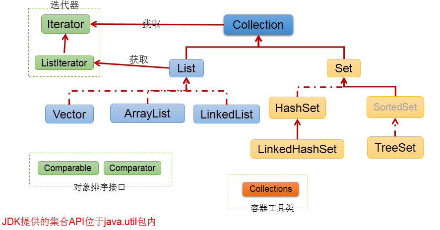
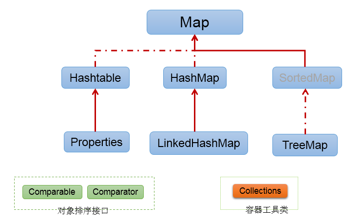
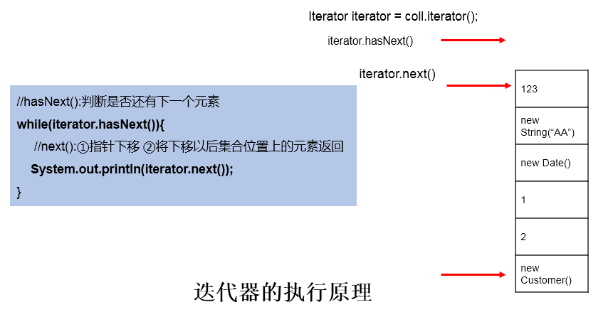

# day22授课笔记

讲师：宋红康

***

## 一、作业

练习1： 将字符串”2020-03-15”转换为java.sql.Date对象

```java
SimpleDateFormat sdf = new SimpleDateFormat("yyyy-MM-dd")；
java.util.Date date = sdf.parse("2020-03-15");
java.sql.Date d1 = new java.sql.Date(date.getTime());
```

练习2：

```java
public class Test1 {
	private static void change(String s, StringBuffer sb) {
		s = "aaaa";
		sb.setLength(5);
		sb.append("aaaa");
	}

	public static void main(String[] args) {
		String s = "bbbb";
		StringBuffer sb = new StringBuffer("bbbb");
		change(s, sb);
		System.out.println(s + sb);//bbbbaaaa
	}
}
```

练习3：

```java
public class Test2 {
	public static void main(String[] args) {
		StringBuffer a = new StringBuffer("A");
		StringBuffer b = new StringBuffer("B");
		operate(a, b);
		System.out.println(a + "," + b);//ABx,B
	}

	public static void operate(StringBuffer x, StringBuffer y) {
		x.append(y);//a:AB
		y = x;//y:AB
		y.append('x');//ABx
	}
}
```

练习4：

```java
class TEXT {
	public int num;
	public String str;

	public TEXT(int num, String str) {
		this.num = num;
		this.str = str;
	}
}

public class Test3 {
	public static void f1(TEXT tIn, int intIn, Integer integerIn, String strIn) {
		tIn.num = 200;
		tIn.str = "bcd";
		intIn = 200;
		integerIn = 200;
		strIn = "bcd";
	}

	public static void main(String[] args) {
		TEXT tIn = new TEXT(100, "abc");
		int intIn = 100;
		Integer integerIn = 100;
		String strIn = "abc";
		f1(tIn, intIn, integerIn, strIn);
		System.out.println(tIn.num + tIn.str + intIn + integerIn + strIn);
		//200,bcd,100,100,abc
	}
}
```

练习5：

```java
public class Test4 {
	public static void main(String[] args) throws Exception {
		String str = "中国";
		//在ISO8859-1中，一个字符使用一个字节来存储。
		System.out.println(str.getBytes("ISO8859-1").length);//2
		System.out.println(str.getBytes("GBK").length);//4
		System.out.println(str.getBytes("UTF-8").length);//6
		System.out.println(new String(str.getBytes("ISO8859-1"), "ISO8859-1"));//乱码
		System.out.println(new String(str.getBytes("GBK"), "GBK"));//中国
		System.out.println(new String(str.getBytes("UTF-8"), "UTF-8"));//中国
	}
}
```

## 二、复习

- String\StringBuffer\StringBuilder
  - String的相关知识点见昨天的复习
  - **【面试题】区分String、StringBuffer、StringBuilder**
    - 关于StringBuffer、StringBuilder的源码
  - StringBuffer\StringBuilder中常用方法：增、删、改、查、插、长度、反转

- 比较器：Comparable、Comparator接口
  - Java中的对象只要涉及到比较大小或排序，就会考虑这两个接口之一。
  - 自然排序：让需要排序或比较大小的对象所在的类去实现Comparable接口
    - “一劳永逸”
    - 在要重写的compareTo(Object obj)中指明如何判断对象的大小。
  - 定制排序：在需要使用的场景中，通常会有相应的方法，需要传入comparator。即指明按照此comparator对象中的方式进行多个对象的排序或比较大小。
    - “临时的，灵活的”
    - 比如：Arrays.sort(T[] arr,comparator)，TreeSet(comparator)，TreeMap(comparator)
    - 需要重写的方法是compare(Object o1,Object o2)，就按照此方法进行多个对象比较大小的判断

- JDK8之前日期时间的API
  - System.currentTimeMillis()
  - java.util.Date 及子类java.sql.Date
    - java.util.Date 两个构造器，两个方法
  - 涉及格式化和解析的SimpleDateFormat
    - 格式化:format，日期---> 字符串
    - 解析:parse ， 字符串---> 日期
  - 日历类：Calendar

## 三、jdk8中新的日期时间的api (熟悉)

- 日期时间API的发展
  - 第一代：Date
  - 第二代：Calendar
  - 第三代：java8新的日期时间的api
- 原有的api的问题
  - 可变性：像日期和时间这样的类应该是不可变的。
  - 偏移性：Date中的年份是从1900开始的，而月份都从0开始。
  - 格式化：格式化只对Date有用，Calendar则不行。
  - 此外，它们也不是线程安全的；不能处理闰秒等。

```java
    @Test
	public void test1() {
		String str1 = "hello";
		String str2 = str1.replace('h', 'm');
		System.out.println(str1);
		System.out.println(str2);

		// Calendar的可变性
		Calendar calendar = Calendar.getInstance();
		System.out.println(calendar.get(Calendar.DAY_OF_MONTH));
		calendar.set(Calendar.DAY_OF_MONTH, 23);
		System.out.println(calendar.get(Calendar.DAY_OF_MONTH));

		// 偏移性：Date中的年份是从1900开始的，而月份都从0开始
		Date date = new Date(2020 - 1900, 3 - 1, 14);
		System.out.println(date);// 2020-03-14
	}
```


### 3.1 LocalDate\LocalTime\LocalDateTime

```java
/*
	 * 1. LocalDate,LocalTime,LocalDateTime 类似于Calendar
	 */
	@Test
	public void test2() {
		// now():获取当前时间的对象
		LocalDate localDate = LocalDate.now();
		LocalTime localTime = LocalTime.now();
		LocalDateTime localDateTime = LocalDateTime.now();

		System.out.println(localDate);// 2020-03-14
		System.out.println(localTime);// 10:23:29.084
		System.out.println(localDateTime);// 2020-03-14T10:23:29.084
		// of():获取指定时间的对象
		LocalDateTime localDateTime1 = LocalDateTime.of(2020, 3, 14, 11, 24, 34);
		System.out.println(localDateTime1);// 2020-03-14T11:24:34

		// getXxx():
		int dayOfYear = localDateTime.getDayOfYear();
		System.out.println(dayOfYear);
		// withXxx():体现了不可变性
		LocalDateTime localDateTime2 = localDateTime.withDayOfMonth(24);
		System.out.println(localDateTime.getDayOfMonth());
		System.out.println(localDateTime2.getDayOfMonth());

		// plusXxx():
		LocalDateTime localDateTime3 = localDateTime.plusDays(3);
		System.out.println(localDateTime.getDayOfMonth());
		System.out.println(localDateTime3.getDayOfMonth());

	}
```


### 3.2 Instant

```java
/*
	 * Instant:瞬时点 类似于Date类
	 */
	@Test
	public void test3() {
		// now()：获取当前时间的instant的实例
		Instant instant = Instant.now();
		System.out.println(instant);
		//
		OffsetDateTime dateTime = instant.atOffset(ZoneOffset.ofHours(8));
		System.out.println(dateTime);

		// toEpochMilli():获取时间戳
		long epochMilli = instant.toEpochMilli();
		System.out.println(epochMilli);
		System.out.println(new java.util.Date().getTime());

		// 获取指定毫秒数的instant实例
		Instant instant1 = Instant.ofEpochMilli(234325435234L);
		System.out.println(instant1);
	}
```


### 3.3 DateTimeFormatter

```java
/*
	 * DateTimeFormatter用于格式化和解析操作
	 * 
	 * 类似于SimpleDateFormat
	 * 
	 */
	@Test
	public void test4() {
		// 方式一：预定义的标准格式。如：ISO_LOCAL_DATE_TIME;ISO_LOCAL_DATE;ISO_LOCAL_TIME
		DateTimeFormatter formatter = DateTimeFormatter.ISO_LOCAL_DATE_TIME;
		// 格式化:日期-->字符串
		LocalDateTime localDateTime = LocalDateTime.now();
		String str1 = formatter.format(localDateTime);
		System.out.println(localDateTime);
		System.out.println(str1);// 2019-02-18T15:42:18.797

		// 解析：字符串 -->日期
		TemporalAccessor parse = formatter.parse("2019-02-18T15:42:18.797");
		System.out.println(parse);

		// 方式二：
		// 本地化相关的格式。如：ofLocalizedDateTime()
		// FormatStyle.LONG / FormatStyle.MEDIUM / FormatStyle.SHORT
		// :适用于LocalDateTime
		DateTimeFormatter formatter1 = DateTimeFormatter.ofLocalizedDateTime(FormatStyle.LONG);
		// 格式化
		String str2 = formatter1.format(localDateTime);
		System.out.println(str2);// 2019年2月18日 下午03时47分16秒

		// 本地化相关的格式。如：ofLocalizedDate()
		// FormatStyle.FULL / FormatStyle.LONG / FormatStyle.MEDIUM /
		// FormatStyle.SHORT : 适用于LocalDate
		DateTimeFormatter formatter2 = DateTimeFormatter.ofLocalizedDate(FormatStyle.FULL);
		// 格式化
		String str3 = formatter2.format(LocalDate.now());
		System.out.println(str3);// 2020年3月14日 星期六
		
		//方式三：自定义的方式（关注、重点）
		DateTimeFormatter dateTimeFormatter = DateTimeFormatter.ofPattern("yyyy/MM/dd hh:mm:ss");
		//格式化
		String strDateTime = dateTimeFormatter.format(LocalDateTime.now());
		System.out.println(strDateTime);
		//解析
		TemporalAccessor accessor = dateTimeFormatter.parse("2020/03/14 10:45:24");
		System.out.println(accessor);
	}
```

## 四、其他api （了解）

### 4.1 System

- currentTimeMillis()
- exit(0):退出程序
- gc():强制调用垃圾回收器，回收垃圾

### 4.2 Math

```
java.lang.Math提供了一系列静态方法用于科学计算。其方法的参数和返回值类型一般为double型。
abs     绝对值
acos,asin,atan,cos,sin,tan  三角函数
sqrt     平方根
pow(double a,doble b)     a的b次幂
log    自然对数
exp    e为底指数
max(double a,double b)
min(double a,double b)
random()      返回0.0到1.0的随机数
long round(double a)     double型数据a转换为long型（四舍五入）
toDegrees(double angrad)     弧度—>角度
toRadians(double angdeg)     角度—>弧度

```


### 4.3 BigInteger和BigDecimal

- BigInteger:可以表示任何精度的整数
- BigDecimal:可以表示任何精度的浮点型值

```java
@Test
	public void testBigInteger() {
	    BigInteger bi = new BigInteger("12433241123");
	    BigDecimal bd = new BigDecimal("12435.351");
	    BigDecimal bd2 = new BigDecimal("11");
	    System.out.println(bi);
	    // System.out.println(bd.divide(bd2));
	    System.out.println(bd.divide(bd2, BigDecimal.ROUND_HALF_UP));
	    System.out.println(bd.divide(bd2, 15, BigDecimal.ROUND_HALF_UP));
	}
```

## 五、集合概述与Collection （掌握）

### 5.1 数组的特点和弊端

```
 * 一、Java的内存层面，对多个对象进行统一的管理和操作的容器有什么呢？ 数组、集合
 * 
 * 二、1. 数组在存储数据方面的特点：
 * 		> 数组一旦初始化以后，其长度就是确定的。
 * 		> 数组有索引，可以方便的对指定位置上的元素进行查找、替换
 * 		> 数组存储的数据：有序的、使用连续的内存空间
 * 		> 数组在定义时，就明确了存储的数据的类型。
 * 			比如：String[] arr,Object[]
 *    2. 数组在存储数据方面的弊端：
 * 		> 数组一旦初始化以后，其长度就不可改变--->如果需要扩容，必须新建数组
 * 		> 数组在插入、删除等操作时，效率很差
 * 		> 可以表达的多个对象的关系较为简单，不能描述更为丰富的对象关系
 * 		> 数组中可以使用的方法非常少
```

### 5.2 集合框架结构

```java
 * 	|-----Collection:存储一个一个的数据
 * 		|-----List:存储有序的、可以重复的数据 ： 替换数组，"动态数组"
 * 			|-----ArrayList/LinkedList/Vector
 * 		|-----Set:存储无序的、不可重复的数据： 高中的集合
 * 			|-----HashSet/LinkedHashSet/TreeSet
 * 	|-----Map:存储一对一对的数据（key-value)：高中的函数。 y = f(x) (x1,y1),(x2,y2)
 * 		|-----HashMap/LinkedHashMap/TreeMap/Hashtable/Properties
```





### 5.3 本章要求

```
 * 本章对大家的要求：
 * 	层次一：针对不同特点的数据，能够选择对应接口的主要的类进行实例化和方法的调用
 *  层次二：熟悉接口的不同的实现类的区别、特点
 *  层次三：相关接口实现类的底层实现：存储结构
```

### 5.4 Collection中的常用方法

```java
@Test
	public void test1(){
		
		Collection c1 = new ArrayList();
		//1. add(Object obj):添加元素obj到当前集合中
		c1.add(123);//自动装箱
		c1.add("AA");
		c1.add(new Date(234234324L));
		c1.add("BB");
		System.out.println(c1);
		
		//2.size():获取集合中元素的个数
		System.out.println(c1.size());
		
		//3.addAll(Collection coll):将coll集合中的元素添加到当前集合中。
		Collection c2 = new ArrayList();
		c2.add(345);
		c2.add("CC");
		c1.addAll(c2);
//		c1.add(c2);
		System.out.println(c1.size());
		
		//5.clear():清空当前集合
		c1.clear();
		
		//4.isEmpty():判断当前集合是否为空。
		System.out.println(c1.isEmpty());
		System.out.println(c1);
	}
	@Test
	public void test2(){
		Collection c1 = new ArrayList();
		c1.add(123);//自动装箱
		c1.add(new Person("Tom",12));
		c1.add(new String("AA"));
		c1.add(new Date(234234324L));
		c1.add("BB");
		
		//6.contains(Object obj):判断当前集合中是否包含obj元素
		//具体的：需要调用obj对象所在类的equals(Object o)
		System.out.println(c1.contains(new String("AA")));
		System.out.println(c1.contains(new Person("Tom",12)));
		
		//7.containsAll(Collection coll):判断当前集合中是否包含coll集合中的所有元素
		Collection c2 = new ArrayList();
		c2.add(1234);
		c2.add(new String("BB"));
		System.out.println(c1.containsAll(c2));
	}
	
	@Test
	public void test3(){
		Collection c1 = new ArrayList();
		c1.add(123);//自动装箱
		c1.add(new Person("Tom",12));
		c1.add(new String("AA"));
		c1.add(123);//自动装箱
		c1.add(new Date(234234324L));
		c1.add("BB");
		
		//8.remove(Object obj):删除当前集合中首次出现的obj元素
		System.out.println(c1.remove(1234));
		System.out.println(c1);
		
		//9.removeAll(Collection coll):差集：从当前集合中移除其与coll集合共有的元素
		Collection c2 = new ArrayList();
		c2.add(1234);
		c2.add(new String("BB"));
		c1.removeAll(c2);
		System.out.println(c1);
		
	}
	@Test
	public void test4(){
		Collection c1 = new ArrayList();
		c1.add(123);//自动装箱
		c1.add(new Person("Tom",12));
		c1.add(new String("AA"));
		c1.add(new Date(234234324L));
		c1.add("BB");
		
		//10.retainAll(Collection coll):交集：获取当期集合与coll集合共有的元素
		Collection c2 = new ArrayList();
		c2.add(123);//自动装箱
		c2.add(new Person("Tom",12));
		c2.add(new String("AA"));
		c2.add("BB");
		c2.add(new Date(234234324L));
//		c1.retainAll(c2);
//		System.out.println(c1);
		
		//11. equals(Object obj):判断当前集合与obj元素是否相等
		//要想返回true，要求形参obj也是一个同类型的集合对象，同时集合元素都相同。（如果是List的话，要求顺序也相同）
		System.out.println(c1.equals(c2));
		
		//12.hashCode():返回当前集合对象的哈希值
		System.out.println(c1.hashCode());
	}
```

### 5.5 数组与集合的转换

```java
    @Test
	public void test5(){
		Collection c1 = new ArrayList();
		c1.add(123);//自动装箱
		c1.add(new Person("Tom",12));
		c1.add(new String("AA"));
		c1.add(new Date(234234324L));
		c1.add("BB");
		
		//13.toArray():将集合转换为数组
		Object[] arr = c1.toArray();
		for(int i = 0;i < arr.length;i++){
			System.out.println(arr[i]);
		}
		
		//如何将数组转换为集合？yes!
        //使用Arrays的asList(T...t)
		String[] arr1 = {"AA","CC","MM","GG"};
		List list = Arrays.asList(arr1);
		System.out.println(list);
		
		List list1 = Arrays.asList("AA","CC","MM");
		
		//笔试题：
		Integer[] arr2 = new Integer[]{1,2,3};
		int[] arr3 = new int[]{1,2,3};
		List list2 = Arrays.asList(arr2);
		List list3 = Arrays.asList(arr3);
		List list4 = Arrays.asList(1,2,3);
		System.out.println(list2.size());//3
		System.out.println(list3.size());//1
		System.out.println(list4.size());//3
		System.out.println(list3);//[[I@4459eb14]
		
	}
```

### 5.6 集合的遍历：使用Iterator接口

```
@Test
	public void test1(){
		Collection c1 = new ArrayList();
		c1.add(123);//自动装箱
		c1.add(new Person("Tom",12));
		c1.add(new String("AA"));
		c1.add(new Date(234234324L));
		c1.add("BB");
		
//		System.out.println(c1);
		//Iterator对象称为迭代器(设计模式的一种)，主要用于遍历 Collection 集合中的元素。
		Iterator iterator = c1.iterator();
		//方式一：
//		System.out.println(iterator.next());
//		System.out.println(iterator.next());
//		System.out.println(iterator.next());
//		System.out.println(iterator.next());
//		System.out.println(iterator.next());
//		//报NoSuchElementException
//		System.out.println(iterator.next());
		
		//方式二：不推荐
//		for(int i = 0;i < c1.size();i++){
//			System.out.println(iterator.next());
//		}
		//方式三：推荐
		//hasNext():判断集合的下个位置是否还有元素
		while(iterator.hasNext()){
			//next():① 指针下移 ② 将下移以后位置上的元素返回
			Object obj = iterator.next();
			System.out.println(obj);
		}
		
	}
```

对应的迭代器的执行原理：



错误的写法：

```java
//错误的遍历方式
	@Test
	public void test2(){
		Collection c1 = new ArrayList();
		c1.add(123);//自动装箱
		c1.add(new Person("Tom",12));
		c1.add(new String("AA"));
		c1.add(new Date(234234324L));
		c1.add("BB");
		//错误方式一：
//		Iterator iterator = c1.iterator();
//		while(iterator.next() != null){
//			System.out.println(iterator.next());
//			
//		}
		//错误方式二：每次调用iterator()时，都会返回一个迭代器对象，指针从头开始
//		while(c1.iterator().hasNext()){
//			Object obj = c1.iterator().next();
//			System.out.println(obj);
//		}
	}
```

### 5.7 增强for循环

- 用来遍历集合

```java
@Test
	public void test1(){
		Collection c1 = new ArrayList();
		c1.add(123);//自动装箱
		c1.add(new Person("Tom",12));
		c1.add(new String("AA"));
		c1.add(new Date(234234324L));
		c1.add("BB");
		
		//格式：for(集合元素类型  变量名 : 待遍历的集合对象的引用)
		for(Object obj : c1){
			
			System.out.println(obj);
		}
		
	}
```


- 用来遍历数组

```java
@Test
	public void test2(){
		int[] arr = {1,2,3,4,5};
		
		for(int i : arr){
			System.out.println(i);
		}
	}
```

- 面试题

```java
//面试题
	@Test
	public void test3(){
		int[] arr = {1,2,3,4,5};
		//操作一：
//		for(int i : arr){
//			i = 6;
//			System.out.println(i);
//		}
		//操作二：
		for(int i = 0;i < arr.length;i++){
			arr[i] = 6;
		}
		
		for(int i = 0;i < arr.length;i++){
			System.out.println(arr[i]);
		}
	}
```

## 六、List接口

### 6.1 List中的常用方法

```java
//List是Collection的子接口，Collection中声明的方法，在List的实现类中都可以使用。
	//此外，由于List是有序的，所有额外添加了一些方法。
	/*
	 * void add(int index, Object ele):在index位置插入ele元素
	 * boolean addAll(int index, Collection eles):从index位置开始将eles中的所有元素添加进来
	 * Object get(int index):获取指定index位置的元素
	 * int indexOf(Object obj):返回obj在集合中首次出现的位置
	 * int lastIndexOf(Object obj):返回obj在当前集合中末次出现的位置
	 * Object remove(int index):移除指定index位置的元素，并返回此元素
	 * Object set(int index, Object ele):设置指定index位置的元素为ele
	 * List subList(int fromIndex, int toIndex):返回从fromIndex到toIndex位置的子集合
	 * 
	 * 
	 * 	总结：（必须掌握)
	 * 		增：add(Object obj)
	 * 		删：remove(Object obj)/remove(int index)
	 * 		改：set(int index, Object ele)
	 * 		查：get(int index)
	 * 		插：add(int index, Object ele)
	 * 		长度：size()
	 * 		遍历：iterator() / 增强for
	 */
	@Test
	public void test1(){
		List list = new ArrayList();
		list.add(123);//自动装箱
		list.add(567);
		list.add("AA");
		
//		list.remove("AA");
//		list.remove(new Integer(123));
//		list.set(1, "BB");
		list.add(1, "CC");
		
		System.out.println(list);
//		System.out.println(list.get(2));
		System.out.println(list.size());
	}
	
	@Test
	public void test2(){
		List list = new ArrayList();
		list.add(123);//自动装箱
		list.add(567);
		list.add("AA");
		//方式一：使用迭代器
//		Iterator iterator = list.iterator();
//		while(iterator.hasNext()){
//			System.out.println(iterator.next());
//		}
		//方式二：增强for
//		for(Object obj : list){
//			System.out.println(obj);
//		}
		
		//方式三：一般for循环
		for(int i = 0;i < list.size();i++){
			System.out.println(list.get(i));
		}
	}
	
	@Test
	public void test3(){
		List list = new ArrayList();
		list.add(123);//自动装箱
		list.add(567);
		list.add("AA");
		
		List list1 = Arrays.asList(1,2,3);
		list.addAll(1, list1);
		System.out.println(list);
		
		List list2 = list.subList(1,3);
		System.out.println(list2);
	}
```

### 6.2 不同的实现类

```java
|-----Collection:存储一个一个的数据
	|-----List:存储有序的、可以重复的数据 ： 替换数组，"动态数组"
		|-----ArrayList:List的主要实现类；线程不安全的，效率高；底层使用Object[]存储
		|-----LinkedList:底层使用双向链表存储数据；对于频繁的插入、删除操作，使用此类效率高。
		|-----Vector:List的古老实现类；线程安全的，效率低；底层使用Object[]存储
				
面试题：区分ArrayList、LinkedList、Vector
		
		
数据结构中的数据存储结构：
	> 真实结构：① 顺序表（一维数组）
			 ② 链表
	> 抽象数据结构(ADT):栈、队列、树、图

```

