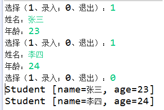
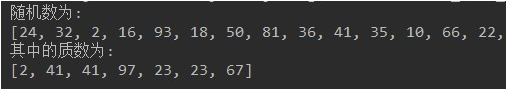
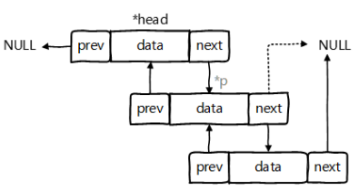
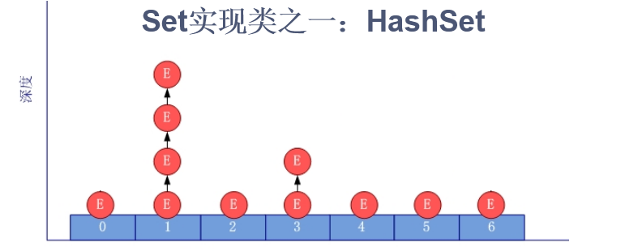
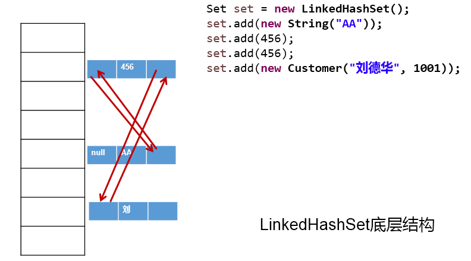
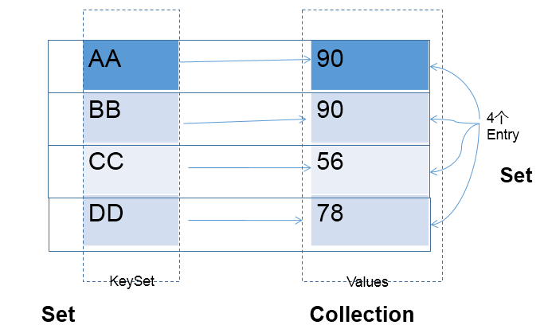

day23授课笔记

## 一、作业

练习1：

```
•	键盘录入学生信息，保存到集合中。
o	循环录入的方式，1：表示继续录入，0：表示结束录入。
o	定义学生类，属性为姓名，年龄，使用学生对象保存录入数据。
o	使用ArrayList集合，保存学生对象，录入结束后，用foreach遍历集合。
•	代码实现，效果如图所示：

```



```java
public class StudentTest {
    public static void main(String[] args) {

        Scanner scanner = new Scanner(System.in);
        ArrayList stuList = new ArrayList();

        for (;;) {

            System.out.println("选择（录入 1 ；结束 0）");
            int x = scanner.nextInt();//根据x的值，判断是否需要继续循环

            if (x == 1) {
                System.out.println("姓名");
                String name = scanner.next();
                System.out.println("年龄");
                int age = scanner.nextInt();
                Student stu = new Student(age, name);
                stuList.add(stu);

            } else if (x == 0) {
                break;

            } else {

                System.out.println("输入有误，请重新输入");
            }
        }

        for (Object stu : stuList) {
            System.out.println(stu);
        }
    }
}
```

练习2：

```
•	随机生成30个数，范围2-100，获取其中的质数。
•	代码实现，效果如图所示：
```




写法一：

```java
public class PrimeNumberPrintTest1 {

    public static void main(String[] args) {

        ArrayList numberList = new ArrayList();
        int num = 0;
        for (int i = 0; i < 30; i++) {
            num = (int)(Math.random() * (100-2+1) ) + 2;
            if(!numberList.contains(num)){
            	 numberList.add(num);
            }else{
            	i--;
            }
        }

        System.out.println(numberList);
        
        
        
        ArrayList primeList = new ArrayList();//用于存储所有的质数
		
        int j;
        boolean flag;
        for (int i = 0; i < numberList.size(); i++) {
            
            flag = false;
            int number = (int) numberList.get(i);
            for (j = 2; j <= Math.sqrt(number); j++) {
                if (number % j == 0){
                    flag = true;
                    break;
                }
            }
            if (!flag){
            	primeList.add(number);
            }
        }
        
        System.out.println("当前随机数中的质数有：");
        for(Object obj : primeList){
        	System.out.println(obj);
        }
    }

}
```

写法二：

```java
public class PrimeNumberPrintTest2 {

	public static void main(String[] args) {

		List numberList = generateRandomNumber(30, 2, 100);

		System.out.println(numberList);

		
		List primeList = getPrimeNumber(numberList);

		System.out.println("当前随机数中的质数有：");
		System.out.println(primeList);
	}

	/**
	 * 获取30个随机数，范围为2-100
	 * 
	 * @Description
	 * @author shkstart
	 * @date 2020年3月16日上午9:34:37
	 * @param size
	 * @param startNumber
	 * @param endNumber
	 * @return
	 */
	private static List generateRandomNumber(int size, int startNumber, int endNumber) {
		ArrayList numberList = new ArrayList();
		for (int i = 0; i < size; i++) {
			int num = (int) (Math.random() * (endNumber - startNumber + 1)) + startNumber;
			if (!numberList.contains(num)) {
				numberList.add(num);
			} else {
				i--;
			}
		}

		return numberList;

	}
	/**
	 *  获取指定List中所有数值中的质数
	 * @Description 
	 * @author shkstart
	 * @date 2020年3月16日上午9:37:08
	 * @param numberList
	 * @return
	 */
	private static List getPrimeNumber(List numberList) {
		ArrayList primeList = new ArrayList();// 用于存储所有的质数

		for (int i = 0; i < numberList.size(); i++) {

			boolean flag = false;
			int number = (int) numberList.get(i);
			for (int j = 2; j <= Math.sqrt(number); j++) {
				if (number % j == 0) {
					flag = true;
					break;
				}
			}
			if (!flag) {
				primeList.add(number);
			}
		}
		return primeList;
	}
}
```

## 二、复习

- 字符串相关的类：String\StringBuffer\StringBuilder  （重点）
- 比较器：Comparable \ Comparator  (可以实现java中的对象比较大小、排序)   （重点）
- 日期时间的API
  - jdk 8之前的API：java.util.Date (子类：java.sql.Date) 、Calendar、**SimpleSDateFormat(格式化、解析)**
  - jdk8中API：Instant、LocalDate\LocalTime\ **LocalDateTime**、**DateTimeFormater**

- 其他的常用类：BigInteger、BigDecimal

- Collection\List\Set\Map存储数据的特点
- **Collection中的常用方法（掌握）**
  - 遍历时，使用迭代器（Iterator）
- List
  - List中的常用方法： 增、删、改、查、插、长度、遍历
  - 三个实现类的对比--->面试题
  - ArrayList、LinkedList的源码分析

## 三、List的源码分析

### 3.1 ArrayList的源码分析

```java
3.1 jdk7版本：
 * 	  ArrayList list = new ArrayList();//初始化底层的elementDate的Object[]数组，长度为10.
 *    list.add(123);//elementDate[0] = new Integer(123);
 *    ...
 *    list.add("AA");//一旦添加的数据的个数超出了底层数组的长度10，需要考虑扩容。
 *    默认容量扩容扩容为原来的1.5倍，同时将旧数组中的数据都复制到新的数组中。
 *       
 
```

源码情况：

```java
 /**
     * Constructs an empty list with an initial capacity of ten.
     */
    public ArrayList() {
        this(10);
    }
   
  #######################
  /**
     * Constructs an empty list with the specified initial capacity.
     *
     * @param  initialCapacity  the initial capacity of the list
     * @throws IllegalArgumentException if the specified initial capacity
     *         is negative
     */
    public ArrayList(int initialCapacity) {
        super();
        if (initialCapacity < 0)
            throw new IllegalArgumentException("Illegal Capacity: "+
                                               initialCapacity);
        this.elementData = new Object[initialCapacity];
    }
    
  #######################
   public boolean add(E e) {
        ensureCapacityInternal(size + 1);  // Increments modCount!!
        elementData[size++] = e;
        return true;
    }
  在添加数据之前，需要先判断底层数组的容量是否够：ensureCapacityInternal()
  ####################### 
  private void ensureCapacityInternal(int minCapacity) {
        modCount++;
        // overflow-conscious code
        if (minCapacity - elementData.length > 0)
            grow(minCapacity); //满足条件的情况，底层进行扩容
    }
 ####################### 
 private void grow(int minCapacity) {
        // overflow-conscious code
        int oldCapacity = elementData.length;
        int newCapacity = oldCapacity + (oldCapacity >> 1);//默认扩容比例：1.5倍
        //特殊情况的扩容比例：
        if (newCapacity - minCapacity < 0)
            newCapacity = minCapacity;
        if (newCapacity - MAX_ARRAY_SIZE > 0)
            newCapacity = hugeCapacity(minCapacity);
        //创建新长度的数组，并将原有数组中的数据copy到新的数组中。
        elementData = Arrays.copyOf(elementData, newCapacity);
    } 
```


```java
*    3.2 jdk8版本：  
 *    ArrayList list = new ArrayList();//初始化底层elementData的Object[]数组为{}
 *    list.add(123);//此时底层创建长度为10的elementData数组，并将new Integer(123)存放到角标0的索引位置。
 *    。。。
 *    list.add("AA");//一旦添加的数据的个数超出了底层数组的长度10，需要考虑扩容。
 *    默认容量扩容扩容为原来的1.5倍，同时将旧数组中的数据都复制到新的数组中。
```

源码：

```java
/**
     * Constructs an empty list with an initial capacity of ten.
     */
    public ArrayList() {
        this.elementData = DEFAULTCAPACITY_EMPTY_ELEMENTDATA;
    }
 ####################### 
 private static final Object[] DEFAULTCAPACITY_EMPTY_ELEMENTDATA = {};
 
 ####################### 
  public boolean add(E e) {
        ensureCapacityInternal(size + 1);  // Increments modCount!!
        elementData[size++] = e;
        return true;
    }
 ####################### 
 private void ensureCapacityInternal(int minCapacity) {
 		//如果是首次调用add()，则此时的minCapacity赋值为10
        if (elementData == DEFAULTCAPACITY_EMPTY_ELEMENTDATA) { 
            minCapacity = Math.max(DEFAULT_CAPACITY, minCapacity);
        }
		//如果是首次添加，调用此方法，将原有的{}替换为长度为10的Object[]数组
        ensureExplicitCapacity(minCapacity);
    }
 ####################### 
 private void ensureExplicitCapacity(int minCapacity) {
        modCount++;

        // overflow-conscious code
        if (minCapacity - elementData.length > 0)
            grow(minCapacity);
    }
 ####################### 
 private void grow(int minCapacity) {
        // overflow-conscious code
        int oldCapacity = elementData.length;
        int newCapacity = oldCapacity + (oldCapacity >> 1);
        if (newCapacity - minCapacity < 0)
            newCapacity = minCapacity;
        if (newCapacity - MAX_ARRAY_SIZE > 0)
            newCapacity = hugeCapacity(minCapacity);
        // minCapacity is usually close to size, so this is a win:
        elementData = Arrays.copyOf(elementData, newCapacity);
    }
```

```java
*    3.3 说明：
 *    jdk7中ArrayList底层的数组的创建类似于单例模式中的饿汉式，jdk8中ArrayList底层的数组的创建类似于单例模式中的懒汉式
 *    
```

### 3.2 Vector的源码分析

```
 * 		Vector v = new Vector();
 * 		v.add(123);
 * 		。。。
 *    > jdk7和jdk8中在创建对象时，底层的操作相同，都是创建长度为10的Object[]。
 *    > 当底层容量不足时，默认扩容为原来的2倍	
```

源码：

```java
public Vector() {
        this(10);
}
public Vector(int initialCapacity) {
        this(initialCapacity, 0);
}
public Vector(int initialCapacity, int capacityIncrement) {
        super();
        if (initialCapacity < 0)
            throw new IllegalArgumentException("Illegal Capacity: "+
                                               initialCapacity);
        this.elementData = new Object[initialCapacity];
        this.capacityIncrement = capacityIncrement;
}
private void grow(int minCapacity) {
        // overflow-conscious code
        int oldCapacity = elementData.length;
        int newCapacity = oldCapacity + ((capacityIncrement > 0) ?
                                         capacityIncrement : oldCapacity);
        if (newCapacity - minCapacity < 0)
            newCapacity = minCapacity;
        if (newCapacity - MAX_ARRAY_SIZE > 0)
            newCapacity = hugeCapacity(minCapacity);
        elementData = Arrays.copyOf(elementData, newCapacity);
    }
```

### 3.3 LinkecList的源码分析

```java
 * 	 LinkedList list = new LinkedList();
 *   list.add(123); 
 *   ....
 *   
 *   底层的Node为：记录了当前元素的前一个元素和后一个元素。证明：LinkedList中是双向链表
 *   private static class Node<E> {
        E item;
        Node<E> next;
        Node<E> prev;

        Node(Node<E> prev, E element, Node<E> next) {
            this.item = element;
            this.next = next;
            this.prev = prev;//前向指针的产生
        }
    }
 * 
 *   LinkedList在添加数据时，元素封装在Node对象中，并指明其前一个和后一个元素。
 *   LinkedList不存在添加时，考虑扩容的问题。因为底层不是使用的数组，在内存中多个元素也不是连续存放的。
```

源码：

```java
/**
* Constructs an empty list.
 */
 public LinkedList() {
 }
 #########################
 public boolean add(E e) {
        linkLast(e);
        return true;
    }
 #########################
transient Node<E> first;
transient Node<E> last;

 void linkLast(E e) {
        final Node<E> l = last;
        final Node<E> newNode = new Node<>(l, e, null);
        last = newNode;
        if (l == null)  //返回true，表示是首次添加
            first = newNode;
        else  //表示不是首次添加
            l.next = newNode;//后向指针的产生
        size++;
        modCount++;
    }
 #########################
     private static class Node<E> {
        E item;
        Node<E> next;
        Node<E> prev;

        Node(Node<E> prev, E element, Node<E> next) {
            this.item = element;
            this.next = next;
            this.prev = prev;//前向指针的产生
        }
    }

 
 
```



### 3.4 结论

```
 * 小结
 * 	 1. 建议开发中，如果基本确定底层数组的容量，建议使用带参数的构造器
 *   ArrayList list =  new ArrayList(int initialCapacity);//new Object[initialCapacity];
 *   避免底层不断的扩容和复制操作
 *   2. 对于数组来说，查找操作的复杂度是O(1),插入或删除操作的复杂度是O(n)
 *      对于链表来说，查找操作的复杂度是O(n),插入或删除操作的复杂度是O(1)
 *      
 *   开发中，如果很少执行插入或删除操作，建议使用ArrayList
 *   如果频繁的使用插入或删除操作，建议使用LinkedList
```

## 四、Set的使用

### 4.1 主要实现类和方法

 *  主要实现类就是：HashSet
 *  常用方法：Set接口中声明的方法都是Collection接口声明过的。HashSet能使用的就是Collection中定义的方法。

```java
@Test
	public void test1(){
		Set set = new HashSet();
		
		set.add(223);
		set.add(new String("AA"));
		set.add("CC");
		set.add(223);
		set.add(new String("AA"));
		set.add(new Person("Tom",12));
		set.add(new Person("Tom",12));
		set.add(null);
		
		
		for(Object obj : set){
			System.out.println(obj);
		}
		
	}
```


### 4.2 Set的特性：无序性、不可重复性

① 无序性：不等同于随机性！元素在底层储存的位置不是像数组一样是依次紧密排列的，而是参考其hashCode值决定的存储位置。理解为无序性

② 不可重复性：根据对象的equals()进行判断。如果返回true，则添加失败。保证了不可重复性。

### 4.3 向HashSet中添加数据的过程

```
如何将元素添加到HashSet中的呢？
 *      前提：HashSet底层也是使用数组+链表+(jdk8:红黑树)存储
 *  	① 将元素e1添加到HashSet中，首先调用e1所在类的hashCode()，获取e1对象的哈希值。
 *      ② 此哈希值，经过某种算法以后，获取其在HashSet底层数组中的存放位置。
 *      ③ 如果此位置上，没有其他任何元素，则e1添加成功  --->情况1
 *        如果此位置上，已经存在某个或某几个元素e2,则继续判断。
 *        		④ 比较e1和e2的哈希值，如果两个哈希值不相同。则e1添加成功。   --->情况2
 *        		  比较e1和e2的哈希值，如果两个哈希值相同，则调用e1所在类的equals()方法
 *        				⑤ equals()方法返回false,则e1添加成功。    --->情况3
 *                        equals()方法返回true,则e1添加失败。       
 *     
 *     情况1：将e1直接保存在数组的指定位置
 *     情况2、情况3：此时e1与现有索引位置上的元素，以链表的方式进行保存。
 *     		> jdk7:新的元素e1方法到数组中，指向原有的元素
 *     		> jdk8:已有的元素的末尾指向新的元素e1.
 *          总结："七上八下"
```



### 4.4 向HashSet中添加的元素所在类的要求

```
 1. 针对于HashSet或者LinkedHashSet来说，如果多个对象需要存储到上述两个Set中时，为了保证不可重复性，
 *   必须要求对象所属的类要重写hashCode()和equals()
 2. 重写hashCode()和equals()要保证一致性！相等的对象必须具有相等的散列码
```

### 4.5 Set的不同实现类的对比

```java
|-----Collection:存储一个一个的数据
 * 		|-----Set:存储无序的、不可重复的数据： 高中的集合
 * 			|-----HashSet：是Set的主要实现类;线程不安全的;可以存储null值
				|-----LinkedHashSet:是HashSet的子类;在添加数据之外，还通过一对指针记录先后添加						的顺序，使得遍历Set元素时，较HashSet效率更高。
			
			|-----TreeSet:可以按照添加的元素的指定的属性的大小进行遍历；底层使用的是红黑树（排序二						叉树的一种）
			
```

### 4.6 LinkedHashSet的测试 （了解）

```
    @Test
	public void test2(){
		Set set = new LinkedHashSet();
		
		set.add(223);
		set.add(new String("AA"));
		set.add("CC");
		set.add(223);
		set.add(new String("AA"));
		set.add(new Person("Tom",12));
		set.add(new Person("Tom",12));
		set.add(null);
		
		for(Object obj : set){
			System.out.println(obj);
		}
		
	}
```

对应的图示：



### 4.7 TreeSet添加数据的情况 (了解)

```java
//1. TreeSet可以按照添加的元素的指定的属性的大小进行遍历；
//	排序的方式有：自然排序，定制排序
//2. TreeSet底层使用的是红黑树（排序二叉树的一种）
//3. 要求：向TreeSet中添加的元素必须是同一个类型的对象。
//4. 说明：TreeSet中不能存放相同的元素。判断的标准不再是元素所在类的hashCode()和equals()了。而是按照自然
//     排序或定制排序中重写的compareTo()或compare()进行比较。
```

- 自然排序

  举例1:

```
@Test
	public void test1(){
		
		TreeSet set = new TreeSet();
		set.add("CC");
		set.add("MM");
		set.add("GG");
		set.add("TT");
		set.add("JJ");
		set.add("KK");
//		set.add(123);//报ClassCastException
		
		Iterator iterator = set.iterator();
		while(iterator.hasNext()){
			System.out.println(iterator.next());
		}
		
	}
```

​	举例2：

```
@Test
	public void test2(){
		TreeSet set = new TreeSet();
		
		Person p1 = new Person("Tom",12);
		Person p2 = new Person("Jim",32);
		Person p3 = new Person("Jerry",26);
		Person p4 = new Person("Mike",43);
		Person p5 = new Person("Lily",26);
		
		set.add(p1);
		set.add(p2);
		set.add(p3);
		set.add(p4);
		set.add(p5);
		
		Iterator iterator = set.iterator();
		while(iterator.hasNext()){
			System.out.println(iterator.next());
		}
	}
```

其中，Person类定义如下：

```java
public class Person implements Comparable{
	private String name;
	private int age;
	public Person() {
		super();
	}
	public Person(String name, int age) {
		super();
		this.name = name;
		this.age = age;
	}
	public String getName() {
		return name;
	}
	public void setName(String name) {
		this.name = name;
	}
	public int getAge() {
		return age;
	}
	public void setAge(int age) {
		this.age = age;
	}
	@Override
	public String toString() {
		return "Person [name=" + name + ", age=" + age + "]";
	}
	/*
	@Override
	public int hashCode() { //return age + name.hashCode();
		final int prime = 31;
		int result = 1;
		result = prime * result + age;
		result = prime * result + ((name == null) ? 0 : name.hashCode());
		return result;
	}
	@Override
	public boolean equals(Object obj) {
		System.out.println("Person equals....");
		if (this == obj)
			return true;
		if (obj == null)
			return false;
		if (getClass() != obj.getClass())
			return false;
		Person other = (Person) obj;
		if (age != other.age)
			return false;
		if (name == null) {
			if (other.name != null)
				return false;
		} else if (!name.equals(other.name))
			return false;
		return true;
	}
	*/
	//先按照年龄从小到大排列，再按照姓名从小到大排
	@Override
	public int compareTo(Object o) {
			
		if(o instanceof Person){
			Person p = (Person)o;
			int value = this.age - p.age;
			if(value != 0){
				return value;
			}else{
				return this.name.compareTo(p.name);
			}
		}
		
		throw new RuntimeException("输入的类型不匹配");
	}
	
	
}
```


- 定制排序

```java
@Test
	public void test3(){
		Comparator com = new Comparator(){

			@Override
			public int compare(Object o1, Object o2) {//o1,o2应该为Person的实例
				if(o1 instanceof Person && o2 instanceof Person){
					Person p1 = (Person)o1;
					Person p2 = (Person)o2;
					return -p1.getName().compareTo(p2.getName());
				}
				
				return 0;
			}
			
		};
		TreeSet set = new TreeSet(com);
		
		Person p1 = new Person("Tom",12);
		Person p2 = new Person("Jim",32);
		Person p3 = new Person("Jerry",26);
		Person p4 = new Person("Mike",43);
		Person p5 = new Person("Lily",26);
		
		set.add(p1);
		set.add(p2);
		set.add(p3);
		set.add(p4);
		set.add(p5);
		
		Iterator iterator = set.iterator();
		while(iterator.hasNext()){
			System.out.println(iterator.next());
		}
	}
```

### 4.8 课后练习

练习1：

```
HashSet set = new HashSet();
Person p1 = new Person(1001,"AA");
Person p2 = new Person(1002,"BB");

set.add(p1);
set.add(p2);
p1.name = "CC";
set.remove(p1);
System.out.println(set);
set.add(new Person(1001,"CC"));
System.out.println(set);
set.add(new Person(1001,"AA"));
System.out.println(set);

其中Person类中重写了hashCode()和equal()方法

```

练习2：

```
练习：在List内去除重复数字值，要求尽量简单

答案：
public static List duplicateList(List list) {
      HashSet set = new HashSet();
      set.addAll(list);
      return new ArrayList(set);
}
public static void main(String[] args) {
      List list = new ArrayList();
      list.add(new Integer(1));
      list.add(new Integer(2));
      list.add(new Integer(2));
      list.add(new Integer(4));
      list.add(new Integer(4));
      List list2 = duplicateList(list);
      for (Object integer : list2) {
          System.out.println(integer);
      }
}
```

练习3：

```
1. 定义一个Employee类。
该类包含：private成员变量name,age,birthday，其中 birthday 为 MyDate 类的对象；
并为每一个属性定义 getter, setter 方法；
并重写 toString 方法输出 name, age, birthday

MyDate类包含:
private成员变量year,month,day；并为每一个属性定义 getter, setter 方法；

创建该类的 5 个对象，并把这些对象放入 TreeSet 集合中（下一章：TreeSet 需使用泛型来定义）
分别按以下两种方式对集合中的元素进行排序，并遍历输出：

1). 使Employee 实现 Comparable 接口，并按 name 排序
2). 创建 TreeSet 时传入 Comparator对象，按生日日期的先后排序。


```


## 五、Map的使用

### 5.1 Map的架构

```java
|-----Map:存储一对一对的数据（key-value)：高中的函数。 y = f(x) (x1,y1),(x2,y2)
 * 		|-----HashMap：主要实现类；线程不安全的，效率高；存储null的key和value
 *			|-----LinkedHashMap:是HashMap的子类，可以按照添加key-value的顺序实现遍历。
 *		底层在HashMap结构的基础上，给前后添加的key-value额外添加了一对指针，记录添加的先后顺序。
 *		|-----TreeMap：可以按照key-value中的key的大小实现排序遍历。底层使用红黑树实现的
 *		|-----Hashtable：古老实现类；线程安全的，效率低；不可以存储null的key或value
 *			|-----Properties：是Hashtable的子类，key和value都是String类型，常用来处理属性文件
 * 
```

### 5.2 HashMap中元素的特点

```
 * Map中的key彼此不可重复、无序  ,使用HashSet存储 ---> key所在的类要重写hashCode()和equals()
 * Map中的value无序、可以重复的,使用Collection存储 ---> value所在的类重写equals()
 * Map中一个key-value对构成了一个Entry
 * Map中的Entry是此次不可重复、无序，使用HashSet存储
```

对应的图示：



### 5.3 HashMap的底层实现原理

- 原理的描述

  ```java
  3.1 jdk7中的实现过程：
   *    HashMap map = new HashMap();//底层创建长度为16的Entry数组table
   *    。。。
   *    map.put(key1,value1);
   *    
   *    。。。
   *    
   *    1. 当添加key1-vulue1时，首先通过key1所在类的hashCode()方法，计算key1的哈希值
   *    2. 此哈希值经过某种算法以后，确定其在table数组中的存放位置:i
   *    3. 如果table[i]位置为空，则key1-value1添加成功  --->情况1
   *       如果table[i]位置不为空，则比较key1与table[i]位置现有元素key2-value2进行对比
   *       	4.比较key1和key2的哈希值，如果哈希值不相同，则key1-value1添加成功  --->情况2
   *            比较key1和key2的哈希值，如果哈希值相同，调用key1所在类的equals(),将key2作为参数传入equals()
   *            		5. 如果equals()返回false,则key1-value1添加成功  --->情况3
   *                     如果equals()返回true,则用value1替换原有的value2
   * 
   * 		 情况1：将e1直接保存在数组的指定位置
   *      情况2、情况3：此时e1与现有索引位置上的元素，以链表的方式进行保存。
   *      
   * 	 3.2 jdk8相较于jdk7的不同：
   * 	  ① new HashMap():底层并没有创建一个长度为16的数组
   *    ② 当首次调用put()时，底层才创建长度为16的数组
   *    ③ jdk8中底层的数组是Node[]，而非Entry[]
   *    ④ jdk7:新的元素方法到数组中，指向原有的元素
   *     	jdk8:已有的元素的末尾指向新的元素.
   *    ⑤ 当某一个索引位置上的元素数操作8且数组table的长度超过64时，此索引位置上的所有元素要从链表结构改为红黑树结构
  ```

- 源码的显示
  - jdk7中：初始化底层数组的源码：HashMap map = new HashMap()

```java
static final int DEFAULT_INITIAL_CAPACITY = 16;//默认数组的容量
static final float DEFAULT_LOAD_FACTOR = 0.75f;//默认的加载因子
transient Entry<K,V>[] table;//保存Map添加的数据

public HashMap() {
        this(DEFAULT_INITIAL_CAPACITY, DEFAULT_LOAD_FACTOR);
}

public HashMap(int initialCapacity, float loadFactor) {
        if (initialCapacity < 0)
            throw new IllegalArgumentException("Illegal initial capacity: " +
                                               initialCapacity);
        if (initialCapacity > MAXIMUM_CAPACITY)
            initialCapacity = MAXIMUM_CAPACITY;
        if (loadFactor <= 0 || Float.isNaN(loadFactor))
            throw new IllegalArgumentException("Illegal load factor: " +
                                               loadFactor);

        // Find a power of 2 >= initialCapacity
        int capacity = 1;
        while (capacity < initialCapacity) //此循环确定底层数组的长度
            capacity <<= 1;

        this.loadFactor = loadFactor;
        threshold = (int)Math.min(capacity * loadFactor, MAXIMUM_CAPACITY + 1);
        table = new Entry[capacity];//确定了底层数组在默认初始化时，长度为16
        useAltHashing = sun.misc.VM.isBooted() &&
                (capacity >= Holder.ALTERNATIVE_HASHING_THRESHOLD);
        init();
    }
```

Entry定义如下：

```
static class Entry<K,V> implements Map.Entry<K,V> {
        final K key;
        V value;
        Entry<K,V> next;
        int hash;

        /**
         * Creates new entry.
         */
        Entry(int h, K k, V v, Entry<K,V> n) {
            value = v;
            next = n;
            key = k;
            hash = h;
        }
}
```

- put操作源码


