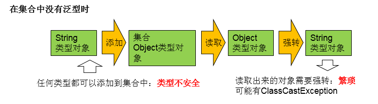

# day24授课笔记

讲师：宋红康

***

## 一、作业

练习1：区分ArrayList,LinkedList,Vector

```java
一、共同点：实现了List接口。存储有序的、可以重复的数据 ： 替换数组，"动态数组"

二、不同点：
ArrayList:List的主要实现类；线程不安全的，效率高；底层使用Object[]存储
Vector:List的古老实现类；线程安全的，效率低；底层使用Object[]存储
LinkedList:底层使用双向链表存储数据；对于频繁的插入、删除操作，使用此类效率高

三、源码：
1. jdk7版本的ArrayList：
 * 	  ArrayList list = new ArrayList();//初始化底层的elementDate的Object[]数组，长度为10.
 *    list.add(123);//elementDate[0] = new Integer(123);
 *    ...
 *    list.add("AA");//一旦添加的数据的个数超出了底层数组的长度10，需要考虑扩容。
 *    //默认容量扩容扩容为原来的1.5倍，同时将旧数组中的数据都复制到新的数组中。
2. jdk8版本的ArrayList： 
 *    ArrayList list = new ArrayList();//初始化底层elementData的Object[]数组为{}
 *    list.add(123);//此时底层创建长度为10的elementData数组，并将new Integer(123)存放到角标0的索引位置。
 *    。。。
 *    list.add("AA");//一旦添加的数据的个数超出了底层数组的长度10，需要考虑扩容。
 *    //默认容量扩容扩容为原来的1.5倍，同时将旧数组中的数据都复制到新的数组中。   
 
3.
 * 	 LinkedList list = new LinkedList();
 *   list.add(123); 
 *   ....
 *   
 *   底层的Node为：记录了当前元素的前一个元素和后一个元素。证明：LinkedList中是双向链表
 *   private static class Node<E> {
        E item;
        Node<E> next;
        Node<E> prev;

        Node(Node<E> prev, E element, Node<E> next) {
            this.item = element;
            this.next = next;
            this.prev = prev;//前向指针的产生
        }
    }
 * 
 *   LinkedList在添加数据时，元素封装在Node对象中，并指明其前一个和后一个元素。
 *   LinkedList不存在添加时，考虑扩容的问题。因为底层不是使用的数组，在内存中多个元素也不是连续存放的。
 
四、 小结
 * 	 1. 建议开发中，如果基本确定底层数组的容量，建议使用带参数的构造器
 *   ArrayList list =  new ArrayList(int initialCapacity);//new Object[initialCapacity];
 *   避免底层不断的扩容和复制操作
 *   2. 对于数组来说，查找操作的复杂度是O(1),插入或删除操作的复杂度是O(n)
 *      对于链表来说，查找操作的复杂度是O(n),插入或删除操作的复杂度是O(1)
 *      
 *   开发中，如果很少执行插入或删除操作，建议使用ArrayList
 *   如果频繁的使用插入或删除操作，建议使用LinkedList
```

练习2：

```
1. 定义一个Employee类。
该类包含：private成员变量name,age,birthday，其中 birthday 为 MyDate 类的对象；
并为每一个属性定义 getter, setter 方法；
并重写 toString 方法输出 name, age, birthday

MyDate类包含:
private成员变量year,month,day；并为每一个属性定义 getter, setter 方法；

创建该类的 5 个对象，并把这些对象放入 TreeSet 集合中（下一章：TreeSet 需使用泛型来定义）
分别按以下两种方式对集合中的元素进行排序，并遍历输出：

1). 使Employee 实现 Comparable 接口，并按 name 排序
2). 创建 TreeSet 时传入 Comparator对象，按生日日期的先后排序。

```

答案：

```java
package com.atguigu.exer;

/**
 * @author Dustin liu
 * @create 2020-03-16-15:56
 */
public class Employee implements Comparable{
    private String name;
    private int age;
    private MyDate birthday;

    public Employee() {
		super();
	}

	public Employee(String name, int age, MyDate birthday) {
        this.name = name;
        this.age = age;
        this.birthday = birthday;
    }

    public String getName() {
        return name;
    }

    public void setName(String name) {
        this.name = name;
    }

    public int getAge() {
        return age;
    }

    public void setAge(int age) {
        this.age = age;
    }

    public MyDate getBirthday() {
        return birthday;
    }

    public void setBirthday(MyDate birthday) {
        this.birthday = birthday;
    }

    @Override
    public String toString() {
        return "Employee{" +
                "name='" + name + '\'' +
                ", age=" + age +
                ", birthday=" + birthday +
                '}';
    }

    @Override
    public int compareTo(Object o) {
    	if(o instanceof Employee){
    		Employee e = (Employee) o;
    		return this.name.compareTo(e.name);
    	}
    	return 0;
    }
}

```

```java
package com.atguigu.exer;

/**
 * @author Dustin liu
 * @create 2020-03-16-15:56
 */
public class MyDate implements Comparable {
	private int year;
	private int month;
	private int day;

	public MyDate() {
		super();
	}

	public MyDate(int year, int month, int day) {
		this.year = year;
		this.month = month;
		this.day = day;
	}

	public int getYear() {
		return year;
	}

	public void setYear(int year) {
		this.year = year;
	}

	public int getMonth() {
		return month;
	}

	public void setMonth(int month) {
		this.month = month;
	}

	public int getDay() {
		return day;
	}

	public void setDay(int day) {
		this.day = day;
	}

	@Override
	public int compareTo(Object o) {
		if (o instanceof MyDate) {
			MyDate m = (MyDate) o;

			if (this.year != m.year) {
				return this.year - m.year;
			}

			if (this.month != m.month) {
				return this.month - m.month;
			}
			if (this.day != m.day) {
				return this.day - m.day;
			}
		}
		return 0;
		
	}

	@Override
	public String toString() {
		return "MyDate{" + "year=" + year + ", month=" + month + ", day=" + day + '}';
	}
}

```

```java
package com.atguigu.exer;

/*
 * 创建该类的 5 个对象，并把这些对象放入 TreeSet 集合中（下一章：TreeSet 需使用泛型来定义）
分别按以下两种方式对集合中的元素进行排序，并遍历输出：

1). 使Employee 实现 Comparable 接口，并按 name 排序
2). 创建 TreeSet 时传入 Comparator对象，按生日日期的先后排序。

 */
import java.util.Comparator;
import java.util.Iterator;
import java.util.TreeSet;

import org.junit.Test;

/**
 * @author Dustin liu
 * @create 2020-03-16-15:55
 */
public class TreeSstTest {
	
	//练习1：按照name属性排序
	@Test
	public void test1() {
		TreeSet employees = new TreeSet();

		Employee e1 = new Employee("liudu", 23, new MyDate(1996, 4, 15));
		Employee e2 = new Employee("zhangsan", 30, new MyDate(1990, 11, 23));
		Employee e3 = new Employee("lisi", 25, new MyDate(1995, 6, 20));
		Employee e4 = new Employee("xiaoqiang", 27, new MyDate(1993, 7, 14));
		Employee e5 = new Employee("laowang", 33, new MyDate(1987, 9, 1));

		employees.add(e1);
		employees.add(e2);
		employees.add(e3);
		employees.add(e4);
		employees.add(e5);
		
		System.out.println("---------通过名字排序-----------");
		Iterator iterator = employees.iterator();
		while (iterator.hasNext()) {
			System.out.println(iterator.next());
		}
	}

	@Test
	public void test2() {
		// 通过生日排序的数组
		TreeSet employeesByBirthday = new TreeSet(new Comparator() {
			@Override
			public int compare(Object o1, Object o2) {
				if(o1 instanceof Employee && o2 instanceof Employee){
					Employee e1 = (Employee) o1;
					Employee e2 = (Employee) o2;
					return e1.getBirthday().compareTo(e2.getBirthday());
				}
				return 0;
			}
		});

		Employee e1 = new Employee("刘度", 23, new MyDate(1996, 4, 15));
		Employee e2 = new Employee("张三", 30, new MyDate(1993, 11, 23));
		Employee e3 = new Employee("李四", 25, new MyDate(1995, 6, 20));
		Employee e4 = new Employee("小强", 27, new MyDate(1993, 7, 14));
		Employee e5 = new Employee("老王", 33, new MyDate(1987, 9, 1));
		
		employeesByBirthday.add(e1);
		employeesByBirthday.add(e2);
		employeesByBirthday.add(e3);
		employeesByBirthday.add(e4);
		employeesByBirthday.add(e5);

		System.out.println("---------通过生日排序-----------");
		Iterator<Employee> iteratorByBirthday = employeesByBirthday.iterator();
		while (iteratorByBirthday.hasNext()) {
			System.out.println(iteratorByBirthday.next());
		}
	}
}

```

练习3：

案例：添加你喜欢的歌手以及你喜欢他唱过的歌曲

例如：


写法一：

```
public class HashMapTest {

	@Test
	public void test() {
		HashMap maps = new HashMap();
		ArrayList songs1 = new ArrayList();
		songs1.add("《一路有你》");
		songs1.add("《吻别》");
		songs1.add("《一千个伤心的理由》");
		maps.put("张学友", songs1);

		ArrayList songs2 = new ArrayList();
		songs2.add("《红豆》");
		songs2.add("《传奇》");
		songs2.add("《容易受伤的女人》");
		maps.put("王菲", songs2);

		Iterator iterator = maps.entrySet().iterator();
		while (iterator.hasNext()) {
			System.out.println(iterator.next());
		}
	}
}
```

写法二：

```
public class SingerTest {
	public static void main(String[] args) {
		HashMap<String, ArrayList<String>> singers = new HashMap<>();
		singers.put("张学友", new ArrayList<String>() {
			{
				add("一路上有你");
				add("吻别");
				add("一千个伤心的理由");
			}
		});
		singers.put("王菲", new ArrayList<String>() {
			{
				add("红豆");
				add("传奇");
				add("容易受伤的女人");
			}
		});
		// 打印
		for (Map.Entry<String, ArrayList<String>> singer : singers.entrySet()) {
			System.out.println(singer.getKey() + "的歌曲有：" + singer.getValue().toString());
		}
	}
}
```

写法三：

```
public class Song implements Comparable{
	private String songName;//歌名

	public Song() {
		super();
	}

	public Song(String songName) {
		super();
		this.songName = songName;
	}

	public String getSongName() {
		return songName;
	}

	public void setSongName(String songName) {
		this.songName = songName;
	}

	@Override
	public String toString() {
		return "《" + songName + "》";
	}

	@Override
	public int compareTo(Object o) {
		if(o == this){
			return 0;
		}
		if(o instanceof Song){
			Song song = (Song)o;
			return songName.compareTo(song.getSongName());
		}
		return 0;
	}
	
	
}
```

```
public class Singer implements Comparable{
	private String name;
	private Song song;
	
	public Singer() {
		super();
	}

	public Singer(String name) {
		super();
		this.name = name;
		
	}

	public String getName() {
		return name;
	}

	public void setName(String name) {
		this.name = name;
	}

	public Song getSong() {
		return song;
	}

	public void setSong(Song song) {
		this.song = song;
	}

	@Override
	public String toString() {
		return name;
	}

	@Override
	public int compareTo(Object o) {
		if(o == this){
			return 0;
		}
		if(o instanceof Singer){
			Singer singer = (Singer)o;
			return name.compareTo(singer.getName());
		}
		return 0;
	}
	
	
}
```

```
public class Test1 {
	@Test
	public void test1() {

		Singer singer1 = new Singer("张学友");
		Singer singer2 = new Singer("王菲");

		Song song1 = new Song("一路上有你");
		Song song2 = new Song("吻别");
		Song song3 = new Song("一千个伤心的理由");
		Song song4 = new Song("红豆");
		Song song5 = new Song("传奇");
		Song song6 = new Song("容易伤心的女人");

		HashSet h1 = new HashSet();// 放歌手一的歌曲
		h1.add(song1);
		h1.add(song2);
		h1.add(song3);

		HashSet h2 = new HashSet();// 放歌手二的歌曲
		h2.add(song4);
		h2.add(song5);
		h2.add(song6);

		HashMap hashMap = new HashMap();// 放歌手和他对应的歌曲
		hashMap.put(singer1, h1);
		hashMap.put(singer2, h2);

		for (Object obj : hashMap.keySet()) {
			System.out.println(obj + "=" + hashMap.get(obj));
		}

	}
}
```

## 二、复习

- 整体把握
  - **层次一：针对不同特点的数据，能够选择对应接口的主要的类进行实例化和方法的调用**
   - 层次二：熟悉接口的不同的实现类的区别、特点
   - 层次三：相关接口实现类的底层实现：存储结构

- 集合框架

  - List结构

  ```
  |-----Collection:存储一个一个的数据
  	 * 	|-----List:存储有序的、可以重复的数据 ： 替换数组，"动态数组"
  	 * 		|-----ArrayList:List的主要实现类；线程不安全的，效率高；底层使用Object[]存储
  			|-----LinkedList:底层使用双向链表存储数据；对于频繁的插入、删除操作，使用此类效率高。
  			|-----Vector:List的古老实现类；线程安全的，效率低；底层使用Object[]存储
  ```

  - Set结构

  ```
  |-----Set:存储无序的、不可重复的数据： 高中的集合
   * 		|-----HashSet：是Set的主要实现类;线程不安全的;可以存储null值
  			|-----LinkedHashSet:是HashSet的子类;在添加数据之外，还通过一对指针记录先后添加的					顺序，使得遍历Set元素时，较HashSet效率更高。
  		|-----TreeSet:可以按照添加的元素的指定的属性的大小进行遍历；底层使用的是红黑树（排序二叉树的一种）
  			
  ```

  - Map结构

  ```
  |-----Map:存储一对一对的数据（key-value)：高中的函数。 y = f(x) (x1,y1),(x2,y2)
   * 		|-----HashMap：主要实现类；线程不安全的，效率高；存储null的key和value
   *			|-----LinkedHashMap:是HashMap的子类，可以按照添加key-value的顺序实现遍历。
   *					  底层在HashMap结构的基础上，给前后添加的key-value额外添加了一对指针，记					   录添加的先后顺序。
   *		|-----TreeMap：可以按照key-value中的key的大小实现排序遍历。底层使用红黑树实现的
   *		|-----Hashtable：古老实现类；线程安全的，效率低；不可以存储null的key或value
   *			|-----Properties：是Hashtable的子类，key和value都是String类型，常用来处理属性文件
   * 
  ```

- 添加的单个元素所在的类是否要重写相关方法

  - 元素如果添加到List中：要求元素所在的类要重写equals()
  - 元素如果添加到HashSet、LinkedHashSet：要求元素所在的类要重写equals()和hashCode()
  - 元素如果添加到TreeSet：要求考虑此元素的排序问题：① 自然排序 ②定制排序

- 添加的key-valule元素所在的类是否要重写相关方法

  - 将key-value添加到HashMap或LinkedHashMap中时：
    - key所在的类要重写hashCode()和equals()
    - value所在的类重写equals()
  - 将key-value添加到TreeMap中时：
    - 要求考虑此key的排序问题：① 自然排序 ②定制排序

```
技巧：向集合中添加的自定义类的元素，将其equals()和hashCode()都重写一下，肯定没错！
```

- 面试题：
  - ArrayList、LinkedList、Vector的区分
  - HashMap和Hashtable的区分
  - HashMap的源码解析
  - ConcurrentHashMap、Hashtable的区分
  - Collection、Collections的区分

## 三、Map的实现

### 3.1 HashMap的底层实现

#### 原理的描述

```java
3.1 jdk7中的实现过程：
 *    HashMap map = new HashMap();//底层创建长度为16的Entry数组table
 *    。。。
 *    map.put(key1,value1);
 *    
 *    。。。
 *    
 *    1. 当添加key1-vulue1时，首先通过key1所在类的hashCode()方法，计算key1的哈希值
 *    2. 此哈希值经过某种算法以后，确定其在table数组中的存放位置:i
 *    3. 如果table[i]位置为空，则key1-value1添加成功  --->情况1
 *       如果table[i]位置不为空，则比较key1与table[i]位置现有元素key2-value2进行对比
 *       	4.比较key1和key2的哈希值，如果哈希值不相同，则key1-value1添加成功  --->情况2
 *            比较key1和key2的哈希值，如果哈希值相同，调用key1所在类的equals(),将key2作为参数传入equals()
 *            		5. 如果equals()返回false,则key1-value1添加成功  --->情况3
 *                     如果equals()返回true,则用value1替换原有的value2
 * 
 * 		 情况1：将e1直接保存在数组的指定位置
 *      情况2、情况3：此时e1与现有索引位置上的元素，以链表的方式进行保存。
 *      
 * 	 3.2 jdk8相较于jdk7的不同：
 * 	  ① new HashMap():底层并没有创建一个长度为16的数组
 *    ② 当首次调用put()时，底层才创建长度为16的数组
 *    ③ jdk8中底层的数组是Node[]，而非Entry[]
 *    ④ jdk7:新的元素方法到数组中，指向原有的元素
 *     	jdk8:已有的元素的末尾指向新的元素.
 *    ⑤ 当某一个索引位置上的元素数操作8且数组table的长度超过64时，此索引位置上的所有元素要从链表结构改为红黑树结构
```

#### JDK7中的源码

- jdk7中：初始化底层数组的源码：HashMap map = new HashMap()

```java
static final int DEFAULT_INITIAL_CAPACITY = 16;//默认数组的容量
static final float DEFAULT_LOAD_FACTOR = 0.75f;//默认的加载因子
transient Entry<K,V>[] table;//保存Map添加的数据

public HashMap() {
        this(DEFAULT_INITIAL_CAPACITY, DEFAULT_LOAD_FACTOR);
}

public HashMap(int initialCapacity, float loadFactor) {
        if (initialCapacity < 0)
            throw new IllegalArgumentException("Illegal initial capacity: " +
                                               initialCapacity);
        if (initialCapacity > MAXIMUM_CAPACITY)
            initialCapacity = MAXIMUM_CAPACITY;
        if (loadFactor <= 0 || Float.isNaN(loadFactor))
            throw new IllegalArgumentException("Illegal load factor: " +
                                               loadFactor);

        // Find a power of 2 >= initialCapacity
        int capacity = 1;
        while (capacity < initialCapacity) //此循环确定底层数组的长度
            capacity <<= 1;

        this.loadFactor = loadFactor;
        threshold = (int)Math.min(capacity * loadFactor, MAXIMUM_CAPACITY + 1);
        table = new Entry[capacity];//确定了底层数组在默认初始化时，长度为16
        useAltHashing = sun.misc.VM.isBooted() &&
                (capacity >= Holder.ALTERNATIVE_HASHING_THRESHOLD);
        init();
    }
```

Entry定义如下：

```
static class Entry<K,V> implements Map.Entry<K,V> {
        final K key;
        V value;
        Entry<K,V> next;
        int hash;

        /**
         * Creates new entry.
         */
        Entry(int h, K k, V v, Entry<K,V> n) {
            value = v;
            next = n;
            key = k;
            hash = h;
        }
}
```

- put操作源码

```java
public V put(K key, V value) {
        if (key == null) //体现：HashMap可以添加null的key的
            return putForNullKey(value);
        int hash = hash(key); //二次hash
        int i = indexFor(hash, table.length); //确定key在数组中的存放位置
        for (Entry<K,V> e = table[i]; e != null; e = e.next) {
            Object k;
            if (e.hash == hash && ((k = e.key) == key || key.equals(k))) {
                V oldValue = e.value;
                e.value = value;
                e.recordAccess(this);
                return oldValue;
            }
        }

        modCount++;
        addEntry(hash, key, value, i);//将key-value添加到当前table[i]中
        return null;
}
```

```
final int hash(Object k) {
        int h = 0;
        if (useAltHashing) {
            if (k instanceof String) {
                return sun.misc.Hashing.stringHash32((String) k);
            }
            h = hashSeed;
        }

        h ^= k.hashCode();

        // This function ensures that hashCodes that differ only by
        // constant multiples at each bit position have a bounded
        // number of collisions (approximately 8 at default load factor).
        h ^= (h >>> 20) ^ (h >>> 12);
        return h ^ (h >>> 7) ^ (h >>> 4);
    }
```

```
static int indexFor(int h, int length) {
        return h & (length-1);
}
```

```java
void addEntry(int hash, K key, V value, int bucketIndex) {
        if ((size >= threshold) && (null != table[bucketIndex])) {
            resize(2 * table.length);
            hash = (null != key) ? hash(key) : 0;
            bucketIndex = indexFor(hash, table.length);
        }

        createEntry(hash, key, value, bucketIndex);
}
```

```java
void createEntry(int hash, K key, V value, int bucketIndex) {
        Entry<K,V> e = table[bucketIndex];
        table[bucketIndex] = new Entry<>(hash, key, value, e);
        size++;
}
```

#### JDK8中的源码

- HashMap map = new HashMap()过程中：

```java
static final float DEFAULT_LOAD_FACTOR = 0.75f; 
transient Node<K,V>[] table;
public HashMap() {
        this.loadFactor = DEFAULT_LOAD_FACTOR; // all other fields defaulted
}
```

- put()调用过程中：

```
public V put(K key, V value) {
        return putVal(hash(key), key, value, false, true);
}
```

```java
static final int hash(Object key) { //二次哈希
        int h;
        return (key == null) ? 0 : (h = key.hashCode()) ^ (h >>> 16);
}
```

```java
static final int TREEIFY_THRESHOLD = 8;//当某个索引的长度超过8时，要考虑将链表改为红黑树
static final int MIN_TREEIFY_CAPACITY = 64;
final V putVal(int hash, K key, V value, boolean onlyIfAbsent,
                   boolean evict) {
        Node<K,V>[] tab; Node<K,V> p; int n, i;
    	//如果是首次调用put,此时table是null,就会调用resize()
        if ((tab = table) == null || (n = tab.length) == 0) 
            n = (tab = resize()).length;
    	//此时i = (n - 1) & hash操作即为确定key-value在底层数组中的索引位置
        if ((p = tab[i = (n - 1) & hash]) == null)
            tab[i] = newNode(hash, key, value, null);
        else {
            Node<K,V> e; K k;
            if (p.hash == hash &&
                ((k = p.key) == key || (key != null && key.equals(k))))
                e = p;
            else if (p instanceof TreeNode)
                e = ((TreeNode<K,V>)p).putTreeVal(this, tab, hash, key, value);
            else {
                for (int binCount = 0; ; ++binCount) {
                    if ((e = p.next) == null) {
                        //将新的元素作为原有的p元素的下一个元素
                        p.next = newNode(hash, key, value, null);
                        if (binCount >= TREEIFY_THRESHOLD - 1) // -1 for 1st
                            treeifyBin(tab, hash);
                        break;
                    }
                    if (e.hash == hash &&
                        ((k = e.key) == key || (key != null && key.equals(k))))
                        break;
                    p = e;
                }
            }
            if (e != null) { // existing mapping for key
                V oldValue = e.value;
                if (!onlyIfAbsent || oldValue == null)
                    //当key值与现有的某个key相同时，将新的key对应的value替换原有的value
                    e.value = value;  
                afterNodeAccess(e);
                return oldValue;
            }
        }
        ++modCount;
        if (++size > threshold)
            resize();
        afterNodeInsertion(evict);
        return null;
    }
```

```java
final Node<K,V>[] resize() {
        Node<K,V>[] oldTab = table;
        int oldCap = (oldTab == null) ? 0 : oldTab.length;
        int oldThr = threshold;
        int newCap, newThr = 0;
        if (oldCap > 0) {
            if (oldCap >= MAXIMUM_CAPACITY) {
                threshold = Integer.MAX_VALUE;
                return oldTab;
            }
            else if ((newCap = oldCap << 1) < MAXIMUM_CAPACITY &&
                     oldCap >= DEFAULT_INITIAL_CAPACITY)
                newThr = oldThr << 1; // double threshold
        }
        else if (oldThr > 0) // initial capacity was placed in threshold
            newCap = oldThr;
        else {               // zero initial threshold signifies using defaults
            newCap = DEFAULT_INITIAL_CAPACITY;
            newThr = (int)(DEFAULT_LOAD_FACTOR * DEFAULT_INITIAL_CAPACITY);
        }
        if (newThr == 0) {
            float ft = (float)newCap * loadFactor;
            newThr = (newCap < MAXIMUM_CAPACITY && ft < (float)MAXIMUM_CAPACITY ?
                      (int)ft : Integer.MAX_VALUE);
        }
        threshold = newThr; //确定当前map中的临界值！首次threshold值为12
        @SuppressWarnings({"rawtypes","unchecked"})
            Node<K,V>[] newTab = (Node<K,V>[])new Node[newCap];
        table = newTab; //确定了底层的数组是长度为16的Node型数组
        if (oldTab != null) {
            for (int j = 0; j < oldCap; ++j) {
                Node<K,V> e;
                if ((e = oldTab[j]) != null) {
                    oldTab[j] = null;
                    if (e.next == null)
                        newTab[e.hash & (newCap - 1)] = e;
                    else if (e instanceof TreeNode)
                        ((TreeNode<K,V>)e).split(this, newTab, j, oldCap);
                    else { // preserve order
                        Node<K,V> loHead = null, loTail = null;
                        Node<K,V> hiHead = null, hiTail = null;
                        Node<K,V> next;
                        do {
                            next = e.next;
                            if ((e.hash & oldCap) == 0) {
                                if (loTail == null)
                                    loHead = e;
                                else
                                    loTail.next = e;
                                loTail = e;
                            }
                            else {
                                if (hiTail == null)
                                    hiHead = e;
                                else
                                    hiTail.next = e;
                                hiTail = e;
                            }
                        } while ((e = next) != null);
                        if (loTail != null) {
                            loTail.next = null;
                            newTab[j] = loHead;
                        }
                        if (hiTail != null) {
                            hiTail.next = null;
                            newTab[j + oldCap] = hiHead;
                        }
                    }
                }
            }
        }
        return newTab;
    }
```

```
static class Node<K,V> implements Map.Entry<K,V> {
        final int hash;
        final K key;
        V value;
        Node<K,V> next;

        Node(int hash, K key, V value, Node<K,V> next) {
            this.hash = hash;
            this.key = key;
            this.value = value;
            this.next = next;
        }

        public final K getKey()        { return key; }
        public final V getValue()      { return value; }
        public final String toString() { return key + "=" + value; }

        public final int hashCode() {
            return Objects.hashCode(key) ^ Objects.hashCode(value);
        }

        public final V setValue(V newValue) {
            V oldValue = value;
            value = newValue;
            return oldValue;
        }

        public final boolean equals(Object o) {
            if (o == this)
                return true;
            if (o instanceof Map.Entry) {
                Map.Entry<?,?> e = (Map.Entry<?,?>)o;
                if (Objects.equals(key, e.getKey()) &&
                    Objects.equals(value, e.getValue()))
                    return true;
            }
            return false;
        }
    }
```


### 3.2 LinkedHashMap的底层实现

- 添加key-value时，使用的父类HashMap中的put()

- 在调用put()中，调用了LinkeHashMap重写父类的newNode()

  ```
  Node<K,V> newNode(int hash, K key, V value, Node<K,V> e) {
          LinkedHashMap.Entry<K,V> p =
              new LinkedHashMap.Entry<K,V>(hash, key, value, e);
          linkNodeLast(p);
          return p;
  }
  ```

  ```java
  static class Entry<K,V> extends HashMap.Node<K,V> {
          Entry<K,V> before, after;  //用来记录添加的key-value的前一个元素和后一个元素
          Entry(int hash, K key, V value, Node<K,V> next) {
              super(hash, key, value, next);
          }
   }
  ```

- 对于频繁的遍历Map的操作时，建议使用LinkedHashMap

### 3.3 Map中的常用方法(重点)

```
添加、删除、修改操作：
	Object put(Object key,Object value)：将指定key-value添加到(或修改)当前map对象中
	void putAll(Map m):将m中的所有key-value对存放到当前map中
	Object remove(Object key)：移除指定key的key-value对，并返回value
	void clear()：清空当前map中的所有数据
	元素查询的操作：
	Object get(Object key)：获取指定key对应的value
	boolean containsKey(Object key)：是否包含指定的key
	boolean containsValue(Object value)：是否包含指定的value
	int size()：返回map中key-value对的个数
	boolean isEmpty()：判断当前map是否为空
	boolean equals(Object obj)：判断当前map和参数对象obj是否相等
	元视图操作的方法：
	Set keySet()：返回所有key构成的Set集合
	Collection values()：返回所有value构成的Collection集合
	Set entrySet()：返回所有key-value对构成的Set集合
	
	
	总结：
		增：put(Object key,Object value)
		删：remove(Object key)
		改：put(Object key,Object value)
		查：get(Object key)
		长度：size()
		遍历：keySet()；values()；entrySet()
```

```java
@Test
	public void test1(){
		HashMap map = new HashMap();
		map.put("AA", 78);
		map.put("BB", 88);
		map.put("BB", 66);//修改操作
		map.put("DD", 98);
		map.put(43, "CC");//43:自动装箱
		map.put(new Person("Tom",12), 78);
		map.put(new Person("Tom",12), 99);//修改操作
		System.out.println(map);
//		System.out.println(map.size());
		
		Object value = map.remove("DD");
		System.out.println(value);
		System.out.println(map);
		
		System.out.println(map.get(new Person("Tom",12)));
		
		System.out.println(map.containsKey(43));
		System.out.println(map.containsValue(66));
	}
	
	@Test
	public void test2(){
		HashMap map = new HashMap();
		map.put("Tom", 88);
		map.put("Lily", 98); 
		map.put("Jerry", 98); 
		map.put("Jim", 78);
		
		//遍历所有的key:keySet
		Set keySet = map.keySet();
		for(Object obj : keySet){
			System.out.println(obj);
		}
		System.out.println();
		//遍历所有的value集：
		//方式一：values()
		Collection values = map.values();
		Iterator iterator = values.iterator();
		while(iterator.hasNext()){
			System.out.println(iterator.next());
		}
		System.out.println();
		//方式二：get()
		Set keySet1 = map.keySet();
		for(Object obj : keySet1){
			System.out.println(map.get(obj));
		}
		System.out.println();
		//遍历所有的key-value
		//方式一：
		Set keySet2 = map.keySet();
		for(Object obj : keySet2){
			System.out.println(obj + "---> " + map.get(obj));
		}
		System.out.println();
		//方式二：entrySet()
		Set entrySet = map.entrySet();
		for(Object obj : entrySet){
			Map.Entry entry = (Map.Entry) obj;
//			System.out.println(obj);//obj：即为每一个entry
			System.out.println(entry.getKey() + "****" + entry.getValue()); 
		}
```


### 3.4 TreeMap的使用举例(了解)

```
     /*
	 * 1. 向TreeMap中添加key-value，要求所有的key必须是同一个类的对象。
	 * 2. 针对于key，实现自然排序或定制排序
	 * 
	 */
```

- 自然排序

```
//自然排序
	@Test
	public void test1(){
		TreeMap map = new TreeMap();
		
		Person p1 = new Person("Tom",12);
		Person p2 = new Person("Jim",32);
		Person p3 = new Person("Jerry",26);
		Person p4 = new Person("Mike",43);
		Person p5 = new Person("Lily",26);
		
		map.put(p1,78);
		map.put(p2,78);
		map.put(p3,76);
		map.put(p4,98);
		map.put(p5,56);
		
		Iterator iterator = map.keySet().iterator();
		while(iterator.hasNext()){
			Object key = iterator.next();
			System.out.println(key + "--->" + map.get(key));
		}
	}
```


- 定制排序

```
//定制排序
	@Test
	public void test2(){
		Comparator com = new Comparator(){

			@Override
			public int compare(Object o1, Object o2) {//o1,o2应该为Person的实例
				if(o1 instanceof Person && o2 instanceof Person){
					Person p1 = (Person)o1;
					Person p2 = (Person)o2;
					return -p1.getName().compareTo(p2.getName());
				}
				
				return 0;
			}
			
		};
		TreeMap map = new TreeMap(com);
		
		Person p1 = new Person("Tom",12);
		Person p2 = new Person("Jim",32);
		Person p3 = new Person("Jerry",26);
		Person p4 = new Person("Mike",43);
		Person p5 = new Person("Lily",26);
		
		map.put(p1,78);
		map.put(p2,78);
		map.put(p3,76);
		map.put(p4,98);
		map.put(p5,56);
		
		Iterator iterator = map.entrySet().iterator();
		while(iterator.hasNext()){
			Map.Entry entry = (Entry) iterator.next();
			System.out.println(entry.getKey() + "--->" + entry.getValue());
		}
	}
```


其中，Person类定义如下：

```
package com.atguigu.java;

public class Person implements Comparable{
	private String name;
	private int age;
	public Person() {
		super();
	}
	public Person(String name, int age) {
		super();
		this.name = name;
		this.age = age;
	}
	public String getName() {
		return name;
	}
	public void setName(String name) {
		this.name = name;
	}
	public int getAge() {
		return age;
	}
	public void setAge(int age) {
		this.age = age;
	}
	@Override
	public String toString() {
		return "Person [name=" + name + ", age=" + age + "]";
	}
	@Override
	public int hashCode() { //return age + name.hashCode();
		final int prime = 31;
		int result = 1;
		result = prime * result + age;
		result = prime * result + ((name == null) ? 0 : name.hashCode());
		return result;
	}
	@Override
	public boolean equals(Object obj) {
		System.out.println("Person equals....");
		if (this == obj)
			return true;
		if (obj == null)
			return false;
		if (getClass() != obj.getClass())
			return false;
		Person other = (Person) obj;
		if (age != other.age)
			return false;
		if (name == null) {
			if (other.name != null)
				return false;
		} else if (!name.equals(other.name))
			return false;
		return true;
	}
	
	//先按照年龄从小到大排列，再按照姓名从小到大排
	@Override
	public int compareTo(Object o) {
			
		if(o instanceof Person){
			Person p = (Person)o;
			int value = this.age - p.age;
			if(value != 0){
				return value;
			}else{
				return this.name.compareTo(p.name);
			}
		}
		
		throw new RuntimeException("输入的类型不匹配");
	}
	
	
}

```


### 3.5 Properties的使用举例 (重点)

```java
    /*
	 * 1. Properties是Hashtable的子类
	 * 2. Properties中的key和value都是String类型
	 * 3. Properties在开发中，常用来处理属性文件
	 * 
	 */
	@Test
	public void test1() throws IOException{
		Properties pros = new Properties();
		FileInputStream fis = new FileInputStream("info.properties");
		pros.load(fis);
		
		String name = pros.getProperty("name");
		String password = pros.getProperty("passord");
		System.out.println("name = " + name + ",password = " + password);
	}
```


## 四、集合的工具类：Collections （熟悉）

```java
/*
 * Collections：是一个操作 Set、List 和 Map 等集合的工具类
 * 
 * 
 * 面试题：区分Collection 和 Collections
 * Collection:java中提供的用于存储单列数据的集合框架接口，子接口有List和Set
 */
public class CollectionsTest {
	
	/*
	 * reverse(List)：反转 List 中元素的顺序
	 * shuffle(List)：对 List 集合元素进行随机排序
	 * sort(List)：根据元素的自然顺序对指定 List 集合元素按升序排序
	 * sort(List，Comparator)：根据指定的 Comparator 产生的顺序对 List 集合元素进行排序
	 * swap(List，int， int)：将指定 list 集合中的 i 处元素和 j 处元素进行交换
	 * Object max(Collection)：根据元素的自然顺序，返回给定集合中的最大元素
	 * Object max(Collection，Comparator)：根据 Comparator 指定的顺序，返回给定集合中的最大元素
	 * Object min(Collection)
	 * Object min(Collection，Comparator)
	 * int frequency(Collection，Object)：返回指定集合中指定元素的出现次数
	 * void copy(List dest,List src)：将src中的内容复制到dest中
	 * boolean replaceAll(List list，Object oldVal，Object newVal)：使用新值替换 List 对象的所有旧值
	 * 
	 */
	@Test
	public void test1(){
		List list = Arrays.asList(43,65,67,43,6,34,76,8,97,0,-8,5);
		System.out.println(list);
		
//		Collections.reverse(list);
//		Collections.shuffle(list);
//		Collections.sort(list);
//		Collections.swap(list,1,3);
//		int frequency = Collections.frequency(list,433);
		//错误的写法
//		ArrayList dest = new ArrayList();
//		Collections.copy(dest, list);
		//正确的写法
		List dest = Arrays.asList(new Object[list.size()]);
		Collections.copy(dest, list);
		
		//Collections 类中提供了多个 synchronizedXxx() 方法，该方法可使将指定集合
		//包装成线程同步的集合，从而可以解决多线程并发访问集合时的线程安全问题
		List synchronizedList = Collections.synchronizedList(list);

		System.out.println(dest);
	}
	
}
```

```
@Test
	public void test12(){
		List list = Arrays.asList(43,65,67,43,6,34,76,8,97,0,-8,5);
		
		Collections.sort(list,new Comparator(){

			@Override
			public int compare(Object o1, Object o2) {
				if(o1 instanceof Integer && o2 instanceof Integer){
					Integer i1 = (Integer) o1;
					Integer i2 = (Integer) o2;
					
					return -i1.compareTo(i2);
				}
				return 0;
			}
			
		});
		
		System.out.println(list);
	}
```

## 五、泛型(Generic)的使用

### 5.1 泛型的理解

- 泛型：标签
- 举例：
  - 中药店，每个抽屉外面贴着标签
  - 超市购物架上很多瓶子，每个瓶子装的是什么，有标签


- 泛型的设计背景

  集合容器类在设计阶段/声明阶段不能确定这个容器到底实际存的是什么类型的对象，所以在JDK1.5之前只能**把元素类型设计为Object**，JDK1.5之后使用泛型来解决。因为这个时候除了元素的类型不确定，其他的部分是确定的，例如关于这个元素如何保存，如何管理等是确定的，因此此时把元素的类型设计成一个参数，这个类型参数叫做泛型。Collection<E>，List<E>，ArrayList<E>   这个<E>就是类型参数，即泛型。

- 泛型的理解

所谓泛型，就是允许在定义类、接口时通过一个标识表示类中某个属性的类型或者是某个方法的返回值及参数类型。这个类型参数将在使用时（例如，继承或实现这个接口，用这个类型声明变量、创建对象时）确定（即传入实际的类型参数，也称为类型实参）。

### 5.2 泛型在集合中的使用

- 在集合中使用泛型之前的例子

```
//在集合中使用泛型之前的例子
    @Test
    public void test1() {
        ArrayList list = new ArrayList();
        //添加学生成绩
        list.add(67);
        list.add(87);
        list.add(89);
        list.add(90);
        //1.添加数据时，没有限制添加的数据的类型
//        list.add("Tom");

        Iterator iterator = list.iterator();
        while (iterator.hasNext()) {
            //2.取数据时，需要必要的强制类型转换。有可能出现ClassCastException
            int score = (int) iterator.next();
            System.out.println(score);
        }

    }
```



- 在集合中使用泛型的例子

```
//在集合中是用泛型的例子1（掌握）
    @Test
    public void test2() {
        ArrayList<Integer> list = new ArrayList<Integer>();

        //1. 添加数据
        list.add(67);
        list.add(76);
        list.add(89);
        //编译不通过
//        list.add("Tom");

        //2.读取数据
        Iterator<Integer> iterator = list.iterator();
        while (iterator.hasNext()) {
            //获取的数据就是Integer类型，不再需要进行强转。
            int score = iterator.next();
            System.out.println(score);
        }
    }
    //在集合中是用泛型的例子2（掌握）
    @Test
    public void test3() {
//        Map<String,Integer> map = new HashMap<String,Integer>();

        Map<String, Integer> map = new HashMap<>();//jdk7中新特性：类型推断

        map.put("梁振", 88);
        map.put("梁圳", 98);
        map.put("李明昌", 100);
//        map.put(60,"李雨泓");//编译不通过

        Set<Map.Entry<String, Integer>> entries = map.entrySet();
        Iterator<Map.Entry<String, Integer>> iterator = entries.iterator();
        while (iterator.hasNext()) {
            Map.Entry<String, Integer> entry = iterator.next();
            System.out.println(entry.getKey() + "---->" + entry.getValue());
        }
    }
```


练习：

向TreeSet中添加数据，使用自然排序和定制排序。考虑Comparable和Comparator使用泛型

小结：

```java
1. 集合相关的api在声明时，使用了泛型。
2. 实例化集合对象时，如果没有使用泛型。则默认操作的是java.lang.Object类型
3. 实例化集合对象时，如果使用了泛型，则集合中就只能操作确定类型的数据
	List<String> list = new ArrayList<String>();
    list.add(String str);
4. 泛型参数，只能使用引用数据类型来充当。不能使用基本数据类型。
```

### 5.3 如何自定义泛型类、泛型接口

### 5.4 如何自定义泛型方法

### 5.5 泛型在继承上的体现

### 5.6 通配符、有限制条件的通配符的使用