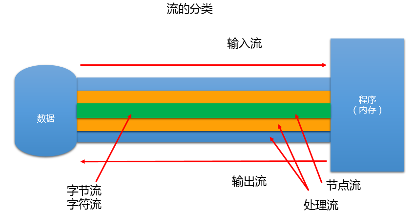

# day26授课笔记

讲师：宋红康

***

## 一、作业

练习1：

```
提供一个方法，用于遍历获取HashMap<String,String>中的所有value，并存放在List中返回。考虑上集合中泛型的使用。
```

答案：

```java
/**
 * 提供一个方法，用于遍历获取HashMap<String,String>中的所有value，
 * 并存放在List中返回。考虑上集合中泛型的使用。
 * @author shkstart
 * @create 2020 上午 8:45
 */
public class ExerTest1 {

    public List<String> getValues(HashMap<String,String> map){
        //错误的：
//        Collection<String> values = map.values();
//        return (List<String>) values;

        //正确的：
        //方式一：
//        Collection<String> values = map.values();
//        ArrayList<String> list = new ArrayList<>(values.size());
//        for(String value : values){
//            list.add(value);
//        }
//        return list;
        //方式二：
//        Collection<String> values = map.values();
//        ArrayList<String> list = new ArrayList<>(values.size());
//        list.addAll(values);
//        return list;
        //方式三：
        Collection<String> values = map.values();
        return new ArrayList<>(values);
    }
}
```

练习2：

```
创建一个与"hello.txt"文件在相同目录下的另一个名为"abc.txt"
//File file = new File("d:/abc/hello.txt");

```

答案：

```java
/*
    创建一个与"hello.txt"文件在相同目录下的另一个名为"abc.txt"
    //File file = new File("d:/abc/hello.txt");
     */
    @Test
    public void test1() throws IOException {
        File src = new File("d:/io/hello.txt");
//        System.out.println(src.getAbsoluteFile().getParent());
        File dest = new File(src.getAbsoluteFile().getParent(),"abc.txt");

        dest.createNewFile();
        System.out.println("创建成功");
    }
```

练习3：

```
遍历指明目录下的所有的文件，输出所有的文件名。
```

答案：

```
@Test
    public void test1(){
        File file = new File("G:\\教学视频\\01-Java基础\\尚硅谷_200213大数据Java基础_宋红康\\1-课件");
        traverseFiles1(file);
    }
    /*
    遍历指明目录下的所有的文件，输出所有的文件名。
     */
    public void traverseFiles(File file) {//file是一个文件目录
        File[] files = file.listFiles();
        for (File f : files) {
            if (f.isFile()) {
                System.out.println(f.getParent() + "\t" + f.getName());
            } else {
                traverseFiles(f);
            }

        }
    }
    public void traverseFiles1(File file) {
        if(file.isFile()){
            System.out.println(file.getAbsolutePath());
        }else{
            File[] files = file.listFiles();
            for(File f : files){
                traverseFiles1(f);
            }
        }
    }
```

答案：

```java
/*
    获取指定文件目录中所有文件的大小
     */
    @Test
    public void test2() {
        File file = new File("G:\\教学视频\\01-Java基础\\尚硅谷_200213大数据Java基础_宋红康\\1-课件");
        file = new File("d:/io/hello.txt");
        long length = recursionLength(file);
        System.out.println(length);

    }
    public long recursionLength(File file) {
        long length = 0;
        if (file.isDirectory()) {
            File[] list = file.listFiles();
            for (File f : list) {
                if (f.isDirectory()) {
                    length += recursionLength(f);
                } else {
                    length += f.length();
                }
            }
            return length;
        }else{
            return file.length();
        }

    }
```

- 思考：删除指定的文件目录（此文件目录下有多个文件或子文件目录）

## 二、复习

- 泛型的使用
  - 为什么使用泛型？ 拿集合举例
  - **掌握：泛型在集合中的使用：List、Map、Iterator；Comparable、Comparator**
  - 如何自定义泛型类、泛型接口；泛型方法
  - 泛型在继承上的体现： List<Object> list1 = null; List<String> list2 = null;  list1 = list2;//错误的！
  - 通配符和有限制条件的通配符的使用： List<?> , List<? extends A> , List<? super A>

- File类的使用
  - File类的实例化
  - File类的常用方法

## 三、IO流概述

- 流的分类

```
按操作数据单位不同分为：字节流(8 bit)，字符流(16 bit)  

按数据流的流向不同分为：输入流，输出流

按流的角色的不同分为：节点流，处理流

```



- 流的继承关系

```
4个抽象基类：
InputStream
OutputStream
Reader
Writer
```


> 说明：上图中蓝色背景的流是本章的重点。

## 四、节点流的使用

### 4.1 FileReader 和 FileWriter

```java
//FileReader的基本使用
    @Test
    public void testFileReader() throws IOException {

        //1.创建文件对象
        File file1 = new File("hello.txt");

        //2. 创建流对象
        FileReader fr = new FileReader(file1);

        //3. 读入数据的过程
        int data = fr.read();
        while (data != -1) {
            System.out.print((char) data);
            data = fr.read();
        }

        //4.对于流的关闭操作，必须手动实现
        fr.close();

    }
```

- 优化以后：

```java
 //对上述程序优化1：在io流中，凡是需要手动关闭流资源的程序中，都需要使用try-catch-finally处理异常
    @Test
    public void testFileReader1() {
        FileReader fr = null;

        try {
            //1.创建文件对象
            File file1 = new File("hello.txt");

            //2. 创建流对象
            fr = new FileReader(file1);

            //3. 读入数据的过程
            int data;//保存每次读取的字符数据
            while ((data = fr.read()) != -1) {
                System.out.print((char) data);
            }
        } catch (IOException e) {
            e.printStackTrace();
        } finally {
            //4.对于流的关闭操作，必须手动实现
            try {
                if (fr != null)
                    fr.close();
            } catch (IOException e) {
                e.printStackTrace();
            }
        }
    }
```

- 进一步优化：

```java
//对上述程序优化2:每次读取一个字符数组
    @Test
    public void testFileReader2() {
        FileReader fr = null;

        try {
            //1.创建文件对象
            File file1 = new File("hello.txt");

            //2. 创建流对象
            fr = new FileReader(file1);

            //3. 读入数据的过程
            char[] cbuf = new char[5];
            int len;//记录每次读入到cbuf数组中的字符的个数
            while((len = fr.read(cbuf)) != -1){
                //错误的：
//                for (int i = 0; i < cbuf.length; i++) {
//                    System.out.print(cbuf[i]);
//
//                }
                //错误的：
//                String str = new String(cbuf);
//                System.out.print(str);
                //正确的：
//                for (int i = 0; i < len; i++) {
//                    System.out.print(cbuf[i]);
//                }
                //正确的：
                String str = new String(cbuf,0,len);
                System.out.print(str);
            }

        } catch (IOException e) {
            e.printStackTrace();
        } finally {
            //4.对于流的关闭操作，必须手动实现
            try {
                if (fr != null)
                    fr.close();
            } catch (IOException e) {
                e.printStackTrace();
            }
        }
    }
```

- FileWriter的使用

```java
@Test
    public void testFileWriter() {
        FileWriter fw = null;
        try {
            //1. 创建输出到的File对象
            File file1 = new File("info.txt");
            //2. 创建输出流
//            fw = new FileWriter(file1);
            fw = new FileWriter(file1,true);
            //3. 输出数据的过程
//        fw.write('a');
//        fw.write("I love You!");
            fw.write("I love You!\n".toCharArray());
            fw.write("You love him".toCharArray());
        } catch (IOException e) {
            e.printStackTrace();
        } finally {
            //4. 手动的关闭资源
            try {
                if(fw != null)
                    fw.close();
            } catch (IOException e) {
                e.printStackTrace();
            }
        }
    }
```

- 使用总结

```java
结论：
    1. 对于输入流来说，读取的文件一定要存在，否则会报FileNotFoundException
    2. 对于输出流来说，要写出到的文件可以不存在。
            如果不存在，则在执行过程中，会自动创建对应的文件
            如果存在，1）使用FileWriter(File file) 或 FileWriter(File file,false):会对已有的文件进行覆盖
                     2）FileWriter(File file,true):在现有文件内容的末尾，追加内容
    3. 流，因为都需要进行资源的关闭，所有本章所有的异常，只要涉及流资源的关闭，都必须使用try-catch-finally
```


- 综合使用FileReader和FileWriter实现文本文件的复制

```java
/*
    综合使用FileReader和FileWriter实现文本文件的复制
     */
    @Test
    public void testFileReaderWriter(){
        FileReader fr = null;
        FileWriter fw = null;
        try {
            //1.指明读取的File对象和写出到的File对象对应的文件
            File srcFile = new File("hello.txt");
            File destFile = new File("hello1.txt");
            //不能处理非文本文件
//            File srcFile = new File("baby.jpg");
//            File destFile = new File("baby1.jpg");


            //2. 创建对应的FileReader和FileWriter
            fr = new FileReader(srcFile);
            fw = new FileWriter(destFile);

            //3. 读取并写出数据的过程
            char[] cbuf = new char[5];
            int len;//记录每次读入到char[]中字符的个数
            while((len = fr.read(cbuf)) != -1){
    //            fw.write(cbuf);//错误的
                fw.write(cbuf,0,len);
            }
            System.out.println("复制成功");
        } catch (IOException e) {
            e.printStackTrace();
        } finally {
            //4.关闭资源
            //方式一：
//            try {
//                if(fw != null)
//                    fw.close();
//            } catch (IOException e) {
//                e.printStackTrace();
//            }finally{
//                try {
//                    if(fr != null)
//                        fr.close();
//                } catch (IOException e) {
//                    e.printStackTrace();
//                }
//
//            }
            //方式二；
            try {
                if(fw != null)
                    fw.close();
            } catch (IOException e) {
                e.printStackTrace();
            }
            try {
                if(fr != null)
                    fr.close();
            } catch (IOException e) {
                e.printStackTrace();
            }
        }

    }
```

- 思考

```
 //FileReader和FileWriter:属于字符流，不能用来处理非文本文件的数据！
//如果想处理非文本文件的数据，就需要使用字节流：FileInputStream和FileOutputStream
```

### 4.2 FileInputStream和FileOutputStream

```java
//复制一个文件
    @Test
    public void testFileInputOutputStream() {
        FileInputStream fis = null;
        FileOutputStream fos = null;
        try {
            //1. 造文件
//            File srcFile = new File("baby.jpg");
//            File destFile = new File("baby2.jpg");
            File srcFile = new File("hello.txt");
            File destFile = new File("hello2.txt");

            //2. 造流
            fis = new FileInputStream(srcFile);
            fos = new FileOutputStream(destFile);
            //3. 读取并写出的操作
            byte[] buffer = new byte[5];
            int len;//记录每次读取到buffer中的字节的个数
            while ((len = fis.read(buffer)) != -1) {
                fos.write(buffer, 0, len);

//                String data = new String(buffer, 0, len);
//                System.out.print(data);
            }
        } catch (IOException e) {
            e.printStackTrace();
        } finally {
            //4.关闭资源
            try {
                if (fos != null)
                    fos.close();
            } catch (IOException e) {
                e.printStackTrace();
            }
            try {
                if (fis != null)
                    fis.close();
            } catch (IOException e) {
                e.printStackTrace();
            }
        }

    }
```

结论：

```
 *  通常，我们使用字节流来处理非文本文件(.jpg, .mp3,.mp4,.avi,.doc,.ppt,.xls)
 *            使用字符流来处理文本文件(.txt,.java,.py)
```

## 五、处理流之一：缓冲流的使用

### 5.1 基本结构

```
 * 抽象基类             文件流                       缓冲流（处理流的一种）:提高数据读写的效率
 * InputStream          FileInputStream             BufferedInputStream
 * OutputStream         FileOutputStream            BufferedOutputStream
 * Reader               FileReader                  BufferedReader
 * Writer               FileWriter                  BufferedWriter
```

### 5.2 BufferedInputStream和BufferedOutputStream的使用

```java
@Test
    public void testBufferedInputOutput() {
        BufferedInputStream bis = null;
        BufferedOutputStream bos = null;

        try {
            //1. 造文件
            File srcFile = new File("baby.jpg");
            File destFile = new File("baby3.jpg");
            //2. 造流
            FileInputStream fis = new FileInputStream(srcFile);
            FileOutputStream fos = new FileOutputStream(destFile);

            bis = new BufferedInputStream(fis);
            bos = new BufferedOutputStream(fos);

            //3. 读写的细节操作
            byte[] buffer = new byte[1024];
            int len;
            while ((len = bis.read(buffer)) != -1) {
                bos.write(buffer, 0, len);
            }
        } catch (IOException e) {
            e.printStackTrace();
        } finally {
            //4. 关闭资源
            //先关闭外面的流，再关闭内部的流
            try {
                if (bos != null)
                    bos.close();
            } catch (IOException e) {
                e.printStackTrace();
            }
            try {
                if (bis != null)
                    bis.close();
            } catch (IOException e) {
                e.printStackTrace();
            }

            //可以省略
//        fos.close();
//        fis.close();
        }
    }
```

### 5. 3 对比文件流与缓冲流的执行效率

```java
/*
    对比FileInputStream + FileOutputSteam 与 BufferedInputStream + BufferedOutputStream的读写效率
     */
    public void copyFileWithFiled(String src,String dest){
        FileInputStream fis = null;
        FileOutputStream fos = null;
        try {
            //1. 造文件
            File srcFile = new File(src);
            File destFile = new File(dest);

            //2. 造流
            fis = new FileInputStream(srcFile);
            fos = new FileOutputStream(destFile);
            //3. 读取并写出的操作
            byte[] buffer = new byte[1024];
            int len;//记录每次读取到buffer中的字节的个数
            while ((len = fis.read(buffer)) != -1) {
                fos.write(buffer, 0, len);
            }
        } catch (IOException e) {
            e.printStackTrace();
        } finally {
            //4.关闭资源
            try {
                if (fos != null)
                    fos.close();
            } catch (IOException e) {
                e.printStackTrace();
            }
            try {
                if (fis != null)
                    fis.close();
            } catch (IOException e) {
                e.printStackTrace();
            }
        }
    }

    public void copyFileWithBuffered(String src,String dest){
        BufferedInputStream bis = null;
        BufferedOutputStream bos = null;

        try {
            //1. 造文件
            File srcFile = new File(src);
            File destFile = new File(dest);
            //2. 造流
            FileInputStream fis = new FileInputStream(srcFile);
            FileOutputStream fos = new FileOutputStream(destFile);

            bis = new BufferedInputStream(fis);
            bos = new BufferedOutputStream(fos);

            //3. 读写的细节操作
            byte[] buffer = new byte[1024];
            int len;
            while ((len = bis.read(buffer)) != -1) {
                bos.write(buffer, 0, len);
            }
        } catch (IOException e) {
            e.printStackTrace();
        } finally {
            //4. 关闭资源
            //先关闭外面的流，再关闭内部的流
            try {
                if (bos != null)
                    bos.close();
            } catch (IOException e) {
                e.printStackTrace();
            }
            try {
                if (bis != null)
                    bis.close();
            } catch (IOException e) {
                e.printStackTrace();
            }
        }
    }

    @Test
    public void testCopyTime(){

        long start = System.currentTimeMillis();
        String src = "G:\\教学视频\\01-Java基础\\尚硅谷_200213大数据Java基础_宋红康\\6-每日视频\\01-作业题.avi";
        String dest = "G:\\教学视频\\01-Java基础\\尚硅谷_200213大数据Java基础_宋红康\\6-每日视频\\test02.avi";
//        copyFileWithFiled(src,dest);
        copyFileWithBuffered(src,dest);

        long end = System.currentTimeMillis();
        System.out.println("花费的时间为：" + (end - start));//2028 -  507

    }
```

### 5.4 BufferedReader和BufferedWriter的使用

```
@Test
    public void testBufferedReaderWriter() {
        BufferedReader br = null;
        BufferedWriter bw = null;

        try {
            //1. 造文件、造流
            br = new BufferedReader(new FileReader(new File("dbcp.txt")));
            bw = new BufferedWriter(new FileWriter(new File("dbcp-1.txt")));
            //2. 读写文件的细节
            //写法一：
//            char[] cbuf = new char[1024];
//            int len;
//            while ((len = br.read(cbuf)) != -1) {
//                bw.write(cbuf, 0, len);
//            }
            //写法二：
            String data;
            while((data = br.readLine()) != null){
//                bw.write(data + "\n");
                bw.write(data);
                bw.newLine();//换行
            }
        } catch (IOException e) {
            e.printStackTrace();
        } finally {
            //3.关闭资源
            try {
                if (bw != null)
                    bw.close();
            } catch (IOException e) {
                e.printStackTrace();
            }
            try {
                if (br != null)
                    br.close();
            } catch (IOException e) {
                e.printStackTrace();
            }
        }


    }
```

- 体会在BufferedReader中使用readLine()

## 六、处理流之二：转换流

### 6.1 介绍

```
 * 一、
 * 解码：字节、字节数组  --->  字符、字符数组、字符串
 * 编码：字符、字符数组、字符串 ---> 字节、字节数组
 *
 * 解码过程中，使用的字符集必须是当初编码时使用的字符集！否则，解码就会出现乱码！
 *
 * 二、转换流：
 * InputStreamReader:将输入型的字节流转换为输入型的字符流
 * OutputStreamWriter:将输出型的字符流转换为输出型的字节流
```

### 6.2 代码实现

```java
//如下的代码应该还是需要使用try-catch-finally处理的！
    @Test
    public void testInputStreamReader() throws IOException {
        //1.
        FileInputStream fis = new FileInputStream("dbcp.txt");
//      InputStreamReader isr = new InputStreamReader(fis);//默认与IDEA设置的字符集相同：utf-8
        InputStreamReader isr = new InputStreamReader(fis, "utf-8");//显示指明字符集：utf-8

        //2.
        char[] cbuf = new char[1024];
        int len;
        while ((len = isr.read(cbuf)) != -1) {
            String str = new String(cbuf, 0, len);
            System.out.print(str);
        }
        //3.
        isr.close();

    }

    //如下的代码应该还是需要使用try-catch-finally处理的！
    @Test
    public void testInputStreamReaderOutputStreamWriter() throws IOException {
        //1.
        InputStreamReader isr = new InputStreamReader(new FileInputStream("dbcp.txt"));
        OutputStreamWriter osw = new OutputStreamWriter(new FileOutputStream("dbcp_gbk200213.txt"),"gbk");//指明编码时的字符集
        //2.
        char[] cbuf = new char[1024];
        int len;
        while((len = isr.read(cbuf)) != -1){
            osw.write(cbuf,0,len);
        }
        //3.
        osw.close();
        isr.close();
    }
```

## 七、处理流之三：对象流

### 7.1 举例说明序列化过程

```
//序列化过程：ObjectOutputStream：实现内存中的数据，写入到具体的文件中
    @Test
    public void testObjectOutputStream() throws Exception {
        //1.创建文件和流
        ObjectOutputStream oos = new ObjectOutputStream(new FileOutputStream("object.dat"));
        //操作基本数据类型
//        oos.writeByte();
//        oos.writeBoolean();

        //2.操作对象
        oos.writeObject(new String("Tom"));
        oos.flush();//刷新
        oos.writeObject(new String("王辰硕"));
        oos.flush();//刷新

        //3.关闭资源
        oos.close();
    }
```

### 7.2 举例说明反序列化过程

```
//反序列化过程：ObjectInputStream:将磁盘文件中保存的对象，还原为内存中的对象
    @Test
    public void testObjectInputStream() throws IOException, ClassNotFoundException {
        //1.
        ObjectInputStream ois = new ObjectInputStream(new FileInputStream("object.dat"));
        //2.
        String s1 = (String) ois.readObject();
        System.out.println(s1);

        String s2 = (String) ois.readObject();
        System.out.println(s2);

        //3.
        ois.close();
    }
```

### 7.3 小结：

```
对象流的使用：
 * 1. ObjectInputStream 和 ObjectOutputStream
 * 2. 作用：用于存储和读取基本数据类型数据或对象的处理流。
 *    它的强大之处就是可以把Java中的对象写入到数据源中，也能把对象从数据源中还原回来。
 *
 *
 *  面试题：你是如何理解对象的序列化机制的？
 *  对象序列化机制允许把内存中的Java对象转换成平台无关的二进制流，从而允许把这种二进制流持久地保存在磁盘上，
 *  或通过网络将这种二进制流传输到另一个网络节点。//当其它程序获取了这种二进制流，就可以恢复成原来的Java对象
```

### 7.4 要想自定义的类可序列化，则需要满足

```java
/**
 * @author shkstart
 * @create 2020 下午 4:56
 * <p>
 * 要想自定义的类可序列化，则需要满足：
 * ① 实现接口：java.io.Serializable
 * ② 显式声明全局常量：serialVersionUID，用于唯一标识当前类
 * ③ 要想当前类的对象可序列化，必须其所有的属性也是可以序列化的
 *
 * 说明：1. 默认情况下，基本数据类型的变量都可以序列化
 *       2. ObjectOutputStream和ObjectInputStream不能序列化static和transient修饰的成员变量
 *
 */
public class Person implements Serializable {
    static final long serialVersionUID = 43453452L;
    private int age;
    private String name;
    private Account acct;

    @Override
    public String toString() {
        return "Person{" +
                "age=" + age +
                ", name='" + name + '\'' +
                ", acct=" + acct +
                '}';
    }

    public int getAge() {
        return age;
    }

    public void setAge(int age) {
        this.age = age;
    }

    public String getName() {
        return name;
    }

    public void setName(String name) {
        this.name = name;
    }

    public Person(int age, String name) {
        this.age = age;
        this.name = name;
    }

    public Person() {
    }

    public Person(int age, String name, Account acct) {
        this.age = age;
        this.name = name;
        this.acct = acct;
    }
}

class Account implements Serializable {
    private double balance;
    static final long serialVersionUID = 43456453452L;

    @Override
    public String toString() {
        return "Account{" +
                "balance=" + balance +
                '}';
    }

    public Account(double balance) {
        this.balance = balance;
    }
}
```


## 八、（了解）处理流之四：标准的输入输出流

## 九、（了解）处理流之五：打印流

## 十、（了解）处理流之六：数据流