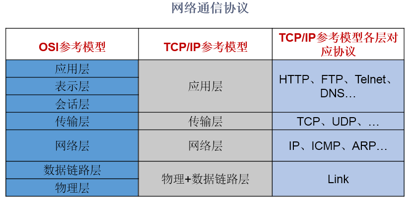
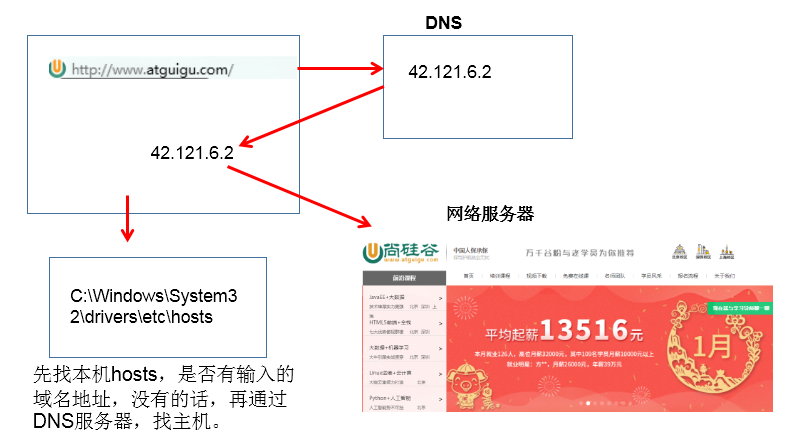
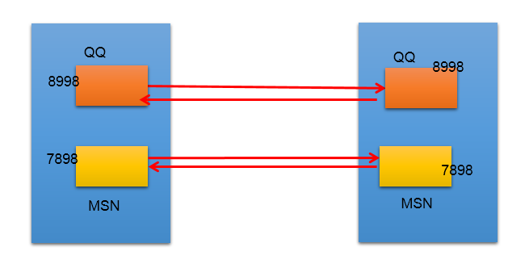
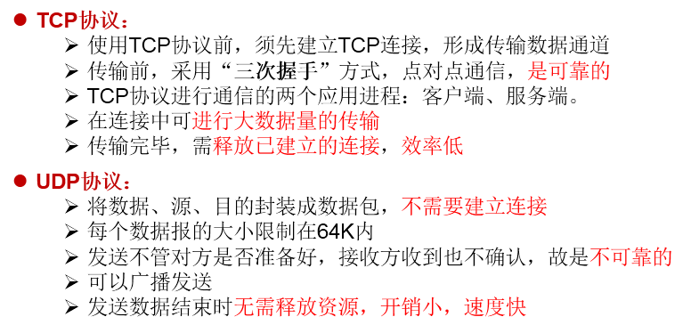
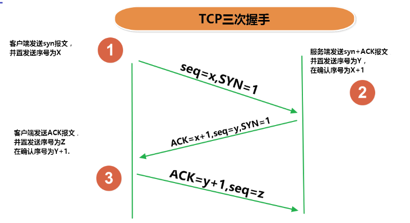
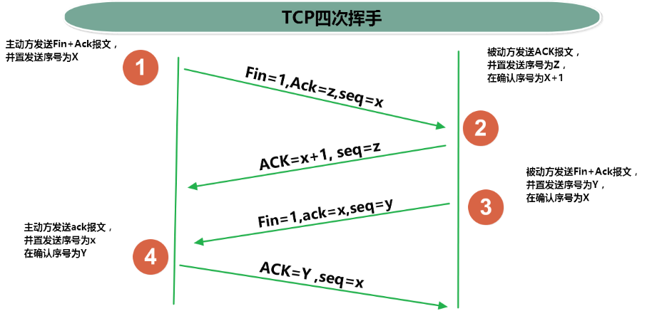

# day27授课笔记

讲师：宋红康

***

## 一、作业

- 简答题

```
	说明流的三种分类方式
	流的流向：输入流、输出流
	单位的不同：字节流、字符流
	流的角色：节点流、处理流
	
	谈谈你对对象序列化机制的理解？我们以对象流为载体，讲解的。
序列化过程：对象序列化机制允许把内存中的Java对象转换成平台无关的二进制流，从而允许把这种二进制流持久地保存在磁盘上，或通过网络将这种二进制流传输到另一个网络节点。
反序列化过程：当其它程序获取了这种二进制流，就可以恢复成原来的Java对象

	谈谈你对编码与解码过程的理解？
载体：String < ---- > byte[]
     InputStreamReader\OutputStreamWriter

编码：String ---> byte[] ; OutputStreamWriter
解码： byte[] ----> String ; InputStreamReader

	对象要想实现序列化，需要满足哪几个条件
 * ① 实现接口：java.io.Serializable
 * ② 显式声明全局常量：serialVersionUID，用于唯一标识当前类
 * ③ 要想当前类的对象可序列化，必须其所有的属性也是可以序列化的

```

- 编程题

练习：

```
使用缓冲流实现a.jpg文件复制为b.jpg文件的操作
```

```java
public class Exer01 {
    public static void main(String[] args) {
        String src = "/exer01/a.jpg" ;
        String dest = "/exer01/b.jpg" ;
      
        bufferedCopyFile(src,dest);
        
    }
    /**
     * 使用缓冲流从原件中复制文件到目标文件中
     * @param src 源文件的路径
     * @param dest 目标文件的路径
     */
    public static void bufferedCopyFile(String src , String dest){
        BufferedInputStream bis = null;
        BufferedOutputStream bos = null;
        try{
           	//1.创建IO流
        	bis = new BufferedInputStream(new FileInputStream(src));
        	bos = new BufferedOutputStream(new FileOutputStream(dest));
        	//2.数据的读写
        	byte[] data = new byte[1024];
        	int length ;
        	while ((length = bis.read(data)) != -1){
            	bos.write(data,0,length);
        	}
        	System.out.println("文件复制成功");
        	    
        }catch(Exception e){
            e.printStackTrace();
        }finally{
            //3.关闭文件
            try {
                if (bos != null)
                    bos.close();
            } catch (IOException e) {
                e.printStackTrace();
            }
            try {
                if (bis != null)
                    bis.close();
            } catch (IOException e) {
                e.printStackTrace();
            }
            
        }
    }
}
```

练习：

```
将gbk格式的文件转换为utf-8格式存储
```

```java
public class GBKToUTF_8 {
    @Test
    public void test() {
        InputStreamReader isr = null;
        OutputStreamWriter osw = null;
        try {
            isr = new InputStreamReader(new FileInputStream(new File("test.txt")),"GBK");
            osw = new OutputStreamWriter(new FileOutputStream(new File("test_copy.txt")), "UTF-8");

            char[] cbuf = new char[8192];
            int len;
            while ((len = isr.read(cbuf)) != -1) {
                osw.write(cbuf, 0, len);
            }
            System.out.println("格式转换成功<GBK → UTF-8>");
        } catch (IOException e) {
            e.printStackTrace();
        } finally {
            try {
                if (osw != null)
                    osw.close();
            } catch (IOException e) {
                e.printStackTrace();
            }
            try {
                if (isr != null)
                    isr.close();
            } catch (IOException e) {
                e.printStackTrace();
            }
        }

    }
}
```

## 二、复习

- 流的分类
- 流的体系结构：4个抽象基类、具体的流
- 4个文件流：FileXxxx，是最基本的处理文件的流
- 4个缓冲流：BufferedXxxx，是处理流的一种，包裹上面提到的4个文件流，可以提高读写效率
- 2个转换流：InputStreamReader、OutputStreamWriter
- 2个对象流：ObjectInputStream、ObjectOutputStream，对象的序列化机制

- 处理流的过程非常的规范！

  ```java
  1）创建文件及必要的流
  BufferedInputStream bis = new BufferedInputStream(new FileInputStream(new File(String path)));
  
  BufferedInputStream bis = new BufferedInputStream(new FileInputStream(String path));
  
  2) 读写数据的过程：  read(byte[] / char[])  ; write(byte[] / char[] , 0, len)
      
  3) 关闭资源：必须在finally中显式的声明流的close()
  ```

## 三、其他的处理流(了解）：

### 3.1 标准的输入输出流

```java
 /*
    标准的输入流：System.in 默认从键盘输入
    标准的输出流：System.out 默认从显示屏输出

    重定向：通过System类的setIn，setOut方法对默认设备进行改变。
        public static void setIn(InputStream in)
        public static void setOut(PrintStream out)

     */
    @Test
    public void test1() {
        Scanner scann = new Scanner(System.in);
        System.out.println("请输入一个字符串");
        String inf = scann.nextLine();
        System.out.println(inf);
        //关闭操作
        scann.close();
    }

    /*
    从键盘输入字符串，要求将读取到的整行字符串转成大写输出。然后继续进行输入操作，
    直至当输入“e”或者“exit”时，退出程序。

     */
    @Test
    public void test2() {
        System.out.println("请输入信息(退出输入e或exit):");
        // 把"标准"输入流(键盘输入)这个字节流包装成字符流,再包装成缓冲流
        BufferedReader br = new BufferedReader(new InputStreamReader(System.in));
        String s = null;
        try {
            while ((s = br.readLine()) != null) { // 读取用户输入的一行数据 --> 阻塞程序
                if ("e".equalsIgnoreCase(s) || "exit".equalsIgnoreCase(s)) {
                    System.out.println("安全退出!!");
                    break;
                }
                // 将读取到的整行字符串转成大写输出
                System.out.println("-->:" + s.toUpperCase());
                System.out.println("继续输入信息");
            }
        } catch (IOException e) {
            e.printStackTrace();
        } finally {
            try {
                if (br != null) {
                    br.close(); // 关闭过滤流时,会自动关闭它包装的底层节点流
                }
            } catch (IOException e) {
                e.printStackTrace();
            }
        }

    }
```


### 3.2 打印流

```java
/*
    打印流： PrintStream 和 PrintWriter
    1. 提供了一系列重载的print()和println()方法，用于多种数据类型的输出
    2. System.out返回的是PrintStream的实例
     */
    @Test
    public void test3() {
        PrintStream ps = null;
        try {
            FileOutputStream fos = new FileOutputStream(new File("D:\\IO\\text.txt"));
            // 创建打印输出流,设置为自动刷新模式(写入换行符或字节 '\n' 时都会刷新输出缓冲区)
            ps = new PrintStream(fos, true);
            if (ps != null) {// 把标准输出流(控制台输出)改成文件
                System.setOut(ps);
            }
            for (int i = 0; i <= 255; i++) { // 输出ASCII字符
                System.out.print((char) i);
                if (i % 50 == 0) { // 每50个数据一行
                    System.out.println(); // 换行
                }
            }
        } catch (FileNotFoundException e) {
            e.printStackTrace();
        } finally {
            if (ps != null) {
                ps.close();
            }
        }


    }
```


### 3.3 数据流

```
/*
    数据流：
        DataInputStream 和 DataOutputStream
    作用：为了方便地操作Java语言的基本数据类型和String的数据，可以使用数据流。
    说明：可以使用对象流替换数据流
     */
    @Test
    public void test4() {
        DataOutputStream dos = null;
        try { // 创建连接到指定文件的数据输出流对象
            dos = new DataOutputStream(new FileOutputStream("destData.dat"));
            dos.writeUTF("我爱北京天安门"); // 写UTF字符串
            dos.writeBoolean(false); // 写入布尔值
            dos.writeLong(1234567890L); // 写入长整数
            System.out.println("写文件成功!");
        } catch (IOException e) {
            e.printStackTrace();
        } finally { // 关闭流对象
            try {
                if (dos != null) {
                    // 关闭过滤流时,会自动关闭它包装的底层节点流
                    dos.close();
                }
            } catch (IOException e) {
                e.printStackTrace();
            }
        }

    }

    @Test
    public void test5() {
        DataInputStream dis = null;
        try {
            dis = new DataInputStream(new FileInputStream("destData.dat"));
            String info = dis.readUTF();
            boolean flag = dis.readBoolean();
            long time = dis.readLong();
            System.out.println(info);
            System.out.println(flag);
            System.out.println(time);
        } catch (Exception e) {
            e.printStackTrace();
        } finally {
            if (dis != null) {
                try {
                    dis.close();
                } catch (IOException e) {
                    e.printStackTrace();
                }
            }
        }

    }
```


### 3.4 随机存取文件流

```java
/**
 * RandomAccessFile类的使用：
 * 1. 此类直接继承于java.lang.Object类
 * 2. 此类实现类DataInput和DataOutput接口，此类既可以作为输入流，有可以作为输出流
 * 3. 如果写出到的文件存在，则不会对文件进行覆盖，而是从头开始对文件内容进行覆盖
 * 4. 可以实现从文件内容的指定位置开始写入数据：seek(int position)
 *
 * @author shkstart
 * @create 2020 上午 10:13
 */
public class RandomAccessFileTest {

    @Test
    public void test1() {
        RandomAccessFile raf1 = null;
        RandomAccessFile raf2 = null;
        try {
            raf1 = new RandomAccessFile("baby.jpg", "r");
            raf2 = new RandomAccessFile("baby1.jpg", "rw");

            byte[] buffer = new byte[1024];
            int len;
            while ((len = raf1.read(buffer)) != -1) {
                raf2.write(buffer, 0, len);
            }
        } catch (IOException e) {
            e.printStackTrace();
        } finally {
            try {
                if (raf2 != null)
                    raf2.close();
            } catch (IOException e) {
                e.printStackTrace();
            }
            try {
                if (raf1 != null)
                    raf1.close();
            } catch (IOException e) {
                e.printStackTrace();
            }
        }

    }

    @Test
    public void test2() throws IOException {
        RandomAccessFile raf = new RandomAccessFile("hello.txt","rw");
        raf.seek(5);
        raf.write("xyz".getBytes());

        raf.close();
    }
}
```


## 四、介绍NIO

```
1. Java NIO (New IO，Non-Blocking IO)是从Java 1.4版本开始引入的一套新的IO API，可以替代标准的Java IO API。NIO与原来的IO有同样的作用和目的，但是使用的方式完全不同，NIO支持面向缓冲区的(IO是面向流的)、基于通道的IO操作。NIO将以更加高效的方式进行文件的读写操作。

2. NIO与IO的对比：
IO		NIO
byte[] / char[]		Buffer
流Stream		FileChannel

NIO : Non-Blocking  非阻塞式

3.NIO的相关API:
|-----java.nio.channels.Channel
	|-----FileChannel:处理本地文件
	|-----SocketChannel：TCP网络编程的客户端的Channel
	|-----ServerSocketChannel:TCP网络编程的服务器端的Channel
	|-----DatagramChannel：UDP网络编程中发送端和接收端的Channel

4. NIO2
随着 JDK 7 的发布，Java对NIO进行了极大的扩展，增强了对文件处理和文件系统特性的支持，以至于我们称他们为 NIO.2。因为 NIO 提供的一些功能，NIO已经成为文件处理中越来越重要的部分。

5. 
Path:替换原有的File类，表示一个文件或文件目录
     提供了丰富的方法
Paths:用来实例化Path
Files:用来操作文件或文件目录的工具类

```

## 五、网络编程概述

### 5.1 实现网络通信，待解决的问题

```
*   1. 如何准确地定位网络上一台或多台主机；定位主机上的特定的应用
*   2. 找到主机后如何可靠高效地进行数据传输
```

### 5.2 如何解决上述问题

```
网络通信的两大要素：
*   要素一：IP 和 端口号。 解决问题1
*   要素二：网路通信协议。 解决问题2
```

### 5.3 要素一和要素二的概述：



其中，TCP/IP协议模型成为事实上的标准。

## 六、IP和端口号

### 6.1 IP

```
 * 1. IP:唯一的标识 Internet 上的计算机（通信实体）
 * 2. IP分类：  角度一： ipv4  和  ipv6
 *              角度二： 公网地址   和  私有地址：192.168.0.0 - 192.168.255.255
 *
 * 3. 可以使用一个域名来代表一个具体的ip地址。
 *      比如： www.atguigu.com    www.baidu.com   www.vip.com  www.jd.com   www.mi.com
 * 4. 本地的ip：127.0.0.1  本地回路地址。 别名：localhost
 * 5. 代码中使用InetAddress类的一个对象表示一个具体的ip地址
 *      如何实例化InetAddress:getByName(String host)
 *                            getLocalHost()
 *      两个常用方法：getHostName(); getHostAddress()
```



代码实现：

```java
public class InetAddressTest {

    public static void main(String[] args) {
        try {
            InetAddress inetAddress = InetAddress.getByName("192.168.23.43");

            InetAddress inetAddress1 = InetAddress.getByName("www.atguigu.com");
            System.out.println(inetAddress1);//www.atguigu.com/124.200.113.114

            InetAddress localHost = InetAddress.getLocalHost();
            System.out.println(localHost);

            //测试方法：
            System.out.println(inetAddress1.getHostName());
            System.out.println(inetAddress1.getHostAddress());

        } catch (UnknownHostException e) {
            e.printStackTrace();
        }

    }

}
```


### 6.2 端口号

```
1. 端口号标识正在计算机上运行的进程（程序）
	不同的进程有不同的端口号

2. 被规定为一个 16 位的整数 0~65535。

3. 端口分类：
>公认端口：0~1023。被预先定义的服务通信占用（如：HTTP占用端口80，FTP占用端口21，Telnet占用端口23）
>注册端口：1024~49151。分配给用户进程或应用程序。（如：Tomcat占用端口8080，MySQL占用端口3306，Oracle占用端口1521等）。
> 动态/私有端口：49152~65535。

4. 端口号与IP地址的组合得出一个网络套接字：Socket。

```



## 七、TCP和UDP编程

### 7.1 概述







### 7.2 TCP网络编程

- 例题1

```java
package com.atguigu.java1;

import org.junit.Test;

import java.io.ByteArrayOutputStream;
import java.io.IOException;
import java.io.InputStream;
import java.io.OutputStream;
import java.net.InetAddress;
import java.net.ServerSocket;
import java.net.Socket;
import java.net.UnknownHostException;

/**
 * 1.客户端发送内容给服务端，服务端将内容打印到控制台上。
 *
 * @author shkstart
 * @create 2020 下午 2:43
 */
public class TCPTest {

    @Test
    public void client() {//客户端
        Socket socket = null;
        OutputStream os = null;
        try {
            InetAddress inetAddress = InetAddress.getByName("127.0.0.1");//指明对方的ip
            int port = 9090;//指明对方的端口号
            //1. 创建Socket的实例
            socket = new Socket(inetAddress, port);

            //2.获取一个输出流
            os = socket.getOutputStream();
            //3. 写出数据
            os.write("你好，我是客户端，多多关照".getBytes());
        } catch (IOException e) {
            e.printStackTrace();
        } finally {
            //4. 关闭资源
            try {
                if (os != null)
                    os.close();
            } catch (IOException e) {
                e.printStackTrace();
            }
            try {
                if (socket != null)
                    socket.close();
            } catch (IOException e) {
                e.printStackTrace();
            }
        }

    }

    @Test
    public void server() {//服务器端
        ServerSocket ss = null;
        Socket socket = null;//此方法是阻塞式的方法
        InputStream is = null;
        ByteArrayOutputStream baos = null;
        try {
            //1. 创建ServerSocket
            int port = 9090;
            ss = new ServerSocket(port);
            //2. 接收来自于客户端的Socket
            socket = ss.accept();
            //3. 获取输入流
            is = socket.getInputStream();

            System.out.println("收到了来自于" + socket.getInetAddress().getHostAddress() + "的数据:");

            //4. 读取数据
            byte[] buffer = new byte[10];
            baos = new ByteArrayOutputStream();
            int len;
            while ((len = is.read(buffer)) != -1) {
                baos.write(buffer,0,len);
            }
            System.out.println(baos.toString());
        } catch (IOException e) {
            e.printStackTrace();
        } finally {
            //5. 关闭资源
            try {
                if (baos != null)
                    baos.close();
            } catch (IOException e) {
                e.printStackTrace();
            }
            try {
                if (is != null)
                    is.close();
            } catch (IOException e) {
                e.printStackTrace();
            }
            try {
                if (socket != null)
                    socket.close();
            } catch (IOException e) {
                e.printStackTrace();
            }
            //服务端的socket也可以关闭，但是一般服务器是开启的。
            try {
                if (ss != null)
                    ss.close();
            } catch (IOException e) {
                e.printStackTrace();
            }
        }

    }
}

```


- 例题2

```java
package com.atguigu.java1;

import com.sun.deploy.trace.SocketTraceListener;
import org.junit.Test;

import java.io.*;
import java.net.InetAddress;
import java.net.ServerSocket;
import java.net.Socket;
import java.net.UnknownHostException;

/**
 *  2.客户端发送文件给服务端，服务端将文件保存在本地。
 *
 *
 * @author shkstart
 * @create 2020 下午 2:43
 */
public class TCPTest1 {

    //仍然应该使用try-catch-finally处理异常
    @Test
    public void client() throws IOException {
        //1.
        Socket socket = new Socket(InetAddress.getByName("127.0.0.1"), 8989);
        //2.
        FileInputStream fis = new FileInputStream("baby.jpg");
        OutputStream os = socket.getOutputStream();
        //3.
        byte[] buffer = new byte[1024];
        int len;
        while((len = fis.read(buffer)) != -1){
            os.write(buffer,0,len);
        }
        //4.
        os.close();
        fis.close();
        socket.close();
    }

    //仍然应该使用try-catch-finally处理异常
    @Test
    public void server() throws IOException {
        //1.
        ServerSocket serverSocket = new ServerSocket(8989);
        //2.
        Socket socket = serverSocket.accept();
        //3.
        InputStream is = socket.getInputStream();
        FileOutputStream fos = new FileOutputStream("src/baby123.jpg");
        //4.
        byte[] buffer = new byte[1024];
        int len;
        while((len = is.read(buffer)) != -1){
            fos.write(buffer,0,len);
        }
        //5.
        fos.close();
        is.close();
        socket.close();
        //serverSocket.close();
    }
}

```


- 例题3

```java
package com.atguigu.java1;

import org.junit.Test;

import java.io.*;
import java.net.InetAddress;
import java.net.ServerSocket;
import java.net.Socket;

/**
 * 3.从客户端发送文件给服务端，服务端保存到本地。并返回“发送成功”给客户端。并关闭相应的连接。
 * @author shkstart
 * @create 2020 下午 2:44
 */
public class TCPTest2 {
    //仍然应该使用try-catch-finally处理异常
    @Test
    public void client() throws IOException {
        //1.
        Socket socket = new Socket(InetAddress.getByName("127.0.0.1"), 8989);
        //2.
        FileInputStream fis = new FileInputStream("baby.jpg");
        OutputStream os = socket.getOutputStream();
        //3.
        byte[] buffer = new byte[1024];
        int len;
        while((len = fis.read(buffer)) != -1){
            os.write(buffer,0,len);
        }
        System.out.println("client-------1");
        //显式的关闭输出流
        socket.shutdownOutput();

        //接收来自于服务器端的数据,并显示
        InputStream is = socket.getInputStream();
        ByteArrayOutputStream baos = new ByteArrayOutputStream();
        byte[] newBuf = new byte[10];
        int newLen;
        while((newLen = is.read(newBuf)) != -1){
            baos.write(newBuf,0,newLen);
        }
        System.out.println(baos.toString());

        //4.
        is.close();
        baos.close();
        os.close();
        fis.close();
        socket.close();
    }

    //仍然应该使用try-catch-finally处理异常
    @Test
    public void server() throws IOException {
        //1.
        ServerSocket serverSocket = new ServerSocket(8989);
        //2.
        Socket socket = serverSocket.accept();
        //3.
        InputStream is = socket.getInputStream();
        FileOutputStream fos = new FileOutputStream("src/babyabc.jpg");
        //4.
        byte[] buffer = new byte[1024];
        int len;
        while((len = is.read(buffer)) != -1){
            fos.write(buffer,0,len);
        }
        System.out.println("server-------1");
        //服务器给客户端反馈数据
        OutputStream os = socket.getOutputStream();
        os.write("收到你的靓照，非常的漂亮！".getBytes());

        //5.
        os.close();
        fos.close();
        is.close();
        socket.close();
        //serverSocket.close();
    }
}

```

### 7.3 UDP网络编程

```java
package com.atguigu.java2;

import org.junit.Test;

import javax.sound.midi.Receiver;
import java.io.IOException;
import java.net.DatagramPacket;
import java.net.DatagramSocket;
import java.net.InetAddress;

/**
 * @author shkstart
 * @create 2020 下午 4:19
 */
public class UDPTest {

    @Test
    public void sender() throws IOException {
        DatagramSocket socket = new DatagramSocket();

        byte[] buffer = "hello".getBytes();

        InetAddress inet = InetAddress.getByName("127.0.0.1");

        DatagramPacket packet = new DatagramPacket(buffer,0,buffer.length,inet,9090);

        socket.send(packet);

        socket.close();
    }

    @Test
    public void receiver() throws IOException {
        DatagramSocket socket = new DatagramSocket(9090);

        byte[] buffer = new byte[1024];
        DatagramPacket packet = new DatagramPacket(buffer,0,buffer.length);
        socket.receive(packet);
        String str = new String(packet.getData(),0,packet.getLength());
        System.out.println(str);

        socket.close();
    }

}

```


## 八、URL编程

### 8.1 介绍

```
1. URL(Uniform Resource Locator)：统一资源定位符，它表示 Internet 上某一资源的地址。

2. 使用URL类表示互联网的某一资源
http://localhost:8080/examples/playgirl.jpg?keyword=girl
协议名   主机名    端口号    资源地址            请求数据
3. 实例化
4. 主要方法
```

### 8.2 测试

```java
try {
     URL url = new URL("http://localhost:8080/examples/playgirl.jpg?keyword=girl");

//            public String getProtocol(  )     获取该URL的协议名
//            public String getHost(  )           获取该URL的主机名
//            public String getPort(  )            获取该URL的端口号
//            public String getPath(  )           获取该URL的文件路径
//            public String getFile(  )             获取该URL的文件名
//            public String getQuery(   )        获取该URL的查询名

            System.out.println(url.getProtocol());
            System.out.println(url.getHost());
            System.out.println(url.getPort());
            System.out.println(url.getPath());
            System.out.println(url.getFile());
            System.out.println(url.getQuery());

        } catch (MalformedURLException e) {
            e.printStackTrace();

        }
```

### 8.3 下载数据

```java
public class URLTest1 {
    public static void main(String[] args) {

        HttpURLConnection urlConnection = null;
        InputStream is = null;
        FileOutputStream fos = null;
        try {
            URL url = new URL("http://localhost:8080/examples/playgirl.jpg");

            urlConnection = (HttpURLConnection) url.openConnection();

            is = urlConnection.getInputStream();
            fos = new FileOutputStream("playgirl.jpg");
            byte[] buffer = new byte[1024];
            int len;
            while ((len = is.read(buffer)) != -1) {
                fos.write(buffer, 0, len);
            }
            System.out.println("下载成功");
        } catch (IOException e) {
            e.printStackTrace();
        } finally {
            try {
                if (is != null)
                    is.close();
            } catch (IOException e) {
                e.printStackTrace();
            }
            try {
                if (fos != null)
                    fos.close();
            } catch (IOException e) {
                e.printStackTrace();
            }
            if (urlConnection != null)
                urlConnection.disconnect();
        }


    }
}
```

