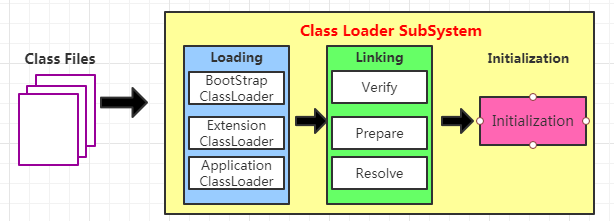
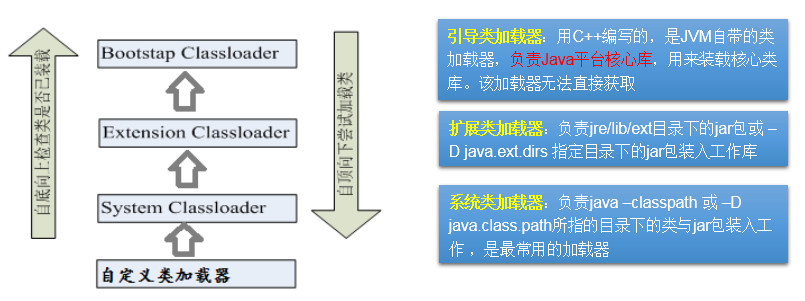

# day28授课笔记

讲师：宋红康

***

## 一、复习

- IO流中涉及到40来个类，但是常用的、需要大家掌握的：
  - 4个文件流：FileInputStream 、 FileOutputStream、FileReader、FileWriter
  - 4个缓冲流：BufferedInputStream、BufferedOutpuStream、BufferedReader、BufferedWriter
  - 2个转换流：InputStreamReader、OutputStreamWriter
    - 字符编码集：ascii , gb2312,gbk,utf-8
    - **凡是出现乱码的地方，一定是字符串解码时，与当初编码使用的字符集不一致导致的。**
  - 2个对象流：ObjectInputStream、ObjectOutputStream
    - **谈谈你对序列化机制的理解**

- 需要大家理解的流

  - 标准的输入、输出流
  - 打印流：System.out.println()
  - 数据流：DataInputStream、DataOutputStream
  - 随机存取文件流：RandomAccessFile

- NIO，NIO2的理解

- 基本上所有的流都是以标准的读取或写入的方式实现的

  ```
  1. 造文件、造流
  2. 具体的读取过程：byte[] buffer = new byte[1024];  char[] cbuf = new char[1024];
     或
     具体的写出过程:
  3. 资源的关闭： 使用try-catch-finally处理异常
  ```


- 网络通信的要素：① IP和端口号 ② 网络通信协议
- 理解IP和端口号
  - 如何实例化InetAddress，常用的方法
- 理解TCP/IP参考模型：应用层、传输层、网络层、物理+数据链路层
- TCP协议和UDP协议的区别
- **熟悉使用**Socket编程在传输层使用TCP或UDP协议时，如何实现编码

- 了解URL编程

## 二、熟悉反射的使用

### 2.1 反射的理解

- 反射的概述

```
java给我们提供了一套api(java.lang.reflect),程序员可以使用这套api实现：
> 动态的获取内存中的运行时类；
> 动态的创建运行时类的对象；
> 动态的调用运行时类中的指定结构：属性、方法
```

- 反射的应用

```
Java反射机制提供的功能：
	在运行时判断任意一个对象所属的类
	在运行时构造任意一个类的对象
	在运行时判断任意一个类所具有的成员变量和方法
	在运行时获取泛型信息
	在运行时调用任意一个对象的成员变量和方法
	在运行时处理注解
	生成动态代理
```

- 相关api

```
java.lang.Class:代表一个类

java.lang.reflect.Method:代表类的方法
java.lang.reflect.Field:代表类的成员变量
java.lang.reflect.Constructor:代表类的构造器
… …

```

### 2.2 反射的应用举例

- 使用反射前：

```
//使用反射之前的例子
    @Test
    public void test1(){
        //1. 创建类的对象
        Person p1 = new Person();
        System.out.println(p1);
        //2. 调用对象的属性
        p1.age = 1;
        System.out.println("age : " + p1.age);
        //3. 调用对象的方法
        String info = p1.show();
        System.out.println("返回的信息：" + info);

        //使用如上的方式，在Person类外部不能调用Person类中私有的结构：构造器、属性、方法
    }
```

- 使用反射的例子

```java
//使用反射的例子
    @Test
    public void test2() throws Exception {
        //前提：获取运行期中的运行时类：Person
        Class clazz = Person.class;
        //1. 创建类的对象
        Person p1 = (Person) clazz.newInstance();
        System.out.println(p1);

        //2. 调用对象的属性
        Field ageField = clazz.getField("age");
        ageField.set(p1,1);
        System.out.println(ageField.get(p1));


        //3. 调用对象的方法
        Method showMethod = clazz.getMethod("show");
        String info = (String) showMethod.invoke(p1);
        System.out.println("返回的信息：" + info);

    }
    @Test
    public void test3() throws Exception {
        //前提：获取运行期中的运行时类：Person
        Class clazz = Person.class;
        //使用反射，在Person类外部调用Person类中私有的结构：构造器、属性、方法
        //1.调用私有构造器:private Person(String name,int age)
        Constructor con = clazz.getDeclaredConstructor(String.class, int.class);
        con.setAccessible(true);
        Person p2 = (Person) con.newInstance("Tom",12);
        System.out.println(p2);

        //2. 调用私有属性:private String name;
        Field nameFiled = clazz.getDeclaredField("name");
        nameFiled.setAccessible(true);
        nameFiled.set(p2,"Jerry");
        System.out.println(nameFiled.get(p2));
        System.out.println(p2);

        //3. 调用私有方法：private void showNation(String nation)
        Method showNation = clazz.getDeclaredMethod("showNation", String.class);
        showNation.setAccessible(true);
        showNation.invoke(p2,"CHN");
    }

    /*
    两个疑问？
    1. 为什么在可以直接创建对象，调用相关结构的同时，还要提供一套反射的api做类似的事情呢？
       体现反射的动态性！

    2. 前面讲了封装性，反射的出现，是否与封装性矛盾呢？ 不矛盾！
       封装性：建议我们是否调用的问题
       反射：我们能否调用的问题

     */
```

其中Person类定义如下：

```java
package com.atguigu.java;

/**
 * @author shkstart
 * @create 2020 上午 9:36
 */
public class Person {
    //属性
    private String name;
    public int age;

    //构造器
    public Person(){
        System.out.println("Person()...");
    }

    public Person(int age){
        this.age = age;
    }

    private Person(String name,int age){
        System.out.println("Person(String,int)...");
        this.name = name;
        this.age = age;
    }

    //方法

    public String getName() {
        return name;
    }

    public void setName(String name) {
        this.name = name;
    }

    public int getAge() {
        return age;
    }

    public void setAge(int age) {
        this.age = age;
    }

    public String show(){
        System.out.println("name : " + name + ", age : " + age);
        return "name : " + name + ", age : " + age;
    }

    private void showNation(String nation){
        System.out.println("我来自：" + nation);
    }

    @Override
    public String toString() {
        return "Person{" +
                "name='" + name + '\'' +
                ", age=" + age +
                '}';
    }
}

```


## 三、java.lang.Class的理解（重点）

### 3.1 理解

```
    1. Class的理解：
    java源程序经过javac.exe执行以后，会生成一个或多个字节码文件。接着使用java.exe命令，将字节码文件代表的类加载（使用类的加载器）到内存中（放到方法区中缓存）。加载到内存中的类，称为运行时类。此运行时类就可以看作是Class的实例。

    2. Class的实例指向一个内存中的运行时类！
    3. 加载到内存中的运行时类，会被缓存。在整个jvm的生命周期内没有进行方法区gc时，只会存在一份！
    4. 前三种获取Class的方式需要掌握。前三种中，Class.forName()的方式更体现反射的动态性，更常用！
```

### 3.2 获取Class的几种方式

```java
//如何获取Class的实例呢
    @Test
    public void test4() throws ClassNotFoundException {
        //方式一：调用类的静态属性：class
        Class clazz1 = Person.class;
        System.out.println(clazz1);//class com.atguigu.java.Person

        //方式二：调用对象的方法：getClass()
        Person p1 = new Person();
        Class clazz2 = p1.getClass();
        System.out.println(clazz2);

        //方式三：调用Class的静态方法：forName(String className)
        Class clazz3 = Class.forName("com.atguigu.java.Person");
        System.out.println(clazz3);

        System.out.println(clazz1 == clazz2);
        System.out.println(clazz1 == clazz3);

        //方式四：（了解）使用类的加载器
        ClassLoader classLoader = ReflectionTest.class.getClassLoader();
        Class clazz4 = classLoader.loadClass("com.atguigu.java.Person");
        System.out.println(clazz1 == clazz4);

    }
```

### 3.3 哪些类型可以有Class对象

```java
/*
    哪些类型可以有Class对象？
    （1）class：
    外部类，成员(成员内部类，静态内部类)，局部内部类，匿名内部类
    （2）interface：接口
    （3）[]：数组
    （4）enum：枚举
    （5）annotation：注解@interface
    （6）primitive type：基本数据类型
    （7）void
     */
    @Test
    public void test5(){
        Class c1 = Object.class;
        Class c2 = Comparable.class;
        Class c3 = String[].class;
        Class c4 = int[][].class;
        Class c5 = ElementType.class;
        Class c6 = Override.class;
        Class c7 = int.class;
        Class c8 = void.class;
        Class c9 = Class.class;

        int[] a = new int[10];
        int[] b = new int[100];
        Class c10 = a.getClass();
        Class c11 = b.getClass();
        // 只要元素类型与维度一样，就是同一个Class
        System.out.println(c10 == c11);
    }
```

### 3.4 类的加载过程（了解）



- 过程一：加载环节：字节码文件加载到内存中，生成对应的Class的实例
- 过程二：链接环节：
  - 验证：字节码是否合规，是否安全
  - **准备：给当前类的static属性默认初始化赋值**
  - 解析：将符号引用转为直接引用
- 过程三：初始化：给当前类的static属性执行显式初始化、静态代码块中初始化。此操作在<clinit>方法中执行。

### 3.5 类的加载器（了解）



```java
public static void main(String[] args) {
        //获取系统类加载器（应用程序类加载器）
        ClassLoader systemClassLoader = ClassLoader.getSystemClassLoader();
        System.out.println(systemClassLoader);//sun.misc.Launcher$AppClassLoader@18b4aac2
        //获取扩展类加载器
        ClassLoader extentionClassLoader = systemClassLoader.getParent();
        System.out.println(extentionClassLoader);//sun.misc.Launcher$ExtClassLoader@6d6f6e28
        //获取引导类加载器：失败，返回值为null
        ClassLoader bootstrapClassLoader = extentionClassLoader.getParent();
        System.out.println(bootstrapClassLoader);//null

        //用户自定义类默认使用的是系统类加载器
        ClassLoader loader1 = Person.class.getClassLoader();//
        System.out.println(loader1);//sun.misc.Launcher$AppClassLoader@18b4aac2
        //java核心类库使用引导类加载器
        ClassLoader loader2 = String.class.getClassLoader();
        System.out.println(loader2);//null

    }
```

### 3.6 如何读取配置文件的内容（重点）

```java
//如何加载配置文件
    @Test
    public void test() throws Exception {
        //方式一：
        //单元测试方法中，相对路径是基于当前的module
        Properties pros = new Properties();
        FileInputStream fis = new FileInputStream("jdbc.properties");
        FileInputStream fis1 = new FileInputStream("src/jdbc1.properties");
        pros.load(fis1);

        String name = pros.getProperty("name");
        String password = pros.getProperty("password");
        System.out.println("name : " + name + ", password : " + password);


    }
    @Test
    public void test1() throws IOException {
        //方式二：使用类的加载器的方式也可以读取配置文件。默认路径是当前module的src目录下
        Properties pros = new Properties();
        InputStream is = ClassLoader.getSystemClassLoader().getResourceAsStream("jdbc1.properties");
        pros.load(is);

        String name = pros.getProperty("name");
        String password = pros.getProperty("password");
        System.out.println("name : " + name + ", password : " + password);
    }
```


## 四、反射的应用1：创建运行时类的对象 （重点）

### 4.1 演示反射的应用的前提

```
package com.atguigu.java1;

/**
 * @author shkstart
 * @create 2020 下午 2:07
 */
public class Creature<T> {

    private String type;
    public double weight;

    private void info(){
        System.out.println("我是一种生物");
    }

    public void display(){
        System.out.println("type = " + type + ", weight = " + weight);
    }

}

```

```
/**
 * @author shkstart
 * @create 2020 下午 2:11
 */
@Target({TYPE, FIELD, METHOD, PARAMETER, CONSTRUCTOR, LOCAL_VARIABLE})
@Retention(RetentionPolicy.RUNTIME)
public @interface MyAnnotation {
    String value() default "abc";
}
```

```
public interface MyInterface {

    void test();
}
```

```java
package com.atguigu.java1;

/**
 * @author shkstart
 * @create 2020 上午 9:36
 */
@MyAnnotation
public class Person extends Creature<String> implements Comparable<Integer>,MyInterface{
    //属性
    private String name;
    public int age;
    private static String info = "我是一个人";

    //构造器
    public Person(){
        System.out.println("Person()...");
    }

    public Person(int age){
        this.age = age;
    }

    private Person(String name, int age){
        System.out.println("Person(String,int)...");
        this.name = name;
        this.age = age;
    }

    //方法
    public String getName() {
        return name;
    }

    public void setName(String name) {
        this.name = name;
    }

    public int getAge() {
        return age;
    }

    public void setAge(int age) {
        this.age = age;
    }

    @MyAnnotation(value="hello")
    public String show(){
        System.out.println("name : " + name + ", age : " + age);
        return "name : " + name + ", age : " + age;
    }

    private String showNation(String nation,int year) throws RuntimeException{
        System.out.println("我来到：" + nation + ",已经有" + year + "年了");
        return nation;
    }

    @Override
    public String toString() {
        return "Person{" +
                "name='" + name + '\'' +
                ", age=" + age +
                '}';
    }

    @Override
    public void test() {

    }

    @Override
    public int compareTo(Integer o) {
        return 0;
    }

    public static void showInfo(){
        System.out.println("我是一个快乐的青年");
    }
}

```

### 4.2 创建运行时类的对象

```java
public class NewInstanceTest {

    @Test
    public void test1() throws IllegalAccessException, InstantiationException {

        Class<Person> clazz = Person.class;
        /*
        newInstance():执行时，需要调用运行时类中的空参的构造器。这里需要满足：
        1. 运行时类中需要提供空参的构造器
        2. 空参构造器的访问权限要足够！通常，都设置为public
         */
        Person person = clazz.newInstance();

        System.out.println(person);
    }
}

```


## 五、反射的应用2：获取运行时类中的所有结构

- 了解：获取所有的属性及属性的各个部分

```
package com.atguigu.java2;

import java.lang.reflect.Field;
import java.lang.reflect.Modifier;

import org.junit.Test;

import com.atguigu.java1.Person;

public class FieldTest {
	
	@Test
	public void test1(){
		
		Class clazz = Person.class;
		//getFields():获取到运行时类本身及其所有的父类中声明为public权限的属性
//		Field[] fields = clazz.getFields();
//
//		for(Field f : fields){
//			System.out.println(f);
//		}
		
		//getDeclaredFields():获取当前运行时类中声明的所有属性
		Field[] declaredFields = clazz.getDeclaredFields();
		for(Field f : declaredFields){
			System.out.println(f);
		}
	}
	
	//权限修饰符  变量类型  变量名
	@Test
	public void test2(){

		Class clazz = Person.class;
        Field[] declaredFields = clazz.getDeclaredFields();
        for(Field f : declaredFields){
            //1.权限修饰符
            int modifier = f.getModifiers();
//			System.out.println(modifier);
            System.out.print(Modifier.toString(modifier) + "\t");

//            //2.数据类型
            Class type = f.getType();
            System.out.print(type.getName() + "\t");

            //3.变量名
            String fName = f.getName();
            System.out.print(fName);
//
            System.out.println();
        }
	}
	
	
}

```


- 了解：获取所有的方法及方法的各个部分

```
package com.atguigu.java2;

import java.lang.annotation.Annotation;
import java.lang.reflect.Method;
import java.lang.reflect.Modifier;

import org.junit.Test;

import com.atguigu.java1.Person;

public class MethodTest {

	@Test
	public void test1() {

		Class clazz = Person.class;
		// getMethods():获取到运行时类本身及其所有的父类中声明为public权限的方法
//		 Method[] methods = clazz.getMethods();
//
//		 for(Method m : methods){
//		 System.out.println(m);
//		 }

		// getDeclaredMethods():获取当前运行时类中声明的所有方法
		Method[] declaredMethods = clazz.getDeclaredMethods();
		for (Method m : declaredMethods) {
			System.out.println(m);
		}

	}

	// 注解信息
	// 权限修饰符 返回值类型 方法名(形参类型1 参数1,形参类型2 参数2,...) throws 异常类型1,...{}
	@Test
	public void test2() {
		Class clazz = Person.class;
		Method[] declaredMethods = clazz.getDeclaredMethods();
		for (Method m : declaredMethods) {
			// 1.获取方法声明的注解
			Annotation[] annos = m.getAnnotations();
			for (Annotation a : annos) {
				System.out.println(a);
			}

			// 2.权限修饰符
			System.out.print(Modifier.toString(m.getModifiers()) + "\t");

			// 3.返回值类型
			System.out.print(m.getReturnType().getName() + "\t");

			// 4.方法名
			System.out.print(m.getName());
			System.out.print("(");
			// 5.形参列表
			Class[] parameterTypes = m.getParameterTypes();
			if (!(parameterTypes == null && parameterTypes.length == 0)) {
				for (int i = 0; i < parameterTypes.length; i++) {

					if (i == parameterTypes.length - 1) {
						System.out.print(parameterTypes[i].getName() + " args_" + i);
						break;
					}

					System.out.print(parameterTypes[i].getName() + " args_" + i + ",");
				}
			}

			System.out.print(")");

			// 6.抛出的异常
			Class[] exceptionTypes = m.getExceptionTypes();
			if (exceptionTypes.length > 0) {
				System.out.print("throws ");
				for (int i = 0; i < exceptionTypes.length; i++) {
					if (i == exceptionTypes.length - 1) {
						System.out.print(exceptionTypes[i].getName());
						break;
					}

					System.out.print(exceptionTypes[i].getName() + ",");
				}
			}

			System.out.println();
		}
	}

}

```


- 掌握：获取其他的相关结构

```java
package com.atguigu.java2;

import com.atguigu.java1.Person;
import org.junit.Test;

import java.lang.annotation.Annotation;
import java.lang.reflect.Constructor;
import java.lang.reflect.ParameterizedType;
import java.lang.reflect.Type;

/**
 * @author shkstart
 * @create 2020 下午 2:47
 */
public class OtherTest {

    /*
    获取当前类中的所有的构造器
     */
    @Test
    public void test1(){
        Class clazz = Person.class;
        Constructor[] cons = clazz.getDeclaredConstructors();
        for(Constructor c :cons){
            System.out.println(c);
        }
    }
    /*
    获取运行时类的父类
     */
    @Test
    public void test2(){
        Class clazz = Person.class;
        Class superclass = clazz.getSuperclass();
        System.out.println(superclass);//class com.atguigu.java1.Creature
    }
    /*
    获取运行时类的所在的包
     */
    @Test
    public void test3(){
        Class clazz = Person.class;
        Package pack = clazz.getPackage();
        System.out.println(pack);

    }
    /*
    获取运行时类的注解
     */
    @Test
    public void test4(){
        Class clazz = Person.class;
        Annotation[] annos = clazz.getAnnotations();
        for (Annotation anno : annos) {

            System.out.println(anno);
        }

    }

    /*
    获取运行时类所实现的接口
     */
    @Test
    public void test5(){
        Class clazz = Person.class;
        Class[] interfaces = clazz.getInterfaces();
        for (Class anInterface : interfaces) {

            System.out.println(anInterface);
        }

    }
    /*
    获取运行时类的带泛型的父类
     */
    @Test
    public void test6(){
        Class clazz = Person.class;
        Type genericSuperclass = clazz.getGenericSuperclass();
        System.out.println(genericSuperclass);//com.atguigu.java1.Creature<java.lang.String>
    }
    /*
    获取运行时类的父类的泛型
     */
    @Test
    public void test7(){
        Class clazz = Person.class;
        Type genericSuperclass = clazz.getGenericSuperclass();
        //如果父类是带泛型的，则一定可以强转为ParameterizedType
        ParameterizedType paramsType = (ParameterizedType) genericSuperclass;
        //获取泛型构成的数组
        Type[] arguments = paramsType.getActualTypeArguments();
        System.out.println(((Class)arguments[0]).getName());
    }
}

```


## 六、反射的应用3：调用运行时类中的指定的结构（重点）

- 调用运行时类中的指定的属性

```java
//    调用运行时类中的指定的属性
    @Test
    public void test1() throws IllegalAccessException, InstantiationException, NoSuchFieldException {
        //情况一：调用非静态的属性
        //前提：① 获取当前的运行时类  ② 创建运行时类的对象
        //在上述前提下，我们可以调用运行时类中的非静态的属性
//       public int age;
        Class clazz = Person.class;
        Person p1 = (Person) clazz.newInstance();
        //获取当前运行时类中的属性
        Field ageField = clazz.getField("age");
        ageField.set(p1,10);
        int age = (int) ageField.get(p1);
        System.out.println(age);

//       private String name;

        //通用的步骤：
        //1. getDeclaredField(String fieldName):获取指定名的属性
        Field nameField = clazz.getDeclaredField("name");
        //2. setAccessible(true):保证此属性是可访问的
        nameField.setAccessible(true);
        //3. 设置：set(Object obj,Object value)
        //   获取：get(Object obj)
        nameField.set(p1,"Tom");
        String name = (String) nameField.get(p1);
        System.out.println(name);

        //情况一：调用静态的属性
        //private static String info = "我是一个人";
        Field infoField = clazz.getDeclaredField("info");
        infoField.setAccessible(true);
//        String info = (String) infoField.get(Person.class);
        String info = (String) infoField.get(null);//形参可以赋值为null
        System.out.println(info);
        infoField.set(null,"Person...");
    }
```


- 调用运行时类中的指定的方法

```java
//    调用运行时类中的指定的方法
    @Test
    public void test2() throws Exception {
        //调用非静态的方法
        //private String showNation(String nation,int year)
        Class clazz = Person.class;
        Person p1 = (Person) clazz.newInstance();
        //通用的调用方法的步骤：
        //1. 获取指定的方法
        Method showNation = clazz.getDeclaredMethod("showNation", String.class, int.class);
        //2. setAccessible(true):保证此方法是可访问的
        showNation.setAccessible(true);
        //3. 调用此方法
        //invoke()方法的返回值即为对应的方法showNation()的返回值
        //对于运行时类中声明为void的方法，此时invoke()的返回值即为null
        String nation = (String) showNation.invoke(p1,"CHINA",10);//类比：String nation = p1.showNation("CHIINA",10)
        System.out.println(nation);

        //调用静态的方法
        //public static void showInfo()
        Method showInfo = clazz.getDeclaredMethod("showInfo");
        showInfo.setAccessible(true);
        Object returnVal = showInfo.invoke(null);
        System.out.println(returnVal);
    }
```


- 调用运行时类中的指定的构造器

```java
//调用运行时类中的指定的构造器
    //private Person(String name, int age)
    @Test
    public void test3() throws Exception {

        Class clazz = Person.class;
        //1. 获取指定的构造器
        Constructor constructor = clazz.getDeclaredConstructor(String.class, int.class);
        //2.setAccessible(true):保证此构造器是可访问的
        constructor.setAccessible(true);
        //3.创建运行时类的对象
        Person p = (Person) constructor.newInstance("万玉坤",24);
        System.out.println(p);

    }
```


## 七、体会反射的动态性

```java
public class ReflectionTest {

    //体会反射的动态性：动态的创建给定字符串对应的类的对象
    public <T> T getInstance(String className) throws Exception {

        Class clazz = Class.forName(className);

        Constructor constructor = clazz.getDeclaredConstructor();
        constructor.setAccessible(true);
        return (T) constructor.newInstance();

    }

    @Test
    public void test1() throws Exception {
        String className = "com.atguigu.java1.Person";
        Person p1 = getInstance(className);
        System.out.println(p1);
    }
    //体会反射的动态性：动态的创建指定字符串对应类的对象，并调用指定的方法
    public Object  invoke(String className,String methodName) throws Exception {
        Class clazz = Class.forName(className);
        Constructor constructor = clazz.getDeclaredConstructor();
        constructor.setAccessible(true);
        //动态的创建指定字符串对应类的对象
        Object obj = constructor.newInstance();

        Method method = clazz.getDeclaredMethod(methodName);
        method.setAccessible(true);
        return method.invoke(obj);
    }

    @Test
    public void test2() throws Exception {
        String info = (String) invoke("com.atguigu.java1.Person", "show");

        System.out.println("返回值为：" + info);

    }
}
```


## 八、反射的应用4：动态代理 (了解)

### 8.1 代理模式的理解

```
代理设计模式的原理: 

使用一个代理将对象包装起来, 然后用该代理对象取代原始对象。任何对原始对象的调用都要通过代理。代理对象决定是否以及何时将方法调用转到原始对象上。 

```


### 8.2 静态代理

- 举例1：

```java
package com.atguigu.java;

public class StaticProxyTest {

	public static void main(String[] args) {
		Star s = new Proxy(new RealStar());
		s.confer();
		s.signContract();
		s.bookTicket();
		s.sing();
		s.collectMoney();
	}
}

interface Star {
	void confer();// 面谈

	void signContract();// 签合同

	void bookTicket();// 订票

	void sing();// 唱歌

	void collectMoney();// 收钱
}

class RealStar implements Star {//明星：被代理类

	public void confer() {
	}

	public void signContract() {
	}

	public void bookTicket() {
	}

	public void sing() {
		System.out.println("明星：歌唱~~~");
	}

	public void collectMoney() {
	}
}

class Proxy implements Star {//经纪人：代理类
	private Star real;

	public Proxy(Star real) {
		this.real = real;
	}

	public void confer() {
		System.out.println("经纪人面谈");
	}

	public void signContract() {
		System.out.println("经纪人签合同");
	}

	public void bookTicket() {
		System.out.println("经纪人订票");
	}

	public void sing() {
		real.sing();
	}

	public void collectMoney() {
		System.out.println("经纪人收钱");
	}
}

```

- 举例2：实现Runnable接口的方式

```java
public interface Runnable {

    public abstract void run();
}
```

代理类：

```java
public class Thread implements Runnable {
	private Runnable target;
    public Thread(Runnable target){
        this.target = target;
    }
	@Override
    public void run() {
        if (target != null) {
            target.run();
        }
    }
}
```

被代理类：

```java
class PrintNumber implements Runnable{
    public void run() {}
    
}
```

测试：

```java
Runnable r = new PrintNumber();
Thread t = new Thread(r);
t.start();// ----> t.run()
```

