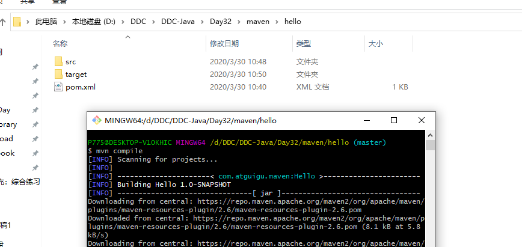

# 配置Maven的步骤


# Maven的工程结构与执行


目录结构


内部


往里面加入代码


compile



## 详细步骤

```java
/*
第一个Maven工程
1)第一步：创建约定的目录结构
Hello
	 src
	 ——main
	 ————java
	 ————resources
	 ——test
	 ————java
	 ————resources
	 pom.xml
main目录用于存放主程序。
test目录用于存放测试程序。
java目录用于存放源代码文件。
resources目录用于存放配置文件和资源文件。

2)第二步：创建Maven的核心配置文件pom.xml
     */
<?xml version="1.0" ?>
<project xmlns="http://maven.apache.org/POM/4.0.0" xmlns:xsi="http://www.w3.org/2001/XMLSchema-instance" xsi:schemaLocation="http://maven.apache.org/POM/4.0.0 http://maven.apache.org/xsd/maven-4.0.0.xsd">
	<modelVersion>4.0.0</modelVersion>

	<groupId>com.atguigu.maven</groupId>
	<artifactId>Hello</artifactId>
	<version>0.0.1-SNAPSHOT</version>

	<name>Hello</name>
	  
	<dependencies>
		<dependency>
			<groupId>junit</groupId>
			<artifactId>junit</artifactId>
			<version>4.0</version>
			<scope>test</scope>
		</dependency>
	</dependencies>
</project>	
/*
3)第三步：编写主代码
在src/main/java/com/atguigu/maven目录下新建文件Hello.java
    */
package com.atguigu.maven;
public class Hello {
	public String sayHello(String name){
		return "Hello "+name+"!";
	}
}
/*
4)第四步：编写测试代码
	在/src/test/java/com/atguigu/maven目录下新建测试文件HelloTest.java
	*/
package com.atguigu.maven;	
	import org.junit.Test;
	import static junit.framework.Assert.*;
	public class HelloTest {
		@Test
		public void testHello(){
			Hello hello = new Hello();
			String results = hello.sayHello("atguigu");
			assertEquals("Hello atguigu!",results);	
		}
	}
/*
5)第五步：运行几个基本的Maven命令
打开cmd命令行，进入Hello项目根目录(pom.xml文件所在目录)执行mvn compile命令，查看根目录变化
cmd 中继续录入mvn clean命令，然后再次查看根目录变化
cmd 中录入 mvn  compile命令, 查看根目录变化
cmd 中录入 mvn  test-compile命令， 查看target目录的变化
cmd 中录入 mvn  test命令，查看target目录变化
cmd 中录入 mvn  package命令,查看target目录变化
cmd 中录入 mvn  install命令， 查看本地仓库的目录变化

注意：运行Maven命令时一定要进入pom.xml文件所在的目录！
*/
```


# 配置Maven本地仓库与镜像

maven默认会走apache去下载,阿里云做了镜像可以走阿里云


运行结果:


把之前编译的东西给清理掉


重新compile,再编译测试程序


测试程序


自己找到测试程序


测试报告和所在位置


打包

别人拿到可以发布了


得到打好的jar包

可以直接复制到jar包里进行运行

也可以通过maven去拿到运行


下面的上面都做了(生命周期)


mvn


上传(install)之后,本地仓库就有了


install


即便把这两个给删除了


也能重新get


# 途中出现问题

No compiler is provided in this environment. Perhaps you are running on a JRE rather than a JDK?


解决方案:

[配置JDK的环境变量](https://app.yinxiang.com/shard/s37/nl/8920655/2626395c-172f-48d2-9d4f-3898eef4addf?title=JDK%E7%9A%84%E7%8E%AF%E5%A2%83%E5%8F%98%E9%87%8F%E9%85%8D%E7%BD%AE%EF%BC%88%E6%AD%A5%E9%AA%A4%E8%B6%85%E7%BA%A7%E7%AE%80%E5%8D%95%EF%BC%89_Java_renlianggee%E7%9A%84%E5%8D%9A%E5%AE%A2-CSDN%E5%8D%9A%E5%AE%A2)

可以没装jre,要确定两个在不同的目录(因为可能会覆盖一些东西)

