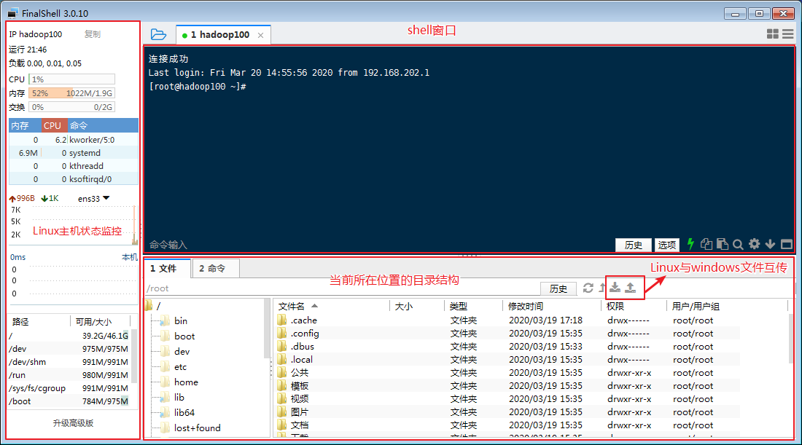
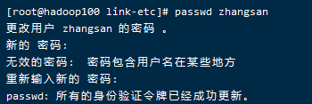

# 网络配置

## 物理机与虚拟机是如何连通的?

是否正常连通可以ping一下(NET模式)


## 自动配置ip(dhcp)的优劣

好处:方便

坏处:没有办法确定每次ip,保证其配置的都能够保持一致,所以为了稳定,我们要将之静态化

## Linux网络静态化

vim /etc/sysconfig/network-scripts/ifcfg-ens33 


重启下就好了


ps.

网关 ： 网络的进出口

etc,Editable Text Configuration是系统文件配置目录，例如人员的账号密码文件、各种服务的起始文件等。一般来说，这个目录下的各文件属性是可以让一般用户用户查阅的，但是只有root有权利修改。

## Linux通过主机名映射ip

1.设置主机名:vi /etc/hostname(查看直接输入hostname)


2.更改虚拟机host

vim /etc/hosts:


为了以后创造集群方便,我们多创建几个上去


之后就直接通过主机名进行访问了,可以测试是否能够ping通

3.另外可以改主机host文件:C:\Windows\System32\drivers\etc


如此主机连接虚拟机的时候直接键入hadoop100即可


# 服务Service

service( service 服务名 start | stop | restart | status)

查看Service服务的方法：/etc/init.d/服务名 ,

CentOS6采用较多.但在CentOS7中发现只有两个服务保留在service里


# 服务管理systemctl

基本语法

systemctl start | stop | restart | status   服务名

经验技巧

查看系统里的服务方法：/usr/lib/systemd/system  

列出服务目录里的防火墙服务:systemctl list-unit-files | grep firewalld


查看防火墙服务的状态:systemctl status firewalld

停止防火墙服务:systemctl stop firewalld

启动防火墙服务:systemctl start firewalld

重启防火墙服务:systemctl restart firewalld 


设置自启状态


# 自启级别配置chkconfig

chkconfig  :查看所有服务器服务自启配置,即开机启动项

chkconfig 服务名 off :关掉指定服务的自动启动

chkconfig 服务名 on :开启指定服务的自动启动

chkconfig 服务名 --list :查看服务开机启动状态

vi /etc/inittab:查看默认级别

## 1.关闭某自启级别

开启/关闭iptables(防火墙)服务的自动启动:chkconfig iptables on/off

暴力关闭自启级别:chkconfig network off

针对某个自启级别去开启/关闭:chkconfig -- level 5 network on/off


## 3.常用自启级别


之后只保留了3和5


查看自启级别:systemctl get-default


更改自启级别(命令行级别):systemctl set-default TARGET.tar 


# Linux关闭防火墙

临时关掉防火墙:service iptables stop/systemctl stop firewalld

关掉自启项目:chkconfig iptables off/systemctl disable firewalld.service

前者是CentOS6里的语句,后者是CentOS7里的.6里防火墙叫iptables,后7里改叫firewalld

# 关机重启命令

在linux领域内大多用在服务器上，很少遇到关机的操作。毕竟服务器上跑一个服务是永无止境的，除非特殊情况下，不得已才会关机。

正确的关机流程为：sync > shutdown > reboot > halt

\1. 基本语法

（1）sync          （功能描述：将数据由内存同步到硬盘中）

**（2）halt/shutdown -h now 和 poweroff           （功能描述：关闭系统，前者关系统,后后者关系统+电源）**

（1）sync          （功能描述：将数据由内存同步到硬盘中）

**（2）halt           （功能描述：关闭系统，等同于shutdown -h now 和 poweroff(关机+关电源 )）**

**（3）reboot/ shutdown -r now         （功能描述：就是重启，等同于）**

（4）shutdown [选项] 时间:XX秒后关机

表5-1

| 选项 | 功能          |
| ---- | ------------- |
| -h   | -h=halt关机   |
| -r   | -r=reboot重启 |

表5-2

| 参数 | 功能                               |
| ---- | ---------------------------------- |
| now  | 立刻关机                           |
| 时间 | 等待多久后关机（时间单位是分钟）。 |

# 远程登录

## 连接

1.按图点击，创建连接


2.设置连接属性


3. 双击添加的连接即可


4.第一次连接需要 点击接受并保存.


## 上传文件



选择


全部会话(多个同时发送)


# 常用基本命令***

## 帮助命令

 man pwd/help pwd:查看帮助信息

## 快捷键

- 清空命令:ctrl + w 
- 清屏快捷键: ctrl + l clear 
- ctrl + c : 停止进程  
- 彻底清屏：reset  
- ctrl + q:退出(vi里使用,但这个不推荐)
- ctrl +alt: linux和Windows之间切换
- 上下键:查找执行过的命令  
- 善于用tab键  提示(更重要的是可以防止敲错)  

## 文件目录类*

### pwd

pwd:显示当前工作目录的绝对路径


### ls/ll:显示目录

ls:list 列出目录内容

 选项说明

| 选项    | 功能                                                         |
| ------- | ------------------------------------------------------------ |
| list -a | 全部的文件，连同隐藏档( 开头为 . 的文件) 一起列出来(常用)    |
| list -l | 详情,等同于ll长数据串列出，包含文件的属性与权限等等数据；(常用) |

ll第一位代表文件类型:-文件 d 目录 l软连接


### cd 切换目录

cd:Change Directory切换路径

| 参数        | 功能                                       |
| ----------- | ------------------------------------------ |
| cd 绝对路径 | 切换路径                                   |
| cd相对路径  | 切换路径                                   |
| cd ~或者cd  | 回到当前用户的家目录                       |
| cd -        | 回到上一次所在目录                         |
| cd ..       | 回到当前目录的上一级目录(跳两层:cd ../../) |
| cd -P       | 跳转到实际物理路径，而非快捷方式路径       |

cd / :根目录

cd . :当前目录


### mkdir 创建目录

Make directory

mkdir: 建立目录

选项说明

| 选项     | 功能         |
| -------- | ------------ |
| mkdir -p | 创建多层目录 |


### rmdir:删除一个空的目录

Remove directory 

rmdir:删除空目录


### touch:创建空文件

基本语法:touch 文件名称

linux不会以后缀名区分文件类型,文件后缀可写可不写,目录也可以带后缀

工具可帮我们区分后缀


### cp:复制文件或目录

1．基本语法

cp [选项] source dest             （功能描述：复制source文件到dest）

(source:源文件,dest:目标文件)

2．选项说明

| 选项  | 功能               |
| ----- | ------------------ |
| cp -r | 递归复制整个文件夹 |

强制覆盖:前面加\


\cp或cp -r:强制复制文件


### mv 移动文件与目录或重命名

​    （1）mv oldNameFile newNameFile  （功能描述：重命名）

​    （2）mv /temp/movefile /targetFolder （功能描述：移动文件）


重命名


### rm 移除文件或目录

1．基本语法

rm [选项] deleteFile          （功能描述：递归删除目录中所有内容）

2．选项说明

表7-8 选项说明

| 选项  | 功能                                     |
| ----- | ---------------------------------------- |
| rm -r | 递归删除目录中所有内容                   |
| rm -f | 强制执行删除操作，而不提示用于进行确认。 |
| rm -v | 显示指令的详细执行过程                   |


无论文件目录下有多少东西,一次性全部给删了


### cat 查看文件内容

查看文件内容，从第一行开始显示。

1．基本语法

​    cat [选项] :要查看的文件

2．选项说明

| 选项   | 功能描述                     |
| ------ | ---------------------------- |
| cat -n | 显示所有行的行号，包括空行。 |

3．经验技巧

一般查看比较小的文件，一屏幕能显示全的。


### more 文件内容分屏查看器

more指令是:一个基于VI编辑器的文本过滤器，它以全屏幕的方式按页显示文本文件的内容。more指令中内置了若干快捷键，详见操作说明。

1．基本语法

​    more 要查看的文件

2．操作说明

表7-10 操作说明

| 操作                 | 功能说明                                 |
| -------------------- | ---------------------------------------- |
| (more)空白键 (space) | 代表向下翻一页；                         |
| (more)Enter          | 代表向下翻『一行』；                     |
| (more)q              | 代表立刻离开 more ，不再显示该文件内容。 |
| (more)Ctrl+F         | 向下滚动一屏                             |
| (more)Ctrl+B         | 返回上一屏                               |
| (more)=              | 输出当前行的行号                         |
| (more):f             | 输出文件名和当前行的行号                 |

###  less 分屏显示文件内容

​    less指令:用来分屏查看文件内容，它的功能与more指令类似，但是比more指令更加强大，支持各种显示终端。less指令在显示文件内容时，并不是一次将整个文件加载之后才显示，而是根据显示需要加载内容，对于显示大型文件具有较高的效率。

1．基本语法

​    less 要查看的文件

2．操作说明

表7-11 操作说明

| 操作             | 功能说明                                           |
| ---------------- | -------------------------------------------------- |
| (less)空白键     | 向下翻动一页；                                     |
| (less)[pagedown] | 向下翻动一页                                       |
| (less)[pageup]   | 向上翻动一页；                                     |
| (less)/字串      | 向下搜寻『字串』的功能；n：向下查找；N：向上查找； |
| (less)?字串      | 向上搜寻『字串』的功能；n：向上查找；N：向下查找； |
| (less)q          | 离开 less 这个程序；                               |

\3.   经验技巧

用SecureCRT时[pagedown]和[pageup]可能会出现无法识别的问题。

没有遗留,比较适合使用

### head 显示文件头部内容

head:用于显示文件的开头部分内容，默认情况下head指令显示文件的前10行内容。

\1.   基本语法

head 文件      （功能描述：查看文件头10行内容）

head -n 5 文件   （功能描述：查看文件头5行内容，5可以是任意行数）

2．选项说明

表7-12

| 选项          | 功能                   |
| ------------- | ---------------------- |
| head -n<行数> | 指定显示头部内容的行数 |


### tail 输出文件尾部内容

tail:用于输出文件中尾部的内容，默认情况下tail指令显示文件的后10行内容。可用来查看日志文件

\1.  基本语法

（1）tail 文件          （功能描述：查看文件尾部10行内容）

（2）tail -n 5 文件    （功能描述：查看文件尾部5行内容，5可以是任意行数）

（3）tail -f 文件      （功能描述：实时追踪该文档的所有更新）

2． 选项说明

| 选项          | 功能                                 |
| ------------- | ------------------------------------ |
| tail -n<行数> | 输出文件尾部n行内容                  |
| tail -f       | 显示文件最新追加的内容，监视文件变化 |


### echo

显示

echo:输出内容到控制台

\1.   基本语法

​       echo [选项] [输出内容]

'echo 输出内容 >" :追加

''echo 输出内容 >>'' :覆盖

选项：

echo  -e： 支持反斜线控制的字符转换

| 控制字符 | 作用                |
| -------- | ------------------- |
| (echo)\  | 输出\本身           |
| (echo)\n | 换行符              |
| (echo)\t | 制表符，也就是Tab键 |

> 
>
> 

###  > 输出重定向和 >> 追加

???有个>> ls的内容

1．基本语法

（1）ls -l > 文件       （功能描述：列表的内容写入文件a.txt中（**覆盖写**））

（2）ls -al >> 文件     （功能描述：列表的内容**追加**到文件aa.txt的末尾）

（3）cat 文件1 > 文件2  （功能描述：将文件1的内容覆盖到文件2）

（4）echo “内容” >> 文件（功能描述：将内容追加到文件末尾)

### ln 软链接

软链接:也称为符号链接，类似于windows里的快捷方式，有自己的数据块，主要存放了链接其他文件的路径。

1．基本语法

ln -s [原文件或目录] [软链接名]    （功能描述：给原文件创建一个软链接）

2．经验技巧

删除软链接： rm -rf 软链接名，而不是rm -rf 软链接名/

查询：通过ll就可以查看，列表属性第1位是l，尾部会有位置指向。


软链接pwd仍然在当前位置,


### history 查看已经执行过历史命令

1．基本语法

​    history                    （功能描述：查看已经执行过历史命令）


记录下当前linux做过的操作

## 时间日期类

1．基本语法

date [OPTION]... [+FORMAT]

2．选项说明

表7-14

| 选项                 | 功能                                           |
| -------------------- | ---------------------------------------------- |
| date -d <时间字符串> | 显示指定的“时间字符串”表示的时间，而非当前时间 |
| date -s<日期时间>    | 设置系统日期时间                               |

3．参数说明

表7-15

| 参数            | 功能                         |
| --------------- | ---------------------------- |
| <+日期时间格式> | 指定显示时使用的日期时间格式 |

### date 显示当前时间

1．基本语法

​    （1）date                            （功能描述：显示当前时间）

​    （2）date +%Y                        （功能描述：显示当前年份）

（3）date +%m                        （功能描述：显示当前月份）

（4）date +%d                        （功能描述：显示当前是哪一天）

​    （5）date "+%Y-%m-%d %H:%M:%S"       （功能描述：显示年月日时分秒）

当前时间


年月日设置


### date 显示非当前时间

1．基本语法

（1）date -d '1 days ago'          （功能描述：显示前一天时间）

（2）date -d '-1 days ago'          （功能描述：显示明天时间）


### date 设置系统时间

1．基本语法

​    date -s 字符串时间

2．案例实操

​    （1）设置系统当前时间: date -s "2017-06-19 20:52:18"


### cal 查看日历

1．基本语法

cal [选项]           （功能描述：不加选项，显示本月日历）

2．选项说明

表7-16

| 选项           | 功能             |
| -------------- | ---------------- |
| cal 具体某一年 | 显示这一年的日历 |


## 用户管理命令

### useradd 添加新用户

基本语法

​    useradd 用户名          （功能描述：添加新用户）

​    useradd -g 组名 用户名   （功能描述：添加新用户到某个组）

加用户看它存在不


查看用户,cd /home目录


### 

### passwd 设置用户密码

基本语法

​    passwd 用户名   （功能描述：设置用户密码）



### id 查看用户是否存在

基本语法

​    id 用户名

查看用户是否存在id tangseng

### cat /etc/passwd 查看创建了哪些用户

基本语法

[root@hadoop101 ~]# cat /etc/passwd

cat etc:查看存储的用户信息


cat passwd:存储的密码


cat group:用户组


### 

### su 切换用户

su: swith user 切换用户

加了横杠 会加载用户的环境变量，不加横杠，不会加载环境变量

su 用户名称  （功能描述：切换用户，只能获得用户的执行权限，不能获得环境变量）

su - 用户名称    （功能描述：切换到用户并获得该用户的环境变量及执行权限）

案例实操

```shell
（1）切换用户

[root@hadoop101 ~]#su tangseng

[root@hadoop101 ~]#echo $PATH

/usr/lib64/qt-3.3/bin:/usr/local/sbin:/usr/local/bin:/sbin:/bin:/usr/sbin:/usr/bin:/root/bin

[root@hadoop101 ~]#exit

[root@hadoop101 ~]#su - tangseng

[root@hadoop101 ~]#echo $PATH

/usr/lib64/qt-3.3/bin:/usr/local/bin:/bin:/usr/bin:/usr/local/sbin:/usr/sbin:/sbin:/home/tangseng/bin
```


没加-没加载该用户的环境变量su

大转小不需要密码,小转大需要


### userdel 删除用户

基本语法

（1）userdel 用户名     （功能描述：删除用户但保存用户主目录）

（2）userdel -r 用户名    （功能描述：删除用户的同时，删除与用户相关的所有文件。）

### who 查看登录用户信息

1．基本语法

​    （1）whoami        （功能描述：显示自身用户名称）

（2）who am i       （功能描述：显示登录用户的用户名）


### sudo 设置普通用户具有root权限

普通用户增删改查在自己home可以,但是出了家最多只能读,其他的没有任何权限


1．添加atguigu用户，并对其设置密码。

[root@hadoop101 ~]#useradd atguigu

[root@hadoop101 ~]#passwd atguigu

2．修改配置文件

[root@hadoop101 ~]#vi /etc/sudoers

修改 /etc/sudoers 文件，找到下面一行(91行)，在root下面添加一行，如下所示：

\## Allow root to run any commands anywhere

root  ALL=(ALL)   ALL

atguigu  ALL=(ALL)   ALL

或者配置成采用sudo命令时，不需要输入密码

\## Allow root to run any commands anywhere

root    ALL=(ALL)   ALL

atguigu  ALL=(ALL)   NOPASSWD:ALL

修改完毕，现在可以用atguigu帐号登录，然后用命令 sudo ，即可获得root权限进行操作。


不需要设置密码

