y士

# Linux虚拟网卡配置方法小结

查看一下windows主机：控制面板->本地服务->VMware相关服务有没有启动

## 配置虚拟网卡:

vmware会帮我们生成虚拟网卡,如果没有生成把防火墙都关了,点还原可重新生成虚拟网卡

或者卸载vmware,通过cclean清理注册信息重新安装

## 配置网段

## ping测试

# 常用命令

## 1.用户组管理命令

每个用户都有一个用户组，系统可以对一个用户组中的所有用户进行集中管理。不同Linux 系统对用户组的规定有所不同，如Linux下的用户属于与它同名的用户组，这个用户组在创建用户时同时创建。

用户组的管理涉及用户组的添加、删除和修改。组的增加、删除和修改实际上就是对/etc/group文件的更新。

uid主id,gid,组id,linux会默认跟你创建一个和你名称相同的组

组信息:etc/group

### usermod 修改用户

1．基本语法

usermod -g 用户组 用户名

2．选项说明

表7-18

| 选项 | 功能                                                  |
| ---- | ----------------------------------------------------- |
| -g   | 修改用户的初始登录组，给定的组必须存在。默认组id是1。 |

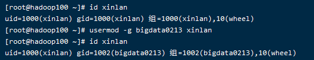

### 5.1 groupadd 新增组

1．基本语法

groupadd 组名

2．案例实操

​    （1）添加一个xitianqujing组

[root@hadoop101 opt]#groupadd xitianqujing

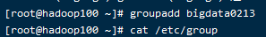

分组管理

### 5.2 groupdel 删除组

1．基本语法

groupdel 组名

### 5.3 groupmod 修改组

1．基本语法

groupmod -n 新组名 老组名

2．选项说明

表7-19

| 选项                | 功能描述           |
| ------------------- | ------------------ |
| groupmod -n<新组名> | 指定工作组的新组名 |

3．案例实操

​    （1）修改atguigu组名称为atguigu1

[root@hadoop101 ~]#groupadd xitianqujing

[root@hadoop101 ~]# groupmod -n xitian xitianqujing

### cat /etc/group 查看创建了哪些组

1．基本操作

[root@hadoop101 atguigu]# cat /etc/group

## 2.文件权限类

### 2.1文件属性

Linux系统是一种典型的多用户系统，不同的用户处于不同的地位，拥有不同的权限。为了保护系统的安全性，Linux系统对不同的用户访问同一文件（包括目录文件）的权限做了不同的规定。在Linux中我们可以使用ll或者ls -l命令来显示一个文件的属性以及文件所属的用户和组。

对一个文件,三种权限:所属用户/组内用户/除了组内用户的其他用户

### ll列表含义详解

1．从左到右的10个字符表示，如图7-1所示：

图 7-1 文件属性

如果没有权限，就会出现减号[ - ]而已。从左至右用0-9这些数字来表示:

（1）0首位表示类型

在Linux中第一个字符代表这个文件是目录、文件或链接文件等等

\- 代表文件

 d 代表目录

 l 链接文档(link file)；

（2）第1-3位确定属主（该文件的所有者）拥有该文件的权限。---User

（3）第4-6位确定属组（所有者的同组用户）拥有该文件的权限，---Group

（4）第7-9位确定其他用户拥有该文件的权限 ---Other

2．rxw作用文件和目录的不同解释

（1）作用到文件：

[ r ]代表可读(read): 可以读取，查看

[ w ]代表可写(write): 可以修改，但是不代表可以删除该文件，删除一个文件的前提条件是对该文件所在的目录有写权限，才能删除该文件.

[ x ]代表可执行(execute):可以被系统执行

（2）作用到目录：

[ r ]代表可读(read): 可以读取，ls查看目录内容

[ w ]代表可写(write): 可以修改，目录内创建+删除+重命名目录

[ x ]代表可执行(execute):可以进入该目录(不进入目录不可以删除创建)

3．案例实操

[root@hadoop101 ~]# ll

总用量 104

-rw-------. 1 root root 1248 1月  8 17:36 anaconda-ks.cfg

drwxr-xr-x. 2 root root 4096 1月 12 14:02 dssz

lrwxrwxrwx. 1 root root  20 1月 12 14:32 houzi -> xiyou/dssz/houge.tx

文件基本属性介绍，如图7-2所示：

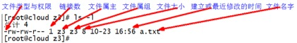

文件实际大小统计

图7-2 文件基本属性介绍

（1）如果查看到是文件：链接数指的是硬链接个数。创建硬链接方法

ln [原文件] [目标文件]

[root@hadoop101 ~]# ln xiyou/dssz/houge.txt ./hg.txt

（2）如果查看的是文件夹：链接数指的是子文件夹个数。

[root@hadoop101 ~]# ls -al xiyou/

总用量 16

drwxr-xr-x. 4 root root 4096 1月 12 14:00 .

dr-xr-x---. 29 root root 4096 1月 12 14:32 ..

drwxr-xr-x. 2 root root 4096 1月 12 14:30 dssz

drwxr-xr-x. 2 root root 4096 1月 12 14:04 mingjie

### 2 chmod 改变权限

1．基本语法

如图7-3所示

图7-3 基本语法

​    第一种方式变更权限

​       chmod [{ugoa}{+-=}{rwx}] 文件或目录

第二种方式变更权限

​    chmod [mode=421 ] [文件或目录]

2．经验技巧

​    u:所有者 g:所有组 o:其他人 a:所有人(u、g、o的总和)

r=4 w=2 x=1    rwx=4+2+1=7

chmod 777

3．案例实操

​    （1）修改文件使其所属主用户具有执行权限

[root@hadoop101 ~]# cp xiyou/dssz/houge.txt ./

[root@hadoop101 ~]# chmod u+x houge.txt

（2）修改文件使其所属组用户具有执行权限

[root@hadoop101 ~]# chmod g+x houge.txt

（3）修改文件所属主用户执行权限,并使其他用户具有执行权限

[root@hadoop101 ~]# chmod u-x,o+x houge.txt

（4）采用数字的方式，设置文件所有者、所属组、其他用户都具有可读可写可执行权限。

[root@hadoop101 ~]# chmod 777 houge.txt

（5）修改整个文件夹里面的所有文件的所有者、所属组、其他用户都具有可读可写可执行权限。

[root@hadoop101 ~]# chmod -R 777 xiyou/

组外级别$$$

组内级别

其他用户看ROOT文件:7-9,只能读不能写

自己更改自己的个人用户权限

自己改变组自己组的权限

自己改变其他的权限

(root在那里赋权限,然后全给取消了)

小结:自己可以进行权限的操作,不能改变所属的主和组

- g=所属组的其它用户所具备的权限

- 小结:u(1-3)当前用户自己可以做的操作；g(4-6)当前组其他用户可以做的操作；其他组(7-9)的用户可以对这个文件做的操作

### 3 chown 改变所有者

1．基本语法

chown [选项] [最终用户] [文件或目录]       （功能描述：改变文件或者目录的所有者）

2．选项说明

表7-20

| 选项 | 功能     |
| ---- | -------- |
| -R   | 递归操作 |

自己不能改(哪怕是自己创建的)

3．案例实操

​    （1）修改文件所有者

[root@hadoop101 ~]# chown atguigu houge.txt

[root@hadoop101 ~]# ls -al

-rwxrwxrwx. 1 atguigu root 551 5月 23 13:02 houge.txt

（2）递归改变文件所有者和所有组

[root@hadoop101 xiyou]# ll

drwxrwxrwx. 2 root root 4096 9月  3 21:20 xiyou

[root@hadoop101 xiyou]# chown -R atguigu:atguigu xiyou/

[root@hadoop101 xiyou]# ll

drwxrwxrwx. 2 atguigu atguigu 4096 9月  3 21:20 xiyou

### 6.4 chgrp 改变所属组

1．基本语法

​    chgrp [最终用户组] [文件或目录]    （功能描述：改变文件或者目录的所属组）

2．案例实操

​    （1）修改文件的所属组

[root@hadoop101 ~]# chgrp root houge.txt

[root@hadoop101 ~]# ls -al

-rwxrwxrwx. 1 atguigu root 551 5月 23 13:02 houge.txt

## 搜索查找类

### 1 find 查找文件或者目录

find指令将从指定目录向下递归地遍历其各个子目录，将满足条件的文件显示在终端。

1．基本语法

​    find [搜索范围] [选项]

2．选项说明

表7-21

| 选项            | 功能                                                         |
| --------------- | ------------------------------------------------------------ |
| -name<查询方式> | 按照指定的文件名查找模式查找文件                             |
| -user<用户名>   | 查找属于指定用户名所有文件                                   |
| -size<文件大小> | 按照指定的文件大小查找文件,单位为:**b** —— 块（512字节）**c** —— 字节**w** —— 字（2字节）**k** —— 千字节**M** —— 兆字节**G** —— 吉字节 |

3．案例实操$$$

（1）按文件名：根据名称查找/目录下的filename.txt文件。

[root@hadoop101 ~]# find xiyou/ -name *.txt

（2）按拥有者：查找/opt目录下，用户名称为-user的文件

[root@hadoop101 ~]# find xiyou/ -user atguigu

​    （3）按文件大小：在/home目录下查找大于200m的文件（+n 大于 -n小于  n等于）

[root@hadoop101 ~]find /home -size +204800

大于10kb的

### 2 locate快速定位文件路径

locate指令利用事先建立的系统中所有文件名称及路径的locate数据库实现快速定位给定的文件。Locate指令无需遍历整个文件系统，查询速度较快。为了保证查询结果的准确度，管理员必须定期更新locate时刻。

根目录文件多,找起来就慢,这是通过索引来找的

1．基本语法

​    locate 搜索文件

2．经验技巧

​    由于locate指令基于数据库进行查询，所以第一次运行前，必须使用updatedb指令创建locate数据库。

### 3 grep 过滤查找及“|”管道符

管道符，“|”，表示将前一个命令的处理结果输出传递给后面的命令处理

1．基本语法

grep 选项 查找内容 源文件

2．选项说明

表7-22

| 选项    | 功能               |
| ------- | ------------------ |
| grep -n | 显示匹配行及行号。 |

3．案例实操

​    （1）查找某文件在第几行

[root@hadoop101 ~]# ls | grep -n test

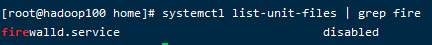

过滤cfg

## 8 压缩和解压类

### 8.1 gzip/gunzip 压缩

1．基本语法

gzip 文件       （功能描述：压缩文件，只能将文件压缩为*.gz文件,只压缩,不打包,后只接一个文件）

gunzip 文件.gz   （功能描述：解压缩文件命令）

2．经验技巧

（1）只能压缩文件不能压缩目录

（2）不保留原来的文件

3．案例实操

（1）gzip压缩

[root@hadoop101 ~]# ls

test.java

[root@hadoop101 ~]# gzip houge.txt

[root@hadoop101 ~]# ls

houge.txt.gz

（2）gunzip解压缩文件

[root@hadoop101 ~]# gunzip houge.txt.gz

[root@hadoop101 ~]# ls

houge.txt

### 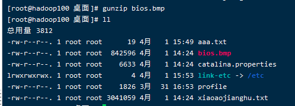

### 8.2 zip/unzip 压缩

1．基本语法

zip [选项] XXX.zip 将要压缩的内容      （功能描述：压缩文件和目录的命令）

unzip [选项] XXX.zip                   （功能描述：解压缩文件）

2．选项说明

表7-23

| zip选项 | 功能     |
| ------- | -------- |
| -r      | 压缩目录 |

表7-24

| unzip选项 | 功能                     |
| --------- | ------------------------ |
| -d<目录>  | 指定解压后文件的存放目录 |

3．经验技巧

zip 压缩命令在window/linux都通用，可以压缩目录且保留源文件。

4．案例实操

（1）压缩 1.txt 和2.txt，压缩后的名称为mypackage.zip

[root@hadoop101 opt]# touch bailongma.txt

[root@hadoop101 ~]# zip mypackage.zip houge.txt bailongma.txt

 adding: houge.txt (stored 0%)

 adding: bailongma.txt (stored 0%)

[root@hadoop101 opt]# ls

houge.txt bailongma.txt houma.zip

（2）解压 mypackage.zip

[root@hadoop101 ~]# unzip mypackage.zip

Archive: houma.zip

 extracting: houge.txt       

 extracting: bailongma.txt   

[root@hadoop101 ~]# ls

houge.txt bailongma.txt houma.zip

（3）解压mypackage.zip到指定目录-d

[root@hadoop101 ~]# unzip houma.zip -d /opt

[root@hadoop101 ~]# ls /opt/

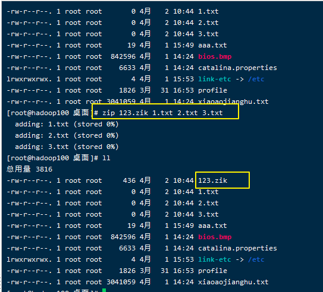

解压$$$

### 8.3 tar 打包

1．基本语法

tar [选项] XXX.tar.gz 将要打包进去的内容       （功能描述：打包目录，压缩后的文件格式.tar.gz）

2．选项说明

表7-25

| 选项 | 功能               |
| ---- | ------------------ |
| -c   | 产生.tar打包文件   |
| -v   | 显示详细信息       |
| -f   | 指定压缩后的文件名 |
| -z   | 打包同时压缩       |
| -x   | 解包.tar文件       |

注:c和x互斥

3．案例实操

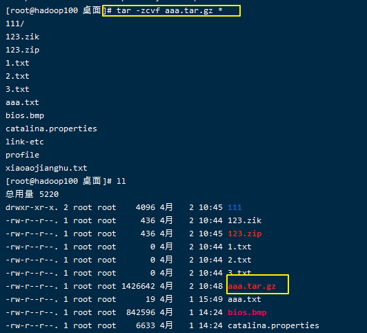

（1）压缩多个文件

[root@hadoop101 opt]# tar -zcvf houma.tar.gz houge.txt bailongma.txt

houge.txt

bailongma.txt

[root@hadoop101 opt]# ls

houma.tar.gz houge.txt bailongma.txt

（2）压缩目录

[root@hadoop101 ~]# tar -zcvf xiyou.tar.gz xiyou/

xiyou/

xiyou/mingjie/

xiyou/dssz/

xiyou/dssz/houge.txt

（3）解压到当前目录

[root@hadoop101 ~]# tar -zxvf houma.tar.gz

（4）解压到指定目录

[root@hadoop101 ~]# tar -zxvf xiyou.tar.gz -C /opt

[root@hadoop101 ~]# ll /opt/

## 磁盘分区类

### 1 df 查看磁盘空间使用情况

df: disk free 空余硬盘

1．基本语法

​    df 选项 （功能描述：列出文件系统的整体磁盘使用量，检查文件系统的磁盘空间占用情况）

2．选项说明

表7-26

| 选项 | 功能                                                     |
| ---- | -------------------------------------------------------- |
| -h   | 以人们较易阅读的 GBytes, MBytes, KBytes 等格式自行显示； |

3．案例实操

​    （1）查看磁盘使用情况

[root@hadoop101 ~]# df -h

Filesystem   Size Used Avail Use% Mounted on

/dev/sda2    15G 3.5G  11G 26% /

tmpfs      939M 224K 939M  1% /dev/shm

/dev/sda1    190M  39M 142M 22% /boot

### 

### 9.2 fdisk 查看分区

1．基本语法

​    fdisk -l         （功能描述：查看磁盘分区详情）

2．选项说明

表7-27

| 选项 | 功能                   |
| ---- | ---------------------- |
| -l   | 显示所有硬盘的分区列表 |

3．经验技巧

该命令必须在root用户下才能使用

4．功能说明

​    （1）Linux分区

Device：分区序列

Boot：引导

Start：从X磁柱开始

End：到Y磁柱结束

Blocks：容量

Id：分区类型ID

System：分区类型

（2）Win7分区，如图7-4所示

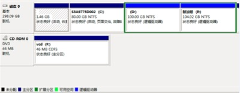

图 7-4 Win7分区

5．案例实操

​    （1）查看系统分区情况

[root@hadoop101 /]# fdisk -l

Disk /dev/sda: 21.5 GB, 21474836480 bytes

255 heads, 63 sectors/track, 2610 cylinders

Units = cylinders of 16065 * 512 = 8225280 bytes

Sector size (logical/physical): 512 bytes / 512 bytes

I/O size (minimum/optimal): 512 bytes / 512 bytes

Disk identifier: 0x0005e654

  Device Boot   Start     End   Blocks  Id System

/dev/sda1  *      1     26   204800  83 Linux

Partition 1 does not end on cylinder boundary.

/dev/sda2       26    1332  10485760  83 Linux

/dev/sda3      1332    1593   2097152  82 Linux swap / Solaris

### 9.3 lsblk 查看设备挂载情况

1．基本语法

​    lsblk       （功能描述：查看设备挂载情况）

2．选项说明

表7-28

| 选项 | 功能                                     |
| ---- | ---------------------------------------- |
| -f   | 查看详细的设备挂载情况，显示文件系统信息 |

  

 

### 9.4 mount/umount 挂载/卸载

对于Linux用户来讲，不论有几个分区，分别分给哪一个目录使用，它总归就是一个根目录、一个独立且唯一的文件结构。

Linux中每个分区都是用来组成整个文件系统的一部分，它在用一种叫做“挂载”的处理方法，它整个文件系统中包含了一整套的文件和目录，并将一个分区和一个目录联系起来，要载入的那个分区将使它的存储空间在这个目录下获得。

1．挂载前准备（必须要有光盘或者已经连接镜像文件），如图7-5， 7-6所示

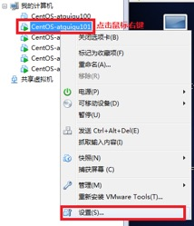

图 7-5

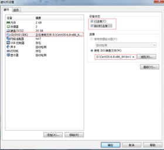

图7-6 挂载镜像文件

2．基本语法

mount [-t vfstype] [-o options] device dir   （功能描述：挂载设备）

umount 设备文件名或挂载点          （功能描述：卸载设备）

3．参数说明

表7-29

| 参数       | 功能                                                         |
| ---------- | ------------------------------------------------------------ |
| -t vfstype | 指定文件系统的类型，通常不必指定。mount 会自动选择正确的类型。常用类型有：光盘或光盘镜像：iso9660DOS fat16文件系统：msdos[Windows](http://blog.csdn.net/hancunai0017/article/details/6995284) 9x fat32文件系统：vfatWindows NT ntfs文件系统：ntfsMount Windows文件[网络](http://blog.csdn.net/hancunai0017/article/details/6995284)共享：smbfs[UNIX](http://blog.csdn.net/hancunai0017/article/details/6995284)(LINUX) 文件网络共享：nfs |
| -o options | 主要用来描述设备或档案的挂接方式。常用的参数有：loop：用来把一个文件当成硬盘分区挂接上系统ro：采用只读方式挂接设备rw：采用读写方式挂接设备　 iocharset：指定访问文件系统所用字符集 |
| device     | 要挂接(mount)的设备                                          |
| dir        | 设备在系统上的挂接点(mount point)                            |

4．案例实操

（1）挂载光盘镜像文件

[root@hadoop101 ~]# mkdir /mnt/cdrom/        建立挂载点

[root@hadoop101 ~]# mount -t iso9660 /dev/cdrom /mnt/cdrom/ 设备/dev/cdrom挂载到 挂载点 ： /mnt/cdrom中

[root@hadoop101 ~]# ll /mnt/cdrom/

（2）卸载光盘镜像文件

[root@hadoop101 ~]# umount /mnt/cdrom

5．设置开机自动挂载

[root@hadoop101 ~]# vi /etc/fstab

添加红框中内容，保存退出。

如图7-7所示

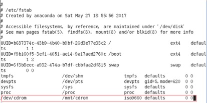

图7-7 设置开机自动挂载

## 10 进程线程类

进程是正在执行的一个程序或命令，每一个进程都是一个运行的实体，都有自己的地址空间，并占用一定的系统资源。

### 10.1 ps 查看当前系统进程状态

ps:process status 进程状态

1．基本语法

​    ps -aux | grep xxx     （功能描述：查看系统中所有进程）

​    ps -ef | grep xxx      （功能描述：可以查看子父进程之间的关系）

2．选项说明

表7-30

| 选项 | 功能                   |
| ---- | ---------------------- |
| -a   | 选择所有进程           |
| -u   | 显示所有用户的所有进程 |
| -x   | 显示没有终端的进程     |

3．功能说明

​    （1）ps -aux显示信息说明

​    USER：该进程是由哪个用户产生的

​    PID：进程的ID号

%CPU：该进程占用CPU资源的百分比，占用越高，进程越耗费资源；

%MEM：该进程占用物理内存的百分比，占用越高，进程越耗费资源；

VSZ：该进程占用虚拟内存的大小，单位KB；

RSS：该进程占用实际物理内存的大小，单位KB；

TTY：该进程是在哪个终端中运行的。其中tty1-tty7代表本地控制台终端，tty1-tty6是本地的字符界面终端，tty7是图形终端。pts/0-255代表虚拟终端。

STAT：进程状态。常见的状态有：R：运行、S：睡眠、T：停止状态、s：包含子进程、+：位于后台

START：该进程的启动时间

TIME：该进程占用CPU的运算时间，注意不是系统时间

COMMAND：产生此进程的命令名

（2）ps -ef显示信息说明

UID：用户ID

PID：进程ID

PPID：父进程ID

C：CPU用于计算执行优先级的因子。数值越大，表明进程是CPU密集型运算，执行优先级会降低；数值越小，表明进程是I/O密集型运算，执行优先级会提高

STIME：进程启动的时间

TTY：完整的终端名称

TIME：CPU时间

CMD：启动进程所用的命令和参数

4．经验技巧

​    如果想查看进程的CPU占用率和内存占用率，可以使用aux;

如果想查看进程的父进程ID可以使用ef;

5．案例实操

[root@hadoop101 datas]# ps aux

 

pid:进程号

图1-161 查看进程的CPU占用率和内存占用率

[root@hadoop101 datas]# ps -ef

 

PPID:当前进程的父进程ID

一般会配合grep使用

如何杀死一只火狐

等同于点×,较温和

### 10.2 kill 终止进程

1．基本语法

​    kill [选项] 进程号      （功能描述：通过进程号杀死进程）

​    killall 进程名称         （功能描述：通过进程名称杀死进程，也支持通配符，这在系统因负载过大而变得很慢时很有用） 

2．选项说明

表7-31

| 选项 | 功能                 |
| ---- | -------------------- |
| -9   | 表示强迫进程立即停止 |

3．案例实操

​    （1）杀死浏览器进程

[root@hadoop101 桌面]# kill -9 5102

​    （2）通过进程名称杀死进程

[root@hadoop101 桌面]# killall firefox

总算终止成功了

### 10.3 pstree 查看进程树

1．基本语法

​    pstree [选项]

2．选项说明

表7-32

| 选项 | 功能               |
| ---- | ------------------ |
| -p   | 显示进程的PID      |
| -u   | 显示进程的所属用户 |

 

进程号

3．案例实操

​    （1）显示进程pid

[root@hadoop101 datas]# pstree -p

​    （2）显示进程所属用户

[root@hadoop101 datas]# pstree -u

### 10.4 top 查看系统健康状态

1．基本命令

​    top [选项]   

2．选项说明

表7-33

| 选项    | 功能                                                         |
| ------- | ------------------------------------------------------------ |
| -d 秒数 | 指定top命令每隔几秒更新。默认是3秒在top命令的交互模式当中可以执行的命令： |
| -i      | 使top不显示任何闲置或者僵死进程。                            |
| -p      | 通过指定监控进程ID来仅仅监控某个进程的状态。                 |

3．操作说明

表7-34

| 操作 | 功能                          |
| ---- | ----------------------------- |
| P    | 以CPU使用率排序，默认就是此项 |
| M    | 以内存的使用率排序            |
| N    | 以PID排序                     |
| q    | 退出top                       |

4．查询结果字段解释

第一行信息为任务队列信息

表7-35

| 内容                           | 说明                                                         |
| ------------------------------ | ------------------------------------------------------------ |
| 12:26:46                       | 系统当前时间                                                 |
| up 1 day, 13:32                | 系统的运行时间，本机已经运行1天13小时32分钟                  |
| 2 users                        | 当前登录了两个用户                                           |
| load average: 0.00, 0.00, 0.00 | 系统在之前1分钟，5分钟，15分钟的平均负载。一般认为小于1时，负载较小。如果大于1，系统已经超出负荷。 |

第二行为进程信息

表7-36

| Tasks: 95 total | 系统中的进程总数                          |
| --------------- | ----------------------------------------- |
| 1 running       | 正在运行的进程数                          |
| 94 sleeping     | 睡眠的进程                                |
| 0 stopped       | 正在停止的进程                            |
| 0 zombie        | 僵尸进程。如果不是0，需要手工检查僵尸进程 |

第三行为CPU信息

表7-37

| Cpu(s): 0.1%us | 用户模式占用的CPU百分比                                      |
| -------------- | ------------------------------------------------------------ |
| 0.1%sy         | 系统模式占用的CPU百分比                                      |
| 0.0%ni         | 改变过优先级的用户进程占用的CPU百分比                        |
| 99.7%id        | 空闲CPU的CPU百分比                                           |
| 0.1%wa         | 等待输入/输出的进程的占用CPU百分比                           |
| 0.0%hi         | 硬中断请求服务占用的CPU百分比                                |
| 0.1%si         | 软中断请求服务占用的CPU百分比                                |
| 0.0%st         | st（Steal time）虚拟时间百分比。就是当有虚拟机时，虚拟CPU等待实际CPU的时间百分比。 |

第四行为物理内存信息

表7-38

| Mem:  625344k total | 物理内存的总量，单位KB                                       |
| ------------------- | ------------------------------------------------------------ |
| 571504k used        | 已经使用的物理内存数量                                       |
| 53840k free         | 空闲的物理内存数量，我们使用的是虚拟机，总共只分配了628MB内存，所以只有53MB的空闲内存了 |
| 65800k buffers      | 作为缓冲的内存数量                                           |

第五行为交换分区（swap）信息

表7-39

| Swap:  524280k total | 交换分区（虚拟内存）的总大小 |
| -------------------- | ---------------------------- |
| 0k used              | 已经使用的交互分区的大小     |
| 524280k free         | 空闲交换分区的大小           |
| 409280k cached       | 作为缓存的交互分区的大小     |

5．案例实操

[root@hadoop101 atguigu]# top -d 1

[root@hadoop101 atguigu]# top -i

[root@hadoop101 atguigu]# top -p 2575

执行上述命令后，可以按P、M、N对查询出的进程结果进行排序。

m

N

****

1s刷新一次

### 10.5 netstat 显示网络统计信息和端口占用情况

???

1．基本语法

​    netstat -anp |grep 进程号   （功能描述：查看该进程网络信息）

​    netstat -nlp   | grep 端口号 （功能描述：查看网络端口号占用情况）

2．选项说明

表7-40

| 选项 | 功能                                     |
| ---- | ---------------------------------------- |
| -n   | 拒绝显示别名，能显示数字的全部转化成数字 |
| -l   | 仅列出有在listen（监听）的服务状态       |
| -p   | 表示显示哪个进程在调用                   |

3．案例实操

（1）通过进程号查看该进程的网络信息

[root@hadoop101 hadoop-2.2]# netstat -anp | grep 火狐浏览器进程号

unix 2   [ ACC ]   STREAM   LISTENING   **20670** 3115/firefox    /tmp/orbit-root/linc-c2b-0-5734667cbe29

unix 3   [ ]     STREAM   CONNECTED   20673 3115/firefox    /tmp/orbit-root/linc-c2b-0-5734667cbe29

unix 3   [ ]     STREAM   CONNECTED   20668 3115/firefox    

unix 3   [ ]     STREAM   CONNECTED   20666 3115/firefox  

 

（2）查看某端口号是否被占用

[root@hadoop101 桌面]# netstat -nlp | grep **20670**

unix 2   [ ACC ]   STREAM   LISTENING   20670 3115/firefox    /tmp/orbit-root/linc-c2b-0-5734667cbe29

## 11 crontab 系统定时任务

### 11.1 crontab 服务管理

1．重新启动crond服务

[root@hadoop101 ~]# service crond restart

### 11.2 crontab 定时任务设置

1．基本语法

crontab [选项]

一个文件去写入

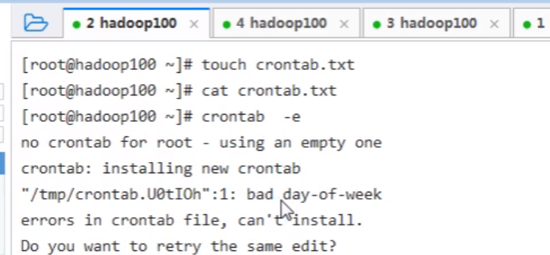

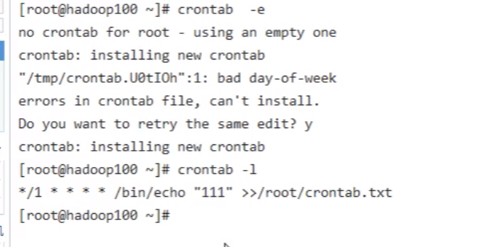

另外一个文件去观察:

适合做一些简单的任务,解决不了任务之间的关联关系(azkaban定时)

2．选项说明

表7-41

| 选项 | 功能                          |
| ---- | ----------------------------- |
| -e   | 编辑crontab定时任务           |
| -l   | 查询crontab任务               |
| -r   | 删除当前用户所有的crontab任务 |

3．参数说明

[root@hadoop101 ~]# crontab -e

（1）进入crontab编辑界面。会打开vim编辑你的工作。

\* * * * * 执行的任务

表7-42

| 项目      | 含义                 | 范围                    |
| --------- | -------------------- | ----------------------- |
| 第一个“*” | 一小时当中的第几分钟 | 0-59                    |
| 第二个“*” | 一天当中的第几小时   | 0-23                    |
| 第三个“*” | 一个月当中的第几天   | 1-31                    |
| 第四个“*” | 一年当中的第几月     | 1-12                    |
| 第五个“*” | 一周当中的星期几     | 0-7（0和7都代表星期日） |

（2）特殊符号

表7-43

| 特殊符号 | 含义                                                         |
| -------- | ------------------------------------------------------------ |
| *        | 代表任何时间。比如第一个“*”就代表一小时中每分钟都执行一次的意思。 |
| ，       | 代表不连续的时间。比如“0 8,12,16 * * * 命令”，就代表在每天的8点0分，12点0分，16点0分都执行一次命令 |
| -        | 代表连续的时间范围。比如“0 5 * * 1-6命令”，代表在周一到周六的凌晨5点0分执行命令 |
| */n      | 代表每隔多久执行一次。比如“*/10 * * * * 命令”，代表每隔10分钟就执行一遍命令 |

（3）特定时间执行命令

表7-44

| 时间              | 含义                                                         |
| ----------------- | ------------------------------------------------------------ |
| 45 22 * * * 命令  | 在22点45分执行命令                                           |
| 0 17 * * 1 命令   | 每周1 的17点0分执行命令                                      |
| 0 5 1,15 * * 命令 | 每月1号和15号的凌晨5点0分执行命令                            |
| 40 4 * * 1-5 命令 | 每周一到周五的凌晨4点40分执行命令                            |
| */10 4 * * * 命令 | 每天的凌晨4点，每隔10分钟执行一次命令                        |
| 0 0 1,15 * 1 命令 | 每月1号和15号，每周1的0点0分都会执行命令。注意：星期几和几号最好不要同时出现，因为他们定义的都是天。非常容易让管理员混乱。 |

4．案例实操

​    （1）每隔1分钟，向/root/bailongma.txt文件中添加一个11的数字

*/1 * * * * /bin/echo ”11” >> /root/bailongma.txt

# 第8章 软件包管理

## 8.1 RPM

### 8.1.1 RPM概述

RPM（RedHat Package Manager），RedHat软件包管理工具，类似windows里面的setup.exe

 是Linux这系列操作系统里面的打包安装工具，它虽然是RedHat的标志，但理念是通用的。

RPM包的名称格式

Apache-1.3.23-11.i386.rpm

\-    “apache” 软件名称

\-    “1.3.23-11”软件的版本号，主版本和此版本

\-    “i386”是软件所运行的硬件平台，Intel 32位微处理器的统称

\-    “rpm”文件扩展名，代表RPM包

### 8.1.2 RPM查询命令（rpm -qa）

1．基本语法

rpm -qa            （功能描述：查询所安装的所有rpm软件包）

2．经验技巧

由于软件包比较多，一般都会采取过滤。rpm -qa | grep rpm软件包

3．案例实操

​    （1）查询firefox软件安装情况

[root@hadoop101 Packages]# rpm -qa |grep firefox

### 8.1.3 RPM卸载命令（rpm -e）

1．基本语法

（1）rpm -e RPM软件包  

（2） rpm -e --nodeps 软件包 

2．选项说明

表8-1

| 选项     | 功能                                                         |
| -------- | ------------------------------------------------------------ |
| -e       | 卸载软件包                                                   |
| --nodeps | 卸载软件时，不检查依赖。这样的话，那些使用该软件包的软件在此之后可能就不能正常工作了。 |

3．案例实操

​    （1）卸载firefox软件

[root@hadoop101 Packages]# rpm -e firefox

### 8.1.4 RPM安装命令（rpm -ivh）

1．基本语法

​    rpm -ivh RPM包全名

2．选项说明

表8-2

| 选项     | 功能                         |
| -------- | ---------------------------- |
| -i       | -i=install，安装             |
| -v       | -v=verbose，显示详细信息     |
| -h       | -h=hash，进度条              |
| --nodeps | --nodeps，**不检测依赖进度** |

3．案例实操

光盘:centos6在media下面,centos7在run下面$$$

系统用到的所有包,package下有很多rpm包

/run/media/atguigu/CentOS 7 x86_64

​    （1）安装firefox软件

[root@hadoop101 Packages]# pwd

/media/CentOS_6.8_Final/Packages

[root@hadoop101 Packages]# rpm -ivh firefox-45.0.1-1.el6.centos.x86_64.rpm

warning: firefox-45.0.1-1.el6.centos.x86_64.rpm: Header V3 RSA/SHA1 Signature, key ID c105b9de: NOKEY

Preparing...        ########################################### [100%]

  1:firefox        ########################################### [100%]

## 8.2 YUM仓库配置

### 8.2.1 YUM概述

yarn:直接在线安装,类似于maven长度

YUM（全称为 Yellow dog Updater, Modified）是一个在Fedora和RedHat以及CentOS中的Shell前端软件包管理器。基于RPM包管理，能够从指定的服务器自动下载RPM包并且安装，可以自动处理依赖性关系，并且一次安装所有依赖的软件包，无须繁琐地一次次下载、安装，如图8-1所示

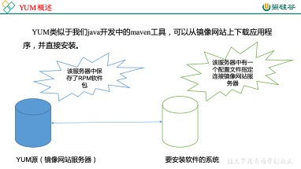

图8-1 YUM概述

### 8.2.2 YUM的常用命令

1．基本语法

​    yum [选项] [参数]

2．选项说明

表8-3

| 选项 | 功能                  |
| ---- | --------------------- |
| -y   | 对所有提问都回答“yes” |

3．参数说明

表8-4

| 参数         | 功能                          |
| ------------ | ----------------------------- |
| install      | 安装rpm软件包                 |
| update       | 更新rpm软件包                 |
| check-update | 检查是否有可用的更新rpm软件包 |
| remove       | 删除指定的rpm软件包           |
| list         | 显示软件包信息                |
| clean        | 清理yum过期的缓存             |
| deplist      | 显示yum软件包的所有依赖关系   |

4．案例实操实操

​    （1）采用yum方式安装firefox

[root@hadoop101 ~]#yum -y install firefox.x86_64

vim

### 8.2.3 修改网络YUM源

默认的系统YUM源，需要连接国外apache网站，网速比较慢，可以修改关联的网络YUM源为国内镜像的网站，比如网易163,aliyun等

1)   安装wget, wget用来从指定的URL下载文件

[root@hadoop101 ~] yum install wget

2)   在/etc/yum.repos.d/目录下，备份默认的repos文件,

[root@hadoop101 yum.repos.d] pwd

/etc/yum.repos.d

[root@hadoop101 yum.repos.d] cp CentOS-Base.repo  CentOS-Base

.repo.backup

 

3)   下载网易163或者是aliyun的repos文件,任选其一，如图8-2

[root@hadoop101 yum.repos.d] wget

 http://mirrors.aliyun.com/repo/Centos-repo //阿里云

[root@hadoop101 yum.repos.d] wget

 http://mirrors.163.com/.help/CentOS7-Base-163.repo //网易163

 

​    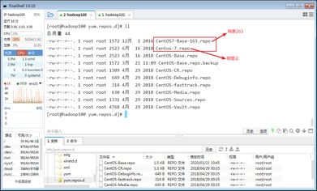

图8-2

4)   使用下载好的repos文件替换默认的repos文件

​      例如:用CentOS7-Base-163.repo替换CentOS-Base.repo

[root@hadoop101 yum.repos.d]# mv CentOS7-Base-163.repo  CentOS-Base.repo

5)   清理旧缓存数据，缓存新数据

[root@hadoop101 yum.repos.d]#yum clean all

[root@hadoop101 yum.repos.d]#yum makecache

yum makecache就是:yum把服务器的包信息下载到本地电脑缓存起来

6)   测试

[root@hadoop101 yum.repos.d]# yum list | grep firefox

[root@hadoop101 ~]#yum -y install firefox.x86_64

# 第9章 克隆虚拟机

## 9.1 克隆

1)   从现有虚拟机(关机状态)克隆出新虚拟机，右键选择管理=>克隆，如图9-1

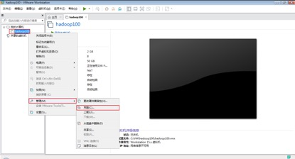

图 9-1

2)   点击下一步,如图9-2

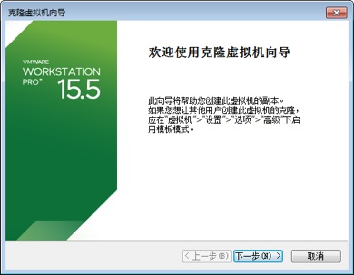

图9-2

3)    选择虚拟机中的当前状态,如图9-3

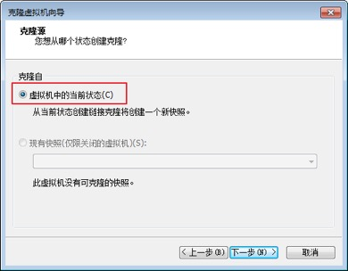

图9-3

4)   选择创建完整克隆，如图9-4

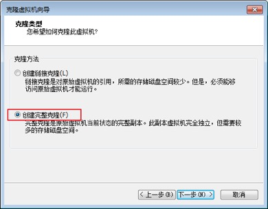

图9-4

 

5)   设置虚拟机名称及存储位置，如图9-5

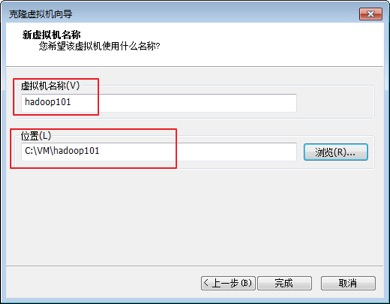

图9-5

6)   等等等……等待克隆完成，如图9-6,9-7

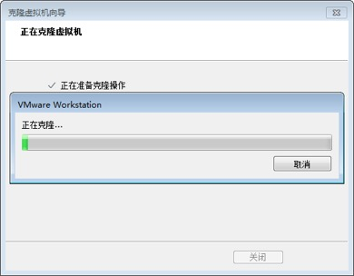

图9-6

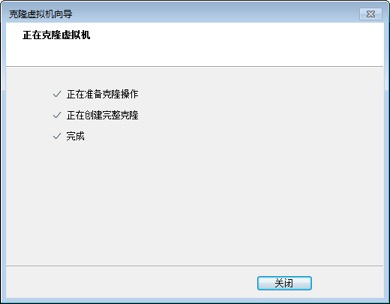

图9-7

## 快照

最好是关机拍摄快照,

拍快照可以恢复到原来的状态

## 9.2 开机修改系统相关配置

注意: 使用root用户。

 

1)   修改 vim /etc/sysconfig/network-scripts/ifcfg-ens33 ,修改IP地址,如图9-8

vim /etc/sysconfig/network-scripts/ifcfg-eth0

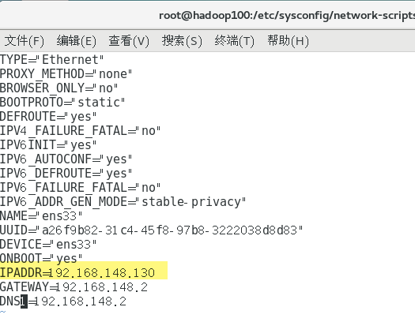

图9-8

2)   修改 /etc/hostname ,修改主机名,如图9-9

vim /etc/hostname

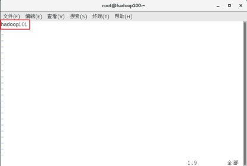

重启服务

 

 

# 第10章 常见错误及解决方案

\1.   虚拟化支持异常情况如下几种情况

图10-1

图10-2

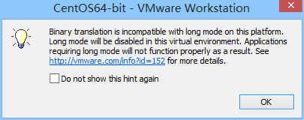

图10-3

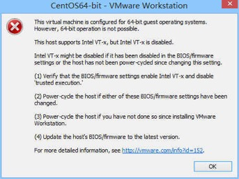

图10-4

问题原因：宿主机BIOS设置中的硬件虚拟化被禁用了

解决办法：需要打开笔记本BIOS中的IVT对虚拟化的支持

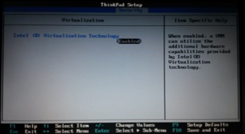

图10-5

# 第11章 企业真实面试题

## 11.1 百度&考满分

问题：Linux常用命令

参考答案：find、df、tar、ps、top、netstat等。（尽量说一些高级命令）

## 11.2 瓜子二手车

问题：Linux查看内存、磁盘存储、io **读写**、端口占用、进程等命令

答案：

1、查看内存：top

2、查看磁盘存储情况：df -h

3、查 看磁盘IO读写情况：iotop（需要安装一下：yum install iotop）、iotop -o（直接查看输出比较高的磁盘读写程序）

4、查看端口占用情况：netstat -tunlp | grep 端口号

5、查看进程：ps -aux

### 高级异常

ApplicationException AWTException BackingStoreException BadAttributeValueExpException BadBinaryOpValueExpException BadLocationException BadStringOperationException BrokenBarrierException Cert

tar

解包安装

确认是否安装,要卸载干净

需要卸载

忽略依赖全部卸载干净命令"

此时安装,要求有一定的顺序

初始化

重新设置密码

