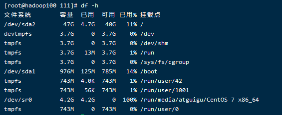

# 20-04-04

# 一、Linux虚拟网卡配置小结

查看一下windows主机：控制面板->本地服务->VMware相关服务有没有启动

## 1.如何配置Linux虚拟网卡:

vmware会帮我们生成虚拟网卡,如果没有生成把防火墙都关了,点还原可重新生成虚拟网卡


或者卸载vmware,通过cclean清理注册信息重新安装

## 2.虚拟机网络ens33的配置方式


## 3.虚拟机ping测试出错解决方式


# 二、常用命令

## 1.用户组管理命令

uid主id,gid,组id,linux会默认跟你创建一个和你名称相同的组

组信息:etc/group,组的增加、删除和修改实际上就是对/etc/group文件的更新。


### 1.usermod 修改用户

usermod -g 用户组 用户名

| 选项       | 功能                                                  |
| ---------- | ----------------------------------------------------- |
| usermod -g | 修改用户的初始登录组，给定的组必须存在。默认组id是1。 |


### 2. groupadd 新增组

groupadd 组名

添加一个bigdata组,并查看:

[root@hadoop100 home]# groupadd bigdata
[root@hadoop100 home]# cat /etc/group

新增用户的时候指定组到bangzhan1:useradd -g atguigu bangzhan1


### 3. groupdel 删除组

删除组:groupdel 组名


### 4.groupmod 修改组

| 选项                      | 功能描述           |
| ------------------------- | ------------------ |
| groupmod -n 新组名 老组名 | 指定工作组的新组名 |

例:修改atguigu组名称为atguigu1

[root@hadoop101 ~]#groupadd xitianqujing

[root@hadoop101 ~]# groupmod -n xitian xitianqujing


### 5.cat /etc/group:查看创建了哪些组

## 2.文件权限类

### 1.文件属性

三种权限:所属用户/组内用户/除了组内用户的其他用户

### 2.ll列表含义详解


1．从左到右的10个字符表示，如图7-1所示：


如果没有权限，就会出现减号[ - ]而已。从左至右用0-9这些数字来表示:

（1）0首位表示类型

在Linux中第一个字符代表这个文件是目录、文件或链接文件等等

\- 代表文件

 d 代表目录

 l 链接文档(link file)；

（2）第1-3位确定属主（该文件的所有者）拥有该文件的权限。---User

（3）第4-6位确定属组（所有者的同组用户）拥有该文件的权限，---Group

（4）第7-9位确定其他用户拥有该文件的权限 ---Other

2．rxw作用文件和目录的不同解释

（1）作用到文件：

[ r ]代表可读(read): 可以读取，查看

[ w ]代表可写(write): 可以修改，但是不代表可以删除该文件，删除一个文件的前提条件是对该文件所在的目录有写权限，才能删除该文件.

[ x ]代表可执行(execute):可以被系统执行

（2）作用到目录：

[ r ]代表可读(read): 可以读取，ls查看目录内容

[ w ]代表可写(write): 可以修改，目录内创建+删除+重命名目录

[ x ]代表可执行(execute):可以进入该目录(不进入目录不可以删除创建)

文件基本属性介绍，如图7-2所示：


文件实际大小统计:du -s -h 


（1）如果查看到是文件：链接数指的是硬链接个数。创建硬链接方法

ln [原文件] [目标文件]

[root@hadoop101 ~]# ln xiyou/dssz/houge.txt ./hg.txt

（2）如果查看的是文件夹：链接数指的是子文件夹个数。

### 3.chmod 改变权限

自己可以进行权限的操作,不能改变所属的主和组


第一种方式变更权限:chmod [{ugoa}{+-=}{rwx}] 文件或目录

第二种方式变更权限:chmod [mode=421 ] [文件或目录]

小结:u(1-3)当前用户自己可以做的操作；g(4-6)当前组其他用户可以做的操作；其他组(7-9)的用户可以对这个文件做的操作

经验技巧:u:所有者 g:所有组 o:其他人 a:所有人(u、g、o的总和)

r=4 w=2 x=1    rwx=4+2+1=7

最常用的:chmod 777


（1）修改文件使其所属主用户具有执行权限:chmod u+x houge.txt

（2）修改文件使其所属组用户具有执行权限: chmod g+x houge.txt

（3）修改文件所属主用户执行权限,并使其他用户具有执行权限:chmod u-x,o+x houge.txt

（4）采用数字的方式，设置文件所有者、所属组、其他用户都具有可读可写可执行权限:chmod 777 houge.txt

（5）修改整个文件夹里面的所有文件的所有者、所属组、其他用户都具有可读可写可执行权限:chmod -R 777 xiyou/

增加组内级别权限:


其他用户看ROOT文件:7-9,只能读不能写


自己更改自己的个人用户权限


自己改变组自己组的权限


自己改变其他的权限


### 4.chown 改变所有者

chown [选项] [最终用户] [文件或目录]       （功能描述：改变文件或者目录的所有者）

| 选项     | 功能     |
| -------- | -------- |
| chown -R | 递归操作 |

（1）修改文件所有者chown atguigu houge.txt

（2）递归改变文件所有者和所有组chown -R atguigu:atguigu xiyou/


自己不能改(哪怕是自己创建的)


### 5.chgrp 改变所属组

chgrp [最终用户组] [文件或目录]    （功能描述：改变文件或者目录的所属组）

修改文件的所属组 chgrp root houge.txt


## 3.搜索查找类

### 1 find 查找文件或者目录

find 指令:将从指定目录向下递归地遍历其各个子目录，将满足条件的文件显示在终端。

| 选项                 | 功能                                                         |
| -------------------- | ------------------------------------------------------------ |
| find -name<查询方式> | 按照指定的文件名查找模式查找文件                             |
| find -user<用户名>   | 查找属于指定用户名所有文件                                   |
| find -size<文件大小> | 按照指定的文件大小查找文件,单位为:**b** —— 块（512字节）**c** —— 字节**w** —— 字（2字节）**k** —— 千字节**M** —— 兆字节**G** —— 吉字节 |

（1）按文件名：根据名称查找/目录下的filename.txt文件。

[root@hadoop101 ~]# find xiyou/ -name *.txt


（2）按拥有者：查找/opt目录下，用户名称为-user的文件

[root@hadoop101 ~]# find xiyou/ -user atguigu

​    （3）按文件大小：在/home目录下查找大于200m的文件（+n 大于 -n小于  n等于）

[root@hadoop101 ~]find /home -size +204800


### 2 locate快速定位文件路径

locate指令利用事先建立的系统中所有文件名称及路径的locate数据库实现快速定位给定的文件。Locate指令无需遍历整个文件系统，查询速度较快。为了保证查询结果的准确度，管理员必须定期更新locate时刻。

根目录文件多,找起来就慢,这是通过索引来找的

1．基本语法

​    locate 搜索文件

2．经验技巧

​    由于locate指令基于数据库进行查询，所以第一次运行前，必须使用updatedb指令创建locate数据库。


### 3 grep 过滤查找及“|”管道符

grep:管道符，“|”，表示将前一个命令的处理结果输出传递给后面的命令处理

grep 选项 查找内容 源文件

| 选项    | 功能               |
| ------- | ------------------ |
| grep -n | 显示匹配行及行号。 |

查找某文件在第几行ls | grep -n test


过滤cfg


## 4.压缩和解压类

### 1 gzip/gunzip 压缩

1.功能描述

gzip 文件       （功能描述：压缩文件，只能将文件压缩为*.gz文件,只压缩,不打包,后只接一个文件）

gunzip 文件.gz   （功能描述：解压缩文件命令）

2.经验技巧

（1）只能压缩文件不能压缩目录

（2）不保留原来的文件

3．案例实操

gzip压缩


gunzip解压缩文件


### 2 zip/unzip 压缩

1．基本语法

zip [选项] XXX.zip 将要压缩的内容      （功能描述：压缩文件和目录的命令）

unzip [选项] XXX.zip                   （功能描述：解压缩文件）

| zip选项 | 功能     |
| ------- | -------- |
| zip -r  | 压缩目录 |

| unzip选项      | 功能                     |
| -------------- | ------------------------ |
| unzip -d<目录> | 指定解压后文件的存放目录 |

2．经验技巧

zip 压缩命令在window/linux都通用，可以压缩目录且保留源文件。

3．案例实操

（1）压缩 1.txt 和2.txt，压缩后的名称为mypackage.zip:zip mypackage.zip houge.txt bailongma.txt


（2）解压 mypackage.zip:unzip mypackage.zip


（3）解压mypackage.zip到指定目录-d


### 3.压缩件格式.tar.gz

| 选项    | 功能               |
| ------- | :----------------- |
| tar  -c | 产生.tar打包文件   |
| tar -v  | 显示详细信息       |
| tar -f  | 指定压缩后的文件名 |
| tar -z  | 打包同时压缩       |
| tar -x  | 解包.tar文件       |

注:c和x互斥

 **案例实操**


（1）压缩多个文件 tar -zcvf houma.tar.gz houge.txt bailongma.txt

（2）压缩目录 tar -zcvf xiyou.tar.gz xiyou/

（3）解压到当前目录 tar -zxvf houma.tar.gz

（4）解压到指定目录 tar -zxvf xiyou.tar.gz -C /opt


## 5.磁盘分区类

### 1 df 查看磁盘空间使用情况

df: disk free 空余硬盘

1．基本语法

​    df 选项 （功能描述：列出文件系统的整体磁盘使用量，检查文件系统的磁盘空间占用情况）

2．选项说明

| 选项  | 功能                                                     |
| ----- | -------------------------------------------------------- |
| df -h | 以人们较易阅读的 GBytes, MBytes, KBytes 等格式自行显示； |

3．案例实操

​    （1）查看磁盘使用情况 df -h




### 2 fdisk 查看分区

| 选项     | 功能                   |
| -------- | ---------------------- |
| fdisk -l | 显示所有硬盘的分区列表 |

2．经验技巧

该命令必须在root用户下才能使用

3．功能说明

​    （1）Linux分区

Device：分区序列

Boot：引导

Start：从X磁柱开始

End：到Y磁柱结束

Blocks：容量

Id：分区类型ID

System：分区类型

4．案例实操

​    （1）查看系统分区情况


### 3 lsblk 查看设备挂载情况

1．基本语法

​    lsblk       （功能描述：查看设备挂载情况）

2．选项说明

| 选项     | 功能                                     |
| -------- | ---------------------------------------- |
| lsblk -f | 查看详细的设备挂载情况，显示文件系统信息 |

  

### 4 mount/umount 挂载/卸载

对于Linux用户来讲，不论有几个分区，分别分给哪一个目录使用，它总归就是一个根目录、一个独立且唯一的文件结构。

Linux中每个分区都是用来组成整个文件系统的一部分，它在用一种叫做“挂载”的处理方法，它整个文件系统中包含了一整套的文件和目录，并将一个分区和一个目录联系起来，要载入的那个分区将使它的存储空间在这个目录下获得。

1．挂载前准备（必须要有光盘或者已经连接镜像文件），如图7-5， 7-6所示


图 7-5


图7-6 挂载镜像文件

2．基本语法

mount [-t vfstype] [-o options] device dir   （功能描述：挂载设备）

umount 设备文件名或挂载点          （功能描述：卸载设备）

3．参数说明

| 参数             | 功能                                                         |
| ---------------- | ------------------------------------------------------------ |
| mount -t vfstype | 指定文件系统的类型，通常不必指定。mount 会自动选择正确的类型。常用类型有：光盘或光盘镜像：iso9660DOS fat16文件系统：msdos[Windows](http://blog.csdn.net/hancunai0017/article/details/6995284) 9x fat32文件系统：vfatWindows NT ntfs文件系统：ntfsMount Windows文件[网络](http://blog.csdn.net/hancunai0017/article/details/6995284)共享：smbfs[UNIX](http://blog.csdn.net/hancunai0017/article/details/6995284)(LINUX) 文件网络共享：nfs |
| mount -o options | 主要用来描述设备或档案的挂接方式。常用的参数有：loop：用来把一个文件当成硬盘分区挂接上系统ro：采用只读方式挂接设备rw：采用读写方式挂接设备　 iocharset：指定访问文件系统所用字符集 |
| mount device     | 要挂接(mount)的设备                                          |
| mount dir        | 设备在系统上的挂接点(mount point)                            |

4．案例实操

（1）挂载光盘镜像文件 mount -t iso9660 /dev/cdrom /mnt/cdrom/ 设备/dev/cdrom挂载到 挂载点 ： /mnt/cdrom中

（2）卸载光盘镜像文件  umount /mnt/cdrom

5．设置开机自动挂载

[root@hadoop101 ~]# vi /etc/fstab

添加红框中内容，保存退出。


## 6.进程线程类

进程是正在执行的一个程序或命令，每一个进程都是一个运行的实体，都有自己的地址空间，并占用一定的系统资源。

### 1 ps 查看当前系统进程状态

ps:process status 进程状态

1．基本语法

​    ps -aux | grep xxx     （功能描述：查看系统中所有进程）

​    ps -ef | grep xxx      （功能描述：可以查看子父进程之间的关系）

2．选项说明

表7-30

| 选项  | 功能                   |
| ----- | ---------------------- |
| ps -a | 选择所有进程           |
| ps -u | 显示所有用户的所有进程 |
| ps -x | 显示没有终端的进程     |

3．功能说明

​    （1）ps -aux显示信息说明


USER：该进程是由哪个用户产生的

PID：进程的ID号

%CPU：该进程占用CPU资源的百分比，占用越高，进程越耗费资源；

%MEM：该进程占用物理内存的百分比，占用越高，进程越耗费资源；

VSZ：该进程占用虚拟内存的大小，单位KB；

RSS：该进程占用实际物理内存的大小，单位KB；

TTY：该进程是在哪个终端中运行的。其中tty1-tty7代表本地控制台终端，tty1-tty6是本地的字符界面终端，tty7是图形终端。pts/0-255代表虚拟终端。

STAT：进程状态。常见的状态有：R：运行、S：睡眠、T：停止状态、s：包含子进程、+：位于后台

START：该进程的启动时间

TIME：该进程占用CPU的运算时间，注意不是系统时间

COMMAND：产生此进程的命令名

（2）ps -ef显示信息说明


UID：用户ID

PID：进程ID

PPID：父进程ID

C：CPU用于计算执行优先级的因子。数值越大，表明进程是CPU密集型运算，执行优先级会降低；数值越小，表明进程是I/O密集型运算，执行优先级会提高

STIME：进程启动的时间

TTY：完整的终端名称

TIME：CPU时间

CMD：启动进程所用的命令和参数

4．经验技巧

​    如果想查看进程的CPU占用率和内存占用率，可以使用aux;

如果想查看进程的父进程ID可以使用ef;

一般会配合grep使用

如何杀死一只火狐


等同于点×,较温和

### 2 kill 终止进程

  1.基本语法

  kill [选项] 进程号      （功能描述：通过进程号杀死进程）

​    killall 进程名称         （功能描述：通过进程名称杀死进程，也支持通配符，这在系统因负载过大而变得很慢时很有用） 

| 选项    | 功能                 |
| ------- | -------------------- |
| kill -9 | 表示强迫进程立即停止 |

2．案例实操

杀死浏览器进程：kill -9 5102

通过进程名称杀死进程：killall firefox


总算终止成功了


### 3 pstree ：查看进程树

| 选项      | 功能               |
| --------- | ------------------ |
| pstree -p | 显示进程的PID      |
| pstree -u | 显示进程的所属用户 |

3．案例实操

 

​    （1）显示进程pid：pstree -p


​    （2）显示进程所属用户 pstree -u


### 4 top ：查看系统健康状态

| 选项          | 功能                                                         |
| ------------- | ------------------------------------------------------------ |
| top ：-d 秒数 | 指定top命令每隔几秒更新。默认是3秒在top命令的交互模式当中可以执行的命令： |
| top ：-i      | 使top不显示任何闲置或者僵死进程。                            |
| top ：-p      | 通过指定监控进程ID来仅仅监控某个进程的状态。                 |

操作说明

| 操作   | 功能                               |
| ------ | ---------------------------------- |
| (top)P | (top)以CPU使用率排序，默认就是此项 |
| (top)M | (top)以内存的使用率排序            |
| (top)N | (top)以PID排序                     |
| (top)q | (top)退出top                       |

5．案例实操

[root@hadoop101 atguigu]# top -d 1

[root@hadoop101 atguigu]# top -i

[root@hadoop101 atguigu]# top -p 2575

执行上述命令后，可以按P、M、N对查询出的进程结果进行排序。

直接敲top（默认以cpu来做排序）


m


N

****

1s刷新一次


### 5 netstat 显示网络统计信息和端口占用情况

1．基本语法

​    netstat -anp |grep 进程号   （功能描述：查看该进程网络信息）

​    netstat -nlp   | grep 端口号 （功能描述：查看网络端口号占用情况）

2．选项说明

| 选项       | 功能                                     |
| ---------- | ---------------------------------------- |
| netstat -n | 拒绝显示别名，能显示数字的全部转化成数字 |
| netstat -l | 仅列出有在listen（监听）的服务状态       |
| netstat -p | 表示显示哪个进程在调用                   |

3．案例实操

（1）通过进程号查看该进程的网络信息

[root@hadoop101 hadoop-2.2]# netstat -anp | grep 火狐浏览器进程号


 

（2）查看某端口号是否被占用

[root@hadoop101 桌面]# netstat -nlp | grep **20670**

## 7 crontab 系统定时任务

适合做一些简单的定时关系,但是解决不了复杂的定时任务之间的逻辑关系

### 1 crontab 服务管理

重新启动crond服务 service crond restart

### 2 crontab 定时任务设置

crontab [选项]

| 选项         | 功能                          |
| ------------ | ----------------------------- |
| (chrontab)-e | 编辑crontab定时任务           |
| (chrontab)-l | 查询crontab任务               |
| (chrontab)-r | 删除当前用户所有的crontab任务 |

重启定时任务状态: systemctl restart crond

（1）crontab -e,进入crontab编辑界面。会打开vim编辑你的工作。

\* * * * * 执行的任务

| 项目      | 含义                 | 范围                    |
| --------- | -------------------- | ----------------------- |
| 第一个“*” | 一小时当中的第几分钟 | 0-59                    |
| 第二个“*” | 一天当中的第几小时   | 0-23                    |
| 第三个“*” | 一个月当中的第几天   | 1-31                    |
| 第四个“*” | 一年当中的第几月     | 1-12                    |
| 第五个“*” | 一周当中的星期几     | 0-7（0和7都代表星期日） |

（2）特殊符号

| 特殊符号     | 含义                                                         |
| ------------ | ------------------------------------------------------------ |
| *(crontab)   | 代表任何时间。比如第一个“*”就代表一小时中每分钟都执行一次的意思。 |
| ，(crontab)  | 代表不连续的时间。比如“0 8,12,16 * * * 命令”，就代表在每天的8点0分，12点0分，16点0分都执行一次命令 |
| -(crontab)   | 代表连续的时间范围。比如“0 5 * * 1-6命令”，代表在周一到周六的凌晨5点0分执行命令 |
| */n(crontab) | 代表每隔多久执行一次。比如“*/10 * * * * 命令”，代表每隔10分钟就执行一遍命令 |

（3）特定时间执行命令

| 时间              | 含义                                                         |
| ----------------- | ------------------------------------------------------------ |
| 45 22 * * * 命令  | 在22点45分执行命令                                           |
| 0 17 * * 1 命令   | 每周1 的17点0分执行命令                                      |
| 0 5 1,15 * * 命令 | 每月1号和15号的凌晨5点0分执行命令                            |
| 40 4 * * 1-5 命令 | 每周一到周五的凌晨4点40分执行命令                            |
| */10 4 * * * 命令 | 每天的凌晨4点，每隔10分钟执行一次命令                        |
| 0 0 1,15 * 1 命令 | 每月1号和15号，每周1的0点0分都会执行命令。注意：星期几和几号最好不要同时出现，因为他们定义的都是天。非常容易让管理员混乱。 |

4．案例实操

​    （1）使用chrontab -e进入编辑,并添加对应命令(一个文件写)

*/1 * * * * /bin/echo "hell2o" >> /root/crontab.txt


另外一个文件去观察:tail -f crontab.txt


查看启动的定时任务


清除定时任务


# 三、软件包管理 

## 1 RPM

### 1.1 RPM概述

RPM（RedHat Package Manager），RedHat软件包管理工具，类似windows里面的setup.exe

 是Linux这系列操作系统里面的打包安装工具，它虽然是RedHat的标志，但理念是通用的。

RPM包的名称格式

Apache-1.3.23-11.i386.rpm

\-    “apache” 软件名称

\-    “1.3.23-11”软件的版本号，主版本和此版本

\-    “i386”是软件所运行的硬件平台，Intel 32位微处理器的统称

\-    “rpm”文件扩展名，代表RPM包

### 1.2 RPM查询命令（rpm -qa）

1．基本语法

rpm -qa            （功能描述：查询所安装的所有rpm软件包）

2．经验技巧

由于软件包比较多，一般都会采取过滤。rpm -qa | grep rpm软件包

3．案例实操

​    （1）查询firefox软件安装情况

[root@hadoop101 Packages]# rpm -qa |grep firefox


### 1.3 RPM卸载命令（rpm -e）

| 选项         | 功能                                                         |
| ------------ | ------------------------------------------------------------ |
| rpm -e       | 卸载软件包                                                   |
| rpm --nodeps | 卸载软件时，不检查依赖。这样的话，那些使用该软件包的软件在此之后可能就不能正常工作了。 |

案例实操

​    （1）卸载firefox软件rpm -e firefox


### 1.4 RPM安装命令（rpm -ivh）

| 选项         | 功能                         |
| ------------ | ---------------------------- |
| rpm -i       | -i=install，安装             |
| rpm -v       | -v=verbose，显示详细信息     |
| rpm -h       | -h=hash，进度条              |
| rpm --nodeps | --nodeps，**不检测依赖进度** |

 rpm -ivh RPM包全名	安装rpm软件包

3．案例实操

光盘:centos6在run下面,centos7在media/root下面(/run/media/atguigu/CentOS 7 x86_64)


下面有系统用到的所有包,package下有很多rpm包

安装firefox软件

[root@hadoop101 Packages]# pwd

[root@hadoop101 Packages]# rpm -ivh firefox-45.0.1-1.el6.centos.x86_64.rpm

## 2 YUM仓库配置

### 2.1 YUM概述

yarn:直接在线安装,类似于maven,能够从指定的服务器自动下载RPM包并且安装，可以自动处理依赖性关系，并且一次安装所有依赖的软件包，无须繁琐地一次次下载、安装，如图8-1所示


### 2.2 YUM的常用命令

| 选项   | 功能                  |
| ------ | --------------------- |
| yum -y | 对所有提问都回答“yes” |

yum参数说明

| 参数         | 功能                          |
| ------------ | ----------------------------- |
| install      | 安装rpm软件包                 |
| update       | 更新rpm软件包                 |
| check-update | 检查是否有可用的更新rpm软件包 |
| remove       | 删除指定的rpm软件包           |
| list         | 显示软件包信息                |
| clean        | 清理yum过期的缓存             |
| deplist      | 显示yum软件包的所有依赖关系   |

采用yum方式安装firefox

[root@hadoop101 ~]#yum -y install firefox.x86_64


vim


### 2.3 修改网络YUM源

默认的系统YUM源，需要连接国外apache网站，网速比较慢，可以修改关联的网络YUM源为国内镜像的网站，比如网易163,aliyun等

1)   安装wget, wget用来从指定的URL下载文件 yum install wget

2)   在/etc/yum.repos.d/目录下，备份默认的repos(CentOS-Base.repo)文件(/etc/yum.repos.d):复制随便取个名字(可以后面加个.backup)

3)   下载网易163或者是aliyun的repos文件,任选其一

wget http://mirrors.aliyun.com/repo/Centos-repo //阿里云

wget http://mirrors.163.com/.help/CentOS7-Base-163.repo //网易163

4)   使用下载好的repos文件替换默认的repos文件

​       例如:用CentOS7-Base-163.repo替换CentOS-Base.repo

[root@hadoop101 yum.repos.d]# mv CentOS7-Base-163.repo  CentOS-Base.repo

5)   清理旧缓存数据，缓存新数据

[root@hadoop101 yum.repos.d]#yum clean all

[root@hadoop101 yum.repos.d]#yum makecache

yum makecache就是:yum把服务器的包信息下载到本地电脑缓存起来


6)   测试

[root@hadoop101 yum.repos.d]# yum list | grep firefox

[root@hadoop101 ~]#yum -y install firefox.x86_64


# 四、克隆虚拟机

## 1 克隆

1)   从现有虚拟机(关机状态)克隆出新虚拟机，右键选择管理=>克隆，如图9-1


图 9-1

2)   点击下一步,如图9-2


图9-2

3)    选择虚拟机中的当前状态,如图9-3


图9-3

4)   选择创建完整克隆，如图9-4


图9-4

 

5)   设置虚拟机名称及存储位置，如图9-5


图9-5

6)   等等等……等待克隆完成，如图9-6,9-7


图9-6


注意: 使用root用户更改IP和主机。

1)   修改 vim /etc/sysconfig/network-scripts/ifcfg-ens33 ,修改IP地址,如图9-8

vim /etc/sysconfig/network-scripts/ifcfg-eth0


图9-8

2)   修改 /etc/hostname ,修改主机名,如图9-9

vim /etc/hostname


重启服务


## 2 快照


最好是关机拍摄快照,

拍快照可以恢复到原来的状态

# 五、Linux上安装mysql

## 1.查找安装包

拷贝win下的资源到linux opt下新建的software目录下


## 2.解压

这里只是个tar文件,只做了简单的打包操作(不是zip,不要加-z)


## 3.安装准备

确认没装过:rpm -qa | grep mysql(可以grep -i mysql表示不区分大小写)

安装之前要确保当前linux中没有安装过mysql

并且注意有个mysql的分支叫mariadb要卸载掉


忽略依赖卸载: rpm -e --nodeps mariadb-libs 

## 4.正式安装(注意先后顺序)


# 六、mysql的初始化

## 1.检查配置文件

mysql的配置文件默认的位置


datadir：用来存储数据文件，去到这个路径保证这里面没有东西


## 2.初始化并启动服务

mysql初始化： mysqld --initialize --user=mysql

启动mysql服务： systemctl start mysqld.service

启动成功：


## 3.设置密码

mysql会给我们提供一个随机密码：cat /var/log/mysqld.log


用密码登录


重置密码  set password = password('123456');


## 4.mysql的安装位置

mysql相关命令在userbin里面

日志在log命令的mysqld.log里面


还有一些进程的pid命令


# 七、mysql的自启动

设置自启动的两种方式


(其中标*是自启动的)

# 八、设置Mysql的字符集

 查看字符集方法:show variables like '%char%';(此方法也用于查看mysql的一系列变量)


通过修改配置文件把database和server默认的latin1改成utf-8

```
 [root@hadoop102 ~]$ vim /etc/my.cnf

\#添加如下配置

[client]

default-character-set=utf8

[mysqld]

character_set_server=utf8

collation-server=utf8_general_ci

[mysql]

default-character-set=utf8
```


重启


注意:以建成的库表不会更改,此操作仅对新生成的表有效

旧库/表修改方法:

