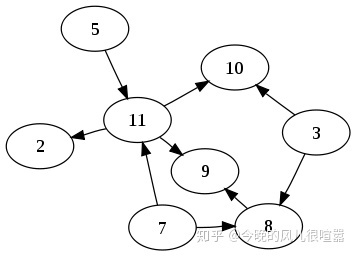

# 20-04-05

# 一、Hadoop组成

Hadoop1.x与Hadoop2.x的区别

# 二、HDFS架构概述

HDFS（Hadoop Distributed File System）的架构概述，如图2-23所示。

# 三、YARN架构概述

# 四、MapReduce架构概述

MapReduce将计算过程分为两个阶段：Map和Reduce

1）Map阶段并行处理输入数据

2）Reduce阶段对Map结果进行汇总

# 五、大数据技术生态体系

大数据技术生态体系如图所示。

1）Sqoop：Sqoop是一款开源的工具，主要用于在Hadoop、Hive与传统的数据库(MySql)间进行数据的传递，可以将一个关系型数据库（例如 ：MySQL，Oracle 等）中的数据导进到Hadoop的HDFS中，也可以将HDFS的数据导进到关系型数据库中。

2）Flume：Flume是Cloudera提供的一个高可用的，高可靠的，分布式的海量日志采集、聚合和传输的系统，Flume支持在日志系统中定制各类数据发送方，用于收集数据；同时，Flume提供对数据进行简单处理，并写到各种数据接受方（可定制）的能力。

3）Kafka：Kafka是一种高吞吐量的分布式发布订阅消息系统，有如下特性：

（1）通过O(1)的磁盘数据结构提供消息的持久化，这种结构对于即使数以TB的消息存储也能够保持长时间的稳定性能。

（2）高吞吐量：即使是非常普通的硬件Kafka也可以支持每秒数百万的消息。

（3）支持通过Kafka服务器和消费机集群来分区消息。

（4）支持Hadoop并行数据加载。

4）Storm：Storm用于“连续计算”，对数据流做连续查询，在计算时就将结果以流的形式输出给用户。

5）Spark：Spark是当前最流行的开源大数据内存计算框架。可以基于Hadoop上存储的大数据进行计算。

6）Oozie：Oozie是一个管理Hdoop作业（job）的工作流程调度管理系统。

7）Hbase：HBase是一个分布式的、面向列的开源数据库。HBase不同于一般的关系数据库，它是一个适合于非结构化数据存储的数据库。

8）Hive：Hive是基于Hadoop的一个数据仓库工具，可以将结构化的数据文件映射为一张数据库表，并提供简单的SQL查询功能，可以将SQL语句转换为MapReduce任务进行运行。 其优点是学习成本低，可以通过类SQL语句快速实现简单的MapReduce统计，不必开发专门的MapReduce应用，十分适合数据仓库的统计分析。

10）R语言：R是用于统计分析、绘图的语言和操作环境。R是属于GNU系统的一个自由、免费、源代码开放的软件，它是一个用于统计计算和统计制图的优秀工具。

11）Mahout：Apache Mahout是个可扩展的机器学习和数据挖掘库。

12）ZooKeeper：Zookeeper是Google的Chubby一个开源的实现。它是一个针对大型分布式系统的可靠协调系统，提供的功能包括：配置维护、名字服务、 分布式同步、组服务等。ZooKeeper的目标就是封装好复杂易出错的关键服务，将简单易用的接口和性能高效、功能稳定的系统提供给用户。

# 六、拓扑排序 (Topological sorting)

某校的选课系统规定，每门课可能有若干个先修课，如果要修读某一门课程，则必须要先 修完所有的先修课才能修读。假设一个学生同时只能报一门课程，那么选课系统允许他修完所有课程的顺序就是一个拓扑序...

从上述小例子中可以看出，拓扑排序是一个有效的任务顺序，每一门课对应有向图的一个顶点， 先修关系对应有向图的一条边。

## **有向无环图 (DAG)**

在图论中，有向图用边来描述结点与结点之间的方向关系， 如果一个有向图从任意顶点出发无法经过若干条边回到这个点，则称这个图是一个有向无环图。如图所示，箭头代表边，圆圈代表结点：

## **拓扑排序**

有向无环图（DAG）才有拓扑排序，非 DAG 图没有拓扑排序。 当有向无环图满足以下条件时：

1. 每一个顶点出现且只出现一次
2. 若A在序列中排在B的前面，则在图中不存在从B到A的路径。

我们称这样的图，是一个拓扑排序的图。与之前的树结构对比不难发现，树结构其实可以转化为拓扑排序，而拓扑排序 不一定能够转化为树。

