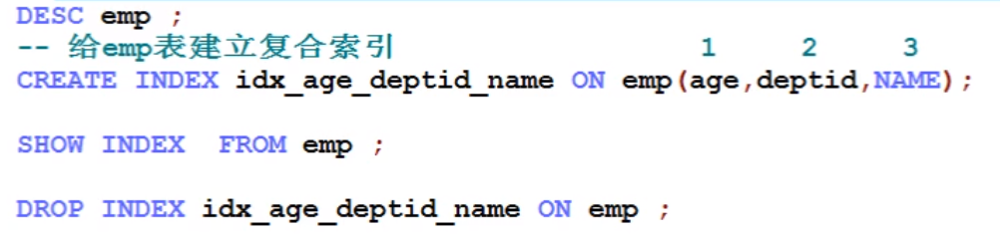

# Mysql引擎

archive:档案引擎,支持,不允许修改

custom:自定义,如阿里sql


# Mysql配置文件位置

win下mysql配置文件:


linux:/etc/my.cnf/


# sql_mode

## sql_mode的查看和设置

### 1.查看当前的sql_mode

 mysql> select @@sql_mode;

一般是ONLY_FULL_GROUP_BY:对于GROUP BY聚合操作，如果在SELECT中的列，没有在GROUP BY中出现，那么这个SQL是不合法的，因为列不在GROUP BY从句中

### 2.临时修改 sql_mode

mysql> set @@sql_mode='';

### 3.永久修改

需要在配置文件my.cnf中修改(一般不会这么做)

[root@hadoop102 ~]$ vim /etc/my.cnf

\#添加下列配置，然后重启mysql即可

[mysqld]

sql_mode=''

## sql_mode的作用

查询每个dept中年龄最大的人：

错误结果：

SELECT NAME,dept,MAX(age) FROM mytbl2 GROUP BY dept;(select出现问题,仍然会把结果返回回来了)

 组标识:标识你是哪个组的,一般即分组字段,分组之后不能出现非

分组:group by以后,select后面只能跟组标识及聚合函数(组函数)

非严格不会报错,严格模式会报错: Expression #1 of SELECT list is not in GROUP BY clause and contains nonaggregated column 'mydb.mytbl2.NAME' which is not functionally dependent on columns in GROUP BY clause; this is incompatible with sql_mode=only_full_group_by


正确结果：

SELECT id,name,ab.dept,ab.maxage FROM mytbl2 m INNER JOIN(SELECT dept,MAX(age)maxage FROM mytbl2 GROUP BY dept)ab ON ab.dept=m.dept AND m.age=ab.maxage;

所以设置了严格的mode模式可以规避我们很多低级错误

# 了解一个表步骤

先了解表结构:desc

priv涉及权限


# 远程连接linux上的mysql


设置任意主机连接:update user set host = '%' where user = 'root';

ps.%支持任意用户去连接:

执行完之后还需要执行刷新命令:flush privileges;


注意:防火墙要关闭(企业里控制端口)

# sql的执行周期

查看执行周期;show variables like '%profiling%';


默认off,开启(01区分):


默认不会查所有,记录下的sql,分析执行过程中执行的步骤

查询缓存:show profile cpu,block io for query  ;


打开


# 查询缓存设置

show variables like "%query_cache%";


参数:

l query_cache_limit： 超过此大小的查询将不再缓存(可设置)。

l query_cache_min_res_unit：缓存块的最小值。

l query_cache_size：缓存大小值

l query_cache_type：缓存类型，决定缓存什么样的查询。

## 开启查询缓存

此时不能用01开启了


开启缓存必须要修改配置文件(my.cnf)


注:linux大小写敏感


重新启动mysql,进行查看,确认打开


## 查询缓存作用

查询语句执行时间效率差距明显


缓存前执行操作:


缓存后执行操作:


# 存储引擎

## 查看存储引擎

show engines:


yes是都支持的,默认innodb

SHOW CREATE TABLE mytb1;


## 指定存储引擎


## MyISAM和InnoDB引擎

| 对比项         | MyISAM                                                   | InnoDB                                                       |
| -------------- | -------------------------------------------------------- | ------------------------------------------------------------ |
| 外键           | 不支持                                                   | 支持                                                         |
| 事务           | 不支持                                                   | 支持                                                         |
| 行表锁         | 表锁，即使操作一条记录也会锁住整个表，不适合高并发的操作 | 行锁,操作时只锁某一行，不对其它行有影响，适合高并发的操作    |
| 缓存           | 只缓存索引，不缓存真实数据                               | 不仅缓存索引还要缓存真实数据，对内存要求较高，而且内存大小对性能有决定性的影响 |
| 关注点         | 读性能                                                   | 并发写、事务、资源                                           |
| 默认安装       | Y                                                        | Y                                                            |
| 默认使用       | N                                                        | Y                                                            |
| 自带系统表使用 | Y                                                        | N                                                            |

 后者表就是索引文件,前者是分开的

myisam不支持外键和事务(innodb支持),部分场景适合:如系统表(mysql-use)

# SQL表连接

表连接80%以上操作

用内外根据查询结果来判断,内只有交集,左外(=b右外链a),区分主从表匹配表

内连接: A inner join B on  

内连接的结果集: 交集

外连接:  A  left outer join B on      A   right outer join  B on

​     主表(驱动表)   从表(匹配表)

外连接确定主从表: 左外连左主右从， 右外连右主左从！

外连接的结果集: 主表取所有，从表取匹配. 主表与从表未匹配的数据通过null来补全.


 

自连接:都是自己

全外:mysql不支持full join,里是通过别的手段间接实现(相加union去重,unionall不去重要额外加distinct)

例子

```sql
2)   所有有门派人员的信息（要求显示门派名称）

SELECT e.`name`,d.`deptName` FROM t_emp e INNER JOIN t_dept d ON e.`deptId`=d.`id`;

3)    列出所有人员及其门派信息

SELECT e.`name`,d.`deptName` FROM t_emp e LEFT JOIN t_dept d ON e.`deptId`=d.`id`;

4)    列出所有门派

SELECT * FROM t_dept;

5)    所有无门派人士

SELECT * FROM t_emp WHERE deptId IS NULL;

6)    所有无人门派

SELECT d.* FROM t_dept d LEFT JOIN t_emp e ON d.`id`=e.`deptId` WHERE e.`deptId` IS NULL;

7)    所有人员和门派的对应关系

SELECT * FROM t_emp e LEFT JOIN t_dept d ON e.`deptId`=d.`id`

UNION

SELECT * FROM t_emp e RIGHT JOIN t_dept d ON e.`deptId`=d.`id`;

8)    所有没有入门派的人员和没人入的门派

SELECT * FROM t_emp e LEFT JOIN t_dept d ON e.`deptId`=d.`id` WHERE e.deptId IS NULL

UNION

SELECT * FROM t_dept d LEFT JOIN t_emp e ON d.`id`=e.`deptId` WHERE e.`deptId` IS NULL;

10)  求各个门派对应的掌门人名称

SELECT d.deptName,e.name FROM t_dept d LEFT JOIN t_emp e ON d.ceo=e.id

11)  求所有当上掌门人的平均年龄

SELECT AVG(e.age) FROM t_dept d LEFT JOIN t_emp e ON d.ceo=e.id

12)  求所有人物对应的掌门名称

SELECT e1.name '人物',e2.name '掌门'

FROM t_emp e1

LEFT JOIN t_dept d on e1.deptid = d.id

LEFT JOIN t_emp e2 on d.ceo = e2.id ;

```

# 索引

索引是数据结构。可以简单理解为排好序的快速查找数据结构。

优化二分查找,提升查询效率

在数据之外，数据库系统还维护着满足特定查找算法的数据结构，这些数据结构以某种方式引用（指向）数据，这样就可以在这些数据结构上实现高级查找算法。这种数据结构，就是索引


B+所有数据都存在叶子节点,好处,减少磁盘IO

索引是数据结构。可以简单理解为排好序的快速查找数据结构。

## MySQL的索引结构???(有点走神)

就是优化二分查找

 

一颗b树，浅蓝色的块我们称之为一个磁盘块，可以看到每个磁盘块包含几个数据项（深蓝色所示）和指针（黄色所示），如磁盘块1包含数据项17和35，包含指针P1、P2、P3，P1表示小于17的磁盘块，P2表示在17和35之间的磁盘块，P3表示大于35的磁盘块。

如果要查找数据项29，那么首先会把磁盘块1由磁盘加载到内存，此时发生一次IO，在内存中用二分查找确定29在17和35之间，锁定磁盘块1的P2指针，内存时间因为非常短（相比磁盘的IO）可以忽略不计，通过磁盘块1的P2指针的磁盘地址把磁盘块3由磁盘加载到内存，发生第二次IO，29在26和30之间，锁定磁盘块3的P2指针，通过指针加载磁盘块8到内存，发生第三次IO，同时内存中做二分查找找到29，结束查询，总计三次IO。

### B+tree索引

 

B+树的非叶子结点仅仅存储着关键字信息和儿子的指针，B+树中的数据都存储在叶子结点上，也就是其所有叶子结点的数据组合起来就是完整的数据.因此每个磁盘块包含的关键字信息会更多。这样也就决定了加载一个磁盘块可以获取到更多的关键字，可以减少IO操作，

一次IO操作相当于成百上千次的内存比较.

在B+树上增加了顺序访问指针，也就是每个叶子节点增加一个指向相邻叶子节点的指针，这样一棵树成了数据库系统实现索引的首选数据结构

### B+Tree的区别

1) B-树的关键字和记录是放在一起的， B+树的非叶子节点中只有关键字和指向下一个节点的索引，记录只放在叶子节点中。

2) 在B-树中，越靠近根节点的记录查找时间越快，只要找到关键字即可确定记录的存在；而B+树中每个记录的查找时间基本是一样的，都需要从根节点走到叶子节点，而且在叶子节点中还要再比较关键字。从这个角度看B-树的性能好像要比B+树好，而在实际应用中却是B+树的性能要好些。因为B+树的非叶子节点不存放实际的数据，这样每个节点可容纳的元素个数比B-树多，树高比B-树小，这样带来的好处是减少磁盘访问次数。尽管B+树找到一个记录所需的比较次数要比B-树多，但是一次磁盘访问的时间相当于成百上千次内存比较的时间，因此实际中B+树的性能可能还会好些，而且B+树的叶子节点使用指针连接在一起，方便顺序遍历（例如查看一个目录下的所有文件，一个表中的所有记录等），这也是很多数据库和文件系统使用B+树的缘故。 

### B+树比B-树更适合实际应用中操作系统的文件索引和数据库索引？ 

1) B+树的磁盘读写代价更低 

B+树的内部结点并没有指向关键字具体信息的指针。因此其内部结点相对B 树更小。如果把所有同一内部结点的关键字存放在同一盘块中，那么盘块所能容纳的关键字数量也越多。一次性读入内存中的需要查找的关键字也就越多。相对来说IO读写次数也就降低了。 

2) B+树的查询效率更加稳定 

由于非终结点并不是最终指向文件内容的结点，而只是叶子结点中关键字的索引。所以任何关键字的查找必须走一条从根结点到叶子结点的路。所有关键字查询的路径长度相同，导致每一个数据的查询效率相当。

### 聚簇索引和非聚簇索引

聚簇索引并不是一种单独的索引类型，而是一种数据存储方式。术语‘聚簇’表示数据行和相邻的键值聚簇的存储在一起。如下图，左侧的索引就是聚簇索引，因为数据行在磁盘的排列和索引排序保持一致。

 

聚簇索引的好处：

按照聚簇索引排列顺序，查询显示一定范围数据的时候，由于数据都是紧密相连，数据库不用从多个数据块中提取数据，所以节省了大量的io操作。

聚簇索引的限制：

对于mysql数据库目前只有innodb数据引擎支持聚簇索引，而Myisam并不支持聚簇索引。

由于数据物理存储排序方式只能有一种，所以每个Mysql的表只能有一个聚簇索引。一般情况下就是该表的主键。

为了充分利用聚簇索引的聚簇的特性，所以innodb表的主键列尽量选用有序的顺序id，而不建议用无序的id，比如uuid这种。

## 基本语法

| 创建                                                         | CREATE [UNIQUE ] INDEX [indexName] ON table_name(column))    |
| ------------------------------------------------------------ | ------------------------------------------------------------ |
| 删除                                                         | DROP INDEX [indexName] ON mytable;                           |
| 查看                                                         | SHOW INDEX FROM table_name\G                                 |
| 使用Alter命令                                                | ALTER TABLE tbl_name ADD PRIMARY KEY (column_list) : 该语句添加一个主键，这意味着索引值必须是唯一的，且不能为NULL。 |
| ALTER TABLE tbl_name ADD INDEX index_name (column_list): 添加普通索引，索引值可出现多次。 |                                                              |
| ALTER TABLE tbl_name ADD FULLTEXT index_name (column_list):该语句指定了索引为 FULLTEXT ，用于全文索引。 |                                                              |

## MySQL索引分类

### 单值索引 INDEX

概念：即一个索引只包含单个列，一个表可以有多个单列索引

为表中一列去建立索引

1)   随表一起创建：

CREATE TABLE customer (

 id INT(10) AUTO_INCREMENT ,

 customer_no VARCHAR(200),

 customer_name VARCHAR(200),

 PRIMARY KEY(id),

 KEY (customer_name)

);

2)   单独建单值索引：

CREATE INDEX idx_customer_name ON customer(customer_name);

3)   查看某个表的索引

show index from 表名  

show keys from 表名


没指定名字自己创建名字


删除索引:


### 唯一索引

概念：索引列的值必须唯一，但允许有空值

1)   随表一起创建：

CREATE TABLE customer (

 id INT(10)  AUTO_INCREMENT ,

 customer_no

 VARCHAR(200),

 customer_name VARCHAR(200),

 PRIMARY KEY(id),

 KEY (customer_name),

 UNIQUE (customer_no)

);

2)   单独建唯一索引：

CREATE UNIQUE INDEX idx_customer_no ON customer(customer_no);

### 主键索引

概念：设定为主键后数据库会自动建立索引，innodb为聚簇索引

某个列设定为主键,会自动创建主键索引

1)   随表一起建索引

```sql
CREATE TABLE customer (

 id INT(10) AUTO_INCREMENT ,

 customer_no

 VARCHAR(200),

 customer_name VARCHAR(200),

 PRIMARY KEY(id)

);
```

2)   单独建主键索引：

```sql
ALTER TABLE customer add PRIMARY KEY customer(customer_no);
```

3)   删除建主键索引：

ALTER TABLE customer drop PRIMARY KEY ;

4)   需要注意的问题：

设置为自增的主键上的索引不能删除.

### 复合索引(性价比最高)

概念：即一个索引包含多个列

经常增删改就不要建立索引

1)   随表一起建索引：

```sql
CREATE TABLE customer (

 id INT(10)  AUTO_INCREMENT ,

 customer_no VARCHAR(200),

 customer_name VARCHAR(200),

 PRIMARY KEY(id),

 KEY (customer_name),

 UNIQUE (customer_name),

 KEY (customer_no,customer_name)

);
```

2)   单独建索引：

CREATE INDEX idx_no_name ON customer(customer_no,customer_name);

 默认只有主键索引


添加复合索引后


### 一二级索引

主键之后找两次

通过主键定位数据是最快的,称之为一级索引

另外一个非主键索引


## 索引的创建时机

索引即优化,数据量小加索引不如不加,到达一定程度之后,再加索引

### 适合创建索引的情况

1)   主键自动建立唯一索引

2)   频繁作为查询条件的字段应该创建索引

3)   查询中与其它表关联的字段，外键关系建立索引

4)   单键/组合索引的选择问题， 组合索引性价比更高

5)   查询中排序的字段，排序字段若通过索引去访问将大大提高排序速度

6)   查询中统计或者分组字段

总结: 查询中过滤、统计、分组、排序、关联所能用到的字段应该建立索引,

​    建索引优先考虑复合索引，其次考虑单值索引.

### 不适合创建索引的情况

1)   表记录太少

2)   经常增删改的表或者字段(改了后要维护树)

3)   Where条件里用不到的字段不创建索引

4)   过滤性不好的不适合建索引(数据重复率低,过滤性好)

# Explain

分析sql的各项指标,作为工具


可能使用到索引,实际使用到的索引

possible_keys,可能用到的索引

key:实际用到的索引

ken_len,越大越好

ref,显示索引的哪一列被使用了

rows,MySQL认为它执行查询时必须检查的行数。越少越好,但官方说了不精确,不用关注

Extra,说明mysql会对数据使用一个外部的索引排序，而不是按照表内的索引顺序进行读取。MySQL中无法利用索引完成的排序操作称为“文件排序”。一定要优化

## Explain 之type

type是查询的访问类型，是较为重要的一个指标结果值从最好到最坏依次是：

system > const > **eq_ref > ref** > fulltext > ref_or_null > index_merge > unique_subquery > index_subquery > **range > index > ALL** ，

eq_ref,ref;是最好的

一般来说，得保证查询至少达到range级别，最好能达到ref。

## Explain 之 key_len

表示索引中使用的字节数，可通过该列计算查询中使用的索引的长度。 key_len字段能够帮你检查是否充分的利用上了索引。ken_len越长，说明索引使用的越充分。

示例如下


**如何计算：**

1） 先看索引上字段的类型+长度比如 int=4 ; varchar(20) =20 ; char(20) =20 

2） 如果是varchar或者char这种字符串字段，视字符集要乘不同的值，比如utf-8 要乘 3,GBK要乘2

3） varchar这种动态字符串要加2个字节

4） 允许为空的字段要加1个字节 

第一组：key_len=age的字节长度：name的字节长度=4+1 + ( 20*3+2)=5+62=67

第二组：key_len=age的字节长度：4+1=5


值越大,说明索引用得越充分

## Explain 之 Extra

1)   Using filesort

说明mysql会对数据使用一个外部的索引排序，而不是按照表内的索引顺序进行读取。MySQL中无法利用索引完成的排序操作称为“文件排序”。一定要优化

注意: 测试表数据不能太小。

l **优化前：**

mysql> explain select id ,empno ,name from t_emp

​     where deptid = 100 order by name limit 10 ;


l **优化后：**

mysql> create index idx_name_emp_1 on emp(name);

mysql> explain select id ,empno ,name from emp where deptId = 100 order by name limit 10 ;


# 执行脚本

批处理


查看数据


# 单表使用索引常见的索引失效***

## 全值匹配我最爱

1)   建立索引

CREATE INDEX idx_age_deptid_name ON emp(age,deptid,NAME);



2) 查看下列sql的Explian

 EXPLAIN SELECT SQL_NO_CACHE * FROM emp WHERE emp.age=30 

 EXPLAIN SELECT SQL_NO_CACHE * FROM emp WHERE emp.age=30 and deptid=4


 EXPLAIN SELECT SQL_NO_CACHE * FROM emp WHERE emp.age=30 and deptid=4 AND emp.name = 'abcd' 

## 最佳左前缀法则

带头大哥不能死,中间兄弟不能断

使用复合索引，需要遵循最佳左前缀法则，即如果索引了多列，要遵守最左前缀法则。指的是查询从索引的最左前列开始并且不跳过索引中的列。

**结论：过滤条件要使用索引必须按照索引建立时的顺序，依次满足，一旦跳过某个字段，索引后面的字段都无法被使用。**

## 索引列上做计算

不在索引列上做任何操作（计算、函数、(自动or手动)类型转换），会导致索引失效而转向全表扫描。

1)   在查询列上使用了函数

EXPLAIN SELECT SQL_NO_CACHE * FROM emp WHERE age=30;

EXPLAIN SELECT SQL_NO_CACHE * FROM emp WHERE LEFT(age,3)=30;

结论：等号左边右边无计算！

## 索引列上进行范围查询

1)   在索引列上使用范围查询

explain SELECT SQL_NO_CACHE * FROM emp WHERE emp.age=30 and deptid=5 AND emp.name = 'abcd';

explain SELECT SQL_NO_CACHE * FROM emp WHERE emp.age=30 and deptid<5 AND emp.name = 'abcd';(老三用不了了,范围之后的全失效)

建议：将可能做范围查询的字段的索引顺序放在最后

## 覆盖索引

查询列和索引列时，不要写select *

## 使用不等于(!= 或者<>)

1)   使用不等于(!= 或者<>)时，有时会无法使用索引会导致全表扫描。

mysql> explain select SQL_NO_CACHE * from emp where emp.age = 30 ;

mysql> explain select SQL_NO_CACHE * from emp where emp.age != 30 ;

##  is not null 和 is null

1)   查看索引字段是否允许为空

mysql> desc emp;

2)   当字段允许为Null的条件下

explain select * from emp where age is null

explain select * from emp where age is not null

 结论：is not null用不到索引，is null可以用到索引。

## like的前后模糊匹配

1)   前缀模糊查询会导致索引失效

create index idx_name_emp on emp (name);

show index from emp

explain select * from emp where name='a' ;

explain select * from emp where name like '%a' ;#失效,%代表任意

explain select * from emp where name like '%a%' ;#失效,_a%同样

explain select * from emp where name like 'a%' ;#前面不固定走不了索引,但是后面固定可以走索引

## 使用or

1)   OR查询会导致索引失效

mysql> explain select * from emp where age = 30 or age = 40 ;

2)   使用union all或者union来替代

mysql> explain select * from emp where age = 30 union all select * from emp where age =40 ;

## 口诀

全值匹配我最爱，最左前缀要遵守；

带头大哥不能死，中间兄弟不能断；

索引列上少计算，范围之后全失效；

LIKE百分写最右，覆盖索引不写*；

不等空值还有OR，索引影响要注意；

不确定的东西没办法走索引

# 查询优化

1.关联查询:建索引,分清主次表,一般是给从表建索引(因为主表数据都要,建了索引也是全表扫)

2.排序分组:

where 条件和 on的判断这些过滤条件，作为优先优化的部分，是要被先考虑的！其次，如果有分组和排序，那么也要考虑group by 和order by。

无过滤，不索引

顺序错,必排序

方向反,必排序

group by 使用索引的原则几乎跟order by一致 ，唯一区别是groupby 即使没有过滤条件用到索引，也可以直接使用索引。

# 慢查询日志

超过三秒会记录在日志里,可以针对性地进行优化

子查询语句形成的一张表吧，为了重复利用，多以给了个名字

# 视图***

部分字段不可见,逻辑不变,就直接通过视图对表进行操作,也可以只让查,保存的一段sql,去查真正的表

## 是什么

将一段查询sql封装为一个虚拟的表, 这个虚拟表只保存了sql逻辑，不会保存任何查询结果。

## 干什么

1)   封装复杂sql语句，提高复用性

2)   逻辑放在数据库上面，更新不需要发布程序，面对频繁的需求变更更灵活

## 使用

1)   创建视图

CREATE  OR  REPLACE VIEW 视图名 AS  SQL语句

2)   使用视图

select * from 视图名


你想让它看什么,它就只能看到什么


可以设定没有权限去查mytb12

果视图中数据是来自于一个表时，修改视图中的数据，表数据会更新。而且修改表中数据时，对应视图也会更新。但是如果视图数据来源于两个表时，修改视图数据时会报错，无法修改

## 通过视图解耦sql和java???1620


# 主从复制和HA

## 主从复制

基于读写分离,即读写不在同一个表里(从主表复制过来的)

因为存在复制过程,因而mysql有一定的延时性

## HA

主从复制引发出的,读>写,多个从机,分担读的压力


如果主挂了,就通过HA,互为主从


掌握:mysql安装,**着写sql**,索引失效背一下,多了解下操作原理结构,主从ha知道概念就可以了