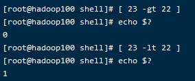
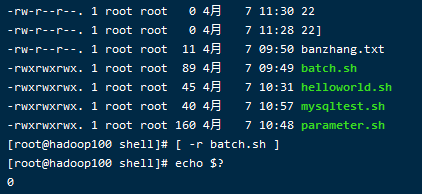
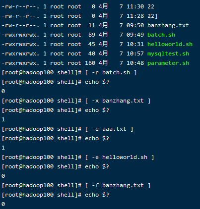
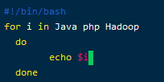

# 20-04-07

# Shell概念


代码,分为编译执行(java),解释执行(html,js,python,脚本,shell)

## shell解析器

位置:cat /etc/shells


sh软连到bash,用哪个都行,以后直接使用bin/bash即可


# 脚本编写

虽然linux不强调后缀,但推荐以.sh结尾,便于阅读

## 编写

第一行指定shell的解析器


## 给权限***


## 执行

### 方法一:bash/sh 命令名


等同于 /bin/bash helloworld.sh

因为已经指定执行器,因而这种执行方式内部声明的解析器没有起作用

### 方法二: .+路径+命令

直接执行helloworld.sh 需要环境变量里配置过(类似于win的环境变量)

用.当前路径或者用绝对路径


#### export  全局变量设置***

格式:export PATH=$PATH 路径


### 方法三:. 空格 命令


.空格 是在当前shell里去执行调用,而不是用父shell去调用子shell,调用完被释放

子shell 里面 export 的才能看到,有时候需要用到变量,又不想改变原有的值就在子shell里面异步处理

## 多命令处理

需求:在/home/atguigu/目录下创建一个banzhang.txt,在banzhang.txt文件中增加“I love cls”。


编写执行


# 自定义变量

## 基本语法

1. （1）定义变量：变量=值 (=两侧不允许有空格)
2. （2）撤销变量：unset 变量
3. （3）声明静态变量：readonly变量，注意：不能unset


## 变量定义规则

1. ​	变量名称可以由字母、数字和下划线组成，但是不能以数字开头，环境变量名建议大写。
2. ​	等号两侧不能有空格
3. ​	在bash中，变量默认类型都是字符串类型，无法直接进行数值运算。
4. ​	变量的值如果有空格，需要使用双引号或单引号括起来。


## 变量提升为全局变量


环境变量里配置的都是全局的

# $

- $:查看变量得用$+名字引用可查看系统变量


## $1

- $1:代表传进来的第一个参数


## $n

- ​	$n	（功能描述：n为数字，$0代表该脚本名称，$1-$9代表第一到第九个参数，十以上的参数，十以上的参数需要用大括号包含，如${10}）

（1）输出该脚本文件名称、输入参数1和输入参数2 的值

```shell
[atguigu@hadoop101 datas]$ touch parameter.sh 

[atguigu@hadoop101 datas]$ vim parameter.sh

\#!/bin/bash

echo "$0  $1  $2"

[atguigu@hadoop101 datas]$ chmod 777 parameter.sh

[atguigu@hadoop101 datas]$ ./parameter.sh cls  xz

./parameter.sh  cls  xz
```


## $#

- ​	$#	（功能描述：获取所有输入参数个数，常用于循环）。

获取输入参数的个数

```shell
[atguigu@hadoop101 datas]$ vim parameter.sh

 

\#!/bin/bash

echo "$0  $1  $2"

echo $#

 

[atguigu@hadoop101 datas]$ chmod 777 parameter.sh

 

[atguigu@hadoop101 datas]$ ./parameter.sh cls  xz

parameter.sh cls xz 

2
```


使用''来代表不解析


作用:可以用$#来做解析

## $*,$@

- ​	$*	（功能描述：这个变量代表命令行中所有的参数，$*把所有的参数看成一个整体）
- ​	$@	（功能描述：这个变量也代表命令行中所有的参数，不过$@把每个参数区分对待）


*会把AA BB CC看成一个值,而@会区分对待


## $？

看上一个命令是否执行成功,0成功,非0失败

$？	（功能描述：最后一次执行的命令的返回状态。如果这个变量的值为0，证明上一个命令正确执行；如果这个变量的值为非0（具体是哪个数，由命令自己来决定），则证明上一个命令执行不正确了。）


还可以获取函数的返回值

## 实例:通过shell实现mysql的启动,状态查看,停止


赋权执行:


# 运算符		

1．基本语法

（1）“$((运算式))”或“$[运算式]”

（2）expr  + , - , \*,  /,  %   加，减，乘，除，取余

注意：expr运算符间要有空格

2．案例实操： 

1. 计算3+2的值:expr 2 + 3

5


# 条件判断

1．基本语法

[ condition ]（注意condition前后要有空格）

注意：条件非空即为true，[ atguigu ]返回true，[] 返回false。

\2. 常用判断条件

（1）两个整数之间比较

= 字符串比较

-lt 小于（less than）         -le 小于等于（less equal）

-eq 等于（equal）           -gt 大于（greater than）

-ge 大于等于（greater equal）  -ne 不等于（Not equal）

（2）按照文件权限进行判断

-r 有读的权限（read）       -w 有写的权限（write）

-x 有执行的权限（execute）

（3）按照文件类型进行判断

-f 文件存在并且是一个常规的文件（file）

-e 文件存在（existence）      -d 文件存在并是一个目录（directory）

3．案例实操

​    （1）23是否大于等于22

[atguigu@hadoop101 datas]$ [ 23 -ge 22 ]

[atguigu@hadoop101 datas]$ echo $?

0



​    （2）helloworld.sh是否具有写权限

[atguigu@hadoop101 datas]$ [ -w helloworld.sh ]



​    （3）/home/atguigu/cls.txt目录中的文件是否存在 [ -e /home/atguigu/cls.txt ]



（4）多条件判断（&& 表示前一条命令执行成功时，才执行后一条命令，|| 表示上一条命令执行失败后，才执行下一条命令）

[atguigu@hadoop101 ~]$ [ condition ] && echo OK || echo notok

OK

[atguigu@hadoop101 datas]$ [ condition ] && [ ] || echo notok

notok

# 流程控制（重点）

## if 判断

1．基本语法

if [ 条件判断式 ];then

 程序

fi

或者

if  [ 条件判断式 ]

 then

  程序

fi

​    注意事项：

（1）[ 条件判断式 ]，中括号和条件判断式之间必须有空格

（2）if后要有空格

2．案例实操

（1）输入一个数字，如果是1，则输出banzhang zhen shuai，如果是2，则输出 cls zhen mei，如果是其它，什么也不输出。


```shell
[atguigu@hadoop101 datas]$ touch if.sh

[atguigu@hadoop101 datas]$ vim if.sh

 

\#!/bin/bash

 

if [ $1 -eq "1" ]

then

​    echo "banzhang zhen shuai"

elif [ $1 -eq "2" ]

then

​    echo "cls zhen mei"

fi

 

[atguigu@hadoop101 datas]$ chmod 777 if.sh

[atguigu@hadoop101 datas]$ ./if.sh 1

banzhang zhen shuai
```

## case 语句

1．基本语法

case $变量名 in

 "值1"）

  如果变量的值等于值1，则执行程序1

  ;;

 "值2"）

  如果变量的值等于值2，则执行程序2

  ;;

 …省略其他分支…

 *）

  如果变量的值都不是以上的值，则执行此程序

  ;;

esac

注意事项：

1)   case行尾必须为单词“in”，每一个模式匹配必须以右括号“）”结束。

2)   双分号“**;;**”表示命令序列结束，相当于java中的break。

3)   最后的“*）”表示默认模式，相当于java中的default。

2．案例实操

（1）输入一个数字，如果是1，则输出banzhang，如果是2，则输出cls，如果是其它，输出renyao。

```shell
!/bin/bash

case $1 in

"1")

​    echo "banzhang"

;;

"2")

​    echo "cls"

;;

*)

​    echo "renyao"

;;

esac
```


## for 循环

1．基本语法1

​    for (( 初始值;循环控制条件;变量变化 ))

 do

  程序

 done


2．案例实操

（1）从1加到100

```shell
\#!/bin/bash

s=0

for((i=0;i<=100;i++))

do

​    s=$[$s+$i]

done

echo $s
```


基本语法2

for 变量 in 值1 值2 值3…

 do

  程序

 done

后面有多少个值,就取出来多少次




4．案例实操

​    （1）打印所有输入参数

[atguigu@hadoop101 datas]$ touch for2.sh

[atguigu@hadoop101 datas]$ vim for2.sh

 

\#!/bin/bash

\#打印数字

 

for i in $*

  do

   echo "ban zhang love $i "

  done

 

[atguigu@hadoop101 datas]$ chmod 777 for2.sh

[atguigu@hadoop101 datas]$ bash for2.sh cls xz bd

ban zhang love cls

ban zhang love xz

ban zhang love bd


（2）比较$*和$@区别

（a）$*和$@都表示传递给函数或脚本的所有参数，不被双引号“”包含时，都以$1 $2 …$n的形式输出所有参数。

[atguigu@hadoop101 datas]$ touch for.sh[atguigu@hadoop101 datas]$ vim for.sh #!/bin/bash for i in $*do   echo "ban zhang love $i "done for j in $@do       echo "ban zhang love $j"done [atguigu@hadoop101 datas]$ bash for.sh cls xz bdban zhang love clsban zhang love xzban zhang love bdban zhang love clsban zhang love xzban zhang love bd

（b）当它们被双引号“”包含时，“$*”会将所有的参数作为一个整体，以“$1 $2 …$n”的形式输出所有参数；“$@”会将各个参数分开，以“$1” “$2”…”$n”的形式输出所有参数。

[atguigu@hadoop101 datas]$ vim for.sh

 

\#!/bin/bash

 

for i in "$*"

\#$*中的所有参数看成是一个整体，所以这个for循环只会循环一次

​    do

​        echo "ban zhang love $i"

​    done

 

for j in "$@"

\#$@中的每个参数都看成是独立的，所以“$@”中有几个参数，就会循环几次

​    do

​        echo "ban zhang love $j"

done

 

[atguigu@hadoop101 datas]$ chmod 777 for.sh

[atguigu@hadoop101 datas]$ bash for.sh cls xz bd

ban zhang love cls xz bd

ban zhang love cls

ban zhang love xz

ban zhang love bd

## while 循环

1．基本语法(方括号用le)

while  [ 条件判断式 ]

 do

  程序

 done

注意: while 后面需要有空格

2．案例实操

​    （1）从1加到100

```shell
\#!/bin/bash

s=0

i=1

while [ $i -le 100 ]

do

​    s=$[$s+$i]

​    i=$[$i+1]

done

 

echo $s
```


# 控制台输入

类似于scanner

1．基本语法

​    read(选项)(参数) 

​    选项：

-p：指定读取值时的提示符；

-t：指定读取值时等待的时间（秒）。

参数

​    变量：指定读取值的变量名

2．案例实操

​    （1）提示7秒内，读取控制台输入的名称

```shell
\#!/bin/bash
read -t 7 -p "Enter your name in 7 seconds " NAME

echo $NAME
```


脚本


读取多个值


# 函数

## 系统函数

1．basename基本语法

basename [string / pathname] [suffix]     （功能描述：basename命令会删掉所有的前缀包括最后一个（‘/’）字符，然后将字符串显示出来。

选项：

suffix为后缀，如果suffix被指定了，basename会将pathname或string中的suffix去掉。

（1）截取该/home/atguigu/banzhang.txt路径的文件名称

[atguigu@hadoop101 datas]$ basename /home/atguigu/banzhang.txt

[atguigu@hadoop101 datas]$ basename /home/atguigu/banzhang.txt .txt

\3.  dirname基本语法

​    dirname 文件绝对路径    （功能描述：从给定的包含绝对路径的文件名中去除文件名（非目录的部分），然后返回剩下的路径（目录的部分））

4．案例实操

（1）获取banzhang.txt文件的路径

[atguigu@hadoop101 ~]$ dirname /home/atguigu/banzhang.txt

一个获取名字,一个获取后缀


使用场景:处理成绝对路径访问多个结点

2．案例实操

## 自定义函数

1．基本语法(方括号function可省略)

[ function ] funname[()]

{

​    Action;

​    [return int;]

}

2．经验技巧

​    （1）必须在调用函数地方之前，先声明函数，shell脚本是逐行运行。不会像其它语言一样先编译。

​    （2）函数返回值，只能通过$?系统变量获得，可以显示加：return返回，如果不加，将以最后一条命令运行结果，作为返回值。

3．案例实操

​    （1）计算两个输入参数的和

```bash
\#!/bin/bash

function sum()

{

  s=0

  s=$[ $1 + $2 ]

  echo "$s"

}

 

read -p "Please input the number1: " n1;

read -p "Please input the number2: " n2;

sum $n1 $n2;
```


# Shell工具（重点）

## cut

cut的工作就是“剪”，具体的说就是在文件中负责剪切数据用的。cut 命令从文件的每一行剪切字节、字符和字段并将这些字节、字符和字段输出。

注:源文件不会被修改

1.基本用法

cut [选项参数]  filename

说明：默认分隔符是制表符

2.选项参数说明

| 选项参数 | 功能                         |
| -------- | ---------------------------- |
| cut -f   | 列号，提取第几列             |
| cut -d   | 分隔符，按照指定分隔符分割列 |

3.案例实操

（0）数据准备

dong shen

guan zhen

wo wo

lai lai

le le

（1）切割cut.txt第一列

[atguigu@hadoop101 datas]$ cut -d " " -f 1 cut.txt


（2）切割cut.txt第二、三列

[atguigu@hadoop101 datas]$ cut -d " " -f 2,3 cut.txt


（3）在cut.txt文件中切割出guan

[atguigu@hadoop101 datas]$ cat cut.txt | grep "guan" | cut -d " " -f 1


（4）选取系统PATH变量值，第2个“：”开始后的所有路径：echo $PATH | cut -d: -f 2-


（5）切割ifconfig 后打印的IP地址

 ifconfig | grep "inet " | cut -d "t" -f 2- | cut -d " " -f 2


## sed

sed是一种流编辑器，它一次处理一行内容。处理时，把当前处理的行存储在临时缓冲区中，称为“模式空间”，接着用sed命令处理缓冲区中的内容，处理完成后，把缓冲区的内容送往屏幕。接着处理下一行，这样不断重复，直到文件末尾。文件内容并没有改变，除非你使用重定向存储输出。

\1.   基本用法

sed [选项参数]  ‘command’ filename

\2.   选项参数说明

| 选项参数 | 功能                                  |
| -------- | ------------------------------------- |
| -e       | 直接在指令列模式上进行sed的动作编辑。 |

\3.   命令功能描述

| 命令 | 功能描述                              |
| ---- | ------------------------------------- |
| *a*  | 新增，a的后面可以接字串，在下一行出现 |
| d    | 删除                                  |
| s    | 查找并替换                            |

\4.   案例实操

（0）数据准备


（1）将“mei nv”这个单词插入到sed.txt第二行下，打印。

[atguigu@hadoop102 datas]$ sed '2a mei nv' sed.txt


注意：文件并没有改变

（2）删除sed.txt文件所有包含wo的行


（3）将sed.txt文件中wo替换为ni

[atguigu@hadoop102 datas]$ sed 's/wo/ni/g' sed.txt


注意：‘g’表示global，全部替换

（4）将sed.txt文件中的第二行删除并将wo替换为ni

[atguigu@hadoop102 datas]$ sed -e '2d' -e 's/wo/ni/g' sed.txt


修改的文件保存:


## awk

一个强大的文本查找处理,分析工具，把文件逐行的读入，以空格为默认分隔符将每行切片，切开的部分再进行分析处理。

\1.   基本用法

awk [选项参数] ‘pattern1{action1} pattern2{action2}...’ filename

pattern：表示AWK在数据中查找的内容，就是匹配模式

action：在找到匹配内容时所执行的一系列命令

\2.   选项参数说明

表10-4

| 选项参数 | 功能                 |
| -------- | -------------------- |
| -F       | 指定输入文件折分隔符 |
| -v       | 赋值一个用户定义变量 |

\3.   案例实操

（0）数据准备

[atguigu@hadoop102 datas]$ sudo cp /etc/passwd ./

（1）搜索passwd文件以root关键字开头的所有行，并输出该行的第7列。

[atguigu@hadoop102 datas]$ awk -F: '/^root/{print $7}' passwd


（2）搜索passwd文件以root关键字开头的所有行，并输出该行的第1列和第7列，中间以“，”号分割。

[atguigu@hadoop102 datas]$ awk -F: '/^root/{print $1","$7}' passwd


注意：只有匹配了pattern的行才会执行action

（3）只显示/etc/passwd的第一列和第七列，以逗号分割，且在所有行前面添加列名user，shell在最后一行添加"wyh, zuishuai"。

[atguigu@hadoop102 datas]$ awk -F : 'BEGIN{print "user, shell"} {print $1","$7} END{print "dahaige,/bin/zuishuai"}' passwd


注意：BEGIN 在所有数据读取行之前执行；END 在所有数据执行之后执行。

（4）将passwd文件中的用户id增加数值1并输出

[atguigu@hadoop102 datas]$ awk -v i=1 -F: '{print $3+i}' passwd


\4.   awk的内置变量

表10-5

| 变量     | 说明                                         |
| -------- | -------------------------------------------- |
| FILENAME | 文件名                                       |
| NR       | 已读的记录数(行号)                           |
| NF       | 浏览记录的域的个数（切割后，列的个数）(列号) |

\5.   案例实操

（1）统计passwd文件名，每行的行号，每行的列数

[atguigu@hadoop102 datas]$ awk -F: '{print "filename:" FILENAME ", linenumber:" NR ",columns:" NF}' passwd


​     （2）切割IP

[atguigu@hadoop102 datas]$ ifconfig eth0 | grep "inet addr" | awk -F: '{print $2}' | awk -F " " '{print $1}'

192.168.1.102

​     （3）查询sed.txt中空行所在的行号

[atguigu@hadoop102 datas]$ awk '/^$/{print NR}' sed.txt

5


这个功能和cat同样,但是awk可以指定列输出(0代表输出整行)


如果想要对齐:


在awk里,一横行叫做一个record,一竖行叫做一个field

nr:number of record 横行的数量

NF:number of field 竖行的数量

由此,要打印横行的数量:


AWK把空格当做连接符号,输出时两列连接在一起,因此要答应空格可以用,去替代默认的分隔符,当然也可以自定义制表分隔符


输出第三列为1986的写法:


awk会把空格也单算,因此这个会看做为三列


打印每一行有多少段


输出第七行的内容


输出有七段的内容


如果不输入文件名,则等待用户输入


如果有,存在的话,那么awt默认会把它们看做是一个整体

自定义分割符的写法:这个语句是把','变成了分隔符


输出分隔符也可以改成,


输入输出同时改变


awk后接两个文件,后面的文件内容会被拼接在内容之后****


## sort

sort命令是在Linux里非常有用，它将文件进行排序，并将排序结果标准输出。

\1.   基本语法

sort(选项)(参数)

表10-6

| 选项 | 说明                     |
| ---- | ------------------------ |
| -n   | 依照数值的大小排序       |
| -r   | 以相反的顺序来排序       |
| -t   | 设置排序时所用的分隔字符 |
| -k   | 指定需要排序的列         |

参数：指定待排序的文件列表

\2. 案例实操

（0）数据准备

[atguigu@hadoop102 datas]$ touch sort.sh

[atguigu@hadoop102 datas]$ vim sort.sh

bb:40:5.4

bd:20:4.2

xz:50:2.3

cls:10:3.5

ss:30:1.6

（1）按照“：”分割后的第三列倒序排序。

[atguigu@hadoop102 datas]$ sort -t : -nrk 3 sort.sh

bb:40:5.4

bd:20:4.2

cls:10:3.5

xz:50:2.3

ss:30:1.6


## wc

​    wc命令用来计算数字。利用wc指令我们可以计算文件的Byte数、字数或是列数，若不指定文件名称，或是所给予的文件名为“-”，则wc指令会从标准输入设备读取数据。

1. 基本用法

​       wc [选项参数] filename

2. 参数说明

| 选项参数 | 功能             |
| -------- | ---------------- |
| -l       | 统计文件行数     |
| -w       | 统计文件的单词数 |
| -m       | 统计文件的字符数 |
| -c       | 统计文件的字节数 |

​    3. 案例实操

​           统计文件的行数、单词数、字节数！


工具:uTools