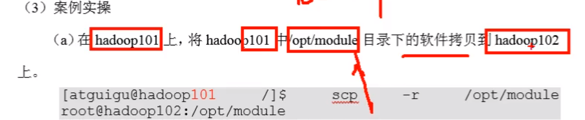

# 20-04-10

用户先编写好一个程序，我们称为Mapreduce程序，一个Mapreduce程序就是一个Job，而一个Job里面可以有一个或多个Task，Task又可以区分为Map Task和Reduce Task.

# 伪分布式配置$$$

## 配置HDFS

9:00-9:30

所有hadoop的配置文件都在:etc/hadoop目录下(/opt/module/hadoop-3.1.3/etc/hadoop)

### 配置hadoop-env.sh

配置javahome

### 配置core-site.xml

### 配置hdfs-site.xml

指定副本的数量(可略)

vim hadf-site.xml

dfs.replication

伪分布式不需要多个副本

## 格式化

第一次配置完成后格式化,后续直接启动即可

命令:hdfs namenode -format

完成界面:

多了data目录(前面配置的)和logs目录(hadoop运行期间的存储目录,出问题时可以进行查看)

## 启动namenode

hdfs --daemon start namenode

启动jps帮我们查看所有java的进程:

启动的namenode实际上一个java的进程,实质上是一个java类

访问namenode

hadoop给了我们个web页面可以访问它

9820是hadoop内部使用的端口号,外部访问是使用端口号9870

hdfs提供查看文件系统的工具

## 启动datanode

hdfs --daemon start datanode

同样也是Java类

## 建立目录$$$

hdfs dfs -mkdir /input

查看

上传文件

指定输出路径 9:42$$$

等同于

查看结果

hdfs的文件实质上存储到了data里面

data/temp/dfs:

文件路径

内部维护的一个文件

hadoop自身的文件系统

hdfs提供了web端,能看到上传的具体文件以及目录

## 配置Yarn$$$

复制

把这部分内容复制到configuration

指定mapper

启动

yarn界面

测试

看到正在跑的mn程序

linux调度这个资源,转成yarn去调度这个资源

# 配置文件说明

Hadoop配置文件分两类：默认配置文件和自定义配置文件，只有用户想修改某一默认配置值时，才需要修改自定义配置文件，更改相应属性值。

（1）默认配置文件：

| 要获取的默认文件     | 文件存放在Hadoop的jar包中的位置                            |
| -------------------- | ---------------------------------------------------------- |
| [core-default.xml]   | hadoop-common-3.1.3.jar/ core-default.xml                  |
| [hdfs-default.xml]   | hadoop-hdfs-3.1.3.jar/ hdfs-default.xml                    |
| [yarn-default.xml]   | hadoop-yarn-common-3.1.3.jar/ yarn-default.xml             |
| [mapred-default.xml] | hadoop-mapreduce-client-core-3.1.3.jar/ mapred-default.xml |

大部分可以直接用,可以直接改,	

（2）自定义配置文件：

​	***\*core-site.xml\*******\*、\*******\*hdfs-site.xml\*******\*、\*******\*yarn-site.xml\*******\*、\*******\*mapred-site.xml\****四个配置文件存放在$HADOOP_HOME/etc/hadoop这个路径上，用户可以根据项目需求重新进行修改配置。

# 分发

1424$$

scp:

前提

服务器与服务器的拷贝

提要求有这个权限

创建文件,更改权限

拷贝到

提示输入密码输入即可

从远处拿文件过来

把远端的东西拿给另外一台机器

然后输入密码就可以了

因为已经更改好权限,因而不需要添加sudo

rsync

差量同步

远程同步:远程拷贝的时候如果没有,就同步过去,如果有则进行全拷贝过去D:\Software\VM\Hadoop103

拷贝过来之后还要配置环境变量,配置文件用root文件去分发

