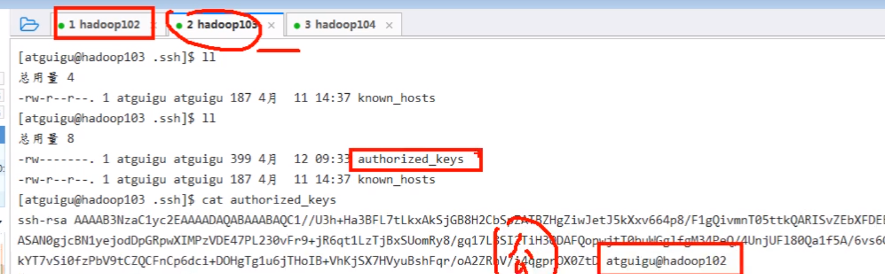
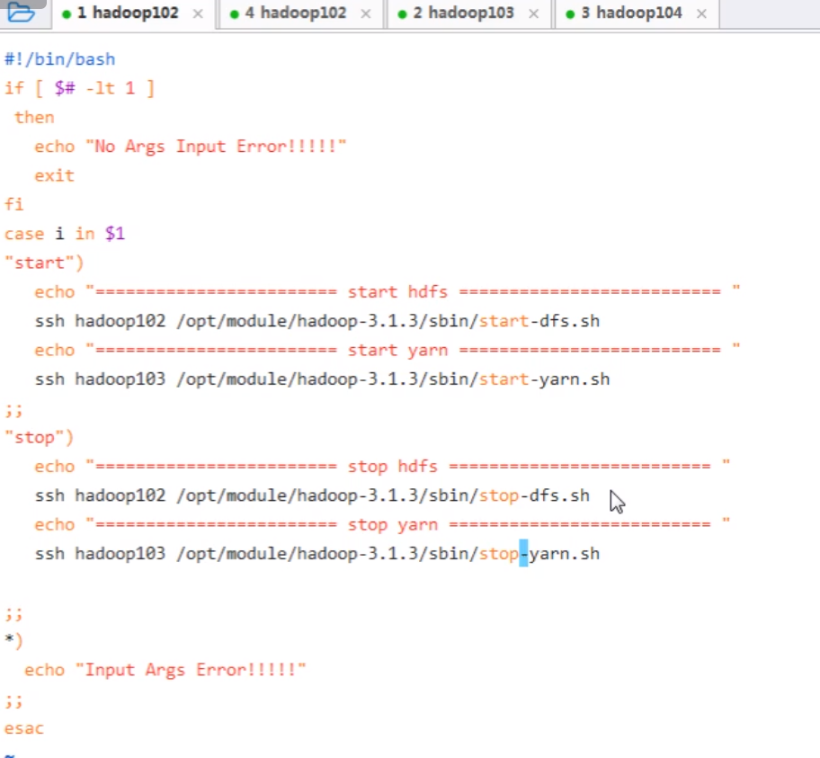
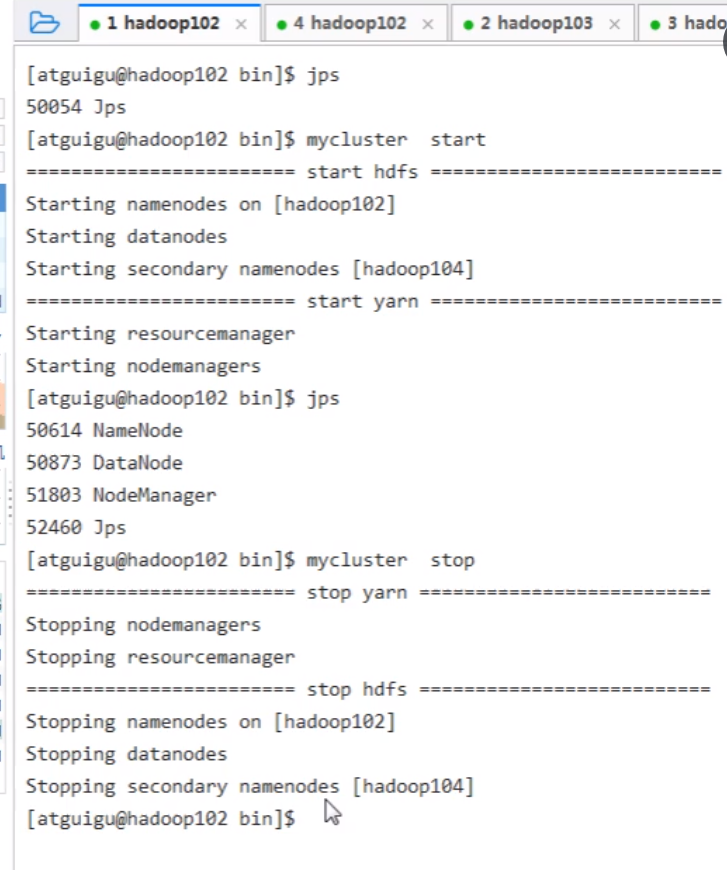
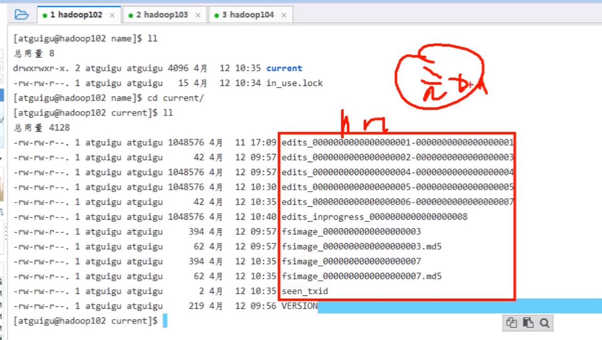

# 20-04-11

群起

ssh:安全shell,免令登录

通过ssh登录到另外一台虚拟机上

# ssh基础概念

加密算法

## ssh免令登录

ssh-keygen -t rsa,连续四次回车

生成到家里面

 known_hosts:远程登录过的机器

私钥:id_rsa

公钥: id_rsa.pub

可用cat查看

多出的文件

将公钥拷贝到要免密登录的目标机器上

ssh-copy-id hadoop102

ssh-copy-id hadoop103

ssh-copy-id hadoop104

# 群起集群

sbin里的脚本

start-all太多了,不需要全部启动

配置hadoop目录下的workers,设置启动的结点

vim workers

不能有空格和空行

分发

启动HDFS

启动yarn一定要在RM所在的节点去执行

由此,两个命令启动的集群,群停改成stop即可

## 新写两个脚本

vim一下

启动

效果

hdfs -p mkdir

-p:创建多层目录

上传一个文件,上传了三份(三副本维护)

NN

