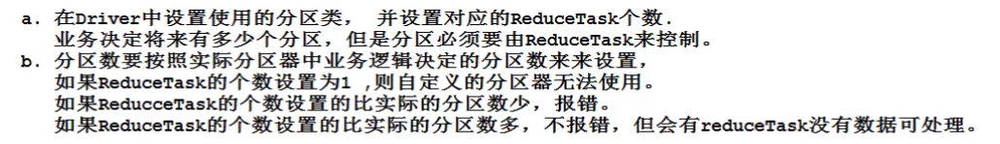

# 20-04-18

# 一、Shuffle


## 1. Shuffle机制

map出来的数据先进入一个环形缓冲区

环形缓冲区:一个存储连续的区域,可以理解为数组,数组到了80%往外按分区进行溢写,然后再根据字典序进行排序

各自分区排好序之后再进行归并排序(因为Maptask多,ReduceTask少,因此任务安排在Map中)

排好序之后再进行合并,压缩,写入磁盘


多个Map再写内存,写内存进行排序,最后再进行归并成一个大的文件


# 二、Partition分区

### 1 源码

设置分区数


可以控制有多个分区


分区器:默认使用hashPartition,趋于,值只有0和1


```java
public class HashPartitioner<K, V> extends Partitioner<K, V> {
//获取分区号,根据key的值对reduceTask的个数来进行取余操作计算分区
  public int getPartition(K key, V value, int numReduceTasks) {
    return (key.hashCode() & Integer.MAX_VALUE) % numReduceTasks;
      //与运算之后再进行numReduceTasks操作,算出来是几就去往几号分区
  }

}

```


等于1直接等于1-1等于0,分区号即为0,即所谓的0号分区

通过反射的放射创建分区器

getPationerClass点进去是个抽象类,这是抽象类的具体实现类:


获取对应对象,没有的话就返回HashPartioner.class

这个是partioner的全类名


写出KV要计算KV对应的分区号:


KV被收集到缓冲区时,要先把分区号计算出来


### 2 案例(自定义分区)

手机号136、137、138、139开头都分别放到一个独立的4个文件中，其他开头的放到一个文件中。

#### 2.1. 自定义的分区类

增加一个自定义的分区类,Map走出来的KV会走这个分区器

```java
package com.atguigu.mapreduce.flowsum;
import org.apache.hadoop.io.Text;
import org.apache.hadoop.mapreduce.Partitioner;

public class ProvincePartitioner extends Partitioner<Text, FlowBean> {

	@Override
	public int getPartition(Text key, FlowBean value, int numPartitions) {

		// 1 获取电话号码的前三位(当前key就是手机号)
		String preNum = key.toString().substring(0, 3);
		
		int partition = 4;
		
		// 2 判断是哪个省
		if ("136".equals(preNum)) {
			partition = 0;
		}else if ("137".equals(preNum)) {
			partition = 1;
		}else if ("138".equals(preNum)) {
			partition = 2;
		}else if ("139".equals(preNum)) {
			partition = 3;
		}

		return partition;
	}
}
```

业务逻辑也可以这么写:


#### 2.2. FlowsumDriver

在驱动函数中增加自定义数据分区设置和ReduceTask设置

```java
package com.atguigu.mapreduce.flowsum;
import java.io.IOException;
import org.apache.hadoop.conf.Configuration;
import org.apache.hadoop.fs.Path;
import org.apache.hadoop.io.Text;
import org.apache.hadoop.mapreduce.Job;
import org.apache.hadoop.mapreduce.lib.input.FileInputFormat;
import org.apache.hadoop.mapreduce.lib.output.FileOutputFormat;

public class FlowsumDriver {

	public static void main(String[] args) throws IllegalArgumentException, IOException, ClassNotFoundException, InterruptedException {

		// 输入输出路径需要根据自己电脑上实际的输入输出路径设置
		args = new String[]{"e:/output1","e:/output2"};

		// 1 获取配置信息，或者job对象实例
		Configuration configuration = new Configuration();
		Job job = Job.getInstance(configuration);

		// 2 指定本程序的jar包所在的本地路径
		job.setJarByClass(FlowsumDriver.class);

		// 3 指定本业务job要使用的mapper/Reducer业务类
		job.setMapperClass(FlowCountMapper.class);
		job.setReducerClass(FlowCountReducer.class);

		// 4 指定mapper输出数据的kv类型
		job.setMapOutputKeyClass(Text.class);
		job.setMapOutputValueClass(FlowBean.class);

		// 5 指定最终输出的数据的kv类型
		job.setOutputKeyClass(Text.class);
		job.setOutputValueClass(FlowBean.class);

		// 8 指定自定义数据分区***自定义分区器
		job.setPartitionerClass(ProvincePartitioner.class);

		// 9 同时指定相应数量的reduce task的个数(因为这个案例决定了有五个分区)
		job.setNumReduceTasks(5);
		
		// 6 指定job的输入原始文件所在目录
		FileInputFormat.setInputPaths(job, new Path(args[0]));
		FileOutputFormat.setOutputPath(job, new Path(args[1]));

		// 7 将job中配置的相关参数，以及job所用的java类所在的jar包， 提交给yarn去运行
		boolean result = job.waitForCompletion(true);
		System.exit(result ? 0 : 1);
	}
}
```



#### 2.3. 其他

和过往一样,Bean

```java
package com.atguigu.mapreduce.flowsum;
import java.io.DataInput;
import java.io.DataOutput;
import java.io.IOException;
import org.apache.hadoop.io.Writable;

// 1 实现writable接口
public class FlowBean implements Writable{

	private long upFlow;
	private long downFlow;
	private long sumFlow;
	
	//2  反序列化时，需要反射调用空参构造函数，所以必须有
	public FlowBean() {
		super();
	}

	public FlowBean(long upFlow, long downFlow) {
		super();
		this.upFlow = upFlow;
		this.downFlow = downFlow;
		this.sumFlow = upFlow + downFlow;
	}
	
	//3  写序列化方法
	@Override
	public void write(DataOutput out) throws IOException {
		out.writeLong(upFlow);
		out.writeLong(downFlow);
		out.writeLong(sumFlow);
	}
	
	//4 反序列化方法
	//5 反序列化方法读顺序必须和写序列化方法的写顺序必须一致
	@Override
	public void readFields(DataInput in) throws IOException {
		this.upFlow  = in.readLong();
		this.downFlow = in.readLong();
		this.sumFlow = in.readLong();
	}

	// 6 编写toString方法，方便后续打印到文本
	@Override
	public String toString() {
		return upFlow + "\t" + downFlow + "\t" + sumFlow;
	}

	public long getUpFlow() {
		return upFlow;
	}

	public void setUpFlow(long upFlow) {
		this.upFlow = upFlow;
	}

	public long getDownFlow() {
		return downFlow;
	}

	public void setDownFlow(long downFlow) {
		this.downFlow = downFlow;
	}

	public long getSumFlow() {
		return sumFlow;
	}

	public void setSumFlow(long sumFlow) {
		this.sumFlow = sumFlow;
	}
}
```

Mapper类

```java
package com.atguigu.mapreduce.flowsum;
import java.io.IOException;
import org.apache.hadoop.io.LongWritable;
import org.apache.hadoop.io.Text;
import org.apache.hadoop.mapreduce.Mapper;

public class FlowCountMapper extends Mapper<LongWritable, Text, Text, FlowBean>{
	
	FlowBean v = new FlowBean();
	Text k = new Text();
	
	@Override
	protected void map(LongWritable key, Text value, Context context)	throws IOException, InterruptedException {
		
		// 1 获取一行
		String line = value.toString();
		
		// 2 切割字段
		String[] fields = line.split("\t");
		
		// 3 封装对象
		// 取出手机号码
		String phoneNum = fields[1];

		// 取出上行流量和下行流量
		long upFlow = Long.parseLong(fields[fields.length - 3]);
		long downFlow = Long.parseLong(fields[fields.length - 2]);

		k.set(phoneNum);
		v.set(downFlow, upFlow);
		
		// 4 写出
		context.write(k, v);
	}
}
```

Reducer类

```java
package com.atguigu.mapreduce.flowsum;
import java.io.IOException;
import org.apache.hadoop.io.Text;
import org.apache.hadoop.mapreduce.Reducer;

public class FlowCountReducer extends Reducer<Text, FlowBean, Text, FlowBean> {

	@Override
	protected void reduce(Text key, Iterable<FlowBean> values, Context context)throws IOException, InterruptedException {

		long sum_upFlow = 0;
		long sum_downFlow = 0;

		// 1 遍历所用bean，将其中的上行流量，下行流量分别累加
		for (FlowBean flowBean : values) {
			sum_upFlow += flowBean.getUpFlow();
			sum_downFlow += flowBean.getDownFlow();
		}

		// 2 封装对象
		FlowBean resultBean = new FlowBean(sum_upFlow, sum_downFlow);
		
		// 3 写出
		context.write(key, resultBean);
	}
}
```

Driver驱动类

```java
package com.atguigu.mapreduce.flowsum;
import java.io.IOException;
import org.apache.hadoop.conf.Configuration;
import org.apache.hadoop.fs.Path;
import org.apache.hadoop.io.Text;
import org.apache.hadoop.mapreduce.Job;
import org.apache.hadoop.mapreduce.lib.input.FileInputFormat;
import org.apache.hadoop.mapreduce.lib.output.FileOutputFormat;

public class FlowsumDriver {

	public static void main(String[] args) throws IllegalArgumentException, IOException, ClassNotFoundException, InterruptedException {
		
// 输入输出路径需要根据自己电脑上实际的输入输出路径设置
args = new String[] { "e:/input/inputflow", "e:/output1" };

		// 1 获取配置信息，或者job对象实例
		Configuration configuration = new Configuration();
		Job job = Job.getInstance(configuration);

		// 6 指定本程序的jar包所在的本地路径
		job.setJarByClass(FlowsumDriver.class);

		// 2 指定本业务job要使用的mapper/Reducer业务类
		job.setMapperClass(FlowCountMapper.class);
		job.setReducerClass(FlowCountReducer.class);

		// 3 指定mapper输出数据的kv类型
		job.setMapOutputKeyClass(Text.class);
		job.setMapOutputValueClass(FlowBean.class);

		// 4 指定最终输出的数据的kv类型
		job.setOutputKeyClass(Text.class);
		job.setOutputValueClass(FlowBean.class);
		
		// 5 指定job的输入原始文件所在目录
		FileInputFormat.setInputPaths(job, new Path(args[0]));
		FileOutputFormat.setOutputPath(job, new Path(args[1]));

		// 7 将job中配置的相关参数，以及job所用的java类所在的jar包， 提交给yarn去运行
		boolean result = job.waitForCompletion(true);
		System.exit(result ? 0 : 1);
	}
}
```


# 三、 WritableComparable排序***

### 1. 概念

Map>>Reduce

MapTask和 Reduce task均会对数据按照key进行排序。该操作属于Hadoop的默认行为。任何应用程序中的据均会被排序，而不管逻辑上是否需要默认排序是按照字典顺序排序，且实现该排序的方法是快速排序。


### 2. 排序分类

- 部分排序
- 全排序
- 辅助排序：（GroupingComparator分组）
- 二次排序


### 3. 案例(全排序)

对总流量进行排序。

- FlowBean 类

```java
package com.atguigu.mapreduce.sort;
import java.io.DataInput;
import java.io.DataOutput;
import java.io.IOException;
import org.apache.hadoop.io.WritableComparable;

public class FlowBean implements WritableComparable<FlowBean> {//二合一接口,或者写两个都可以
//加泛型:同类型进行比较
	private long upFlow;
	private long downFlow;
	private long sumFlow;

	// 反序列化时，需要反射调用空参构造函数，所以必须有
	public FlowBean() {
		super();
	}

	public FlowBean(long upFlow, long downFlow) {
		super();
		this.upFlow = upFlow;
		this.downFlow = downFlow;
		this.sumFlow = upFlow + downFlow;
	}

	public void set(long upFlow, long downFlow) {
		this.upFlow = upFlow;
		this.downFlow = downFlow;
		this.sumFlow = upFlow + downFlow;
	}

	public long getSumFlow() {
		return sumFlow;
	}

	public void setSumFlow(long sumFlow) {
		this.sumFlow = sumFlow;
	}	

	public long getUpFlow() {
		return upFlow;
	}

	public void setUpFlow(long upFlow) {
		this.upFlow = upFlow;
	}

	public long getDownFlow() {
		return downFlow;
	}

	public void setDownFlow(long downFlow) {
		this.downFlow = downFlow;
	}

	/**
	 * 序列化方法
	 * @param out
	 * @throws IOException
	 */
	@Override
	public void write(DataOutput out) throws IOException {
		out.writeLong(upFlow);
		out.writeLong(downFlow);
		out.writeLong(sumFlow);
	}

	/**
	 * 反序列化方法 注意反序列化的顺序和序列化的顺序完全一致
	 * @param in
	 * @throws IOException
	 */
	@Override
	public void readFields(DataInput in) throws IOException {
		upFlow = in.readLong();
		downFlow = in.readLong();
		sumFlow = in.readLong();
	}

	@Override
	public String toString() {
		return upFlow + "\t" + downFlow + "\t" + sumFlow;
	}

	@Override
	public int compareTo(FlowBean bean) {
		
		int result;
		
		// 按照总流量大小，倒序排列
        //正数往上走
		if (sumFlow > bean.getSumFlow()) {
			result = -1;
		}else if (sumFlow < bean.getSumFlow()) {
			result = 1;
		}else {
			result = 0;
		}

		return result;
	}
}
```

排序逻辑也可以这么表达:


- Mapper类

```java
package com.atguigu.mapreduce.sort;
import java.io.IOException;
import org.apache.hadoop.io.LongWritable;
import org.apache.hadoop.io.Text;
import org.apache.hadoop.mapreduce.Mapper;

public class FlowCountSortMapper extends Mapper<LongWritable, Text, FlowBean, Text>{
//key是flowbean对象
	FlowBean bean = new FlowBean();
	Text v = new Text();

	@Override
	protected void map(LongWritable key, Text value, Context context)	throws IOException, InterruptedException {

		// 1 获取一行
		String line = value.toString();
		
		// 2 截取
		String[] fields = line.split("\t");
		
		// 3 封装对象
		String phoneNbr = fields[0];
		long upFlow = Long.parseLong(fields[1]);
		long downFlow = Long.parseLong(fields[2]);
		
		bean.set(upFlow, downFlow);
		v.set(phoneNbr);
		
		// 4 输出
		context.write(bean, v);
	}
}
```

封装另一表达


- Reducer类

```java
package com.atguigu.mapreduce.sort;
import java.io.IOException;
import org.apache.hadoop.io.Text;
import org.apache.hadoop.mapreduce.Reducer;

public class FlowCountSortReducer extends Reducer<FlowBean, Text, Text, FlowBean>{

	@Override
	protected void reduce(FlowBean key, Iterable<Text> values, Context context)	throws IOException, InterruptedException {
		
		// 循环输出，避免总流量相同情况(因为对象比较比较的是总流量)
        //手机号不同,总流量相同:同一组KV,进入一个Reduce方法,相当于不同手机号汇总在一起
        //手机号相同,总流量不同:分开处理(忽略)
		for (Text text : values) {
			context.write(text, key);
		}//直接迭代values,将每个手机号直接写出
	}
}
```

Driver类

```java
package com.atguigu.mapreduce.sort;
import java.io.IOException;
import org.apache.hadoop.conf.Configuration;
import org.apache.hadoop.fs.Path;
import org.apache.hadoop.io.Text;
import org.apache.hadoop.mapreduce.Job;
import org.apache.hadoop.mapreduce.lib.input.FileInputFormat;
import org.apache.hadoop.mapreduce.lib.output.FileOutputFormat;

public class FlowCountSortDriver {

	public static void main(String[] args) throws ClassNotFoundException, IOException, InterruptedException {

		// 输入输出路径需要根据自己电脑上实际的输入输出路径设置
		args = new String[]{"e:/output1","e:/output2"};

		// 1 获取配置信息，或者job对象实例
		Configuration configuration = new Configuration();
		Job job = Job.getInstance(configuration);

		// 2 指定本程序的jar包所在的本地路径
		job.setJarByClass(FlowCountSortDriver.class);

		// 3 指定本业务job要使用的mapper/Reducer业务类
		job.setMapperClass(FlowCountSortMapper.class);
		job.setReducerClass(FlowCountSortReducer.class);

		// 4 指定mapper输出数据的kv类型
		job.setMapOutputKeyClass(FlowBean.class);
		job.setMapOutputValueClass(Text.class);

		// 5 指定最终输出的数据的kv类型
		job.setOutputKeyClass(Text.class);
		job.setOutputValueClass(FlowBean.class);

		// 6 指定job的输入原始文件所在目录
		FileInputFormat.setInputPaths(job, new Path(args[0]));
		FileOutputFormat.setOutputPath(job, new Path(args[1]));
		
		// 7 将job中配置的相关参数，以及job所用的java类所在的jar包， 提交给yarn去运行
		boolean result = job.waitForCompletion(true);
		System.exit(result ? 0 : 1);
	}
}
```


### 4. 案例(分区排序)

相比于全排序剁了个分区而已

增加自定义分区类，分区按照省份手机号设置。

- 自定义分区类

```java
package com.atguigu.mapreduce.sort;
import org.apache.hadoop.io.Text;
import org.apache.hadoop.mapreduce.Partitioner;

public class ProvincePartitioner extends Partitioner<FlowBean, Text> {

	@Override
	public int getPartition(FlowBean key, Text value, int numPartitions) {
		
		// 1 获取手机号码前三位
		String preNum = value.toString().substring(0, 3);
		
		int partition = 4;
		
		// 2 根据手机号归属地设置分区
		if ("136".equals(preNum)) {
			partition = 0;
		}else if ("137".equals(preNum)) {
			partition = 1;
		}else if ("138".equals(preNum)) {
			partition = 2;
		}else if ("139".equals(preNum)) {
			partition = 3;
		}

		return partition;
	}
}
```

另一种分区写法:


- 在驱动类中添加分区类

```java
// 加载自定义分区类
job.setPartitionerClass(ProvincePartitioner.class);

// 设置Reducetask个数
job.setNumReduceTasks(5);
```


## 四、Combiner合并

### 1. 概念

合并:


因为Maptask多,希望它承担作业多


提前做一个局部汇总,让reduce对多个maptask进行全局汇总


### 2. 注意点

（1）Combiner是MR程序中Mapper和Reducer之外的一种组件。

（2）Combiner组件的父类就是Reducer。

（3）Combiner和Reducer的区别在于运行的位置:Combiner是在每一个MapTask所在的节点运行;Reducer是接收全局所有Mapper的输出结果；

（4）Combiner的意义就是对每一个MapTask的输出进行局部汇总，以减小网络传输量。

（5）Combiner能够应用的前提是不能影响最终的业务逻辑，而且，Combiner的输出kv应该跟Reducer的输入kv类型要对应起来。


### 3. 实现

自定义一个Combiner继承Reducer，重写Reduce方法

```java
public class WordcountCombiner extends Reducer<Text, IntWritable, Text,IntWritable>{

    //combiner组件还是要继承 Reducer，但是 Combiner是在 MapTask运行的。
	@Override
	protected void reduce(Text key, Iterable<IntWritable> values,Context context) throws IOException, InterruptedException {

        // 1 在每个MapTask中进行局部汇总数据
		int count = 0;
		for(IntWritable v :values){
			count += v.get();
		}

        // 2 写出
		context.write(key, new IntWritable(count));
	}
}
```


在Job驱动类中设置：

```java
job.setCombinerClass(WordcountCombiner.class);
```


以后可以直接用Reduce来用不用在特别自定义


 

### 4. 分组比较源码

#### 14:00-14:20$$$

实际在 Hadoop自身的序列化类型中，都已经定义好了对应的分组比较器

例如,Test类中:


hadoop启动了,静态进行注册,分组比较器放到map里面


在运行MR程序时,hadoop会将自身的序列化类型及对应的分组比较器注册到WritableComparator中的comparators的map中,例如在Test类中:


同样,其他的比较也是一样的道理


MR中如何获取当前key类型的分组比较器


1


没加载到强行初始化,初始化的时候会重新进行类加载,如果还获取不到则就null一个,然后把比较器返回


类加载的时候注册


new


### 5. 自定义比较器对象

继承WritableComparator,提供构造方法,重写这个compare方法:


能走到分组比较都可以被比较和被序列化

如果一个key没有提供比较器对象,默认会使用key对应的类中的compareTo方法来进行分组比较


使用场景:排序规则和分组规则不同的时候可以使用


### 6. 案例

有如下订单数据


现在需要求出每一个订单中最贵的商品。


先按订单id进行排序,然后通过分组id对价格进行排序(排序方式不同)

**OrderBean类**

```java
package com.atguigu.mapreduce.order;
import java.io.DataInput;
import java.io.DataOutput;
import java.io.IOException;
import org.apache.hadoop.io.WritableComparable;

public class OrderBean implements WritableComparable<OrderBean> {

	private int order_id; // 订单id号
	private double price; // 价格

	public OrderBean() {
		super();
	}

	public OrderBean(int order_id, double price) {
		super();
		this.order_id = order_id;
		this.price = price;
	}

	@Override
	public void write(DataOutput out) throws IOException {
		out.writeInt(order_id);//writeUTF
		out.writeDouble(price);
	}

	@Override
	public void readFields(DataInput in) throws IOException {
		order_id = in.readInt();//writeUTF
		price = in.readDouble();
	}

	@Override
	public String toString() {
		return order_id + "\t" + price;
	}

	public int getOrder_id() {
		return order_id;
	}

	public void setOrder_id(int order_id) {
		this.order_id = order_id;
	}

	public double getPrice() {
		return price;
	}

	public void setPrice(double price) {
		this.price = price;
	}

	// 二次排序
    //比较规则:按照订单id升序,价格降序
	@Override
	public int compareTo(OrderBean o) {

		int result;

		if (order_id > o.getOrder_id()) {
			result = 1;
		} else if (order_id < o.getOrder_id()) {
			result = -1;
		} else {
			// 价格倒序排序
			result = price > o.getPrice() ? -1 : 1;
		}

		return result;
	}
}
```


**OrderSortMapper类**

```java
package com.atguigu.mapreduce.order;
import java.io.IOException;
import org.apache.hadoop.io.LongWritable;
import org.apache.hadoop.io.NullWritable;
import org.apache.hadoop.io.Text;
import org.apache.hadoop.mapreduce.Mapper;

public class OrderMapper extends Mapper<LongWritable, Text, OrderBean, NullWritable> // NullWritable:空
{

	OrderBean k = new OrderBean();
	
	@Override
	protected void map(LongWritable key, Text value, Context context) throws IOException, InterruptedException {
		
		// 1 获取一行
		String line = value.toString();
		
		// 2 截取
		String[] fields = line.split("\t");
		
		// 3 封装对象
		k.setOrder_id(Integer.parseInt(fields[0]));
		k.setPrice(Double.parseDouble(fields[2]));
		
		// 4 写出
		context.write(k, NullWritable.get());
	}
}
```


**OrderSortGroupingComparator类**

```java
package com.atguigu.mapreduce.order;
import org.apache.hadoop.io.WritableComparable;
import org.apache.hadoop.io.WritableComparator;

public class OrderGroupingComparator extends WritableComparator {

	protected OrderGroupingComparator() {
		super(OrderBean.class, true);
	}

	@Override
	public int compare(WritableComparable a, WritableComparable b) {

		OrderBean aBean = (OrderBean) a;
		OrderBean bBean = (OrderBean) b;

		int result;
		if (aBean.getOrder_id() > bBean.getOrder_id()) {
			result = 1;
		} else if (aBean.getOrder_id() < bBean.getOrder_id()) {
			result = -1;
		} else {
			result = 0;
		}

		return result;
	}
}
```


**OrderSortReducer类**

进入到一个 reduce方法的key，订单id一定都是一样的，且价格是倒序排序好的。

```java
package com.atguigu.mapreduce.order;
import java.io.IOException;
import org.apache.hadoop.io.NullWritable;
import org.apache.hadoop.mapreduce.Reducer;

public class OrderReducer extends Reducer<OrderBean, NullWritable, OrderBean, NullWritable> {

	@Override
	protected void reduce(OrderBean key, Iterable<NullWritable> values, Context context)		throws IOException, InterruptedException {
		//因为有序,因此直接把第一个写出即可,也可以用迭代器对象
        //context. write （key, values.iterator（）.next ））i
		context.write(key, NullWritable.get());
	}
}
```

**OrderSortDriver类**

```java
package com.atguigu.mapreduce.order;
import java.io.IOException;
import org.apache.hadoop.conf.Configuration;
import org.apache.hadoop.fs.Path;
import org.apache.hadoop.io.NullWritable;
import org.apache.hadoop.mapreduce.Job;
import org.apache.hadoop.mapreduce.lib.input.FileInputFormat;
import org.apache.hadoop.mapreduce.lib.output.FileOutputFormat;

public class OrderDriver {

	public static void main(String[] args) throws Exception, IOException {

// 输入输出路径需要根据自己电脑上实际的输入输出路径设置
		args  = new String[]{"e:/input/inputorder" , "e:/output1"};

		// 1 获取配置信息
		Configuration conf = new Configuration();
		Job job = Job.getInstance(conf);

		// 2 设置jar包加载路径
		job.setJarByClass(OrderDriver.class);

		// 3 加载map/reduce类
		job.setMapperClass(OrderMapper.class);
		job.setReducerClass(OrderReducer.class);

		// 4 设置map输出数据key和value类型
		job.setMapOutputKeyClass(OrderBean.class);
		job.setMapOutputValueClass(NullWritable.class);

		// 5 设置最终输出数据的key和value类型
		job.setOutputKeyClass(OrderBean.class);
		job.setOutputValueClass(NullWritable.class);

		// 6 设置输入数据和输出数据路径
		FileInputFormat.setInputPaths(job, new Path(args[0]));
		FileOutputFormat.setOutputPath(job, new Path(args[1]));

		// 8 设置reduce端的分组
	job.setGroupingComparatorClass(OrderGroupingComparator.class);

		// 7 提交
		boolean result = job.waitForCompletion(true);
		System.exit(result ? 0 : 1);
	}
}
```

# 五、OutputFormat数据输出

## 1. 接口实现类

负责reduce端数据的输出

getRecordwriter（）：获取 Recordwriter对象，负责数据的输出

checkoutputspecs（）：检查输出路径

子抽象类：
FileoutputFormat 

​			checkoutputspecs（）：对该方法做了默认的实现

具体实现类

fextoutputFormat:hadoop默认使用的 outputFormat 

SequenceFileoutputFormat：格式的二进制文件

## 2. 自定义OutputFormat$$$

过滤输入的log日志，包含atguigu的网站输出到e:/atguigu.log，不包含atguigu的网站输出到e:/other.log。

FilterMapper类

```java
package com.atguigu.mapreduce.outputformat;
import java.io.IOException;
import org.apache.hadoop.io.LongWritable;
import org.apache.hadoop.io.NullWritable;
import org.apache.hadoop.io.Text;
import org.apache.hadoop.mapreduce.Mapper;

public class FilterMapper extends Mapper<LongWritable, Text, Text, NullWritable>{
	
	@Override
	protected void map(LongWritable key, Text value, Context context)	throws IOException, InterruptedException {

		// 获取一行数据,直接写出即可
		context.write(value, NullWritable.get());
	}
}
```


FilterReducer类

```java
package com.atguigu.mapreduce.outputformat;
import java.io.IOException;
import org.apache.hadoop.io.NullWritable;
import org.apache.hadoop.io.Text;
import org.apache.hadoop.mapreduce.Reducer;

public class FilterReducer extends Reducer<Text, NullWritable, Text, NullWritable> {

Text k = new Text();

	@Override
	protected void reduce(Text key, Iterable<NullWritable> values, Context context)		throws IOException, InterruptedException {

       // 1 获取一行
		String line = key.toString();

       // 2 拼接
		line = line + "\r\n";

       // 3 设置key
       k.set(line);

       // 4 输出
		context.write(k, NullWritable.get());
	}
}
```

迭代value


OutputFormat类

自定义 outputformat需要继承Fileoutputformat，并重写 getRecordwriter方法(复制数据的写出)

```java
package com.atguigu.mapreduce.outputformat;
import java.io.IOException;
import org.apache.hadoop.io.NullWritable;
import org.apache.hadoop.io.Text;
import org.apache.hadoop.mapreduce.RecordWriter;
import org.apache.hadoop.mapreduce.TaskAttemptContext;
import org.apache.hadoop.mapreduce.lib.output.FileOutputFormat;

public class FilterOutputFormat extends FileOutputFormat<Text, NullWritable>{

	@Override
	public RecordWriter<Text, NullWritable> getRecordWriter(TaskAttemptContext job)			throws IOException, InterruptedException {

		// 创建一个RecordWriter
		return new FilterRecordWriter(job);
	}
}
```


RecordWriter类

自定义 Recordwriter，需要继承 Recordwriter类，并重写 write和close方法

```java
package com.atguigu.mapreduce.outputformat;
import java.io.IOException;
import org.apache.hadoop.fs.FSDataOutputStream;
import org.apache.hadoop.fs.FileSystem;
import org.apache.hadoop.fs.Path;
import org.apache.hadoop.io.NullWritable;
import org.apache.hadoop.io.Text;
import org.apache.hadoop.mapreduce.RecordWriter;
import org.apache.hadoop.mapreduce.TaskAttemptContext;
 //需求:包含 atgulgu，写到a:/ output/ atguigu.1og
// 其他的数据写到d:/ output/ other.1og

public class FilterRecordWriter extends RecordWriter<Text, NullWritable> {

	FSDataOutputStream atguiguOut = null;
	FSDataOutputStream otherOut = null;

	public FilterRecordWriter(TaskAttemptContext job) {

		// 1 获取文件系统
		FileSystem fs;

		try {
			fs = FileSystem.get(job.getConfiguration());

			// 2 创建输出文件路径
			Path atguiguPath = new Path("e:/atguigu.log");
			Path otherPath = new Path("e:/other.log");

			// 3 创建输出流
			atguiguOut = fs.create(atguiguPath);
			otherOut = fs.create(otherPath);
		} catch (IOException e) {
			e.printStackTrace();
		}
	}

	@Override
	public void write(Text key, NullWritable value) throws IOException, InterruptedException {

		// 判断是否包含“atguigu”输出到不同文件
		if (key.toString().contains("atguigu")) {
			atguiguOut.write(key.toString().getBytes());
		} else {
			otherOut.write(key.toString().getBytes());
		}
	}

	@Override
	public void close(TaskAttemptContext context) throws IOException, InterruptedException {

		// 关闭资源
IOUtils.closeStream(atguiguOut);
		IOUtils.closeStream(otherOut);	}
}
```

也可以


FilterDriver类

```java
package com.atguigu.mapreduce.outputformat;
import org.apache.hadoop.conf.Configuration;
import org.apache.hadoop.fs.Path;
import org.apache.hadoop.io.NullWritable;
import org.apache.hadoop.io.Text;
import org.apache.hadoop.mapreduce.Job;
import org.apache.hadoop.mapreduce.lib.input.FileInputFormat;
import org.apache.hadoop.mapreduce.lib.output.FileOutputFormat;

public class FilterDriver {

	public static void main(String[] args) throws Exception {

// 输入输出路径需要根据自己电脑上实际的输入输出路径设置
args = new String[] { "e:/input/inputoutputformat", "e:/output2" };

		Configuration conf = new Configuration();
		Job job = Job.getInstance(conf);

		job.setJarByClass(FilterDriver.class);
		job.setMapperClass(FilterMapper.class);
		job.setReducerClass(FilterReducer.class);

		job.setMapOutputKeyClass(Text.class);
		job.setMapOutputValueClass(NullWritable.class);
		
		job.setOutputKeyClass(Text.class);
		job.setOutputValueClass(NullWritable.class);

		// 要将自定义的输出格式组件设置到job中
		job.setOutputFormatClass(FilterOutputFormat.class);

		FileInputFormat.setInputPaths(job, new Path(args[0]));

		// 虽然我们自定义了outputformat，但是因为我们的outputformat继承自fileoutputformat
		// 而fileoutputformat要输出一个_SUCCESS文件，所以，在这还得指定一个输出目录
		FileOutputFormat.setOutputPath(job, new Path(args[1]));

		boolean result = job.waitForCompletion(true);
		System.exit(result ? 0 : 1);
	}
}
```

