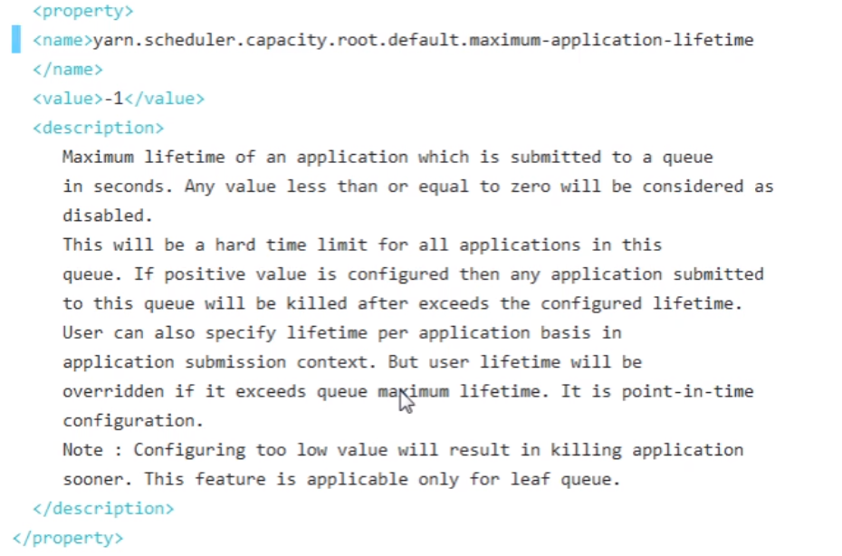
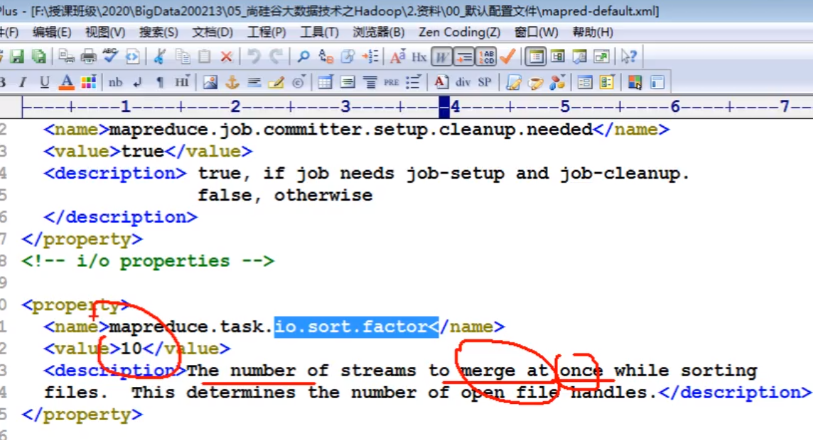

# 20-04-20

# Yarn资源调度器

## 1. 基本架构

Yam是一个资源调度平台，负责为运算程序提供服务器运算资源，相当于一个分布式的操作系统平台，而 MapReduce等运算程序则相当于运行于操作系统之上的应用程序。

NM随时向RM报备自己这里还有多少资源可用

AM:向NM申请资源,完成分配任务后自动注销

RM:负责分配资源

Container:主要看内存


## 2. 工作机制

客户端先与RM进行交互,假设现在客户端提交了个YarnRunner(LocalRunner本地,YarnRunner提交到远程)

1.申请一个Application

2.RM会返回一个提交路径(HDFS的临时路径)

3.提交一系列资源(包括打包好的代码)

4.资源提交完后,申请运行mrAppMaster(接口具体实现类)(需要资源区运行)

5.会把Task放调度队列里,挨个把资源往调度队列里放

6.NM会领取到Task任务

7.NM会开辟资源(Container):封装了CPU,内存

8.把资源下载到本地

9.NM向RM申请运行MapTask容器

10.领取任务创建容器

11.把整个程序编写成启动脚本,执行MapTask

如果MapTask多个分区就应该有两个Meduce

12.向RM申请两个容器,运行ReduceTask程序(Maptask的执行结果里拷贝过来)

13.生成对应的结果文件

14.MR会向RM注销自己(标记资源没人用了)


## 3. 资源调度器

Hadoop作业调度器主要有三种：FIFO(默认)、Capacity Scheduler(容量调度器)和Fair Scheduler(公平调度器)。Hadoop3.1.3默认的资源调度器是Capacity Scheduler。

具体设置详见：yarn-default.xml文件

```xml
<property>
    <description>The class to use as the resource scheduler.</description>
    <name>yarn.resourcemanager.scheduler.class</name>
<value>org.apache.hadoop.yarn.server.resourcemanager.scheduler.capacity.CapacityScheduler</value>
</property>
```

### 3.1FIFO

FIFO:先进先出,目前不用了,排队执行,不管有多少任务,全部放一条队列里面

会涌现给第一个资源进行资源调度,后面的在前面没结束的时候,就一直等着,因此如果前面任务要求资源很多,后面的就阻塞了)最初够用,现在并不灵活了


### 3.2 容量调度器

也是按到达时间排序,先到先服务,好在有多条队列,从侧面解决了FIFO的问题

每条资源可以配置资源占比,并且对同一用户所占资源进行限定

提交job的时候可以指定队列,没指定就会进行计算一条相对空闲的资源

资源虽然分配了,但是资源是可以共享的(如B可以共享给A一部分,即临时摞给另一队列去用)(有个资源保障,即自己要保证自己最低资源要保证有多少,用别人的最多保证要多少)


### 3.3 公平调度器（Fair Scheduler）

具体到某一队列上时,从根本上解决FIFO问题,随着时间推移,里面队列里都有资格去执行

同一队列,后面均分(也不均分,有个最大最小公平算法)


公平调度器设计目标是：在时间尺度上，所有作业获得公平的资源。

某时刻一个作业应获资源和实际获取资源的差距叫“缺额调度器会优先为缺额大的作业分配资源

新增作业:如果作业已满不会给它资源,如果空闲出来就会给它了

它会让小的任务在合理的时间完成，同时不会让需要长时间运行的耗费大量资源的应用挨饿！

如果一个队列中有两个应用程序同时运行，则每个应用程序可得到1/2的资源；如果三个应用程序同时运行，则每个应用程序可得到1/3的资源

支持资源抢占。当某个队列中有剩余资源时，调度器会将这些资源共享给其他队列，而当该队列中有新的应用程序提交时，调度器要为它回收资源。为了尽可能降低不必要的计算浪费，调度器采用了先等待再强制回收的策略，即如果等待一段时间后尚有未归还的资源，则会进行资源抢占：从那些超额使用资源的队列中杀死一部分任务，进而释放资源。

#### 最大最小公平算法

不加权

有一四个用户的集合,资源需求分别是2, 2.6 , 4, 5,其资源总能力为10,为其计算最大最小公平分配

解决方法:

我们通过几轮的计算来计算最大最小公平分配.
第一轮,我们暂时将资源划分成4个大小为2.5的.由于这超过了用户1的需求,这使得剩了0.5个均匀的分配给剩下的3个人资源,给予他们每个2.66.这又超过了用户2的需求,所以我们拥有额外的0.066…来分配给剩下的两个用户,给予每个用户2.5+0.66…+0.033…=2.7.因此公平分配是:用户1得到2,用户2得到2.6,用户3和用户4每个都得到2.7.

加权

有一四个用户的集合,资源需求分别是4,2,10,4,权重分别是2.5,4,0.5,1,资源总能力是16,为其计算最大最小公平分配.

解决方法:

第一步是标准化权重,将最小的权重设置为1.这样权重集合更新为5,8,1,2.这样需要的资源是5+8+1+2=16份.因此将资源划分成16份.在资源分配的每一轮,我们按照权重的比例来划分资源,因此,在第一轮,,用户分别获得5,8,1,2单元的资源,用户1得到了5个资源,但是只需要4,所以多了1个资源,同样的,用户2多了6个资源.用户3和用户4拖欠了,因为他们的配额低于需求.现在我们有7个资源可以分配给用户3和用户4.他们的权重分别是1和2,给予用户3额外的7 × 1/3资源和用户4额外的7 × 2/3资源.这会导致用户4的配额达到了2 + 7 × 2/3 = 6.666,超过了需求.所以我们将额外的2.666单元给用户3,最终获得1 + 7/3 + 2.666 = 6单元.最终的分配是,4,2,6,4,这就是带权重的最大最小公平分配.


## 容量调度器多队列提交案例


最大容量

(刚刚额定是40,最大能摞到60)


running


运行那些人能够管理(改成任何人


访问控制列表(谁能提交配置优先级)


最大的生存时间(-1没有任何限制)



仍然不做任何限制


```xml
<!-- 指定多队列 -->
<property>
    <name>yarn.scheduler.capacity.root.queues</name>
    <value>default,hive</value>
 </property>
<!-- 指定default队列的额定容量 -->
<property>
    <name>yarn.scheduler.capacity.root.default.capacity</name>
    <value>40</value>
</property>
<!-- 指定hive队列的额定容量 -->
<property>
    <name>yarn.scheduler.capacity.root.hive.capacity</name>
    <value>60</value>
</property>
<!-- 指定default队列允许单用户占用的资源占比 -->
<property>
    <name>yarn.scheduler.capacity.root.default.user-limit-factor</name>
    <value>1</value>
</property>
<!-- 指定hive队列允许单用户占用的资源占比 -->
<property>
    <name>yarn.scheduler.capacity.root.hive.user-limit-factor</name>
    <value>1</value>
</property>
<!-- 指定default队列的最大容量-->
<property>
    <name>yarn.scheduler.capacity.root.default.maximum-capacity</name>
    <value>60</value>
</property>
<!-- 指定hive队列的最大容量-->
<property>
    <name>yarn.scheduler.capacity.root.hive.maximum-capacity</name>
    <value>80</value>
</property>
<!-- 指定default队列的状态 -->
<property>
    <name>yarn.scheduler.capacity.root.default.state</name>
    <value>RUNNING</value>
</property>
<!-- 指定hive队列的状态 -->
<property>
    <name>yarn.scheduler.capacity.root.hive.state</name>
    <value>RUNNING</value>
</property>
<!-- 指定default队列允许哪些用户提交job-->
<property>
    <name>yarn.scheduler.capacity.root.default.acl_submit_applications</name>
    <value>*</value>
</property>
<!-- 指定hive队列允许哪些用户提交job-->
<property>
    <name>yarn.scheduler.capacity.root.hive.acl_submit_applications</name>
    <value>*</value>
</property>
<!-- 指定default队列允许哪些用户进行管理-->
<property>
    <name>yarn.scheduler.capacity.root.default.acl_administer_queue</name>
    <value>*</value>
</property>
<!-- 指定hive队列允许哪些用户进行管理-->
<property>
    <name>yarn.scheduler.capacity.root.hive.acl_administer_queue</name>
    <value>*</value>
</property>
<!-- 指定default队列允许哪些用户提交配置优先级的job-->
<property>       <name>yarn.scheduler.capacity.root.default.acl_application_max_priority</name>
    <value>*</value>
</property>
<!--指定hive队列允许哪些用户提交配置优先级的job -->

<property>
  <name>yarn.scheduler.capacity.root.hive.acl_application_max_priority</name>
    <value>*</value>
</property>
<!-- 指定default队列允许job运行的最大时间-->
<property>
     <name>yarn.scheduler.capacity.root.default.maximum-application-lifetime
     </name>
     <value>-1</value>
 </property>
<!-- 指定hive队列允许job运行的最大时间-->
 <property>
     <name>yarn.scheduler.capacity.root.hive.maximum-application-lifetime
     </name>
     <value>-1</value>
 </property>
<!-- 指定default队列允许job运行的默认时间-->
 <property>
     <name>yarn.scheduler.capacity.root.default.default-application-lifetime
     </name>
     <value>-1</value>  
</property>
<!-- 指定hive队列允许job运行的最大时间-->
<property>
     <name>yarn.scheduler.capacity.root.hive.default-application-lifetime
     </name>
     <value>-1</value>
</property>
```

配置好了分发启动即可


启动后


虚线:额定容量,实现框框:最大的容量

绿色:正在使用的资源

展开画风:


向hive提交任务

```java
public class WcDrvier {
    public static void main(String[] args) throws IOException, ClassNotFoundException, InterruptedException {
        Configuration configuration = new Configuration();

        configuration.set("mapred.job.queue.name", "hive");

        //1. 获取一个Job实例
        Job job = Job.getInstance(configuration);

        //2. 设置类路径
        job.setJarByClass(WcDrvier.class);

        //3. 设置Mapper和Reducer
        job.setMapperClass(WcMapper.class);
        job.setReducerClass(WcReducer.class);

        //4. 设置Mapper和Reducer的输出类型
        job.setMapOutputKeyClass(Text.class);
        job.setMapOutputValueClass(IntWritable.class);

        job.setOutputKeyClass(Text.class);
        job.setOutputValueClass(IntWritable.class);

        job.setCombinerClass(WcReducer.class);

        //5. 设置输入输出文件
        FileInputFormat.setInputPaths(job, new Path(args[0]));
        FileOutputFormat.setOutputPath(job, new Path(args[1]));

        //6. 提交Job
        boolean b = job.waitForCompletion(true);
        System.exit(b ? 0 : 1);
    }
}
```


## 任务的推测执行

提交的job弱长时间未完成会延缓进度,看有没有拖后腿的任务,

执行推测任务的前提条件

（1）每个Task只能有一个备份任务

（2）当前Job已完成的Task必须不小于0.05（5%）

（3）开启推测执行参数设置。mapred-site.xml文件中默认是打开的。

```xml
<property>
  	<name>mapreduce.map.speculative</name>
  	<value>true</value>
  	<description>If true, then multiple instances of some map tasks may be executed in parallel.</description>
</property>

<property>
  	<name>mapreduce.reduce.speculative</name>
  	<value>true</value>
  	<description>If true, then multiple instances of some reduce tasks may be executed in parallel.</description>
</property>
```

不能启用推测执行机制情况

  （1）任务间存在严重的负载倾斜；

  （2）特殊任务，比如任务向数据库中写数据。

一般备份任务比原来任务要优先执行完成


# Hadoop数据压缩

suffle落盘的时候有IO操作,数据量大的话可以采用压缩,KV的时候也可以压缩,以及map输入数据的时候

压缩技术能够有效减少底层存储系统（HDFS）读写字节数。压缩提高了网络带宽和磁盘空间的效率。在运行MR程序时，Io操作、网络数据传输、 Shuffle和 Merge要花大量的时间，尤其是数据规模很大和工作负载密集的情兄下，因此，使用数据压缩显得非常重要。
鉴于磁盘Io和网络带宽是 Hadoop的宝贵资源，数据压缩对于节省资源、最小化磁盘Io和网络传输非常有帮助。可以在任意 MapReduce阶段启用压。不过，尽管压缩与解压操作的cPU开销不高，其性能的提升和资源昀节省并非没有代价。

压缩解压缩会消耗资源,也要考虑资源开销在内

压缩是提高 Hadoop运行效率的一种优化策略通过对 Mappel、 Reducer运行过程的数据进行压缩，以减少磁盘IO提高MR程序运行速度。
注意：采用压缩技术减少了磁盘Io，但同时增加了cPU运算负担。所以，压缩特性运用得当能提高性能，但运用不当也可能『低性能。
压缩基本原则
（1）运算密集型的ob，少用压缩
（2）Io密集型的job，多用压缩

## ***\*MR支持的压缩编码\****


常用:lzo,snappy


压缩率和压缩速度是相互对立的

On a single core of a Core i7 processor in 64-bit mode, Snappy compresses at about 250 MB/sec or more and decompresses at about 500 MB/sec or more.

snappy压缩解压缩几乎是不消耗时间的,比较适合用在suffle过程中

压缩方式选择

### ***\*Gzip压缩\****

优点：压缩率比较高，而且压缩解压速度也比较快； Hadoop本身支持，在应用中处理Gp格式的文件就和直接处理文本一样；大部分Linx系统都自带Gzp命令，使用方便。
缺点：不支持$plit应用场景：当每个文件压缩之后在130M以内的（1个块大小内），都可以考虑用Gzp压缩格式。例如说一天或者一个小时的日志压缩成一个Gzp文件

###  ***\*B\*******\*zip2压缩\****

优点：支持 Split；具有很高的压缃率，比Gzp压缩率都高； Hadoop本身自带，使用方便。
缺点：压缩解压連度愠。
应用场景：适合对速度要求不高，但需要较高的压缩率的时候；或者输出之后的数据比较大，处理之后的数据需要压缩存档减少磁盘空间并且以后数据用得比较少的情兄；或者对单个很大的文本文件想压缩咸少存情空间，同时又需要支持splt，而且秉容之前的应用程序的情兄

即存档,不常用

### ***\*L\*******\*zo压缩\****

优点：压缩解压連度也比较快，合理的压缩率；支持 Split，是 Hadoop中最流行的压缩格式；可以在LiI系统下安装1zp命令，使用方便缺点：压缩率比Gzip要低一些； Hadoop本身不支持，需要安装；在应用中双z格式的文件需要做一些特殊处理（为了支持Spli需要建索引，还需要指定 putFormat为Lzo格式）
应用场景：一个很大的文本文件，压缩之后还大于200M以上的可以考虑，而且单个文件越大，Lz0优点越越明显

###  Snappy压缩

优点：高速压缩連度和合理的压率。
缺点：不支持Splt；压缩率比Gzip要低； 
应用场景：当 MapReduce作业的Ma输出的数据比较大的时候，作为Map到educe的中间数据的压缩格式；或者作为一个 MapReduce作业的输出和另外个 MapReduce作业的输入

## ***\*压缩位置选择\****


到map:mr支持,直接给它一个压缩文件,让它计算即可

mapdaoreduce:snappy和lzo比较合适,因为这段时间比较考虑计算性能

reduce输出后考虑作用,要存档还是接着计算,这时考虑压缩率以后还得考虑是否支持切片


- IntelliJ IDEA 项目结构旁边出现 0%classes0% lines covered
- 使用ctrl + ALT + F6弹出如下框取消勾选-->点击Show Selected就可以去掉了

## 压缩的使用

### 数据流的压缩

使用支持压缩的输出流将字节数据写出就实现压缩

### 数据流的解压缩

使用支持压缩的输入流将字节数据读取就实现接压缩

```java
package com.atguigu.mapreduce.compress;
import java.io.File;
import java.io.FileInputStream;
import java.io.FileNotFoundException;
import java.io.FileOutputStream;
import java.io.IOException;
import org.apache.hadoop.conf.Configuration;
import org.apache.hadoop.fs.Path;
import org.apache.hadoop.io.IOUtils;
import org.apache.hadoop.io.compress.CompressionCodec;
import org.apache.hadoop.io.compress.CompressionCodecFactory;
import org.apache.hadoop.io.compress.CompressionInputStream;
import org.apache.hadoop.io.compress.CompressionOutputStream;
import org.apache.hadoop.util.ReflectionUtils;

public class TestCompress {

	public static void main(String[] args) throws Exception {
		compress("e:/hello.txt","org.apache.hadoop.io.compress.BZip2Codec");
//		decompress("e:/hello.txt.bz2","e:/hello.txt");
	}

	// 1、压缩
	private static void compress(String filename, String method) throws Exception {
		
		// （1）获取输入流
		FileInputStream fis = new FileInputStream(new File(filename));
		
		Class codecClass = Class.forName(method);
		
		CompressionCodec codec = (CompressionCodec) ReflectionUtils.newInstance(codecClass, new Configuration());
		
		// （2）获取输出流
		FileOutputStream fos = new FileOutputStream(new File(filename + codec.getDefaultExtension()));
		CompressionOutputStream cos = codec.createOutputStream(fos);
		
		// （3）流的对拷
		IOUtils.copyBytes(fis, cos, 1024*1024*5, false);
		
       // （4）关闭资源
		cos.close();
		fos.close();
	    fis.close();
	}

	// 2、解压缩
	private static void decompress(String filename,String dest) throws FileNotFoundException, IOException {
		
		// （0）校验是否能解压缩
		CompressionCodecFactory factory = new CompressionCodecFactory(new Configuration());

		CompressionCodec codec = factory.getCodec(new Path(filename));
		
		if (codec == null) {
			System.out.println("cannot find codec for file " + filename);
			return;
		}
		
		// （1）获取输入流
		CompressionInputStream cis = codec.createInputStream(new FileInputStream(new File(filename)));
		
		// （2）获取输出流
		FileOutputStream fos = new FileOutputStream(new File(dest));
		
		// （3）流的对拷
		IOUtils.copyBytes(cis, fos, 1024*1024*5, false);
		
		// （4）关闭资源
		cis.close();
		fos.close();
	}
}
```

压缩后的文件:


### 压缩格式配置

### map端


当前编解码器支持


在map输出的时候进行压缩


压缩的区别


### Reduce端


输出文件


压缩后文件,无法直接打开了

# Hadoop企业优化

MapReduce程序效率的瓶颈在于两点：
1.计算机性能CPU、内存、磁盘健康、网络
2.|O操作优化
（1）数据倾斜
（2）Map和 Reduce数设置不合理
（3）Map运行时间太长，导致 reduce等待过久
（4）小又件过多
（5）大量的不可分块的超大文件
（6）spill次数过多
（7） Merge次数过多等

看看有个印象就可以了,整体了解就行

## MapReduce优化方法

### ***\*数据输入\****

（1）合并小文件：在执行任务前将小文件进行合并，大量的小文件会产生大量的Map任务，增大Map任务装载次数，而任务的装载比较耗时，从而导致MR运行较。
（2）米用 CombineTextInυ unFormat来作为输入，解决输入端大量小文件场景。

### Map阶段

（1）减少溢写（Spill）次数：通过调整io.sort.mb及sort.spill.percent参数值，增大触发Spill的内存上限，减少Spill次数，从而减少磁盘IO。即增大缓冲区
（2）减少合并（Merge）次数：通过调整io.sort.factor参数，增大Merge的文件数目，减少Merge的次数，从而缩短MR处理时间。

（3）在Map之后，不影响业务逻辑前提下，先进行Combine处理，减少 I/O。因为combine会减少IO

### Reduce阶段

（4）合理设 REduce端的Bufr：默认情兄下，数据达到一个阈直的时候， Bufe中的数据就会写入磁盘，然后 Reduce会从磁盘中获得所有的数据。也就是说， Buffer和 Reduce是没有直接关联的，中间多次写磁盘·读磁盘的过程，既然有这个弊端，那么就可次通过参数来配置，使得Bnf中的一部分数据可以直接输送到 Reduce，从而咸少Io开销：mapreduce reduce input buffer percent，默认为00.当值大于0的时候，会保留指定比例的内存读 Buffer中的数据直接拿给Reduce使用。这样一来，设置 Buffer需要内存，读取数据需要内存， Reduce计算也要内存，所以要根据作业的运行情兄进行调整。

也会有多次的读写磁盘

## 数据倾斜问题

### 现象

数据频率倾斜—某一个区域的数据量要远远大于其他区域

数据大小顷斜部分记录的大小远远大于平均值

### 减少

方法1：抽样和范国分区可以通过对原始数据井行抽样得到的结果集来预设分区边界值


方法2：自定义分区

基于输出键的背景知识进行自定义分区。例如，如果Map锏出键的单来源于本书。且封中某几个专业词匚较多。那么就可以自定义分区将这这些专业词汇发送给固定的一部分 Reduce实例。而将其他的都发送给剩余的 Reduce实例。

方法3：Conbine

使用 Combine可以大量地咸小数据"斜斗。在可能的情兄下， Comb ine的目的就是聚台并精简数据。

方法4：采用 Map Join，尽量避免 Reduce join。


## 常用的调优参数

见文档,了解即可

